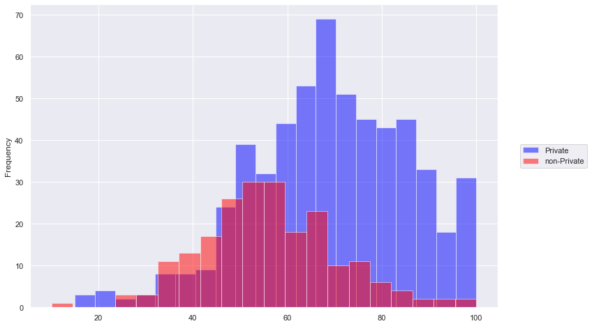

___

___
# K Means Clustering Project 

For this project we will attempt to use KMeans Clustering to cluster Universities into to two groups, Private and Public.

___
It is **very important to note, we actually have the labels for this data set, but we will NOT use them for the KMeans clustering algorithm, since that is an unsupervised learning algorithm.** 

When using the Kmeans algorithm under normal circumstances, it is because you don't have labels. In this case we will use the labels to try to get an idea of how well the algorithm performed, but you won't usually do this for Kmeans, so the classification report and confusion matrix at the end of this project, don't truly make sense in a real world setting!.
___

## The Data

We will use a data frame with 777 observations on the following 18 variables.
* Private A factor with levels No and Yes indicating private or public university
* Apps Number of applications received
* Accept Number of applications accepted
* Enroll Number of new students enrolled
* Top10perc Pct. new students from top 10% of H.S. class
* Top25perc Pct. new students from top 25% of H.S. class
* F.Undergrad Number of fulltime undergraduates
* P.Undergrad Number of parttime undergraduates
* Outstate Out-of-state tuition
* Room.Board Room and board costs
* Books Estimated book costs
* Personal Estimated personal spending
* PhD Pct. of faculty with Ph.D.’s
* Terminal Pct. of faculty with terminal degree
* S.F.Ratio Student/faculty ratio
* perc.alumni Pct. alumni who donate
* Expend Instructional expenditure per student
* Grad.Rate Graduation rate

## Import Libraries

** Import the libraries you usually use for data analysis.**


```python
import pandas as pd
import numpy as np
import seaborn as sns 
import matplotlib.pyplot as plt
%matplotlib inline

sns.set()
sns.set_style('darkgrid')
```

## Get the Data

** Read in the College_Data file using read_csv. Figure out how to set the first column as the index.**


```python
df = pd.read_csv('College_Data-Copy1')
```


```python
df2=df.set_index('Unnamed: 0')
df2.index.name = None

```

**Check the head of the data**


```python
df2.head()
```


<div>
<style scoped>
    .dataframe tbody tr th:only-of-type {
        vertical-align: middle;
    }

    .dataframe tbody tr th {
        vertical-align: top;
    }

    .dataframe thead th {
        text-align: right;
    }
</style>
<table border="1" class="dataframe">
  <thead>
    <tr style="text-align: right;">
      <th></th>
      <th>Private</th>
      <th>Apps</th>
      <th>Accept</th>
      <th>Enroll</th>
      <th>Top10perc</th>
      <th>Top25perc</th>
      <th>F.Undergrad</th>
      <th>P.Undergrad</th>
      <th>Outstate</th>
      <th>Room.Board</th>
      <th>Books</th>
      <th>Personal</th>
      <th>PhD</th>
      <th>Terminal</th>
      <th>S.F.Ratio</th>
      <th>perc.alumni</th>
      <th>Expend</th>
      <th>Grad.Rate</th>
    </tr>
  </thead>
  <tbody>
    <tr>
      <th>Abilene Christian University</th>
      <td>Yes</td>
      <td>1660</td>
      <td>1232</td>
      <td>721</td>
      <td>23</td>
      <td>52</td>
      <td>2885</td>
      <td>537</td>
      <td>7440</td>
      <td>3300</td>
      <td>450</td>
      <td>2200</td>
      <td>70</td>
      <td>78</td>
      <td>18.1</td>
      <td>12</td>
      <td>7041</td>
      <td>60</td>
    </tr>
    <tr>
      <th>Adelphi University</th>
      <td>Yes</td>
      <td>2186</td>
      <td>1924</td>
      <td>512</td>
      <td>16</td>
      <td>29</td>
      <td>2683</td>
      <td>1227</td>
      <td>12280</td>
      <td>6450</td>
      <td>750</td>
      <td>1500</td>
      <td>29</td>
      <td>30</td>
      <td>12.2</td>
      <td>16</td>
      <td>10527</td>
      <td>56</td>
    </tr>
    <tr>
      <th>Adrian College</th>
      <td>Yes</td>
      <td>1428</td>
      <td>1097</td>
      <td>336</td>
      <td>22</td>
      <td>50</td>
      <td>1036</td>
      <td>99</td>
      <td>11250</td>
      <td>3750</td>
      <td>400</td>
      <td>1165</td>
      <td>53</td>
      <td>66</td>
      <td>12.9</td>
      <td>30</td>
      <td>8735</td>
      <td>54</td>
    </tr>
    <tr>
      <th>Agnes Scott College</th>
      <td>Yes</td>
      <td>417</td>
      <td>349</td>
      <td>137</td>
      <td>60</td>
      <td>89</td>
      <td>510</td>
      <td>63</td>
      <td>12960</td>
      <td>5450</td>
      <td>450</td>
      <td>875</td>
      <td>92</td>
      <td>97</td>
      <td>7.7</td>
      <td>37</td>
      <td>19016</td>
      <td>59</td>
    </tr>
    <tr>
      <th>Alaska Pacific University</th>
      <td>Yes</td>
      <td>193</td>
      <td>146</td>
      <td>55</td>
      <td>16</td>
      <td>44</td>
      <td>249</td>
      <td>869</td>
      <td>7560</td>
      <td>4120</td>
      <td>800</td>
      <td>1500</td>
      <td>76</td>
      <td>72</td>
      <td>11.9</td>
      <td>2</td>
      <td>10922</td>
      <td>15</td>
    </tr>
  </tbody>
</table>
</div>


** Check the info() and describe() methods on the data.**


```python
df2.info()
```

    <class 'pandas.core.frame.DataFrame'>
    Index: 777 entries, Abilene Christian University to York College of Pennsylvania
    Data columns (total 18 columns):
    Private        777 non-null object
    Apps           777 non-null int64
    Accept         777 non-null int64
    Enroll         777 non-null int64
    Top10perc      777 non-null int64
    Top25perc      777 non-null int64
    F.Undergrad    777 non-null int64
    P.Undergrad    777 non-null int64
    Outstate       777 non-null int64
    Room.Board     777 non-null int64
    Books          777 non-null int64
    Personal       777 non-null int64
    PhD            777 non-null int64
    Terminal       777 non-null int64
    S.F.Ratio      777 non-null float64
    perc.alumni    777 non-null int64
    Expend         777 non-null int64
    Grad.Rate      777 non-null int64
    dtypes: float64(1), int64(16), object(1)
    memory usage: 115.3+ KB
    


```python
df2.describe()
```


<div>
<style scoped>
    .dataframe tbody tr th:only-of-type {
        vertical-align: middle;
    }

    .dataframe tbody tr th {
        vertical-align: top;
    }

    .dataframe thead th {
        text-align: right;
    }
</style>
<table border="1" class="dataframe">
  <thead>
    <tr style="text-align: right;">
      <th></th>
      <th>Apps</th>
      <th>Accept</th>
      <th>Enroll</th>
      <th>Top10perc</th>
      <th>Top25perc</th>
      <th>F.Undergrad</th>
      <th>P.Undergrad</th>
      <th>Outstate</th>
      <th>Room.Board</th>
      <th>Books</th>
      <th>Personal</th>
      <th>PhD</th>
      <th>Terminal</th>
      <th>S.F.Ratio</th>
      <th>perc.alumni</th>
      <th>Expend</th>
      <th>Grad.Rate</th>
    </tr>
  </thead>
  <tbody>
    <tr>
      <th>count</th>
      <td>777.000000</td>
      <td>777.000000</td>
      <td>777.000000</td>
      <td>777.000000</td>
      <td>777.000000</td>
      <td>777.000000</td>
      <td>777.000000</td>
      <td>777.000000</td>
      <td>777.000000</td>
      <td>777.000000</td>
      <td>777.000000</td>
      <td>777.000000</td>
      <td>777.000000</td>
      <td>777.000000</td>
      <td>777.000000</td>
      <td>777.000000</td>
      <td>777.00000</td>
    </tr>
    <tr>
      <th>mean</th>
      <td>3001.638353</td>
      <td>2018.804376</td>
      <td>779.972973</td>
      <td>27.558559</td>
      <td>55.796654</td>
      <td>3699.907336</td>
      <td>855.298584</td>
      <td>10440.669241</td>
      <td>4357.526384</td>
      <td>549.380952</td>
      <td>1340.642214</td>
      <td>72.660232</td>
      <td>79.702703</td>
      <td>14.089704</td>
      <td>22.743887</td>
      <td>9660.171171</td>
      <td>65.46332</td>
    </tr>
    <tr>
      <th>std</th>
      <td>3870.201484</td>
      <td>2451.113971</td>
      <td>929.176190</td>
      <td>17.640364</td>
      <td>19.804778</td>
      <td>4850.420531</td>
      <td>1522.431887</td>
      <td>4023.016484</td>
      <td>1096.696416</td>
      <td>165.105360</td>
      <td>677.071454</td>
      <td>16.328155</td>
      <td>14.722359</td>
      <td>3.958349</td>
      <td>12.391801</td>
      <td>5221.768440</td>
      <td>17.17771</td>
    </tr>
    <tr>
      <th>min</th>
      <td>81.000000</td>
      <td>72.000000</td>
      <td>35.000000</td>
      <td>1.000000</td>
      <td>9.000000</td>
      <td>139.000000</td>
      <td>1.000000</td>
      <td>2340.000000</td>
      <td>1780.000000</td>
      <td>96.000000</td>
      <td>250.000000</td>
      <td>8.000000</td>
      <td>24.000000</td>
      <td>2.500000</td>
      <td>0.000000</td>
      <td>3186.000000</td>
      <td>10.00000</td>
    </tr>
    <tr>
      <th>25%</th>
      <td>776.000000</td>
      <td>604.000000</td>
      <td>242.000000</td>
      <td>15.000000</td>
      <td>41.000000</td>
      <td>992.000000</td>
      <td>95.000000</td>
      <td>7320.000000</td>
      <td>3597.000000</td>
      <td>470.000000</td>
      <td>850.000000</td>
      <td>62.000000</td>
      <td>71.000000</td>
      <td>11.500000</td>
      <td>13.000000</td>
      <td>6751.000000</td>
      <td>53.00000</td>
    </tr>
    <tr>
      <th>50%</th>
      <td>1558.000000</td>
      <td>1110.000000</td>
      <td>434.000000</td>
      <td>23.000000</td>
      <td>54.000000</td>
      <td>1707.000000</td>
      <td>353.000000</td>
      <td>9990.000000</td>
      <td>4200.000000</td>
      <td>500.000000</td>
      <td>1200.000000</td>
      <td>75.000000</td>
      <td>82.000000</td>
      <td>13.600000</td>
      <td>21.000000</td>
      <td>8377.000000</td>
      <td>65.00000</td>
    </tr>
    <tr>
      <th>75%</th>
      <td>3624.000000</td>
      <td>2424.000000</td>
      <td>902.000000</td>
      <td>35.000000</td>
      <td>69.000000</td>
      <td>4005.000000</td>
      <td>967.000000</td>
      <td>12925.000000</td>
      <td>5050.000000</td>
      <td>600.000000</td>
      <td>1700.000000</td>
      <td>85.000000</td>
      <td>92.000000</td>
      <td>16.500000</td>
      <td>31.000000</td>
      <td>10830.000000</td>
      <td>78.00000</td>
    </tr>
    <tr>
      <th>max</th>
      <td>48094.000000</td>
      <td>26330.000000</td>
      <td>6392.000000</td>
      <td>96.000000</td>
      <td>100.000000</td>
      <td>31643.000000</td>
      <td>21836.000000</td>
      <td>21700.000000</td>
      <td>8124.000000</td>
      <td>2340.000000</td>
      <td>6800.000000</td>
      <td>103.000000</td>
      <td>100.000000</td>
      <td>39.800000</td>
      <td>64.000000</td>
      <td>56233.000000</td>
      <td>118.00000</td>
    </tr>
  </tbody>
</table>
</div>


## EDA

It's time to create some data visualizations!

** Create a scatterplot of Grad.Rate versus Room.Board where the points are colored by the Private column. **


```python
plt.figure (figsize=(7,6))

sns.scatterplot(x='Room.Board',y='Grad.Rate',data=df2,hue='Private')
plt.legend(loc='center right', bbox_to_anchor=(1.25, 0.5), ncol=1)
```


    <matplotlib.legend.Legend at 0x2178b147da0>


```python
df2.columns
```


    Index(['Private', 'Apps', 'Accept', 'Enroll', 'Top10perc', 'Top25perc',
           'F.Undergrad', 'P.Undergrad', 'Outstate', 'Room.Board', 'Books',
           'Personal', 'PhD', 'Terminal', 'S.F.Ratio', 'perc.alumni', 'Expend',
           'Grad.Rate'],
          dtype='object')


**Create a scatterplot of F.Undergrad versus Outstate where the points are colored by the Private column.**


```python
plt.figure (figsize=(7,6))

sns.scatterplot(y='F.Undergrad',x='Outstate',data=df2,hue='Private')
plt.legend(loc='center right', bbox_to_anchor=(1.25, 0.5), ncol=1)
```


    <matplotlib.legend.Legend at 0x2178b06dba8>


```python
df2.columns
```


    Index(['Private', 'Apps', 'Accept', 'Enroll', 'Top10perc', 'Top25perc',
           'F.Undergrad', 'P.Undergrad', 'Outstate', 'Room.Board', 'Books',
           'Personal', 'PhD', 'Terminal', 'S.F.Ratio', 'perc.alumni', 'Expend',
           'Grad.Rate'],
          dtype='object')


** Create a stacked histogram showing Out of State Tuition based on the Private column. Try doing this using [sns.FacetGrid](https://stanford.edu/~mwaskom/software/seaborn/generated/seaborn.FacetGrid.html). If that is too tricky, see if you can do it just by using two instances of pandas.plot(kind='hist'). **


```python
plt.figure(figsize=(6,4))
g = sns.FacetGrid(df2,hue='Private', palette='coolwarm',size=6,aspect=2)
g = g.map(plt.hist,'Outstate',bins=20,alpha=0.7)
```

    C:\Users\User\Anaconda3\lib\site-packages\seaborn\axisgrid.py:230: UserWarning: The `size` paramter has been renamed to `height`; please update your code.
      warnings.warn(msg, UserWarning)
    


    <Figure size 432x288 with 0 Axes>


```python
plt.figure(figsize=(12,6),)
df2[df2['Private']=='Yes']['Outstate'].plot(kind='hist',bins=20,alpha=0.5,color='Blue',label='Private')
df2[df2['Private']=='No']['Outstate'].plot(kind='hist',bins=20,alpha=0.5,color='Red',label='non-Private')
plt.legend(loc='center right', bbox_to_anchor=(1.2, 0.5), ncol=1)
```


    <matplotlib.legend.Legend at 0x217ce7e0d30>


**Create a similar histogram for the Grad.Rate column.**


```python
plt.figure(figsize=(12,8))
df2[df2['Private']=='Yes']['Grad.Rate'].plot(kind='hist',bins=20,alpha=0.5,color='Blue',label='Private')
df2[df2['Private']=='No']['Grad.Rate'].plot(kind='hist',bins=20,alpha=0.5,color='Red',label='non-Private')
plt.legend(loc='center right', bbox_to_anchor=(1.2, 0.5), ncol=1)
```


    <matplotlib.legend.Legend at 0x217bd4fb908>


** Notice how there seems to be a private school with a graduation rate of higher than 100%.What is the name of that school?**


```python
df2[(df2['Grad.Rate']>100)]
```


<div>
<style scoped>
    .dataframe tbody tr th:only-of-type {
        vertical-align: middle;
    }

    .dataframe tbody tr th {
        vertical-align: top;
    }

    .dataframe thead th {
        text-align: right;
    }
</style>
<table border="1" class="dataframe">
  <thead>
    <tr style="text-align: right;">
      <th></th>
      <th>Private</th>
      <th>Apps</th>
      <th>Accept</th>
      <th>Enroll</th>
      <th>Top10perc</th>
      <th>Top25perc</th>
      <th>F.Undergrad</th>
      <th>P.Undergrad</th>
      <th>Outstate</th>
      <th>Room.Board</th>
      <th>Books</th>
      <th>Personal</th>
      <th>PhD</th>
      <th>Terminal</th>
      <th>S.F.Ratio</th>
      <th>perc.alumni</th>
      <th>Expend</th>
      <th>Grad.Rate</th>
    </tr>
  </thead>
  <tbody>
    <tr>
      <th>Cazenovia College</th>
      <td>Yes</td>
      <td>3847</td>
      <td>3433</td>
      <td>527</td>
      <td>9</td>
      <td>35</td>
      <td>1010</td>
      <td>12</td>
      <td>9384</td>
      <td>4840</td>
      <td>600</td>
      <td>500</td>
      <td>22</td>
      <td>47</td>
      <td>14.3</td>
      <td>20</td>
      <td>7697</td>
      <td>118</td>
    </tr>
  </tbody>
</table>
</div>


** Set that school's graduation rate to 100 so it makes sense. You may get a warning not an error) when doing this operation, so use dataframe operations or just re-do the histogram visualization to make sure it actually went through.**


```python
df2.drop('Cazenovia College',axis=0,inplace=True)
```


```python
df2[(df2['Grad.Rate']>100)]
```


<div>
<style scoped>
    .dataframe tbody tr th:only-of-type {
        vertical-align: middle;
    }

    .dataframe tbody tr th {
        vertical-align: top;
    }

    .dataframe thead th {
        text-align: right;
    }
</style>
<table border="1" class="dataframe">
  <thead>
    <tr style="text-align: right;">
      <th></th>
      <th>Private</th>
      <th>Apps</th>
      <th>Accept</th>
      <th>Enroll</th>
      <th>Top10perc</th>
      <th>Top25perc</th>
      <th>F.Undergrad</th>
      <th>P.Undergrad</th>
      <th>Outstate</th>
      <th>Room.Board</th>
      <th>Books</th>
      <th>Personal</th>
      <th>PhD</th>
      <th>Terminal</th>
      <th>S.F.Ratio</th>
      <th>perc.alumni</th>
      <th>Expend</th>
      <th>Grad.Rate</th>
    </tr>
  </thead>
  <tbody>
  </tbody>
</table>
</div>


```python
plt.figure(figsize=(12,8))
df2[df2['Private']=='Yes']['Grad.Rate'].plot(kind='hist',bins=20,alpha=0.5,color='Blue',label='Private')
df2[df2['Private']=='No']['Grad.Rate'].plot(kind='hist',bins=20,alpha=0.5,color='Red',label='non-Private')
plt.legend(loc='center right', bbox_to_anchor=(1.2, 0.5), ncol=1)
```


    <matplotlib.legend.Legend at 0x217be9a5e10>





## K Means Cluster Creation

Now it is time to create the Cluster labels!

** Import KMeans from SciKit Learn.**


```python
from sklearn.cluster import KMeans
```

** Create an instance of a K Means model with 2 clusters.**


```python
kmeans = KMeans(n_clusters=2)
```

**Fit the model to all the data except for the Private label.**


```python
kmeans.fit(df2[['Apps', 'Accept', 'Enroll', 'Top10perc', 'Top25perc',
       'F.Undergrad', 'P.Undergrad', 'Outstate', 'Room.Board', 'Books',
       'Personal', 'PhD', 'Terminal', 'S.F.Ratio', 'perc.alumni', 'Expend',
       'Grad.Rate']])
```


    KMeans(algorithm='auto', copy_x=True, init='k-means++', max_iter=300,
           n_clusters=2, n_init=10, n_jobs=None, precompute_distances='auto',
           random_state=None, tol=0.0001, verbose=0)


** What are the cluster center vectors?**


```python
kmeans.cluster_centers_
```


    array([[1.81019012e+03, 1.28395359e+03, 4.90991018e+02, 2.53338323e+01,
            5.34985030e+01, 2.19031287e+03, 5.96332335e+02, 1.03972231e+04,
            4.31057335e+03, 5.41895210e+02, 1.28150449e+03, 7.05149701e+01,
            7.78712575e+01, 1.40994012e+01, 2.31796407e+01, 8.93389521e+03,
            6.50404192e+01],
           [1.03631389e+04, 6.55089815e+03, 2.56972222e+03, 4.14907407e+01,
            7.02037037e+01, 1.30619352e+04, 2.46486111e+03, 1.07191759e+04,
            4.64347222e+03, 5.95212963e+02, 1.71420370e+03, 8.63981481e+01,
            9.13333333e+01, 1.40277778e+01, 2.00740741e+01, 1.41705000e+04,
            6.75925926e+01]])


```python
kmeans.labels_
```


    array([0, 0, 0, 0, 0, 0, 0, 0, 0, 0, 0, 0, 0, 0, 0, 0, 0, 0, 0, 0, 1, 1,
           0, 1, 0, 0, 0, 1, 0, 0, 0, 0, 0, 0, 0, 0, 0, 0, 0, 1, 0, 0, 0, 0,
           0, 0, 0, 0, 0, 0, 0, 0, 0, 0, 0, 0, 0, 0, 0, 1, 0, 1, 0, 0, 0, 0,
           0, 0, 0, 1, 1, 0, 0, 0, 0, 0, 0, 0, 1, 1, 0, 0, 0, 0, 0, 0, 0, 1,
           0, 0, 0, 0, 0, 0, 0, 0, 0, 0, 0, 0, 0, 0, 0, 0, 0, 0, 0, 0, 0, 0,
           0, 0, 0, 0, 0, 0, 0, 1, 0, 0, 0, 0, 0, 0, 0, 0, 0, 0, 0, 0, 0, 0,
           0, 0, 0, 0, 0, 0, 0, 0, 1, 0, 0, 1, 0, 0, 0, 0, 0, 0, 0, 0, 0, 0,
           0, 0, 0, 1, 0, 0, 0, 0, 0, 0, 0, 0, 0, 0, 0, 0, 0, 0, 0, 1, 0, 1,
           0, 0, 0, 0, 0, 0, 0, 0, 0, 0, 0, 0, 0, 0, 1, 0, 0, 0, 0, 0, 0, 0,
           0, 0, 0, 0, 1, 0, 0, 0, 0, 0, 0, 0, 0, 0, 0, 0, 0, 0, 0, 0, 1, 0,
           1, 1, 0, 0, 0, 0, 0, 0, 0, 0, 0, 0, 0, 0, 0, 0, 0, 0, 0, 0, 0, 0,
           0, 0, 0, 0, 0, 0, 0, 1, 0, 0, 0, 0, 0, 0, 1, 0, 0, 0, 0, 0, 0, 0,
           0, 0, 0, 0, 1, 0, 0, 0, 0, 1, 0, 0, 1, 0, 1, 0, 0, 0, 0, 1, 0, 0,
           0, 1, 0, 0, 0, 0, 0, 0, 0, 0, 0, 0, 0, 0, 0, 0, 0, 0, 0, 0, 0, 0,
           0, 0, 0, 0, 0, 0, 0, 0, 0, 0, 0, 0, 0, 0, 0, 1, 0, 0, 0, 0, 0, 0,
           0, 0, 0, 0, 0, 0, 0, 0, 0, 0, 0, 0, 0, 0, 0, 0, 0, 0, 0, 0, 0, 0,
           0, 1, 0, 0, 0, 0, 0, 0, 0, 0, 0, 0, 1, 1, 0, 0, 0, 0, 0, 0, 0, 0,
           0, 0, 0, 0, 0, 0, 0, 0, 0, 0, 0, 0, 0, 0, 0, 0, 0, 0, 0, 0, 0, 0,
           0, 0, 0, 0, 0, 0, 0, 0, 0, 0, 1, 0, 0, 0, 0, 1, 0, 0, 0, 0, 0, 1,
           1, 1, 0, 0, 0, 1, 0, 0, 0, 0, 0, 0, 0, 1, 0, 0, 0, 1, 0, 0, 0, 0,
           0, 0, 0, 0, 1, 0, 0, 0, 0, 0, 0, 0, 0, 0, 0, 0, 0, 0, 1, 0, 1, 0,
           0, 0, 0, 0, 0, 0, 0, 0, 0, 0, 0, 0, 0, 0, 0, 0, 0, 0, 0, 0, 1, 0,
           0, 0, 0, 0, 0, 0, 0, 0, 0, 0, 0, 0, 0, 0, 0, 0, 0, 0, 0, 0, 0, 0,
           0, 0, 0, 1, 0, 0, 0, 0, 0, 0, 0, 0, 0, 0, 0, 0, 0, 0, 0, 0, 0, 0,
           0, 0, 0, 0, 0, 0, 0, 1, 0, 0, 0, 0, 0, 0, 0, 0, 0, 0, 0, 0, 0, 0,
           0, 0, 0, 0, 0, 0, 0, 0, 0, 1, 1, 1, 1, 0, 0, 0, 0, 0, 0, 0, 0, 0,
           0, 0, 0, 1, 0, 0, 0, 0, 1, 0, 0, 0, 0, 0, 0, 0, 0, 0, 0, 0, 0, 0,
           0, 0, 1, 0, 0, 0, 0, 0, 0, 0, 1, 1, 1, 0, 1, 1, 1, 0, 0, 1, 0, 0,
           0, 0, 1, 1, 0, 1, 1, 1, 0, 1, 0, 1, 0, 0, 0, 0, 1, 1, 0, 1, 1, 0,
           0, 1, 0, 1, 0, 0, 0, 0, 1, 0, 1, 0, 1, 1, 0, 0, 0, 0, 1, 0, 0, 1,
           1, 1, 1, 1, 0, 0, 1, 0, 1, 0, 0, 0, 0, 0, 1, 1, 1, 0, 0, 0, 0, 0,
           1, 0, 1, 0, 0, 0, 0, 0, 1, 1, 1, 1, 0, 0, 0, 0, 0, 1, 1, 0, 0, 0,
           0, 0, 0, 1, 0, 1, 1, 0, 1, 0, 0, 0, 0, 0, 0, 1, 0, 0, 0, 0, 0, 0,
           1, 1, 0, 0, 0, 0, 0, 0, 0, 0, 0, 0, 0, 0, 0, 0, 1, 0, 0, 0, 0, 0,
           0, 0, 0, 0, 0, 0, 0, 0, 0, 0, 0, 0, 0, 0, 0, 0, 0, 0, 0, 0, 0, 0,
           0, 0, 0, 0, 1, 0])


```python
print('CLASTERIZED')
plt.scatter(df2['Apps'],df2['Expend'],s=15,c=kmeans.labels_,cmap='viridis')
```

    CLASTERIZED
    


    <matplotlib.collections.PathCollection at 0x217d0268c88>


```python
#real
#cmap = sns.cm.rocket_r
plt.scatter(df2['Apps'],df2['Expend'],s=15,c=df2['Cluster'],cmap='viridis_r')
```


    <matplotlib.collections.PathCollection at 0x217d03777b8>


## Evaluation

There is no perfect way to evaluate clustering if you don't have the labels, however since this is just an exercise, we do have the labels, so we take advantage of this to evaluate our clusters, keep in mind, you usually won't have this luxury in the real world.

** Create a new column for df called 'Cluster', which is a 1 for a Private school, and a 0 for a public school.**


```python
def conv(cluster):
    if cluster=='Yes':
        return 1
    else:
        return 0
```


```python
df2['Cluster'] = df2['Private'].apply(conv)
```


```python
df2.head()
```


<div>
<style scoped>
    .dataframe tbody tr th:only-of-type {
        vertical-align: middle;
    }

    .dataframe tbody tr th {
        vertical-align: top;
    }

    .dataframe thead th {
        text-align: right;
    }
</style>
<table border="1" class="dataframe">
  <thead>
    <tr style="text-align: right;">
      <th></th>
      <th>Private</th>
      <th>Apps</th>
      <th>Accept</th>
      <th>Enroll</th>
      <th>Top10perc</th>
      <th>Top25perc</th>
      <th>F.Undergrad</th>
      <th>P.Undergrad</th>
      <th>Outstate</th>
      <th>Room.Board</th>
      <th>Books</th>
      <th>Personal</th>
      <th>PhD</th>
      <th>Terminal</th>
      <th>S.F.Ratio</th>
      <th>perc.alumni</th>
      <th>Expend</th>
      <th>Grad.Rate</th>
      <th>Cluster</th>
    </tr>
  </thead>
  <tbody>
    <tr>
      <th>Abilene Christian University</th>
      <td>Yes</td>
      <td>1660</td>
      <td>1232</td>
      <td>721</td>
      <td>23</td>
      <td>52</td>
      <td>2885</td>
      <td>537</td>
      <td>7440</td>
      <td>3300</td>
      <td>450</td>
      <td>2200</td>
      <td>70</td>
      <td>78</td>
      <td>18.1</td>
      <td>12</td>
      <td>7041</td>
      <td>60</td>
      <td>1</td>
    </tr>
    <tr>
      <th>Adelphi University</th>
      <td>Yes</td>
      <td>2186</td>
      <td>1924</td>
      <td>512</td>
      <td>16</td>
      <td>29</td>
      <td>2683</td>
      <td>1227</td>
      <td>12280</td>
      <td>6450</td>
      <td>750</td>
      <td>1500</td>
      <td>29</td>
      <td>30</td>
      <td>12.2</td>
      <td>16</td>
      <td>10527</td>
      <td>56</td>
      <td>1</td>
    </tr>
    <tr>
      <th>Adrian College</th>
      <td>Yes</td>
      <td>1428</td>
      <td>1097</td>
      <td>336</td>
      <td>22</td>
      <td>50</td>
      <td>1036</td>
      <td>99</td>
      <td>11250</td>
      <td>3750</td>
      <td>400</td>
      <td>1165</td>
      <td>53</td>
      <td>66</td>
      <td>12.9</td>
      <td>30</td>
      <td>8735</td>
      <td>54</td>
      <td>1</td>
    </tr>
    <tr>
      <th>Agnes Scott College</th>
      <td>Yes</td>
      <td>417</td>
      <td>349</td>
      <td>137</td>
      <td>60</td>
      <td>89</td>
      <td>510</td>
      <td>63</td>
      <td>12960</td>
      <td>5450</td>
      <td>450</td>
      <td>875</td>
      <td>92</td>
      <td>97</td>
      <td>7.7</td>
      <td>37</td>
      <td>19016</td>
      <td>59</td>
      <td>1</td>
    </tr>
    <tr>
      <th>Alaska Pacific University</th>
      <td>Yes</td>
      <td>193</td>
      <td>146</td>
      <td>55</td>
      <td>16</td>
      <td>44</td>
      <td>249</td>
      <td>869</td>
      <td>7560</td>
      <td>4120</td>
      <td>800</td>
      <td>1500</td>
      <td>76</td>
      <td>72</td>
      <td>11.9</td>
      <td>2</td>
      <td>10922</td>
      <td>15</td>
      <td>1</td>
    </tr>
  </tbody>
</table>
</div>


** Create a confusion matrix and classification report to see how well the Kmeans clustering worked without being given any labels.**


```python
from sklearn.metrics import confusion_matrix,classification_report
```


```python
print(confusion_matrix(df2['Cluster'],kmeans.labels_))
```

    [[138  74]
     [530  34]]
    


```python
print(classification_report(df2['Cluster'],kmeans.labels_))
```

                  precision    recall  f1-score   support
    
               0       0.21      0.65      0.31       212
               1       0.31      0.06      0.10       564
    
        accuracy                           0.22       776
       macro avg       0.26      0.36      0.21       776
    weighted avg       0.29      0.22      0.16       776
    
    

Not so bad considering the algorithm is purely using the features to cluster the universities into 2 distinct groups! Hopefully you can begin to see how K Means is useful for clustering un-labeled data!

## Great Job!
