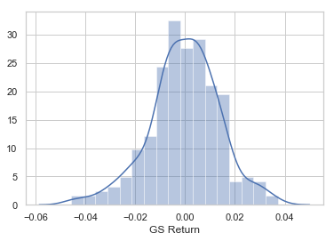
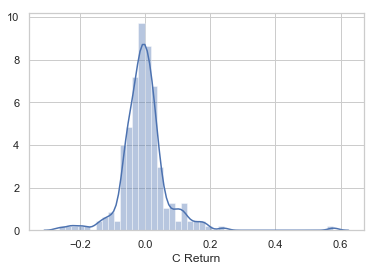
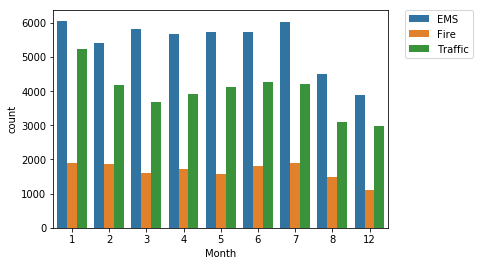
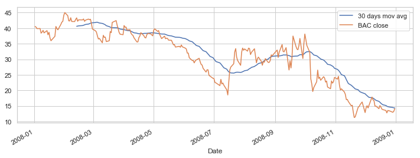
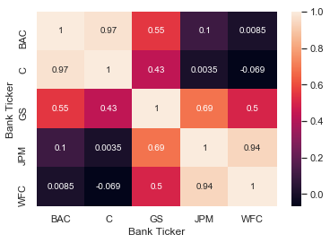
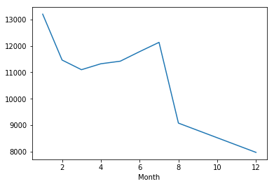

# Finance Data Project 

In this data project we will focus on exploratory data analysis of stock prices. Keep in mind, this project is just meant to practice your visualization and pandas skills, it is not meant to be a robust financial analysis or be taken as financial advice.
____
** NOTE: This project is extremely challenging because it will introduce a lot of new concepts and have you looking things up on your own (we'll point you in the right direction) to try to solve the tasks issued. Feel free to just go through the solutions lecture notebook and video as a "walkthrough" project if you don't want to have to look things up yourself. You'll still learn a lot that way! **
____
We'll focus on bank stocks and see how they progressed throughout the [financial crisis](https://en.wikipedia.org/wiki/Financial_crisis_of_2007%E2%80%9308) all the way to early 2016.

## Get the Data

In this section we will learn how to use pandas to directly read data from Google finance using pandas!

First we need to start with the proper imports, which we've already laid out for you here.

*Note: [You'll need to install pandas-datareader for this to work!](https://github.com/pydata/pandas-datareader) Pandas datareader allows you to [read stock information directly from the internet](http://pandas.pydata.org/pandas-docs/stable/remote_data.html) Use these links for install guidance (**pip install pandas-datareader**), or just follow along with the video lecture.*

### The Imports

Already filled out for you.


```python
from pandas_datareader import data, wb
import pandas as pd
import numpy as np
import datetime
%matplotlib inline
import seaborn as sns
```

    C:\Users\abulu\anaconda3\lib\site-packages\pandas_datareader\compat\__init__.py:7: FutureWarning: pandas.util.testing is deprecated. Use the functions in the public API at pandas.testing instead.
      from pandas.util.testing import assert_frame_equal
    

## Data

We need to get data using pandas datareader. We will get stock information for the following banks:
*  Bank of America
* CitiGroup
* Goldman Sachs
* JPMorgan Chase
* Morgan Stanley
* Wells Fargo

** Figure out how to get the stock data from Jan 1st 2006 to Jan 1st 2016 for each of these banks. Set each bank to be a separate dataframe, with the variable name for that bank being its ticker symbol. This will involve a few steps:**
1. Use datetime to set start and end datetime objects.
2. Figure out the ticker symbol for each bank.
2. Figure out how to use datareader to grab info on the stock.

** Use [this documentation page](https://pandas-datareader.readthedocs.io/en/latest/remote_data.html) for hints and instructions (it should just be a matter of replacing certain values. Use google finance as a source, for example:**
    
    # Bank of America
    BAC = data.DataReader("BAC", 'google', start, end)

### WARNING: MAKE SURE TO CHECK THE LINK ABOVE FOR THE LATEST WORKING API. "google" MAY NOT ALWAYS WORK. 
------------
### We also provide pickle file in the article lecture right before the video lectures.


```python
start = datetime.datetime(2006,1,1)
end = datetime.datetime(2016,1,1)
BAC = data.DataReader("BAC", 'yahoo', start, end)
C = data.DataReader('C','yahoo',start,end)
GS = data.DataReader('GS','yahoo',start,end)
JPM = data.DataReader('JPM','yahoo',start,end)
WFC = data.DataReader('WFC','yahoo',start,end)
```


```python
C.head()
```


<div>
<style scoped>
    .dataframe tbody tr th:only-of-type {
        vertical-align: middle;
    }

    .dataframe tbody tr th {
        vertical-align: top;
    }

    .dataframe thead th {
        text-align: right;
    }
</style>
<table border="1" class="dataframe">
  <thead>
    <tr style="text-align: right;">
      <th></th>
      <th>High</th>
      <th>Low</th>
      <th>Open</th>
      <th>Close</th>
      <th>Volume</th>
      <th>Adj Close</th>
    </tr>
    <tr>
      <th>Date</th>
      <th></th>
      <th></th>
      <th></th>
      <th></th>
      <th></th>
      <th></th>
    </tr>
  </thead>
  <tbody>
    <tr>
      <th>2006-01-03</th>
      <td>493.799988</td>
      <td>481.100006</td>
      <td>490.000000</td>
      <td>492.899994</td>
      <td>1537600.0</td>
      <td>448.516144</td>
    </tr>
    <tr>
      <th>2006-01-04</th>
      <td>491.000000</td>
      <td>483.500000</td>
      <td>488.600006</td>
      <td>483.799988</td>
      <td>1870900.0</td>
      <td>440.235657</td>
    </tr>
    <tr>
      <th>2006-01-05</th>
      <td>487.799988</td>
      <td>484.000000</td>
      <td>484.399994</td>
      <td>486.200012</td>
      <td>1143100.0</td>
      <td>442.419647</td>
    </tr>
    <tr>
      <th>2006-01-06</th>
      <td>489.000000</td>
      <td>482.000000</td>
      <td>488.799988</td>
      <td>486.200012</td>
      <td>1370200.0</td>
      <td>442.419647</td>
    </tr>
    <tr>
      <th>2006-01-09</th>
      <td>487.399994</td>
      <td>483.000000</td>
      <td>486.000000</td>
      <td>483.899994</td>
      <td>1680700.0</td>
      <td>440.326721</td>
    </tr>
  </tbody>
</table>
</div>


** Create a list of the ticker symbols (as strings) in alphabetical order. Call this list: tickers**


```python
tickers = ['BAC','C','GS','JPM','WFC']
```

** Use pd.concat to concatenate the bank dataframes together to a single data frame called bank_stocks. Set the keys argument equal to the tickers list. Also pay attention to what axis you concatenate on.**


```python
bank_stocks = pd.concat([BAC, C, GS, JPM, WFC], axis=1, keys=tickers)
bank_stocks.head()
```


<div>
<style scoped>
    .dataframe tbody tr th:only-of-type {
        vertical-align: middle;
    }

    .dataframe tbody tr th {
        vertical-align: top;
    }

    .dataframe thead tr th {
        text-align: left;
    }

    .dataframe thead tr:last-of-type th {
        text-align: right;
    }
</style>
<table border="1" class="dataframe">
  <thead>
    <tr>
      <th></th>
      <th colspan="6" halign="left">BAC</th>
      <th colspan="4" halign="left">C</th>
      <th>...</th>
      <th colspan="4" halign="left">JPM</th>
      <th colspan="6" halign="left">WFC</th>
    </tr>
    <tr>
      <th></th>
      <th>High</th>
      <th>Low</th>
      <th>Open</th>
      <th>Close</th>
      <th>Volume</th>
      <th>Adj Close</th>
      <th>High</th>
      <th>Low</th>
      <th>Open</th>
      <th>Close</th>
      <th>...</th>
      <th>Open</th>
      <th>Close</th>
      <th>Volume</th>
      <th>Adj Close</th>
      <th>High</th>
      <th>Low</th>
      <th>Open</th>
      <th>Close</th>
      <th>Volume</th>
      <th>Adj Close</th>
    </tr>
    <tr>
      <th>Date</th>
      <th></th>
      <th></th>
      <th></th>
      <th></th>
      <th></th>
      <th></th>
      <th></th>
      <th></th>
      <th></th>
      <th></th>
      <th></th>
      <th></th>
      <th></th>
      <th></th>
      <th></th>
      <th></th>
      <th></th>
      <th></th>
      <th></th>
      <th></th>
      <th></th>
    </tr>
  </thead>
  <tbody>
    <tr>
      <th>2006-01-03</th>
      <td>47.180000</td>
      <td>46.150002</td>
      <td>46.919998</td>
      <td>47.080002</td>
      <td>16296700.0</td>
      <td>35.717861</td>
      <td>493.799988</td>
      <td>481.100006</td>
      <td>490.000000</td>
      <td>492.899994</td>
      <td>...</td>
      <td>39.830002</td>
      <td>40.189999</td>
      <td>12838600.0</td>
      <td>27.994356</td>
      <td>31.975000</td>
      <td>31.195000</td>
      <td>31.600000</td>
      <td>31.900000</td>
      <td>11016400.0</td>
      <td>21.045347</td>
    </tr>
    <tr>
      <th>2006-01-04</th>
      <td>47.240002</td>
      <td>46.450001</td>
      <td>47.000000</td>
      <td>46.580002</td>
      <td>17757900.0</td>
      <td>35.338535</td>
      <td>491.000000</td>
      <td>483.500000</td>
      <td>488.600006</td>
      <td>483.799988</td>
      <td>...</td>
      <td>39.779999</td>
      <td>39.619999</td>
      <td>13491500.0</td>
      <td>27.832783</td>
      <td>31.820000</td>
      <td>31.365000</td>
      <td>31.799999</td>
      <td>31.530001</td>
      <td>10870000.0</td>
      <td>20.801256</td>
    </tr>
    <tr>
      <th>2006-01-05</th>
      <td>46.830002</td>
      <td>46.320000</td>
      <td>46.580002</td>
      <td>46.639999</td>
      <td>14970700.0</td>
      <td>35.384048</td>
      <td>487.799988</td>
      <td>484.000000</td>
      <td>484.399994</td>
      <td>486.200012</td>
      <td>...</td>
      <td>39.610001</td>
      <td>39.740002</td>
      <td>8109400.0</td>
      <td>27.917086</td>
      <td>31.555000</td>
      <td>31.309999</td>
      <td>31.500000</td>
      <td>31.495001</td>
      <td>10158000.0</td>
      <td>20.778162</td>
    </tr>
    <tr>
      <th>2006-01-06</th>
      <td>46.910000</td>
      <td>46.349998</td>
      <td>46.799999</td>
      <td>46.570000</td>
      <td>12599800.0</td>
      <td>35.330940</td>
      <td>489.000000</td>
      <td>482.000000</td>
      <td>488.799988</td>
      <td>486.200012</td>
      <td>...</td>
      <td>39.919998</td>
      <td>40.020000</td>
      <td>7966900.0</td>
      <td>28.113771</td>
      <td>31.775000</td>
      <td>31.385000</td>
      <td>31.580000</td>
      <td>31.680000</td>
      <td>8403800.0</td>
      <td>20.900213</td>
    </tr>
    <tr>
      <th>2006-01-09</th>
      <td>46.970001</td>
      <td>46.360001</td>
      <td>46.720001</td>
      <td>46.599998</td>
      <td>15619400.0</td>
      <td>35.353695</td>
      <td>487.399994</td>
      <td>483.000000</td>
      <td>486.000000</td>
      <td>483.899994</td>
      <td>...</td>
      <td>39.880001</td>
      <td>40.669998</td>
      <td>16575200.0</td>
      <td>28.570408</td>
      <td>31.825001</td>
      <td>31.555000</td>
      <td>31.674999</td>
      <td>31.674999</td>
      <td>5619600.0</td>
      <td>20.896914</td>
    </tr>
  </tbody>
</table>
<p>5 rows × 30 columns</p>
</div>


** Set the column name levels (this is filled out for you):**


```python
bank_stocks.columns.names = ['Bank Ticker','Stock Info']
bank_stocks.head()
```


<div>
<style scoped>
    .dataframe tbody tr th:only-of-type {
        vertical-align: middle;
    }

    .dataframe tbody tr th {
        vertical-align: top;
    }

    .dataframe thead tr th {
        text-align: left;
    }

    .dataframe thead tr:last-of-type th {
        text-align: right;
    }
</style>
<table border="1" class="dataframe">
  <thead>
    <tr>
      <th>Bank Ticker</th>
      <th colspan="6" halign="left">BAC</th>
      <th colspan="4" halign="left">C</th>
      <th>...</th>
      <th colspan="4" halign="left">JPM</th>
      <th colspan="6" halign="left">WFC</th>
    </tr>
    <tr>
      <th>Stock Info</th>
      <th>High</th>
      <th>Low</th>
      <th>Open</th>
      <th>Close</th>
      <th>Volume</th>
      <th>Adj Close</th>
      <th>High</th>
      <th>Low</th>
      <th>Open</th>
      <th>Close</th>
      <th>...</th>
      <th>Open</th>
      <th>Close</th>
      <th>Volume</th>
      <th>Adj Close</th>
      <th>High</th>
      <th>Low</th>
      <th>Open</th>
      <th>Close</th>
      <th>Volume</th>
      <th>Adj Close</th>
    </tr>
    <tr>
      <th>Date</th>
      <th></th>
      <th></th>
      <th></th>
      <th></th>
      <th></th>
      <th></th>
      <th></th>
      <th></th>
      <th></th>
      <th></th>
      <th></th>
      <th></th>
      <th></th>
      <th></th>
      <th></th>
      <th></th>
      <th></th>
      <th></th>
      <th></th>
      <th></th>
      <th></th>
    </tr>
  </thead>
  <tbody>
    <tr>
      <th>2006-01-03</th>
      <td>47.180000</td>
      <td>46.150002</td>
      <td>46.919998</td>
      <td>47.080002</td>
      <td>16296700.0</td>
      <td>35.717861</td>
      <td>493.799988</td>
      <td>481.100006</td>
      <td>490.000000</td>
      <td>492.899994</td>
      <td>...</td>
      <td>39.830002</td>
      <td>40.189999</td>
      <td>12838600.0</td>
      <td>27.994356</td>
      <td>31.975000</td>
      <td>31.195000</td>
      <td>31.600000</td>
      <td>31.900000</td>
      <td>11016400.0</td>
      <td>21.045347</td>
    </tr>
    <tr>
      <th>2006-01-04</th>
      <td>47.240002</td>
      <td>46.450001</td>
      <td>47.000000</td>
      <td>46.580002</td>
      <td>17757900.0</td>
      <td>35.338535</td>
      <td>491.000000</td>
      <td>483.500000</td>
      <td>488.600006</td>
      <td>483.799988</td>
      <td>...</td>
      <td>39.779999</td>
      <td>39.619999</td>
      <td>13491500.0</td>
      <td>27.832783</td>
      <td>31.820000</td>
      <td>31.365000</td>
      <td>31.799999</td>
      <td>31.530001</td>
      <td>10870000.0</td>
      <td>20.801256</td>
    </tr>
    <tr>
      <th>2006-01-05</th>
      <td>46.830002</td>
      <td>46.320000</td>
      <td>46.580002</td>
      <td>46.639999</td>
      <td>14970700.0</td>
      <td>35.384048</td>
      <td>487.799988</td>
      <td>484.000000</td>
      <td>484.399994</td>
      <td>486.200012</td>
      <td>...</td>
      <td>39.610001</td>
      <td>39.740002</td>
      <td>8109400.0</td>
      <td>27.917086</td>
      <td>31.555000</td>
      <td>31.309999</td>
      <td>31.500000</td>
      <td>31.495001</td>
      <td>10158000.0</td>
      <td>20.778162</td>
    </tr>
    <tr>
      <th>2006-01-06</th>
      <td>46.910000</td>
      <td>46.349998</td>
      <td>46.799999</td>
      <td>46.570000</td>
      <td>12599800.0</td>
      <td>35.330940</td>
      <td>489.000000</td>
      <td>482.000000</td>
      <td>488.799988</td>
      <td>486.200012</td>
      <td>...</td>
      <td>39.919998</td>
      <td>40.020000</td>
      <td>7966900.0</td>
      <td>28.113771</td>
      <td>31.775000</td>
      <td>31.385000</td>
      <td>31.580000</td>
      <td>31.680000</td>
      <td>8403800.0</td>
      <td>20.900213</td>
    </tr>
    <tr>
      <th>2006-01-09</th>
      <td>46.970001</td>
      <td>46.360001</td>
      <td>46.720001</td>
      <td>46.599998</td>
      <td>15619400.0</td>
      <td>35.353695</td>
      <td>487.399994</td>
      <td>483.000000</td>
      <td>486.000000</td>
      <td>483.899994</td>
      <td>...</td>
      <td>39.880001</td>
      <td>40.669998</td>
      <td>16575200.0</td>
      <td>28.570408</td>
      <td>31.825001</td>
      <td>31.555000</td>
      <td>31.674999</td>
      <td>31.674999</td>
      <td>5619600.0</td>
      <td>20.896914</td>
    </tr>
  </tbody>
</table>
<p>5 rows × 30 columns</p>
</div>


** Check the head of the bank_stocks dataframe.**

# EDA

Let's explore the data a bit! Before continuing, I encourage you to check out the documentation on [Multi-Level Indexing](http://pandas.pydata.org/pandas-docs/stable/advanced.html) and [Using .xs](http://pandas.pydata.org/pandas-docs/stable/generated/pandas.DataFrame.xs.html).
Reference the solutions if you can not figure out how to use .xs(), since that will be a major part of this project.

** What is the max Close price for each bank's stock throughout the time period?**


```python
bank_stocks.xs(key='Close',axis='columns',level='Stock Info').max()
```


    Bank Ticker
    BAC     54.900002
    C      564.099976
    GS     247.919998
    JPM     70.080002
    WFC     58.520000
    dtype: float64


** Create a new empty DataFrame called returns. This dataframe will contain the returns for each bank's stock. returns are typically defined by:**

$$r_t = \frac{p_t - p_{t-1}}{p_{t-1}} = \frac{p_t}{p_{t-1}} - 1$$


```python
returns = pd.DataFrame()
```

** We can use pandas pct_change() method on the Close column to create a column representing this return value. Create a for loop that goes and for each Bank Stock Ticker creates this returns column and set's it as a column in the returns DataFrame.**


```python
for tick in tickers:
    returns[tick+' Return'] = bank_stocks[tick]['Close'].pct_change()
    
returns.head()
```


<div>
<style scoped>
    .dataframe tbody tr th:only-of-type {
        vertical-align: middle;
    }

    .dataframe tbody tr th {
        vertical-align: top;
    }

    .dataframe thead th {
        text-align: right;
    }
</style>
<table border="1" class="dataframe">
  <thead>
    <tr style="text-align: right;">
      <th></th>
      <th>BAC Return</th>
      <th>C Return</th>
      <th>GS Return</th>
      <th>JPM Return</th>
      <th>WFC Return</th>
    </tr>
    <tr>
      <th>Date</th>
      <th></th>
      <th></th>
      <th></th>
      <th></th>
      <th></th>
    </tr>
  </thead>
  <tbody>
    <tr>
      <th>2006-01-03</th>
      <td>NaN</td>
      <td>NaN</td>
      <td>NaN</td>
      <td>NaN</td>
      <td>NaN</td>
    </tr>
    <tr>
      <th>2006-01-04</th>
      <td>-0.010620</td>
      <td>-0.018462</td>
      <td>-0.013812</td>
      <td>-0.014183</td>
      <td>-0.011599</td>
    </tr>
    <tr>
      <th>2006-01-05</th>
      <td>0.001288</td>
      <td>0.004961</td>
      <td>-0.000393</td>
      <td>0.003029</td>
      <td>-0.001110</td>
    </tr>
    <tr>
      <th>2006-01-06</th>
      <td>-0.001501</td>
      <td>0.000000</td>
      <td>0.014169</td>
      <td>0.007046</td>
      <td>0.005874</td>
    </tr>
    <tr>
      <th>2006-01-09</th>
      <td>0.000644</td>
      <td>-0.004731</td>
      <td>0.012030</td>
      <td>0.016242</td>
      <td>-0.000158</td>
    </tr>
  </tbody>
</table>
</div>


** Create a pairplot using seaborn of the returns dataframe. What stock stands out to you? Can you figure out why?**


```python
sns.set()
sns.set_style('whitegrid')
sns.pairplot(returns[1:])
```


    <seaborn.axisgrid.PairGrid at 0x196196dc828>


* See solution for details about Citigroup behavior....

** Using this returns DataFrame, figure out on what dates each bank stock had the best and worst single day returns. You should notice that 4 of the banks share the same day for the worst drop, did anything significant happen that day?**


```python
returns.head()
```


<div>
<style scoped>
    .dataframe tbody tr th:only-of-type {
        vertical-align: middle;
    }

    .dataframe tbody tr th {
        vertical-align: top;
    }

    .dataframe thead th {
        text-align: right;
    }
</style>
<table border="1" class="dataframe">
  <thead>
    <tr style="text-align: right;">
      <th></th>
      <th>BAC Return</th>
      <th>C Return</th>
      <th>GS Return</th>
      <th>JPM Return</th>
      <th>WFC Return</th>
    </tr>
    <tr>
      <th>Date</th>
      <th></th>
      <th></th>
      <th></th>
      <th></th>
      <th></th>
    </tr>
  </thead>
  <tbody>
    <tr>
      <th>2006-01-03</th>
      <td>NaN</td>
      <td>NaN</td>
      <td>NaN</td>
      <td>NaN</td>
      <td>NaN</td>
    </tr>
    <tr>
      <th>2006-01-04</th>
      <td>-0.010620</td>
      <td>-0.018462</td>
      <td>-0.013812</td>
      <td>-0.014183</td>
      <td>-0.011599</td>
    </tr>
    <tr>
      <th>2006-01-05</th>
      <td>0.001288</td>
      <td>0.004961</td>
      <td>-0.000393</td>
      <td>0.003029</td>
      <td>-0.001110</td>
    </tr>
    <tr>
      <th>2006-01-06</th>
      <td>-0.001501</td>
      <td>0.000000</td>
      <td>0.014169</td>
      <td>0.007046</td>
      <td>0.005874</td>
    </tr>
    <tr>
      <th>2006-01-09</th>
      <td>0.000644</td>
      <td>-0.004731</td>
      <td>0.012030</td>
      <td>0.016242</td>
      <td>-0.000158</td>
    </tr>
  </tbody>
</table>
</div>


```python
returns.min()
```


    BAC Return   -0.289694
    C Return     -0.390244
    GS Return    -0.189596
    JPM Return   -0.207274
    WFC Return   -0.238223
    dtype: float64


```python
returns['BAC Return'].min()
```


    -0.2896935896149381


```python
returns['BAC Return'].argmin()

```

    C:\Users\User\Anaconda3\lib\site-packages\ipykernel_launcher.py:1: FutureWarning: 'argmin' is deprecated, use 'idxmin' instead. The behavior of 'argmin'
    will be corrected to return the positional minimum in the future.
    Use 'series.values.argmin' to get the position of the minimum now.
      """Entry point for launching an IPython kernel.
    


    Timestamp('2009-01-20 00:00:00')


```python
returns.idxmin()
```


    BAC Return   2009-01-20
    C Return     2009-02-27
    GS Return    2009-01-20
    JPM Return   2009-01-20
    WFC Return   2009-01-20
    dtype: datetime64[ns]


```python
for date in returns:
    print(date, returns[date].argmin())
```

    BAC Return 2009-01-20 00:00:00
    C Return 2009-02-27 00:00:00
    GS Return 2009-01-20 00:00:00
    JPM Return 2009-01-20 00:00:00
    WFC Return 2009-01-20 00:00:00
    

    C:\Users\User\Anaconda3\lib\site-packages\ipykernel_launcher.py:2: FutureWarning: 'argmin' is deprecated, use 'idxmin' instead. The behavior of 'argmin'
    will be corrected to return the positional minimum in the future.
    Use 'series.values.argmin' to get the position of the minimum now.
      
    

** You should have noticed that Citigroup's largest drop and biggest gain were very close to one another, did anythign significant happen in that time frame? **

* See Solution for details


```python
sortedret = returns.max().sort_values(ascending=False)
sortedret
```


    C Return      0.578249
    BAC Return    0.352691
    WFC Return    0.327645
    GS Return     0.264678
    JPM Return    0.250967
    dtype: float64


```python
returns.idxmax()
```


    BAC Return   2009-04-09
    C Return     2008-11-24
    GS Return    2008-11-24
    JPM Return   2009-01-21
    WFC Return   2008-07-16
    dtype: datetime64[ns]


** Take a look at the standard deviation of the returns, which stock would you classify as the riskiest over the entire time period? Which would you classify as the riskiest for the year 2015?**


```python
returns.std()
```


    BAC Return    0.036647
    C Return      0.038672
    GS Return     0.025390
    JPM Return    0.027667
    WFC Return    0.030238
    dtype: float64


```python
returns.ix['2015-01-01':'2015-12-31'].std().sort_values(ascending=False)
#the riskiest stock of 2015 is BAC, who has the highest standart deviation
```

    C:\Users\User\Anaconda3\lib\site-packages\ipykernel_launcher.py:1: DeprecationWarning: 
    .ix is deprecated. Please use
    .loc for label based indexing or
    .iloc for positional indexing
    
    See the documentation here:
    http://pandas.pydata.org/pandas-docs/stable/indexing.html#ix-indexer-is-deprecated
      """Entry point for launching an IPython kernel.
    


    BAC Return    0.016163
    C Return      0.015289
    GS Return     0.014046
    JPM Return    0.014017
    WFC Return    0.012591
    dtype: float64


** Create a distplot using seaborn of the 2015 returns for GM **


```python
sns.distplot(returns['GS Return'][1:].ix['2015-01-01':'2015-12-31'])
```

    C:\Users\User\Anaconda3\lib\site-packages\ipykernel_launcher.py:1: DeprecationWarning: 
    .ix is deprecated. Please use
    .loc for label based indexing or
    .iloc for positional indexing
    
    See the documentation here:
    http://pandas.pydata.org/pandas-docs/stable/indexing.html#ix-indexer-is-deprecated
      """Entry point for launching an IPython kernel.
    


    <matplotlib.axes._subplots.AxesSubplot at 0x1961c08d278>





** Create a distplot using seaborn of the 2008 returns for CitiGroup **


```python
sns.distplot(returns['C Return'][1:].ix['2008-01-01':'2008-12-31'])
```

    C:\Users\User\Anaconda3\lib\site-packages\ipykernel_launcher.py:1: DeprecationWarning: 
    .ix is deprecated. Please use
    .loc for label based indexing or
    .iloc for positional indexing
    
    See the documentation here:
    http://pandas.pydata.org/pandas-docs/stable/indexing.html#ix-indexer-is-deprecated
      """Entry point for launching an IPython kernel.
    


    <matplotlib.axes._subplots.AxesSubplot at 0x1961bff35f8>





____
# More Visualization

A lot of this project will focus on visualizations. Feel free to use any of your preferred visualization libraries to try to recreate the described plots below, seaborn, matplotlib, plotly and cufflinks, or just pandas.

### Imports


```python
import matplotlib.pyplot as plt
import seaborn as sns
sns.set_style('whitegrid')
%matplotlib inline

# Optional Plotly Method Imports
import plotly
import cufflinks as cf
cf.go_offline()
```


<script type="text/javascript">
window.PlotlyConfig = {MathJaxConfig: 'local'};
if (window.MathJax) {MathJax.Hub.Config({SVG: {font: "STIX-Web"}});}
if (typeof require !== 'undefined') {
require.undef("plotly");
requirejs.config({
    paths: {
        'plotly': ['https://cdn.plot.ly/plotly-latest.min']
    }
});
require(['plotly'], function(Plotly) {
    window._Plotly = Plotly;
});
}
</script>


** Create a line plot showing Close price for each bank for the entire index of time. (Hint: Try using a for loop, or use [.xs](http://pandas.pydata.org/pandas-docs/stable/generated/pandas.DataFrame.xs.html) to get a cross section of the data.)**


```python
for tick in tickers:
    bank_stocks[tick]['Close'].plot(label=tick,figsize=(12,4))
plt.legend()
```


    <matplotlib.legend.Legend at 0x1961fa4e320>


```python
bank_stocks.xs(key='Close',axis=1,level='Stock Info').plot(figsize=(12,4))
```


    <matplotlib.axes._subplots.AxesSubplot at 0x1961fcd03c8>





```python
bank_stocks.xs(key='Close',axis=1,level='Stock Info').iplot()
```


<div>


            <div id="5981047b-81e8-45a1-8ccb-0c3a7c85510a" class="plotly-graph-div" style="height:525px; width:100%;"></div>
            <script type="text/javascript">
                require(["plotly"], function(Plotly) {
                    window.PLOTLYENV=window.PLOTLYENV || {};
                    window.PLOTLYENV.BASE_URL='https://plot.ly';

                if (document.getElementById("5981047b-81e8-45a1-8ccb-0c3a7c85510a")) {
                    Plotly.newPlot(
                        '5981047b-81e8-45a1-8ccb-0c3a7c85510a',
                        [{"line": {"color": "rgba(255, 153, 51, 1.0)", "dash": "solid", "shape": "linear", "width": 1.3}, "mode": "lines", "name": "BAC", "text": "", "type": "scatter", "x": ["2006-01-03", "2006-01-04", "2006-01-05", "2006-01-06", "2006-01-09", "2006-01-10", "2006-01-11", "2006-01-12", "2006-01-13", "2006-01-17", "2006-01-18", "2006-01-19", "2006-01-20", "2006-01-23", "2006-01-24", "2006-01-25", "2006-01-26", "2006-01-27", "2006-01-30", "2006-01-31", "2006-02-01", "2006-02-02", "2006-02-03", "2006-02-06", "2006-02-07", "2006-02-08", "2006-02-09", "2006-02-10", "2006-02-13", "2006-02-14", "2006-02-15", "2006-02-16", "2006-02-17", "2006-02-21", "2006-02-22", "2006-02-23", "2006-02-24", "2006-02-27", "2006-02-28", "2006-03-01", "2006-03-02", "2006-03-03", "2006-03-06", "2006-03-07", "2006-03-08", "2006-03-09", "2006-03-10", "2006-03-13", "2006-03-14", "2006-03-15", "2006-03-16", "2006-03-17", "2006-03-20", "2006-03-21", "2006-03-22", "2006-03-23", "2006-03-24", "2006-03-27", "2006-03-28", "2006-03-29", "2006-03-30", "2006-03-31", "2006-04-03", "2006-04-04", "2006-04-05", "2006-04-06", "2006-04-07", "2006-04-10", "2006-04-11", "2006-04-12", "2006-04-13", "2006-04-17", "2006-04-18", "2006-04-19", "2006-04-20", "2006-04-21", "2006-04-24", "2006-04-25", "2006-04-26", "2006-04-27", "2006-04-28", "2006-05-01", "2006-05-02", "2006-05-03", "2006-05-04", "2006-05-05", "2006-05-08", "2006-05-09", "2006-05-10", "2006-05-11", "2006-05-12", "2006-05-15", "2006-05-16", "2006-05-17", "2006-05-18", "2006-05-19", "2006-05-22", "2006-05-23", "2006-05-24", "2006-05-25", "2006-05-26", "2006-05-30", "2006-05-31", "2006-06-01", "2006-06-02", "2006-06-05", "2006-06-06", "2006-06-07", "2006-06-08", "2006-06-09", "2006-06-12", "2006-06-13", "2006-06-14", "2006-06-15", "2006-06-16", "2006-06-19", "2006-06-20", "2006-06-21", "2006-06-22", "2006-06-23", "2006-06-26", "2006-06-27", "2006-06-28", "2006-06-29", "2006-06-30", "2006-07-03", "2006-07-05", "2006-07-06", "2006-07-07", "2006-07-10", "2006-07-11", "2006-07-12", "2006-07-13", "2006-07-14", "2006-07-17", "2006-07-18", "2006-07-19", "2006-07-20", "2006-07-21", "2006-07-24", "2006-07-25", "2006-07-26", "2006-07-27", "2006-07-28", "2006-07-31", "2006-08-01", "2006-08-02", "2006-08-03", "2006-08-04", "2006-08-07", "2006-08-08", "2006-08-09", "2006-08-10", "2006-08-11", "2006-08-14", "2006-08-15", "2006-08-16", "2006-08-17", "2006-08-18", "2006-08-21", "2006-08-22", "2006-08-23", "2006-08-24", "2006-08-25", "2006-08-28", "2006-08-29", "2006-08-30", "2006-08-31", "2006-09-01", "2006-09-05", "2006-09-06", "2006-09-07", "2006-09-08", "2006-09-11", "2006-09-12", "2006-09-13", "2006-09-14", "2006-09-15", "2006-09-18", "2006-09-19", "2006-09-20", "2006-09-21", "2006-09-22", "2006-09-25", "2006-09-26", "2006-09-27", "2006-09-28", "2006-09-29", "2006-10-02", "2006-10-03", "2006-10-04", "2006-10-05", "2006-10-06", "2006-10-09", "2006-10-10", "2006-10-11", "2006-10-12", "2006-10-13", "2006-10-16", "2006-10-17", "2006-10-18", "2006-10-19", "2006-10-20", "2006-10-23", "2006-10-24", "2006-10-25", "2006-10-26", "2006-10-27", "2006-10-30", "2006-10-31", "2006-11-01", "2006-11-02", "2006-11-03", "2006-11-06", "2006-11-07", "2006-11-08", "2006-11-09", "2006-11-10", "2006-11-13", "2006-11-14", "2006-11-15", "2006-11-16", "2006-11-17", "2006-11-20", "2006-11-21", "2006-11-22", "2006-11-24", "2006-11-27", "2006-11-28", "2006-11-29", "2006-11-30", "2006-12-01", "2006-12-04", "2006-12-05", "2006-12-06", "2006-12-07", "2006-12-08", "2006-12-11", "2006-12-12", "2006-12-13", "2006-12-14", "2006-12-15", "2006-12-18", "2006-12-19", "2006-12-20", "2006-12-21", "2006-12-22", "2006-12-26", "2006-12-27", "2006-12-28", "2006-12-29", "2007-01-03", "2007-01-04", "2007-01-05", "2007-01-08", "2007-01-09", "2007-01-10", "2007-01-11", "2007-01-12", "2007-01-16", "2007-01-17", "2007-01-18", "2007-01-19", "2007-01-22", "2007-01-23", "2007-01-24", "2007-01-25", "2007-01-26", "2007-01-29", "2007-01-30", "2007-01-31", "2007-02-01", "2007-02-02", "2007-02-05", "2007-02-06", "2007-02-07", "2007-02-08", "2007-02-09", "2007-02-12", "2007-02-13", "2007-02-14", "2007-02-15", "2007-02-16", "2007-02-20", "2007-02-21", "2007-02-22", "2007-02-23", "2007-02-26", "2007-02-27", "2007-02-28", "2007-03-01", "2007-03-02", "2007-03-05", "2007-03-06", "2007-03-07", "2007-03-08", "2007-03-09", "2007-03-12", "2007-03-13", "2007-03-14", "2007-03-15", "2007-03-16", "2007-03-19", "2007-03-20", "2007-03-21", "2007-03-22", "2007-03-23", "2007-03-26", "2007-03-27", "2007-03-28", "2007-03-29", "2007-03-30", "2007-04-02", "2007-04-03", "2007-04-04", "2007-04-05", "2007-04-09", "2007-04-10", "2007-04-11", "2007-04-12", "2007-04-13", "2007-04-16", "2007-04-17", "2007-04-18", "2007-04-19", "2007-04-20", "2007-04-23", "2007-04-24", "2007-04-25", "2007-04-26", "2007-04-27", "2007-04-30", "2007-05-01", "2007-05-02", "2007-05-03", "2007-05-04", "2007-05-07", "2007-05-08", "2007-05-09", "2007-05-10", "2007-05-11", "2007-05-14", "2007-05-15", "2007-05-16", "2007-05-17", "2007-05-18", "2007-05-21", "2007-05-22", "2007-05-23", "2007-05-24", "2007-05-25", "2007-05-29", "2007-05-30", "2007-05-31", "2007-06-01", "2007-06-04", "2007-06-05", "2007-06-06", "2007-06-07", "2007-06-08", "2007-06-11", "2007-06-12", "2007-06-13", "2007-06-14", "2007-06-15", "2007-06-18", "2007-06-19", "2007-06-20", "2007-06-21", "2007-06-22", "2007-06-25", "2007-06-26", "2007-06-27", "2007-06-28", "2007-06-29", "2007-07-02", "2007-07-03", "2007-07-05", "2007-07-06", "2007-07-09", "2007-07-10", "2007-07-11", "2007-07-12", "2007-07-13", "2007-07-16", "2007-07-17", "2007-07-18", "2007-07-19", "2007-07-20", "2007-07-23", "2007-07-24", "2007-07-25", "2007-07-26", "2007-07-27", "2007-07-30", "2007-07-31", "2007-08-01", "2007-08-02", "2007-08-03", "2007-08-06", "2007-08-07", "2007-08-08", "2007-08-09", "2007-08-10", "2007-08-13", "2007-08-14", "2007-08-15", "2007-08-16", "2007-08-17", "2007-08-20", "2007-08-21", "2007-08-22", "2007-08-23", "2007-08-24", "2007-08-27", "2007-08-28", "2007-08-29", "2007-08-30", "2007-08-31", "2007-09-04", "2007-09-05", "2007-09-06", "2007-09-07", "2007-09-10", "2007-09-11", "2007-09-12", "2007-09-13", "2007-09-14", "2007-09-17", "2007-09-18", "2007-09-19", "2007-09-20", "2007-09-21", "2007-09-24", "2007-09-25", "2007-09-26", "2007-09-27", "2007-09-28", "2007-10-01", "2007-10-02", "2007-10-03", "2007-10-04", "2007-10-05", "2007-10-08", "2007-10-09", "2007-10-10", "2007-10-11", "2007-10-12", "2007-10-15", "2007-10-16", "2007-10-17", "2007-10-18", "2007-10-19", "2007-10-22", "2007-10-23", "2007-10-24", "2007-10-25", "2007-10-26", "2007-10-29", "2007-10-30", "2007-10-31", "2007-11-01", "2007-11-02", "2007-11-05", "2007-11-06", "2007-11-07", "2007-11-08", "2007-11-09", "2007-11-12", "2007-11-13", "2007-11-14", "2007-11-15", "2007-11-16", "2007-11-19", "2007-11-20", "2007-11-21", "2007-11-23", "2007-11-26", "2007-11-27", "2007-11-28", "2007-11-29", "2007-11-30", "2007-12-03", "2007-12-04", "2007-12-05", "2007-12-06", "2007-12-07", "2007-12-10", "2007-12-11", "2007-12-12", "2007-12-13", "2007-12-14", "2007-12-17", "2007-12-18", "2007-12-19", "2007-12-20", "2007-12-21", "2007-12-24", "2007-12-26", "2007-12-27", "2007-12-28", "2007-12-31", "2008-01-02", "2008-01-03", "2008-01-04", "2008-01-07", "2008-01-08", "2008-01-09", "2008-01-10", "2008-01-11", "2008-01-14", "2008-01-15", "2008-01-16", "2008-01-17", "2008-01-18", "2008-01-22", "2008-01-23", "2008-01-24", "2008-01-25", "2008-01-28", "2008-01-29", "2008-01-30", "2008-01-31", "2008-02-01", "2008-02-04", "2008-02-05", "2008-02-06", "2008-02-07", "2008-02-08", "2008-02-11", "2008-02-12", "2008-02-13", "2008-02-14", "2008-02-15", "2008-02-19", "2008-02-20", "2008-02-21", "2008-02-22", "2008-02-25", "2008-02-26", "2008-02-27", "2008-02-28", "2008-02-29", "2008-03-03", "2008-03-04", "2008-03-05", "2008-03-06", "2008-03-07", "2008-03-10", "2008-03-11", "2008-03-12", "2008-03-13", "2008-03-14", "2008-03-17", "2008-03-18", "2008-03-19", "2008-03-20", "2008-03-24", "2008-03-25", "2008-03-26", "2008-03-27", "2008-03-28", "2008-03-31", "2008-04-01", "2008-04-02", "2008-04-03", "2008-04-04", "2008-04-07", "2008-04-08", "2008-04-09", "2008-04-10", "2008-04-11", "2008-04-14", "2008-04-15", "2008-04-16", "2008-04-17", "2008-04-18", "2008-04-21", "2008-04-22", "2008-04-23", "2008-04-24", "2008-04-25", "2008-04-28", "2008-04-29", "2008-04-30", "2008-05-01", "2008-05-02", "2008-05-05", "2008-05-06", "2008-05-07", "2008-05-08", "2008-05-09", "2008-05-12", "2008-05-13", "2008-05-14", "2008-05-15", "2008-05-16", "2008-05-19", "2008-05-20", "2008-05-21", "2008-05-22", "2008-05-23", "2008-05-27", "2008-05-28", "2008-05-29", "2008-05-30", "2008-06-02", "2008-06-03", "2008-06-04", "2008-06-05", "2008-06-06", "2008-06-09", "2008-06-10", "2008-06-11", "2008-06-12", "2008-06-13", "2008-06-16", "2008-06-17", "2008-06-18", "2008-06-19", "2008-06-20", "2008-06-23", "2008-06-24", "2008-06-25", "2008-06-26", "2008-06-27", "2008-06-30", "2008-07-01", "2008-07-02", "2008-07-03", "2008-07-07", "2008-07-08", "2008-07-09", "2008-07-10", "2008-07-11", "2008-07-14", "2008-07-15", "2008-07-16", "2008-07-17", "2008-07-18", "2008-07-21", "2008-07-22", "2008-07-23", "2008-07-24", "2008-07-25", "2008-07-28", "2008-07-29", "2008-07-30", "2008-07-31", "2008-08-01", "2008-08-04", "2008-08-05", "2008-08-06", "2008-08-07", "2008-08-08", "2008-08-11", "2008-08-12", "2008-08-13", "2008-08-14", "2008-08-15", "2008-08-18", "2008-08-19", "2008-08-20", "2008-08-21", "2008-08-22", "2008-08-25", "2008-08-26", "2008-08-27", "2008-08-28", "2008-08-29", "2008-09-02", "2008-09-03", "2008-09-04", "2008-09-05", "2008-09-08", "2008-09-09", "2008-09-10", "2008-09-11", "2008-09-12", "2008-09-15", "2008-09-16", "2008-09-17", "2008-09-18", "2008-09-19", "2008-09-22", "2008-09-23", "2008-09-24", "2008-09-25", "2008-09-26", "2008-09-29", "2008-09-30", "2008-10-01", "2008-10-02", "2008-10-03", "2008-10-06", "2008-10-07", "2008-10-08", "2008-10-09", "2008-10-10", "2008-10-13", "2008-10-14", "2008-10-15", "2008-10-16", "2008-10-17", "2008-10-20", "2008-10-21", "2008-10-22", "2008-10-23", "2008-10-24", "2008-10-27", "2008-10-28", "2008-10-29", "2008-10-30", "2008-10-31", "2008-11-03", "2008-11-04", "2008-11-05", "2008-11-06", "2008-11-07", "2008-11-10", "2008-11-11", "2008-11-12", "2008-11-13", "2008-11-14", "2008-11-17", "2008-11-18", "2008-11-19", "2008-11-20", "2008-11-21", "2008-11-24", "2008-11-25", "2008-11-26", "2008-11-28", "2008-12-01", "2008-12-02", "2008-12-03", "2008-12-04", "2008-12-05", "2008-12-08", "2008-12-09", "2008-12-10", "2008-12-11", "2008-12-12", "2008-12-15", "2008-12-16", "2008-12-17", "2008-12-18", "2008-12-19", "2008-12-22", "2008-12-23", "2008-12-24", "2008-12-26", "2008-12-29", "2008-12-30", "2008-12-31", "2009-01-02", "2009-01-05", "2009-01-06", "2009-01-07", "2009-01-08", "2009-01-09", "2009-01-12", "2009-01-13", "2009-01-14", "2009-01-15", "2009-01-16", "2009-01-20", "2009-01-21", "2009-01-22", "2009-01-23", "2009-01-26", "2009-01-27", "2009-01-28", "2009-01-29", "2009-01-30", "2009-02-02", "2009-02-03", "2009-02-04", "2009-02-05", "2009-02-06", "2009-02-09", "2009-02-10", "2009-02-11", "2009-02-12", "2009-02-13", "2009-02-17", "2009-02-18", "2009-02-19", "2009-02-20", "2009-02-23", "2009-02-24", "2009-02-25", "2009-02-26", "2009-02-27", "2009-03-02", "2009-03-03", "2009-03-04", "2009-03-05", "2009-03-06", "2009-03-09", "2009-03-10", "2009-03-11", "2009-03-12", "2009-03-13", "2009-03-16", "2009-03-17", "2009-03-18", "2009-03-19", "2009-03-20", "2009-03-23", "2009-03-24", "2009-03-25", "2009-03-26", "2009-03-27", "2009-03-30", "2009-03-31", "2009-04-01", "2009-04-02", "2009-04-03", "2009-04-06", "2009-04-07", "2009-04-08", "2009-04-09", "2009-04-13", "2009-04-14", "2009-04-15", "2009-04-16", "2009-04-17", "2009-04-20", "2009-04-21", "2009-04-22", "2009-04-23", "2009-04-24", "2009-04-27", "2009-04-28", "2009-04-29", "2009-04-30", "2009-05-01", "2009-05-04", "2009-05-05", "2009-05-06", "2009-05-07", "2009-05-08", "2009-05-11", "2009-05-12", "2009-05-13", "2009-05-14", "2009-05-15", "2009-05-18", "2009-05-19", "2009-05-20", "2009-05-21", "2009-05-22", "2009-05-26", "2009-05-27", "2009-05-28", "2009-05-29", "2009-06-01", "2009-06-02", "2009-06-03", "2009-06-04", "2009-06-05", "2009-06-08", "2009-06-09", "2009-06-10", "2009-06-11", "2009-06-12", "2009-06-15", "2009-06-16", "2009-06-17", "2009-06-18", "2009-06-19", "2009-06-22", "2009-06-23", "2009-06-24", "2009-06-25", "2009-06-26", "2009-06-29", "2009-06-30", "2009-07-01", "2009-07-02", "2009-07-06", "2009-07-07", "2009-07-08", "2009-07-09", "2009-07-10", "2009-07-13", "2009-07-14", "2009-07-15", "2009-07-16", "2009-07-17", "2009-07-20", "2009-07-21", "2009-07-22", "2009-07-23", "2009-07-24", "2009-07-27", "2009-07-28", "2009-07-29", "2009-07-30", "2009-07-31", "2009-08-03", "2009-08-04", "2009-08-05", "2009-08-06", "2009-08-07", "2009-08-10", "2009-08-11", "2009-08-12", "2009-08-13", "2009-08-14", "2009-08-17", "2009-08-18", "2009-08-19", "2009-08-20", "2009-08-21", "2009-08-24", "2009-08-25", "2009-08-26", "2009-08-27", "2009-08-28", "2009-08-31", "2009-09-01", "2009-09-02", "2009-09-03", "2009-09-04", "2009-09-08", "2009-09-09", "2009-09-10", "2009-09-11", "2009-09-14", "2009-09-15", "2009-09-16", "2009-09-17", "2009-09-18", "2009-09-21", "2009-09-22", "2009-09-23", "2009-09-24", "2009-09-25", "2009-09-28", "2009-09-29", "2009-09-30", "2009-10-01", "2009-10-02", "2009-10-05", "2009-10-06", "2009-10-07", "2009-10-08", "2009-10-09", "2009-10-12", "2009-10-13", "2009-10-14", "2009-10-15", "2009-10-16", "2009-10-19", "2009-10-20", "2009-10-21", "2009-10-22", "2009-10-23", "2009-10-26", "2009-10-27", "2009-10-28", "2009-10-29", "2009-10-30", "2009-11-02", "2009-11-03", "2009-11-04", "2009-11-05", "2009-11-06", "2009-11-09", "2009-11-10", "2009-11-11", "2009-11-12", "2009-11-13", "2009-11-16", "2009-11-17", "2009-11-18", "2009-11-19", "2009-11-20", "2009-11-23", "2009-11-24", "2009-11-25", "2009-11-27", "2009-11-30", "2009-12-01", "2009-12-02", "2009-12-03", "2009-12-04", "2009-12-07", "2009-12-08", "2009-12-09", "2009-12-10", "2009-12-11", "2009-12-14", "2009-12-15", "2009-12-16", "2009-12-17", "2009-12-18", "2009-12-21", "2009-12-22", "2009-12-23", "2009-12-24", "2009-12-28", "2009-12-29", "2009-12-30", "2009-12-31", "2010-01-04", "2010-01-05", "2010-01-06", "2010-01-07", "2010-01-08", "2010-01-11", "2010-01-12", "2010-01-13", "2010-01-14", "2010-01-15", "2010-01-19", "2010-01-20", "2010-01-21", "2010-01-22", "2010-01-25", "2010-01-26", "2010-01-27", "2010-01-28", "2010-01-29", "2010-02-01", "2010-02-02", "2010-02-03", "2010-02-04", "2010-02-05", "2010-02-08", "2010-02-09", "2010-02-10", "2010-02-11", "2010-02-12", "2010-02-16", "2010-02-17", "2010-02-18", "2010-02-19", "2010-02-22", "2010-02-23", "2010-02-24", "2010-02-25", "2010-02-26", "2010-03-01", "2010-03-02", "2010-03-03", "2010-03-04", "2010-03-05", "2010-03-08", "2010-03-09", "2010-03-10", "2010-03-11", "2010-03-12", "2010-03-15", "2010-03-16", "2010-03-17", "2010-03-18", "2010-03-19", "2010-03-22", "2010-03-23", "2010-03-24", "2010-03-25", "2010-03-26", "2010-03-29", "2010-03-30", "2010-03-31", "2010-04-01", "2010-04-05", "2010-04-06", "2010-04-07", "2010-04-08", "2010-04-09", "2010-04-12", "2010-04-13", "2010-04-14", "2010-04-15", "2010-04-16", "2010-04-19", "2010-04-20", "2010-04-21", "2010-04-22", "2010-04-23", "2010-04-26", "2010-04-27", "2010-04-28", "2010-04-29", "2010-04-30", "2010-05-03", "2010-05-04", "2010-05-05", "2010-05-06", "2010-05-07", "2010-05-10", "2010-05-11", "2010-05-12", "2010-05-13", "2010-05-14", "2010-05-17", "2010-05-18", "2010-05-19", "2010-05-20", "2010-05-21", "2010-05-24", "2010-05-25", "2010-05-26", "2010-05-27", "2010-05-28", "2010-06-01", "2010-06-02", "2010-06-03", "2010-06-04", "2010-06-07", "2010-06-08", "2010-06-09", "2010-06-10", "2010-06-11", "2010-06-14", "2010-06-15", "2010-06-16", "2010-06-17", "2010-06-18", "2010-06-21", "2010-06-22", "2010-06-23", "2010-06-24", "2010-06-25", "2010-06-28", "2010-06-29", "2010-06-30", "2010-07-01", "2010-07-02", "2010-07-06", "2010-07-07", "2010-07-08", "2010-07-09", "2010-07-12", "2010-07-13", "2010-07-14", "2010-07-15", "2010-07-16", "2010-07-19", "2010-07-20", "2010-07-21", "2010-07-22", "2010-07-23", "2010-07-26", "2010-07-27", "2010-07-28", "2010-07-29", "2010-07-30", "2010-08-02", "2010-08-03", "2010-08-04", "2010-08-05", "2010-08-06", "2010-08-09", "2010-08-10", "2010-08-11", "2010-08-12", "2010-08-13", "2010-08-16", "2010-08-17", "2010-08-18", "2010-08-19", "2010-08-20", "2010-08-23", "2010-08-24", "2010-08-25", "2010-08-26", "2010-08-27", "2010-08-30", "2010-08-31", "2010-09-01", "2010-09-02", "2010-09-03", "2010-09-07", "2010-09-08", "2010-09-09", "2010-09-10", "2010-09-13", "2010-09-14", "2010-09-15", "2010-09-16", "2010-09-17", "2010-09-20", "2010-09-21", "2010-09-22", "2010-09-23", "2010-09-24", "2010-09-27", "2010-09-28", "2010-09-29", "2010-09-30", "2010-10-01", "2010-10-04", "2010-10-05", "2010-10-06", "2010-10-07", "2010-10-08", "2010-10-11", "2010-10-12", "2010-10-13", "2010-10-14", "2010-10-15", "2010-10-18", "2010-10-19", "2010-10-20", "2010-10-21", "2010-10-22", "2010-10-25", "2010-10-26", "2010-10-27", "2010-10-28", "2010-10-29", "2010-11-01", "2010-11-02", "2010-11-03", "2010-11-04", "2010-11-05", "2010-11-08", "2010-11-09", "2010-11-10", "2010-11-11", "2010-11-12", "2010-11-15", "2010-11-16", "2010-11-17", "2010-11-18", "2010-11-19", "2010-11-22", "2010-11-23", "2010-11-24", "2010-11-26", "2010-11-29", "2010-11-30", "2010-12-01", "2010-12-02", "2010-12-03", "2010-12-06", "2010-12-07", "2010-12-08", "2010-12-09", "2010-12-10", "2010-12-13", "2010-12-14", "2010-12-15", "2010-12-16", "2010-12-17", "2010-12-20", "2010-12-21", "2010-12-22", "2010-12-23", "2010-12-27", "2010-12-28", "2010-12-29", "2010-12-30", "2010-12-31", "2011-01-03", "2011-01-04", "2011-01-05", "2011-01-06", "2011-01-07", "2011-01-10", "2011-01-11", "2011-01-12", "2011-01-13", "2011-01-14", "2011-01-18", "2011-01-19", "2011-01-20", "2011-01-21", "2011-01-24", "2011-01-25", "2011-01-26", "2011-01-27", "2011-01-28", "2011-01-31", "2011-02-01", "2011-02-02", "2011-02-03", "2011-02-04", "2011-02-07", "2011-02-08", "2011-02-09", "2011-02-10", "2011-02-11", "2011-02-14", "2011-02-15", "2011-02-16", "2011-02-17", "2011-02-18", "2011-02-22", "2011-02-23", "2011-02-24", "2011-02-25", "2011-02-28", "2011-03-01", "2011-03-02", "2011-03-03", "2011-03-04", "2011-03-07", "2011-03-08", "2011-03-09", "2011-03-10", "2011-03-11", "2011-03-14", "2011-03-15", "2011-03-16", "2011-03-17", "2011-03-18", "2011-03-21", "2011-03-22", "2011-03-23", "2011-03-24", "2011-03-25", "2011-03-28", "2011-03-29", "2011-03-30", "2011-03-31", "2011-04-01", "2011-04-04", "2011-04-05", "2011-04-06", "2011-04-07", "2011-04-08", "2011-04-11", "2011-04-12", "2011-04-13", "2011-04-14", "2011-04-15", "2011-04-18", "2011-04-19", "2011-04-20", "2011-04-21", "2011-04-25", "2011-04-26", "2011-04-27", "2011-04-28", "2011-04-29", "2011-05-02", "2011-05-03", "2011-05-04", "2011-05-05", "2011-05-06", "2011-05-09", "2011-05-10", "2011-05-11", "2011-05-12", "2011-05-13", "2011-05-16", "2011-05-17", "2011-05-18", "2011-05-19", "2011-05-20", "2011-05-23", "2011-05-24", "2011-05-25", "2011-05-26", "2011-05-27", "2011-05-31", "2011-06-01", "2011-06-02", "2011-06-03", "2011-06-06", "2011-06-07", "2011-06-08", "2011-06-09", "2011-06-10", "2011-06-13", "2011-06-14", "2011-06-15", "2011-06-16", "2011-06-17", "2011-06-20", "2011-06-21", "2011-06-22", "2011-06-23", "2011-06-24", "2011-06-27", "2011-06-28", "2011-06-29", "2011-06-30", "2011-07-01", "2011-07-05", "2011-07-06", "2011-07-07", "2011-07-08", "2011-07-11", "2011-07-12", "2011-07-13", "2011-07-14", "2011-07-15", "2011-07-18", "2011-07-19", "2011-07-20", "2011-07-21", "2011-07-22", "2011-07-25", "2011-07-26", "2011-07-27", "2011-07-28", "2011-07-29", "2011-08-01", "2011-08-02", "2011-08-03", "2011-08-04", "2011-08-05", "2011-08-08", "2011-08-09", "2011-08-10", "2011-08-11", "2011-08-12", "2011-08-15", "2011-08-16", "2011-08-17", "2011-08-18", "2011-08-19", "2011-08-22", "2011-08-23", "2011-08-24", "2011-08-25", "2011-08-26", "2011-08-29", "2011-08-30", "2011-08-31", "2011-09-01", "2011-09-02", "2011-09-06", "2011-09-07", "2011-09-08", "2011-09-09", "2011-09-12", "2011-09-13", "2011-09-14", "2011-09-15", "2011-09-16", "2011-09-19", "2011-09-20", "2011-09-21", "2011-09-22", "2011-09-23", "2011-09-26", "2011-09-27", "2011-09-28", "2011-09-29", "2011-09-30", "2011-10-03", "2011-10-04", "2011-10-05", "2011-10-06", "2011-10-07", "2011-10-10", "2011-10-11", "2011-10-12", "2011-10-13", "2011-10-14", "2011-10-17", "2011-10-18", "2011-10-19", "2011-10-20", "2011-10-21", "2011-10-24", "2011-10-25", "2011-10-26", "2011-10-27", "2011-10-28", "2011-10-31", "2011-11-01", "2011-11-02", "2011-11-03", "2011-11-04", "2011-11-07", "2011-11-08", "2011-11-09", "2011-11-10", "2011-11-11", "2011-11-14", "2011-11-15", "2011-11-16", "2011-11-17", "2011-11-18", "2011-11-21", "2011-11-22", "2011-11-23", "2011-11-25", "2011-11-28", "2011-11-29", "2011-11-30", "2011-12-01", "2011-12-02", "2011-12-05", "2011-12-06", "2011-12-07", "2011-12-08", "2011-12-09", "2011-12-12", "2011-12-13", "2011-12-14", "2011-12-15", "2011-12-16", "2011-12-19", "2011-12-20", "2011-12-21", "2011-12-22", "2011-12-23", "2011-12-27", "2011-12-28", "2011-12-29", "2011-12-30", "2012-01-03", "2012-01-04", "2012-01-05", "2012-01-06", "2012-01-09", "2012-01-10", "2012-01-11", "2012-01-12", "2012-01-13", "2012-01-17", "2012-01-18", "2012-01-19", "2012-01-20", "2012-01-23", "2012-01-24", "2012-01-25", "2012-01-26", "2012-01-27", "2012-01-30", "2012-01-31", "2012-02-01", "2012-02-02", "2012-02-03", "2012-02-06", "2012-02-07", "2012-02-08", "2012-02-09", "2012-02-10", "2012-02-13", "2012-02-14", "2012-02-15", "2012-02-16", "2012-02-17", "2012-02-21", "2012-02-22", "2012-02-23", "2012-02-24", "2012-02-27", "2012-02-28", "2012-02-29", "2012-03-01", "2012-03-02", "2012-03-05", "2012-03-06", "2012-03-07", "2012-03-08", "2012-03-09", "2012-03-12", "2012-03-13", "2012-03-14", "2012-03-15", "2012-03-16", "2012-03-19", "2012-03-20", "2012-03-21", "2012-03-22", "2012-03-23", "2012-03-26", "2012-03-27", "2012-03-28", "2012-03-29", "2012-03-30", "2012-04-02", "2012-04-03", "2012-04-04", "2012-04-05", "2012-04-09", "2012-04-10", "2012-04-11", "2012-04-12", "2012-04-13", "2012-04-16", "2012-04-17", "2012-04-18", "2012-04-19", "2012-04-20", "2012-04-23", "2012-04-24", "2012-04-25", "2012-04-26", "2012-04-27", "2012-04-30", "2012-05-01", "2012-05-02", "2012-05-03", "2012-05-04", "2012-05-07", "2012-05-08", "2012-05-09", "2012-05-10", "2012-05-11", "2012-05-14", "2012-05-15", "2012-05-16", "2012-05-17", "2012-05-18", "2012-05-21", "2012-05-22", "2012-05-23", "2012-05-24", "2012-05-25", "2012-05-29", "2012-05-30", "2012-05-31", "2012-06-01", "2012-06-04", "2012-06-05", "2012-06-06", "2012-06-07", "2012-06-08", "2012-06-11", "2012-06-12", "2012-06-13", "2012-06-14", "2012-06-15", "2012-06-18", "2012-06-19", "2012-06-20", "2012-06-21", "2012-06-22", "2012-06-25", "2012-06-26", "2012-06-27", "2012-06-28", "2012-06-29", "2012-07-02", "2012-07-03", "2012-07-05", "2012-07-06", "2012-07-09", "2012-07-10", "2012-07-11", "2012-07-12", "2012-07-13", "2012-07-16", "2012-07-17", "2012-07-18", "2012-07-19", "2012-07-20", "2012-07-23", "2012-07-24", "2012-07-25", "2012-07-26", "2012-07-27", "2012-07-30", "2012-07-31", "2012-08-01", "2012-08-02", "2012-08-03", "2012-08-06", "2012-08-07", "2012-08-08", "2012-08-09", "2012-08-10", "2012-08-13", "2012-08-14", "2012-08-15", "2012-08-16", "2012-08-17", "2012-08-20", "2012-08-21", "2012-08-22", "2012-08-23", "2012-08-24", "2012-08-27", "2012-08-28", "2012-08-29", "2012-08-30", "2012-08-31", "2012-09-04", "2012-09-05", "2012-09-06", "2012-09-07", "2012-09-10", "2012-09-11", "2012-09-12", "2012-09-13", "2012-09-14", "2012-09-17", "2012-09-18", "2012-09-19", "2012-09-20", "2012-09-21", "2012-09-24", "2012-09-25", "2012-09-26", "2012-09-27", "2012-09-28", "2012-10-01", "2012-10-02", "2012-10-03", "2012-10-04", "2012-10-05", "2012-10-08", "2012-10-09", "2012-10-10", "2012-10-11", "2012-10-12", "2012-10-15", "2012-10-16", "2012-10-17", "2012-10-18", "2012-10-19", "2012-10-22", "2012-10-23", "2012-10-24", "2012-10-25", "2012-10-26", "2012-10-31", "2012-11-01", "2012-11-02", "2012-11-05", "2012-11-06", "2012-11-07", "2012-11-08", "2012-11-09", "2012-11-12", "2012-11-13", "2012-11-14", "2012-11-15", "2012-11-16", "2012-11-19", "2012-11-20", "2012-11-21", "2012-11-23", "2012-11-26", "2012-11-27", "2012-11-28", "2012-11-29", "2012-11-30", "2012-12-03", "2012-12-04", "2012-12-05", "2012-12-06", "2012-12-07", "2012-12-10", "2012-12-11", "2012-12-12", "2012-12-13", "2012-12-14", "2012-12-17", "2012-12-18", "2012-12-19", "2012-12-20", "2012-12-21", "2012-12-24", "2012-12-26", "2012-12-27", "2012-12-28", "2012-12-31", "2013-01-02", "2013-01-03", "2013-01-04", "2013-01-07", "2013-01-08", "2013-01-09", "2013-01-10", "2013-01-11", "2013-01-14", "2013-01-15", "2013-01-16", "2013-01-17", "2013-01-18", "2013-01-22", "2013-01-23", "2013-01-24", "2013-01-25", "2013-01-28", "2013-01-29", "2013-01-30", "2013-01-31", "2013-02-01", "2013-02-04", "2013-02-05", "2013-02-06", "2013-02-07", "2013-02-08", "2013-02-11", "2013-02-12", "2013-02-13", "2013-02-14", "2013-02-15", "2013-02-19", "2013-02-20", "2013-02-21", "2013-02-22", "2013-02-25", "2013-02-26", "2013-02-27", "2013-02-28", "2013-03-01", "2013-03-04", "2013-03-05", "2013-03-06", "2013-03-07", "2013-03-08", "2013-03-11", "2013-03-12", "2013-03-13", "2013-03-14", "2013-03-15", "2013-03-18", "2013-03-19", "2013-03-20", "2013-03-21", "2013-03-22", "2013-03-25", "2013-03-26", "2013-03-27", "2013-03-28", "2013-04-01", "2013-04-02", "2013-04-03", "2013-04-04", "2013-04-05", "2013-04-08", "2013-04-09", "2013-04-10", "2013-04-11", "2013-04-12", "2013-04-15", "2013-04-16", "2013-04-17", "2013-04-18", "2013-04-19", "2013-04-22", "2013-04-23", "2013-04-24", "2013-04-25", "2013-04-26", "2013-04-29", "2013-04-30", "2013-05-01", "2013-05-02", "2013-05-03", "2013-05-06", "2013-05-07", "2013-05-08", "2013-05-09", "2013-05-10", "2013-05-13", "2013-05-14", "2013-05-15", "2013-05-16", "2013-05-17", "2013-05-20", "2013-05-21", "2013-05-22", "2013-05-23", "2013-05-24", "2013-05-28", "2013-05-29", "2013-05-30", "2013-05-31", "2013-06-03", "2013-06-04", "2013-06-05", "2013-06-06", "2013-06-07", "2013-06-10", "2013-06-11", "2013-06-12", "2013-06-13", "2013-06-14", "2013-06-17", "2013-06-18", "2013-06-19", "2013-06-20", "2013-06-21", "2013-06-24", "2013-06-25", "2013-06-26", "2013-06-27", "2013-06-28", "2013-07-01", "2013-07-02", "2013-07-03", "2013-07-05", "2013-07-08", "2013-07-09", "2013-07-10", "2013-07-11", "2013-07-12", "2013-07-15", "2013-07-16", "2013-07-17", "2013-07-18", "2013-07-19", "2013-07-22", "2013-07-23", "2013-07-24", "2013-07-25", "2013-07-26", "2013-07-29", "2013-07-30", "2013-07-31", "2013-08-01", "2013-08-02", "2013-08-05", "2013-08-06", "2013-08-07", "2013-08-08", "2013-08-09", "2013-08-12", "2013-08-13", "2013-08-14", "2013-08-15", "2013-08-16", "2013-08-19", "2013-08-20", "2013-08-21", "2013-08-22", "2013-08-23", "2013-08-26", "2013-08-27", "2013-08-28", "2013-08-29", "2013-08-30", "2013-09-03", "2013-09-04", "2013-09-05", "2013-09-06", "2013-09-09", "2013-09-10", "2013-09-11", "2013-09-12", "2013-09-13", "2013-09-16", "2013-09-17", "2013-09-18", "2013-09-19", "2013-09-20", "2013-09-23", "2013-09-24", "2013-09-25", "2013-09-26", "2013-09-27", "2013-09-30", "2013-10-01", "2013-10-02", "2013-10-03", "2013-10-04", "2013-10-07", "2013-10-08", "2013-10-09", "2013-10-10", "2013-10-11", "2013-10-14", "2013-10-15", "2013-10-16", "2013-10-17", "2013-10-18", "2013-10-21", "2013-10-22", "2013-10-23", "2013-10-24", "2013-10-25", "2013-10-28", "2013-10-29", "2013-10-30", "2013-10-31", "2013-11-01", "2013-11-04", "2013-11-05", "2013-11-06", "2013-11-07", "2013-11-08", "2013-11-11", "2013-11-12", "2013-11-13", "2013-11-14", "2013-11-15", "2013-11-18", "2013-11-19", "2013-11-20", "2013-11-21", "2013-11-22", "2013-11-25", "2013-11-26", "2013-11-27", "2013-11-29", "2013-12-02", "2013-12-03", "2013-12-04", "2013-12-05", "2013-12-06", "2013-12-09", "2013-12-10", "2013-12-11", "2013-12-12", "2013-12-13", "2013-12-16", "2013-12-17", "2013-12-18", "2013-12-19", "2013-12-20", "2013-12-23", "2013-12-24", "2013-12-26", "2013-12-27", "2013-12-30", "2013-12-31", "2014-01-02", "2014-01-03", "2014-01-06", "2014-01-07", "2014-01-08", "2014-01-09", "2014-01-10", "2014-01-13", "2014-01-14", "2014-01-15", "2014-01-16", "2014-01-17", "2014-01-21", "2014-01-22", "2014-01-23", "2014-01-24", "2014-01-27", "2014-01-28", "2014-01-29", "2014-01-30", "2014-01-31", "2014-02-03", "2014-02-04", "2014-02-05", "2014-02-06", "2014-02-07", "2014-02-10", "2014-02-11", "2014-02-12", "2014-02-13", "2014-02-14", "2014-02-18", "2014-02-19", "2014-02-20", "2014-02-21", "2014-02-24", "2014-02-25", "2014-02-26", "2014-02-27", "2014-02-28", "2014-03-03", "2014-03-04", "2014-03-05", "2014-03-06", "2014-03-07", "2014-03-10", "2014-03-11", "2014-03-12", "2014-03-13", "2014-03-14", "2014-03-17", "2014-03-18", "2014-03-19", "2014-03-20", "2014-03-21", "2014-03-24", "2014-03-25", "2014-03-26", "2014-03-27", "2014-03-28", "2014-03-31", "2014-04-01", "2014-04-02", "2014-04-03", "2014-04-04", "2014-04-07", "2014-04-08", "2014-04-09", "2014-04-10", "2014-04-11", "2014-04-14", "2014-04-15", "2014-04-16", "2014-04-17", "2014-04-21", "2014-04-22", "2014-04-23", "2014-04-24", "2014-04-25", "2014-04-28", "2014-04-29", "2014-04-30", "2014-05-01", "2014-05-02", "2014-05-05", "2014-05-06", "2014-05-07", "2014-05-08", "2014-05-09", "2014-05-12", "2014-05-13", "2014-05-14", "2014-05-15", "2014-05-16", "2014-05-19", "2014-05-20", "2014-05-21", "2014-05-22", "2014-05-23", "2014-05-27", "2014-05-28", "2014-05-29", "2014-05-30", "2014-06-02", "2014-06-03", "2014-06-04", "2014-06-05", "2014-06-06", "2014-06-09", "2014-06-10", "2014-06-11", "2014-06-12", "2014-06-13", "2014-06-16", "2014-06-17", "2014-06-18", "2014-06-19", "2014-06-20", "2014-06-23", "2014-06-24", "2014-06-25", "2014-06-26", "2014-06-27", "2014-06-30", "2014-07-01", "2014-07-02", "2014-07-03", "2014-07-07", "2014-07-08", "2014-07-09", "2014-07-10", "2014-07-11", "2014-07-14", "2014-07-15", "2014-07-16", "2014-07-17", "2014-07-18", "2014-07-21", "2014-07-22", "2014-07-23", "2014-07-24", "2014-07-25", "2014-07-28", "2014-07-29", "2014-07-30", "2014-07-31", "2014-08-01", "2014-08-04", "2014-08-05", "2014-08-06", "2014-08-07", "2014-08-08", "2014-08-11", "2014-08-12", "2014-08-13", "2014-08-14", "2014-08-15", "2014-08-18", "2014-08-19", "2014-08-20", "2014-08-21", "2014-08-22", "2014-08-25", "2014-08-26", "2014-08-27", "2014-08-28", "2014-08-29", "2014-09-02", "2014-09-03", "2014-09-04", "2014-09-05", "2014-09-08", "2014-09-09", "2014-09-10", "2014-09-11", "2014-09-12", "2014-09-15", "2014-09-16", "2014-09-17", "2014-09-18", "2014-09-19", "2014-09-22", "2014-09-23", "2014-09-24", "2014-09-25", "2014-09-26", "2014-09-29", "2014-09-30", "2014-10-01", "2014-10-02", "2014-10-03", "2014-10-06", "2014-10-07", "2014-10-08", "2014-10-09", "2014-10-10", "2014-10-13", "2014-10-14", "2014-10-15", "2014-10-16", "2014-10-17", "2014-10-20", "2014-10-21", "2014-10-22", "2014-10-23", "2014-10-24", "2014-10-27", "2014-10-28", "2014-10-29", "2014-10-30", "2014-10-31", "2014-11-03", "2014-11-04", "2014-11-05", "2014-11-06", "2014-11-07", "2014-11-10", "2014-11-11", "2014-11-12", "2014-11-13", "2014-11-14", "2014-11-17", "2014-11-18", "2014-11-19", "2014-11-20", "2014-11-21", "2014-11-24", "2014-11-25", "2014-11-26", "2014-11-28", "2014-12-01", "2014-12-02", "2014-12-03", "2014-12-04", "2014-12-05", "2014-12-08", "2014-12-09", "2014-12-10", "2014-12-11", "2014-12-12", "2014-12-15", "2014-12-16", "2014-12-17", "2014-12-18", "2014-12-19", "2014-12-22", "2014-12-23", "2014-12-24", "2014-12-26", "2014-12-29", "2014-12-30", "2014-12-31", "2015-01-02", "2015-01-05", "2015-01-06", "2015-01-07", "2015-01-08", "2015-01-09", "2015-01-12", "2015-01-13", "2015-01-14", "2015-01-15", "2015-01-16", "2015-01-20", "2015-01-21", "2015-01-22", "2015-01-23", "2015-01-26", "2015-01-27", "2015-01-28", "2015-01-29", "2015-01-30", "2015-02-02", "2015-02-03", "2015-02-04", "2015-02-05", "2015-02-06", "2015-02-09", "2015-02-10", "2015-02-11", "2015-02-12", "2015-02-13", "2015-02-17", "2015-02-18", "2015-02-19", "2015-02-20", "2015-02-23", "2015-02-24", "2015-02-25", "2015-02-26", "2015-02-27", "2015-03-02", "2015-03-03", "2015-03-04", "2015-03-05", "2015-03-06", "2015-03-09", "2015-03-10", "2015-03-11", "2015-03-12", "2015-03-13", "2015-03-16", "2015-03-17", "2015-03-18", "2015-03-19", "2015-03-20", "2015-03-23", "2015-03-24", "2015-03-25", "2015-03-26", "2015-03-27", "2015-03-30", "2015-03-31", "2015-04-01", "2015-04-02", "2015-04-06", "2015-04-07", "2015-04-08", "2015-04-09", "2015-04-10", "2015-04-13", "2015-04-14", "2015-04-15", "2015-04-16", "2015-04-17", "2015-04-20", "2015-04-21", "2015-04-22", "2015-04-23", "2015-04-24", "2015-04-27", "2015-04-28", "2015-04-29", "2015-04-30", "2015-05-01", "2015-05-04", "2015-05-05", "2015-05-06", "2015-05-07", "2015-05-08", "2015-05-11", "2015-05-12", "2015-05-13", "2015-05-14", "2015-05-15", "2015-05-18", "2015-05-19", "2015-05-20", "2015-05-21", "2015-05-22", "2015-05-26", "2015-05-27", "2015-05-28", "2015-05-29", "2015-06-01", "2015-06-02", "2015-06-03", "2015-06-04", "2015-06-05", "2015-06-08", "2015-06-09", "2015-06-10", "2015-06-11", "2015-06-12", "2015-06-15", "2015-06-16", "2015-06-17", "2015-06-18", "2015-06-19", "2015-06-22", "2015-06-23", "2015-06-24", "2015-06-25", "2015-06-26", "2015-06-29", "2015-06-30", "2015-07-01", "2015-07-02", "2015-07-06", "2015-07-07", "2015-07-08", "2015-07-09", "2015-07-10", "2015-07-13", "2015-07-14", "2015-07-15", "2015-07-16", "2015-07-17", "2015-07-20", "2015-07-21", "2015-07-22", "2015-07-23", "2015-07-24", "2015-07-27", "2015-07-28", "2015-07-29", "2015-07-30", "2015-07-31", "2015-08-03", "2015-08-04", "2015-08-05", "2015-08-06", "2015-08-07", "2015-08-10", "2015-08-11", "2015-08-12", "2015-08-13", "2015-08-14", "2015-08-17", "2015-08-18", "2015-08-19", "2015-08-20", "2015-08-21", "2015-08-24", "2015-08-25", "2015-08-26", "2015-08-27", "2015-08-28", "2015-08-31", "2015-09-01", "2015-09-02", "2015-09-03", "2015-09-04", "2015-09-08", "2015-09-09", "2015-09-10", "2015-09-11", "2015-09-14", "2015-09-15", "2015-09-16", "2015-09-17", "2015-09-18", "2015-09-21", "2015-09-22", "2015-09-23", "2015-09-24", "2015-09-25", "2015-09-28", "2015-09-29", "2015-09-30", "2015-10-01", "2015-10-02", "2015-10-05", "2015-10-06", "2015-10-07", "2015-10-08", "2015-10-09", "2015-10-12", "2015-10-13", "2015-10-14", "2015-10-15", "2015-10-16", "2015-10-19", "2015-10-20", "2015-10-21", "2015-10-22", "2015-10-23", "2015-10-26", "2015-10-27", "2015-10-28", "2015-10-29", "2015-10-30", "2015-11-02", "2015-11-03", "2015-11-04", "2015-11-05", "2015-11-06", "2015-11-09", "2015-11-10", "2015-11-11", "2015-11-12", "2015-11-13", "2015-11-16", "2015-11-17", "2015-11-18", "2015-11-19", "2015-11-20", "2015-11-23", "2015-11-24", "2015-11-25", "2015-11-27", "2015-11-30", "2015-12-01", "2015-12-02", "2015-12-03", "2015-12-04", "2015-12-07", "2015-12-08", "2015-12-09", "2015-12-10", "2015-12-11", "2015-12-14", "2015-12-15", "2015-12-16", "2015-12-17", "2015-12-18", "2015-12-21", "2015-12-22", "2015-12-23", "2015-12-24", "2015-12-28", "2015-12-29", "2015-12-30", "2015-12-31"], "y": [47.08000183105469, 46.58000183105469, 46.63999938964844, 46.56999969482422, 46.599998474121094, 46.209999084472656, 46.099998474121094, 45.79999923706055, 45.79999923706055, 45.310001373291016, 45.2599983215332, 45.13999938964844, 44.189998626708984, 43.959999084472656, 44.2400016784668, 44.630001068115234, 44.900001525878906, 44.79999923706055, 44.47999954223633, 44.22999954223633, 43.95000076293945, 43.439998626708984, 43.09000015258789, 43.369998931884766, 43.4900016784668, 43.66999816894531, 43.83000183105469, 43.91999816894531, 43.70000076293945, 44.15999984741211, 44.36000061035156, 44.689998626708984, 44.65999984741211, 44.54999923706055, 45.08000183105469, 45.369998931884766, 45.720001220703125, 45.97999954223633, 45.849998474121094, 45.599998474121094, 45.150001525878906, 45.189998626708984, 45.209999084472656, 45.619998931884766, 45.709999084472656, 45.54999923706055, 45.95000076293945, 45.939998626708984, 46.2599983215332, 46.400001525878906, 46.7599983215332, 46.900001525878906, 46.900001525878906, 46.56999969482422, 46.9900016784668, 46.70000076293945, 46.900001525878906, 46.81999969482422, 46.060001373291016, 45.970001220703125, 45.61000061035156, 45.540000915527344, 45.68000030517578, 46.290000915527344, 46.54999923706055, 46.20000076293945, 45.7400016784668, 45.68000030517578, 45.560001373291016, 45.720001220703125, 45.72999954223633, 45.47999954223633, 45.959999084472656, 46.04999923706055, 46.279998779296875, 46.869998931884766, 47.06999969482422, 47.09000015258789, 47.709999084472656, 49.040000915527344, 49.91999816894531, 49.18000030517578, 49.459999084472656, 49.29999923706055, 49.939998626708984, 50.470001220703125, 50.11000061035156, 50.189998626708984, 50.16999816894531, 49.689998626708984, 49.20000076293945, 49.54999923706055, 49.63999938964844, 48.560001373291016, 48.119998931884766, 48.27000045776367, 48.2599983215332, 48.22999954223633, 48.47999954223633, 48.90999984741211, 49.380001068115234, 48.70000076293945, 48.400001525878906, 48.70000076293945, 49.2599983215332, 48.7400016784668, 48.529998779296875, 48.849998474121094, 49.029998779296875, 48.790000915527344, 48.40999984741211, 47.06999969482422, 46.63999938964844, 47.90999984741211, 47.41999816894531, 47.13999938964844, 47.08000183105469, 47.310001373291016, 47.540000915527344, 47.40999984741211, 47.459999084472656, 47.29999923706055, 47.650001525878906, 48.599998474121094, 48.099998474121094, 48.810001373291016, 48.869998931884766, 49.060001373291016, 48.79999923706055, 49.13999938964844, 49.150001525878906, 48.56999969482422, 47.97999954223633, 48.310001373291016, 48.220001220703125, 48.439998626708984, 49.95000076293945, 49.650001525878906, 50.13999938964844, 50.56999969482422, 50.810001373291016, 50.9900016784668, 51.02000045776367, 51.65999984741211, 51.529998779296875, 51.529998779296875, 51.959999084472656, 51.970001220703125, 52.31999969482422, 52.15999984741211, 52.060001373291016, 51.540000915527344, 51.52000045776367, 51.400001525878906, 51.130001068115234, 52.150001525878906, 52.29999923706055, 52.13999938964844, 52.4900016784668, 52.459999084472656, 52.5, 52.4900016784668, 52.5099983215332, 52.130001068115234, 52.189998626708984, 52.290000915527344, 51.70000076293945, 51.470001220703125, 51.65999984741211, 51.75, 51.650001525878906, 51.5099983215332, 51.65999984741211, 51.18000030517578, 51.70000076293945, 51.900001525878906, 51.93000030517578, 51.45000076293945, 51.779998779296875, 52.029998779296875, 52.4900016784668, 52.2400016784668, 52.43000030517578, 52.970001220703125, 53.47999954223633, 53.2400016784668, 53.52000045776367, 53.56999969482422, 53.619998931884766, 54.40999984741211, 54.81999969482422, 54.52000045776367, 54.2400016784668, 54.5099983215332, 54.630001068115234, 54.040000915527344, 54.2599983215332, 54.38999938964844, 53.709999084472656, 53.68000030517578, 53.810001373291016, 53.2599983215332, 53.619998931884766, 53.65999984741211, 53.43000030517578, 54.0, 54.18000030517578, 53.70000076293945, 53.91999816894531, 53.869998931884766, 53.58000183105469, 53.54999923706055, 53.43000030517578, 54.209999084472656, 54.41999816894531, 54.61000061035156, 54.5099983215332, 54.77000045776367, 54.459999084472656, 54.83000183105469, 54.47999954223633, 54.900001525878906, 54.849998474121094, 54.900001525878906, 54.720001220703125, 54.630001068115234, 54.560001373291016, 53.91999816894531, 54.27000045776367, 54.02000045776367, 53.849998474121094, 53.5, 52.650001525878906, 52.790000915527344, 52.689998626708984, 52.4900016784668, 51.65999984741211, 52.54999923706055, 52.79999923706055, 53.09000015258789, 53.16999816894531, 53.31999969482422, 53.630001068115234, 53.58000183105469, 53.65999984741211, 53.5099983215332, 53.349998474121094, 53.70000076293945, 53.77000045776367, 53.650001525878906, 53.38999938964844, 53.33000183105469, 53.66999816894531, 53.2400016784668, 53.45000076293945, 53.5, 53.58000183105469, 53.2599983215332, 53.380001068115234, 53.439998626708984, 53.31999969482422, 53.290000915527344, 53.59000015258789, 53.650001525878906, 53.31999969482422, 53.20000076293945, 52.400001525878906, 52.040000915527344, 51.459999084472656, 52.119998931884766, 52.58000183105469, 52.84000015258789, 52.7400016784668, 52.880001068115234, 53.209999084472656, 53.36000061035156, 53.31999969482422, 52.9900016784668, 53.040000915527344, 53.72999954223633, 54.04999923706055, 53.849998474121094, 54.04999923706055, 54.04999923706055, 53.90999984741211, 53.70000076293945, 52.86000061035156, 52.790000915527344, 50.79999923706055, 50.83000183105469, 50.380001068115234, 50.0099983215332, 49.63999938964844, 50.939998626708984, 50.59000015258789, 50.77000045776367, 50.95000076293945, 51.09000015258789, 49.459999084472656, 49.77000045776367, 50.099998474121094, 49.619998931884766, 50.369998931884766, 50.7599983215332, 51.86000061035156, 51.63999938964844, 51.689998626708984, 51.560001373291016, 51.84000015258789, 50.77000045776367, 51.189998626708984, 51.02000045776367, 50.43000030517578, 50.86000061035156, 50.88999938964844, 50.849998474121094, 50.86000061035156, 51.06999969482422, 50.5099983215332, 50.279998779296875, 50.41999816894531, 51.22999954223633, 51.29999923706055, 51.81999969482422, 50.90999984741211, 51.040000915527344, 50.5099983215332, 50.619998931884766, 51.22999954223633, 50.720001220703125, 50.77000045776367, 50.900001525878906, 50.93000030517578, 51.0099983215332, 51.22999954223633, 51.2400016784668, 51.41999816894531, 51.400001525878906, 51.45000076293945, 50.58000183105469, 50.95000076293945, 50.779998779296875, 50.939998626708984, 51.119998931884766, 51.130001068115234, 51.279998779296875, 51.22999954223633, 51.5, 51.349998474121094, 51.04999923706055, 51.20000076293945, 51.189998626708984, 50.810001373291016, 50.709999084472656, 50.779998779296875, 50.849998474121094, 50.65999984741211, 50.33000183105469, 49.790000915527344, 50.2599983215332, 50.04999923706055, 49.65999984741211, 50.36000061035156, 50.08000183105469, 50.08000183105469, 49.90999984741211, 50.54999923706055, 49.97999954223633, 49.88999938964844, 48.95000076293945, 48.849998474121094, 48.79999923706055, 49.189998626708984, 49.09000015258789, 48.88999938964844, 49.31999969482422, 49.54999923706055, 49.369998931884766, 49.150001525878906, 48.810001373291016, 48.36000061035156, 48.5099983215332, 49.529998779296875, 49.5, 49.619998931884766, 49.79999923706055, 49.36000061035156, 49.27000045776367, 48.310001373291016, 48.150001525878906, 47.150001525878906, 47.93000030517578, 47.22999954223633, 47.40999984741211, 47.70000076293945, 47.41999816894531, 47.630001068115234, 47.779998779296875, 47.0, 48.15999984741211, 48.66999816894531, 49.70000076293945, 48.349998474121094, 48.59000015258789, 48.5, 47.86000061035156, 48.22999954223633, 49.849998474121094, 51.7599983215332, 51.349998474121094, 51.29999923706055, 51.650001525878906, 51.83000183105469, 51.869998931884766, 50.869998931884766, 49.65999984741211, 50.54999923706055, 50.209999084472656, 50.68000030517578, 51.08000183105469, 49.95000076293945, 49.790000915527344, 49.02000045776367, 48.959999084472656, 49.45000076293945, 49.38999938964844, 49.86000061035156, 49.95000076293945, 49.5099983215332, 51.209999084472656, 51.06999969482422, 50.790000915527344, 51.2400016784668, 50.59000015258789, 50.220001220703125, 50.40999984741211, 50.599998474121094, 50.27000045776367, 50.63999938964844, 51.720001220703125, 51.93000030517578, 52.400001525878906, 52.709999084472656, 52.43000030517578, 52.56999969482422, 52.29999923706055, 52.41999816894531, 52.06999969482422, 51.41999816894531, 50.20000076293945, 50.029998779296875, 48.849998474121094, 47.56999969482422, 47.779998779296875, 47.779998779296875, 47.47999954223633, 47.0, 48.029998779296875, 47.97999954223633, 47.9900016784668, 48.279998779296875, 45.709999084472656, 45.11000061035156, 44.45000076293945, 45.560001373291016, 43.310001373291016, 43.5, 43.97999954223633, 43.97999954223633, 46.27000045776367, 45.72999954223633, 44.08000183105469, 44.369998931884766, 42.81999969482422, 42.77000045776367, 42.13999938964844, 43.150001525878906, 41.880001068115234, 42.939998626708984, 44.849998474121094, 44.630001068115234, 46.130001068115234, 45.470001220703125, 44.709999084472656, 45.22999954223633, 45.959999084472656, 45.369998931884766, 46.63999938964844, 44.650001525878906, 43.43000030517578, 43.04999923706055, 42.15999984741211, 41.70000076293945, 41.5, 41.59000015258789, 41.40999984741211, 41.91999816894531, 42.279998779296875, 42.29999923706055, 41.459999084472656, 41.099998474121094, 41.2599983215332, 40.560001373291016, 40.29999923706055, 39.849998474121094, 39.900001525878906, 38.40999984741211, 38.7400016784668, 39.29999923706055, 38.5, 39.220001220703125, 37.880001068115234, 38.689998626708984, 36.90999984741211, 35.970001220703125, 37.38999938964844, 40.56999969482422, 39.900001525878906, 39.47999954223633, 41.20000076293945, 41.939998626708984, 42.209999084472656, 44.150001525878906, 45.029998779296875, 44.029998779296875, 42.369998931884766, 42.33000183105469, 43.369998931884766, 42.15999984741211, 42.13999938964844, 42.81999969482422, 43.33000183105469, 42.2400016784668, 42.70000076293945, 42.66999816894531, 42.970001220703125, 42.209999084472656, 42.599998474121094, 42.939998626708984, 42.720001220703125, 42.880001068115234, 41.41999816894531, 39.7400016784668, 39.18000030517578, 38.779998779296875, 37.54999923706055, 36.52000045776367, 36.7400016784668, 35.310001373291016, 37.720001220703125, 37.029998779296875, 37.13999938964844, 35.689998626708984, 35.959999084472656, 38.93000030517578, 38.560001373291016, 41.86000061035156, 42.45000076293945, 40.970001220703125, 39.84000015258789, 38.63999938964844, 38.06999969482422, 37.90999984741211, 40.86000061035156, 40.29999923706055, 40.369998931884766, 39.40999984741211, 39.5, 38.380001068115234, 37.93000030517578, 37.689998626708984, 36.939998626708984, 35.58000183105469, 35.58000183105469, 36.97999954223633, 37.470001220703125, 38.560001373291016, 37.61000061035156, 37.0, 36.86000061035156, 37.869998931884766, 38.29999923706055, 38.18000030517578, 37.86000061035156, 37.540000915527344, 39.38999938964844, 39.790000915527344, 38.970001220703125, 39.2400016784668, 38.0, 37.33000183105469, 36.650001525878906, 37.439998626708984, 36.61000061035156, 36.79999923706055, 36.709999084472656, 36.16999816894531, 36.099998474121094, 35.38999938964844, 34.630001068115234, 34.72999954223633, 33.93000030517578, 34.16999816894531, 33.869998931884766, 34.599998474121094, 34.0099983215332, 33.58000183105469, 33.310001373291016, 31.989999771118164, 31.989999771118164, 30.5, 29.610000610351562, 29.6200008392334, 28.850000381469727, 29.440000534057617, 29.780000686645508, 30.31999969482422, 29.239999771118164, 28.3700008392334, 28.139999389648438, 27.100000381469727, 25.8799991607666, 26.6200008392334, 26.610000610351562, 24.809999465942383, 24.59000015258789, 23.8700008392334, 23.809999465942383, 22.540000915527344, 22.399999618530273, 21.530000686645508, 23.540000915527344, 22.059999465942383, 22.360000610351562, 21.670000076293945, 20.149999618530273, 18.520000457763672, 22.670000076293945, 26.5, 27.489999771118164, 28.559999465942383, 32.349998474121094, 33.439998626708984, 30.639999389648438, 29.579999923706055, 28.059999465942383, 32.220001220703125, 33.61000061035156, 32.900001525878906, 33.33000183105469, 32.619998931884766, 33.58000183105469, 33.45000076293945, 31.520000457763672, 32.25, 33.380001068115234, 31.1299991607666, 28.860000610351562, 30.18000030517578, 30.700000762939453, 29.299999237060547, 28.079999923706055, 29.290000915527344, 29.040000915527344, 30.209999084472656, 28.959999084472656, 29.020000457763672, 29.649999618530273, 31.43000030517578, 31.139999389648438, 32.630001068115234, 32.959999084472656, 30.600000381469727, 32.22999954223633, 34.72999954223633, 32.52000045776367, 32.400001525878906, 33.060001373291016, 33.7400016784668, 26.549999237060547, 29.549999237060547, 27.200000762939453, 30.579999923706055, 37.47999954223633, 34.150001525878906, 33.29999923706055, 33.06999969482422, 34.369998931884766, 36.70000076293945, 30.25, 35.0, 38.130001068115234, 36.369998931884766, 34.47999954223633, 32.220001220703125, 23.770000457763672, 22.100000381469727, 19.6299991607666, 20.8700008392334, 22.790000915527344, 26.530000686645508, 23.81999969482422, 24.25, 23.239999771118164, 24.399999618530273, 23.969999313354492, 22.65999984741211, 23.0, 21.06999969482422, 20.530000686645508, 23.020000457763672, 22.31999969482422, 22.780000686645508, 24.170000076293945, 23.610000610351562, 24.530000686645508, 21.75, 20.1200008392334, 20.489999771118164, 19.479999542236328, 18.690000534057617, 17.0, 17.100000381469727, 16.420000076293945, 15.029999732971191, 15.1899995803833, 13.0600004196167, 11.25, 11.470000267028809, 14.59000015258789, 14.800000190734863, 15.430000305175781, 16.25, 12.850000381469727, 14.369999885559082, 15.050000190734863, 14.34000015258789, 15.239999771118164, 17.84000015258789, 16.950000762939453, 16.690000534057617, 14.90999984741211, 14.930000305175781, 14.109999656677246, 15.100000381469727, 14.619999885559082, 13.960000038146973, 13.800000190734863, 13.529999732971191, 12.75, 13.529999732971191, 13.359999656677246, 12.9399995803833, 13.239999771118164, 14.079999923706055, 14.329999923706055, 13.979999542236328, 14.279999732971191, 13.710000038146973, 13.539999961853027, 12.989999771118164, 11.430000305175781, 10.649999618530273, 10.199999809265137, 8.319999694824219, 7.179999828338623, 5.099999904632568, 6.679999828338623, 5.710000038146973, 6.239999771118164, 6.0, 6.5, 7.389999866485596, 6.78000020980835, 6.579999923706055, 6.0, 5.300000190734863, 4.699999809265137, 4.840000152587891, 6.130000114440918, 6.889999866485596, 5.559999942779541, 6.070000171661377, 5.869999885559082, 5.570000171661377, 4.900000095367432, 4.570000171661377, 3.930000066757202, 3.7899999618530273, 3.9100000858306885, 4.730000019073486, 5.159999847412109, 5.320000171661377, 3.950000047683716, 3.630000114440918, 3.6500000953674316, 3.5899999141693115, 3.1700000762939453, 3.140000104904175, 3.75, 4.789999961853027, 4.929999828338623, 5.849999904632568, 5.760000228881836, 6.179999828338623, 6.269999980926514, 7.670000076293945, 6.929999828338623, 6.190000057220459, 7.800000190734863, 7.21999979019165, 7.699999809265137, 7.579999923706055, 7.340000152587891, 6.03000020980835, 6.820000171661377, 7.050000190734863, 7.239999771118164, 7.599999904632568, 7.480000019073486, 7.360000133514404, 7.059999942779541, 9.550000190734863, 11.020000457763672, 10.09000015258789, 10.4399995803833, 10.34000015258789, 10.600000381469727, 8.020000457763672, 8.760000228881836, 8.260000228881836, 8.819999694824219, 9.100000381469727, 8.920000076293945, 8.149999618530273, 8.680000305175781, 8.930000305175781, 8.699999809265137, 10.380000114440918, 10.84000015258789, 12.6899995803833, 13.510000228881836, 14.170000076293945, 12.9399995803833, 12.260000228881836, 11.010000228881836, 11.3100004196167, 10.670000076293945, 11.729999542236328, 11.25, 11.489999771118164, 11.40999984741211, 11.069999694824219, 10.979999542236328, 10.90999984741211, 11.300000190734863, 11.270000457763672, 11.210000038146973, 11.40999984741211, 11.210000038146973, 11.869999885559082, 11.859999656677246, 12.0600004196167, 12.0600004196167, 11.979999542236328, 12.970000267028809, 13.720000267028809, 13.329999923706055, 12.729999542236328, 12.300000190734863, 12.899999618530273, 13.220000267028809, 11.9399995803833, 12.229999542236328, 12.350000381469727, 12.350000381469727, 12.75, 13.1899995803833, 13.199999809265137, 13.050000190734863, 12.640000343322754, 12.149999618530273, 12.149999618530273, 11.84000015258789, 11.970000267028809, 11.880000114440918, 12.989999771118164, 12.90999984741211, 13.420000076293945, 13.170000076293945, 12.890000343322754, 12.239999771118164, 12.1899995803833, 12.229999542236328, 12.6899995803833, 12.510000228881836, 13.09000015258789, 13.34000015258789, 13.520000457763672, 13.970000267028809, 14.789999961853027, 15.319999694824219, 15.640000343322754, 16.65999984741211, 16.700000762939453, 16.420000076293945, 16.68000030517578, 15.850000381469727, 15.930000305175781, 17.0, 17.389999389648438, 16.559999465942383, 16.899999618530273, 16.75, 17.139999389648438, 17.459999084472656, 17.350000381469727, 17.75, 17.790000915527344, 17.920000076293945, 17.979999542236328, 17.59000015258789, 16.459999084472656, 16.270000457763672, 16.84000015258789, 17.09000015258789, 17.020000457763672, 17.040000915527344, 17.219999313354492, 16.969999313354492, 16.989999771118164, 16.790000915527344, 17.25, 17.610000610351562, 17.6299991607666, 17.25, 17.610000610351562, 17.5, 16.979999542236328, 16.600000381469727, 17.219999313354492, 17.15999984741211, 16.920000076293945, 16.209999084472656, 16.34000015258789, 16.959999084472656, 17.0, 17.350000381469727, 17.329999923706055, 17.5, 18.030000686645508, 17.809999465942383, 18.59000015258789, 18.100000381469727, 17.260000228881836, 17.15999984741211, 17.010000228881836, 16.510000228881836, 16.520000457763672, 16.219999313354492, 15.399999618530273, 15.449999809265137, 15.010000228881836, 15.729999542236328, 14.579999923706055, 14.630000114440918, 14.800000190734863, 14.699999809265137, 15.130000114440918, 15.050000190734863, 15.770000457763672, 16.030000686645508, 16.43000030517578, 16.059999465942383, 15.979999542236328, 15.869999885559082, 15.770000457763672, 16.350000381469727, 16.079999923706055, 16.09000015258789, 16.290000915527344, 16.100000381469727, 15.949999809265137, 15.470000267028809, 15.850000381469727, 15.899999618530273, 15.649999618530273, 15.760000228881836, 16.280000686645508, 15.890000343322754, 15.40999984741211, 15.390000343322754, 15.210000038146973, 15.630000114440918, 15.630000114440918, 15.1899995803833, 15.279999732971191, 14.859999656677246, 15.029999732971191, 15.279999732971191, 15.329999923706055, 15.1899995803833, 15.25, 15.289999961853027, 15.119999885559082, 15.069999694824219, 15.0600004196167, 15.6899995803833, 16.200000762939453, 16.389999389648438, 16.93000030517578, 16.780000686645508, 16.93000030517578, 16.360000610351562, 16.6200008392334, 16.81999969482422, 16.260000228881836, 16.31999969482422, 16.489999771118164, 15.470000267028809, 14.899999618530273, 14.979999542236328, 14.770000457763672, 15.1899995803833, 15.369999885559082, 15.180000305175781, 15.420000076293945, 15.600000381469727, 15.529999732971191, 14.75, 15.0, 14.479999542236328, 14.470000267028809, 14.670000076293945, 14.630000114440918, 14.449999809265137, 15.15999984741211, 15.65999984741211, 15.880000114440918, 15.880000114440918, 16.209999084472656, 15.9399995803833, 16.329999923706055, 16.549999237060547, 16.65999984741211, 16.709999084472656, 16.459999084472656, 16.3700008392334, 16.399999618530273, 16.700000762939453, 16.739999771118164, 16.799999237060547, 17.110000610351562, 17.1200008392334, 16.850000381469727, 16.850000381469727, 17.030000686645508, 17.270000457763672, 17.079999923706055, 16.81999969482422, 16.959999084472656, 17.1299991607666, 17.56999969482422, 17.739999771118164, 17.899999618530273, 18.040000915527344, 17.760000228881836, 17.850000381469727, 18.040000915527344, 18.1299991607666, 18.489999771118164, 18.6200008392334, 18.649999618530273, 18.59000015258789, 18.65999984741211, 18.670000076293945, 19.399999618530273, 19.479999542236328, 18.40999984741211, 18.389999389648438, 18.610000610351562, 18.280000686645508, 18.540000915527344, 18.43000030517578, 18.049999237060547, 17.469999313354492, 17.780000686645508, 18.299999237060547, 17.829999923706055, 18.059999465942383, 17.559999465942383, 17.530000686645508, 16.280000686645508, 16.18000030517578, 17.299999237060547, 17.15999984741211, 17.06999969482422, 16.8700008392334, 16.34000015258789, 16.350000381469727, 15.949999809265137, 16.309999465942383, 15.300000190734863, 15.989999771118164, 15.399999618530273, 15.489999771118164, 15.470000267028809, 16.18000030517578, 15.739999771118164, 15.4399995803833, 15.890000343322754, 15.8100004196167, 15.350000381469727, 14.829999923706055, 15.329999923706055, 15.010000228881836, 15.460000038146973, 15.600000381469727, 15.40999984741211, 15.800000190734863, 15.869999885559082, 15.819999694824219, 15.819999694824219, 15.789999961853027, 15.579999923706055, 15.430000305175781, 15.020000457763672, 15.420000076293945, 15.239999771118164, 14.569999694824219, 14.369999885559082, 14.020000457763672, 13.84000015258789, 14.0600004196167, 14.710000038146973, 14.859999656677246, 15.109999656677246, 15.210000038146973, 15.670000076293945, 15.670000076293945, 15.390000343322754, 13.979999542236328, 13.609999656677246, 13.770000457763672, 13.359999656677246, 13.65999984741211, 13.739999771118164, 14.149999618530273, 14.1899995803833, 13.989999771118164, 14.029999732971191, 14.039999961853027, 14.4399995803833, 14.34000015258789, 14.1899995803833, 14.020000457763672, 13.960000038146973, 13.90999984741211, 13.630000114440918, 13.1899995803833, 13.0600004196167, 13.229999542236328, 13.1899995803833, 13.210000038146973, 13.319999694824219, 13.020000457763672, 12.869999885559082, 12.869999885559082, 12.640000343322754, 12.65999984741211, 12.470000267028809, 12.640000343322754, 12.319999694824219, 12.460000038146973, 13.210000038146973, 13.279999732971191, 13.5, 13.210000038146973, 13.369999885559082, 13.5, 13.550000190734863, 13.949999809265137, 13.680000305175781, 13.710000038146973, 13.550000190734863, 13.399999618530273, 13.739999771118164, 13.649999618530273, 13.420000076293945, 13.170000076293945, 13.600000381469727, 13.239999771118164, 13.270000457763672, 13.109999656677246, 13.100000381469727, 13.300000190734863, 13.149999618530273, 13.5600004196167, 13.390000343322754, 13.3100004196167, 13.180000305175781, 13.149999618530273, 13.520000457763672, 13.289999961853027, 12.600000381469727, 11.979999542236328, 12.34000015258789, 11.800000190734863, 11.75, 11.359999656677246, 11.4399995803833, 11.15999984741211, 11.300000190734863, 11.539999961853027, 11.529999732971191, 11.449999809265137, 11.5, 11.399999618530273, 11.520000457763672, 12.130000114440918, 12.359999656677246, 12.600000381469727, 12.270000457763672, 12.569999694824219, 12.369999885559082, 12.119999885559082, 12.100000381469727, 11.9399995803833, 11.619999885559082, 11.699999809265137, 11.65999984741211, 11.300000190734863, 11.09000015258789, 11.279999732971191, 11.119999885559082, 11.3100004196167, 10.949999809265137, 11.289999961853027, 11.680000305175781, 11.859999656677246, 11.640000343322754, 11.569999694824219, 12.0, 12.649999618530273, 12.800000190734863, 12.539999961853027, 12.399999618530273, 12.289999961853027, 12.520000457763672, 12.569999694824219, 12.619999885559082, 12.979999542236328, 13.380000114440918, 13.0600004196167, 13.270000457763672, 13.34000015258789, 13.3100004196167, 13.279999732971191, 13.34000015258789, 14.1899995803833, 14.239999771118164, 14.5, 14.4399995803833, 14.25, 14.399999618530273, 14.6899995803833, 14.989999771118164, 14.770000457763672, 15.25, 15.0, 14.369999885559082, 14.539999961853027, 14.25, 13.920000076293945, 13.630000114440918, 13.550000190734863, 13.670000076293945, 13.600000381469727, 13.729999542236328, 14.3100004196167, 14.239999771118164, 14.430000305175781, 14.289999961853027, 14.670000076293945, 14.609999656677246, 14.640000343322754, 14.489999771118164, 14.770000457763672, 14.890000343322754, 14.770000457763672, 14.84000015258789, 14.8100004196167, 14.75, 14.180000305175781, 14.170000076293945, 13.970000267028809, 14.199999809265137, 14.289999961853027, 13.930000305175781, 13.829999923706055, 14.270000457763672, 14.119999885559082, 14.029999732971191, 14.6899995803833, 14.59000015258789, 14.260000228881836, 14.380000114440918, 14.229999542236328, 13.960000038146973, 13.6899995803833, 13.979999542236328, 14.039999961853027, 14.050000190734863, 13.880000114440918, 13.649999618530273, 13.479999542236328, 13.34000015258789, 13.369999885559082, 13.350000381469727, 13.449999809265137, 13.329999923706055, 13.369999885559082, 13.4399995803833, 13.470000267028809, 13.720000267028809, 13.609999656677246, 13.479999542236328, 13.489999771118164, 13.470000267028809, 13.270000457763672, 13.130000114440918, 12.819999694824219, 12.420000076293945, 12.34000015258789, 12.270000457763672, 12.3100004196167, 12.4399995803833, 12.229999542236328, 12.329999923706055, 12.420000076293945, 12.279999732971191, 12.34000015258789, 12.600000381469727, 12.489999771118164, 12.300000190734863, 12.3100004196167, 12.180000305175781, 12.279999732971191, 12.25, 12.199999809265137, 11.930000305175781, 11.859999656677246, 11.899999618530273, 11.789999961853027, 11.6899995803833, 11.579999923706055, 11.420000076293945, 11.460000038146973, 11.380000114440918, 11.460000038146973, 11.6899995803833, 11.75, 11.239999771118164, 11.289999961853027, 11.279999732971191, 10.829999923706055, 10.649999618530273, 10.539999961853027, 10.649999618530273, 10.800000190734863, 10.970000267028809, 10.800000190734863, 10.5, 10.600000381469727, 10.680000305175781, 10.600000381469727, 10.829999923706055, 10.789999961853027, 10.710000038146973, 10.520000457763672, 10.850000381469727, 10.819999694824219, 11.140000343322754, 10.960000038146973, 11.09000015258789, 11.0, 10.739999771118164, 10.920000076293945, 10.699999809265137, 10.350000381469727, 10.210000038146973, 10.199999809265137, 10.069999694824219, 10.0, 9.720000267028809, 9.569999694824219, 9.850000381469727, 10.229999542236328, 10.130000114440918, 10.010000228881836, 10.0, 9.680000305175781, 9.789999961853027, 9.710000038146973, 9.8100004196167, 9.489999771118164, 9.539999961853027, 8.829999923706055, 8.170000076293945, 6.510000228881836, 7.599999904632568, 6.769999980926514, 7.25, 7.190000057220459, 7.760000228881836, 7.400000095367432, 7.460000038146973, 7.010000228881836, 6.96999979019165, 6.420000076293945, 6.300000190734863, 6.989999771118164, 7.650000095367432, 7.760000228881836, 8.390000343322754, 8.119999885559082, 8.170000076293945, 7.909999847412109, 7.25, 6.989999771118164, 7.480000019073486, 7.199999809265137, 6.980000019073486, 7.050000190734863, 7.0, 7.050000190734863, 7.329999923706055, 7.230000019073486, 6.989999771118164, 6.900000095367432, 6.380000114440918, 6.059999942779541, 6.309999942779541, 6.599999904632568, 6.480000019073486, 6.159999847412109, 6.349999904632568, 6.119999885559082, 5.53000020980835, 5.760000228881836, 5.769999980926514, 6.28000020980835, 5.900000095367432, 6.28000020980835, 6.369999885559082, 6.579999923706055, 6.21999979019165, 6.190000057220459, 6.03000020980835, 6.639999866485596, 6.400000095367432, 6.46999979019165, 6.460000038146973, 6.71999979019165, 6.460000038146973, 6.590000152587891, 7.21999979019165, 7.349999904632568, 6.829999923706055, 6.400000095367432, 6.71999979019165, 6.909999847412109, 6.489999771118164, 6.449999809265137, 6.53000020980835, 6.159999847412109, 6.03000020980835, 6.210000038146973, 6.050000190734863, 6.130000114440918, 5.900000095367432, 5.800000190734863, 5.78000020980835, 5.489999771118164, 5.369999885559082, 5.139999866485596, 5.170000076293945, 5.25, 5.079999923706055, 5.440000057220459, 5.53000020980835, 5.639999866485596, 5.789999961853027, 5.78000020980835, 5.889999866485596, 5.590000152587891, 5.71999979019165, 5.449999809265137, 5.320000171661377, 5.230000019073486, 5.260000228881836, 5.199999809265137, 4.989999771118164, 5.170000076293945, 5.230000019073486, 5.46999979019165, 5.599999904632568, 5.480000019073486, 5.289999961853027, 5.460000038146973, 5.559999942779541, 5.800000190734863, 5.809999942779541, 6.309999942779541, 6.179999828338623, 6.269999980926514, 6.630000114440918, 6.869999885559082, 6.789999961853027, 6.610000133514404, 6.480000019073486, 6.800000190734863, 6.960000038146973, 7.070000171661377, 7.25, 7.289999961853027, 7.349999904632568, 7.300000190734863, 7.289999961853027, 7.070000171661377, 7.130000114440918, 7.360000133514404, 7.449999809265137, 7.840000152587891, 7.96999979019165, 7.849999904632568, 8.130000114440918, 8.180000305175781, 8.069999694824219, 8.25, 7.980000019073486, 7.78000020980835, 8.09000015258789, 8.020000457763672, 8.109999656677246, 7.949999809265137, 8.020000457763672, 7.880000114440918, 8.039999961853027, 8.119999885559082, 7.96999979019165, 8.119999885559082, 8.130000114440918, 7.96999979019165, 7.710000038146973, 8.020000457763672, 8.0600004196167, 8.050000190734863, 7.989999771118164, 8.489999771118164, 8.84000015258789, 9.239999771118164, 9.800000190734863, 9.529999732971191, 9.8100004196167, 9.819999694824219, 9.600000381469727, 9.850000381469727, 9.930000305175781, 9.600000381469727, 9.75, 9.529999732971191, 9.569999694824219, 9.680000305175781, 9.489999771118164, 9.199999809265137, 9.229999542236328, 8.930000305175781, 8.539999961853027, 8.859999656677246, 9.170000076293945, 8.680000305175781, 8.789999961853027, 8.920000076293945, 8.920000076293945, 8.770000457763672, 8.359999656677246, 8.180000305175781, 8.210000038146973, 8.260000228881836, 8.270000457763672, 8.25, 8.109999656677246, 8.3100004196167, 8.15999984741211, 8.0, 7.739999771118164, 7.960000038146973, 7.789999961853027, 7.730000019073486, 7.699999809265137, 7.550000190734863, 7.349999904632568, 7.300000190734863, 7.110000133514404, 6.980000019073486, 7.019999980926514, 6.829999923706055, 6.980000019073486, 7.170000076293945, 7.139999866485596, 7.150000095367432, 7.440000057220459, 7.199999809265137, 7.349999904632568, 7.019999980926514, 6.900000095367432, 7.099999904632568, 7.639999866485596, 7.420000076293945, 7.559999942779541, 7.28000020980835, 7.489999771118164, 7.5, 7.659999847412109, 7.900000095367432, 7.760000228881836, 8.109999656677246, 8.140000343322754, 7.820000171661377, 7.940000057220459, 7.599999904632568, 7.619999885559082, 7.769999980926514, 7.739999771118164, 8.180000305175781, 8.050000190734863, 8.0600004196167, 7.820000171661377, 7.659999847412109, 7.559999942779541, 7.480000019073486, 7.630000114440918, 7.480000019073486, 7.820000171661377, 7.809999942779541, 7.920000076293945, 7.53000020980835, 7.260000228881836, 7.070000171661377, 7.090000152587891, 7.039999961853027, 7.070000171661377, 7.170000076293945, 7.309999942779541, 7.28000020980835, 7.340000152587891, 7.21999979019165, 7.179999828338623, 7.429999828338623, 7.639999866485596, 7.670000076293945, 7.670000076293945, 7.71999979019165, 7.739999771118164, 7.71999979019165, 7.78000020980835, 7.869999885559082, 7.929999828338623, 8.0, 8.149999618530273, 8.1899995803833, 8.220000267028809, 8.149999618530273, 8.15999984741211, 8.069999694824219, 7.960000038146973, 8.0, 7.909999847412109, 7.989999771118164, 8.0, 7.949999809265137, 8.350000381469727, 8.800000190734863, 8.579999923706055, 9.029999732971191, 8.970000267028809, 9.399999618530273, 9.550000190734863, 9.300000190734863, 9.229999542236328, 9.289999961853027, 9.1899995803833, 9.109999656677246, 9.100000381469727, 8.930000305175781, 8.819999694824219, 8.970000267028809, 8.829999923706055, 8.960000038146973, 8.930000305175781, 9.109999656677246, 9.40999984741211, 9.319999694824219, 9.279999732971191, 9.210000038146973, 9.210000038146973, 9.34000015258789, 9.119999885559082, 9.4399995803833, 9.460000038146973, 9.4399995803833, 9.470000267028809, 9.4399995803833, 9.550000190734863, 9.359999656677246, 9.3100004196167, 9.239999771118164, 9.119999885559082, 9.319999694824219, 9.739999771118164, 9.850000381469727, 9.75, 9.9399995803833, 9.229999542236328, 9.390000343322754, 9.430000305175781, 9.390000343322754, 9.329999923706055, 8.989999771118164, 9.09000015258789, 9.119999885559082, 9.489999771118164, 9.630000114440918, 9.770000457763672, 9.899999618530273, 9.84000015258789, 9.65999984741211, 9.760000228881836, 9.829999923706055, 9.859999656677246, 9.800000190734863, 9.90999984741211, 10.460000038146973, 10.460000038146973, 10.640000343322754, 10.569999694824219, 10.510000228881836, 10.609999656677246, 10.539999961853027, 10.579999923706055, 11.0, 11.359999656677246, 11.1899995803833, 11.520000457763672, 11.289999961853027, 11.25, 11.539999961853027, 11.470000267028809, 11.359999656677246, 11.609999656677246, 12.029999732971191, 11.960000038146973, 12.109999656677246, 12.09000015258789, 11.979999542236328, 11.430000305175781, 11.779999732971191, 11.630000114440918, 11.470000267028809, 11.550000190734863, 11.779999732971191, 11.279999732971191, 11.140000343322754, 11.350000381469727, 11.420000076293945, 11.529999732971191, 11.619999885559082, 11.479999542236328, 11.489999771118164, 11.380000114440918, 11.319999694824219, 11.710000038146973, 11.479999542236328, 11.880000114440918, 11.930000305175781, 11.84000015258789, 11.760000228881836, 11.859999656677246, 12.25, 12.170000076293945, 12.130000114440918, 12.029999732971191, 12.1899995803833, 11.800000190734863, 11.420000076293945, 11.4399995803833, 11.029999732971191, 11.130000114440918, 11.300000190734863, 11.229999542236328, 11.34000015258789, 11.40999984741211, 11.550000190734863, 11.920000076293945, 12.260000228881836, 12.069999694824219, 12.149999618530273, 12.010000228881836, 12.0600004196167, 12.109999656677246, 12.569999694824219, 12.5600004196167, 12.710000038146973, 12.779999732971191, 12.569999694824219, 12.5600004196167, 12.399999618530273, 12.279999732971191, 12.229999542236328, 12.180000305175781, 12.149999618530273, 12.149999618530273, 11.8100004196167, 11.9399995803833, 11.970000267028809, 12.210000038146973, 12.25, 12.319999694824219, 12.270000457763672, 12.170000076293945, 11.979999542236328, 12.279999732971191, 11.699999809265137, 11.4399995803833, 11.65999984741211, 11.720000267028809, 12.069999694824219, 12.3100004196167, 12.4399995803833, 12.420000076293945, 12.380000114440918, 12.3100004196167, 12.140000343322754, 12.1899995803833, 12.239999771118164, 12.880000114440918, 12.899999618530273, 13.020000457763672, 12.90999984741211, 13.020000457763672, 12.979999542236328, 13.34000015258789, 13.4399995803833, 13.359999656677246, 13.430000305175781, 13.510000228881836, 13.4399995803833, 13.3100004196167, 13.210000038146973, 13.239999771118164, 13.350000381469727, 13.479999542236328, 13.829999923706055, 13.65999984741211, 13.550000190734863, 13.359999656677246, 13.09000015258789, 13.199999809265137, 13.380000114440918, 13.300000190734863, 13.119999885559082, 13.0600004196167, 13.210000038146973, 13.069999694824219, 13.210000038146973, 13.270000457763672, 13.1899995803833, 12.890000343322754, 12.6899995803833, 12.300000190734863, 12.670000076293945, 12.760000228881836, 13.010000228881836, 12.859999656677246, 12.930000305175781, 12.899999618530273, 12.829999923706055, 13.0600004196167, 13.279999732971191, 13.529999732971191, 13.369999885559082, 13.510000228881836, 13.779999732971191, 13.880000114440918, 13.920000076293945, 14.3100004196167, 14.760000228881836, 14.75, 14.920000076293945, 14.9399995803833, 14.710000038146973, 14.829999923706055, 14.729999542236328, 14.520000457763672, 14.520000457763672, 14.600000381469727, 14.949999809265137, 14.84000015258789, 14.800000190734863, 14.640000343322754, 14.529999732971191, 14.609999656677246, 14.449999809265137, 14.40999984741211, 14.510000228881836, 14.600000381469727, 14.319999694824219, 14.420000076293945, 14.149999618530273, 14.289999961853027, 14.34000015258789, 14.569999694824219, 14.569999694824219, 14.489999771118164, 14.109999656677246, 14.119999885559082, 14.170000076293945, 14.119999885559082, 14.25, 14.319999694824219, 14.369999885559082, 14.359999656677246, 14.479999542236328, 14.609999656677246, 14.649999618530273, 14.479999542236328, 14.489999771118164, 14.529999732971191, 14.550000190734863, 14.710000038146973, 14.609999656677246, 14.4399995803833, 14.140000343322754, 14.09000015258789, 14.140000343322754, 14.079999923706055, 13.899999618530273, 13.800000190734863, 13.899999618530273, 14.0600004196167, 14.0, 14.050000190734863, 13.8100004196167, 13.6899995803833, 13.84000015258789, 14.229999542236328, 14.1899995803833, 14.350000381469727, 14.239999771118164, 14.5600004196167, 14.65999984741211, 14.630000114440918, 14.520000457763672, 14.520000457763672, 14.210000038146973, 14.170000076293945, 14.260000228881836, 14.229999542236328, 14.149999618530273, 14.170000076293945, 13.970000267028809, 14.020000457763672, 14.039999961853027, 13.930000305175781, 13.960000038146973, 13.800000190734863, 14.319999694824219, 14.399999618530273, 14.319999694824219, 14.640000343322754, 14.800000190734863, 14.920000076293945, 14.920000076293945, 15.199999809265137, 15.140000343322754, 15.59000015258789, 15.640000343322754, 15.8100004196167, 15.880000114440918, 15.829999923706055, 15.819999694824219, 15.729999542236328, 15.539999961853027, 15.630000114440918, 15.430000305175781, 15.5600004196167, 15.579999923706055, 15.5600004196167, 15.25, 15.25, 15.180000305175781, 15.239999771118164, 15.180000305175781, 15.6899995803833, 15.75, 15.600000381469727, 15.6899995803833, 15.699999809265137, 15.649999618530273, 15.670000076293945, 15.539999961853027, 15.569999694824219, 16.100000381469727, 16.40999984741211, 16.65999984741211, 16.5, 16.579999923706055, 16.829999923706055, 16.770000457763672, 16.43000030517578, 16.770000457763672, 17.149999618530273, 17.079999923706055, 17.010000228881836, 17.010000228881836, 17.149999618530273, 16.860000610351562, 16.450000762939453, 16.309999465942383, 16.729999542236328, 16.68000030517578, 16.93000030517578, 16.75, 16.350000381469727, 16.350000381469727, 16.399999618530273, 16.690000534057617, 16.81999969482422, 16.719999313354492, 16.8799991607666, 16.75, 16.75, 16.700000762939453, 16.469999313354492, 16.200000762939453, 16.299999237060547, 16.290000915527344, 16.530000686645508, 16.34000015258789, 16.329999923706055, 16.489999771118164, 16.530000686645508, 16.299999237060547, 16.729999542236328, 17.25, 17.350000381469727, 17.329999923706055, 17.469999313354492, 17.270000457763672, 17.280000686645508, 17.15999984741211, 16.799999237060547, 17.110000610351562, 17.190000534057617, 17.440000534057617, 17.920000076293945, 17.559999465942383, 17.3700008392334, 17.209999084472656, 17.18000030517578, 17.010000228881836, 16.979999542236328, 17.200000762939453, 17.34000015258789, 17.229999542236328, 17.149999618530273, 16.719999313354492, 16.3799991607666, 16.440000534057617, 16.6200008392334, 16.1200008392334, 15.770000457763672, 16.0, 16.389999389648438, 16.1299991607666, 16.149999618530273, 16.09000015258789, 16.290000915527344, 16.3700008392334, 16.34000015258789, 15.949999809265137, 14.949999809265137, 15.239999771118164, 15.140000343322754, 15.09000015258789, 15.25, 15.079999923706055, 14.729999542236328, 14.800000190734863, 14.930000305175781, 14.739999771118164, 15.069999694824219, 15.029999732971191, 14.84000015258789, 14.550000190734863, 14.510000228881836, 14.670000076293945, 14.529999732971191, 14.609999656677246, 14.710000038146973, 14.720000267028809, 15.220000267028809, 15.140000343322754, 15.149999618530273, 15.140000343322754, 15.260000228881836, 15.210000038146973, 15.210000038146973, 15.430000305175781, 15.59000015258789, 15.84000015258789, 15.920000076293945, 15.59000015258789, 15.420000076293945, 15.4399995803833, 15.279999732971191, 15.59000015258789, 15.649999618530273, 15.550000190734863, 15.449999809265137, 15.640000343322754, 15.489999771118164, 15.470000267028809, 15.40999984741211, 15.329999923706055, 15.369999885559082, 15.600000381469727, 15.850000381469727, 16.030000686645508, 15.9399995803833, 15.579999923706055, 15.600000381469727, 15.4399995803833, 15.380000114440918, 15.569999694824219, 15.8100004196167, 15.510000228881836, 15.199999809265137, 15.489999771118164, 15.520000457763672, 15.520000457763672, 15.520000457763672, 15.619999885559082, 15.59000015258789, 15.5, 15.34000015258789, 15.579999923706055, 15.25, 14.979999542236328, 15.050000190734863, 15.0, 15.199999809265137, 15.119999885559082, 15.199999809265137, 15.220000267028809, 15.210000038146973, 15.25, 15.319999694824219, 15.220000267028809, 15.449999809265137, 15.449999809265137, 15.520000457763672, 16.15999984741211, 16.1299991607666, 16.290000915527344, 16.329999923706055, 16.200000762939453, 16.010000228881836, 16.09000015258789, 16.270000457763672, 16.100000381469727, 16.110000610351562, 16.020000457763672, 16.350000381469727, 16.139999389648438, 16.360000610351562, 16.56999969482422, 16.790000915527344, 16.739999771118164, 16.709999084472656, 16.770000457763672, 17.040000915527344, 16.950000762939453, 17.030000686645508, 17.049999237060547, 17.18000030517578, 16.850000381469727, 17.030000686645508, 17.010000228881836, 17.049999237060547, 16.81999969482422, 16.8799991607666, 17.290000915527344, 17.290000915527344, 16.8799991607666, 17.1200008392334, 16.59000015258789, 16.479999542236328, 16.399999618530273, 16.520000457763672, 15.760000228881836, 16.079999923706055, 16.209999084472656, 16.260000228881836, 16.600000381469727, 16.399999618530273, 16.600000381469727, 16.719999313354492, 16.59000015258789, 16.799999237060547, 16.989999771118164, 17.030000686645508, 17.15999984741211, 17.270000457763672, 17.209999084472656, 17.34000015258789, 17.360000610351562, 17.360000610351562, 17.3700008392334, 17.31999969482422, 17.290000915527344, 17.219999313354492, 17.139999389648438, 17.09000015258789, 17.139999389648438, 17.059999465942383, 17.0, 17.1200008392334, 17.18000030517578, 17.100000381469727, 17.110000610351562, 17.040000915527344, 16.790000915527344, 17.149999618530273, 17.290000915527344, 17.209999084472656, 17.68000030517578, 17.65999984741211, 17.559999465942383, 17.3799991607666, 17.469999313354492, 17.1299991607666, 16.850000381469727, 16.719999313354492, 17.260000228881836, 17.530000686645508, 17.6200008392334, 17.709999084472656, 17.93000030517578, 17.979999542236328, 17.979999542236328, 18.110000610351562, 18.1299991607666, 17.889999389648438, 17.899999618530273, 17.3799991607666, 16.860000610351562, 16.940000534057617, 17.290000915527344, 16.979999542236328, 16.68000030517578, 16.450000762939453, 16.040000915527344, 15.199999809265137, 15.380000114440918, 15.260000228881836, 15.40999984741211, 16.09000015258789, 15.729999542236328, 15.850000381469727, 15.630000114440918, 15.199999809265137, 15.430000305175781, 15.149999618530273, 15.460000038146973, 15.890000343322754, 15.789999961853027, 15.970000267028809, 16.489999771118164, 16.350000381469727, 16.420000076293945, 16.360000610351562, 16.670000076293945, 16.610000610351562, 16.6299991607666, 16.299999237060547, 16.209999084472656, 16.3799991607666, 16.200000762939453, 16.3799991607666, 16.489999771118164, 16.040000915527344, 15.8100004196167, 16.010000228881836, 16.040000915527344, 15.84000015258789, 16.0, 16.219999313354492, 16.170000076293945, 15.789999961853027, 16.110000610351562, 16.09000015258789, 16.09000015258789, 16.1299991607666, 16.09000015258789, 15.979999542236328, 15.609999656677246, 15.84000015258789, 15.720000267028809, 15.609999656677246, 15.40999984741211, 15.420000076293945, 15.3100004196167, 15.520000457763672, 15.390000343322754, 15.40999984741211, 15.539999961853027, 15.510000228881836, 15.460000038146973, 15.609999656677246, 15.710000038146973, 15.720000267028809, 15.800000190734863, 15.819999694824219, 15.640000343322754, 15.789999961853027, 15.5600004196167, 15.569999694824219, 15.5, 15.739999771118164, 15.6899995803833, 15.640000343322754, 15.5600004196167, 15.649999618530273, 15.979999542236328, 15.930000305175781, 16.110000610351562, 16.440000534057617, 16.350000381469727, 16.290000915527344, 16.239999771118164, 16.450000762939453, 16.489999771118164, 16.43000030517578, 16.469999313354492, 16.520000457763672, 16.350000381469727, 16.510000228881836, 16.770000457763672, 16.739999771118164, 16.729999542236328, 16.75, 16.5, 16.739999771118164, 16.670000076293945, 16.5, 16.549999237060547, 16.719999313354492, 16.93000030517578, 16.780000686645508, 17.190000534057617, 17.079999923706055, 17.309999465942383, 17.59000015258789, 17.489999771118164, 17.489999771118164, 17.469999313354492, 17.549999237060547, 17.3700008392334, 17.3799991607666, 17.170000076293945, 17.469999313354492, 17.670000076293945, 17.489999771118164, 17.3700008392334, 17.40999984741211, 16.889999389648438, 17.020000457763672, 17.219999313354492, 17.030000686645508, 16.940000534057617, 16.690000534057617, 16.25, 16.479999542236328, 16.700000762939453, 17.020000457763672, 17.1299991607666, 17.68000030517578, 17.950000762939453, 18.100000381469727, 18.1200008392334, 18.079999923706055, 18.450000762939453, 18.18000030517578, 17.899999618530273, 17.670000076293945, 17.8799991607666, 18.15999984741211, 18.1299991607666, 17.8799991607666, 17.770000457763672, 17.799999237060547, 17.8700008392334, 17.809999465942383, 17.75, 18.040000915527344, 17.790000915527344, 17.520000457763672, 17.6200008392334, 17.700000762939453, 17.770000457763672, 17.690000534057617, 17.459999084472656, 16.719999313354492, 16.100000381469727, 15.289999961853027, 15.260000228881836, 16.059999465942383, 16.440000534057617, 16.360000610351562, 16.34000015258789, 15.579999923706055, 15.850000381469727, 15.9399995803833, 15.649999618530273, 16.15999984741211, 15.899999618530273, 16.040000915527344, 16.040000915527344, 15.960000038146973, 16.309999465942383, 16.329999923706055, 15.859999656677246, 15.5600004196167, 15.699999809265137, 15.569999694824219, 15.720000267028809, 15.550000190734863, 15.890000343322754, 15.470000267028809, 15.350000381469727, 15.579999923706055, 15.550000190734863, 15.380000114440918, 15.6899995803833, 15.6899995803833, 15.75, 15.75, 15.579999923706055, 15.520000457763672, 15.520000457763672, 15.640000343322754, 16.190000534057617, 16.1200008392334, 16.139999389648438, 16.200000762939453, 15.899999618530273, 16.15999984741211, 16.520000457763672, 16.510000228881836, 16.399999618530273, 17.280000686645508, 17.09000015258789, 16.780000686645508, 17.059999465942383, 17.18000030517578, 17.010000228881836, 17.309999465942383, 17.950000762939453, 17.68000030517578, 17.850000381469727, 17.75, 17.3700008392334, 17.200000762939453, 17.43000030517578, 17.420000076293945, 17.84000015258789, 17.690000534057617, 17.649999618530273, 17.469999313354492, 17.469999313354492, 17.440000534057617, 17.479999542236328, 17.43000030517578, 17.809999465942383, 17.6200008392334, 17.299999237060547, 17.799999237060547, 17.540000915527344, 17.190000534057617, 17.100000381469727, 17.200000762939453, 16.729999542236328, 16.799999237060547, 17.420000076293945, 17.75, 17.299999237060547, 16.760000228881836, 16.969999313354492, 17.079999923706055, 17.34000015258789, 17.270000457763672, 17.1299991607666, 17.280000686645508, 17.049999237060547, 16.829999923706055]}, {"line": {"color": "rgba(55, 128, 191, 1.0)", "dash": "solid", "shape": "linear", "width": 1.3}, "mode": "lines", "name": "C", "text": "", "type": "scatter", "x": ["2006-01-03", "2006-01-04", "2006-01-05", "2006-01-06", "2006-01-09", "2006-01-10", "2006-01-11", "2006-01-12", "2006-01-13", "2006-01-17", "2006-01-18", "2006-01-19", "2006-01-20", "2006-01-23", "2006-01-24", "2006-01-25", "2006-01-26", "2006-01-27", "2006-01-30", "2006-01-31", "2006-02-01", "2006-02-02", "2006-02-03", "2006-02-06", "2006-02-07", "2006-02-08", "2006-02-09", "2006-02-10", "2006-02-13", "2006-02-14", "2006-02-15", "2006-02-16", "2006-02-17", "2006-02-21", "2006-02-22", "2006-02-23", "2006-02-24", "2006-02-27", "2006-02-28", "2006-03-01", "2006-03-02", "2006-03-03", "2006-03-06", "2006-03-07", "2006-03-08", "2006-03-09", "2006-03-10", "2006-03-13", "2006-03-14", "2006-03-15", "2006-03-16", "2006-03-17", "2006-03-20", "2006-03-21", "2006-03-22", "2006-03-23", "2006-03-24", "2006-03-27", "2006-03-28", "2006-03-29", "2006-03-30", "2006-03-31", "2006-04-03", "2006-04-04", "2006-04-05", "2006-04-06", "2006-04-07", "2006-04-10", "2006-04-11", "2006-04-12", "2006-04-13", "2006-04-17", "2006-04-18", "2006-04-19", "2006-04-20", "2006-04-21", "2006-04-24", "2006-04-25", "2006-04-26", "2006-04-27", "2006-04-28", "2006-05-01", "2006-05-02", "2006-05-03", "2006-05-04", "2006-05-05", "2006-05-08", "2006-05-09", "2006-05-10", "2006-05-11", "2006-05-12", "2006-05-15", "2006-05-16", "2006-05-17", "2006-05-18", "2006-05-19", "2006-05-22", "2006-05-23", "2006-05-24", "2006-05-25", "2006-05-26", "2006-05-30", "2006-05-31", "2006-06-01", "2006-06-02", "2006-06-05", "2006-06-06", "2006-06-07", "2006-06-08", "2006-06-09", "2006-06-12", "2006-06-13", "2006-06-14", "2006-06-15", "2006-06-16", "2006-06-19", "2006-06-20", "2006-06-21", "2006-06-22", "2006-06-23", "2006-06-26", "2006-06-27", "2006-06-28", "2006-06-29", "2006-06-30", "2006-07-03", "2006-07-05", "2006-07-06", "2006-07-07", "2006-07-10", "2006-07-11", "2006-07-12", "2006-07-13", "2006-07-14", "2006-07-17", "2006-07-18", "2006-07-19", "2006-07-20", "2006-07-21", "2006-07-24", "2006-07-25", "2006-07-26", "2006-07-27", "2006-07-28", "2006-07-31", "2006-08-01", "2006-08-02", "2006-08-03", "2006-08-04", "2006-08-07", "2006-08-08", "2006-08-09", "2006-08-10", "2006-08-11", "2006-08-14", "2006-08-15", "2006-08-16", "2006-08-17", "2006-08-18", "2006-08-21", "2006-08-22", "2006-08-23", "2006-08-24", "2006-08-25", "2006-08-28", "2006-08-29", "2006-08-30", "2006-08-31", "2006-09-01", "2006-09-05", "2006-09-06", "2006-09-07", "2006-09-08", "2006-09-11", "2006-09-12", "2006-09-13", "2006-09-14", "2006-09-15", "2006-09-18", "2006-09-19", "2006-09-20", "2006-09-21", "2006-09-22", "2006-09-25", "2006-09-26", "2006-09-27", "2006-09-28", "2006-09-29", "2006-10-02", "2006-10-03", "2006-10-04", "2006-10-05", "2006-10-06", "2006-10-09", "2006-10-10", "2006-10-11", "2006-10-12", "2006-10-13", "2006-10-16", "2006-10-17", "2006-10-18", "2006-10-19", "2006-10-20", "2006-10-23", "2006-10-24", "2006-10-25", "2006-10-26", "2006-10-27", "2006-10-30", "2006-10-31", "2006-11-01", "2006-11-02", "2006-11-03", "2006-11-06", "2006-11-07", "2006-11-08", "2006-11-09", "2006-11-10", "2006-11-13", "2006-11-14", "2006-11-15", "2006-11-16", "2006-11-17", "2006-11-20", "2006-11-21", "2006-11-22", "2006-11-24", "2006-11-27", "2006-11-28", "2006-11-29", "2006-11-30", "2006-12-01", "2006-12-04", "2006-12-05", "2006-12-06", "2006-12-07", "2006-12-08", "2006-12-11", "2006-12-12", "2006-12-13", "2006-12-14", "2006-12-15", "2006-12-18", "2006-12-19", "2006-12-20", "2006-12-21", "2006-12-22", "2006-12-26", "2006-12-27", "2006-12-28", "2006-12-29", "2007-01-03", "2007-01-04", "2007-01-05", "2007-01-08", "2007-01-09", "2007-01-10", "2007-01-11", "2007-01-12", "2007-01-16", "2007-01-17", "2007-01-18", "2007-01-19", "2007-01-22", "2007-01-23", "2007-01-24", "2007-01-25", "2007-01-26", "2007-01-29", "2007-01-30", "2007-01-31", "2007-02-01", "2007-02-02", "2007-02-05", "2007-02-06", "2007-02-07", "2007-02-08", "2007-02-09", "2007-02-12", "2007-02-13", "2007-02-14", "2007-02-15", "2007-02-16", "2007-02-20", "2007-02-21", "2007-02-22", "2007-02-23", "2007-02-26", "2007-02-27", "2007-02-28", "2007-03-01", "2007-03-02", "2007-03-05", "2007-03-06", "2007-03-07", "2007-03-08", "2007-03-09", "2007-03-12", "2007-03-13", "2007-03-14", "2007-03-15", "2007-03-16", "2007-03-19", "2007-03-20", "2007-03-21", "2007-03-22", "2007-03-23", "2007-03-26", "2007-03-27", "2007-03-28", "2007-03-29", "2007-03-30", "2007-04-02", "2007-04-03", "2007-04-04", "2007-04-05", "2007-04-09", "2007-04-10", "2007-04-11", "2007-04-12", "2007-04-13", "2007-04-16", "2007-04-17", "2007-04-18", "2007-04-19", "2007-04-20", "2007-04-23", "2007-04-24", "2007-04-25", "2007-04-26", "2007-04-27", "2007-04-30", "2007-05-01", "2007-05-02", "2007-05-03", "2007-05-04", "2007-05-07", "2007-05-08", "2007-05-09", "2007-05-10", "2007-05-11", "2007-05-14", "2007-05-15", "2007-05-16", "2007-05-17", "2007-05-18", "2007-05-21", "2007-05-22", "2007-05-23", "2007-05-24", "2007-05-25", "2007-05-29", "2007-05-30", "2007-05-31", "2007-06-01", "2007-06-04", "2007-06-05", "2007-06-06", "2007-06-07", "2007-06-08", "2007-06-11", "2007-06-12", "2007-06-13", "2007-06-14", "2007-06-15", "2007-06-18", "2007-06-19", "2007-06-20", "2007-06-21", "2007-06-22", "2007-06-25", "2007-06-26", "2007-06-27", "2007-06-28", "2007-06-29", "2007-07-02", "2007-07-03", "2007-07-05", "2007-07-06", "2007-07-09", "2007-07-10", "2007-07-11", "2007-07-12", "2007-07-13", "2007-07-16", "2007-07-17", "2007-07-18", "2007-07-19", "2007-07-20", "2007-07-23", "2007-07-24", "2007-07-25", "2007-07-26", "2007-07-27", "2007-07-30", "2007-07-31", "2007-08-01", "2007-08-02", "2007-08-03", "2007-08-06", "2007-08-07", "2007-08-08", "2007-08-09", "2007-08-10", "2007-08-13", "2007-08-14", "2007-08-15", "2007-08-16", "2007-08-17", "2007-08-20", "2007-08-21", "2007-08-22", "2007-08-23", "2007-08-24", "2007-08-27", "2007-08-28", "2007-08-29", "2007-08-30", "2007-08-31", "2007-09-04", "2007-09-05", "2007-09-06", "2007-09-07", "2007-09-10", "2007-09-11", "2007-09-12", "2007-09-13", "2007-09-14", "2007-09-17", "2007-09-18", "2007-09-19", "2007-09-20", "2007-09-21", "2007-09-24", "2007-09-25", "2007-09-26", "2007-09-27", "2007-09-28", "2007-10-01", "2007-10-02", "2007-10-03", "2007-10-04", "2007-10-05", "2007-10-08", "2007-10-09", "2007-10-10", "2007-10-11", "2007-10-12", "2007-10-15", "2007-10-16", "2007-10-17", "2007-10-18", "2007-10-19", "2007-10-22", "2007-10-23", "2007-10-24", "2007-10-25", "2007-10-26", "2007-10-29", "2007-10-30", "2007-10-31", "2007-11-01", "2007-11-02", "2007-11-05", "2007-11-06", "2007-11-07", "2007-11-08", "2007-11-09", "2007-11-12", "2007-11-13", "2007-11-14", "2007-11-15", "2007-11-16", "2007-11-19", "2007-11-20", "2007-11-21", "2007-11-23", "2007-11-26", "2007-11-27", "2007-11-28", "2007-11-29", "2007-11-30", "2007-12-03", "2007-12-04", "2007-12-05", "2007-12-06", "2007-12-07", "2007-12-10", "2007-12-11", "2007-12-12", "2007-12-13", "2007-12-14", "2007-12-17", "2007-12-18", "2007-12-19", "2007-12-20", "2007-12-21", "2007-12-24", "2007-12-26", "2007-12-27", "2007-12-28", "2007-12-31", "2008-01-02", "2008-01-03", "2008-01-04", "2008-01-07", "2008-01-08", "2008-01-09", "2008-01-10", "2008-01-11", "2008-01-14", "2008-01-15", "2008-01-16", "2008-01-17", "2008-01-18", "2008-01-22", "2008-01-23", "2008-01-24", "2008-01-25", "2008-01-28", "2008-01-29", "2008-01-30", "2008-01-31", "2008-02-01", "2008-02-04", "2008-02-05", "2008-02-06", "2008-02-07", "2008-02-08", "2008-02-11", "2008-02-12", "2008-02-13", "2008-02-14", "2008-02-15", "2008-02-19", "2008-02-20", "2008-02-21", "2008-02-22", "2008-02-25", "2008-02-26", "2008-02-27", "2008-02-28", "2008-02-29", "2008-03-03", "2008-03-04", "2008-03-05", "2008-03-06", "2008-03-07", "2008-03-10", "2008-03-11", "2008-03-12", "2008-03-13", "2008-03-14", "2008-03-17", "2008-03-18", "2008-03-19", "2008-03-20", "2008-03-24", "2008-03-25", "2008-03-26", "2008-03-27", "2008-03-28", "2008-03-31", "2008-04-01", "2008-04-02", "2008-04-03", "2008-04-04", "2008-04-07", "2008-04-08", "2008-04-09", "2008-04-10", "2008-04-11", "2008-04-14", "2008-04-15", "2008-04-16", "2008-04-17", "2008-04-18", "2008-04-21", "2008-04-22", "2008-04-23", "2008-04-24", "2008-04-25", "2008-04-28", "2008-04-29", "2008-04-30", "2008-05-01", "2008-05-02", "2008-05-05", "2008-05-06", "2008-05-07", "2008-05-08", "2008-05-09", "2008-05-12", "2008-05-13", "2008-05-14", "2008-05-15", "2008-05-16", "2008-05-19", "2008-05-20", "2008-05-21", "2008-05-22", "2008-05-23", "2008-05-27", "2008-05-28", "2008-05-29", "2008-05-30", "2008-06-02", "2008-06-03", "2008-06-04", "2008-06-05", "2008-06-06", "2008-06-09", "2008-06-10", "2008-06-11", "2008-06-12", "2008-06-13", "2008-06-16", "2008-06-17", "2008-06-18", "2008-06-19", "2008-06-20", "2008-06-23", "2008-06-24", "2008-06-25", "2008-06-26", "2008-06-27", "2008-06-30", "2008-07-01", "2008-07-02", "2008-07-03", "2008-07-07", "2008-07-08", "2008-07-09", "2008-07-10", "2008-07-11", "2008-07-14", "2008-07-15", "2008-07-16", "2008-07-17", "2008-07-18", "2008-07-21", "2008-07-22", "2008-07-23", "2008-07-24", "2008-07-25", "2008-07-28", "2008-07-29", "2008-07-30", "2008-07-31", "2008-08-01", "2008-08-04", "2008-08-05", "2008-08-06", "2008-08-07", "2008-08-08", "2008-08-11", "2008-08-12", "2008-08-13", "2008-08-14", "2008-08-15", "2008-08-18", "2008-08-19", "2008-08-20", "2008-08-21", "2008-08-22", "2008-08-25", "2008-08-26", "2008-08-27", "2008-08-28", "2008-08-29", "2008-09-02", "2008-09-03", "2008-09-04", "2008-09-05", "2008-09-08", "2008-09-09", "2008-09-10", "2008-09-11", "2008-09-12", "2008-09-15", "2008-09-16", "2008-09-17", "2008-09-18", "2008-09-19", "2008-09-22", "2008-09-23", "2008-09-24", "2008-09-25", "2008-09-26", "2008-09-29", "2008-09-30", "2008-10-01", "2008-10-02", "2008-10-03", "2008-10-06", "2008-10-07", "2008-10-08", "2008-10-09", "2008-10-10", "2008-10-13", "2008-10-14", "2008-10-15", "2008-10-16", "2008-10-17", "2008-10-20", "2008-10-21", "2008-10-22", "2008-10-23", "2008-10-24", "2008-10-27", "2008-10-28", "2008-10-29", "2008-10-30", "2008-10-31", "2008-11-03", "2008-11-04", "2008-11-05", "2008-11-06", "2008-11-07", "2008-11-10", "2008-11-11", "2008-11-12", "2008-11-13", "2008-11-14", "2008-11-17", "2008-11-18", "2008-11-19", "2008-11-20", "2008-11-21", "2008-11-24", "2008-11-25", "2008-11-26", "2008-11-28", "2008-12-01", "2008-12-02", "2008-12-03", "2008-12-04", "2008-12-05", "2008-12-08", "2008-12-09", "2008-12-10", "2008-12-11", "2008-12-12", "2008-12-15", "2008-12-16", "2008-12-17", "2008-12-18", "2008-12-19", "2008-12-22", "2008-12-23", "2008-12-24", "2008-12-26", "2008-12-29", "2008-12-30", "2008-12-31", "2009-01-02", "2009-01-05", "2009-01-06", "2009-01-07", "2009-01-08", "2009-01-09", "2009-01-12", "2009-01-13", "2009-01-14", "2009-01-15", "2009-01-16", "2009-01-20", "2009-01-21", "2009-01-22", "2009-01-23", "2009-01-26", "2009-01-27", "2009-01-28", "2009-01-29", "2009-01-30", "2009-02-02", "2009-02-03", "2009-02-04", "2009-02-05", "2009-02-06", "2009-02-09", "2009-02-10", "2009-02-11", "2009-02-12", "2009-02-13", "2009-02-17", "2009-02-18", "2009-02-19", "2009-02-20", "2009-02-23", "2009-02-24", "2009-02-25", "2009-02-26", "2009-02-27", "2009-03-02", "2009-03-03", "2009-03-04", "2009-03-05", "2009-03-06", "2009-03-09", "2009-03-10", "2009-03-11", "2009-03-12", "2009-03-13", "2009-03-16", "2009-03-17", "2009-03-18", "2009-03-19", "2009-03-20", "2009-03-23", "2009-03-24", "2009-03-25", "2009-03-26", "2009-03-27", "2009-03-30", "2009-03-31", "2009-04-01", "2009-04-02", "2009-04-03", "2009-04-06", "2009-04-07", "2009-04-08", "2009-04-09", "2009-04-13", "2009-04-14", "2009-04-15", "2009-04-16", "2009-04-17", "2009-04-20", "2009-04-21", "2009-04-22", "2009-04-23", "2009-04-24", "2009-04-27", "2009-04-28", "2009-04-29", "2009-04-30", "2009-05-01", "2009-05-04", "2009-05-05", "2009-05-06", "2009-05-07", "2009-05-08", "2009-05-11", "2009-05-12", "2009-05-13", "2009-05-14", "2009-05-15", "2009-05-18", "2009-05-19", "2009-05-20", "2009-05-21", "2009-05-22", "2009-05-26", "2009-05-27", "2009-05-28", "2009-05-29", "2009-06-01", "2009-06-02", "2009-06-03", "2009-06-04", "2009-06-05", "2009-06-08", "2009-06-09", "2009-06-10", "2009-06-11", "2009-06-12", "2009-06-15", "2009-06-16", "2009-06-17", "2009-06-18", "2009-06-19", "2009-06-22", "2009-06-23", "2009-06-24", "2009-06-25", "2009-06-26", "2009-06-29", "2009-06-30", "2009-07-01", "2009-07-02", "2009-07-06", "2009-07-07", "2009-07-08", "2009-07-09", "2009-07-10", "2009-07-13", "2009-07-14", "2009-07-15", "2009-07-16", "2009-07-17", "2009-07-20", "2009-07-21", "2009-07-22", "2009-07-23", "2009-07-24", "2009-07-27", "2009-07-28", "2009-07-29", "2009-07-30", "2009-07-31", "2009-08-03", "2009-08-04", "2009-08-05", "2009-08-06", "2009-08-07", "2009-08-10", "2009-08-11", "2009-08-12", "2009-08-13", "2009-08-14", "2009-08-17", "2009-08-18", "2009-08-19", "2009-08-20", "2009-08-21", "2009-08-24", "2009-08-25", "2009-08-26", "2009-08-27", "2009-08-28", "2009-08-31", "2009-09-01", "2009-09-02", "2009-09-03", "2009-09-04", "2009-09-08", "2009-09-09", "2009-09-10", "2009-09-11", "2009-09-14", "2009-09-15", "2009-09-16", "2009-09-17", "2009-09-18", "2009-09-21", "2009-09-22", "2009-09-23", "2009-09-24", "2009-09-25", "2009-09-28", "2009-09-29", "2009-09-30", "2009-10-01", "2009-10-02", "2009-10-05", "2009-10-06", "2009-10-07", "2009-10-08", "2009-10-09", "2009-10-12", "2009-10-13", "2009-10-14", "2009-10-15", "2009-10-16", "2009-10-19", "2009-10-20", "2009-10-21", "2009-10-22", "2009-10-23", "2009-10-26", "2009-10-27", "2009-10-28", "2009-10-29", "2009-10-30", "2009-11-02", "2009-11-03", "2009-11-04", "2009-11-05", "2009-11-06", "2009-11-09", "2009-11-10", "2009-11-11", "2009-11-12", "2009-11-13", "2009-11-16", "2009-11-17", "2009-11-18", "2009-11-19", "2009-11-20", "2009-11-23", "2009-11-24", "2009-11-25", "2009-11-27", "2009-11-30", "2009-12-01", "2009-12-02", "2009-12-03", "2009-12-04", "2009-12-07", "2009-12-08", "2009-12-09", "2009-12-10", "2009-12-11", "2009-12-14", "2009-12-15", "2009-12-16", "2009-12-17", "2009-12-18", "2009-12-21", "2009-12-22", "2009-12-23", "2009-12-24", "2009-12-28", "2009-12-29", "2009-12-30", "2009-12-31", "2010-01-04", "2010-01-05", "2010-01-06", "2010-01-07", "2010-01-08", "2010-01-11", "2010-01-12", "2010-01-13", "2010-01-14", "2010-01-15", "2010-01-19", "2010-01-20", "2010-01-21", "2010-01-22", "2010-01-25", "2010-01-26", "2010-01-27", "2010-01-28", "2010-01-29", "2010-02-01", "2010-02-02", "2010-02-03", "2010-02-04", "2010-02-05", "2010-02-08", "2010-02-09", "2010-02-10", "2010-02-11", "2010-02-12", "2010-02-16", "2010-02-17", "2010-02-18", "2010-02-19", "2010-02-22", "2010-02-23", "2010-02-24", "2010-02-25", "2010-02-26", "2010-03-01", "2010-03-02", "2010-03-03", "2010-03-04", "2010-03-05", "2010-03-08", "2010-03-09", "2010-03-10", "2010-03-11", "2010-03-12", "2010-03-15", "2010-03-16", "2010-03-17", "2010-03-18", "2010-03-19", "2010-03-22", "2010-03-23", "2010-03-24", "2010-03-25", "2010-03-26", "2010-03-29", "2010-03-30", "2010-03-31", "2010-04-01", "2010-04-05", "2010-04-06", "2010-04-07", "2010-04-08", "2010-04-09", "2010-04-12", "2010-04-13", "2010-04-14", "2010-04-15", "2010-04-16", "2010-04-19", "2010-04-20", "2010-04-21", "2010-04-22", "2010-04-23", "2010-04-26", "2010-04-27", "2010-04-28", "2010-04-29", "2010-04-30", "2010-05-03", "2010-05-04", "2010-05-05", "2010-05-06", "2010-05-07", "2010-05-10", "2010-05-11", "2010-05-12", "2010-05-13", "2010-05-14", "2010-05-17", "2010-05-18", "2010-05-19", "2010-05-20", "2010-05-21", "2010-05-24", "2010-05-25", "2010-05-26", "2010-05-27", "2010-05-28", "2010-06-01", "2010-06-02", "2010-06-03", "2010-06-04", "2010-06-07", "2010-06-08", "2010-06-09", "2010-06-10", "2010-06-11", "2010-06-14", "2010-06-15", "2010-06-16", "2010-06-17", "2010-06-18", "2010-06-21", "2010-06-22", "2010-06-23", "2010-06-24", "2010-06-25", "2010-06-28", "2010-06-29", "2010-06-30", "2010-07-01", "2010-07-02", "2010-07-06", "2010-07-07", "2010-07-08", "2010-07-09", "2010-07-12", "2010-07-13", "2010-07-14", "2010-07-15", "2010-07-16", "2010-07-19", "2010-07-20", "2010-07-21", "2010-07-22", "2010-07-23", "2010-07-26", "2010-07-27", "2010-07-28", "2010-07-29", "2010-07-30", "2010-08-02", "2010-08-03", "2010-08-04", "2010-08-05", "2010-08-06", "2010-08-09", "2010-08-10", "2010-08-11", "2010-08-12", "2010-08-13", "2010-08-16", "2010-08-17", "2010-08-18", "2010-08-19", "2010-08-20", "2010-08-23", "2010-08-24", "2010-08-25", "2010-08-26", "2010-08-27", "2010-08-30", "2010-08-31", "2010-09-01", "2010-09-02", "2010-09-03", "2010-09-07", "2010-09-08", "2010-09-09", "2010-09-10", "2010-09-13", "2010-09-14", "2010-09-15", "2010-09-16", "2010-09-17", "2010-09-20", "2010-09-21", "2010-09-22", "2010-09-23", "2010-09-24", "2010-09-27", "2010-09-28", "2010-09-29", "2010-09-30", "2010-10-01", "2010-10-04", "2010-10-05", "2010-10-06", "2010-10-07", "2010-10-08", "2010-10-11", "2010-10-12", "2010-10-13", "2010-10-14", "2010-10-15", "2010-10-18", "2010-10-19", "2010-10-20", "2010-10-21", "2010-10-22", "2010-10-25", "2010-10-26", "2010-10-27", "2010-10-28", "2010-10-29", "2010-11-01", "2010-11-02", "2010-11-03", "2010-11-04", "2010-11-05", "2010-11-08", "2010-11-09", "2010-11-10", "2010-11-11", "2010-11-12", "2010-11-15", "2010-11-16", "2010-11-17", "2010-11-18", "2010-11-19", "2010-11-22", "2010-11-23", "2010-11-24", "2010-11-26", "2010-11-29", "2010-11-30", "2010-12-01", "2010-12-02", "2010-12-03", "2010-12-06", "2010-12-07", "2010-12-08", "2010-12-09", "2010-12-10", "2010-12-13", "2010-12-14", "2010-12-15", "2010-12-16", "2010-12-17", "2010-12-20", "2010-12-21", "2010-12-22", "2010-12-23", "2010-12-27", "2010-12-28", "2010-12-29", "2010-12-30", "2010-12-31", "2011-01-03", "2011-01-04", "2011-01-05", "2011-01-06", "2011-01-07", "2011-01-10", "2011-01-11", "2011-01-12", "2011-01-13", "2011-01-14", "2011-01-18", "2011-01-19", "2011-01-20", "2011-01-21", "2011-01-24", "2011-01-25", "2011-01-26", "2011-01-27", "2011-01-28", "2011-01-31", "2011-02-01", "2011-02-02", "2011-02-03", "2011-02-04", "2011-02-07", "2011-02-08", "2011-02-09", "2011-02-10", "2011-02-11", "2011-02-14", "2011-02-15", "2011-02-16", "2011-02-17", "2011-02-18", "2011-02-22", "2011-02-23", "2011-02-24", "2011-02-25", "2011-02-28", "2011-03-01", "2011-03-02", "2011-03-03", "2011-03-04", "2011-03-07", "2011-03-08", "2011-03-09", "2011-03-10", "2011-03-11", "2011-03-14", "2011-03-15", "2011-03-16", "2011-03-17", "2011-03-18", "2011-03-21", "2011-03-22", "2011-03-23", "2011-03-24", "2011-03-25", "2011-03-28", "2011-03-29", "2011-03-30", "2011-03-31", "2011-04-01", "2011-04-04", "2011-04-05", "2011-04-06", "2011-04-07", "2011-04-08", "2011-04-11", "2011-04-12", "2011-04-13", "2011-04-14", "2011-04-15", "2011-04-18", "2011-04-19", "2011-04-20", "2011-04-21", "2011-04-25", "2011-04-26", "2011-04-27", "2011-04-28", "2011-04-29", "2011-05-02", "2011-05-03", "2011-05-04", "2011-05-05", "2011-05-06", "2011-05-09", "2011-05-10", "2011-05-11", "2011-05-12", "2011-05-13", "2011-05-16", "2011-05-17", "2011-05-18", "2011-05-19", "2011-05-20", "2011-05-23", "2011-05-24", "2011-05-25", "2011-05-26", "2011-05-27", "2011-05-31", "2011-06-01", "2011-06-02", "2011-06-03", "2011-06-06", "2011-06-07", "2011-06-08", "2011-06-09", "2011-06-10", "2011-06-13", "2011-06-14", "2011-06-15", "2011-06-16", "2011-06-17", "2011-06-20", "2011-06-21", "2011-06-22", "2011-06-23", "2011-06-24", "2011-06-27", "2011-06-28", "2011-06-29", "2011-06-30", "2011-07-01", "2011-07-05", "2011-07-06", "2011-07-07", "2011-07-08", "2011-07-11", "2011-07-12", "2011-07-13", "2011-07-14", "2011-07-15", "2011-07-18", "2011-07-19", "2011-07-20", "2011-07-21", "2011-07-22", "2011-07-25", "2011-07-26", "2011-07-27", "2011-07-28", "2011-07-29", "2011-08-01", "2011-08-02", "2011-08-03", "2011-08-04", "2011-08-05", "2011-08-08", "2011-08-09", "2011-08-10", "2011-08-11", "2011-08-12", "2011-08-15", "2011-08-16", "2011-08-17", "2011-08-18", "2011-08-19", "2011-08-22", "2011-08-23", "2011-08-24", "2011-08-25", "2011-08-26", "2011-08-29", "2011-08-30", "2011-08-31", "2011-09-01", "2011-09-02", "2011-09-06", "2011-09-07", "2011-09-08", "2011-09-09", "2011-09-12", "2011-09-13", "2011-09-14", "2011-09-15", "2011-09-16", "2011-09-19", "2011-09-20", "2011-09-21", "2011-09-22", "2011-09-23", "2011-09-26", "2011-09-27", "2011-09-28", "2011-09-29", "2011-09-30", "2011-10-03", "2011-10-04", "2011-10-05", "2011-10-06", "2011-10-07", "2011-10-10", "2011-10-11", "2011-10-12", "2011-10-13", "2011-10-14", "2011-10-17", "2011-10-18", "2011-10-19", "2011-10-20", "2011-10-21", "2011-10-24", "2011-10-25", "2011-10-26", "2011-10-27", "2011-10-28", "2011-10-31", "2011-11-01", "2011-11-02", "2011-11-03", "2011-11-04", "2011-11-07", "2011-11-08", "2011-11-09", "2011-11-10", "2011-11-11", "2011-11-14", "2011-11-15", "2011-11-16", "2011-11-17", "2011-11-18", "2011-11-21", "2011-11-22", "2011-11-23", "2011-11-25", "2011-11-28", "2011-11-29", "2011-11-30", "2011-12-01", "2011-12-02", "2011-12-05", "2011-12-06", "2011-12-07", "2011-12-08", "2011-12-09", "2011-12-12", "2011-12-13", "2011-12-14", "2011-12-15", "2011-12-16", "2011-12-19", "2011-12-20", "2011-12-21", "2011-12-22", "2011-12-23", "2011-12-27", "2011-12-28", "2011-12-29", "2011-12-30", "2012-01-03", "2012-01-04", "2012-01-05", "2012-01-06", "2012-01-09", "2012-01-10", "2012-01-11", "2012-01-12", "2012-01-13", "2012-01-17", "2012-01-18", "2012-01-19", "2012-01-20", "2012-01-23", "2012-01-24", "2012-01-25", "2012-01-26", "2012-01-27", "2012-01-30", "2012-01-31", "2012-02-01", "2012-02-02", "2012-02-03", "2012-02-06", "2012-02-07", "2012-02-08", "2012-02-09", "2012-02-10", "2012-02-13", "2012-02-14", "2012-02-15", "2012-02-16", "2012-02-17", "2012-02-21", "2012-02-22", "2012-02-23", "2012-02-24", "2012-02-27", "2012-02-28", "2012-02-29", "2012-03-01", "2012-03-02", "2012-03-05", "2012-03-06", "2012-03-07", "2012-03-08", "2012-03-09", "2012-03-12", "2012-03-13", "2012-03-14", "2012-03-15", "2012-03-16", "2012-03-19", "2012-03-20", "2012-03-21", "2012-03-22", "2012-03-23", "2012-03-26", "2012-03-27", "2012-03-28", "2012-03-29", "2012-03-30", "2012-04-02", "2012-04-03", "2012-04-04", "2012-04-05", "2012-04-09", "2012-04-10", "2012-04-11", "2012-04-12", "2012-04-13", "2012-04-16", "2012-04-17", "2012-04-18", "2012-04-19", "2012-04-20", "2012-04-23", "2012-04-24", "2012-04-25", "2012-04-26", "2012-04-27", "2012-04-30", "2012-05-01", "2012-05-02", "2012-05-03", "2012-05-04", "2012-05-07", "2012-05-08", "2012-05-09", "2012-05-10", "2012-05-11", "2012-05-14", "2012-05-15", "2012-05-16", "2012-05-17", "2012-05-18", "2012-05-21", "2012-05-22", "2012-05-23", "2012-05-24", "2012-05-25", "2012-05-29", "2012-05-30", "2012-05-31", "2012-06-01", "2012-06-04", "2012-06-05", "2012-06-06", "2012-06-07", "2012-06-08", "2012-06-11", "2012-06-12", "2012-06-13", "2012-06-14", "2012-06-15", "2012-06-18", "2012-06-19", "2012-06-20", "2012-06-21", "2012-06-22", "2012-06-25", "2012-06-26", "2012-06-27", "2012-06-28", "2012-06-29", "2012-07-02", "2012-07-03", "2012-07-05", "2012-07-06", "2012-07-09", "2012-07-10", "2012-07-11", "2012-07-12", "2012-07-13", "2012-07-16", "2012-07-17", "2012-07-18", "2012-07-19", "2012-07-20", "2012-07-23", "2012-07-24", "2012-07-25", "2012-07-26", "2012-07-27", "2012-07-30", "2012-07-31", "2012-08-01", "2012-08-02", "2012-08-03", "2012-08-06", "2012-08-07", "2012-08-08", "2012-08-09", "2012-08-10", "2012-08-13", "2012-08-14", "2012-08-15", "2012-08-16", "2012-08-17", "2012-08-20", "2012-08-21", "2012-08-22", "2012-08-23", "2012-08-24", "2012-08-27", "2012-08-28", "2012-08-29", "2012-08-30", "2012-08-31", "2012-09-04", "2012-09-05", "2012-09-06", "2012-09-07", "2012-09-10", "2012-09-11", "2012-09-12", "2012-09-13", "2012-09-14", "2012-09-17", "2012-09-18", "2012-09-19", "2012-09-20", "2012-09-21", "2012-09-24", "2012-09-25", "2012-09-26", "2012-09-27", "2012-09-28", "2012-10-01", "2012-10-02", "2012-10-03", "2012-10-04", "2012-10-05", "2012-10-08", "2012-10-09", "2012-10-10", "2012-10-11", "2012-10-12", "2012-10-15", "2012-10-16", "2012-10-17", "2012-10-18", "2012-10-19", "2012-10-22", "2012-10-23", "2012-10-24", "2012-10-25", "2012-10-26", "2012-10-31", "2012-11-01", "2012-11-02", "2012-11-05", "2012-11-06", "2012-11-07", "2012-11-08", "2012-11-09", "2012-11-12", "2012-11-13", "2012-11-14", "2012-11-15", "2012-11-16", "2012-11-19", "2012-11-20", "2012-11-21", "2012-11-23", "2012-11-26", "2012-11-27", "2012-11-28", "2012-11-29", "2012-11-30", "2012-12-03", "2012-12-04", "2012-12-05", "2012-12-06", "2012-12-07", "2012-12-10", "2012-12-11", "2012-12-12", "2012-12-13", "2012-12-14", "2012-12-17", "2012-12-18", "2012-12-19", "2012-12-20", "2012-12-21", "2012-12-24", "2012-12-26", "2012-12-27", "2012-12-28", "2012-12-31", "2013-01-02", "2013-01-03", "2013-01-04", "2013-01-07", "2013-01-08", "2013-01-09", "2013-01-10", "2013-01-11", "2013-01-14", "2013-01-15", "2013-01-16", "2013-01-17", "2013-01-18", "2013-01-22", "2013-01-23", "2013-01-24", "2013-01-25", "2013-01-28", "2013-01-29", "2013-01-30", "2013-01-31", "2013-02-01", "2013-02-04", "2013-02-05", "2013-02-06", "2013-02-07", "2013-02-08", "2013-02-11", "2013-02-12", "2013-02-13", "2013-02-14", "2013-02-15", "2013-02-19", "2013-02-20", "2013-02-21", "2013-02-22", "2013-02-25", "2013-02-26", "2013-02-27", "2013-02-28", "2013-03-01", "2013-03-04", "2013-03-05", "2013-03-06", "2013-03-07", "2013-03-08", "2013-03-11", "2013-03-12", "2013-03-13", "2013-03-14", "2013-03-15", "2013-03-18", "2013-03-19", "2013-03-20", "2013-03-21", "2013-03-22", "2013-03-25", "2013-03-26", "2013-03-27", "2013-03-28", "2013-04-01", "2013-04-02", "2013-04-03", "2013-04-04", "2013-04-05", "2013-04-08", "2013-04-09", "2013-04-10", "2013-04-11", "2013-04-12", "2013-04-15", "2013-04-16", "2013-04-17", "2013-04-18", "2013-04-19", "2013-04-22", "2013-04-23", "2013-04-24", "2013-04-25", "2013-04-26", "2013-04-29", "2013-04-30", "2013-05-01", "2013-05-02", "2013-05-03", "2013-05-06", "2013-05-07", "2013-05-08", "2013-05-09", "2013-05-10", "2013-05-13", "2013-05-14", "2013-05-15", "2013-05-16", "2013-05-17", "2013-05-20", "2013-05-21", "2013-05-22", "2013-05-23", "2013-05-24", "2013-05-28", "2013-05-29", "2013-05-30", "2013-05-31", "2013-06-03", "2013-06-04", "2013-06-05", "2013-06-06", "2013-06-07", "2013-06-10", "2013-06-11", "2013-06-12", "2013-06-13", "2013-06-14", "2013-06-17", "2013-06-18", "2013-06-19", "2013-06-20", "2013-06-21", "2013-06-24", "2013-06-25", "2013-06-26", "2013-06-27", "2013-06-28", "2013-07-01", "2013-07-02", "2013-07-03", "2013-07-05", "2013-07-08", "2013-07-09", "2013-07-10", "2013-07-11", "2013-07-12", "2013-07-15", "2013-07-16", "2013-07-17", "2013-07-18", "2013-07-19", "2013-07-22", "2013-07-23", "2013-07-24", "2013-07-25", "2013-07-26", "2013-07-29", "2013-07-30", "2013-07-31", "2013-08-01", "2013-08-02", "2013-08-05", "2013-08-06", "2013-08-07", "2013-08-08", "2013-08-09", "2013-08-12", "2013-08-13", "2013-08-14", "2013-08-15", "2013-08-16", "2013-08-19", "2013-08-20", "2013-08-21", "2013-08-22", "2013-08-23", "2013-08-26", "2013-08-27", "2013-08-28", "2013-08-29", "2013-08-30", "2013-09-03", "2013-09-04", "2013-09-05", "2013-09-06", "2013-09-09", "2013-09-10", "2013-09-11", "2013-09-12", "2013-09-13", "2013-09-16", "2013-09-17", "2013-09-18", "2013-09-19", "2013-09-20", "2013-09-23", "2013-09-24", "2013-09-25", "2013-09-26", "2013-09-27", "2013-09-30", "2013-10-01", "2013-10-02", "2013-10-03", "2013-10-04", "2013-10-07", "2013-10-08", "2013-10-09", "2013-10-10", "2013-10-11", "2013-10-14", "2013-10-15", "2013-10-16", "2013-10-17", "2013-10-18", "2013-10-21", "2013-10-22", "2013-10-23", "2013-10-24", "2013-10-25", "2013-10-28", "2013-10-29", "2013-10-30", "2013-10-31", "2013-11-01", "2013-11-04", "2013-11-05", "2013-11-06", "2013-11-07", "2013-11-08", "2013-11-11", "2013-11-12", "2013-11-13", "2013-11-14", "2013-11-15", "2013-11-18", "2013-11-19", "2013-11-20", "2013-11-21", "2013-11-22", "2013-11-25", "2013-11-26", "2013-11-27", "2013-11-29", "2013-12-02", "2013-12-03", "2013-12-04", "2013-12-05", "2013-12-06", "2013-12-09", "2013-12-10", "2013-12-11", "2013-12-12", "2013-12-13", "2013-12-16", "2013-12-17", "2013-12-18", "2013-12-19", "2013-12-20", "2013-12-23", "2013-12-24", "2013-12-26", "2013-12-27", "2013-12-30", "2013-12-31", "2014-01-02", "2014-01-03", "2014-01-06", "2014-01-07", "2014-01-08", "2014-01-09", "2014-01-10", "2014-01-13", "2014-01-14", "2014-01-15", "2014-01-16", "2014-01-17", "2014-01-21", "2014-01-22", "2014-01-23", "2014-01-24", "2014-01-27", "2014-01-28", "2014-01-29", "2014-01-30", "2014-01-31", "2014-02-03", "2014-02-04", "2014-02-05", "2014-02-06", "2014-02-07", "2014-02-10", "2014-02-11", "2014-02-12", "2014-02-13", "2014-02-14", "2014-02-18", "2014-02-19", "2014-02-20", "2014-02-21", "2014-02-24", "2014-02-25", "2014-02-26", "2014-02-27", "2014-02-28", "2014-03-03", "2014-03-04", "2014-03-05", "2014-03-06", "2014-03-07", "2014-03-10", "2014-03-11", "2014-03-12", "2014-03-13", "2014-03-14", "2014-03-17", "2014-03-18", "2014-03-19", "2014-03-20", "2014-03-21", "2014-03-24", "2014-03-25", "2014-03-26", "2014-03-27", "2014-03-28", "2014-03-31", "2014-04-01", "2014-04-02", "2014-04-03", "2014-04-04", "2014-04-07", "2014-04-08", "2014-04-09", "2014-04-10", "2014-04-11", "2014-04-14", "2014-04-15", "2014-04-16", "2014-04-17", "2014-04-21", "2014-04-22", "2014-04-23", "2014-04-24", "2014-04-25", "2014-04-28", "2014-04-29", "2014-04-30", "2014-05-01", "2014-05-02", "2014-05-05", "2014-05-06", "2014-05-07", "2014-05-08", "2014-05-09", "2014-05-12", "2014-05-13", "2014-05-14", "2014-05-15", "2014-05-16", "2014-05-19", "2014-05-20", "2014-05-21", "2014-05-22", "2014-05-23", "2014-05-27", "2014-05-28", "2014-05-29", "2014-05-30", "2014-06-02", "2014-06-03", "2014-06-04", "2014-06-05", "2014-06-06", "2014-06-09", "2014-06-10", "2014-06-11", "2014-06-12", "2014-06-13", "2014-06-16", "2014-06-17", "2014-06-18", "2014-06-19", "2014-06-20", "2014-06-23", "2014-06-24", "2014-06-25", "2014-06-26", "2014-06-27", "2014-06-30", "2014-07-01", "2014-07-02", "2014-07-03", "2014-07-07", "2014-07-08", "2014-07-09", "2014-07-10", "2014-07-11", "2014-07-14", "2014-07-15", "2014-07-16", "2014-07-17", "2014-07-18", "2014-07-21", "2014-07-22", "2014-07-23", "2014-07-24", "2014-07-25", "2014-07-28", "2014-07-29", "2014-07-30", "2014-07-31", "2014-08-01", "2014-08-04", "2014-08-05", "2014-08-06", "2014-08-07", "2014-08-08", "2014-08-11", "2014-08-12", "2014-08-13", "2014-08-14", "2014-08-15", "2014-08-18", "2014-08-19", "2014-08-20", "2014-08-21", "2014-08-22", "2014-08-25", "2014-08-26", "2014-08-27", "2014-08-28", "2014-08-29", "2014-09-02", "2014-09-03", "2014-09-04", "2014-09-05", "2014-09-08", "2014-09-09", "2014-09-10", "2014-09-11", "2014-09-12", "2014-09-15", "2014-09-16", "2014-09-17", "2014-09-18", "2014-09-19", "2014-09-22", "2014-09-23", "2014-09-24", "2014-09-25", "2014-09-26", "2014-09-29", "2014-09-30", "2014-10-01", "2014-10-02", "2014-10-03", "2014-10-06", "2014-10-07", "2014-10-08", "2014-10-09", "2014-10-10", "2014-10-13", "2014-10-14", "2014-10-15", "2014-10-16", "2014-10-17", "2014-10-20", "2014-10-21", "2014-10-22", "2014-10-23", "2014-10-24", "2014-10-27", "2014-10-28", "2014-10-29", "2014-10-30", "2014-10-31", "2014-11-03", "2014-11-04", "2014-11-05", "2014-11-06", "2014-11-07", "2014-11-10", "2014-11-11", "2014-11-12", "2014-11-13", "2014-11-14", "2014-11-17", "2014-11-18", "2014-11-19", "2014-11-20", "2014-11-21", "2014-11-24", "2014-11-25", "2014-11-26", "2014-11-28", "2014-12-01", "2014-12-02", "2014-12-03", "2014-12-04", "2014-12-05", "2014-12-08", "2014-12-09", "2014-12-10", "2014-12-11", "2014-12-12", "2014-12-15", "2014-12-16", "2014-12-17", "2014-12-18", "2014-12-19", "2014-12-22", "2014-12-23", "2014-12-24", "2014-12-26", "2014-12-29", "2014-12-30", "2014-12-31", "2015-01-02", "2015-01-05", "2015-01-06", "2015-01-07", "2015-01-08", "2015-01-09", "2015-01-12", "2015-01-13", "2015-01-14", "2015-01-15", "2015-01-16", "2015-01-20", "2015-01-21", "2015-01-22", "2015-01-23", "2015-01-26", "2015-01-27", "2015-01-28", "2015-01-29", "2015-01-30", "2015-02-02", "2015-02-03", "2015-02-04", "2015-02-05", "2015-02-06", "2015-02-09", "2015-02-10", "2015-02-11", "2015-02-12", "2015-02-13", "2015-02-17", "2015-02-18", "2015-02-19", "2015-02-20", "2015-02-23", "2015-02-24", "2015-02-25", "2015-02-26", "2015-02-27", "2015-03-02", "2015-03-03", "2015-03-04", "2015-03-05", "2015-03-06", "2015-03-09", "2015-03-10", "2015-03-11", "2015-03-12", "2015-03-13", "2015-03-16", "2015-03-17", "2015-03-18", "2015-03-19", "2015-03-20", "2015-03-23", "2015-03-24", "2015-03-25", "2015-03-26", "2015-03-27", "2015-03-30", "2015-03-31", "2015-04-01", "2015-04-02", "2015-04-06", "2015-04-07", "2015-04-08", "2015-04-09", "2015-04-10", "2015-04-13", "2015-04-14", "2015-04-15", "2015-04-16", "2015-04-17", "2015-04-20", "2015-04-21", "2015-04-22", "2015-04-23", "2015-04-24", "2015-04-27", "2015-04-28", "2015-04-29", "2015-04-30", "2015-05-01", "2015-05-04", "2015-05-05", "2015-05-06", "2015-05-07", "2015-05-08", "2015-05-11", "2015-05-12", "2015-05-13", "2015-05-14", "2015-05-15", "2015-05-18", "2015-05-19", "2015-05-20", "2015-05-21", "2015-05-22", "2015-05-26", "2015-05-27", "2015-05-28", "2015-05-29", "2015-06-01", "2015-06-02", "2015-06-03", "2015-06-04", "2015-06-05", "2015-06-08", "2015-06-09", "2015-06-10", "2015-06-11", "2015-06-12", "2015-06-15", "2015-06-16", "2015-06-17", "2015-06-18", "2015-06-19", "2015-06-22", "2015-06-23", "2015-06-24", "2015-06-25", "2015-06-26", "2015-06-29", "2015-06-30", "2015-07-01", "2015-07-02", "2015-07-06", "2015-07-07", "2015-07-08", "2015-07-09", "2015-07-10", "2015-07-13", "2015-07-14", "2015-07-15", "2015-07-16", "2015-07-17", "2015-07-20", "2015-07-21", "2015-07-22", "2015-07-23", "2015-07-24", "2015-07-27", "2015-07-28", "2015-07-29", "2015-07-30", "2015-07-31", "2015-08-03", "2015-08-04", "2015-08-05", "2015-08-06", "2015-08-07", "2015-08-10", "2015-08-11", "2015-08-12", "2015-08-13", "2015-08-14", "2015-08-17", "2015-08-18", "2015-08-19", "2015-08-20", "2015-08-21", "2015-08-24", "2015-08-25", "2015-08-26", "2015-08-27", "2015-08-28", "2015-08-31", "2015-09-01", "2015-09-02", "2015-09-03", "2015-09-04", "2015-09-08", "2015-09-09", "2015-09-10", "2015-09-11", "2015-09-14", "2015-09-15", "2015-09-16", "2015-09-17", "2015-09-18", "2015-09-21", "2015-09-22", "2015-09-23", "2015-09-24", "2015-09-25", "2015-09-28", "2015-09-29", "2015-09-30", "2015-10-01", "2015-10-02", "2015-10-05", "2015-10-06", "2015-10-07", "2015-10-08", "2015-10-09", "2015-10-12", "2015-10-13", "2015-10-14", "2015-10-15", "2015-10-16", "2015-10-19", "2015-10-20", "2015-10-21", "2015-10-22", "2015-10-23", "2015-10-26", "2015-10-27", "2015-10-28", "2015-10-29", "2015-10-30", "2015-11-02", "2015-11-03", "2015-11-04", "2015-11-05", "2015-11-06", "2015-11-09", "2015-11-10", "2015-11-11", "2015-11-12", "2015-11-13", "2015-11-16", "2015-11-17", "2015-11-18", "2015-11-19", "2015-11-20", "2015-11-23", "2015-11-24", "2015-11-25", "2015-11-27", "2015-11-30", "2015-12-01", "2015-12-02", "2015-12-03", "2015-12-04", "2015-12-07", "2015-12-08", "2015-12-09", "2015-12-10", "2015-12-11", "2015-12-14", "2015-12-15", "2015-12-16", "2015-12-17", "2015-12-18", "2015-12-21", "2015-12-22", "2015-12-23", "2015-12-24", "2015-12-28", "2015-12-29", "2015-12-30", "2015-12-31"], "y": [492.8999938964844, 483.79998779296875, 486.20001220703125, 486.20001220703125, 483.8999938964844, 485.3999938964844, 489.79998779296875, 490.29998779296875, 489.20001220703125, 484.29998779296875, 483.6000061035156, 479.3999938964844, 456.8999938964844, 460.0, 460.1000061035156, 462.29998779296875, 470.1000061035156, 468.70001220703125, 468.20001220703125, 465.79998779296875, 463.29998779296875, 451.79998779296875, 450.6000061035156, 451.70001220703125, 450.5, 453.6000061035156, 457.8999938964844, 459.6000061035156, 456.79998779296875, 461.20001220703125, 462.5, 464.3999938964844, 462.3999938964844, 461.70001220703125, 468.79998779296875, 468.0, 468.5, 467.79998779296875, 463.70001220703125, 465.29998779296875, 460.5, 459.20001220703125, 460.8999938964844, 464.0, 466.79998779296875, 464.8999938964844, 469.8999938964844, 468.3999938964844, 471.79998779296875, 470.1000061035156, 473.20001220703125, 474.1000061035156, 474.0, 472.20001220703125, 476.70001220703125, 477.70001220703125, 478.1000061035156, 476.3999938964844, 476.0, 476.29998779296875, 472.79998779296875, 472.29998779296875, 474.1000061035156, 482.1000061035156, 482.6000061035156, 478.5, 476.6000061035156, 479.29998779296875, 474.70001220703125, 476.0, 480.5, 483.5, 484.79998779296875, 482.29998779296875, 483.0, 480.1000061035156, 480.0, 474.6000061035156, 477.5, 481.5, 499.5, 494.6000061035156, 496.0, 498.5, 493.79998779296875, 503.70001220703125, 501.6000061035156, 503.5, 503.0, 494.79998779296875, 489.8999938964844, 495.1000061035156, 495.3999938964844, 488.29998779296875, 487.29998779296875, 488.0, 488.3999938964844, 485.29998779296875, 486.6000061035156, 490.70001220703125, 495.70001220703125, 490.20001220703125, 493.0, 498.29998779296875, 501.3999938964844, 496.20001220703125, 497.6000061035156, 499.5, 499.5, 497.70001220703125, 493.29998779296875, 482.1000061035156, 478.0, 486.79998779296875, 483.6000061035156, 478.20001220703125, 480.1000061035156, 483.70001220703125, 481.70001220703125, 477.3999938964844, 483.0, 477.6000061035156, 478.5, 488.6000061035156, 482.5, 489.70001220703125, 490.1000061035156, 492.70001220703125, 490.79998779296875, 493.3999938964844, 496.0, 488.29998779296875, 478.70001220703125, 475.79998779296875, 464.0, 465.5, 472.5, 471.1000061035156, 469.29998779296875, 474.6000061035156, 474.5, 475.29998779296875, 473.1000061035156, 483.29998779296875, 483.1000061035156, 485.1000061035156, 487.20001220703125, 484.70001220703125, 485.0, 482.29998779296875, 483.1000061035156, 478.29998779296875, 479.70001220703125, 476.3999938964844, 477.20001220703125, 484.1000061035156, 485.29998779296875, 485.70001220703125, 486.0, 484.8999938964844, 484.20001220703125, 485.79998779296875, 487.20001220703125, 486.3999938964844, 491.20001220703125, 492.6000061035156, 495.20001220703125, 493.5, 493.70001220703125, 494.20001220703125, 491.29998779296875, 485.5, 487.20001220703125, 489.20001220703125, 489.8999938964844, 493.0, 492.8999938964844, 491.8999938964844, 495.8999938964844, 497.0, 499.0, 497.5, 495.0, 500.79998779296875, 502.29998779296875, 499.70001220703125, 499.29998779296875, 496.70001220703125, 494.8999938964844, 500.8999938964844, 510.29998779296875, 509.8999938964844, 510.5, 510.79998779296875, 508.20001220703125, 503.79998779296875, 501.79998779296875, 503.79998779296875, 501.5, 500.5, 501.8999938964844, 498.70001220703125, 499.1000061035156, 506.20001220703125, 504.70001220703125, 508.70001220703125, 508.29998779296875, 503.6000061035156, 501.20001220703125, 501.6000061035156, 500.8999938964844, 497.3999938964844, 495.8999938964844, 502.20001220703125, 504.79998779296875, 505.70001220703125, 506.1000061035156, 506.29998779296875, 506.8999938964844, 507.5, 504.70001220703125, 506.6000061035156, 508.0, 507.29998779296875, 506.1000061035156, 507.70001220703125, 503.1000061035156, 498.8999938964844, 495.6000061035156, 498.6000061035156, 495.8999938964844, 493.79998779296875, 500.0, 505.1000061035156, 507.79998779296875, 507.1000061035156, 518.5, 528.7999877929688, 522.5, 523.2000122070312, 531.0999755859375, 540.7000122070312, 554.4000244140625, 552.2999877929688, 551.5999755859375, 547.5999755859375, 545.5, 551.2000122070312, 564.0999755859375, 558.7999877929688, 557.0, 552.5, 550.5999755859375, 547.7000122070312, 550.5, 545.7000122070312, 541.2999877929688, 541.7000122070312, 543.7999877929688, 547.7000122070312, 543.9000244140625, 543.9000244140625, 545.0, 546.7999877929688, 544.9000244140625, 548.2999877929688, 539.2999877929688, 546.7000122070312, 540.5999755859375, 542.7000122070312, 551.2999877929688, 547.2999877929688, 546.5999755859375, 547.5, 549.5, 549.5, 544.4000244140625, 534.0, 534.2999877929688, 537.0999755859375, 541.7999877929688, 542.0999755859375, 541.0, 541.9000244140625, 537.5, 535.9000244140625, 537.7000122070312, 526.7999877929688, 506.0, 503.70001220703125, 510.79998779296875, 499.70001220703125, 492.5, 505.79998779296875, 502.20001220703125, 505.0, 503.29998779296875, 503.6000061035156, 487.5, 490.79998779296875, 501.29998779296875, 495.29998779296875, 500.6000061035156, 506.3999938964844, 520.2999877929688, 518.4000244140625, 517.2000122070312, 515.4000244140625, 510.6000061035156, 509.6000061035156, 514.0, 513.4000244140625, 510.5, 514.0999755859375, 513.5999755859375, 515.7000122070312, 515.7999877929688, 524.0, 518.0, 516.5, 516.0, 529.2999877929688, 525.2999877929688, 529.9000244140625, 530.9000244140625, 534.2000122070312, 531.0999755859375, 528.0999755859375, 538.0, 535.5999755859375, 533.7000122070312, 536.2000122070312, 542.0, 543.0, 539.5, 540.9000244140625, 538.7999877929688, 537.2000122070312, 541.2000122070312, 532.0, 531.0999755859375, 528.5999755859375, 527.9000244140625, 549.0999755859375, 548.0, 550.0, 548.4000244140625, 550.7999877929688, 550.0999755859375, 549.2999877929688, 551.2000122070312, 549.0999755859375, 552.0, 544.9000244140625, 545.0999755859375, 541.5, 539.0, 533.2999877929688, 525.2000122070312, 533.2999877929688, 534.7000122070312, 526.0, 536.7999877929688, 536.7000122070312, 539.7999877929688, 539.5999755859375, 542.5999755859375, 534.4000244140625, 536.5999755859375, 524.0999755859375, 516.9000244140625, 511.5, 518.0999755859375, 518.0999755859375, 512.9000244140625, 516.4000244140625, 518.5999755859375, 515.0, 517.0, 516.0, 510.0, 514.0999755859375, 528.4000244140625, 525.2000122070312, 521.9000244140625, 524.5999755859375, 516.0, 511.29998779296875, 507.29998779296875, 508.6000061035156, 493.1000061035156, 492.1000061035156, 478.1000061035156, 469.70001220703125, 471.8999938964844, 465.70001220703125, 468.5, 472.3999938964844, 457.20001220703125, 483.5, 485.8999938964844, 494.8999938964844, 469.0, 470.0, 465.3999938964844, 456.6000061035156, 456.1000061035156, 475.5, 488.1000061035156, 483.8999938964844, 480.6000061035156, 484.29998779296875, 483.5, 485.0, 477.8999938964844, 461.3999938964844, 469.5, 462.29998779296875, 468.79998779296875, 472.1000061035156, 460.0, 456.6000061035156, 454.79998779296875, 453.0, 460.1000061035156, 457.6000061035156, 463.6000061035156, 466.3999938964844, 460.29998779296875, 483.70001220703125, 482.70001220703125, 472.0, 475.1000061035156, 465.8999938964844, 463.1000061035156, 465.5, 468.79998779296875, 466.70001220703125, 477.20001220703125, 478.6000061035156, 478.8999938964844, 476.29998779296875, 483.0, 478.0, 476.20001220703125, 471.3999938964844, 483.20001220703125, 478.70001220703125, 462.3999938964844, 447.8999938964844, 446.6000061035156, 438.29998779296875, 423.6000061035156, 426.1000061035156, 424.3999938964844, 418.20001220703125, 412.29998779296875, 426.29998779296875, 426.8999938964844, 421.1000061035156, 419.0, 385.1000061035156, 377.29998779296875, 359.0, 350.79998779296875, 334.1000061035156, 329.0, 331.0, 335.70001220703125, 359.0, 360.3999938964844, 345.79998779296875, 340.0, 320.0, 314.0, 307.29998779296875, 317.0, 307.0, 303.20001220703125, 322.8999938964844, 322.8999938964844, 333.0, 330.6000061035156, 325.5, 336.8999938964844, 343.5, 343.1000061035156, 347.70001220703125, 332.29998779296875, 314.70001220703125, 310.1000061035156, 307.0, 307.70001220703125, 303.79998779296875, 302.1000061035156, 298.8999938964844, 302.3999938964844, 309.79998779296875, 304.5, 295.6000061035156, 292.8999938964844, 294.3999938964844, 289.20001220703125, 289.29998779296875, 282.3999938964844, 282.6000061035156, 271.3999938964844, 274.8999938964844, 281.1000061035156, 285.6000061035156, 290.6000061035156, 269.3999938964844, 262.3999938964844, 249.60000610351562, 244.5, 244.0, 263.6000061035156, 273.29998779296875, 266.3999938964844, 276.5, 279.1000061035156, 278.79998779296875, 281.70001220703125, 296.8999938964844, 292.20001220703125, 270.5, 269.20001220703125, 267.0, 260.29998779296875, 258.1000061035156, 262.1000061035156, 263.3999938964844, 257.3999938964844, 254.8000030517578, 253.1999969482422, 254.89999389648438, 250.5, 251.1999969482422, 247.39999389648438, 249.5, 257.20001220703125, 250.10000610351562, 237.10000610351562, 230.89999389648438, 221.0, 221.5, 211.6999969482422, 209.10000610351562, 196.89999389648438, 214.89999389648438, 212.10000610351562, 210.6999969482422, 197.8000030517578, 186.1999969482422, 207.10000610351562, 204.10000610351562, 225.0, 232.6999969482422, 234.1999969482422, 220.5, 217.89999389648438, 208.3000030517578, 214.1999969482422, 238.39999389648438, 240.1999969482422, 243.60000610351562, 240.8000030517578, 246.0, 237.60000610351562, 235.8000030517578, 237.10000610351562, 233.60000610351562, 225.10000610351562, 228.0, 234.39999389648438, 240.3000030517578, 251.10000610351562, 250.3000030517578, 251.1999969482422, 246.3000030517578, 257.6000061035156, 266.0, 268.1000061035156, 263.20001220703125, 252.6999969482422, 259.8999938964844, 263.8999938964844, 257.5, 258.70001220703125, 244.8000030517578, 243.0, 236.3000030517578, 236.39999389648438, 230.3000030517578, 232.5, 237.3000030517578, 231.1999969482422, 229.89999389648438, 221.10000610351562, 210.60000610351562, 217.1999969482422, 211.1999969482422, 216.60000610351562, 216.0, 220.39999389648438, 218.89999389648438, 214.60000610351562, 214.1999969482422, 210.8000030517578, 212.1999969482422, 200.60000610351562, 196.0, 202.60000610351562, 192.10000610351562, 198.89999389648438, 204.8000030517578, 208.3000030517578, 204.60000610351562, 204.0, 201.6999969482422, 193.0, 185.5, 188.5, 188.5, 176.6999969482422, 172.5, 167.60000610351562, 171.3000030517578, 168.39999389648438, 168.1999969482422, 164.0, 173.89999389648438, 164.39999389648438, 162.8000030517578, 161.89999389648438, 152.1999969482422, 145.60000610351562, 164.6999969482422, 179.6999969482422, 193.5, 196.89999389648438, 208.89999389648438, 211.1999969482422, 190.60000610351562, 188.5, 174.3000030517578, 184.5, 188.10000610351562, 186.89999389648438, 188.6999969482422, 188.3000030517578, 199.1999969482422, 197.0, 184.6999969482422, 193.89999389648438, 198.1999969482422, 185.39999389648438, 178.10000610351562, 180.8000030517578, 185.5, 176.1999969482422, 171.89999389648438, 174.89999389648438, 174.6999969482422, 181.39999389648438, 176.10000610351562, 178.39999389648438, 181.1999969482422, 190.8000030517578, 189.89999389648438, 191.10000610351562, 196.10000610351562, 183.0, 190.6999969482422, 203.1999969482422, 188.8000030517578, 186.8000030517578, 186.10000610351562, 179.60000610351562, 152.39999389648438, 157.5, 140.3000030517578, 166.5, 206.5, 200.10000610351562, 199.89999389648438, 189.60000610351562, 194.10000610351562, 201.5, 177.5, 205.10000610351562, 230.0, 225.0, 183.5, 174.10000610351562, 151.5, 144.0, 129.3000030517578, 141.10000610351562, 157.5, 186.1999969482422, 162.3000030517578, 159.0, 148.8000030517578, 150.89999389648438, 141.8000030517578, 133.1999969482422, 131.10000610351562, 121.4000015258789, 117.30000305175781, 134.10000610351562, 129.10000610351562, 131.10000610351562, 136.5, 139.89999389648438, 146.8000030517578, 126.30000305175781, 115.19999694824219, 118.19999694824219, 112.0999984741211, 108.0, 96.4000015258789, 94.5, 95.19999694824219, 88.9000015258789, 83.5999984741211, 64.0, 47.099998474121094, 37.70000076293945, 59.5, 60.79999923706055, 70.5, 82.9000015258789, 64.5, 72.19999694824219, 78.19999694824219, 74.0, 77.0999984741211, 84.69999694824219, 85.4000015258789, 83.0, 75.69999694824219, 77.0, 74.0, 82.30000305175781, 78.30000305175781, 74.30000305175781, 70.19999694824219, 67.5, 65.19999694824219, 67.80000305175781, 67.30000305175781, 65.69999694824219, 68.0, 67.0999984741211, 71.4000015258789, 70.80000305175781, 74.5999984741211, 71.5, 71.5999984741211, 67.5, 56.0, 59.0, 45.29999923706055, 38.29999923706055, 35.0, 28.0, 36.70000076293945, 31.100000381469727, 34.70000076293945, 33.29999923706055, 35.5, 42.099998474121094, 39.0, 35.5, 36.5, 34.599998474121094, 34.900001525878906, 35.29999923706055, 39.099998474121094, 39.5, 33.5, 36.900001525878906, 36.099998474121094, 34.900001525878906, 30.600000381469727, 29.100000381469727, 25.100000381469727, 19.5, 21.399999618530273, 26.0, 25.200000762939453, 24.600000381469727, 15.0, 12.0, 12.199999809265137, 11.300000190734863, 10.199999809265137, 10.300000190734863, 10.5, 14.5, 15.399999618530273, 16.700000762939453, 17.799999237060547, 23.299999237060547, 25.100000381469727, 30.799999237060547, 26.0, 26.200000762939453, 31.299999237060547, 30.100000381469727, 29.5, 28.100000381469727, 26.200000762939453, 23.100000381469727, 25.299999237060547, 26.799999237060547, 27.399999618530273, 28.5, 27.200000762939453, 27.600000381469727, 27.0, 30.399999618530273, 38.0, 40.099998474121094, 39.70000076293945, 40.099998474121094, 36.5, 29.399999618530273, 32.400001525878906, 32.5, 32.0, 31.899999618530273, 30.700000762939453, 28.899999618530273, 31.200000762939453, 30.5, 29.700000762939453, 32.0, 33.099998474121094, 38.599998474121094, 38.099998474121094, 40.20000076293945, 38.599998474121094, 36.599998474121094, 34.099998474121094, 35.5, 34.79999923706055, 36.400001525878906, 37.70000076293945, 36.900001525878906, 37.20000076293945, 36.70000076293945, 37.70000076293945, 37.0, 36.70000076293945, 37.20000076293945, 36.900001525878906, 35.099998474121094, 33.900001525878906, 35.70000076293945, 34.599998474121094, 34.20000076293945, 34.099998474121094, 34.79999923706055, 34.79999923706055, 34.70000076293945, 33.70000076293945, 32.5, 30.799999237060547, 31.299999237060547, 31.700000762939453, 30.0, 30.100000381469727, 30.399999618530273, 30.299999237060547, 30.299999237060547, 30.200000762939453, 29.700000762939453, 29.700000762939453, 28.799999237060547, 27.899999618530273, 26.899999618530273, 26.200000762939453, 26.899999618530273, 25.899999618530273, 27.799999237060547, 29.200000762939453, 31.700000762939453, 30.299999237060547, 30.200000762939453, 27.899999618530273, 26.5, 28.0, 27.700000762939453, 27.299999237060547, 26.899999618530273, 29.700000762939453, 32.20000076293945, 31.399999618530273, 31.700000762939453, 31.799999237060547, 32.5, 35.79999923706055, 38.0, 38.5, 39.400001525878906, 36.900001525878906, 39.79999923706055, 40.599998474121094, 40.400001525878906, 40.0, 41.400001525878906, 41.29999923706055, 44.79999923706055, 47.0, 48.20000076293945, 47.5, 46.29999923706055, 50.5, 52.29999923706055, 50.0, 45.400001525878906, 45.599998474121094, 47.70000076293945, 48.5, 46.79999923706055, 46.599998474121094, 47.5, 46.099998474121094, 45.20000076293945, 41.20000076293945, 42.0, 44.20000076293945, 42.599998474121094, 44.29999923706055, 46.5, 45.20000076293945, 44.29999923706055, 43.79999923706055, 45.70000076293945, 47.0, 48.400001525878906, 45.29999923706055, 45.20000076293945, 46.70000076293945, 46.70000076293945, 46.400001525878906, 46.5, 46.29999923706055, 47.70000076293945, 48.29999923706055, 50.0, 47.5, 45.900001525878906, 45.400001525878906, 44.29999923706055, 44.20000076293945, 44.599998474121094, 44.599998474121094, 42.70000076293945, 42.70000076293945, 40.79999923706055, 43.099998474121094, 40.900001525878906, 39.900001525878906, 40.400001525878906, 39.70000076293945, 40.599998474121094, 40.599998474121094, 41.900001525878906, 41.79999923706055, 41.599998474121094, 40.599998474121094, 40.5, 41.79999923706055, 42.400001525878906, 42.900001525878906, 42.599998474121094, 42.0, 42.79999923706055, 42.099998474121094, 41.70000076293945, 40.599998474121094, 41.099998474121094, 41.0, 41.0, 40.5, 40.599998474121094, 40.29999923706055, 39.099998474121094, 38.599998474121094, 38.70000076293945, 39.5, 37.0, 35.599998474121094, 34.5, 32.0, 34.0, 34.20000076293945, 33.400001525878906, 32.900001525878906, 33.5, 33.900001525878906, 33.70000076293945, 33.20000076293945, 33.099998474121094, 34.0, 35.29999923706055, 36.400001525878906, 36.5, 35.900001525878906, 36.29999923706055, 35.20000076293945, 35.0, 35.099998474121094, 34.20000076293945, 35.400001525878906, 34.599998474121094, 32.70000076293945, 32.5, 32.29999923706055, 31.5, 32.0, 32.400001525878906, 33.20000076293945, 33.400001525878906, 34.099998474121094, 33.70000076293945, 31.799999237060547, 32.20000076293945, 31.5, 31.799999237060547, 32.0, 32.099998474121094, 31.799999237060547, 33.099998474121094, 34.099998474121094, 34.29999923706055, 34.20000076293945, 34.599998474121094, 33.5, 34.5, 33.900001525878906, 34.0, 33.900001525878906, 34.0, 34.0, 34.29999923706055, 35.0, 35.599998474121094, 38.20000076293945, 39.599998474121094, 41.79999923706055, 39.70000076293945, 38.900001525878906, 40.5, 40.5, 40.20000076293945, 39.0, 40.400001525878906, 41.29999923706055, 41.5, 42.70000076293945, 43.099998474121094, 41.79999923706055, 40.900001525878906, 40.5, 41.79999923706055, 42.599998474121094, 42.900001525878906, 43.599998474121094, 44.70000076293945, 45.5, 46.400001525878906, 46.20000076293945, 49.29999923706055, 48.099998474121094, 45.599998474121094, 48.79999923706055, 49.70000076293945, 49.29999923706055, 48.70000076293945, 48.599998474121094, 46.099998474121094, 43.400001525878906, 44.5, 45.599998474121094, 43.70000076293945, 44.099998474121094, 42.599998474121094, 41.79999923706055, 40.400001525878906, 40.0, 42.20000076293945, 41.70000076293945, 41.79999923706055, 40.900001525878906, 39.79999923706055, 38.599998474121094, 37.29999923706055, 38.099998474121094, 36.29999923706055, 37.5, 37.79999923706055, 37.79999923706055, 38.599998474121094, 40.20000076293945, 39.599998474121094, 38.5, 39.20000076293945, 39.599998474121094, 37.900001525878906, 36.400001525878906, 37.20000076293945, 38.70000076293945, 39.0, 38.79999923706055, 38.79999923706055, 39.900001525878906, 39.900001525878906, 39.599998474121094, 40.099998474121094, 40.20000076293945, 39.400001525878906, 38.900001525878906, 37.79999923706055, 39.400001525878906, 40.0, 37.29999923706055, 37.599998474121094, 37.79999923706055, 37.900001525878906, 37.900001525878906, 39.0, 39.70000076293945, 40.400001525878906, 41.099998474121094, 43.0, 42.099998474121094, 41.599998474121094, 39.0, 39.79999923706055, 39.900001525878906, 39.400001525878906, 40.900001525878906, 40.20000076293945, 41.5, 41.599998474121094, 40.900001525878906, 41.20000076293945, 41.0, 41.900001525878906, 41.29999923706055, 41.400001525878906, 41.0, 40.599998474121094, 40.79999923706055, 40.0, 38.5, 38.70000076293945, 38.79999923706055, 38.70000076293945, 38.5, 38.599998474121094, 37.900001525878906, 37.5, 37.5, 37.099998474121094, 36.79999923706055, 36.599998474121094, 37.599998474121094, 36.70000076293945, 37.099998474121094, 38.5, 38.79999923706055, 39.099998474121094, 38.29999923706055, 38.400001525878906, 39.099998474121094, 39.099998474121094, 39.900001525878906, 39.400001525878906, 39.20000076293945, 39.70000076293945, 39.5, 39.900001525878906, 39.400001525878906, 38.79999923706055, 38.0, 39.0, 38.70000076293945, 38.79999923706055, 39.20000076293945, 39.099998474121094, 40.900001525878906, 40.29999923706055, 41.29999923706055, 41.0, 41.79999923706055, 41.900001525878906, 41.79999923706055, 42.400001525878906, 42.5, 40.599998474121094, 39.5, 41.70000076293945, 40.599998474121094, 41.099998474121094, 40.70000076293945, 41.099998474121094, 42.099998474121094, 41.79999923706055, 41.70000076293945, 41.70000076293945, 41.70000076293945, 41.5, 41.70000076293945, 41.900001525878906, 43.29999923706055, 44.900001525878906, 44.400001525878906, 43.0, 44.20000076293945, 43.599998474121094, 42.900001525878906, 43.20000076293945, 42.20000076293945, 41.900001525878906, 43.0, 42.70000076293945, 41.79999923706055, 41.0, 41.70000076293945, 41.099998474121094, 41.5, 42.0, 43.0, 44.20000076293945, 44.5, 44.5, 46.20000076293945, 46.400001525878906, 46.900001525878906, 47.70000076293945, 48.099998474121094, 46.900001525878906, 45.900001525878906, 45.900001525878906, 47.0, 47.099998474121094, 47.400001525878906, 47.29999923706055, 46.79999923706055, 47.70000076293945, 47.79999923706055, 47.70000076293945, 47.599998474121094, 47.29999923706055, 49.0, 49.0, 49.70000076293945, 49.5, 49.400001525878906, 49.099998474121094, 49.400001525878906, 50.79999923706055, 50.400001525878906, 51.29999923706055, 48.0, 47.599998474121094, 48.0, 48.900001525878906, 48.599998474121094, 48.20000076293945, 48.099998474121094, 48.29999923706055, 47.20000076293945, 48.20000076293945, 49.0, 48.5, 48.099998474121094, 48.20000076293945, 49.0, 48.900001525878906, 48.400001525878906, 47.79999923706055, 48.79999923706055, 49.099998474121094, 49.099998474121094, 49.0, 49.400001525878906, 49.099998474121094, 46.900001525878906, 47.0, 46.900001525878906, 47.0, 46.79999923706055, 45.70000076293945, 46.0, 46.79999923706055, 45.400001525878906, 45.20000076293945, 46.400001525878906, 46.5, 45.400001525878906, 45.70000076293945, 45.400001525878906, 44.400001525878906, 43.900001525878906, 44.5, 45.0, 44.29999923706055, 44.20000076293945, 44.0, 44.29999923706055, 44.599998474121094, 44.29999923706055, 44.5, 44.5, 44.20000076293945, 44.5, 44.29999923706055, 44.70000076293945, 45.900001525878906, 45.79999923706055, 45.599998474121094, 45.29999923706055, 45.5, 45.0, 44.29999923706055, 44.20000076293945, 44.20000076293945, 45.29999923706055, 45.70000076293945, 45.5, 45.20000076293945, 45.099998474121094, 45.099998474121094, 45.900001525878906, 45.900001525878906, 44.900001525878906, 45.20000076293945, 45.20000076293945, 44.79999923706055, 45.20000076293945, 44.15999984741211, 44.20000076293945, 42.91999816894531, 42.41999816894531, 41.529998779296875, 41.189998626708984, 41.540000915527344, 41.2400016784668, 41.380001068115234, 41.02000045776367, 40.15999984741211, 40.5099983215332, 40.33000183105469, 40.220001220703125, 40.970001220703125, 41.150001525878906, 39.650001525878906, 40.0099983215332, 39.849998474121094, 38.06999969482422, 37.58000183105469, 36.810001373291016, 37.77000045776367, 37.91999816894531, 39.16999816894531, 38.779998779296875, 38.0, 37.630001068115234, 38.29999923706055, 38.15999984741211, 39.310001373291016, 39.5099983215332, 39.40999984741211, 39.59000015258789, 39.9900016784668, 40.150001525878906, 41.5, 41.63999938964844, 42.880001068115234, 42.56999969482422, 42.0099983215332, 42.630001068115234, 42.029998779296875, 39.790000915527344, 39.06999969482422, 39.470001220703125, 39.02000045776367, 38.380001068115234, 37.7400016784668, 38.02000045776367, 38.619998931884766, 40.31999969482422, 40.2599983215332, 39.90999984741211, 39.720001220703125, 38.27000045776367, 38.18000030517578, 38.34000015258789, 38.47999954223633, 37.040000915527344, 37.2599983215332, 34.810001373291016, 33.439998626708984, 27.950000762939453, 31.81999969482422, 28.489999771118164, 30.290000915527344, 29.850000381469727, 31.270000457763672, 29.940000534057617, 29.850000381469727, 27.979999542236328, 26.770000457763672, 26.059999465942383, 27.31999969482422, 28.450000762939453, 29.829999923706055, 29.84000015258789, 31.290000915527344, 30.940000534057617, 31.049999237060547, 30.0, 28.399999618530273, 27.700000762939453, 28.979999542236328, 27.979999542236328, 26.739999771118164, 26.959999084472656, 27.049999237060547, 27.389999389648438, 28.59000015258789, 28.989999771118164, 27.709999084472656, 26.93000030517578, 25.520000457763672, 23.959999084472656, 24.979999542236328, 26.719999313354492, 26.989999771118164, 25.920000076293945, 26.899999618530273, 25.6200008392334, 23.110000610351562, 24.389999389648438, 24.709999084472656, 26.020000457763672, 24.6299991607666, 26.489999771118164, 27.84000015258789, 29.200000762939453, 27.639999389648438, 28.399999618530273, 27.93000030517578, 29.8799991607666, 29.389999389648438, 30.079999923706055, 30.299999237060547, 31.600000381469727, 30.899999618530273, 31.149999618530273, 34.16999816894531, 34.15999984741211, 31.59000015258789, 29.170000076293945, 29.829999923706055, 30.780000686645508, 30.34000015258789, 30.549999237060547, 31.420000076293945, 28.850000381469727, 28.6299991607666, 29.329999923706055, 28.3799991607666, 28.020000457763672, 26.860000610351562, 26.0, 26.280000686645508, 25.0, 24.459999084472656, 23.510000228881836, 23.6299991607666, 25.049999237060547, 25.239999771118164, 27.479999542236328, 26.989999771118164, 28.170000076293945, 29.829999923706055, 29.75, 29.829999923706055, 27.75, 28.770000457763672, 27.219999313354492, 26.899999618530273, 26.049999237060547, 25.920000076293945, 26.030000686645508, 24.81999969482422, 25.950000762939453, 26.100000381469727, 27.649999618530273, 27.459999084472656, 26.899999618530273, 26.1299991607666, 26.760000228881836, 26.309999465942383, 28.329999923706055, 28.170000076293945, 28.510000228881836, 28.549999237060547, 29.079999923706055, 30.0, 31.270000457763672, 31.600000381469727, 30.739999771118164, 28.219999313354492, 29.030000686645508, 29.329999923706055, 29.639999389648438, 29.850000381469727, 29.899999618530273, 29.959999084472656, 30.3799991607666, 30.8700008392334, 30.229999542236328, 30.719999313354492, 31.600000381469727, 31.989999771118164, 33.540000915527344, 33.29999923706055, 33.06999969482422, 34.22999954223633, 33.65999984741211, 32.93000030517578, 32.880001068115234, 32.08000183105469, 31.719999313354492, 32.709999084472656, 32.91999816894531, 33.36000061035156, 32.36000061035156, 32.709999084472656, 32.349998474121094, 32.93000030517578, 33.47999954223633, 33.31999969482422, 34.130001068115234, 34.099998474121094, 33.68000030517578, 32.119998931884766, 33.2400016784668, 34.0, 34.20000076293945, 34.290000915527344, 36.45000076293945, 35.209999084472656, 36.27000045776367, 36.689998626708984, 37.16999816894531, 38.08000183105469, 37.79999923706055, 36.900001525878906, 37.130001068115234, 37.43000030517578, 36.779998779296875, 37.060001373291016, 36.5099983215332, 36.54999923706055, 36.869998931884766, 36.369998931884766, 35.040000915527344, 34.790000915527344, 33.970001220703125, 32.86000061035156, 33.59000015258789, 34.630001068115234, 33.40999984741211, 34.0, 35.08000183105469, 35.08000183105469, 34.849998474121094, 33.88999938964844, 33.25, 33.41999816894531, 33.68000030517578, 33.880001068115234, 33.5, 33.040000915527344, 33.599998474121094, 32.70000076293945, 32.47999954223633, 31.600000381469727, 31.670000076293945, 31.31999969482422, 30.450000762939453, 30.649999618530273, 29.350000381469727, 28.139999389648438, 27.790000915527344, 26.920000076293945, 26.40999984741211, 26.010000228881836, 26.25, 26.920000076293945, 27.149999618530273, 26.65999984741211, 26.469999313354492, 27.020000457763672, 26.0, 26.510000228881836, 25.389999389648438, 24.81999969482422, 25.75, 27.139999389648438, 26.90999984741211, 27.770000457763672, 26.479999542236328, 27.6200008392334, 27.670000076293945, 27.90999984741211, 28.309999465942383, 27.549999237060547, 28.5, 28.860000610351562, 27.829999923706055, 27.989999771118164, 26.75, 26.729999542236328, 27.100000381469727, 26.389999389648438, 27.40999984741211, 27.459999084472656, 27.649999618530273, 26.84000015258789, 26.360000610351562, 26.110000610351562, 25.8799991607666, 25.8700008392334, 25.280000686645508, 26.649999618530273, 26.809999465942383, 27.3799991607666, 27.100000381469727, 26.59000015258789, 25.8700008392334, 25.34000015258789, 25.239999771118164, 25.790000915527344, 26.280000686645508, 27.299999237060547, 27.139999389648438, 27.1299991607666, 26.780000686645508, 26.18000030517578, 27.399999618530273, 28.559999465942383, 28.889999389648438, 28.860000610351562, 28.860000610351562, 28.899999618530273, 28.780000686645508, 28.770000457763672, 28.739999771118164, 28.81999969482422, 29.030000686645508, 29.979999542236328, 30.729999542236328, 30.489999771118164, 29.59000015258789, 29.829999923706055, 29.690000534057617, 29.34000015258789, 29.90999984741211, 29.649999618530273, 29.709999084472656, 29.700000762939453, 29.770000457763672, 31.1200008392334, 32.06999969482422, 31.829999923706055, 32.65999984741211, 33.04999923706055, 34.45000076293945, 34.790000915527344, 34.060001373291016, 33.939998626708984, 34.18000030517578, 33.810001373291016, 33.66999816894531, 33.4900016784668, 32.86000061035156, 32.5099983215332, 32.970001220703125, 32.720001220703125, 32.75, 33.2599983215332, 34.060001373291016, 34.959999084472656, 34.77000045776367, 34.779998779296875, 34.599998474121094, 35.13999938964844, 35.52000045776367, 34.75, 36.65999984741211, 37.25, 38.43000030517578, 38.41999816894531, 37.15999984741211, 37.720001220703125, 36.88999938964844, 37.29999923706055, 37.40999984741211, 36.599998474121094, 37.38999938964844, 37.95000076293945, 37.599998474121094, 37.31999969482422, 38.470001220703125, 36.04999923706055, 36.0, 35.93000030517578, 36.41999816894531, 36.15999984741211, 35.02000045776367, 35.209999084472656, 34.97999954223633, 36.099998474121094, 36.0, 35.77000045776367, 36.029998779296875, 35.56999969482422, 35.040000915527344, 35.06999969482422, 35.209999084472656, 34.56999969482422, 34.220001220703125, 34.290000915527344, 36.459999084472656, 37.02000045776367, 37.63999938964844, 37.189998626708984, 37.0, 37.529998779296875, 37.290000915527344, 37.599998474121094, 39.150001525878906, 39.459999084472656, 39.45000076293945, 40.16999816894531, 39.4900016784668, 39.380001068115234, 39.54999923706055, 39.25, 39.0099983215332, 39.560001373291016, 41.25, 41.38999938964844, 42.43000030517578, 42.470001220703125, 42.459999084472656, 42.040000915527344, 42.83000183105469, 42.34000015258789, 42.220001220703125, 42.56999969482422, 42.47999954223633, 41.2400016784668, 41.65999984741211, 41.779998779296875, 42.02000045776367, 42.79999923706055, 42.90999984741211, 42.34000015258789, 42.15999984741211, 41.95000076293945, 42.15999984741211, 43.02000045776367, 42.209999084472656, 42.91999816894531, 43.04999923706055, 42.869998931884766, 42.68000030517578, 43.150001525878906, 44.349998474121094, 44.0, 44.31999969482422, 43.84000015258789, 44.5, 43.220001220703125, 42.349998474121094, 42.790000915527344, 41.150001525878906, 41.290000915527344, 42.15999984741211, 41.970001220703125, 42.11000061035156, 42.939998626708984, 43.599998474121094, 44.58000183105469, 45.0, 46.68000030517578, 47.599998474121094, 46.95000076293945, 46.970001220703125, 47.459999084472656, 47.2599983215332, 46.2400016784668, 45.790000915527344, 46.09000015258789, 45.22999954223633, 45.22999954223633, 44.4900016784668, 44.83000183105469, 44.459999084472656, 44.2400016784668, 43.790000915527344, 44.11000061035156, 42.5, 42.77000045776367, 43.0099983215332, 43.560001373291016, 43.88999938964844, 45.060001373291016, 44.869998931884766, 44.779998779296875, 44.869998931884766, 46.65999984741211, 45.7400016784668, 45.09000015258789, 45.029998779296875, 45.150001525878906, 46.459999084472656, 47.119998931884766, 47.11000061035156, 46.91999816894531, 46.81999969482422, 46.65999984741211, 45.869998931884766, 46.540000915527344, 46.970001220703125, 47.47999954223633, 48.11000061035156, 49.290000915527344, 48.599998474121094, 48.75, 48.91999816894531, 50.09000015258789, 51.34000015258789, 50.61000061035156, 51.45000076293945, 51.599998474121094, 51.65999984741211, 51.0, 50.529998779296875, 50.52000045776367, 51.790000915527344, 52.279998779296875, 53.27000045776367, 51.9900016784668, 51.959999084472656, 51.22999954223633, 50.029998779296875, 50.83000183105469, 51.599998474121094, 51.93000030517578, 49.95000076293945, 49.439998626708984, 50.290000915527344, 49.220001220703125, 49.36000061035156, 50.0099983215332, 49.529998779296875, 47.900001525878906, 46.869998931884766, 45.439998626708984, 47.0, 47.61000061035156, 48.279998779296875, 47.970001220703125, 48.25, 48.150001525878906, 47.66999816894531, 48.529998779296875, 49.52000045776367, 50.209999084472656, 49.630001068115234, 50.040000915527344, 50.810001373291016, 51.810001373291016, 51.83000183105469, 51.790000915527344, 52.689998626708984, 52.349998474121094, 53.0, 52.880001068115234, 52.189998626708984, 52.65999984741211, 52.209999084472656, 51.63999938964844, 51.779998779296875, 52.13999938964844, 52.86000061035156, 53.0, 52.869998931884766, 51.47999954223633, 51.5, 51.779998779296875, 51.31999969482422, 50.900001525878906, 51.77000045776367, 51.59000015258789, 50.86000061035156, 50.349998474121094, 49.33000183105469, 49.91999816894531, 49.15999984741211, 49.90999984741211, 49.83000183105469, 49.599998474121094, 48.2400016784668, 48.310001373291016, 48.470001220703125, 48.33000183105469, 49.369998931884766, 49.599998474121094, 49.86000061035156, 49.220001220703125, 50.09000015258789, 51.09000015258789, 50.72999954223633, 50.2599983215332, 50.4900016784668, 51.0, 51.20000076293945, 52.209999084472656, 51.95000076293945, 51.209999084472656, 49.56999969482422, 48.959999084472656, 49.2599983215332, 48.93000030517578, 48.88999938964844, 48.5099983215332, 48.599998474121094, 48.709999084472656, 48.400001525878906, 49.13999938964844, 48.18000030517578, 47.66999816894531, 47.95000076293945, 49.27000045776367, 49.220001220703125, 49.599998474121094, 48.86000061035156, 50.84000015258789, 51.119998931884766, 51.150001525878906, 51.029998779296875, 50.7599983215332, 50.189998626708984, 50.150001525878906, 50.060001373291016, 50.150001525878906, 50.220001220703125, 49.88999938964844, 48.779998779296875, 48.7400016784668, 48.630001068115234, 48.380001068115234, 48.619998931884766, 48.349998474121094, 49.939998626708984, 50.16999816894531, 49.52000045776367, 49.9900016784668, 50.209999084472656, 50.400001525878906, 50.790000915527344, 51.16999816894531, 50.77000045776367, 51.72999954223633, 52.40999984741211, 53.290000915527344, 53.0099983215332, 53.04999923706055, 52.91999816894531, 52.619998931884766, 52.130001068115234, 52.040000915527344, 51.060001373291016, 51.4900016784668, 52.11000061035156, 51.7400016784668, 50.709999084472656, 50.90999984741211, 50.970001220703125, 50.900001525878906, 50.689998626708984, 51.959999084472656, 51.880001068115234, 52.209999084472656, 52.40999984741211, 52.43000030517578, 52.349998474121094, 52.2599983215332, 51.91999816894531, 52.11000061035156, 52.27000045776367, 53.400001525878906, 53.810001373291016, 54.18000030517578, 54.810001373291016, 55.20000076293945, 54.720001220703125, 53.720001220703125, 53.95000076293945, 54.9900016784668, 52.599998474121094, 52.27000045776367, 51.849998474121094, 51.900001525878906, 50.720001220703125, 49.33000183105469, 48.810001373291016, 49.599998474121094, 48.08000183105469, 48.29999923706055, 47.43000030517578, 46.34000015258789, 46.779998779296875, 47.060001373291016, 48.25, 49.34000015258789, 49.31999969482422, 49.65999984741211, 49.959999084472656, 49.86000061035156, 49.52000045776367, 49.380001068115234, 48.189998626708984, 48.130001068115234, 48.2599983215332, 48.97999954223633, 48.400001525878906, 48.31999969482422, 48.689998626708984, 48.630001068115234, 47.61000061035156, 48.83000183105469, 49.41999816894531, 49.709999084472656, 49.619998931884766, 49.56999969482422, 48.43000030517578, 47.97999954223633, 47.33000183105469, 46.880001068115234, 47.72999954223633, 48.13999938964844, 48.939998626708984, 50.220001220703125, 50.08000183105469, 50.04999923706055, 50.29999923706055, 50.15999984741211, 47.45000076293945, 47.25, 47.599998474121094, 47.79999923706055, 48.2400016784668, 47.68000030517578, 47.11000061035156, 46.54999923706055, 46.599998474121094, 47.15999984741211, 46.22999954223633, 45.68000030517578, 47.66999816894531, 48.310001373291016, 48.18000030517578, 48.220001220703125, 47.84000015258789, 48.02000045776367, 48.400001525878906, 48.33000183105469, 47.75, 47.29999923706055, 48.15999984741211, 47.90999984741211, 47.7599983215332, 47.72999954223633, 47.18000030517578, 46.36000061035156, 46.70000076293945, 47.13999938964844, 46.9900016784668, 47.27000045776367, 47.41999816894531, 47.119998931884766, 46.52000045776367, 46.439998626708984, 46.77000045776367, 46.54999923706055, 46.849998474121094, 47.13999938964844, 47.290000915527344, 47.56999969482422, 47.31999969482422, 47.279998779296875, 47.56999969482422, 47.7599983215332, 48.189998626708984, 47.880001068115234, 48.630001068115234, 48.93000030517578, 49.58000183105469, 49.33000183105469, 48.810001373291016, 48.27000045776367, 47.59000015258789, 47.63999938964844, 47.790000915527344, 47.93000030517578, 47.560001373291016, 47.34000015258789, 48.060001373291016, 47.810001373291016, 47.81999969482422, 47.22999954223633, 47.13999938964844, 47.099998474121094, 47.459999084472656, 48.0099983215332, 48.2400016784668, 47.97999954223633, 47.41999816894531, 47.380001068115234, 46.900001525878906, 47.0, 48.41999816894531, 49.290000915527344, 49.81999969482422, 49.18000030517578, 49.560001373291016, 49.349998474121094, 49.599998474121094, 50.18000030517578, 50.09000015258789, 50.029998779296875, 49.70000076293945, 49.41999816894531, 50.0, 48.90999984741211, 48.099998474121094, 48.34000015258789, 47.88999938964844, 48.13999938964844, 48.060001373291016, 48.45000076293945, 48.38999938964844, 48.439998626708984, 48.75, 49.130001068115234, 48.720001220703125, 49.5099983215332, 49.70000076293945, 49.79999923706055, 51.06999969482422, 50.93000030517578, 51.630001068115234, 52.130001068115234, 51.86000061035156, 51.38999938964844, 51.650001525878906, 51.959999084472656, 52.22999954223633, 52.470001220703125, 52.29999923706055, 52.04999923706055, 51.2599983215332, 51.83000183105469, 52.22999954223633, 52.380001068115234, 52.310001373291016, 52.36000061035156, 52.38999938964844, 53.65999984741211, 53.47999954223633, 53.040000915527344, 52.84000015258789, 53.2599983215332, 51.959999084472656, 52.4900016784668, 52.04999923706055, 51.81999969482422, 51.099998474121094, 51.25, 52.31999969482422, 52.279998779296875, 51.27000045776367, 52.540000915527344, 51.13999938964844, 50.11000061035156, 49.900001525878906, 51.470001220703125, 49.68000030517578, 49.75, 50.06999969482422, 50.529998779296875, 51.27000045776367, 50.70000076293945, 51.40999984741211, 51.79999923706055, 51.59000015258789, 52.439998626708984, 52.650001525878906, 53.150001525878906, 53.529998779296875, 53.470001220703125, 53.189998626708984, 54.02000045776367, 53.9900016784668, 53.75, 53.88999938964844, 53.810001373291016, 53.41999816894531, 53.439998626708984, 53.380001068115234, 53.56999969482422, 53.810001373291016, 53.65999984741211, 53.52000045776367, 53.65999984741211, 54.400001525878906, 54.33000183105469, 54.130001068115234, 53.970001220703125, 53.349998474121094, 54.36000061035156, 55.209999084472656, 55.18000030517578, 56.08000183105469, 56.369998931884766, 55.849998474121094, 54.470001220703125, 54.5099983215332, 53.400001525878906, 52.790000915527344, 51.16999816894531, 52.45000076293945, 54.099998474121094, 54.0099983215332, 53.959999084472656, 54.41999816894531, 54.540000915527344, 54.43000030517578, 54.72999954223633, 54.84000015258789, 54.11000061035156, 54.2599983215332, 52.54999923706055, 50.70000076293945, 51.16999816894531, 51.939998626708984, 50.779998779296875, 50.380001068115234, 50.02000045776367, 49.04999923706055, 47.22999954223633, 47.61000061035156, 47.2599983215332, 47.7400016784668, 49.56999969482422, 48.619998931884766, 48.88999938964844, 48.310001373291016, 47.11000061035156, 47.619998931884766, 46.95000076293945, 47.720001220703125, 48.880001068115234, 48.400001525878906, 48.540000915527344, 49.13999938964844, 49.209999084472656, 49.38999938964844, 49.68000030517578, 50.88999938964844, 51.20000076293945, 51.689998626708984, 51.41999816894531, 51.119998931884766, 51.779998779296875, 51.31999969482422, 51.900001525878906, 52.09000015258789, 52.40999984741211, 52.41999816894531, 53.4900016784668, 53.72999954223633, 53.66999816894531, 53.560001373291016, 53.060001373291016, 52.95000076293945, 51.22999954223633, 52.33000183105469, 54.08000183105469, 53.540000915527344, 53.689998626708984, 53.84000015258789, 53.720001220703125, 52.380001068115234, 52.97999954223633, 52.47999954223633, 51.939998626708984, 51.380001068115234, 51.189998626708984, 51.0, 51.63999938964844, 51.52000045776367, 51.619998931884766, 51.86000061035156, 51.619998931884766, 51.52000045776367, 51.88999938964844, 52.130001068115234, 52.43000030517578, 52.65999984741211, 52.72999954223633, 53.209999084472656, 54.02000045776367, 53.06999969482422, 53.20000076293945, 52.47999954223633, 53.099998474121094, 53.220001220703125, 52.900001525878906, 52.79999923706055, 53.02000045776367, 53.7599983215332, 53.31999969482422, 53.7599983215332, 54.16999816894531, 53.349998474121094, 52.81999969482422, 53.310001373291016, 54.02000045776367, 53.970001220703125, 53.7400016784668, 54.20000076293945, 54.599998474121094, 54.2400016784668, 54.66999816894531, 55.33000183105469, 54.88999938964844, 54.84000015258789, 54.970001220703125, 54.2400016784668, 54.869998931884766, 54.54999923706055, 54.08000183105469, 54.45000076293945, 54.720001220703125, 55.630001068115234, 55.33000183105469, 56.2400016784668, 55.650001525878906, 56.0, 57.02000045776367, 57.209999084472656, 57.11000061035156, 56.650001525878906, 57.06999969482422, 56.540000915527344, 56.7599983215332, 56.22999954223633, 56.95000076293945, 57.38999938964844, 56.65999984741211, 56.189998626708984, 56.34000015258789, 54.880001068115234, 55.2400016784668, 55.68000030517578, 55.369998931884766, 55.08000183105469, 54.5, 52.79999923706055, 53.709999084472656, 54.560001373291016, 55.540000915527344, 55.90999984741211, 56.459999084472656, 58.59000015258789, 58.75, 58.849998474121094, 59.099998474121094, 60.34000015258789, 59.869998931884766, 58.70000076293945, 57.959999084472656, 58.369998931884766, 58.91999816894531, 58.880001068115234, 58.459999084472656, 58.439998626708984, 58.470001220703125, 58.7400016784668, 58.099998474121094, 57.90999984741211, 58.7400016784668, 57.63999938964844, 56.90999984741211, 57.33000183105469, 57.59000015258789, 57.77000045776367, 57.54999923706055, 57.0, 55.33000183105469, 53.599998474121094, 50.34000015258789, 49.880001068115234, 52.279998779296875, 53.439998626708984, 53.279998779296875, 53.47999954223633, 50.939998626708984, 51.75, 51.790000915527344, 50.59000015258789, 51.650001525878906, 50.880001068115234, 51.06999969482422, 51.099998474121094, 50.97999954223633, 52.0, 52.59000015258789, 51.650001525878906, 50.290000915527344, 50.709999084472656, 50.380001068115234, 50.119998931884766, 49.130001068115234, 50.54999923706055, 49.029998779296875, 49.0, 49.61000061035156, 49.88999938964844, 49.880001068115234, 51.15999984741211, 51.060001373291016, 51.31999969482422, 51.650001525878906, 51.380001068115234, 51.279998779296875, 51.209999084472656, 50.720001220703125, 52.970001220703125, 52.689998626708984, 52.86000061035156, 52.84000015258789, 51.810001373291016, 52.5099983215332, 53.63999938964844, 53.11000061035156, 52.61000061035156, 54.72999954223633, 53.65999984741211, 53.16999816894531, 53.83000183105469, 54.15999984741211, 53.83000183105469, 54.150001525878906, 55.869998931884766, 55.709999084472656, 55.79999923706055, 54.900001525878906, 53.459999084472656, 53.16999816894531, 53.689998626708984, 53.4900016784668, 54.97999954223633, 55.060001373291016, 54.75, 54.279998779296875, 54.18000030517578, 54.08000183105469, 54.209999084472656, 54.09000015258789, 54.880001068115234, 54.13999938964844, 53.5099983215332, 55.09000015258789, 54.400001525878906, 53.38999938964844, 52.810001373291016, 52.650001525878906, 51.11000061035156, 51.099998474121094, 52.52000045776367, 53.900001525878906, 52.84000015258789, 51.209999084472656, 51.790000915527344, 52.0099983215332, 52.630001068115234, 52.709999084472656, 52.380001068115234, 52.97999954223633, 52.29999923706055, 51.75]}, {"line": {"color": "rgba(50, 171, 96, 1.0)", "dash": "solid", "shape": "linear", "width": 1.3}, "mode": "lines", "name": "GS", "text": "", "type": "scatter", "x": ["2006-01-03", "2006-01-04", "2006-01-05", "2006-01-06", "2006-01-09", "2006-01-10", "2006-01-11", "2006-01-12", "2006-01-13", "2006-01-17", "2006-01-18", "2006-01-19", "2006-01-20", "2006-01-23", "2006-01-24", "2006-01-25", "2006-01-26", "2006-01-27", "2006-01-30", "2006-01-31", "2006-02-01", "2006-02-02", "2006-02-03", "2006-02-06", "2006-02-07", "2006-02-08", "2006-02-09", "2006-02-10", "2006-02-13", "2006-02-14", "2006-02-15", "2006-02-16", "2006-02-17", "2006-02-21", "2006-02-22", "2006-02-23", "2006-02-24", "2006-02-27", "2006-02-28", "2006-03-01", "2006-03-02", "2006-03-03", "2006-03-06", "2006-03-07", "2006-03-08", "2006-03-09", "2006-03-10", "2006-03-13", "2006-03-14", "2006-03-15", "2006-03-16", "2006-03-17", "2006-03-20", "2006-03-21", "2006-03-22", "2006-03-23", "2006-03-24", "2006-03-27", "2006-03-28", "2006-03-29", "2006-03-30", "2006-03-31", "2006-04-03", "2006-04-04", "2006-04-05", "2006-04-06", "2006-04-07", "2006-04-10", "2006-04-11", "2006-04-12", "2006-04-13", "2006-04-17", "2006-04-18", "2006-04-19", "2006-04-20", "2006-04-21", "2006-04-24", "2006-04-25", "2006-04-26", "2006-04-27", "2006-04-28", "2006-05-01", "2006-05-02", "2006-05-03", "2006-05-04", "2006-05-05", "2006-05-08", "2006-05-09", "2006-05-10", "2006-05-11", "2006-05-12", "2006-05-15", "2006-05-16", "2006-05-17", "2006-05-18", "2006-05-19", "2006-05-22", "2006-05-23", "2006-05-24", "2006-05-25", "2006-05-26", "2006-05-30", "2006-05-31", "2006-06-01", "2006-06-02", "2006-06-05", "2006-06-06", "2006-06-07", "2006-06-08", "2006-06-09", "2006-06-12", "2006-06-13", "2006-06-14", "2006-06-15", "2006-06-16", "2006-06-19", "2006-06-20", "2006-06-21", "2006-06-22", "2006-06-23", "2006-06-26", "2006-06-27", "2006-06-28", "2006-06-29", "2006-06-30", "2006-07-03", "2006-07-05", "2006-07-06", "2006-07-07", "2006-07-10", "2006-07-11", "2006-07-12", "2006-07-13", "2006-07-14", "2006-07-17", "2006-07-18", "2006-07-19", "2006-07-20", "2006-07-21", "2006-07-24", "2006-07-25", "2006-07-26", "2006-07-27", "2006-07-28", "2006-07-31", "2006-08-01", "2006-08-02", "2006-08-03", "2006-08-04", "2006-08-07", "2006-08-08", "2006-08-09", "2006-08-10", "2006-08-11", "2006-08-14", "2006-08-15", "2006-08-16", "2006-08-17", "2006-08-18", "2006-08-21", "2006-08-22", "2006-08-23", "2006-08-24", "2006-08-25", "2006-08-28", "2006-08-29", "2006-08-30", "2006-08-31", "2006-09-01", "2006-09-05", "2006-09-06", "2006-09-07", "2006-09-08", "2006-09-11", "2006-09-12", "2006-09-13", "2006-09-14", "2006-09-15", "2006-09-18", "2006-09-19", "2006-09-20", "2006-09-21", "2006-09-22", "2006-09-25", "2006-09-26", "2006-09-27", "2006-09-28", "2006-09-29", "2006-10-02", "2006-10-03", "2006-10-04", "2006-10-05", "2006-10-06", "2006-10-09", "2006-10-10", "2006-10-11", "2006-10-12", "2006-10-13", "2006-10-16", "2006-10-17", "2006-10-18", "2006-10-19", "2006-10-20", "2006-10-23", "2006-10-24", "2006-10-25", "2006-10-26", "2006-10-27", "2006-10-30", "2006-10-31", "2006-11-01", "2006-11-02", "2006-11-03", "2006-11-06", "2006-11-07", "2006-11-08", "2006-11-09", "2006-11-10", "2006-11-13", "2006-11-14", "2006-11-15", "2006-11-16", "2006-11-17", "2006-11-20", "2006-11-21", "2006-11-22", "2006-11-24", "2006-11-27", "2006-11-28", "2006-11-29", "2006-11-30", "2006-12-01", "2006-12-04", "2006-12-05", "2006-12-06", "2006-12-07", "2006-12-08", "2006-12-11", "2006-12-12", "2006-12-13", "2006-12-14", "2006-12-15", "2006-12-18", "2006-12-19", "2006-12-20", "2006-12-21", "2006-12-22", "2006-12-26", "2006-12-27", "2006-12-28", "2006-12-29", "2007-01-03", "2007-01-04", "2007-01-05", "2007-01-08", "2007-01-09", "2007-01-10", "2007-01-11", "2007-01-12", "2007-01-16", "2007-01-17", "2007-01-18", "2007-01-19", "2007-01-22", "2007-01-23", "2007-01-24", "2007-01-25", "2007-01-26", "2007-01-29", "2007-01-30", "2007-01-31", "2007-02-01", "2007-02-02", "2007-02-05", "2007-02-06", "2007-02-07", "2007-02-08", "2007-02-09", "2007-02-12", "2007-02-13", "2007-02-14", "2007-02-15", "2007-02-16", "2007-02-20", "2007-02-21", "2007-02-22", "2007-02-23", "2007-02-26", "2007-02-27", "2007-02-28", "2007-03-01", "2007-03-02", "2007-03-05", "2007-03-06", "2007-03-07", "2007-03-08", "2007-03-09", "2007-03-12", "2007-03-13", "2007-03-14", "2007-03-15", "2007-03-16", "2007-03-19", "2007-03-20", "2007-03-21", "2007-03-22", "2007-03-23", "2007-03-26", "2007-03-27", "2007-03-28", "2007-03-29", "2007-03-30", "2007-04-02", "2007-04-03", "2007-04-04", "2007-04-05", "2007-04-09", "2007-04-10", "2007-04-11", "2007-04-12", "2007-04-13", "2007-04-16", "2007-04-17", "2007-04-18", "2007-04-19", "2007-04-20", "2007-04-23", "2007-04-24", "2007-04-25", "2007-04-26", "2007-04-27", "2007-04-30", "2007-05-01", "2007-05-02", "2007-05-03", "2007-05-04", "2007-05-07", "2007-05-08", "2007-05-09", "2007-05-10", "2007-05-11", "2007-05-14", "2007-05-15", "2007-05-16", "2007-05-17", "2007-05-18", "2007-05-21", "2007-05-22", "2007-05-23", "2007-05-24", "2007-05-25", "2007-05-29", "2007-05-30", "2007-05-31", "2007-06-01", "2007-06-04", "2007-06-05", "2007-06-06", "2007-06-07", "2007-06-08", "2007-06-11", "2007-06-12", "2007-06-13", "2007-06-14", "2007-06-15", "2007-06-18", "2007-06-19", "2007-06-20", "2007-06-21", "2007-06-22", "2007-06-25", "2007-06-26", "2007-06-27", "2007-06-28", "2007-06-29", "2007-07-02", "2007-07-03", "2007-07-05", "2007-07-06", "2007-07-09", "2007-07-10", "2007-07-11", "2007-07-12", "2007-07-13", "2007-07-16", "2007-07-17", "2007-07-18", "2007-07-19", "2007-07-20", "2007-07-23", "2007-07-24", "2007-07-25", "2007-07-26", "2007-07-27", "2007-07-30", "2007-07-31", "2007-08-01", "2007-08-02", "2007-08-03", "2007-08-06", "2007-08-07", "2007-08-08", "2007-08-09", "2007-08-10", "2007-08-13", "2007-08-14", "2007-08-15", "2007-08-16", "2007-08-17", "2007-08-20", "2007-08-21", "2007-08-22", "2007-08-23", "2007-08-24", "2007-08-27", "2007-08-28", "2007-08-29", "2007-08-30", "2007-08-31", "2007-09-04", "2007-09-05", "2007-09-06", "2007-09-07", "2007-09-10", "2007-09-11", "2007-09-12", "2007-09-13", "2007-09-14", "2007-09-17", "2007-09-18", "2007-09-19", "2007-09-20", "2007-09-21", "2007-09-24", "2007-09-25", "2007-09-26", "2007-09-27", "2007-09-28", "2007-10-01", "2007-10-02", "2007-10-03", "2007-10-04", "2007-10-05", "2007-10-08", "2007-10-09", "2007-10-10", "2007-10-11", "2007-10-12", "2007-10-15", "2007-10-16", "2007-10-17", "2007-10-18", "2007-10-19", "2007-10-22", "2007-10-23", "2007-10-24", "2007-10-25", "2007-10-26", "2007-10-29", "2007-10-30", "2007-10-31", "2007-11-01", "2007-11-02", "2007-11-05", "2007-11-06", "2007-11-07", "2007-11-08", "2007-11-09", "2007-11-12", "2007-11-13", "2007-11-14", "2007-11-15", "2007-11-16", "2007-11-19", "2007-11-20", "2007-11-21", "2007-11-23", "2007-11-26", "2007-11-27", "2007-11-28", "2007-11-29", "2007-11-30", "2007-12-03", "2007-12-04", "2007-12-05", "2007-12-06", "2007-12-07", "2007-12-10", "2007-12-11", "2007-12-12", "2007-12-13", "2007-12-14", "2007-12-17", "2007-12-18", "2007-12-19", "2007-12-20", "2007-12-21", "2007-12-24", "2007-12-26", "2007-12-27", "2007-12-28", "2007-12-31", "2008-01-02", "2008-01-03", "2008-01-04", "2008-01-07", "2008-01-08", "2008-01-09", "2008-01-10", "2008-01-11", "2008-01-14", "2008-01-15", "2008-01-16", "2008-01-17", "2008-01-18", "2008-01-22", "2008-01-23", "2008-01-24", "2008-01-25", "2008-01-28", "2008-01-29", "2008-01-30", "2008-01-31", "2008-02-01", "2008-02-04", "2008-02-05", "2008-02-06", "2008-02-07", "2008-02-08", "2008-02-11", "2008-02-12", "2008-02-13", "2008-02-14", "2008-02-15", "2008-02-19", "2008-02-20", "2008-02-21", "2008-02-22", "2008-02-25", "2008-02-26", "2008-02-27", "2008-02-28", "2008-02-29", "2008-03-03", "2008-03-04", "2008-03-05", "2008-03-06", "2008-03-07", "2008-03-10", "2008-03-11", "2008-03-12", "2008-03-13", "2008-03-14", "2008-03-17", "2008-03-18", "2008-03-19", "2008-03-20", "2008-03-24", "2008-03-25", "2008-03-26", "2008-03-27", "2008-03-28", "2008-03-31", "2008-04-01", "2008-04-02", "2008-04-03", "2008-04-04", "2008-04-07", "2008-04-08", "2008-04-09", "2008-04-10", "2008-04-11", "2008-04-14", "2008-04-15", "2008-04-16", "2008-04-17", "2008-04-18", "2008-04-21", "2008-04-22", "2008-04-23", "2008-04-24", "2008-04-25", "2008-04-28", "2008-04-29", "2008-04-30", "2008-05-01", "2008-05-02", "2008-05-05", "2008-05-06", "2008-05-07", "2008-05-08", "2008-05-09", "2008-05-12", "2008-05-13", "2008-05-14", "2008-05-15", "2008-05-16", "2008-05-19", "2008-05-20", "2008-05-21", "2008-05-22", "2008-05-23", "2008-05-27", "2008-05-28", "2008-05-29", "2008-05-30", "2008-06-02", "2008-06-03", "2008-06-04", "2008-06-05", "2008-06-06", "2008-06-09", "2008-06-10", "2008-06-11", "2008-06-12", "2008-06-13", "2008-06-16", "2008-06-17", "2008-06-18", "2008-06-19", "2008-06-20", "2008-06-23", "2008-06-24", "2008-06-25", "2008-06-26", "2008-06-27", "2008-06-30", "2008-07-01", "2008-07-02", "2008-07-03", "2008-07-07", "2008-07-08", "2008-07-09", "2008-07-10", "2008-07-11", "2008-07-14", "2008-07-15", "2008-07-16", "2008-07-17", "2008-07-18", "2008-07-21", "2008-07-22", "2008-07-23", "2008-07-24", "2008-07-25", "2008-07-28", "2008-07-29", "2008-07-30", "2008-07-31", "2008-08-01", "2008-08-04", "2008-08-05", "2008-08-06", "2008-08-07", "2008-08-08", "2008-08-11", "2008-08-12", "2008-08-13", "2008-08-14", "2008-08-15", "2008-08-18", "2008-08-19", "2008-08-20", "2008-08-21", "2008-08-22", "2008-08-25", "2008-08-26", "2008-08-27", "2008-08-28", "2008-08-29", "2008-09-02", "2008-09-03", "2008-09-04", "2008-09-05", "2008-09-08", "2008-09-09", "2008-09-10", "2008-09-11", "2008-09-12", "2008-09-15", "2008-09-16", "2008-09-17", "2008-09-18", "2008-09-19", "2008-09-22", "2008-09-23", "2008-09-24", "2008-09-25", "2008-09-26", "2008-09-29", "2008-09-30", "2008-10-01", "2008-10-02", "2008-10-03", "2008-10-06", "2008-10-07", "2008-10-08", "2008-10-09", "2008-10-10", "2008-10-13", "2008-10-14", "2008-10-15", "2008-10-16", "2008-10-17", "2008-10-20", "2008-10-21", "2008-10-22", "2008-10-23", "2008-10-24", "2008-10-27", "2008-10-28", "2008-10-29", "2008-10-30", "2008-10-31", "2008-11-03", "2008-11-04", "2008-11-05", "2008-11-06", "2008-11-07", "2008-11-10", "2008-11-11", "2008-11-12", "2008-11-13", "2008-11-14", "2008-11-17", "2008-11-18", "2008-11-19", "2008-11-20", "2008-11-21", "2008-11-24", "2008-11-25", "2008-11-26", "2008-11-28", "2008-12-01", "2008-12-02", "2008-12-03", "2008-12-04", "2008-12-05", "2008-12-08", "2008-12-09", "2008-12-10", "2008-12-11", "2008-12-12", "2008-12-15", "2008-12-16", "2008-12-17", "2008-12-18", "2008-12-19", "2008-12-22", "2008-12-23", "2008-12-24", "2008-12-26", "2008-12-29", "2008-12-30", "2008-12-31", "2009-01-02", "2009-01-05", "2009-01-06", "2009-01-07", "2009-01-08", "2009-01-09", "2009-01-12", "2009-01-13", "2009-01-14", "2009-01-15", "2009-01-16", "2009-01-20", "2009-01-21", "2009-01-22", "2009-01-23", "2009-01-26", "2009-01-27", "2009-01-28", "2009-01-29", "2009-01-30", "2009-02-02", "2009-02-03", "2009-02-04", "2009-02-05", "2009-02-06", "2009-02-09", "2009-02-10", "2009-02-11", "2009-02-12", "2009-02-13", "2009-02-17", "2009-02-18", "2009-02-19", "2009-02-20", "2009-02-23", "2009-02-24", "2009-02-25", "2009-02-26", "2009-02-27", "2009-03-02", "2009-03-03", "2009-03-04", "2009-03-05", "2009-03-06", "2009-03-09", "2009-03-10", "2009-03-11", "2009-03-12", "2009-03-13", "2009-03-16", "2009-03-17", "2009-03-18", "2009-03-19", "2009-03-20", "2009-03-23", "2009-03-24", "2009-03-25", "2009-03-26", "2009-03-27", "2009-03-30", "2009-03-31", "2009-04-01", "2009-04-02", "2009-04-03", "2009-04-06", "2009-04-07", "2009-04-08", "2009-04-09", "2009-04-13", "2009-04-14", "2009-04-15", "2009-04-16", "2009-04-17", "2009-04-20", "2009-04-21", "2009-04-22", "2009-04-23", "2009-04-24", "2009-04-27", "2009-04-28", "2009-04-29", "2009-04-30", "2009-05-01", "2009-05-04", "2009-05-05", "2009-05-06", "2009-05-07", "2009-05-08", "2009-05-11", "2009-05-12", "2009-05-13", "2009-05-14", "2009-05-15", "2009-05-18", "2009-05-19", "2009-05-20", "2009-05-21", "2009-05-22", "2009-05-26", "2009-05-27", "2009-05-28", "2009-05-29", "2009-06-01", "2009-06-02", "2009-06-03", "2009-06-04", "2009-06-05", "2009-06-08", "2009-06-09", "2009-06-10", "2009-06-11", "2009-06-12", "2009-06-15", "2009-06-16", "2009-06-17", "2009-06-18", "2009-06-19", "2009-06-22", "2009-06-23", "2009-06-24", "2009-06-25", "2009-06-26", "2009-06-29", "2009-06-30", "2009-07-01", "2009-07-02", "2009-07-06", "2009-07-07", "2009-07-08", "2009-07-09", "2009-07-10", "2009-07-13", "2009-07-14", "2009-07-15", "2009-07-16", "2009-07-17", "2009-07-20", "2009-07-21", "2009-07-22", "2009-07-23", "2009-07-24", "2009-07-27", "2009-07-28", "2009-07-29", "2009-07-30", "2009-07-31", "2009-08-03", "2009-08-04", "2009-08-05", "2009-08-06", "2009-08-07", "2009-08-10", "2009-08-11", "2009-08-12", "2009-08-13", "2009-08-14", "2009-08-17", "2009-08-18", "2009-08-19", "2009-08-20", "2009-08-21", "2009-08-24", "2009-08-25", "2009-08-26", "2009-08-27", "2009-08-28", "2009-08-31", "2009-09-01", "2009-09-02", "2009-09-03", "2009-09-04", "2009-09-08", "2009-09-09", "2009-09-10", "2009-09-11", "2009-09-14", "2009-09-15", "2009-09-16", "2009-09-17", "2009-09-18", "2009-09-21", "2009-09-22", "2009-09-23", "2009-09-24", "2009-09-25", "2009-09-28", "2009-09-29", "2009-09-30", "2009-10-01", "2009-10-02", "2009-10-05", "2009-10-06", "2009-10-07", "2009-10-08", "2009-10-09", "2009-10-12", "2009-10-13", "2009-10-14", "2009-10-15", "2009-10-16", "2009-10-19", "2009-10-20", "2009-10-21", "2009-10-22", "2009-10-23", "2009-10-26", "2009-10-27", "2009-10-28", "2009-10-29", "2009-10-30", "2009-11-02", "2009-11-03", "2009-11-04", "2009-11-05", "2009-11-06", "2009-11-09", "2009-11-10", "2009-11-11", "2009-11-12", "2009-11-13", "2009-11-16", "2009-11-17", "2009-11-18", "2009-11-19", "2009-11-20", "2009-11-23", "2009-11-24", "2009-11-25", "2009-11-27", "2009-11-30", "2009-12-01", "2009-12-02", "2009-12-03", "2009-12-04", "2009-12-07", "2009-12-08", "2009-12-09", "2009-12-10", "2009-12-11", "2009-12-14", "2009-12-15", "2009-12-16", "2009-12-17", "2009-12-18", "2009-12-21", "2009-12-22", "2009-12-23", "2009-12-24", "2009-12-28", "2009-12-29", "2009-12-30", "2009-12-31", "2010-01-04", "2010-01-05", "2010-01-06", "2010-01-07", "2010-01-08", "2010-01-11", "2010-01-12", "2010-01-13", "2010-01-14", "2010-01-15", "2010-01-19", "2010-01-20", "2010-01-21", "2010-01-22", "2010-01-25", "2010-01-26", "2010-01-27", "2010-01-28", "2010-01-29", "2010-02-01", "2010-02-02", "2010-02-03", "2010-02-04", "2010-02-05", "2010-02-08", "2010-02-09", "2010-02-10", "2010-02-11", "2010-02-12", "2010-02-16", "2010-02-17", "2010-02-18", "2010-02-19", "2010-02-22", "2010-02-23", "2010-02-24", "2010-02-25", "2010-02-26", "2010-03-01", "2010-03-02", "2010-03-03", "2010-03-04", "2010-03-05", "2010-03-08", "2010-03-09", "2010-03-10", "2010-03-11", "2010-03-12", "2010-03-15", "2010-03-16", "2010-03-17", "2010-03-18", "2010-03-19", "2010-03-22", "2010-03-23", "2010-03-24", "2010-03-25", "2010-03-26", "2010-03-29", "2010-03-30", "2010-03-31", "2010-04-01", "2010-04-05", "2010-04-06", "2010-04-07", "2010-04-08", "2010-04-09", "2010-04-12", "2010-04-13", "2010-04-14", "2010-04-15", "2010-04-16", "2010-04-19", "2010-04-20", "2010-04-21", "2010-04-22", "2010-04-23", "2010-04-26", "2010-04-27", "2010-04-28", "2010-04-29", "2010-04-30", "2010-05-03", "2010-05-04", "2010-05-05", "2010-05-06", "2010-05-07", "2010-05-10", "2010-05-11", "2010-05-12", "2010-05-13", "2010-05-14", "2010-05-17", "2010-05-18", "2010-05-19", "2010-05-20", "2010-05-21", "2010-05-24", "2010-05-25", "2010-05-26", "2010-05-27", "2010-05-28", "2010-06-01", "2010-06-02", "2010-06-03", "2010-06-04", "2010-06-07", "2010-06-08", "2010-06-09", "2010-06-10", "2010-06-11", "2010-06-14", "2010-06-15", "2010-06-16", "2010-06-17", "2010-06-18", "2010-06-21", "2010-06-22", "2010-06-23", "2010-06-24", "2010-06-25", "2010-06-28", "2010-06-29", "2010-06-30", "2010-07-01", "2010-07-02", "2010-07-06", "2010-07-07", "2010-07-08", "2010-07-09", "2010-07-12", "2010-07-13", "2010-07-14", "2010-07-15", "2010-07-16", "2010-07-19", "2010-07-20", "2010-07-21", "2010-07-22", "2010-07-23", "2010-07-26", "2010-07-27", "2010-07-28", "2010-07-29", "2010-07-30", "2010-08-02", "2010-08-03", "2010-08-04", "2010-08-05", "2010-08-06", "2010-08-09", "2010-08-10", "2010-08-11", "2010-08-12", "2010-08-13", "2010-08-16", "2010-08-17", "2010-08-18", "2010-08-19", "2010-08-20", "2010-08-23", "2010-08-24", "2010-08-25", "2010-08-26", "2010-08-27", "2010-08-30", "2010-08-31", "2010-09-01", "2010-09-02", "2010-09-03", "2010-09-07", "2010-09-08", "2010-09-09", "2010-09-10", "2010-09-13", "2010-09-14", "2010-09-15", "2010-09-16", "2010-09-17", "2010-09-20", "2010-09-21", "2010-09-22", "2010-09-23", "2010-09-24", "2010-09-27", "2010-09-28", "2010-09-29", "2010-09-30", "2010-10-01", "2010-10-04", "2010-10-05", "2010-10-06", "2010-10-07", "2010-10-08", "2010-10-11", "2010-10-12", "2010-10-13", "2010-10-14", "2010-10-15", "2010-10-18", "2010-10-19", "2010-10-20", "2010-10-21", "2010-10-22", "2010-10-25", "2010-10-26", "2010-10-27", "2010-10-28", "2010-10-29", "2010-11-01", "2010-11-02", "2010-11-03", "2010-11-04", "2010-11-05", "2010-11-08", "2010-11-09", "2010-11-10", "2010-11-11", "2010-11-12", "2010-11-15", "2010-11-16", "2010-11-17", "2010-11-18", "2010-11-19", "2010-11-22", "2010-11-23", "2010-11-24", "2010-11-26", "2010-11-29", "2010-11-30", "2010-12-01", "2010-12-02", "2010-12-03", "2010-12-06", "2010-12-07", "2010-12-08", "2010-12-09", "2010-12-10", "2010-12-13", "2010-12-14", "2010-12-15", "2010-12-16", "2010-12-17", "2010-12-20", "2010-12-21", "2010-12-22", "2010-12-23", "2010-12-27", "2010-12-28", "2010-12-29", "2010-12-30", "2010-12-31", "2011-01-03", "2011-01-04", "2011-01-05", "2011-01-06", "2011-01-07", "2011-01-10", "2011-01-11", "2011-01-12", "2011-01-13", "2011-01-14", "2011-01-18", "2011-01-19", "2011-01-20", "2011-01-21", "2011-01-24", "2011-01-25", "2011-01-26", "2011-01-27", "2011-01-28", "2011-01-31", "2011-02-01", "2011-02-02", "2011-02-03", "2011-02-04", "2011-02-07", "2011-02-08", "2011-02-09", "2011-02-10", "2011-02-11", "2011-02-14", "2011-02-15", "2011-02-16", "2011-02-17", "2011-02-18", "2011-02-22", "2011-02-23", "2011-02-24", "2011-02-25", "2011-02-28", "2011-03-01", "2011-03-02", "2011-03-03", "2011-03-04", "2011-03-07", "2011-03-08", "2011-03-09", "2011-03-10", "2011-03-11", "2011-03-14", "2011-03-15", "2011-03-16", "2011-03-17", "2011-03-18", "2011-03-21", "2011-03-22", "2011-03-23", "2011-03-24", "2011-03-25", "2011-03-28", "2011-03-29", "2011-03-30", "2011-03-31", "2011-04-01", "2011-04-04", "2011-04-05", "2011-04-06", "2011-04-07", "2011-04-08", "2011-04-11", "2011-04-12", "2011-04-13", "2011-04-14", "2011-04-15", "2011-04-18", "2011-04-19", "2011-04-20", "2011-04-21", "2011-04-25", "2011-04-26", "2011-04-27", "2011-04-28", "2011-04-29", "2011-05-02", "2011-05-03", "2011-05-04", "2011-05-05", "2011-05-06", "2011-05-09", "2011-05-10", "2011-05-11", "2011-05-12", "2011-05-13", "2011-05-16", "2011-05-17", "2011-05-18", "2011-05-19", "2011-05-20", "2011-05-23", "2011-05-24", "2011-05-25", "2011-05-26", "2011-05-27", "2011-05-31", "2011-06-01", "2011-06-02", "2011-06-03", "2011-06-06", "2011-06-07", "2011-06-08", "2011-06-09", "2011-06-10", "2011-06-13", "2011-06-14", "2011-06-15", "2011-06-16", "2011-06-17", "2011-06-20", "2011-06-21", "2011-06-22", "2011-06-23", "2011-06-24", "2011-06-27", "2011-06-28", "2011-06-29", "2011-06-30", "2011-07-01", "2011-07-05", "2011-07-06", "2011-07-07", "2011-07-08", "2011-07-11", "2011-07-12", "2011-07-13", "2011-07-14", "2011-07-15", "2011-07-18", "2011-07-19", "2011-07-20", "2011-07-21", "2011-07-22", "2011-07-25", "2011-07-26", "2011-07-27", "2011-07-28", "2011-07-29", "2011-08-01", "2011-08-02", "2011-08-03", "2011-08-04", "2011-08-05", "2011-08-08", "2011-08-09", "2011-08-10", "2011-08-11", "2011-08-12", "2011-08-15", "2011-08-16", "2011-08-17", "2011-08-18", "2011-08-19", "2011-08-22", "2011-08-23", "2011-08-24", "2011-08-25", "2011-08-26", "2011-08-29", "2011-08-30", "2011-08-31", "2011-09-01", "2011-09-02", "2011-09-06", "2011-09-07", "2011-09-08", "2011-09-09", "2011-09-12", "2011-09-13", "2011-09-14", "2011-09-15", "2011-09-16", "2011-09-19", "2011-09-20", "2011-09-21", "2011-09-22", "2011-09-23", "2011-09-26", "2011-09-27", "2011-09-28", "2011-09-29", "2011-09-30", "2011-10-03", "2011-10-04", "2011-10-05", "2011-10-06", "2011-10-07", "2011-10-10", "2011-10-11", "2011-10-12", "2011-10-13", "2011-10-14", "2011-10-17", "2011-10-18", "2011-10-19", "2011-10-20", "2011-10-21", "2011-10-24", "2011-10-25", "2011-10-26", "2011-10-27", "2011-10-28", "2011-10-31", "2011-11-01", "2011-11-02", "2011-11-03", "2011-11-04", "2011-11-07", "2011-11-08", "2011-11-09", "2011-11-10", "2011-11-11", "2011-11-14", "2011-11-15", "2011-11-16", "2011-11-17", "2011-11-18", "2011-11-21", "2011-11-22", "2011-11-23", "2011-11-25", "2011-11-28", "2011-11-29", "2011-11-30", "2011-12-01", "2011-12-02", "2011-12-05", "2011-12-06", "2011-12-07", "2011-12-08", "2011-12-09", "2011-12-12", "2011-12-13", "2011-12-14", "2011-12-15", "2011-12-16", "2011-12-19", "2011-12-20", "2011-12-21", "2011-12-22", "2011-12-23", "2011-12-27", "2011-12-28", "2011-12-29", "2011-12-30", "2012-01-03", "2012-01-04", "2012-01-05", "2012-01-06", "2012-01-09", "2012-01-10", "2012-01-11", "2012-01-12", "2012-01-13", "2012-01-17", "2012-01-18", "2012-01-19", "2012-01-20", "2012-01-23", "2012-01-24", "2012-01-25", "2012-01-26", "2012-01-27", "2012-01-30", "2012-01-31", "2012-02-01", "2012-02-02", "2012-02-03", "2012-02-06", "2012-02-07", "2012-02-08", "2012-02-09", "2012-02-10", "2012-02-13", "2012-02-14", "2012-02-15", "2012-02-16", "2012-02-17", "2012-02-21", "2012-02-22", "2012-02-23", "2012-02-24", "2012-02-27", "2012-02-28", "2012-02-29", "2012-03-01", "2012-03-02", "2012-03-05", "2012-03-06", "2012-03-07", "2012-03-08", "2012-03-09", "2012-03-12", "2012-03-13", "2012-03-14", "2012-03-15", "2012-03-16", "2012-03-19", "2012-03-20", "2012-03-21", "2012-03-22", "2012-03-23", "2012-03-26", "2012-03-27", "2012-03-28", "2012-03-29", "2012-03-30", "2012-04-02", "2012-04-03", "2012-04-04", "2012-04-05", "2012-04-09", "2012-04-10", "2012-04-11", "2012-04-12", "2012-04-13", "2012-04-16", "2012-04-17", "2012-04-18", "2012-04-19", "2012-04-20", "2012-04-23", "2012-04-24", "2012-04-25", "2012-04-26", "2012-04-27", "2012-04-30", "2012-05-01", "2012-05-02", "2012-05-03", "2012-05-04", "2012-05-07", "2012-05-08", "2012-05-09", "2012-05-10", "2012-05-11", "2012-05-14", "2012-05-15", "2012-05-16", "2012-05-17", "2012-05-18", "2012-05-21", "2012-05-22", "2012-05-23", "2012-05-24", "2012-05-25", "2012-05-29", "2012-05-30", "2012-05-31", "2012-06-01", "2012-06-04", "2012-06-05", "2012-06-06", "2012-06-07", "2012-06-08", "2012-06-11", "2012-06-12", "2012-06-13", "2012-06-14", "2012-06-15", "2012-06-18", "2012-06-19", "2012-06-20", "2012-06-21", "2012-06-22", "2012-06-25", "2012-06-26", "2012-06-27", "2012-06-28", "2012-06-29", "2012-07-02", "2012-07-03", "2012-07-05", "2012-07-06", "2012-07-09", "2012-07-10", "2012-07-11", "2012-07-12", "2012-07-13", "2012-07-16", "2012-07-17", "2012-07-18", "2012-07-19", "2012-07-20", "2012-07-23", "2012-07-24", "2012-07-25", "2012-07-26", "2012-07-27", "2012-07-30", "2012-07-31", "2012-08-01", "2012-08-02", "2012-08-03", "2012-08-06", "2012-08-07", "2012-08-08", "2012-08-09", "2012-08-10", "2012-08-13", "2012-08-14", "2012-08-15", "2012-08-16", "2012-08-17", "2012-08-20", "2012-08-21", "2012-08-22", "2012-08-23", "2012-08-24", "2012-08-27", "2012-08-28", "2012-08-29", "2012-08-30", "2012-08-31", "2012-09-04", "2012-09-05", "2012-09-06", "2012-09-07", "2012-09-10", "2012-09-11", "2012-09-12", "2012-09-13", "2012-09-14", "2012-09-17", "2012-09-18", "2012-09-19", "2012-09-20", "2012-09-21", "2012-09-24", "2012-09-25", "2012-09-26", "2012-09-27", "2012-09-28", "2012-10-01", "2012-10-02", "2012-10-03", "2012-10-04", "2012-10-05", "2012-10-08", "2012-10-09", "2012-10-10", "2012-10-11", "2012-10-12", "2012-10-15", "2012-10-16", "2012-10-17", "2012-10-18", "2012-10-19", "2012-10-22", "2012-10-23", "2012-10-24", "2012-10-25", "2012-10-26", "2012-10-31", "2012-11-01", "2012-11-02", "2012-11-05", "2012-11-06", "2012-11-07", "2012-11-08", "2012-11-09", "2012-11-12", "2012-11-13", "2012-11-14", "2012-11-15", "2012-11-16", "2012-11-19", "2012-11-20", "2012-11-21", "2012-11-23", "2012-11-26", "2012-11-27", "2012-11-28", "2012-11-29", "2012-11-30", "2012-12-03", "2012-12-04", "2012-12-05", "2012-12-06", "2012-12-07", "2012-12-10", "2012-12-11", "2012-12-12", "2012-12-13", "2012-12-14", "2012-12-17", "2012-12-18", "2012-12-19", "2012-12-20", "2012-12-21", "2012-12-24", "2012-12-26", "2012-12-27", "2012-12-28", "2012-12-31", "2013-01-02", "2013-01-03", "2013-01-04", "2013-01-07", "2013-01-08", "2013-01-09", "2013-01-10", "2013-01-11", "2013-01-14", "2013-01-15", "2013-01-16", "2013-01-17", "2013-01-18", "2013-01-22", "2013-01-23", "2013-01-24", "2013-01-25", "2013-01-28", "2013-01-29", "2013-01-30", "2013-01-31", "2013-02-01", "2013-02-04", "2013-02-05", "2013-02-06", "2013-02-07", "2013-02-08", "2013-02-11", "2013-02-12", "2013-02-13", "2013-02-14", "2013-02-15", "2013-02-19", "2013-02-20", "2013-02-21", "2013-02-22", "2013-02-25", "2013-02-26", "2013-02-27", "2013-02-28", "2013-03-01", "2013-03-04", "2013-03-05", "2013-03-06", "2013-03-07", "2013-03-08", "2013-03-11", "2013-03-12", "2013-03-13", "2013-03-14", "2013-03-15", "2013-03-18", "2013-03-19", "2013-03-20", "2013-03-21", "2013-03-22", "2013-03-25", "2013-03-26", "2013-03-27", "2013-03-28", "2013-04-01", "2013-04-02", "2013-04-03", "2013-04-04", "2013-04-05", "2013-04-08", "2013-04-09", "2013-04-10", "2013-04-11", "2013-04-12", "2013-04-15", "2013-04-16", "2013-04-17", "2013-04-18", "2013-04-19", "2013-04-22", "2013-04-23", "2013-04-24", "2013-04-25", "2013-04-26", "2013-04-29", "2013-04-30", "2013-05-01", "2013-05-02", "2013-05-03", "2013-05-06", "2013-05-07", "2013-05-08", "2013-05-09", "2013-05-10", "2013-05-13", "2013-05-14", "2013-05-15", "2013-05-16", "2013-05-17", "2013-05-20", "2013-05-21", "2013-05-22", "2013-05-23", "2013-05-24", "2013-05-28", "2013-05-29", "2013-05-30", "2013-05-31", "2013-06-03", "2013-06-04", "2013-06-05", "2013-06-06", "2013-06-07", "2013-06-10", "2013-06-11", "2013-06-12", "2013-06-13", "2013-06-14", "2013-06-17", "2013-06-18", "2013-06-19", "2013-06-20", "2013-06-21", "2013-06-24", "2013-06-25", "2013-06-26", "2013-06-27", "2013-06-28", "2013-07-01", "2013-07-02", "2013-07-03", "2013-07-05", "2013-07-08", "2013-07-09", "2013-07-10", "2013-07-11", "2013-07-12", "2013-07-15", "2013-07-16", "2013-07-17", "2013-07-18", "2013-07-19", "2013-07-22", "2013-07-23", "2013-07-24", "2013-07-25", "2013-07-26", "2013-07-29", "2013-07-30", "2013-07-31", "2013-08-01", "2013-08-02", "2013-08-05", "2013-08-06", "2013-08-07", "2013-08-08", "2013-08-09", "2013-08-12", "2013-08-13", "2013-08-14", "2013-08-15", "2013-08-16", "2013-08-19", "2013-08-20", "2013-08-21", "2013-08-22", "2013-08-23", "2013-08-26", "2013-08-27", "2013-08-28", "2013-08-29", "2013-08-30", "2013-09-03", "2013-09-04", "2013-09-05", "2013-09-06", "2013-09-09", "2013-09-10", "2013-09-11", "2013-09-12", "2013-09-13", "2013-09-16", "2013-09-17", "2013-09-18", "2013-09-19", "2013-09-20", "2013-09-23", "2013-09-24", "2013-09-25", "2013-09-26", "2013-09-27", "2013-09-30", "2013-10-01", "2013-10-02", "2013-10-03", "2013-10-04", "2013-10-07", "2013-10-08", "2013-10-09", "2013-10-10", "2013-10-11", "2013-10-14", "2013-10-15", "2013-10-16", "2013-10-17", "2013-10-18", "2013-10-21", "2013-10-22", "2013-10-23", "2013-10-24", "2013-10-25", "2013-10-28", "2013-10-29", "2013-10-30", "2013-10-31", "2013-11-01", "2013-11-04", "2013-11-05", "2013-11-06", "2013-11-07", "2013-11-08", "2013-11-11", "2013-11-12", "2013-11-13", "2013-11-14", "2013-11-15", "2013-11-18", "2013-11-19", "2013-11-20", "2013-11-21", "2013-11-22", "2013-11-25", "2013-11-26", "2013-11-27", "2013-11-29", "2013-12-02", "2013-12-03", "2013-12-04", "2013-12-05", "2013-12-06", "2013-12-09", "2013-12-10", "2013-12-11", "2013-12-12", "2013-12-13", "2013-12-16", "2013-12-17", "2013-12-18", "2013-12-19", "2013-12-20", "2013-12-23", "2013-12-24", "2013-12-26", "2013-12-27", "2013-12-30", "2013-12-31", "2014-01-02", "2014-01-03", "2014-01-06", "2014-01-07", "2014-01-08", "2014-01-09", "2014-01-10", "2014-01-13", "2014-01-14", "2014-01-15", "2014-01-16", "2014-01-17", "2014-01-21", "2014-01-22", "2014-01-23", "2014-01-24", "2014-01-27", "2014-01-28", "2014-01-29", "2014-01-30", "2014-01-31", "2014-02-03", "2014-02-04", "2014-02-05", "2014-02-06", "2014-02-07", "2014-02-10", "2014-02-11", "2014-02-12", "2014-02-13", "2014-02-14", "2014-02-18", "2014-02-19", "2014-02-20", "2014-02-21", "2014-02-24", "2014-02-25", "2014-02-26", "2014-02-27", "2014-02-28", "2014-03-03", "2014-03-04", "2014-03-05", "2014-03-06", "2014-03-07", "2014-03-10", "2014-03-11", "2014-03-12", "2014-03-13", "2014-03-14", "2014-03-17", "2014-03-18", "2014-03-19", "2014-03-20", "2014-03-21", "2014-03-24", "2014-03-25", "2014-03-26", "2014-03-27", "2014-03-28", "2014-03-31", "2014-04-01", "2014-04-02", "2014-04-03", "2014-04-04", "2014-04-07", "2014-04-08", "2014-04-09", "2014-04-10", "2014-04-11", "2014-04-14", "2014-04-15", "2014-04-16", "2014-04-17", "2014-04-21", "2014-04-22", "2014-04-23", "2014-04-24", "2014-04-25", "2014-04-28", "2014-04-29", "2014-04-30", "2014-05-01", "2014-05-02", "2014-05-05", "2014-05-06", "2014-05-07", "2014-05-08", "2014-05-09", "2014-05-12", "2014-05-13", "2014-05-14", "2014-05-15", "2014-05-16", "2014-05-19", "2014-05-20", "2014-05-21", "2014-05-22", "2014-05-23", "2014-05-27", "2014-05-28", "2014-05-29", "2014-05-30", "2014-06-02", "2014-06-03", "2014-06-04", "2014-06-05", "2014-06-06", "2014-06-09", "2014-06-10", "2014-06-11", "2014-06-12", "2014-06-13", "2014-06-16", "2014-06-17", "2014-06-18", "2014-06-19", "2014-06-20", "2014-06-23", "2014-06-24", "2014-06-25", "2014-06-26", "2014-06-27", "2014-06-30", "2014-07-01", "2014-07-02", "2014-07-03", "2014-07-07", "2014-07-08", "2014-07-09", "2014-07-10", "2014-07-11", "2014-07-14", "2014-07-15", "2014-07-16", "2014-07-17", "2014-07-18", "2014-07-21", "2014-07-22", "2014-07-23", "2014-07-24", "2014-07-25", "2014-07-28", "2014-07-29", "2014-07-30", "2014-07-31", "2014-08-01", "2014-08-04", "2014-08-05", "2014-08-06", "2014-08-07", "2014-08-08", "2014-08-11", "2014-08-12", "2014-08-13", "2014-08-14", "2014-08-15", "2014-08-18", "2014-08-19", "2014-08-20", "2014-08-21", "2014-08-22", "2014-08-25", "2014-08-26", "2014-08-27", "2014-08-28", "2014-08-29", "2014-09-02", "2014-09-03", "2014-09-04", "2014-09-05", "2014-09-08", "2014-09-09", "2014-09-10", "2014-09-11", "2014-09-12", "2014-09-15", "2014-09-16", "2014-09-17", "2014-09-18", "2014-09-19", "2014-09-22", "2014-09-23", "2014-09-24", "2014-09-25", "2014-09-26", "2014-09-29", "2014-09-30", "2014-10-01", "2014-10-02", "2014-10-03", "2014-10-06", "2014-10-07", "2014-10-08", "2014-10-09", "2014-10-10", "2014-10-13", "2014-10-14", "2014-10-15", "2014-10-16", "2014-10-17", "2014-10-20", "2014-10-21", "2014-10-22", "2014-10-23", "2014-10-24", "2014-10-27", "2014-10-28", "2014-10-29", "2014-10-30", "2014-10-31", "2014-11-03", "2014-11-04", "2014-11-05", "2014-11-06", "2014-11-07", "2014-11-10", "2014-11-11", "2014-11-12", "2014-11-13", "2014-11-14", "2014-11-17", "2014-11-18", "2014-11-19", "2014-11-20", "2014-11-21", "2014-11-24", "2014-11-25", "2014-11-26", "2014-11-28", "2014-12-01", "2014-12-02", "2014-12-03", "2014-12-04", "2014-12-05", "2014-12-08", "2014-12-09", "2014-12-10", "2014-12-11", "2014-12-12", "2014-12-15", "2014-12-16", "2014-12-17", "2014-12-18", "2014-12-19", "2014-12-22", "2014-12-23", "2014-12-24", "2014-12-26", "2014-12-29", "2014-12-30", "2014-12-31", "2015-01-02", "2015-01-05", "2015-01-06", "2015-01-07", "2015-01-08", "2015-01-09", "2015-01-12", "2015-01-13", "2015-01-14", "2015-01-15", "2015-01-16", "2015-01-20", "2015-01-21", "2015-01-22", "2015-01-23", "2015-01-26", "2015-01-27", "2015-01-28", "2015-01-29", "2015-01-30", "2015-02-02", "2015-02-03", "2015-02-04", "2015-02-05", "2015-02-06", "2015-02-09", "2015-02-10", "2015-02-11", "2015-02-12", "2015-02-13", "2015-02-17", "2015-02-18", "2015-02-19", "2015-02-20", "2015-02-23", "2015-02-24", "2015-02-25", "2015-02-26", "2015-02-27", "2015-03-02", "2015-03-03", "2015-03-04", "2015-03-05", "2015-03-06", "2015-03-09", "2015-03-10", "2015-03-11", "2015-03-12", "2015-03-13", "2015-03-16", "2015-03-17", "2015-03-18", "2015-03-19", "2015-03-20", "2015-03-23", "2015-03-24", "2015-03-25", "2015-03-26", "2015-03-27", "2015-03-30", "2015-03-31", "2015-04-01", "2015-04-02", "2015-04-06", "2015-04-07", "2015-04-08", "2015-04-09", "2015-04-10", "2015-04-13", "2015-04-14", "2015-04-15", "2015-04-16", "2015-04-17", "2015-04-20", "2015-04-21", "2015-04-22", "2015-04-23", "2015-04-24", "2015-04-27", "2015-04-28", "2015-04-29", "2015-04-30", "2015-05-01", "2015-05-04", "2015-05-05", "2015-05-06", "2015-05-07", "2015-05-08", "2015-05-11", "2015-05-12", "2015-05-13", "2015-05-14", "2015-05-15", "2015-05-18", "2015-05-19", "2015-05-20", "2015-05-21", "2015-05-22", "2015-05-26", "2015-05-27", "2015-05-28", "2015-05-29", "2015-06-01", "2015-06-02", "2015-06-03", "2015-06-04", "2015-06-05", "2015-06-08", "2015-06-09", "2015-06-10", "2015-06-11", "2015-06-12", "2015-06-15", "2015-06-16", "2015-06-17", "2015-06-18", "2015-06-19", "2015-06-22", "2015-06-23", "2015-06-24", "2015-06-25", "2015-06-26", "2015-06-29", "2015-06-30", "2015-07-01", "2015-07-02", "2015-07-06", "2015-07-07", "2015-07-08", "2015-07-09", "2015-07-10", "2015-07-13", "2015-07-14", "2015-07-15", "2015-07-16", "2015-07-17", "2015-07-20", "2015-07-21", "2015-07-22", "2015-07-23", "2015-07-24", "2015-07-27", "2015-07-28", "2015-07-29", "2015-07-30", "2015-07-31", "2015-08-03", "2015-08-04", "2015-08-05", "2015-08-06", "2015-08-07", "2015-08-10", "2015-08-11", "2015-08-12", "2015-08-13", "2015-08-14", "2015-08-17", "2015-08-18", "2015-08-19", "2015-08-20", "2015-08-21", "2015-08-24", "2015-08-25", "2015-08-26", "2015-08-27", "2015-08-28", "2015-08-31", "2015-09-01", "2015-09-02", "2015-09-03", "2015-09-04", "2015-09-08", "2015-09-09", "2015-09-10", "2015-09-11", "2015-09-14", "2015-09-15", "2015-09-16", "2015-09-17", "2015-09-18", "2015-09-21", "2015-09-22", "2015-09-23", "2015-09-24", "2015-09-25", "2015-09-28", "2015-09-29", "2015-09-30", "2015-10-01", "2015-10-02", "2015-10-05", "2015-10-06", "2015-10-07", "2015-10-08", "2015-10-09", "2015-10-12", "2015-10-13", "2015-10-14", "2015-10-15", "2015-10-16", "2015-10-19", "2015-10-20", "2015-10-21", "2015-10-22", "2015-10-23", "2015-10-26", "2015-10-27", "2015-10-28", "2015-10-29", "2015-10-30", "2015-11-02", "2015-11-03", "2015-11-04", "2015-11-05", "2015-11-06", "2015-11-09", "2015-11-10", "2015-11-11", "2015-11-12", "2015-11-13", "2015-11-16", "2015-11-17", "2015-11-18", "2015-11-19", "2015-11-20", "2015-11-23", "2015-11-24", "2015-11-25", "2015-11-27", "2015-11-30", "2015-12-01", "2015-12-02", "2015-12-03", "2015-12-04", "2015-12-07", "2015-12-08", "2015-12-09", "2015-12-10", "2015-12-11", "2015-12-14", "2015-12-15", "2015-12-16", "2015-12-17", "2015-12-18", "2015-12-21", "2015-12-22", "2015-12-23", "2015-12-24", "2015-12-28", "2015-12-29", "2015-12-30", "2015-12-31"], "y": [128.8699951171875, 127.08999633789062, 127.04000091552734, 128.83999633789062, 130.38999938964844, 132.02999877929688, 131.97000122070312, 132.25, 133.25999450683594, 132.58999633789062, 132.3699951171875, 133.82000732421875, 131.44000244140625, 132.8699951171875, 133.0, 133.55999755859375, 137.39999389648438, 138.94000244140625, 139.8699951171875, 141.25, 141.7100067138672, 142.52000427246094, 142.74000549316406, 142.82000732421875, 139.47999572753906, 141.13999938964844, 140.85000610351562, 140.80999755859375, 139.64999389648438, 141.77999877929688, 145.13999938964844, 145.89999389648438, 145.5399932861328, 143.4499969482422, 145.52999877929688, 143.9600067138672, 144.16000366210938, 143.82000732421875, 141.2899932861328, 143.14999389648438, 144.0, 146.0, 145.02000427246094, 144.27999877929688, 142.49000549316406, 141.6999969482422, 141.52999877929688, 140.72000122070312, 149.4199981689453, 149.0, 147.69000244140625, 150.36000061035156, 152.17999267578125, 149.39999389648438, 151.82000732421875, 151.6699981689453, 152.1699981689453, 155.0, 154.16000366210938, 156.89999389648438, 156.80999755859375, 156.9600067138672, 158.1199951171875, 161.0, 160.75, 162.0399932861328, 161.02000427246094, 162.4600067138672, 159.14999389648438, 159.52000427246094, 159.42999267578125, 161.94000244140625, 165.5500030517578, 167.0500030517578, 168.5500030517578, 165.88999938964844, 165.35000610351562, 162.8000030517578, 163.39999389648438, 163.97000122070312, 160.2899932861328, 156.4499969482422, 158.8300018310547, 159.14999389648438, 158.0399932861328, 164.38999938964844, 163.52999877929688, 165.75, 164.08999633789062, 159.27999877929688, 156.11000061035156, 153.13999938964844, 152.6999969482422, 148.2100067138672, 147.02999877929688, 149.41000366210938, 146.14999389648438, 143.6999969482422, 143.9199981689453, 147.32000732421875, 152.94000244140625, 149.8300018310547, 150.9499969482422, 153.5500030517578, 154.08999633789062, 150.39999389648438, 149.24000549316406, 149.9499969482422, 149.75999450683594, 149.88999938964844, 145.0, 139.25, 138.5, 144.1199951171875, 144.0, 143.75, 145.25999450683594, 149.8300018310547, 148.30999755859375, 147.9199981689453, 149.89999389648438, 147.16000366210938, 146.49000549316406, 152.1999969482422, 150.42999267578125, 152.4499969482422, 150.9499969482422, 150.5800018310547, 148.50999450683594, 148.85000610351562, 148.6699981689453, 145.27000427246094, 142.5500030517578, 140.10000610351562, 140.8699951171875, 142.33999633789062, 146.97000122070312, 145.17999267578125, 142.0399932861328, 146.89999389648438, 148.49000549316406, 147.3800048828125, 148.25999450683594, 151.72000122070312, 152.75, 151.25999450683594, 149.89999389648438, 152.10000610351562, 152.99000549316406, 152.64999389648438, 151.4499969482422, 150.00999450683594, 151.6300048828125, 151.11000061035156, 150.3699951171875, 152.64999389648438, 154.99000549316406, 154.4499969482422, 154.67999267578125, 153.8300018310547, 154.14999389648438, 152.6999969482422, 151.39999389648438, 150.07000732421875, 149.52999877929688, 147.08999633789062, 147.05999755859375, 148.64999389648438, 149.13999938964844, 151.27999877929688, 150.6699981689453, 148.57000732421875, 149.8000030517578, 151.0, 158.2899932861328, 160.86000061035156, 162.52000427246094, 162.7100067138672, 163.22000122070312, 163.38999938964844, 166.60000610351562, 167.14999389648438, 167.52000427246094, 168.69000244140625, 168.67999267578125, 169.0, 170.0, 169.1699981689453, 170.69000244140625, 174.1999969482422, 176.55999755859375, 175.5, 175.64999389648438, 177.4499969482422, 178.86000061035156, 178.97000122070312, 181.50999450683594, 183.85000610351562, 185.22000122070312, 183.07000732421875, 182.97000122070312, 180.0500030517578, 180.39999389648438, 184.6999969482422, 187.83999633789062, 188.61000061035156, 193.3800048828125, 188.6699981689453, 189.75, 189.7899932861328, 185.0, 187.38999938964844, 187.1300048828125, 190.0, 188.67999267578125, 188.77000427246094, 184.77999877929688, 187.05999755859375, 187.72999572753906, 190.36000061035156, 193.11000061035156, 196.72000122070312, 195.0399932861328, 197.4499969482422, 199.75999450683594, 202.2899932861328, 201.60000610351562, 193.11000061035156, 197.1199951171875, 196.22000122070312, 194.8000030517578, 194.5, 200.0500030517578, 201.61000061035156, 205.0, 200.1999969482422, 205.10000610351562, 202.52000427246094, 200.0, 198.30999755859375, 200.1300048828125, 199.83999633789062, 203.24000549316406, 201.24000549316406, 201.3699951171875, 198.10000610351562, 198.08999633789062, 199.86000061035156, 201.9499969482422, 200.8000030517578, 199.35000610351562, 200.72000122070312, 198.85000610351562, 199.0500030517578, 203.72999572753906, 204.0800018310547, 208.11000061035156, 211.8800048828125, 213.99000549316406, 213.58999633789062, 213.22999572753906, 209.67999267578125, 210.2899932861328, 212.97000122070312, 212.63999938964844, 220.10000610351562, 213.07000732421875, 213.5, 211.0399932861328, 208.77999877929688, 212.16000366210938, 212.0, 213.42999267578125, 212.5500030517578, 214.64999389648438, 213.5500030517578, 213.89999389648438, 213.27999877929688, 211.1300048828125, 212.52999877929688, 217.39999389648438, 216.82000732421875, 216.9199981689453, 220.94000244140625, 220.14999389648438, 218.97000122070312, 216.5, 214.0, 196.0, 201.75, 199.66000366210938, 195.6699981689453, 190.0, 197.3699951171875, 195.58999633789062, 199.94000244140625, 201.6999969482422, 202.60000610351562, 199.02999877929688, 200.14999389648438, 200.88999938964844, 199.0, 202.44000244140625, 204.0, 210.9499969482422, 210.0800018310547, 211.88999938964844, 211.72999572753906, 209.8699951171875, 206.75999450683594, 207.1999969482422, 206.6300048828125, 205.64999389648438, 209.75, 208.7899932861328, 207.92999267578125, 208.94000244140625, 209.0500030517578, 206.92999267578125, 207.0500030517578, 206.5, 214.52000427246094, 214.89999389648438, 216.75, 219.2899932861328, 220.0, 222.4199981689453, 220.72000122070312, 225.60000610351562, 224.80999755859375, 224.27999877929688, 218.61000061035156, 218.5800018310547, 219.49000549316406, 221.55999755859375, 227.33999633789062, 227.22000122070312, 224.9499969482422, 226.57000732421875, 223.10000610351562, 227.5, 226.17999267578125, 224.3800048828125, 227.11000061035156, 227.3800048828125, 230.33999633789062, 229.22999572753906, 230.7100067138672, 228.5399932861328, 225.67999267578125, 225.52999877929688, 228.44000244140625, 232.0, 230.82000732421875, 230.7100067138672, 229.7100067138672, 229.36000061035156, 227.35000610351562, 220.0500030517578, 225.05999755859375, 227.16000366210938, 227.85000610351562, 233.63999938964844, 225.75, 226.19000244140625, 226.97000122070312, 229.47000122070312, 225.88999938964844, 226.89999389648438, 222.39999389648438, 216.74000549316406, 214.1699981689453, 219.3300018310547, 218.9600067138672, 216.75, 219.17999267578125, 224.5500030517578, 221.32000732421875, 223.63999938964844, 223.3000030517578, 217.0800018310547, 216.72000122070312, 220.2899932861328, 222.17999267578125, 220.39999389648438, 219.39999389648438, 214.99000549316406, 211.69000244140625, 205.94000244140625, 205.0399932861328, 198.14999389648438, 203.16000366210938, 195.1199951171875, 192.64999389648438, 195.74000549316406, 188.33999633789062, 189.0, 187.4600067138672, 179.67999267578125, 187.7899932861328, 191.25, 193.3000030517578, 182.25, 180.5, 177.5, 169.75, 164.89999389648438, 169.85000610351562, 175.0, 172.75999450683594, 175.47999572753906, 177.88999938964844, 177.5, 179.72999572753906, 177.9499969482422, 170.9499969482422, 173.72000122070312, 171.3800048828125, 176.00999450683594, 180.8000030517578, 177.80999755859375, 179.17999267578125, 178.97999572753906, 183.61000061035156, 183.5, 182.52999877929688, 188.47000122070312, 190.58999633789062, 187.61000061035156, 200.5, 205.5, 203.52999877929688, 209.97999572753906, 210.42999267578125, 210.89999389648438, 214.61000061035156, 216.77999877929688, 216.74000549316406, 222.97999572753906, 228.02000427246094, 227.35000610351562, 225.9499969482422, 228.5, 226.9600067138672, 239.1999969482422, 235.94000244140625, 229.00999450683594, 233.55999755859375, 229.33999633789062, 224.8300018310547, 227.6199951171875, 227.85000610351562, 217.69000244140625, 222.17999267578125, 223.75999450683594, 225.1199951171875, 226.66000366210938, 235.9199981689453, 243.80999755859375, 240.3300018310547, 247.9199981689453, 240.2100067138672, 229.60000610351562, 218.38999938964844, 223.16000366210938, 214.17999267578125, 209.94000244140625, 211.3300018310547, 214.7100067138672, 233.0399932861328, 233.30999755859375, 227.02000427246094, 225.25, 220.5399932861328, 217.47999572753906, 209.5, 216.47999572753906, 207.4499969482422, 213.3300018310547, 227.52000427246094, 224.3800048828125, 226.63999938964844, 226.88999938964844, 215.22000122070312, 218.25999450683594, 222.50999450683594, 217.88999938964844, 224.2100067138672, 211.14999389648438, 212.5800018310547, 208.47999572753906, 210.6699981689453, 208.6300048828125, 201.50999450683594, 204.16000366210938, 202.6699981689453, 209.60000610351562, 214.32000732421875, 216.69000244140625, 211.9499969482422, 211.94000244140625, 215.0500030517578, 207.60000610351562, 204.83999633789062, 199.92999267578125, 194.72999572753906, 189.5, 191.75, 196.91000366210938, 198.74000549316406, 201.64999389648438, 193.2899932861328, 197.5, 190.97999572753906, 187.2100067138672, 190.69000244140625, 199.38999938964844, 199.1999969482422, 191.3699951171875, 196.25, 196.0500030517578, 198.5500030517578, 199.5500030517578, 207.77999877929688, 200.8000030517578, 189.86000061035156, 187.1699981689453, 190.4600067138672, 187.07000732421875, 185.8699951171875, 180.64999389648438, 180.17999267578125, 176.55999755859375, 178.41000366210938, 173.8000030517578, 177.25, 175.1699981689453, 177.7100067138672, 177.36000061035156, 172.6999969482422, 180.8000030517578, 176.6999969482422, 169.6300048828125, 165.0800018310547, 163.60000610351562, 164.97000122070312, 158.64999389648438, 160.07000732421875, 155.5800018310547, 163.07000732421875, 163.00999450683594, 165.44000244140625, 156.86000061035156, 151.02000427246094, 175.58999633789062, 166.49000549316406, 179.6300048828125, 178.8800048828125, 179.6300048828125, 175.47999572753906, 168.13999938964844, 164.4499969482422, 165.38999938964844, 176.86000061035156, 176.8699951171875, 176.52999877929688, 175.39999389648438, 178.72999572753906, 178.89999389648438, 174.13999938964844, 170.5500030517578, 167.3000030517578, 163.58999633789062, 164.1999969482422, 169.0500030517578, 172.10000610351562, 179.92999267578125, 180.39999389648438, 179.75999450683594, 179.35000610351562, 188.7899932861328, 192.0, 190.24000549316406, 192.67999267578125, 191.3699951171875, 199.0500030517578, 200.27000427246094, 197.1199951171875, 197.61000061035156, 189.75999450683594, 187.72000122070312, 188.08999633789062, 192.0800018310547, 190.3300018310547, 190.1300048828125, 188.6199951171875, 187.13999938964844, 184.39999389648438, 182.42999267578125, 178.60000610351562, 177.1999969482422, 172.63999938964844, 173.9199981689453, 174.8300018310547, 176.24000549316406, 176.41000366210938, 172.33999633789062, 170.5800018310547, 172.10000610351562, 176.60000610351562, 169.44000244140625, 165.75999450683594, 167.2100067138672, 162.39999389648438, 166.75, 178.2899932861328, 182.08999633789062, 179.44000244140625, 182.77000427246094, 186.92999267578125, 183.77000427246094, 178.58999633789062, 181.97999572753906, 183.64999389648438, 176.25999450683594, 174.55999755859375, 174.89999389648438, 175.3300018310547, 178.7899932861328, 178.88999938964844, 169.82000732421875, 174.89999389648438, 169.02000427246094, 170.16000366210938, 162.47999572753906, 158.6699981689453, 157.8000030517578, 172.86000061035156, 181.24000549316406, 182.83999633789062, 180.77999877929688, 188.0399932861328, 187.8699951171875, 180.25999450683594, 178.66000366210938, 172.89999389648438, 181.6300048828125, 186.1699981689453, 184.0399932861328, 182.0, 177.86000061035156, 180.77000427246094, 179.5500030517578, 172.3300018310547, 175.9499969482422, 178.0, 167.3000030517578, 164.89999389648438, 166.58999633789062, 163.17999267578125, 160.0399932861328, 158.0, 158.25, 156.4199981689453, 159.80999755859375, 155.7100067138672, 155.91000366210938, 155.47999572753906, 161.8300018310547, 163.97000122070312, 165.32000732421875, 167.61000061035156, 160.89999389648438, 163.24000549316406, 169.72999572753906, 161.6699981689453, 157.58999633789062, 157.02999877929688, 154.2100067138672, 135.5, 133.00999450683594, 114.5, 108.0, 129.8000030517578, 120.77999877929688, 125.05000305175781, 133.0, 135.5, 137.99000549316406, 120.69999694824219, 128.0, 134.5, 131.5399932861328, 128.0, 124.0, 115.0, 113.0, 101.3499984741211, 88.80000305175781, 111.0, 122.9000015258789, 113.1500015258789, 112.4000015258789, 114.30000305175781, 121.5, 121.3499984741211, 115.05999755859375, 108.58000183105469, 100.4000015258789, 92.87999725341797, 93.56999969482422, 97.66000366210938, 91.11000061035156, 92.5, 89.08999633789062, 95.0, 87.43000030517578, 80.72000122070312, 77.77999877929688, 71.20999908447266, 74.68000030517578, 66.79000091552734, 69.98999786376953, 66.7300033569336, 62.4900016784668, 62.029998779296875, 55.18000030517578, 52.0, 53.310001373291016, 67.41999816894531, 71.77999877929688, 76.5, 78.98999786376953, 65.76000213623047, 65.0, 68.94999694824219, 67.52999877929688, 70.72000122070312, 77.1500015258789, 72.7699966430664, 71.52999877929688, 69.70999908447266, 67.73999786376953, 66.45999908447266, 76.0, 78.77999877929688, 80.05000305175781, 80.7300033569336, 77.0, 75.19999694824219, 76.44000244140625, 75.97000122070312, 76.55999755859375, 82.05999755859375, 84.38999938964844, 86.76000213623047, 88.77999877929688, 88.70999908447266, 84.5, 85.41000366210938, 83.91999816894531, 77.66999816894531, 77.91999816894531, 75.69000244140625, 73.83000183105469, 73.05000305175781, 59.20000076293945, 69.9000015258789, 71.02999877929688, 74.91000366210938, 74.19999694824219, 78.26000213623047, 87.69999694824219, 82.72000122070312, 80.7300033569336, 83.56999969482422, 82.80999755859375, 87.97000122070312, 92.8499984741211, 96.56999969482422, 97.88999938964844, 90.4000015258789, 94.70999908447266, 95.58000183105469, 96.44999694824219, 85.70999908447266, 84.5, 86.01000213623047, 84.58999633789062, 80.06999969482422, 92.9800033569336, 89.91999816894531, 92.1500015258789, 91.08000183105469, 86.2699966430664, 82.37000274658203, 85.47000122070312, 81.72000122070312, 75.6500015258789, 73.94999694824219, 85.27999877929688, 92.38999938964844, 97.25, 98.80000305175781, 93.9000015258789, 98.98999786376953, 105.25, 99.30000305175781, 97.31999969482422, 111.93000030517578, 110.5999984741211, 112.94999694824219, 111.98999786376953, 108.08000183105469, 100.45999908447266, 106.0199966430664, 110.29000091552734, 114.22000122070312, 119.4000015258789, 116.6500015258789, 116.08000183105469, 114.75, 124.33000183105469, 130.14999389648438, 115.11000061035156, 121.19000244140625, 121.19000244140625, 120.5999984741211, 115.01000213623047, 120.36000061035156, 120.48999786376953, 122.80999755859375, 121.30000305175781, 120.9000015258789, 120.66999816894531, 127.18000030517578, 128.5, 127.08000183105469, 134.16000366210938, 135.1999969482422, 139.22000122070312, 133.72999572753906, 139.58999633789062, 135.77999877929688, 135.41000366210938, 129.25999450683594, 133.60000610351562, 134.39999389648438, 143.14999389648438, 141.14999389648438, 136.44000244140625, 137.16000366210938, 136.35000610351562, 142.0500030517578, 140.00999450683594, 144.64999389648438, 144.57000732421875, 144.3300018310547, 143.1300048828125, 142.14999389648438, 149.47000122070312, 149.00999450683594, 148.35000610351562, 149.30999755859375, 146.67999267578125, 145.14999389648438, 145.63999938964844, 143.00999450683594, 144.16000366210938, 139.72999572753906, 143.08999633789062, 143.1300048828125, 137.00999450683594, 141.19000244140625, 142.64999389648438, 144.42999267578125, 146.74000549316406, 149.36000061035156, 147.44000244140625, 147.32000732421875, 143.49000549316406, 146.4600067138672, 142.5399932861328, 138.5500030517578, 143.2100067138672, 141.8699951171875, 149.44000244140625, 149.66000366210938, 155.25999450683594, 156.83999633789062, 156.83999633789062, 160.02999877929688, 159.8000030517578, 160.4600067138672, 165.4499969482422, 164.72000122070312, 163.8699951171875, 160.5399932861328, 159.44000244140625, 162.4199981689453, 163.3000030517578, 164.10000610351562, 165.1699981689453, 168.63999938964844, 166.75, 163.64999389648438, 160.36000061035156, 159.22000122070312, 163.75999450683594, 164.47999572753906, 162.72999572753906, 157.25, 160.47999572753906, 159.92999267578125, 162.3300018310547, 163.50999450683594, 162.5800018310547, 164.94000244140625, 165.9499969482422, 165.02000427246094, 164.4199981689453, 165.4600067138672, 160.1699981689453, 158.5399932861328, 161.66000366210938, 162.97000122070312, 167.22000122070312, 170.27000427246094, 174.8699951171875, 174.6999969482422, 177.7100067138672, 176.66000366210938, 179.8699951171875, 181.4600067138672, 183.17999267578125, 182.38999938964844, 185.52000427246094, 183.63999938964844, 183.05999755859375, 179.5, 182.5, 183.5800018310547, 184.35000610351562, 178.99000549316406, 179.61000061035156, 186.47000122070312, 186.97999572753906, 190.47999572753906, 188.1699981689453, 189.3000030517578, 190.14999389648438, 187.22999572753906, 192.27999877929688, 188.6300048828125, 184.3699951171875, 185.5, 184.9600067138672, 179.25999450683594, 183.69000244140625, 180.36000061035156, 179.3699951171875, 178.61000061035156, 172.16000366210938, 178.5800018310547, 170.1699981689453, 170.67999267578125, 171.61000061035156, 169.5, 173.39999389648438, 171.77999877929688, 176.57000732421875, 176.50999450683594, 179.85000610351562, 178.47999572753906, 176.75999450683594, 177.25, 176.60000610351562, 176.89999389648438, 172.8300018310547, 170.00999450683594, 172.0, 171.1300048828125, 168.9199981689453, 164.16000366210938, 169.66000366210938, 167.6300048828125, 166.66000366210938, 164.3000030517578, 167.24000549316406, 163.85000610351562, 161.83999633789062, 166.44000244140625, 166.72999572753906, 166.0, 166.10000610351562, 162.74000549316406, 164.99000549316406, 160.92999267578125, 163.19000244140625, 165.4499969482422, 164.60000610351562, 163.6300048828125, 163.97000122070312, 163.75999450683594, 164.1199951171875, 166.6999969482422, 168.83999633789062, 173.0800018310547, 176.13999938964844, 174.25999450683594, 177.6699981689453, 174.30999755859375, 171.55999755859375, 167.82000732421875, 169.07000732421875, 168.52999877929688, 165.2100067138672, 166.86000061035156, 167.7899932861328, 160.8699951171875, 154.1199951171875, 154.97999572753906, 150.8800048828125, 151.5, 153.2899932861328, 148.72000122070312, 153.1300048828125, 156.94000244140625, 157.22999572753906, 150.67999267578125, 154.16000366210938, 151.10000610351562, 152.49000549316406, 153.6300048828125, 154.0500030517578, 153.92999267578125, 157.39999389648438, 157.25999450683594, 155.72999572753906, 156.17999267578125, 156.7100067138672, 156.6999969482422, 158.3300018310547, 156.44000244140625, 156.35000610351562, 156.5399932861328, 158.75, 157.72000122070312, 163.61000061035156, 167.17999267578125, 169.83999633789062, 168.85000610351562, 171.94000244140625, 173.50999450683594, 174.9600067138672, 173.52999877929688, 176.19000244140625, 176.63999938964844, 177.4499969482422, 177.89999389648438, 176.16000366210938, 174.8300018310547, 174.41000366210938, 174.89999389648438, 172.8699951171875, 174.0500030517578, 171.3800048828125, 170.6300048828125, 170.22000122070312, 173.16000366210938, 172.89999389648438, 176.36000061035156, 179.5, 179.1199951171875, 177.83999633789062, 179.25, 184.9199981689453, 184.27000427246094, 160.6999969482422, 163.32000732421875, 159.97999572753906, 158.92999267578125, 159.0500030517578, 157.39999389648438, 152.02999877929688, 153.0399932861328, 157.00999450683594, 160.24000549316406, 145.1999969482422, 149.5, 149.4499969482422, 148.19000244140625, 142.32000732421875, 142.99000549316406, 143.8300018310547, 141.97000122070312, 147.1999969482422, 144.64999389648438, 143.22999572753906, 142.63999938964844, 137.36000061035156, 140.10000610351562, 136.10000610351562, 140.6199951171875, 136.69000244140625, 142.55999755859375, 140.3000030517578, 144.9499969482422, 144.25999450683594, 141.86000061035156, 144.8300018310547, 144.0399932861328, 142.25, 138.67999267578125, 137.77999877929688, 136.8000030517578, 133.77000427246094, 135.63999938964844, 133.44000244140625, 136.89999389648438, 137.05999755859375, 137.32000732421875, 138.17999267578125, 137.74000549316406, 134.7899932861328, 135.07000732421875, 134.97999572753906, 139.66000366210938, 136.66000366210938, 133.75999450683594, 131.27000427246094, 131.13999938964844, 131.0800018310547, 132.25999450683594, 135.8300018310547, 135.4600067138672, 138.05999755859375, 137.25, 140.25, 139.05999755859375, 145.22000122070312, 146.1699981689453, 145.67999267578125, 148.91000366210938, 146.99000549316406, 146.5500030517578, 147.3800048828125, 148.1999969482422, 147.22999572753906, 147.1999969482422, 152.5800018310547, 150.82000732421875, 152.74000549316406, 153.19000244140625, 156.41000366210938, 155.9199981689453, 155.17999267578125, 155.39999389648438, 153.89999389648438, 149.25, 149.4199981689453, 148.0800018310547, 147.75999450683594, 148.58999633789062, 149.1999969482422, 147.0500030517578, 148.24000549316406, 146.74000549316406, 143.9499969482422, 144.67999267578125, 141.80999755859375, 139.75, 136.66000366210938, 136.92999267578125, 139.74000549316406, 139.77999877929688, 147.2899932861328, 145.2100067138672, 147.5399932861328, 149.13999938964844, 150.38999938964844, 154.3699951171875, 152.52999877929688, 152.55999755859375, 152.22999572753906, 150.97999572753906, 151.89999389648438, 151.39999389648438, 148.07000732421875, 144.91000366210938, 147.27999877929688, 146.0, 145.00999450683594, 144.4199981689453, 144.5800018310547, 147.6999969482422, 146.57000732421875, 149.57000732421875, 150.83999633789062, 151.11000061035156, 152.66000366210938, 152.1999969482422, 155.2100067138672, 154.72999572753906, 151.58999633789062, 150.69000244140625, 153.6999969482422, 156.72000122070312, 159.60000610351562, 159.3000030517578, 157.75999450683594, 157.38999938964844, 158.2899932861328, 160.14999389648438, 163.24000549316406, 161.1300048828125, 161.57000732421875, 162.82000732421875, 162.6300048828125, 166.38999938964844, 171.07000732421875, 169.1999969482422, 166.5500030517578, 167.22000122070312, 167.7100067138672, 165.8300018310547, 167.22000122070312, 165.10000610351562, 164.88999938964844, 167.35000610351562, 166.6699981689453, 161.0500030517578, 157.77999877929688, 160.25999450683594, 158.22000122070312, 159.27999877929688, 156.13999938964844, 158.4499969482422, 162.5, 162.30999755859375, 162.64999389648438, 161.58999633789062, 166.13999938964844, 166.4499969482422, 168.47000122070312, 169.47999572753906, 167.3300018310547, 165.2100067138672, 164.4600067138672, 164.0399932861328, 166.0500030517578, 168.22999572753906, 169.60000610351562, 167.60000610351562, 169.8300018310547, 169.19000244140625, 167.6300048828125, 167.63999938964844, 168.16000366210938, 173.0500030517578, 173.0800018310547, 174.0, 172.2100067138672, 170.69000244140625, 169.75999450683594, 169.36000061035156, 171.6699981689453, 171.57000732421875, 175.0, 174.67999267578125, 166.49000549316406, 165.69000244140625, 166.1999969482422, 166.3000030517578, 161.97999572753906, 161.30999755859375, 164.02999877929688, 161.77000427246094, 163.6199951171875, 165.3300018310547, 165.0500030517578, 164.63999938964844, 164.8300018310547, 167.1300048828125, 168.5500030517578, 166.00999450683594, 165.33999633789062, 166.66000366210938, 167.52000427246094, 167.91000366210938, 168.80999755859375, 167.16000366210938, 168.0399932861328, 162.94000244140625, 163.08999633789062, 163.44000244140625, 165.1199951171875, 163.77999877929688, 161.30999755859375, 161.69000244140625, 164.49000549316406, 161.0, 159.14999389648438, 161.3000030517578, 162.35000610351562, 160.27000427246094, 160.67999267578125, 158.42999267578125, 157.25, 154.3800048828125, 155.75, 159.9600067138672, 160.2100067138672, 160.7899932861328, 159.52999877929688, 159.91000366210938, 157.97000122070312, 156.47000122070312, 158.47000122070312, 159.07000732421875, 158.60000610351562, 160.22999572753906, 158.89999389648438, 158.91000366210938, 161.88999938964844, 162.39999389648438, 160.9600067138672, 161.47000122070312, 160.4199981689453, 160.1699981689453, 155.7899932861328, 155.1300048828125, 153.77999877929688, 151.86000061035156, 152.6999969482422, 153.50999450683594, 152.19000244140625, 153.27000427246094, 152.86000061035156, 150.60000610351562, 151.00999450683594, 151.3000030517578, 151.8699951171875, 151.52000427246094, 150.41000366210938, 150.10000610351562, 149.1199951171875, 150.39999389648438, 147.8800048828125, 142.75, 141.4600067138672, 140.60000610351562, 140.80999755859375, 140.83999633789062, 139.33999633789062, 134.99000549316406, 135.83999633789062, 136.33999633789062, 136.24000549316406, 136.25999450683594, 138.66000366210938, 140.72999572753906, 136.1699981689453, 134.3800048828125, 135.3300018310547, 133.89999389648438, 132.99000549316406, 131.58999633789062, 133.52999877929688, 135.9199981689453, 137.52999877929688, 137.10000610351562, 134.85000610351562, 136.08999633789062, 137.22999572753906, 135.13999938964844, 135.9600067138672, 134.52000427246094, 132.36000061035156, 130.91000366210938, 130.7100067138672, 129.25999450683594, 132.52999877929688, 133.08999633789062, 136.64999389648438, 134.5, 133.88999938964844, 135.00999450683594, 134.0800018310547, 132.02000427246094, 130.30999755859375, 129.9199981689453, 129.88999938964844, 130.16000366210938, 129.3300018310547, 128.49000549316406, 132.75, 135.5800018310547, 135.49000549316406, 136.85000610351562, 137.60000610351562, 134.72000122070312, 135.83999633789062, 134.97000122070312, 134.14999389648438, 131.22999572753906, 132.0800018310547, 126.2300033569336, 125.18000030517578, 117.66000366210938, 122.7300033569336, 110.33999633789062, 118.0999984741211, 116.47000122070312, 119.12999725341797, 116.87000274658203, 117.25, 113.13999938964844, 111.76000213623047, 106.51000213623047, 106.86000061035156, 110.30999755859375, 109.83999633789062, 111.75, 116.06999969482422, 115.18000030517578, 116.22000122070312, 112.16000366210938, 107.05999755859375, 104.55999755859375, 108.33999633789062, 104.79000091552734, 102.25, 102.91999816894531, 104.08999633789062, 104.54000091552734, 107.97000122070312, 107.48999786376953, 104.80999755859375, 102.61000061035156, 97.86000061035156, 93.9800033569336, 95.18000030517578, 99.13999938964844, 99.55000305175781, 96.31999969482422, 99.87000274658203, 94.55000305175781, 90.08000183105469, 94.58000183105469, 94.29000091552734, 97.93000030517578, 92.69000244140625, 96.13999938964844, 96.69999694824219, 99.11000061035156, 96.1500015258789, 96.7300033569336, 96.9000015258789, 102.25, 100.79000091552734, 100.86000061035156, 102.08999633789062, 103.9800033569336, 100.44000244140625, 106.33000183105469, 116.4000015258789, 115.86000061035156, 109.55000305175781, 103.54000091552734, 106.12999725341797, 107.68000030517578, 105.04000091552734, 105.56999969482422, 108.58000183105469, 99.66999816894531, 99.5, 101.66000366210938, 99.29000091552734, 99.75, 95.5999984741211, 92.3499984741211, 91.91000366210938, 91.30000305175781, 89.4000015258789, 87.88999938964844, 88.75, 90.77999877929688, 88.80999755859375, 95.86000061035156, 94.43000030517578, 97.25, 99.81999969482422, 101.16000366210938, 105.12999725341797, 99.91999816894531, 101.44999694824219, 98.02999877929688, 95.04000091552734, 93.25, 91.9000015258789, 90.0999984741211, 87.69999694824219, 90.9800033569336, 92.0, 94.41999816894531, 93.79000091552734, 91.9000015258789, 90.12000274658203, 91.01000213623047, 90.43000030517578, 95.36000061035156, 94.73999786376953, 94.58000183105469, 93.41999816894531, 94.69000244140625, 98.33000183105469, 99.76000213623047, 101.20999908447266, 98.95999908447266, 97.68000030517578, 104.30999755859375, 107.68000030517578, 108.73999786376953, 108.19000244140625, 108.87000274658203, 108.2699966430664, 108.55999755859375, 111.7699966430664, 109.7300033569336, 111.47000122070312, 113.44999694824219, 113.38999938964844, 117.52999877929688, 117.38999938964844, 115.9800033569336, 116.1500015258789, 115.87999725341797, 114.12000274658203, 114.52999877929688, 112.87000274658203, 113.16999816894531, 114.73999786376953, 115.91000366210938, 116.62999725341797, 114.36000061035156, 115.80000305175781, 115.87000274658203, 116.2300033569336, 117.11000061035156, 115.13999938964844, 121.12999725341797, 119.95999908447266, 118.62999725341797, 113.66999816894531, 116.4000015258789, 117.16999816894531, 117.29000091552734, 116.98999786376953, 124.54000091552734, 120.37000274658203, 123.05999755859375, 122.93000030517578, 124.30000305175781, 126.0199966430664, 125.98999786376953, 124.73999786376953, 126.18000030517578, 128.07000732421875, 126.33000183105469, 126.36000061035156, 123.76000213623047, 124.37000274658203, 124.9000015258789, 122.70999908447266, 119.95999908447266, 118.0, 117.0199966430664, 114.55999755859375, 115.93000030517578, 120.38999938964844, 115.08999633789062, 117.7300033569336, 116.86000061035156, 115.33000183105469, 113.5999984741211, 112.44000244140625, 111.75, 114.11000061035156, 113.9800033569336, 114.55999755859375, 114.41000366210938, 115.1500015258789, 115.33000183105469, 113.7699966430664, 111.52999877929688, 108.98999786376953, 110.04000091552734, 109.37000274658203, 107.29000091552734, 106.31999969482422, 102.12999725341797, 99.7699966430664, 99.87000274658203, 98.19999694824219, 97.08000183105469, 95.48999786376953, 96.51000213623047, 97.52999877929688, 98.04000091552734, 96.86000061035156, 96.69999694824219, 97.86000061035156, 94.61000061035156, 95.69999694824219, 92.63999938964844, 91.0, 92.20999908447266, 94.95999908447266, 94.0, 94.54000091552734, 92.80000305175781, 94.04000091552734, 92.72000122070312, 93.81999969482422, 95.66000366210938, 93.62999725341797, 96.37000274658203, 96.55000305175781, 93.9000015258789, 93.62999725341797, 91.22000122070312, 91.02999877929688, 93.2699966430664, 93.48999786376953, 95.86000061035156, 97.12999725341797, 98.5999984741211, 95.91999816894531, 95.47000122070312, 94.47000122070312, 94.25, 95.12999725341797, 94.0199966430664, 97.43000030517578, 97.68000030517578, 97.9800033569336, 96.51000213623047, 95.0, 94.16000366210938, 93.16000366210938, 94.47000122070312, 95.95999908447266, 98.05999755859375, 101.63999938964844, 100.87999725341797, 100.9000015258789, 100.08999633789062, 97.80999755859375, 100.9800033569336, 102.0199966430664, 103.23999786376953, 102.5, 103.5999984741211, 103.0199966430664, 103.61000061035156, 103.26000213623047, 103.12999725341797, 103.48999786376953, 103.5999984741211, 105.27999877929688, 105.31999969482422, 104.66999816894531, 104.08000183105469, 104.95999908447266, 105.12000274658203, 105.02999877929688, 105.52999877929688, 104.72000122070312, 105.72000122070312, 106.41000366210938, 109.94000244140625, 113.54000091552734, 116.33000183105469, 114.68000030517578, 116.69000244140625, 118.23999786376953, 120.66999816894531, 121.36000061035156, 119.9000015258789, 119.87999725341797, 119.0199966430664, 117.62999725341797, 116.72000122070312, 116.5999984741211, 113.5, 113.08000183105469, 115.2300033569336, 113.68000030517578, 116.86000061035156, 117.25, 117.91000366210938, 119.9000015258789, 119.30999755859375, 119.45999908447266, 119.62999725341797, 120.08000183105469, 121.98999786376953, 120.19999694824219, 124.5, 123.22000122070312, 124.91999816894531, 125.1500015258789, 123.62000274658203, 122.7699966430664, 119.0, 119.7699966430664, 119.72000122070312, 119.44000244140625, 122.38999938964844, 124.8499984741211, 123.25, 124.08000183105469, 126.25, 117.9800033569336, 115.2699966430664, 116.1500015258789, 117.23999786376953, 116.47000122070312, 114.23999786376953, 115.44000244140625, 115.83999633789062, 118.30000305175781, 118.08999633789062, 117.69999694824219, 120.30999755859375, 120.94000244140625, 118.41000366210938, 119.33000183105469, 118.7300033569336, 117.79000091552734, 118.4000015258789, 116.58000183105469, 117.12999725341797, 117.19999694824219, 116.56999969482422, 117.01000213623047, 118.86000061035156, 118.08999633789062, 118.5, 119.36000061035156, 123.48999786376953, 127.7699966430664, 127.25, 129.72000122070312, 128.44000244140625, 127.54000091552734, 127.16000366210938, 126.66999816894531, 125.5199966430664, 127.55999755859375, 131.66000366210938, 130.94000244140625, 134.50999450683594, 134.25999450683594, 133.0500030517578, 134.32000732421875, 137.3699951171875, 137.1300048828125, 136.1300048828125, 135.58999633789062, 141.08999633789062, 141.00999450683594, 144.4499969482422, 145.9499969482422, 145.55999755859375, 144.9600067138672, 144.4600067138672, 144.14999389648438, 147.10000610351562, 147.14999389648438, 147.86000061035156, 149.89999389648438, 147.52000427246094, 150.4499969482422, 151.1199951171875, 150.25999450683594, 151.60000610351562, 152.24000549316406, 154.11000061035156, 154.52000427246094, 155.92999267578125, 154.99000549316406, 158.64999389648438, 155.17999267578125, 150.8800048828125, 154.08999633789062, 147.64999389648438, 148.0, 151.64999389648438, 149.75999450683594, 150.52999877929688, 152.17999267578125, 152.9600067138672, 154.1300048828125, 156.6199951171875, 152.97999572753906, 153.3000030517578, 151.85000610351562, 151.91000366210938, 154.02000427246094, 154.83999633789062, 151.9499969482422, 148.83999633789062, 150.1300048828125, 145.3800048828125, 146.60000610351562, 146.11000061035156, 146.5399932861328, 147.83999633789062, 147.14999389648438, 146.0399932861328, 146.67999267578125, 143.41000366210938, 142.99000549316406, 143.69000244140625, 143.82000732421875, 146.52000427246094, 149.4600067138672, 149.07000732421875, 149.1199951171875, 146.4600067138672, 144.10000610351562, 140.60000610351562, 138.60000610351562, 138.72000122070312, 139.52000427246094, 142.94000244140625, 143.92999267578125, 144.75999450683594, 144.11000061035156, 145.11000061035156, 146.07000732421875, 142.61000061035156, 143.6699981689453, 145.3699951171875, 148.4499969482422, 149.32000732421875, 150.25999450683594, 148.5399932861328, 149.10000610351562, 149.6300048828125, 154.52000427246094, 155.61000061035156, 154.47000122070312, 158.17999267578125, 158.89999389648438, 160.72999572753906, 159.33999633789062, 157.41000366210938, 158.72000122070312, 160.6999969482422, 162.8699951171875, 164.35000610351562, 162.0800018310547, 163.55999755859375, 161.67999267578125, 158.3000030517578, 159.67999267578125, 166.00999450683594, 167.49000549316406, 163.30999755859375, 161.86000061035156, 165.82000732421875, 162.9199981689453, 164.11000061035156, 164.14999389648438, 161.55999755859375, 155.41000366210938, 154.25, 150.77999877929688, 153.05999755859375, 151.66000366210938, 153.50999450683594, 151.25, 151.75, 150.9199981689453, 150.42999267578125, 153.24000549316406, 153.80999755859375, 156.94000244140625, 155.8300018310547, 157.7100067138672, 160.11000061035156, 163.0, 160.24000549316406, 161.5, 164.05999755859375, 164.36000061035156, 166.25, 166.25999450683594, 165.0399932861328, 165.91000366210938, 165.25999450683594, 163.1699981689453, 162.42999267578125, 164.02999877929688, 167.49000549316406, 167.6199951171875, 168.32000732421875, 164.77999877929688, 163.4499969482422, 162.83999633789062, 162.1300048828125, 161.69000244140625, 163.7100067138672, 163.33999633789062, 160.75, 160.66000366210938, 158.6300048828125, 159.55999755859375, 157.11000061035156, 159.41000366210938, 158.64999389648438, 157.89999389648438, 153.22999572753906, 152.97000122070312, 153.6300048828125, 152.1300048828125, 154.75999450683594, 155.74000549316406, 156.1699981689453, 156.66000366210938, 159.49000549316406, 165.13999938964844, 165.05999755859375, 163.35000610351562, 164.0, 167.02999877929688, 167.4199981689453, 168.05999755859375, 167.77999877929688, 169.75, 165.25, 162.97000122070312, 162.30999755859375, 162.2899932861328, 159.85000610351562, 158.2100067138672, 159.0, 158.6699981689453, 156.85000610351562, 156.5500030517578, 154.25, 153.0500030517578, 154.44000244140625, 158.00999450683594, 160.0, 159.4600067138672, 157.6300048828125, 162.25, 158.32000732421875, 158.69000244140625, 159.77000427246094, 159.25, 157.74000549316406, 159.9600067138672, 162.08999633789062, 161.4499969482422, 162.11000061035156, 162.0500030517578, 160.86000061035156, 162.0500030517578, 163.16000366210938, 161.9499969482422, 163.52000427246094, 159.63999938964844, 163.1699981689453, 163.83999633789062, 162.88999938964844, 162.94000244140625, 163.1999969482422, 164.39999389648438, 165.67999267578125, 166.60000610351562, 165.0, 167.07000732421875, 168.10000610351562, 169.47999572753906, 168.0399932861328, 168.22000122070312, 168.94000244140625, 169.72000122070312, 168.0500030517578, 168.6999969482422, 165.55999755859375, 167.2100067138672, 167.6699981689453, 169.72999572753906, 167.60000610351562, 168.3300018310547, 168.38999938964844, 170.9499969482422, 170.49000549316406, 174.83999633789062, 174.77000427246094, 175.16000366210938, 176.47000122070312, 176.16000366210938, 176.4499969482422, 176.35000610351562, 175.72999572753906, 177.25999450683594, 176.88999938964844, 178.14999389648438, 179.3699951171875, 178.2899932861328, 178.44000244140625, 177.39999389648438, 178.38999938964844, 175.8800048828125, 176.60000610351562, 178.75, 175.1699981689453, 176.27999877929688, 173.1999969482422, 173.67999267578125, 170.75, 167.63999938964844, 164.69000244140625, 166.25, 163.89999389648438, 165.83999633789062, 164.1199951171875, 159.82000732421875, 161.75999450683594, 160.4199981689453, 161.75, 161.92999267578125, 161.0, 164.38999938964844, 163.5, 164.05999755859375, 163.72000122070312, 164.64999389648438, 163.25999450683594, 164.5, 164.5, 166.5399932861328, 163.47999572753906, 162.8000030517578, 165.3800048828125, 166.4499969482422, 164.74000549316406, 168.72999572753906, 171.89999389648438, 172.60000610351562, 174.25999450683594, 173.50999450683594, 169.88999938964844, 169.72000122070312, 166.6999969482422, 165.35000610351562, 166.83999633789062, 168.08999633789062, 168.17999267578125, 169.22000122070312, 166.9499969482422, 165.72000122070312, 163.25, 161.72999572753906, 162.2899932861328, 162.3000030517578, 163.85000610351562, 165.9199981689453, 167.27000427246094, 166.08999633789062, 163.24000549316406, 158.55999755859375, 156.55999755859375, 158.16000366210938, 155.97999572753906, 152.72000122070312, 154.74000549316406, 154.9199981689453, 157.22000122070312, 157.44000244140625, 157.8000030517578, 160.4600067138672, 160.4499969482422, 160.85000610351562, 158.24000549316406, 156.5399932861328, 158.24000549316406, 159.82000732421875, 160.3699951171875, 158.8800048828125, 156.35000610351562, 154.5399932861328, 155.52000427246094, 157.39999389648438, 157.1999969482422, 159.5500030517578, 160.27999877929688, 159.4499969482422, 156.63999938964844, 156.42999267578125, 157.6699981689453, 156.35000610351562, 159.35000610351562, 159.85000610351562, 160.16000366210938, 161.77000427246094, 161.19000244140625, 160.74000549316406, 159.80999755859375, 160.02999877929688, 161.8000030517578, 162.38999938964844, 162.5800018310547, 166.19000244140625, 166.0, 166.36000061035156, 165.42999267578125, 165.9600067138672, 165.88999938964844, 165.85000610351562, 168.22000122070312, 169.86000061035156, 169.72999572753906, 169.83999633789062, 170.24000549316406, 168.22999572753906, 168.3800048828125, 168.00999450683594, 166.77999877929688, 167.44000244140625, 166.80999755859375, 166.88999938964844, 169.4600067138672, 167.77999877929688, 164.91000366210938, 164.6699981689453, 163.4199981689453, 164.8000030517578, 167.0, 169.1699981689453, 170.47000122070312, 170.13999938964844, 171.47000122070312, 171.72000122070312, 175.02000427246094, 176.82000732421875, 176.25999450683594, 175.39999389648438, 175.9499969482422, 175.5399932861328, 175.75999450683594, 172.8699951171875, 170.25, 171.69000244140625, 169.4199981689453, 169.74000549316406, 169.10000610351562, 172.25999450683594, 172.4600067138672, 172.3300018310547, 172.3699951171875, 172.72999572753906, 171.89999389648438, 174.5500030517578, 173.9600067138672, 174.02999877929688, 175.14999389648438, 175.47000122070312, 177.8699951171875, 177.89999389648438, 177.80999755859375, 177.64999389648438, 179.11000061035156, 179.77000427246094, 179.60000610351562, 180.0800018310547, 179.75, 180.11000061035156, 177.39999389648438, 179.8699951171875, 181.0, 183.1699981689453, 183.97999572753906, 184.0399932861328, 184.82000732421875, 187.88999938964844, 186.1999969482422, 185.2899932861328, 185.08999633789062, 187.80999755859375, 184.08999633789062, 185.1199951171875, 183.8300018310547, 183.57000732421875, 180.6999969482422, 182.8800048828125, 188.07000732421875, 187.47999572753906, 183.8000030517578, 186.63999938964844, 181.27000427246094, 180.3800048828125, 178.77000427246094, 178.6999969482422, 177.24000549316406, 172.5800018310547, 176.91000366210938, 177.83999633789062, 180.17999267578125, 176.8300018310547, 180.05999755859375, 183.35000610351562, 183.91000366210938, 186.32000732421875, 186.0800018310547, 186.97000122070312, 189.99000549316406, 190.8300018310547, 190.27000427246094, 189.83999633789062, 191.0, 190.7100067138672, 191.8000030517578, 191.8800048828125, 190.17999267578125, 190.24000549316406, 189.97999572753906, 189.92999267578125, 189.63999938964844, 189.19000244140625, 189.75, 189.58999633789062, 190.07000732421875, 188.86000061035156, 188.52000427246094, 188.41000366210938, 188.1999969482422, 190.19000244140625, 190.9499969482422, 191.9499969482422, 195.4499969482422, 196.6199951171875, 196.88999938964844, 192.0, 193.5399932861328, 188.82000732421875, 185.5399932861328, 183.30999755859375, 185.02999877929688, 191.61000061035156, 193.27999877929688, 194.44000244140625, 195.5, 195.88999938964844, 195.4499969482422, 196.19000244140625, 195.7100067138672, 193.8300018310547, 194.41000366210938, 188.33999633789062, 184.52999877929688, 187.27999877929688, 190.27000427246094, 187.35000610351562, 185.07000732421875, 184.92999267578125, 180.22999572753906, 178.49000549316406, 177.22999572753906, 175.6300048828125, 177.14999389648438, 182.0399932861328, 180.49000549316406, 180.4199981689453, 176.49000549316406, 173.0500030517578, 175.99000549316406, 172.41000366210938, 175.49000549316406, 180.24000549316406, 178.77999877929688, 180.77000427246094, 183.42999267578125, 182.22000122070312, 184.55999755859375, 187.64999389648438, 189.77999877929688, 189.0, 190.02000427246094, 188.6699981689453, 189.11000061035156, 191.50999450683594, 190.30999755859375, 192.22000122070312, 191.72000122070312, 192.1999969482422, 189.7899932861328, 191.7899932861328, 191.27000427246094, 189.6699981689453, 190.0800018310547, 186.91000366210938, 187.92999267578125, 182.7100067138672, 184.17999267578125, 189.9499969482422, 189.33999633789062, 191.89999389648438, 190.57000732421875, 192.32000732421875, 189.97000122070312, 193.1300048828125, 191.9600067138672, 191.27999877929688, 187.35000610351562, 187.24000549316406, 188.05999755859375, 191.02000427246094, 187.97000122070312, 192.22999572753906, 191.5500030517578, 192.0500030517578, 192.38999938964844, 192.55999755859375, 194.88999938964844, 195.63999938964844, 195.5800018310547, 197.72000122070312, 201.10000610351562, 200.2100067138672, 197.35000610351562, 198.10000610351562, 196.83999633789062, 198.32000732421875, 199.30999755859375, 197.99000549316406, 196.52000427246094, 197.49000549316406, 198.55999755859375, 196.4199981689453, 197.52999877929688, 199.3000030517578, 197.2899932861328, 196.25, 197.38999938964844, 200.5, 201.72999572753906, 200.52999877929688, 201.42999267578125, 202.6199951171875, 202.97000122070312, 204.66000366210938, 205.39999389648438, 205.0800018310547, 204.9499969482422, 207.8000030517578, 206.3800048828125, 209.05999755859375, 208.47999572753906, 206.19000244140625, 207.80999755859375, 206.42999267578125, 208.2899932861328, 208.8699951171875, 210.4499969482422, 209.7899932861328, 209.02000427246094, 213.1300048828125, 213.94000244140625, 213.05999755859375, 211.75999450683594, 213.55999755859375, 212.92999267578125, 214.60000610351562, 213.19000244140625, 216.50999450683594, 218.39999389648438, 214.42999267578125, 212.82000732421875, 213.1699981689453, 207.64999389648438, 208.7899932861328, 209.94000244140625, 209.1999969482422, 208.0399932861328, 208.2100067138672, 204.05999755859375, 204.80999755859375, 207.19000244140625, 210.1199951171875, 212.16000366210938, 212.9600067138672, 211.17999267578125, 212.4600067138672, 212.38999938964844, 211.5, 213.25, 211.0500030517578, 207.35000610351562, 205.02000427246094, 206.24000549316406, 206.83999633789062, 207.1999969482422, 205.07000732421875, 204.69000244140625, 205.1699981689453, 205.6999969482422, 205.08999633789062, 203.44000244140625, 205.97000122070312, 201.6999969482422, 201.1300048828125, 200.74000549316406, 202.02000427246094, 202.57000732421875, 201.17999267578125, 200.9499969482422, 196.75, 187.74000549316406, 179.4600067138672, 178.22000122070312, 184.39999389648438, 189.2100067138672, 187.75, 188.60000610351562, 182.1199951171875, 184.50999450683594, 185.05999755859375, 180.3800048828125, 185.8800048828125, 185.67999267578125, 185.91000366210938, 185.27000427246094, 183.94000244140625, 187.4499969482422, 188.63999938964844, 186.4499969482422, 180.94000244140625, 183.35000610351562, 179.72000122070312, 179.41000366210938, 176.91000366210938, 179.8300018310547, 173.02000427246094, 171.86000061035156, 173.75999450683594, 176.02000427246094, 177.00999450683594, 180.6999969482422, 180.32000732421875, 182.22999572753906, 181.07000732421875, 179.19000244140625, 180.22999572753906, 180.97000122070312, 179.50999450683594, 184.9600067138672, 185.17999267578125, 185.74000549316406, 185.50999450683594, 179.6999969482422, 183.55999755859375, 185.5, 187.00999450683594, 186.30999755859375, 191.32000732421875, 189.88999938964844, 187.5, 189.67999267578125, 190.69000244140625, 191.64999389648438, 192.02000427246094, 199.1699981689453, 196.75999450683594, 197.80999755859375, 197.38999938964844, 192.77000427246094, 190.38999938964844, 192.16000366210938, 190.57000732421875, 193.66000366210938, 193.02999877929688, 191.47000122070312, 189.19000244140625, 188.6699981689453, 189.14999389648438, 190.47000122070312, 190.02000427246094, 193.07000732421875, 190.25999450683594, 185.1999969482422, 189.99000549316406, 185.49000549316406, 182.9199981689453, 180.7100067138672, 182.11000061035156, 176.55999755859375, 176.39999389648438, 182.00999450683594, 186.2100067138672, 182.61000061035156, 175.49000549316406, 177.75, 180.0500030517578, 182.9499969482422, 182.47000122070312, 181.6199951171875, 183.52999877929688, 182.00999450683594, 180.22999572753906]}, {"line": {"color": "rgba(128, 0, 128, 1.0)", "dash": "solid", "shape": "linear", "width": 1.3}, "mode": "lines", "name": "JPM", "text": "", "type": "scatter", "x": ["2006-01-03", "2006-01-04", "2006-01-05", "2006-01-06", "2006-01-09", "2006-01-10", "2006-01-11", "2006-01-12", "2006-01-13", "2006-01-17", "2006-01-18", "2006-01-19", "2006-01-20", "2006-01-23", "2006-01-24", "2006-01-25", "2006-01-26", "2006-01-27", "2006-01-30", "2006-01-31", "2006-02-01", "2006-02-02", "2006-02-03", "2006-02-06", "2006-02-07", "2006-02-08", "2006-02-09", "2006-02-10", "2006-02-13", "2006-02-14", "2006-02-15", "2006-02-16", "2006-02-17", "2006-02-21", "2006-02-22", "2006-02-23", "2006-02-24", "2006-02-27", "2006-02-28", "2006-03-01", "2006-03-02", "2006-03-03", "2006-03-06", "2006-03-07", "2006-03-08", "2006-03-09", "2006-03-10", "2006-03-13", "2006-03-14", "2006-03-15", "2006-03-16", "2006-03-17", "2006-03-20", "2006-03-21", "2006-03-22", "2006-03-23", "2006-03-24", "2006-03-27", "2006-03-28", "2006-03-29", "2006-03-30", "2006-03-31", "2006-04-03", "2006-04-04", "2006-04-05", "2006-04-06", "2006-04-07", "2006-04-10", "2006-04-11", "2006-04-12", "2006-04-13", "2006-04-17", "2006-04-18", "2006-04-19", "2006-04-20", "2006-04-21", "2006-04-24", "2006-04-25", "2006-04-26", "2006-04-27", "2006-04-28", "2006-05-01", "2006-05-02", "2006-05-03", "2006-05-04", "2006-05-05", "2006-05-08", "2006-05-09", "2006-05-10", "2006-05-11", "2006-05-12", "2006-05-15", "2006-05-16", "2006-05-17", "2006-05-18", "2006-05-19", "2006-05-22", "2006-05-23", "2006-05-24", "2006-05-25", "2006-05-26", "2006-05-30", "2006-05-31", "2006-06-01", "2006-06-02", "2006-06-05", "2006-06-06", "2006-06-07", "2006-06-08", "2006-06-09", "2006-06-12", "2006-06-13", "2006-06-14", "2006-06-15", "2006-06-16", "2006-06-19", "2006-06-20", "2006-06-21", "2006-06-22", "2006-06-23", "2006-06-26", "2006-06-27", "2006-06-28", "2006-06-29", "2006-06-30", "2006-07-03", "2006-07-05", "2006-07-06", "2006-07-07", "2006-07-10", "2006-07-11", "2006-07-12", "2006-07-13", "2006-07-14", "2006-07-17", "2006-07-18", "2006-07-19", "2006-07-20", "2006-07-21", "2006-07-24", "2006-07-25", "2006-07-26", "2006-07-27", "2006-07-28", "2006-07-31", "2006-08-01", "2006-08-02", "2006-08-03", "2006-08-04", "2006-08-07", "2006-08-08", "2006-08-09", "2006-08-10", "2006-08-11", "2006-08-14", "2006-08-15", "2006-08-16", "2006-08-17", "2006-08-18", "2006-08-21", "2006-08-22", "2006-08-23", "2006-08-24", "2006-08-25", "2006-08-28", "2006-08-29", "2006-08-30", "2006-08-31", "2006-09-01", "2006-09-05", "2006-09-06", "2006-09-07", "2006-09-08", "2006-09-11", "2006-09-12", "2006-09-13", "2006-09-14", "2006-09-15", "2006-09-18", "2006-09-19", "2006-09-20", "2006-09-21", "2006-09-22", "2006-09-25", "2006-09-26", "2006-09-27", "2006-09-28", "2006-09-29", "2006-10-02", "2006-10-03", "2006-10-04", "2006-10-05", "2006-10-06", "2006-10-09", "2006-10-10", "2006-10-11", "2006-10-12", "2006-10-13", "2006-10-16", "2006-10-17", "2006-10-18", "2006-10-19", "2006-10-20", "2006-10-23", "2006-10-24", "2006-10-25", "2006-10-26", "2006-10-27", "2006-10-30", "2006-10-31", "2006-11-01", "2006-11-02", "2006-11-03", "2006-11-06", "2006-11-07", "2006-11-08", "2006-11-09", "2006-11-10", "2006-11-13", "2006-11-14", "2006-11-15", "2006-11-16", "2006-11-17", "2006-11-20", "2006-11-21", "2006-11-22", "2006-11-24", "2006-11-27", "2006-11-28", "2006-11-29", "2006-11-30", "2006-12-01", "2006-12-04", "2006-12-05", "2006-12-06", "2006-12-07", "2006-12-08", "2006-12-11", "2006-12-12", "2006-12-13", "2006-12-14", "2006-12-15", "2006-12-18", "2006-12-19", "2006-12-20", "2006-12-21", "2006-12-22", "2006-12-26", "2006-12-27", "2006-12-28", "2006-12-29", "2007-01-03", "2007-01-04", "2007-01-05", "2007-01-08", "2007-01-09", "2007-01-10", "2007-01-11", "2007-01-12", "2007-01-16", "2007-01-17", "2007-01-18", "2007-01-19", "2007-01-22", "2007-01-23", "2007-01-24", "2007-01-25", "2007-01-26", "2007-01-29", "2007-01-30", "2007-01-31", "2007-02-01", "2007-02-02", "2007-02-05", "2007-02-06", "2007-02-07", "2007-02-08", "2007-02-09", "2007-02-12", "2007-02-13", "2007-02-14", "2007-02-15", "2007-02-16", "2007-02-20", "2007-02-21", "2007-02-22", "2007-02-23", "2007-02-26", "2007-02-27", "2007-02-28", "2007-03-01", "2007-03-02", "2007-03-05", "2007-03-06", "2007-03-07", "2007-03-08", "2007-03-09", "2007-03-12", "2007-03-13", "2007-03-14", "2007-03-15", "2007-03-16", "2007-03-19", "2007-03-20", "2007-03-21", "2007-03-22", "2007-03-23", "2007-03-26", "2007-03-27", "2007-03-28", "2007-03-29", "2007-03-30", "2007-04-02", "2007-04-03", "2007-04-04", "2007-04-05", "2007-04-09", "2007-04-10", "2007-04-11", "2007-04-12", "2007-04-13", "2007-04-16", "2007-04-17", "2007-04-18", "2007-04-19", "2007-04-20", "2007-04-23", "2007-04-24", "2007-04-25", "2007-04-26", "2007-04-27", "2007-04-30", "2007-05-01", "2007-05-02", "2007-05-03", "2007-05-04", "2007-05-07", "2007-05-08", "2007-05-09", "2007-05-10", "2007-05-11", "2007-05-14", "2007-05-15", "2007-05-16", "2007-05-17", "2007-05-18", "2007-05-21", "2007-05-22", "2007-05-23", "2007-05-24", "2007-05-25", "2007-05-29", "2007-05-30", "2007-05-31", "2007-06-01", "2007-06-04", "2007-06-05", "2007-06-06", "2007-06-07", "2007-06-08", "2007-06-11", "2007-06-12", "2007-06-13", "2007-06-14", "2007-06-15", "2007-06-18", "2007-06-19", "2007-06-20", "2007-06-21", "2007-06-22", "2007-06-25", "2007-06-26", "2007-06-27", "2007-06-28", "2007-06-29", "2007-07-02", "2007-07-03", "2007-07-05", "2007-07-06", "2007-07-09", "2007-07-10", "2007-07-11", "2007-07-12", "2007-07-13", "2007-07-16", "2007-07-17", "2007-07-18", "2007-07-19", "2007-07-20", "2007-07-23", "2007-07-24", "2007-07-25", "2007-07-26", "2007-07-27", "2007-07-30", "2007-07-31", "2007-08-01", "2007-08-02", "2007-08-03", "2007-08-06", "2007-08-07", "2007-08-08", "2007-08-09", "2007-08-10", "2007-08-13", "2007-08-14", "2007-08-15", "2007-08-16", "2007-08-17", "2007-08-20", "2007-08-21", "2007-08-22", "2007-08-23", "2007-08-24", "2007-08-27", "2007-08-28", "2007-08-29", "2007-08-30", "2007-08-31", "2007-09-04", "2007-09-05", "2007-09-06", "2007-09-07", "2007-09-10", "2007-09-11", "2007-09-12", "2007-09-13", "2007-09-14", "2007-09-17", "2007-09-18", "2007-09-19", "2007-09-20", "2007-09-21", "2007-09-24", "2007-09-25", "2007-09-26", "2007-09-27", "2007-09-28", "2007-10-01", "2007-10-02", "2007-10-03", "2007-10-04", "2007-10-05", "2007-10-08", "2007-10-09", "2007-10-10", "2007-10-11", "2007-10-12", "2007-10-15", "2007-10-16", "2007-10-17", "2007-10-18", "2007-10-19", "2007-10-22", "2007-10-23", "2007-10-24", "2007-10-25", "2007-10-26", "2007-10-29", "2007-10-30", "2007-10-31", "2007-11-01", "2007-11-02", "2007-11-05", "2007-11-06", "2007-11-07", "2007-11-08", "2007-11-09", "2007-11-12", "2007-11-13", "2007-11-14", "2007-11-15", "2007-11-16", "2007-11-19", "2007-11-20", "2007-11-21", "2007-11-23", "2007-11-26", "2007-11-27", "2007-11-28", "2007-11-29", "2007-11-30", "2007-12-03", "2007-12-04", "2007-12-05", "2007-12-06", "2007-12-07", "2007-12-10", "2007-12-11", "2007-12-12", "2007-12-13", "2007-12-14", "2007-12-17", "2007-12-18", "2007-12-19", "2007-12-20", "2007-12-21", "2007-12-24", "2007-12-26", "2007-12-27", "2007-12-28", "2007-12-31", "2008-01-02", "2008-01-03", "2008-01-04", "2008-01-07", "2008-01-08", "2008-01-09", "2008-01-10", "2008-01-11", "2008-01-14", "2008-01-15", "2008-01-16", "2008-01-17", "2008-01-18", "2008-01-22", "2008-01-23", "2008-01-24", "2008-01-25", "2008-01-28", "2008-01-29", "2008-01-30", "2008-01-31", "2008-02-01", "2008-02-04", "2008-02-05", "2008-02-06", "2008-02-07", "2008-02-08", "2008-02-11", "2008-02-12", "2008-02-13", "2008-02-14", "2008-02-15", "2008-02-19", "2008-02-20", "2008-02-21", "2008-02-22", "2008-02-25", "2008-02-26", "2008-02-27", "2008-02-28", "2008-02-29", "2008-03-03", "2008-03-04", "2008-03-05", "2008-03-06", "2008-03-07", "2008-03-10", "2008-03-11", "2008-03-12", "2008-03-13", "2008-03-14", "2008-03-17", "2008-03-18", "2008-03-19", "2008-03-20", "2008-03-24", "2008-03-25", "2008-03-26", "2008-03-27", "2008-03-28", "2008-03-31", "2008-04-01", "2008-04-02", "2008-04-03", "2008-04-04", "2008-04-07", "2008-04-08", "2008-04-09", "2008-04-10", "2008-04-11", "2008-04-14", "2008-04-15", "2008-04-16", "2008-04-17", "2008-04-18", "2008-04-21", "2008-04-22", "2008-04-23", "2008-04-24", "2008-04-25", "2008-04-28", "2008-04-29", "2008-04-30", "2008-05-01", "2008-05-02", "2008-05-05", "2008-05-06", "2008-05-07", "2008-05-08", "2008-05-09", "2008-05-12", "2008-05-13", "2008-05-14", "2008-05-15", "2008-05-16", "2008-05-19", "2008-05-20", "2008-05-21", "2008-05-22", "2008-05-23", "2008-05-27", "2008-05-28", "2008-05-29", "2008-05-30", "2008-06-02", "2008-06-03", "2008-06-04", "2008-06-05", "2008-06-06", "2008-06-09", "2008-06-10", "2008-06-11", "2008-06-12", "2008-06-13", "2008-06-16", "2008-06-17", "2008-06-18", "2008-06-19", "2008-06-20", "2008-06-23", "2008-06-24", "2008-06-25", "2008-06-26", "2008-06-27", "2008-06-30", "2008-07-01", "2008-07-02", "2008-07-03", "2008-07-07", "2008-07-08", "2008-07-09", "2008-07-10", "2008-07-11", "2008-07-14", "2008-07-15", "2008-07-16", "2008-07-17", "2008-07-18", "2008-07-21", "2008-07-22", "2008-07-23", "2008-07-24", "2008-07-25", "2008-07-28", "2008-07-29", "2008-07-30", "2008-07-31", "2008-08-01", "2008-08-04", "2008-08-05", "2008-08-06", "2008-08-07", "2008-08-08", "2008-08-11", "2008-08-12", "2008-08-13", "2008-08-14", "2008-08-15", "2008-08-18", "2008-08-19", "2008-08-20", "2008-08-21", "2008-08-22", "2008-08-25", "2008-08-26", "2008-08-27", "2008-08-28", "2008-08-29", "2008-09-02", "2008-09-03", "2008-09-04", "2008-09-05", "2008-09-08", "2008-09-09", "2008-09-10", "2008-09-11", "2008-09-12", "2008-09-15", "2008-09-16", "2008-09-17", "2008-09-18", "2008-09-19", "2008-09-22", "2008-09-23", "2008-09-24", "2008-09-25", "2008-09-26", "2008-09-29", "2008-09-30", "2008-10-01", "2008-10-02", "2008-10-03", "2008-10-06", "2008-10-07", "2008-10-08", "2008-10-09", "2008-10-10", "2008-10-13", "2008-10-14", "2008-10-15", "2008-10-16", "2008-10-17", "2008-10-20", "2008-10-21", "2008-10-22", "2008-10-23", "2008-10-24", "2008-10-27", "2008-10-28", "2008-10-29", "2008-10-30", "2008-10-31", "2008-11-03", "2008-11-04", "2008-11-05", "2008-11-06", "2008-11-07", "2008-11-10", "2008-11-11", "2008-11-12", "2008-11-13", "2008-11-14", "2008-11-17", "2008-11-18", "2008-11-19", "2008-11-20", "2008-11-21", "2008-11-24", "2008-11-25", "2008-11-26", "2008-11-28", "2008-12-01", "2008-12-02", "2008-12-03", "2008-12-04", "2008-12-05", "2008-12-08", "2008-12-09", "2008-12-10", "2008-12-11", "2008-12-12", "2008-12-15", "2008-12-16", "2008-12-17", "2008-12-18", "2008-12-19", "2008-12-22", "2008-12-23", "2008-12-24", "2008-12-26", "2008-12-29", "2008-12-30", "2008-12-31", "2009-01-02", "2009-01-05", "2009-01-06", "2009-01-07", "2009-01-08", "2009-01-09", "2009-01-12", "2009-01-13", "2009-01-14", "2009-01-15", "2009-01-16", "2009-01-20", "2009-01-21", "2009-01-22", "2009-01-23", "2009-01-26", "2009-01-27", "2009-01-28", "2009-01-29", "2009-01-30", "2009-02-02", "2009-02-03", "2009-02-04", "2009-02-05", "2009-02-06", "2009-02-09", "2009-02-10", "2009-02-11", "2009-02-12", "2009-02-13", "2009-02-17", "2009-02-18", "2009-02-19", "2009-02-20", "2009-02-23", "2009-02-24", "2009-02-25", "2009-02-26", "2009-02-27", "2009-03-02", "2009-03-03", "2009-03-04", "2009-03-05", "2009-03-06", "2009-03-09", "2009-03-10", "2009-03-11", "2009-03-12", "2009-03-13", "2009-03-16", "2009-03-17", "2009-03-18", "2009-03-19", "2009-03-20", "2009-03-23", "2009-03-24", "2009-03-25", "2009-03-26", "2009-03-27", "2009-03-30", "2009-03-31", "2009-04-01", "2009-04-02", "2009-04-03", "2009-04-06", "2009-04-07", "2009-04-08", "2009-04-09", "2009-04-13", "2009-04-14", "2009-04-15", "2009-04-16", "2009-04-17", "2009-04-20", "2009-04-21", "2009-04-22", "2009-04-23", "2009-04-24", "2009-04-27", "2009-04-28", "2009-04-29", "2009-04-30", "2009-05-01", "2009-05-04", "2009-05-05", "2009-05-06", "2009-05-07", "2009-05-08", "2009-05-11", "2009-05-12", "2009-05-13", "2009-05-14", "2009-05-15", "2009-05-18", "2009-05-19", "2009-05-20", "2009-05-21", "2009-05-22", "2009-05-26", "2009-05-27", "2009-05-28", "2009-05-29", "2009-06-01", "2009-06-02", "2009-06-03", "2009-06-04", "2009-06-05", "2009-06-08", "2009-06-09", "2009-06-10", "2009-06-11", "2009-06-12", "2009-06-15", "2009-06-16", "2009-06-17", "2009-06-18", "2009-06-19", "2009-06-22", "2009-06-23", "2009-06-24", "2009-06-25", "2009-06-26", "2009-06-29", "2009-06-30", "2009-07-01", "2009-07-02", "2009-07-06", "2009-07-07", "2009-07-08", "2009-07-09", "2009-07-10", "2009-07-13", "2009-07-14", "2009-07-15", "2009-07-16", "2009-07-17", "2009-07-20", "2009-07-21", "2009-07-22", "2009-07-23", "2009-07-24", "2009-07-27", "2009-07-28", "2009-07-29", "2009-07-30", "2009-07-31", "2009-08-03", "2009-08-04", "2009-08-05", "2009-08-06", "2009-08-07", "2009-08-10", "2009-08-11", "2009-08-12", "2009-08-13", "2009-08-14", "2009-08-17", "2009-08-18", "2009-08-19", "2009-08-20", "2009-08-21", "2009-08-24", "2009-08-25", "2009-08-26", "2009-08-27", "2009-08-28", "2009-08-31", "2009-09-01", "2009-09-02", "2009-09-03", "2009-09-04", "2009-09-08", "2009-09-09", "2009-09-10", "2009-09-11", "2009-09-14", "2009-09-15", "2009-09-16", "2009-09-17", "2009-09-18", "2009-09-21", "2009-09-22", "2009-09-23", "2009-09-24", "2009-09-25", "2009-09-28", "2009-09-29", "2009-09-30", "2009-10-01", "2009-10-02", "2009-10-05", "2009-10-06", "2009-10-07", "2009-10-08", "2009-10-09", "2009-10-12", "2009-10-13", "2009-10-14", "2009-10-15", "2009-10-16", "2009-10-19", "2009-10-20", "2009-10-21", "2009-10-22", "2009-10-23", "2009-10-26", "2009-10-27", "2009-10-28", "2009-10-29", "2009-10-30", "2009-11-02", "2009-11-03", "2009-11-04", "2009-11-05", "2009-11-06", "2009-11-09", "2009-11-10", "2009-11-11", "2009-11-12", "2009-11-13", "2009-11-16", "2009-11-17", "2009-11-18", "2009-11-19", "2009-11-20", "2009-11-23", "2009-11-24", "2009-11-25", "2009-11-27", "2009-11-30", "2009-12-01", "2009-12-02", "2009-12-03", "2009-12-04", "2009-12-07", "2009-12-08", "2009-12-09", "2009-12-10", "2009-12-11", "2009-12-14", "2009-12-15", "2009-12-16", "2009-12-17", "2009-12-18", "2009-12-21", "2009-12-22", "2009-12-23", "2009-12-24", "2009-12-28", "2009-12-29", "2009-12-30", "2009-12-31", "2010-01-04", "2010-01-05", "2010-01-06", "2010-01-07", "2010-01-08", "2010-01-11", "2010-01-12", "2010-01-13", "2010-01-14", "2010-01-15", "2010-01-19", "2010-01-20", "2010-01-21", "2010-01-22", "2010-01-25", "2010-01-26", "2010-01-27", "2010-01-28", "2010-01-29", "2010-02-01", "2010-02-02", "2010-02-03", "2010-02-04", "2010-02-05", "2010-02-08", "2010-02-09", "2010-02-10", "2010-02-11", "2010-02-12", "2010-02-16", "2010-02-17", "2010-02-18", "2010-02-19", "2010-02-22", "2010-02-23", "2010-02-24", "2010-02-25", "2010-02-26", "2010-03-01", "2010-03-02", "2010-03-03", "2010-03-04", "2010-03-05", "2010-03-08", "2010-03-09", "2010-03-10", "2010-03-11", "2010-03-12", "2010-03-15", "2010-03-16", "2010-03-17", "2010-03-18", "2010-03-19", "2010-03-22", "2010-03-23", "2010-03-24", "2010-03-25", "2010-03-26", "2010-03-29", "2010-03-30", "2010-03-31", "2010-04-01", "2010-04-05", "2010-04-06", "2010-04-07", "2010-04-08", "2010-04-09", "2010-04-12", "2010-04-13", "2010-04-14", "2010-04-15", "2010-04-16", "2010-04-19", "2010-04-20", "2010-04-21", "2010-04-22", "2010-04-23", "2010-04-26", "2010-04-27", "2010-04-28", "2010-04-29", "2010-04-30", "2010-05-03", "2010-05-04", "2010-05-05", "2010-05-06", "2010-05-07", "2010-05-10", "2010-05-11", "2010-05-12", "2010-05-13", "2010-05-14", "2010-05-17", "2010-05-18", "2010-05-19", "2010-05-20", "2010-05-21", "2010-05-24", "2010-05-25", "2010-05-26", "2010-05-27", "2010-05-28", "2010-06-01", "2010-06-02", "2010-06-03", "2010-06-04", "2010-06-07", "2010-06-08", "2010-06-09", "2010-06-10", "2010-06-11", "2010-06-14", "2010-06-15", "2010-06-16", "2010-06-17", "2010-06-18", "2010-06-21", "2010-06-22", "2010-06-23", "2010-06-24", "2010-06-25", "2010-06-28", "2010-06-29", "2010-06-30", "2010-07-01", "2010-07-02", "2010-07-06", "2010-07-07", "2010-07-08", "2010-07-09", "2010-07-12", "2010-07-13", "2010-07-14", "2010-07-15", "2010-07-16", "2010-07-19", "2010-07-20", "2010-07-21", "2010-07-22", "2010-07-23", "2010-07-26", "2010-07-27", "2010-07-28", "2010-07-29", "2010-07-30", "2010-08-02", "2010-08-03", "2010-08-04", "2010-08-05", "2010-08-06", "2010-08-09", "2010-08-10", "2010-08-11", "2010-08-12", "2010-08-13", "2010-08-16", "2010-08-17", "2010-08-18", "2010-08-19", "2010-08-20", "2010-08-23", "2010-08-24", "2010-08-25", "2010-08-26", "2010-08-27", "2010-08-30", "2010-08-31", "2010-09-01", "2010-09-02", "2010-09-03", "2010-09-07", "2010-09-08", "2010-09-09", "2010-09-10", "2010-09-13", "2010-09-14", "2010-09-15", "2010-09-16", "2010-09-17", "2010-09-20", "2010-09-21", "2010-09-22", "2010-09-23", "2010-09-24", "2010-09-27", "2010-09-28", "2010-09-29", "2010-09-30", "2010-10-01", "2010-10-04", "2010-10-05", "2010-10-06", "2010-10-07", "2010-10-08", "2010-10-11", "2010-10-12", "2010-10-13", "2010-10-14", "2010-10-15", "2010-10-18", "2010-10-19", "2010-10-20", "2010-10-21", "2010-10-22", "2010-10-25", "2010-10-26", "2010-10-27", "2010-10-28", "2010-10-29", "2010-11-01", "2010-11-02", "2010-11-03", "2010-11-04", "2010-11-05", "2010-11-08", "2010-11-09", "2010-11-10", "2010-11-11", "2010-11-12", "2010-11-15", "2010-11-16", "2010-11-17", "2010-11-18", "2010-11-19", "2010-11-22", "2010-11-23", "2010-11-24", "2010-11-26", "2010-11-29", "2010-11-30", "2010-12-01", "2010-12-02", "2010-12-03", "2010-12-06", "2010-12-07", "2010-12-08", "2010-12-09", "2010-12-10", "2010-12-13", "2010-12-14", "2010-12-15", "2010-12-16", "2010-12-17", "2010-12-20", "2010-12-21", "2010-12-22", "2010-12-23", "2010-12-27", "2010-12-28", "2010-12-29", "2010-12-30", "2010-12-31", "2011-01-03", "2011-01-04", "2011-01-05", "2011-01-06", "2011-01-07", "2011-01-10", "2011-01-11", "2011-01-12", "2011-01-13", "2011-01-14", "2011-01-18", "2011-01-19", "2011-01-20", "2011-01-21", "2011-01-24", "2011-01-25", "2011-01-26", "2011-01-27", "2011-01-28", "2011-01-31", "2011-02-01", "2011-02-02", "2011-02-03", "2011-02-04", "2011-02-07", "2011-02-08", "2011-02-09", "2011-02-10", "2011-02-11", "2011-02-14", "2011-02-15", "2011-02-16", "2011-02-17", "2011-02-18", "2011-02-22", "2011-02-23", "2011-02-24", "2011-02-25", "2011-02-28", "2011-03-01", "2011-03-02", "2011-03-03", "2011-03-04", "2011-03-07", "2011-03-08", "2011-03-09", "2011-03-10", "2011-03-11", "2011-03-14", "2011-03-15", "2011-03-16", "2011-03-17", "2011-03-18", "2011-03-21", "2011-03-22", "2011-03-23", "2011-03-24", "2011-03-25", "2011-03-28", "2011-03-29", "2011-03-30", "2011-03-31", "2011-04-01", "2011-04-04", "2011-04-05", "2011-04-06", "2011-04-07", "2011-04-08", "2011-04-11", "2011-04-12", "2011-04-13", "2011-04-14", "2011-04-15", "2011-04-18", "2011-04-19", "2011-04-20", "2011-04-21", "2011-04-25", "2011-04-26", "2011-04-27", "2011-04-28", "2011-04-29", "2011-05-02", "2011-05-03", "2011-05-04", "2011-05-05", "2011-05-06", "2011-05-09", "2011-05-10", "2011-05-11", "2011-05-12", "2011-05-13", "2011-05-16", "2011-05-17", "2011-05-18", "2011-05-19", "2011-05-20", "2011-05-23", "2011-05-24", "2011-05-25", "2011-05-26", "2011-05-27", "2011-05-31", "2011-06-01", "2011-06-02", "2011-06-03", "2011-06-06", "2011-06-07", "2011-06-08", "2011-06-09", "2011-06-10", "2011-06-13", "2011-06-14", "2011-06-15", "2011-06-16", "2011-06-17", "2011-06-20", "2011-06-21", "2011-06-22", "2011-06-23", "2011-06-24", "2011-06-27", "2011-06-28", "2011-06-29", "2011-06-30", "2011-07-01", "2011-07-05", "2011-07-06", "2011-07-07", "2011-07-08", "2011-07-11", "2011-07-12", "2011-07-13", "2011-07-14", "2011-07-15", "2011-07-18", "2011-07-19", "2011-07-20", "2011-07-21", "2011-07-22", "2011-07-25", "2011-07-26", "2011-07-27", "2011-07-28", "2011-07-29", "2011-08-01", "2011-08-02", "2011-08-03", "2011-08-04", "2011-08-05", "2011-08-08", "2011-08-09", "2011-08-10", "2011-08-11", "2011-08-12", "2011-08-15", "2011-08-16", "2011-08-17", "2011-08-18", "2011-08-19", "2011-08-22", "2011-08-23", "2011-08-24", "2011-08-25", "2011-08-26", "2011-08-29", "2011-08-30", "2011-08-31", "2011-09-01", "2011-09-02", "2011-09-06", "2011-09-07", "2011-09-08", "2011-09-09", "2011-09-12", "2011-09-13", "2011-09-14", "2011-09-15", "2011-09-16", "2011-09-19", "2011-09-20", "2011-09-21", "2011-09-22", "2011-09-23", "2011-09-26", "2011-09-27", "2011-09-28", "2011-09-29", "2011-09-30", "2011-10-03", "2011-10-04", "2011-10-05", "2011-10-06", "2011-10-07", "2011-10-10", "2011-10-11", "2011-10-12", "2011-10-13", "2011-10-14", "2011-10-17", "2011-10-18", "2011-10-19", "2011-10-20", "2011-10-21", "2011-10-24", "2011-10-25", "2011-10-26", "2011-10-27", "2011-10-28", "2011-10-31", "2011-11-01", "2011-11-02", "2011-11-03", "2011-11-04", "2011-11-07", "2011-11-08", "2011-11-09", "2011-11-10", "2011-11-11", "2011-11-14", "2011-11-15", "2011-11-16", "2011-11-17", "2011-11-18", "2011-11-21", "2011-11-22", "2011-11-23", "2011-11-25", "2011-11-28", "2011-11-29", "2011-11-30", "2011-12-01", "2011-12-02", "2011-12-05", "2011-12-06", "2011-12-07", "2011-12-08", "2011-12-09", "2011-12-12", "2011-12-13", "2011-12-14", "2011-12-15", "2011-12-16", "2011-12-19", "2011-12-20", "2011-12-21", "2011-12-22", "2011-12-23", "2011-12-27", "2011-12-28", "2011-12-29", "2011-12-30", "2012-01-03", "2012-01-04", "2012-01-05", "2012-01-06", "2012-01-09", "2012-01-10", "2012-01-11", "2012-01-12", "2012-01-13", "2012-01-17", "2012-01-18", "2012-01-19", "2012-01-20", "2012-01-23", "2012-01-24", "2012-01-25", "2012-01-26", "2012-01-27", "2012-01-30", "2012-01-31", "2012-02-01", "2012-02-02", "2012-02-03", "2012-02-06", "2012-02-07", "2012-02-08", "2012-02-09", "2012-02-10", "2012-02-13", "2012-02-14", "2012-02-15", "2012-02-16", "2012-02-17", "2012-02-21", "2012-02-22", "2012-02-23", "2012-02-24", "2012-02-27", "2012-02-28", "2012-02-29", "2012-03-01", "2012-03-02", "2012-03-05", "2012-03-06", "2012-03-07", "2012-03-08", "2012-03-09", "2012-03-12", "2012-03-13", "2012-03-14", "2012-03-15", "2012-03-16", "2012-03-19", "2012-03-20", "2012-03-21", "2012-03-22", "2012-03-23", "2012-03-26", "2012-03-27", "2012-03-28", "2012-03-29", "2012-03-30", "2012-04-02", "2012-04-03", "2012-04-04", "2012-04-05", "2012-04-09", "2012-04-10", "2012-04-11", "2012-04-12", "2012-04-13", "2012-04-16", "2012-04-17", "2012-04-18", "2012-04-19", "2012-04-20", "2012-04-23", "2012-04-24", "2012-04-25", "2012-04-26", "2012-04-27", "2012-04-30", "2012-05-01", "2012-05-02", "2012-05-03", "2012-05-04", "2012-05-07", "2012-05-08", "2012-05-09", "2012-05-10", "2012-05-11", "2012-05-14", "2012-05-15", "2012-05-16", "2012-05-17", "2012-05-18", "2012-05-21", "2012-05-22", "2012-05-23", "2012-05-24", "2012-05-25", "2012-05-29", "2012-05-30", "2012-05-31", "2012-06-01", "2012-06-04", "2012-06-05", "2012-06-06", "2012-06-07", "2012-06-08", "2012-06-11", "2012-06-12", "2012-06-13", "2012-06-14", "2012-06-15", "2012-06-18", "2012-06-19", "2012-06-20", "2012-06-21", "2012-06-22", "2012-06-25", "2012-06-26", "2012-06-27", "2012-06-28", "2012-06-29", "2012-07-02", "2012-07-03", "2012-07-05", "2012-07-06", "2012-07-09", "2012-07-10", "2012-07-11", "2012-07-12", "2012-07-13", "2012-07-16", "2012-07-17", "2012-07-18", "2012-07-19", "2012-07-20", "2012-07-23", "2012-07-24", "2012-07-25", "2012-07-26", "2012-07-27", "2012-07-30", "2012-07-31", "2012-08-01", "2012-08-02", "2012-08-03", "2012-08-06", "2012-08-07", "2012-08-08", "2012-08-09", "2012-08-10", "2012-08-13", "2012-08-14", "2012-08-15", "2012-08-16", "2012-08-17", "2012-08-20", "2012-08-21", "2012-08-22", "2012-08-23", "2012-08-24", "2012-08-27", "2012-08-28", "2012-08-29", "2012-08-30", "2012-08-31", "2012-09-04", "2012-09-05", "2012-09-06", "2012-09-07", "2012-09-10", "2012-09-11", "2012-09-12", "2012-09-13", "2012-09-14", "2012-09-17", "2012-09-18", "2012-09-19", "2012-09-20", "2012-09-21", "2012-09-24", "2012-09-25", "2012-09-26", "2012-09-27", "2012-09-28", "2012-10-01", "2012-10-02", "2012-10-03", "2012-10-04", "2012-10-05", "2012-10-08", "2012-10-09", "2012-10-10", "2012-10-11", "2012-10-12", "2012-10-15", "2012-10-16", "2012-10-17", "2012-10-18", "2012-10-19", "2012-10-22", "2012-10-23", "2012-10-24", "2012-10-25", "2012-10-26", "2012-10-31", "2012-11-01", "2012-11-02", "2012-11-05", "2012-11-06", "2012-11-07", "2012-11-08", "2012-11-09", "2012-11-12", "2012-11-13", "2012-11-14", "2012-11-15", "2012-11-16", "2012-11-19", "2012-11-20", "2012-11-21", "2012-11-23", "2012-11-26", "2012-11-27", "2012-11-28", "2012-11-29", "2012-11-30", "2012-12-03", "2012-12-04", "2012-12-05", "2012-12-06", "2012-12-07", "2012-12-10", "2012-12-11", "2012-12-12", "2012-12-13", "2012-12-14", "2012-12-17", "2012-12-18", "2012-12-19", "2012-12-20", "2012-12-21", "2012-12-24", "2012-12-26", "2012-12-27", "2012-12-28", "2012-12-31", "2013-01-02", "2013-01-03", "2013-01-04", "2013-01-07", "2013-01-08", "2013-01-09", "2013-01-10", "2013-01-11", "2013-01-14", "2013-01-15", "2013-01-16", "2013-01-17", "2013-01-18", "2013-01-22", "2013-01-23", "2013-01-24", "2013-01-25", "2013-01-28", "2013-01-29", "2013-01-30", "2013-01-31", "2013-02-01", "2013-02-04", "2013-02-05", "2013-02-06", "2013-02-07", "2013-02-08", "2013-02-11", "2013-02-12", "2013-02-13", "2013-02-14", "2013-02-15", "2013-02-19", "2013-02-20", "2013-02-21", "2013-02-22", "2013-02-25", "2013-02-26", "2013-02-27", "2013-02-28", "2013-03-01", "2013-03-04", "2013-03-05", "2013-03-06", "2013-03-07", "2013-03-08", "2013-03-11", "2013-03-12", "2013-03-13", "2013-03-14", "2013-03-15", "2013-03-18", "2013-03-19", "2013-03-20", "2013-03-21", "2013-03-22", "2013-03-25", "2013-03-26", "2013-03-27", "2013-03-28", "2013-04-01", "2013-04-02", "2013-04-03", "2013-04-04", "2013-04-05", "2013-04-08", "2013-04-09", "2013-04-10", "2013-04-11", "2013-04-12", "2013-04-15", "2013-04-16", "2013-04-17", "2013-04-18", "2013-04-19", "2013-04-22", "2013-04-23", "2013-04-24", "2013-04-25", "2013-04-26", "2013-04-29", "2013-04-30", "2013-05-01", "2013-05-02", "2013-05-03", "2013-05-06", "2013-05-07", "2013-05-08", "2013-05-09", "2013-05-10", "2013-05-13", "2013-05-14", "2013-05-15", "2013-05-16", "2013-05-17", "2013-05-20", "2013-05-21", "2013-05-22", "2013-05-23", "2013-05-24", "2013-05-28", "2013-05-29", "2013-05-30", "2013-05-31", "2013-06-03", "2013-06-04", "2013-06-05", "2013-06-06", "2013-06-07", "2013-06-10", "2013-06-11", "2013-06-12", "2013-06-13", "2013-06-14", "2013-06-17", "2013-06-18", "2013-06-19", "2013-06-20", "2013-06-21", "2013-06-24", "2013-06-25", "2013-06-26", "2013-06-27", "2013-06-28", "2013-07-01", "2013-07-02", "2013-07-03", "2013-07-05", "2013-07-08", "2013-07-09", "2013-07-10", "2013-07-11", "2013-07-12", "2013-07-15", "2013-07-16", "2013-07-17", "2013-07-18", "2013-07-19", "2013-07-22", "2013-07-23", "2013-07-24", "2013-07-25", "2013-07-26", "2013-07-29", "2013-07-30", "2013-07-31", "2013-08-01", "2013-08-02", "2013-08-05", "2013-08-06", "2013-08-07", "2013-08-08", "2013-08-09", "2013-08-12", "2013-08-13", "2013-08-14", "2013-08-15", "2013-08-16", "2013-08-19", "2013-08-20", "2013-08-21", "2013-08-22", "2013-08-23", "2013-08-26", "2013-08-27", "2013-08-28", "2013-08-29", "2013-08-30", "2013-09-03", "2013-09-04", "2013-09-05", "2013-09-06", "2013-09-09", "2013-09-10", "2013-09-11", "2013-09-12", "2013-09-13", "2013-09-16", "2013-09-17", "2013-09-18", "2013-09-19", "2013-09-20", "2013-09-23", "2013-09-24", "2013-09-25", "2013-09-26", "2013-09-27", "2013-09-30", "2013-10-01", "2013-10-02", "2013-10-03", "2013-10-04", "2013-10-07", "2013-10-08", "2013-10-09", "2013-10-10", "2013-10-11", "2013-10-14", "2013-10-15", "2013-10-16", "2013-10-17", "2013-10-18", "2013-10-21", "2013-10-22", "2013-10-23", "2013-10-24", "2013-10-25", "2013-10-28", "2013-10-29", "2013-10-30", "2013-10-31", "2013-11-01", "2013-11-04", "2013-11-05", "2013-11-06", "2013-11-07", "2013-11-08", "2013-11-11", "2013-11-12", "2013-11-13", "2013-11-14", "2013-11-15", "2013-11-18", "2013-11-19", "2013-11-20", "2013-11-21", "2013-11-22", "2013-11-25", "2013-11-26", "2013-11-27", "2013-11-29", "2013-12-02", "2013-12-03", "2013-12-04", "2013-12-05", "2013-12-06", "2013-12-09", "2013-12-10", "2013-12-11", "2013-12-12", "2013-12-13", "2013-12-16", "2013-12-17", "2013-12-18", "2013-12-19", "2013-12-20", "2013-12-23", "2013-12-24", "2013-12-26", "2013-12-27", "2013-12-30", "2013-12-31", "2014-01-02", "2014-01-03", "2014-01-06", "2014-01-07", "2014-01-08", "2014-01-09", "2014-01-10", "2014-01-13", "2014-01-14", "2014-01-15", "2014-01-16", "2014-01-17", "2014-01-21", "2014-01-22", "2014-01-23", "2014-01-24", "2014-01-27", "2014-01-28", "2014-01-29", "2014-01-30", "2014-01-31", "2014-02-03", "2014-02-04", "2014-02-05", "2014-02-06", "2014-02-07", "2014-02-10", "2014-02-11", "2014-02-12", "2014-02-13", "2014-02-14", "2014-02-18", "2014-02-19", "2014-02-20", "2014-02-21", "2014-02-24", "2014-02-25", "2014-02-26", "2014-02-27", "2014-02-28", "2014-03-03", "2014-03-04", "2014-03-05", "2014-03-06", "2014-03-07", "2014-03-10", "2014-03-11", "2014-03-12", "2014-03-13", "2014-03-14", "2014-03-17", "2014-03-18", "2014-03-19", "2014-03-20", "2014-03-21", "2014-03-24", "2014-03-25", "2014-03-26", "2014-03-27", "2014-03-28", "2014-03-31", "2014-04-01", "2014-04-02", "2014-04-03", "2014-04-04", "2014-04-07", "2014-04-08", "2014-04-09", "2014-04-10", "2014-04-11", "2014-04-14", "2014-04-15", "2014-04-16", "2014-04-17", "2014-04-21", "2014-04-22", "2014-04-23", "2014-04-24", "2014-04-25", "2014-04-28", "2014-04-29", "2014-04-30", "2014-05-01", "2014-05-02", "2014-05-05", "2014-05-06", "2014-05-07", "2014-05-08", "2014-05-09", "2014-05-12", "2014-05-13", "2014-05-14", "2014-05-15", "2014-05-16", "2014-05-19", "2014-05-20", "2014-05-21", "2014-05-22", "2014-05-23", "2014-05-27", "2014-05-28", "2014-05-29", "2014-05-30", "2014-06-02", "2014-06-03", "2014-06-04", "2014-06-05", "2014-06-06", "2014-06-09", "2014-06-10", "2014-06-11", "2014-06-12", "2014-06-13", "2014-06-16", "2014-06-17", "2014-06-18", "2014-06-19", "2014-06-20", "2014-06-23", "2014-06-24", "2014-06-25", "2014-06-26", "2014-06-27", "2014-06-30", "2014-07-01", "2014-07-02", "2014-07-03", "2014-07-07", "2014-07-08", "2014-07-09", "2014-07-10", "2014-07-11", "2014-07-14", "2014-07-15", "2014-07-16", "2014-07-17", "2014-07-18", "2014-07-21", "2014-07-22", "2014-07-23", "2014-07-24", "2014-07-25", "2014-07-28", "2014-07-29", "2014-07-30", "2014-07-31", "2014-08-01", "2014-08-04", "2014-08-05", "2014-08-06", "2014-08-07", "2014-08-08", "2014-08-11", "2014-08-12", "2014-08-13", "2014-08-14", "2014-08-15", "2014-08-18", "2014-08-19", "2014-08-20", "2014-08-21", "2014-08-22", "2014-08-25", "2014-08-26", "2014-08-27", "2014-08-28", "2014-08-29", "2014-09-02", "2014-09-03", "2014-09-04", "2014-09-05", "2014-09-08", "2014-09-09", "2014-09-10", "2014-09-11", "2014-09-12", "2014-09-15", "2014-09-16", "2014-09-17", "2014-09-18", "2014-09-19", "2014-09-22", "2014-09-23", "2014-09-24", "2014-09-25", "2014-09-26", "2014-09-29", "2014-09-30", "2014-10-01", "2014-10-02", "2014-10-03", "2014-10-06", "2014-10-07", "2014-10-08", "2014-10-09", "2014-10-10", "2014-10-13", "2014-10-14", "2014-10-15", "2014-10-16", "2014-10-17", "2014-10-20", "2014-10-21", "2014-10-22", "2014-10-23", "2014-10-24", "2014-10-27", "2014-10-28", "2014-10-29", "2014-10-30", "2014-10-31", "2014-11-03", "2014-11-04", "2014-11-05", "2014-11-06", "2014-11-07", "2014-11-10", "2014-11-11", "2014-11-12", "2014-11-13", "2014-11-14", "2014-11-17", "2014-11-18", "2014-11-19", "2014-11-20", "2014-11-21", "2014-11-24", "2014-11-25", "2014-11-26", "2014-11-28", "2014-12-01", "2014-12-02", "2014-12-03", "2014-12-04", "2014-12-05", "2014-12-08", "2014-12-09", "2014-12-10", "2014-12-11", "2014-12-12", "2014-12-15", "2014-12-16", "2014-12-17", "2014-12-18", "2014-12-19", "2014-12-22", "2014-12-23", "2014-12-24", "2014-12-26", "2014-12-29", "2014-12-30", "2014-12-31", "2015-01-02", "2015-01-05", "2015-01-06", "2015-01-07", "2015-01-08", "2015-01-09", "2015-01-12", "2015-01-13", "2015-01-14", "2015-01-15", "2015-01-16", "2015-01-20", "2015-01-21", "2015-01-22", "2015-01-23", "2015-01-26", "2015-01-27", "2015-01-28", "2015-01-29", "2015-01-30", "2015-02-02", "2015-02-03", "2015-02-04", "2015-02-05", "2015-02-06", "2015-02-09", "2015-02-10", "2015-02-11", "2015-02-12", "2015-02-13", "2015-02-17", "2015-02-18", "2015-02-19", "2015-02-20", "2015-02-23", "2015-02-24", "2015-02-25", "2015-02-26", "2015-02-27", "2015-03-02", "2015-03-03", "2015-03-04", "2015-03-05", "2015-03-06", "2015-03-09", "2015-03-10", "2015-03-11", "2015-03-12", "2015-03-13", "2015-03-16", "2015-03-17", "2015-03-18", "2015-03-19", "2015-03-20", "2015-03-23", "2015-03-24", "2015-03-25", "2015-03-26", "2015-03-27", "2015-03-30", "2015-03-31", "2015-04-01", "2015-04-02", "2015-04-06", "2015-04-07", "2015-04-08", "2015-04-09", "2015-04-10", "2015-04-13", "2015-04-14", "2015-04-15", "2015-04-16", "2015-04-17", "2015-04-20", "2015-04-21", "2015-04-22", "2015-04-23", "2015-04-24", "2015-04-27", "2015-04-28", "2015-04-29", "2015-04-30", "2015-05-01", "2015-05-04", "2015-05-05", "2015-05-06", "2015-05-07", "2015-05-08", "2015-05-11", "2015-05-12", "2015-05-13", "2015-05-14", "2015-05-15", "2015-05-18", "2015-05-19", "2015-05-20", "2015-05-21", "2015-05-22", "2015-05-26", "2015-05-27", "2015-05-28", "2015-05-29", "2015-06-01", "2015-06-02", "2015-06-03", "2015-06-04", "2015-06-05", "2015-06-08", "2015-06-09", "2015-06-10", "2015-06-11", "2015-06-12", "2015-06-15", "2015-06-16", "2015-06-17", "2015-06-18", "2015-06-19", "2015-06-22", "2015-06-23", "2015-06-24", "2015-06-25", "2015-06-26", "2015-06-29", "2015-06-30", "2015-07-01", "2015-07-02", "2015-07-06", "2015-07-07", "2015-07-08", "2015-07-09", "2015-07-10", "2015-07-13", "2015-07-14", "2015-07-15", "2015-07-16", "2015-07-17", "2015-07-20", "2015-07-21", "2015-07-22", "2015-07-23", "2015-07-24", "2015-07-27", "2015-07-28", "2015-07-29", "2015-07-30", "2015-07-31", "2015-08-03", "2015-08-04", "2015-08-05", "2015-08-06", "2015-08-07", "2015-08-10", "2015-08-11", "2015-08-12", "2015-08-13", "2015-08-14", "2015-08-17", "2015-08-18", "2015-08-19", "2015-08-20", "2015-08-21", "2015-08-24", "2015-08-25", "2015-08-26", "2015-08-27", "2015-08-28", "2015-08-31", "2015-09-01", "2015-09-02", "2015-09-03", "2015-09-04", "2015-09-08", "2015-09-09", "2015-09-10", "2015-09-11", "2015-09-14", "2015-09-15", "2015-09-16", "2015-09-17", "2015-09-18", "2015-09-21", "2015-09-22", "2015-09-23", "2015-09-24", "2015-09-25", "2015-09-28", "2015-09-29", "2015-09-30", "2015-10-01", "2015-10-02", "2015-10-05", "2015-10-06", "2015-10-07", "2015-10-08", "2015-10-09", "2015-10-12", "2015-10-13", "2015-10-14", "2015-10-15", "2015-10-16", "2015-10-19", "2015-10-20", "2015-10-21", "2015-10-22", "2015-10-23", "2015-10-26", "2015-10-27", "2015-10-28", "2015-10-29", "2015-10-30", "2015-11-02", "2015-11-03", "2015-11-04", "2015-11-05", "2015-11-06", "2015-11-09", "2015-11-10", "2015-11-11", "2015-11-12", "2015-11-13", "2015-11-16", "2015-11-17", "2015-11-18", "2015-11-19", "2015-11-20", "2015-11-23", "2015-11-24", "2015-11-25", "2015-11-27", "2015-11-30", "2015-12-01", "2015-12-02", "2015-12-03", "2015-12-04", "2015-12-07", "2015-12-08", "2015-12-09", "2015-12-10", "2015-12-11", "2015-12-14", "2015-12-15", "2015-12-16", "2015-12-17", "2015-12-18", "2015-12-21", "2015-12-22", "2015-12-23", "2015-12-24", "2015-12-28", "2015-12-29", "2015-12-30", "2015-12-31"], "y": [40.189998626708984, 39.619998931884766, 39.7400016784668, 40.02000045776367, 40.66999816894531, 40.72999954223633, 40.70000076293945, 39.95000076293945, 39.91999816894531, 39.709999084472656, 39.279998779296875, 39.060001373291016, 38.04999923706055, 38.27000045776367, 38.11000061035156, 38.47999954223633, 39.59000015258789, 39.75, 39.849998474121094, 39.75, 39.880001068115234, 39.9900016784668, 39.529998779296875, 39.439998626708984, 39.2599983215332, 39.599998474121094, 39.77000045776367, 39.91999816894531, 39.77000045776367, 40.099998474121094, 40.31999969482422, 40.81999969482422, 40.779998779296875, 40.70000076293945, 41.40999984741211, 41.11000061035156, 41.65999984741211, 41.58000183105469, 41.13999938964844, 41.630001068115234, 41.65999984741211, 41.59000015258789, 41.43000030517578, 41.47999954223633, 41.599998474121094, 41.04999923706055, 41.130001068115234, 41.060001373291016, 41.380001068115234, 41.220001220703125, 41.31999969482422, 41.400001525878906, 41.45000076293945, 41.20000076293945, 42.04999923706055, 42.040000915527344, 42.099998474121094, 42.11000061035156, 41.560001373291016, 41.68000030517578, 41.529998779296875, 41.63999938964844, 41.93000030517578, 42.27000045776367, 42.540000915527344, 42.290000915527344, 41.70000076293945, 41.880001068115234, 41.61000061035156, 41.900001525878906, 42.189998626708984, 42.0, 42.599998474121094, 42.619998931884766, 42.599998474121094, 42.5, 42.68000030517578, 42.220001220703125, 42.65999984741211, 43.95000076293945, 45.380001068115234, 44.779998779296875, 45.5, 45.459999084472656, 45.689998626708984, 46.650001525878906, 46.099998474121094, 46.02000045776367, 45.91999816894531, 45.150001525878906, 44.31999969482422, 44.540000915527344, 44.31999969482422, 43.25, 42.7400016784668, 42.75, 42.63999938964844, 42.16999816894531, 42.150001525878906, 42.849998474121094, 43.22999954223633, 42.439998626708984, 42.63999938964844, 43.58000183105469, 43.810001373291016, 42.970001220703125, 42.380001068115234, 42.25, 42.349998474121094, 42.099998474121094, 41.599998474121094, 40.529998779296875, 39.970001220703125, 40.599998474121094, 40.15999984741211, 39.95000076293945, 40.4900016784668, 41.209999084472656, 41.06999969482422, 40.869998931884766, 41.5, 40.84000015258789, 41.27000045776367, 42.68000030517578, 42.0, 42.869998931884766, 42.40999984741211, 42.45000076293945, 42.40999984741211, 42.58000183105469, 42.869998931884766, 42.25, 41.38999938964844, 40.88999938964844, 40.72999954223633, 40.709999084472656, 43.04999923706055, 42.97999954223633, 43.150001525878906, 44.20000076293945, 44.630001068115234, 44.650001525878906, 44.70000076293945, 45.47999954223633, 45.619998931884766, 45.5099983215332, 45.4900016784668, 45.65999984741211, 45.119998931884766, 45.27000045776367, 44.9900016784668, 44.349998474121094, 44.04999923706055, 43.93000030517578, 43.88999938964844, 45.040000915527344, 45.470001220703125, 45.459999084472656, 45.709999084472656, 45.459999084472656, 45.349998474121094, 45.52000045776367, 45.68000030517578, 45.52000045776367, 46.02000045776367, 45.970001220703125, 45.72999954223633, 45.65999984741211, 45.72999954223633, 45.79999923706055, 45.880001068115234, 45.20000076293945, 45.2599983215332, 45.38999938964844, 46.0099983215332, 46.400001525878906, 46.5, 46.95000076293945, 46.58000183105469, 46.79999923706055, 47.220001220703125, 46.810001373291016, 46.81999969482422, 46.90999984741211, 46.900001525878906, 46.84000015258789, 47.150001525878906, 46.959999084472656, 46.869998931884766, 47.75, 47.4900016784668, 47.40999984741211, 46.86000061035156, 47.11000061035156, 47.529998779296875, 47.63999938964844, 48.2599983215332, 48.15999984741211, 47.72999954223633, 47.9900016784668, 47.209999084472656, 46.869998931884766, 47.119998931884766, 47.38999938964844, 47.13999938964844, 47.27000045776367, 47.77000045776367, 47.290000915527344, 47.45000076293945, 47.439998626708984, 46.93000030517578, 46.900001525878906, 46.88999938964844, 47.650001525878906, 47.4900016784668, 47.63999938964844, 47.2400016784668, 47.61000061035156, 47.65999984741211, 47.75, 47.45000076293945, 47.849998474121094, 47.65999984741211, 47.900001525878906, 47.75, 47.59000015258789, 47.27000045776367, 46.630001068115234, 46.20000076293945, 46.66999816894531, 46.279998779296875, 46.0099983215332, 46.84000015258789, 47.20000076293945, 46.83000183105469, 46.630001068115234, 46.7599983215332, 47.54999923706055, 47.630001068115234, 47.599998474121094, 47.95000076293945, 48.29999923706055, 48.22999954223633, 48.27000045776367, 48.220001220703125, 48.650001525878906, 47.88999938964844, 48.310001373291016, 48.95000076293945, 48.91999816894531, 48.29999923706055, 48.06999969482422, 48.189998626708984, 47.790000915527344, 47.95000076293945, 47.75, 48.099998474121094, 48.310001373291016, 47.9900016784668, 48.38999938964844, 48.43000030517578, 48.150001525878906, 48.7599983215332, 49.65999984741211, 49.83000183105469, 50.36000061035156, 50.209999084472656, 49.70000076293945, 49.470001220703125, 50.18000030517578, 50.93000030517578, 51.209999084472656, 50.93000030517578, 50.959999084472656, 51.0, 51.209999084472656, 50.93000030517578, 50.41999816894531, 50.439998626708984, 50.95000076293945, 51.41999816894531, 51.209999084472656, 51.25, 51.630001068115234, 51.650001525878906, 51.63999938964844, 51.029998779296875, 50.810001373291016, 49.220001220703125, 49.38999938964844, 49.20000076293945, 48.189998626708984, 47.540000915527344, 48.52000045776367, 48.36000061035156, 48.7400016784668, 48.81999969482422, 48.84000015258789, 46.70000076293945, 47.29999923706055, 47.70000076293945, 47.029998779296875, 47.58000183105469, 47.75, 49.04999923706055, 48.470001220703125, 48.52000045776367, 48.70000076293945, 48.56999969482422, 47.9900016784668, 48.5, 48.380001068115234, 48.2400016784668, 48.560001373291016, 48.560001373291016, 48.77000045776367, 49.0, 49.2400016784668, 49.150001525878906, 49.20000076293945, 49.09000015258789, 49.970001220703125, 50.18000030517578, 52.06999969482422, 52.09000015258789, 52.540000915527344, 52.279998779296875, 52.15999984741211, 52.81999969482422, 52.939998626708984, 52.54999923706055, 52.099998474121094, 52.2599983215332, 52.54999923706055, 52.70000076293945, 52.630001068115234, 52.72999954223633, 52.45000076293945, 53.20000076293945, 52.0, 52.150001525878906, 51.83000183105469, 52.029998779296875, 52.97999954223633, 52.560001373291016, 52.540000915527344, 52.560001373291016, 52.290000915527344, 51.9900016784668, 51.59000015258789, 51.63999938964844, 51.81999969482422, 52.060001373291016, 51.83000183105469, 51.900001525878906, 51.56999969482422, 51.220001220703125, 50.560001373291016, 49.81999969482422, 50.40999984741211, 50.43000030517578, 49.349998474121094, 50.290000915527344, 50.31999969482422, 50.560001373291016, 50.43000030517578, 50.849998474121094, 49.459999084472656, 49.84000015258789, 48.720001220703125, 48.36000061035156, 48.599998474121094, 49.2400016784668, 48.959999084472656, 48.45000076293945, 49.150001525878906, 49.34000015258789, 48.790000915527344, 48.970001220703125, 48.790000915527344, 47.5099983215332, 48.130001068115234, 49.529998779296875, 50.04999923706055, 49.83000183105469, 49.91999816894531, 48.880001068115234, 48.619998931884766, 47.560001373291016, 47.150001525878906, 45.34000015258789, 45.27000045776367, 44.08000183105469, 44.22999954223633, 44.75, 44.0099983215332, 44.380001068115234, 44.59000015258789, 43.650001525878906, 45.11000061035156, 45.34000015258789, 46.5099983215332, 44.16999816894531, 44.25, 43.83000183105469, 43.29999923706055, 43.0, 45.470001220703125, 47.0099983215332, 46.4900016784668, 46.20000076293945, 46.0, 45.66999816894531, 45.95000076293945, 44.90999984741211, 43.599998474121094, 44.130001068115234, 43.970001220703125, 44.52000045776367, 45.29999923706055, 44.16999816894531, 44.209999084472656, 43.52000045776367, 43.93000030517578, 44.540000915527344, 44.470001220703125, 45.599998474121094, 45.540000915527344, 45.290000915527344, 47.81999969482422, 47.56999969482422, 46.959999084472656, 47.130001068115234, 46.34000015258789, 46.099998474121094, 46.130001068115234, 46.209999084472656, 45.81999969482422, 46.810001373291016, 47.15999984741211, 47.0, 47.25, 47.58000183105469, 47.439998626708984, 47.56999969482422, 46.90999984741211, 46.65999984741211, 46.81999969482422, 46.27000045776367, 45.11000061035156, 46.369998931884766, 45.900001525878906, 45.02000045776367, 45.369998931884766, 45.939998626708984, 46.27000045776367, 46.04999923706055, 47.31999969482422, 46.66999816894531, 46.560001373291016, 47.0, 44.31999969482422, 43.150001525878906, 42.77000045776367, 44.11000061035156, 42.2400016784668, 42.61000061035156, 42.310001373291016, 42.38999938964844, 45.04999923706055, 45.150001525878906, 43.529998779296875, 43.09000015258789, 41.369998931884766, 41.630001068115234, 40.68000030517578, 41.95000076293945, 40.459999084472656, 42.349998474121094, 43.959999084472656, 43.650001525878906, 45.619998931884766, 45.209999084472656, 44.150001525878906, 44.900001525878906, 46.209999084472656, 46.08000183105469, 47.41999816894531, 45.939998626708984, 46.150001525878906, 45.7599983215332, 45.20000076293945, 44.529998779296875, 43.900001525878906, 43.97999954223633, 43.33000183105469, 44.11000061035156, 44.83000183105469, 44.939998626708984, 43.63999938964844, 43.2599983215332, 43.650001525878906, 42.16999816894531, 41.880001068115234, 40.93000030517578, 41.34000015258789, 39.70000076293945, 40.2599983215332, 41.33000183105469, 40.86000061035156, 41.36000061035156, 39.16999816894531, 41.43000030517578, 40.040000915527344, 39.59000015258789, 40.86000061035156, 45.720001220703125, 44.959999084472656, 43.63999938964844, 45.56999969482422, 47.45000076293945, 47.349998474121094, 47.400001525878906, 48.25, 46.220001220703125, 43.88999938964844, 43.720001220703125, 45.11000061035156, 43.81999969482422, 43.349998474121094, 43.310001373291016, 44.099998474121094, 42.61000061035156, 43.25, 42.83000183105469, 43.150001525878906, 43.06999969482422, 43.93000030517578, 44.029998779296875, 43.720001220703125, 44.40999984741211, 42.439998626708984, 40.650001525878906, 39.81999969482422, 39.189998626708984, 38.7400016784668, 37.369998931884766, 37.560001373291016, 36.47999954223633, 38.84000015258789, 38.61000061035156, 38.11000061035156, 36.540000915527344, 40.310001373291016, 42.709999084472656, 42.470001220703125, 45.970001220703125, 46.54999923706055, 46.060001373291016, 44.11000061035156, 42.86000061035156, 42.709999084472656, 42.95000076293945, 47.0, 46.2400016784668, 46.279998779296875, 45.56999969482422, 45.540000915527344, 44.86000061035156, 44.29999923706055, 43.86000061035156, 42.529998779296875, 41.5, 42.119998931884766, 44.959999084472656, 45.119998931884766, 45.7599983215332, 45.22999954223633, 45.650001525878906, 45.150001525878906, 46.970001220703125, 47.790000915527344, 47.34000015258789, 47.08000183105469, 47.650001525878906, 49.25, 48.65999984741211, 48.0, 48.20000076293945, 46.56999969482422, 46.04999923706055, 46.56999969482422, 47.2400016784668, 45.47999954223633, 45.90999984741211, 47.02000045776367, 46.529998779296875, 45.9900016784668, 43.70000076293945, 42.41999816894531, 43.04999923706055, 42.31999969482422, 43.0099983215332, 42.86000061035156, 43.56999969482422, 43.0, 42.150001525878906, 41.88999938964844, 41.630001068115234, 42.099998474121094, 40.09000015258789, 37.5099983215332, 38.290000915527344, 37.130001068115234, 38.0099983215332, 39.58000183105469, 39.939998626708984, 39.040000915527344, 38.7400016784668, 38.650001525878906, 37.86000061035156, 36.869998931884766, 37.720001220703125, 37.90999984741211, 36.31999969482422, 35.04999923706055, 34.310001373291016, 34.02000045776367, 34.599998474121094, 35.310001373291016, 34.040000915527344, 35.77000045776367, 34.279998779296875, 34.5099983215332, 33.15999984741211, 31.690000534057617, 31.020000457763672, 35.939998626708984, 40.79999923706055, 40.02000045776367, 38.650001525878906, 40.86000061035156, 41.959999084472656, 39.13999938964844, 39.52000045776367, 37.65999984741211, 40.75, 41.56999969482422, 40.630001068115234, 40.7599983215332, 40.13999938964844, 41.88999938964844, 41.38999938964844, 39.810001373291016, 41.06999969482422, 41.88999938964844, 37.91999816894531, 36.90999984741211, 37.810001373291016, 38.06999969482422, 36.7400016784668, 35.58000183105469, 37.0, 36.2599983215332, 37.66999816894531, 36.130001068115234, 36.61000061035156, 37.13999938964844, 38.880001068115234, 38.4900016784668, 38.9900016784668, 39.709999084472656, 37.90999984741211, 39.599998474121094, 41.54999923706055, 39.470001220703125, 39.400001525878906, 41.650001525878906, 41.16999816894531, 37.0, 40.7400016784668, 35.77000045776367, 40.29999923706055, 47.04999923706055, 40.79999923706055, 40.560001373291016, 40.5, 43.459999084472656, 48.2400016784668, 41.0, 46.70000076293945, 49.630001068115234, 49.849998474121094, 45.900001525878906, 44.0, 39.31999969482422, 39.29999923706055, 36.68000030517578, 41.63999938964844, 41.9900016784668, 40.709999084472656, 38.4900016784668, 40.4900016784668, 39.33000183105469, 40.65999984741211, 39.7400016784668, 37.16999816894531, 37.849998474121094, 35.43000030517578, 34.0, 37.599998474121094, 35.709999084472656, 37.619998931884766, 41.25, 40.72999954223633, 42.16999816894531, 39.220001220703125, 38.2599983215332, 37.75, 36.40999984741211, 36.349998474121094, 34.56999969482422, 37.189998626708984, 34.470001220703125, 32.77000045776367, 32.13999938964844, 28.469999313354492, 23.3799991607666, 22.719999313354492, 27.579999923706055, 29.770000457763672, 30.6200008392334, 31.65999984741211, 26.1200008392334, 28.530000686645508, 30.25, 31.079999923706055, 33.349998474121094, 36.4900016784668, 33.959999084472656, 33.52000045776367, 29.940000534057617, 30.940000534057617, 28.6299991607666, 32.349998474121094, 31.860000610351562, 30.209999084472656, 30.31999969482422, 29.81999969482422, 29.110000610351562, 29.850000381469727, 29.799999237060547, 29.780000686645508, 31.010000228881836, 31.530000686645508, 31.350000381469727, 29.25, 29.8799991607666, 28.09000015258789, 27.219999313354492, 25.969999313354492, 24.90999984741211, 26.350000381469727, 25.90999984741211, 24.34000015258789, 22.81999969482422, 18.09000015258789, 22.6299991607666, 23.100000381469727, 24.280000686645508, 24.5, 25.059999465942383, 27.65999984741211, 25.43000030517578, 25.510000228881836, 25.200000762939453, 24.049999237060547, 24.040000915527344, 24.540000915527344, 27.6299991607666, 27.280000686645508, 24.6200008392334, 26.09000015258789, 26.190000534057617, 24.690000534057617, 21.649999618530273, 21.510000228881836, 20.600000381469727, 19.899999618530273, 19.510000228881836, 21.020000457763672, 21.729999542236328, 23.049999237060547, 22.850000381469727, 21.15999984741211, 21.010000228881836, 19.299999237060547, 16.600000381469727, 15.930000305175781, 15.899999618530273, 19.5, 20.399999618530273, 23.200000762939453, 23.75, 23.09000015258789, 25.139999389648438, 27.110000610351562, 24.950000762939453, 23.149999618530273, 28.860000610351562, 26.399999618530273, 28.559999465942383, 29.100000381469727, 27.399999618530273, 24.850000381469727, 26.579999923706055, 28.139999389648438, 28.15999984741211, 29.280000686645508, 28.200000762939453, 27.25, 27.43000030517578, 32.75, 33.70000076293945, 30.700000762939453, 32.560001373291016, 33.2400016784668, 33.2599983215332, 29.690000534057617, 32.529998779296875, 31.899999618530273, 33.209999084472656, 33.380001068115234, 32.779998779296875, 32.790000915527344, 34.47999954223633, 33.0, 32.4900016784668, 35.790000915527344, 34.81999969482422, 37.220001220703125, 35.2400016784668, 38.939998626708984, 35.83000183105469, 35.36000061035156, 34.04999923706055, 35.540000915527344, 34.90999984741211, 37.2599983215332, 35.810001373291016, 34.54999923706055, 34.900001525878906, 34.40999984741211, 36.540000915527344, 34.65999984741211, 36.650001525878906, 36.900001525878906, 36.11000061035156, 34.5, 33.97999954223633, 35.349998474121094, 34.54999923706055, 35.38999938964844, 35.2599983215332, 34.84000015258789, 34.939998626708984, 35.130001068115234, 34.0, 33.5, 32.72999954223633, 34.16999816894531, 35.0, 32.869998931884766, 33.56999969482422, 33.459999084472656, 34.13999938964844, 34.45000076293945, 34.599998474121094, 34.11000061035156, 33.77000045776367, 32.27000045776367, 32.599998474121094, 32.810001373291016, 32.709999084472656, 33.619998931884766, 32.34000015258789, 34.709999084472656, 34.70000076293945, 36.2599983215332, 36.130001068115234, 36.88999938964844, 36.97999954223633, 36.939998626708984, 36.83000183105469, 38.150001525878906, 37.91999816894531, 38.130001068115234, 38.08000183105469, 37.77000045776367, 38.470001220703125, 38.650001525878906, 39.599998474121094, 40.209999084472656, 41.779998779296875, 40.75, 42.36000061035156, 42.689998626708984, 41.2400016784668, 42.209999084472656, 42.900001525878906, 42.45000076293945, 40.72999954223633, 41.70000076293945, 41.40999984741211, 42.41999816894531, 43.65999984741211, 43.0099983215332, 43.58000183105469, 43.29999923706055, 43.45000076293945, 42.91999816894531, 43.459999084472656, 41.66999816894531, 40.86000061035156, 42.11000061035156, 42.34000015258789, 42.540000915527344, 42.86000061035156, 43.02000045776367, 42.5, 43.75, 43.189998626708984, 44.650001525878906, 44.959999084472656, 44.95000076293945, 44.54999923706055, 46.470001220703125, 45.060001373291016, 44.369998931884766, 43.650001525878906, 44.810001373291016, 44.880001068115234, 43.81999969482422, 41.369998931884766, 41.86000061035156, 43.79999923706055, 44.90999984741211, 45.70000076293945, 45.29999923706055, 45.849998474121094, 46.08000183105469, 45.65999984741211, 47.15999984741211, 47.15999984741211, 46.060001373291016, 45.97999954223633, 46.029998779296875, 44.650001525878906, 45.709999084472656, 45.22999954223633, 43.81999969482422, 43.900001525878906, 42.68000030517578, 44.349998474121094, 41.77000045776367, 42.58000183105469, 42.70000076293945, 42.209999084472656, 43.869998931884766, 43.47999954223633, 44.349998474121094, 44.16999816894531, 44.31999969482422, 43.29999923706055, 42.900001525878906, 43.040000915527344, 43.15999984741211, 43.380001068115234, 42.54999923706055, 42.459999084472656, 43.279998779296875, 42.47999954223633, 42.15999984741211, 41.33000183105469, 42.4900016784668, 42.220001220703125, 41.93000030517578, 41.400001525878906, 41.7400016784668, 41.25, 41.209999084472656, 41.189998626708984, 41.27000045776367, 40.959999084472656, 41.77000045776367, 40.86000061035156, 41.36000061035156, 40.27000045776367, 40.95000076293945, 41.900001525878906, 41.939998626708984, 41.560001373291016, 41.88999938964844, 41.720001220703125, 41.4900016784668, 41.529998779296875, 41.66999816894531, 42.849998474121094, 43.68000030517578, 43.91999816894531, 44.790000915527344, 44.68000030517578, 44.529998779296875, 43.4900016784668, 44.25, 44.689998626708984, 43.68000030517578, 43.279998779296875, 43.400001525878906, 40.540000915527344, 39.15999984741211, 39.209999084472656, 38.439998626708984, 39.33000183105469, 39.47999954223633, 38.939998626708984, 39.630001068115234, 40.54999923706055, 40.290000915527344, 38.349998474121094, 38.29999923706055, 37.70000076293945, 38.38999938964844, 38.869998931884766, 39.02000045776367, 38.95000076293945, 40.06999969482422, 40.040000915527344, 40.40999984741211, 40.029998779296875, 40.849998474121094, 39.880001068115234, 40.849998474121094, 40.63999938964844, 41.970001220703125, 41.83000183105469, 41.619998931884766, 41.529998779296875, 41.91999816894531, 42.810001373291016, 42.59000015258789, 42.41999816894531, 42.93000030517578, 43.18000030517578, 43.150001525878906, 43.06999969482422, 43.2400016784668, 43.790000915527344, 43.63999938964844, 43.45000076293945, 43.7400016784668, 44.58000183105469, 44.939998626708984, 44.939998626708984, 45.02000045776367, 44.86000061035156, 44.58000183105469, 44.75, 45.18000030517578, 45.34000015258789, 45.84000015258789, 45.31999969482422, 45.7599983215332, 45.97999954223633, 46.13999938964844, 45.869998931884766, 47.72999954223633, 47.810001373291016, 45.54999923706055, 45.38999938964844, 45.880001068115234, 45.349998474121094, 44.7400016784668, 44.939998626708984, 43.88999938964844, 42.40999984741211, 43.459999084472656, 44.0, 42.58000183105469, 43.529998779296875, 42.470001220703125, 42.630001068115234, 40.810001373291016, 40.7599983215332, 41.95000076293945, 41.54999923706055, 41.689998626708984, 40.810001373291016, 39.88999938964844, 39.84000015258789, 39.02000045776367, 39.380001068115234, 37.83000183105469, 40.04999923706055, 38.619998931884766, 38.939998626708984, 38.779998779296875, 40.41999816894531, 39.58000183105469, 38.540000915527344, 39.54999923706055, 39.099998474121094, 37.619998931884766, 36.720001220703125, 37.779998779296875, 37.119998931884766, 38.290000915527344, 38.09000015258789, 37.33000183105469, 38.25, 38.52000045776367, 38.439998626708984, 39.18000030517578, 38.869998931884766, 38.33000183105469, 38.88999938964844, 38.029998779296875, 39.439998626708984, 38.540000915527344, 37.060001373291016, 36.61000061035156, 36.08000183105469, 35.83000183105469, 36.33000183105469, 38.150001525878906, 38.15999984741211, 38.849998474121094, 39.189998626708984, 40.47999954223633, 40.349998474121094, 40.459999084472656, 39.0, 39.040000915527344, 39.630001068115234, 38.41999816894531, 39.349998474121094, 39.83000183105469, 40.33000183105469, 40.689998626708984, 40.31999969482422, 40.209999084472656, 40.279998779296875, 41.63999938964844, 41.08000183105469, 41.290000915527344, 41.27000045776367, 40.439998626708984, 39.81999969482422, 39.16999816894531, 37.77000045776367, 37.810001373291016, 37.5, 37.689998626708984, 37.47999954223633, 37.88999938964844, 37.06999969482422, 37.13999938964844, 36.880001068115234, 36.209999084472656, 36.22999954223633, 35.630001068115234, 36.599998474121094, 35.849998474121094, 36.36000061035156, 37.7400016784668, 38.15999984741211, 39.16999816894531, 38.279998779296875, 39.119998931884766, 40.099998474121094, 39.7599983215332, 41.119998931884766, 40.720001220703125, 40.97999954223633, 40.9900016784668, 40.060001373291016, 41.189998626708984, 40.59000015258789, 39.939998626708984, 39.099998474121094, 39.75, 39.08000183105469, 38.95000076293945, 38.40999984741211, 38.060001373291016, 38.810001373291016, 38.95000076293945, 39.63999938964844, 39.900001525878906, 39.52000045776367, 39.310001373291016, 39.72999954223633, 40.400001525878906, 39.84000015258789, 38.720001220703125, 37.150001525878906, 38.20000076293945, 37.689998626708984, 38.099998474121094, 37.70000076293945, 37.70000076293945, 37.06999969482422, 37.20000076293945, 37.540000915527344, 37.5099983215332, 37.630001068115234, 37.41999816894531, 36.959999084472656, 37.720001220703125, 39.79999923706055, 40.939998626708984, 40.5099983215332, 39.900001525878906, 40.619998931884766, 40.02000045776367, 39.61000061035156, 40.08000183105469, 39.61000061035156, 39.18000030517578, 39.65999984741211, 39.40999984741211, 38.5099983215332, 37.630001068115234, 38.15999984741211, 37.5, 37.90999984741211, 37.400001525878906, 38.150001525878906, 39.310001373291016, 39.61000061035156, 39.900001525878906, 39.25, 40.2599983215332, 40.810001373291016, 41.43000030517578, 41.5099983215332, 40.790000915527344, 40.209999084472656, 40.0099983215332, 39.66999816894531, 39.95000076293945, 41.0, 42.15999984741211, 42.08000183105469, 42.66999816894531, 42.61000061035156, 42.36000061035156, 42.22999954223633, 42.41999816894531, 43.58000183105469, 44.15999984741211, 44.70000076293945, 44.47999954223633, 43.63999938964844, 43.400001525878906, 43.599998474121094, 44.709999084472656, 44.45000076293945, 44.90999984741211, 44.75, 43.709999084472656, 44.75, 45.290000915527344, 45.02000045776367, 44.869998931884766, 44.97999954223633, 45.099998474121094, 44.540000915527344, 44.939998626708984, 45.93000030517578, 45.45000076293945, 45.459999084472656, 44.59000015258789, 45.5, 45.7400016784668, 45.11000061035156, 45.529998779296875, 46.56999969482422, 46.540000915527344, 46.81999969482422, 47.939998626708984, 47.81999969482422, 48.0, 46.0099983215332, 45.959999084472656, 45.90999984741211, 46.68000030517578, 46.689998626708984, 45.599998474121094, 45.209999084472656, 46.08000183105469, 45.52000045776367, 45.189998626708984, 46.400001525878906, 46.560001373291016, 45.529998779296875, 45.7400016784668, 45.29999923706055, 44.61000061035156, 43.810001373291016, 44.560001373291016, 45.7400016784668, 45.630001068115234, 45.470001220703125, 45.599998474121094, 45.72999954223633, 45.86000061035156, 45.959999084472656, 46.02000045776367, 46.45000076293945, 46.099998474121094, 46.349998474121094, 46.34000015258789, 46.58000183105469, 47.63999938964844, 47.400001525878906, 46.84000015258789, 46.86000061035156, 46.63999938964844, 46.25, 44.970001220703125, 44.88999938964844, 43.959999084472656, 44.650001525878906, 44.560001373291016, 44.68000030517578, 44.61000061035156, 45.119998931884766, 45.5, 45.849998474121094, 45.630001068115234, 45.18000030517578, 45.91999816894531, 45.5, 45.16999816894531, 45.040000915527344, 44.959999084472656, 45.15999984741211, 44.22999954223633, 44.09000015258789, 43.150001525878906, 42.880001068115234, 43.810001373291016, 44.08000183105469, 44.0, 43.130001068115234, 42.54999923706055, 42.34000015258789, 42.27000045776367, 42.45000076293945, 42.790000915527344, 43.2400016784668, 41.7599983215332, 41.61000061035156, 41.56999969482422, 40.529998779296875, 40.720001220703125, 40.38999938964844, 40.97999954223633, 41.04999923706055, 41.66999816894531, 41.61000061035156, 40.68000030517578, 40.36000061035156, 40.79999923706055, 40.47999954223633, 40.90999984741211, 40.689998626708984, 40.06999969482422, 39.4900016784668, 39.880001068115234, 39.540000915527344, 40.45000076293945, 40.939998626708984, 41.58000183105469, 41.029998779296875, 40.560001373291016, 41.31999969482422, 40.7400016784668, 39.43000030517578, 39.38999938964844, 39.619998931884766, 40.349998474121094, 39.97999954223633, 39.83000183105469, 40.38999938964844, 40.959999084472656, 42.290000915527344, 42.189998626708984, 41.689998626708984, 41.439998626708984, 40.66999816894531, 40.68000030517578, 40.45000076293945, 40.439998626708984, 39.84000015258789, 39.900001525878906, 37.91999816894531, 37.599998474121094, 34.060001373291016, 36.400001525878906, 34.369998931884766, 36.689998626708984, 35.90999984741211, 36.880001068115234, 36.029998779296875, 36.56999969482422, 35.189998626708984, 34.349998474121094, 33.40999984741211, 34.779998779296875, 35.83000183105469, 35.720001220703125, 36.209999084472656, 37.63999938964844, 37.060001373291016, 37.560001373291016, 36.29999923706055, 34.630001068115234, 33.439998626708984, 34.81999969482422, 33.5099983215332, 32.08000183105469, 32.41999816894531, 32.4900016784668, 32.79999923706055, 33.810001373291016, 33.43000030517578, 32.4900016784668, 32.25, 30.34000015258789, 29.270000457763672, 29.59000015258789, 31.649999618530273, 31.56999969482422, 30.469999313354492, 31.389999389648438, 30.1200008392334, 28.649999618530273, 30.260000228881836, 30.84000015258789, 32.380001068115234, 30.700000762939453, 32.29999923706055, 32.29999923706055, 33.20000076293945, 31.600000381469727, 31.889999389648438, 31.040000915527344, 32.869998931884766, 32.25, 33.130001068115234, 33.41999816894531, 34.56999969482422, 33.4900016784668, 34.18000030517578, 37.02000045776367, 36.689998626708984, 34.7599983215332, 32.709999084472656, 33.63999938964844, 34.380001068115234, 33.970001220703125, 34.2400016784668, 35.02000045776367, 32.540000915527344, 32.7400016784668, 33.279998779296875, 32.54999923706055, 32.70000076293945, 31.469999313354492, 30.489999771118164, 30.6200008392334, 29.90999984741211, 29.40999984741211, 28.3799991607666, 28.479999542236328, 29.15999984741211, 28.559999465942383, 30.969999313354492, 30.459999084472656, 32.33000183105469, 33.5099983215332, 33.22999954223633, 34.0, 32.220001220703125, 33.18000030517578, 32.040000915527344, 31.290000915527344, 31.510000228881836, 31.760000228881836, 31.889999389648438, 30.700000762939453, 32.209999084472656, 32.31999969482422, 33.45000076293945, 33.56999969482422, 33.029998779296875, 32.650001525878906, 33.41999816894531, 33.25, 34.97999954223633, 34.95000076293945, 35.68000030517578, 35.36000061035156, 35.29999923706055, 36.04999923706055, 36.65999984741211, 36.849998474121094, 35.91999816894531, 34.90999984741211, 36.540000915527344, 36.93000030517578, 37.36000061035156, 37.65999984741211, 37.65999984741211, 37.599998474121094, 37.4900016784668, 37.209999084472656, 37.0099983215332, 37.29999923706055, 37.599998474121094, 37.54999923706055, 38.279998779296875, 38.13999938964844, 37.869998931884766, 38.29999923706055, 37.86000061035156, 37.61000061035156, 38.29999923706055, 37.91999816894531, 37.400001525878906, 38.0, 38.470001220703125, 38.459999084472656, 38.06999969482422, 38.4900016784668, 38.279998779296875, 39.060001373291016, 39.209999084472656, 39.2400016784668, 40.369998931884766, 40.630001068115234, 40.400001525878906, 39.31999969482422, 39.95000076293945, 40.439998626708984, 41.029998779296875, 40.540000915527344, 43.38999938964844, 43.58000183105469, 44.70000076293945, 44.56999969482422, 45.0, 45.380001068115234, 45.119998931884766, 44.650001525878906, 45.15999984741211, 46.16999816894531, 45.88999938964844, 46.27000045776367, 45.66999816894531, 45.97999954223633, 46.130001068115234, 45.41999816894531, 44.40999984741211, 44.34000015258789, 43.88999938964844, 42.959999084472656, 44.0099983215332, 44.84000015258789, 43.209999084472656, 43.33000183105469, 43.900001525878906, 43.290000915527344, 43.220001220703125, 42.720001220703125, 42.849998474121094, 43.279998779296875, 43.15999984741211, 43.79999923706055, 43.34000015258789, 42.97999954223633, 43.790000915527344, 43.20000076293945, 43.0099983215332, 41.75, 41.779998779296875, 41.380001068115234, 40.63999938964844, 40.7400016784668, 36.959999084472656, 35.790000915527344, 36.2400016784668, 35.459999084472656, 33.93000030517578, 33.4900016784668, 32.5099983215332, 34.0099983215332, 34.2599983215332, 33.970001220703125, 33.5, 33.630001068115234, 32.959999084472656, 33.150001525878906, 31.93000030517578, 31.0, 31.989999771118164, 33.06999969482422, 32.810001373291016, 33.68000030517578, 32.81999969482422, 33.77000045776367, 34.29999923706055, 34.650001525878906, 35.029998779296875, 34.619998931884766, 35.380001068115234, 36.45000076293945, 35.5099983215332, 35.9900016784668, 35.31999969482422, 35.709999084472656, 36.779998779296875, 35.880001068115234, 35.72999954223633, 36.279998779296875, 35.880001068115234, 34.380001068115234, 33.900001525878906, 33.959999084472656, 34.25, 34.59000015258789, 34.040000915527344, 36.06999969482422, 35.09000015258789, 34.9900016784668, 34.959999084472656, 34.459999084472656, 33.900001525878906, 34.439998626708984, 34.72999954223633, 35.16999816894531, 35.810001373291016, 36.88999938964844, 36.13999938964844, 36.0, 36.0, 35.16999816894531, 36.09000015258789, 36.29999923706055, 37.0099983215332, 37.15999984741211, 36.91999816894531, 36.970001220703125, 36.9900016784668, 37.099998474121094, 37.06999969482422, 37.099998474121094, 36.97999954223633, 37.369998931884766, 38.040000915527344, 37.83000183105469, 37.22999954223633, 37.16999816894531, 37.22999954223633, 37.130001068115234, 37.29999923706055, 36.900001525878906, 37.13999938964844, 37.0099983215332, 37.11000061035156, 38.689998626708984, 39.29999923706055, 38.7599983215332, 39.599998474121094, 39.91999816894531, 41.400001525878906, 41.56999969482422, 41.189998626708984, 41.2599983215332, 41.34000015258789, 41.25, 40.880001068115234, 41.22999954223633, 40.54999923706055, 40.2400016784668, 40.68000030517578, 40.47999954223633, 40.970001220703125, 40.91999816894531, 40.86000061035156, 41.81999969482422, 41.709999084472656, 41.65999984741211, 41.380001068115234, 41.77000045776367, 42.099998474121094, 41.619998931884766, 42.380001068115234, 42.83000183105469, 43.31999969482422, 43.0099983215332, 42.31999969482422, 42.09000015258789, 41.33000183105469, 41.709999084472656, 41.66999816894531, 41.15999984741211, 41.68000030517578, 42.84000015258789, 42.41999816894531, 42.27000045776367, 42.880001068115234, 40.47999954223633, 40.400001525878906, 40.619998931884766, 40.58000183105469, 40.040000915527344, 39.290000915527344, 39.38999938964844, 39.529998779296875, 40.59000015258789, 40.70000076293945, 40.72999954223633, 41.09000015258789, 40.880001068115234, 40.75, 40.83000183105469, 41.220001220703125, 41.08000183105469, 40.810001373291016, 40.56999969482422, 41.20000076293945, 41.470001220703125, 42.560001373291016, 42.310001373291016, 42.63999938964844, 42.77000045776367, 42.779998779296875, 42.810001373291016, 43.47999954223633, 43.869998931884766, 43.529998779296875, 44.529998779296875, 44.0, 43.91999816894531, 43.959999084472656, 43.630001068115234, 43.2400016784668, 43.970001220703125, 44.65999984741211, 44.56999969482422, 45.36000061035156, 45.40999984741211, 45.5, 45.470001220703125, 46.150001525878906, 46.13999938964844, 45.880001068115234, 46.349998474121094, 46.81999969482422, 46.439998626708984, 46.459999084472656, 46.540000915527344, 46.22999954223633, 46.369998931884766, 47.15999984741211, 46.63999938964844, 47.119998931884766, 47.130001068115234, 47.04999923706055, 47.849998474121094, 47.68000030517578, 48.790000915527344, 48.61000061035156, 48.22999954223633, 48.630001068115234, 48.65999984741211, 49.13999938964844, 48.68000030517578, 49.220001220703125, 48.880001068115234, 49.45000076293945, 48.61000061035156, 48.25, 48.90999984741211, 47.70000076293945, 47.599998474121094, 49.279998779296875, 48.91999816894531, 48.90999984741211, 49.099998474121094, 49.4900016784668, 50.029998779296875, 50.630001068115234, 50.20000076293945, 50.47999954223633, 50.279998779296875, 50.15999984741211, 51.0, 50.02000045776367, 49.5099983215332, 49.20000076293945, 49.119998931884766, 48.349998474121094, 48.779998779296875, 48.52000045776367, 48.63999938964844, 47.77000045776367, 47.459999084472656, 47.83000183105469, 48.279998779296875, 46.849998474121094, 47.4900016784668, 47.90999984741211, 48.58000183105469, 48.68000030517578, 49.25, 49.310001373291016, 49.0099983215332, 47.93000030517578, 48.4900016784668, 46.790000915527344, 46.63999938964844, 47.22999954223633, 47.349998474121094, 48.16999816894531, 48.720001220703125, 49.0, 48.880001068115234, 48.91999816894531, 49.0099983215332, 48.0099983215332, 48.08000183105469, 47.56999969482422, 48.18000030517578, 49.13999938964844, 49.7599983215332, 49.040000915527344, 48.959999084472656, 49.66999816894531, 50.22999954223633, 51.09000015258789, 50.970001220703125, 52.29999923706055, 52.290000915527344, 53.02000045776367, 53.630001068115234, 53.349998474121094, 53.65999984741211, 54.599998474121094, 54.66999816894531, 55.619998931884766, 54.59000015258789, 54.4900016784668, 54.040000915527344, 53.029998779296875, 53.5, 54.27000045776367, 54.36000061035156, 53.4900016784668, 53.18000030517578, 54.16999816894531, 53.130001068115234, 53.849998474121094, 54.11000061035156, 53.54999923706055, 52.47999954223633, 51.959999084472656, 50.91999816894531, 52.08000183105469, 52.5, 53.150001525878906, 52.790000915527344, 52.4900016784668, 52.79999923706055, 52.77000045776367, 53.9900016784668, 54.70000076293945, 54.88999938964844, 54.83000183105469, 55.13999938964844, 54.970001220703125, 54.88999938964844, 55.0099983215332, 55.27000045776367, 56.369998931884766, 56.15999984741211, 56.560001373291016, 56.66999816894531, 56.630001068115234, 56.5, 56.04999923706055, 55.689998626708984, 55.33000183105469, 55.72999954223633, 56.540000915527344, 56.4900016784668, 56.099998474121094, 55.4900016784668, 55.29999923706055, 54.83000183105469, 54.52000045776367, 54.09000015258789, 54.290000915527344, 54.150001525878906, 53.290000915527344, 53.290000915527344, 51.83000183105469, 52.119998931884766, 51.630001068115234, 52.209999084472656, 52.31999969482422, 51.79999923706055, 50.599998474121094, 50.58000183105469, 50.70000076293945, 50.529998779296875, 51.130001068115234, 51.869998931884766, 52.11000061035156, 52.560001373291016, 52.86000061035156, 53.66999816894531, 53.2599983215332, 52.2400016784668, 52.59000015258789, 53.13999938964844, 53.09000015258789, 53.40999984741211, 52.75, 52.79999923706055, 51.459999084472656, 50.31999969482422, 51.70000076293945, 51.88999938964844, 52.2400016784668, 51.689998626708984, 51.959999084472656, 52.09000015258789, 51.939998626708984, 52.66999816894531, 51.83000183105469, 50.869998931884766, 50.75, 52.52000045776367, 52.5099983215332, 52.709999084472656, 52.310001373291016, 54.0, 54.209999084472656, 54.29999923706055, 54.27000045776367, 53.619998931884766, 52.75, 52.47999954223633, 52.77000045776367, 52.68000030517578, 52.72999954223633, 52.599998474121094, 51.540000915527344, 52.5099983215332, 52.040000915527344, 51.95000076293945, 52.099998474121094, 51.650001525878906, 53.959999084472656, 54.099998474121094, 53.970001220703125, 54.13999938964844, 54.400001525878906, 54.869998931884766, 55.7400016784668, 56.150001525878906, 56.099998474121094, 57.220001220703125, 57.459999084472656, 57.650001525878906, 57.16999816894531, 57.47999954223633, 57.220001220703125, 56.97999954223633, 56.86000061035156, 57.189998626708984, 55.81999969482422, 56.060001373291016, 56.5099983215332, 56.70000076293945, 56.06999969482422, 56.310001373291016, 56.16999816894531, 56.41999816894531, 55.720001220703125, 57.2400016784668, 57.22999954223633, 57.70000076293945, 58.2400016784668, 58.25, 58.20000076293945, 58.13999938964844, 57.95000076293945, 58.47999954223633, 58.209999084472656, 58.65999984741211, 59.0, 58.31999969482422, 58.869998931884766, 58.7599983215332, 58.4900016784668, 57.70000076293945, 57.7400016784668, 59.4900016784668, 58.9900016784668, 58.11000061035156, 58.16999816894531, 57.59000015258789, 56.470001220703125, 55.09000015258789, 55.09000015258789, 55.7400016784668, 55.529998779296875, 56.0, 55.36000061035156, 54.310001373291016, 54.95000076293945, 55.209999084472656, 56.47999954223633, 56.619998931884766, 56.7400016784668, 57.43000030517578, 57.52000045776367, 58.029998779296875, 58.150001525878906, 58.4900016784668, 57.2599983215332, 57.58000183105469, 57.61000061035156, 58.029998779296875, 57.029998779296875, 56.75, 56.689998626708984, 56.81999969482422, 56.209999084472656, 57.2599983215332, 58.15999984741211, 58.900001525878906, 59.400001525878906, 59.20000076293945, 58.189998626708984, 57.91999816894531, 57.41999816894531, 56.79999923706055, 57.58000183105469, 58.060001373291016, 58.29999923706055, 60.11000061035156, 60.16999816894531, 61.06999969482422, 60.93000030517578, 59.900001525878906, 59.91999816894531, 60.040000915527344, 60.709999084472656, 60.66999816894531, 60.47999954223633, 60.65999984741211, 59.810001373291016, 59.0, 58.849998474121094, 59.27000045776367, 57.400001525878906, 55.29999923706055, 54.959999084472656, 54.79999923706055, 55.2599983215332, 55.220001220703125, 55.029998779296875, 55.810001373291016, 56.04999923706055, 56.189998626708984, 55.70000076293945, 55.4900016784668, 56.099998474121094, 55.97999954223633, 55.720001220703125, 55.58000183105469, 54.220001220703125, 53.34000015258789, 54.04999923706055, 54.36000061035156, 54.0099983215332, 54.650001525878906, 54.619998931884766, 54.36000061035156, 53.5099983215332, 53.310001373291016, 53.83000183105469, 53.720001220703125, 54.119998931884766, 54.54999923706055, 54.529998779296875, 55.13999938964844, 55.45000076293945, 55.720001220703125, 55.56999969482422, 55.349998474121094, 55.599998474121094, 55.68000030517578, 56.630001068115234, 56.970001220703125, 57.41999816894531, 57.900001525878906, 57.27000045776367, 57.040000915527344, 57.040000915527344, 56.869998931884766, 57.41999816894531, 57.779998779296875, 57.29999923706055, 57.54999923706055, 58.189998626708984, 57.41999816894531, 57.529998779296875, 57.38999938964844, 57.529998779296875, 57.619998931884766, 57.56999969482422, 56.970001220703125, 57.04999923706055, 56.66999816894531, 55.7599983215332, 56.02000045776367, 55.560001373291016, 55.79999923706055, 56.290000915527344, 58.27000045776367, 58.709999084472656, 57.86000061035156, 58.22999954223633, 58.2400016784668, 58.66999816894531, 59.0, 59.16999816894531, 59.0099983215332, 59.189998626708984, 58.63999938964844, 58.90999984741211, 57.66999816894531, 56.47999954223633, 56.650001525878906, 56.060001373291016, 56.22999954223633, 55.90999984741211, 56.34000015258789, 56.31999969482422, 56.349998474121094, 56.720001220703125, 56.97999954223633, 56.75, 57.22999954223633, 57.560001373291016, 57.63999938964844, 58.5, 58.4900016784668, 59.34000015258789, 59.7400016784668, 59.59000015258789, 59.15999984741211, 59.45000076293945, 59.66999816894531, 59.70000076293945, 59.709999084472656, 59.90999984741211, 59.88999938964844, 59.060001373291016, 59.220001220703125, 59.7599983215332, 60.029998779296875, 59.939998626708984, 59.9900016784668, 60.310001373291016, 61.31999969482422, 61.11000061035156, 60.90999984741211, 60.939998626708984, 61.630001068115234, 60.150001525878906, 60.560001373291016, 60.33000183105469, 60.2400016784668, 59.77000045776367, 58.84000015258789, 60.29999923706055, 60.18000030517578, 59.27000045776367, 60.400001525878906, 59.08000183105469, 58.52000045776367, 58.15999984741211, 57.9900016784668, 55.529998779296875, 55.08000183105469, 56.20000076293945, 56.630001068115234, 57.93000030517578, 57.45000076293945, 58.060001373291016, 58.7400016784668, 58.63999938964844, 59.630001068115234, 59.290000915527344, 59.38999938964844, 60.47999954223633, 60.880001068115234, 60.25, 61.150001525878906, 61.22999954223633, 61.470001220703125, 61.93000030517578, 61.369998931884766, 60.560001373291016, 60.22999954223633, 60.279998779296875, 60.380001068115234, 60.529998779296875, 60.599998474121094, 60.119998931884766, 60.45000076293945, 60.959999084472656, 60.29999923706055, 60.34000015258789, 60.15999984741211, 60.0, 61.08000183105469, 61.540000915527344, 61.380001068115234, 62.70000076293945, 62.66999816894531, 62.45000076293945, 60.68000030517578, 61.13999938964844, 60.040000915527344, 59.15999984741211, 58.43000030517578, 59.77000045776367, 61.47999954223633, 61.93000030517578, 61.939998626708984, 62.47999954223633, 62.47999954223633, 62.54999923706055, 62.959999084472656, 63.150001525878906, 62.58000183105469, 62.4900016784668, 60.54999923706055, 58.97999954223633, 59.06999969482422, 60.38999938964844, 59.34000015258789, 58.83000183105469, 58.84000015258789, 56.810001373291016, 54.9900016784668, 55.93000030517578, 55.709999084472656, 55.88999938964844, 57.59000015258789, 56.68000030517578, 56.77000045776367, 56.20000076293945, 54.75, 55.66999816894531, 54.380001068115234, 55.470001220703125, 56.720001220703125, 56.380001068115234, 56.77000045776367, 57.88999938964844, 57.81999969482422, 58.459999084472656, 58.369998931884766, 59.56999969482422, 59.66999816894531, 60.099998474121094, 59.369998931884766, 59.22999954223633, 59.79999923706055, 59.349998474121094, 60.81999969482422, 61.13999938964844, 61.58000183105469, 61.279998779296875, 61.77000045776367, 61.970001220703125, 62.130001068115234, 62.0, 60.88999938964844, 61.5, 59.959999084472656, 60.2400016784668, 61.369998931884766, 61.0, 61.849998474121094, 61.61000061035156, 61.75, 61.20000076293945, 61.75, 61.13999938964844, 60.459999084472656, 59.61000061035156, 59.540000915527344, 59.54999923706055, 60.959999084472656, 60.58000183105469, 59.95000076293945, 60.52000045776367, 60.470001220703125, 60.849998474121094, 61.04999923706055, 61.470001220703125, 61.70000076293945, 62.06999969482422, 63.040000915527344, 64.20999908447266, 63.810001373291016, 62.84000015258789, 63.2400016784668, 62.310001373291016, 62.939998626708984, 62.79999923706055, 62.599998474121094, 62.34000015258789, 62.7599983215332, 63.599998474121094, 63.2599983215332, 63.61000061035156, 64.72000122070312, 64.4000015258789, 63.91999816894531, 64.5, 65.48999786376953, 65.44999694824219, 65.36000061035156, 65.5199966430664, 66.05000305175781, 65.87999725341797, 66.41999816894531, 67.01000213623047, 66.4800033569336, 66.6500015258789, 66.47000122070312, 65.7300033569336, 66.47000122070312, 66.19999694824219, 65.77999877929688, 66.08000183105469, 66.0199966430664, 66.69999694824219, 66.33000183105469, 67.41999816894531, 66.88999938964844, 67.18000030517578, 68.26000213623047, 68.5199966430664, 68.25, 67.98999786376953, 68.37000274658203, 68.13999938964844, 68.77999877929688, 68.08000183105469, 68.95999908447266, 69.75, 69.0199966430664, 68.6500015258789, 68.94999694824219, 67.19999694824219, 67.76000213623047, 68.06999969482422, 67.5199966430664, 67.33000183105469, 66.80000305175781, 65.43000030517578, 66.11000061035156, 67.05000305175781, 68.08999633789062, 69.04000091552734, 69.19000244140625, 69.55999755859375, 69.20999908447266, 69.26000213623047, 69.0999984741211, 70.08000183105469, 69.63999938964844, 68.91000366210938, 68.01000213623047, 68.05000305175781, 68.94000244140625, 69.04000091552734, 68.52999877929688, 68.52999877929688, 68.45999908447266, 68.7300033569336, 68.25, 68.05000305175781, 68.88999938964844, 68.2300033569336, 67.23999786376953, 67.55000305175781, 67.88999938964844, 68.06999969482422, 68.20999908447266, 67.5999984741211, 65.94000244140625, 63.599998474121094, 60.25, 59.90999984741211, 62.90999984741211, 64.4800033569336, 64.12999725341797, 64.0999984741211, 61.45000076293945, 62.56999969482422, 62.68000030517578, 61.5, 63.15999984741211, 62.18000030517578, 62.65999984741211, 62.560001373291016, 62.380001068115234, 63.58000183105469, 64.13999938964844, 62.650001525878906, 60.939998626708984, 61.45000076293945, 60.90999984741211, 60.63999938964844, 60.220001220703125, 61.470001220703125, 59.97999954223633, 59.84000015258789, 60.970001220703125, 61.41999816894531, 60.810001373291016, 62.02000045776367, 62.04999923706055, 62.130001068115234, 62.130001068115234, 61.93000030517578, 61.720001220703125, 61.54999923706055, 59.9900016784668, 61.88999938964844, 62.43000030517578, 62.220001220703125, 62.52000045776367, 62.060001373291016, 63.189998626708984, 63.869998931884766, 63.900001525878906, 63.63999938964844, 65.5, 65.20999908447266, 64.25, 65.54000091552734, 65.77999877929688, 65.8499984741211, 66.44000244140625, 68.45999908447266, 67.38999938964844, 67.68000030517578, 67.3499984741211, 66.0, 65.55999755859375, 66.51000213623047, 66.12999725341797, 67.44999694824219, 67.66000366210938, 67.54000091552734, 66.87999725341797, 66.77999877929688, 66.86000061035156, 67.16999816894531, 66.68000030517578, 67.61000061035156, 66.66000366210938, 65.80000305175781, 67.88999938964844, 67.0, 65.95999908447266, 65.45999908447266, 65.61000061035156, 64.06999969482422, 64.2699966430664, 66.0999984741211, 67.52999877929688, 66.27999877929688, 64.4000015258789, 65.54000091552734, 65.68000030517578, 66.7300033569336, 66.5999984741211, 66.37999725341797, 67.06999969482422, 66.58999633789062, 66.02999877929688]}, {"line": {"color": "rgba(219, 64, 82, 1.0)", "dash": "solid", "shape": "linear", "width": 1.3}, "mode": "lines", "name": "WFC", "text": "", "type": "scatter", "x": ["2006-01-03", "2006-01-04", "2006-01-05", "2006-01-06", "2006-01-09", "2006-01-10", "2006-01-11", "2006-01-12", "2006-01-13", "2006-01-17", "2006-01-18", "2006-01-19", "2006-01-20", "2006-01-23", "2006-01-24", "2006-01-25", "2006-01-26", "2006-01-27", "2006-01-30", "2006-01-31", "2006-02-01", "2006-02-02", "2006-02-03", "2006-02-06", "2006-02-07", "2006-02-08", "2006-02-09", "2006-02-10", "2006-02-13", "2006-02-14", "2006-02-15", "2006-02-16", "2006-02-17", "2006-02-21", "2006-02-22", "2006-02-23", "2006-02-24", "2006-02-27", "2006-02-28", "2006-03-01", "2006-03-02", "2006-03-03", "2006-03-06", "2006-03-07", "2006-03-08", "2006-03-09", "2006-03-10", "2006-03-13", "2006-03-14", "2006-03-15", "2006-03-16", "2006-03-17", "2006-03-20", "2006-03-21", "2006-03-22", "2006-03-23", "2006-03-24", "2006-03-27", "2006-03-28", "2006-03-29", "2006-03-30", "2006-03-31", "2006-04-03", "2006-04-04", "2006-04-05", "2006-04-06", "2006-04-07", "2006-04-10", "2006-04-11", "2006-04-12", "2006-04-13", "2006-04-17", "2006-04-18", "2006-04-19", "2006-04-20", "2006-04-21", "2006-04-24", "2006-04-25", "2006-04-26", "2006-04-27", "2006-04-28", "2006-05-01", "2006-05-02", "2006-05-03", "2006-05-04", "2006-05-05", "2006-05-08", "2006-05-09", "2006-05-10", "2006-05-11", "2006-05-12", "2006-05-15", "2006-05-16", "2006-05-17", "2006-05-18", "2006-05-19", "2006-05-22", "2006-05-23", "2006-05-24", "2006-05-25", "2006-05-26", "2006-05-30", "2006-05-31", "2006-06-01", "2006-06-02", "2006-06-05", "2006-06-06", "2006-06-07", "2006-06-08", "2006-06-09", "2006-06-12", "2006-06-13", "2006-06-14", "2006-06-15", "2006-06-16", "2006-06-19", "2006-06-20", "2006-06-21", "2006-06-22", "2006-06-23", "2006-06-26", "2006-06-27", "2006-06-28", "2006-06-29", "2006-06-30", "2006-07-03", "2006-07-05", "2006-07-06", "2006-07-07", "2006-07-10", "2006-07-11", "2006-07-12", "2006-07-13", "2006-07-14", "2006-07-17", "2006-07-18", "2006-07-19", "2006-07-20", "2006-07-21", "2006-07-24", "2006-07-25", "2006-07-26", "2006-07-27", "2006-07-28", "2006-07-31", "2006-08-01", "2006-08-02", "2006-08-03", "2006-08-04", "2006-08-07", "2006-08-08", "2006-08-09", "2006-08-10", "2006-08-11", "2006-08-14", "2006-08-15", "2006-08-16", "2006-08-17", "2006-08-18", "2006-08-21", "2006-08-22", "2006-08-23", "2006-08-24", "2006-08-25", "2006-08-28", "2006-08-29", "2006-08-30", "2006-08-31", "2006-09-01", "2006-09-05", "2006-09-06", "2006-09-07", "2006-09-08", "2006-09-11", "2006-09-12", "2006-09-13", "2006-09-14", "2006-09-15", "2006-09-18", "2006-09-19", "2006-09-20", "2006-09-21", "2006-09-22", "2006-09-25", "2006-09-26", "2006-09-27", "2006-09-28", "2006-09-29", "2006-10-02", "2006-10-03", "2006-10-04", "2006-10-05", "2006-10-06", "2006-10-09", "2006-10-10", "2006-10-11", "2006-10-12", "2006-10-13", "2006-10-16", "2006-10-17", "2006-10-18", "2006-10-19", "2006-10-20", "2006-10-23", "2006-10-24", "2006-10-25", "2006-10-26", "2006-10-27", "2006-10-30", "2006-10-31", "2006-11-01", "2006-11-02", "2006-11-03", "2006-11-06", "2006-11-07", "2006-11-08", "2006-11-09", "2006-11-10", "2006-11-13", "2006-11-14", "2006-11-15", "2006-11-16", "2006-11-17", "2006-11-20", "2006-11-21", "2006-11-22", "2006-11-24", "2006-11-27", "2006-11-28", "2006-11-29", "2006-11-30", "2006-12-01", "2006-12-04", "2006-12-05", "2006-12-06", "2006-12-07", "2006-12-08", "2006-12-11", "2006-12-12", "2006-12-13", "2006-12-14", "2006-12-15", "2006-12-18", "2006-12-19", "2006-12-20", "2006-12-21", "2006-12-22", "2006-12-26", "2006-12-27", "2006-12-28", "2006-12-29", "2007-01-03", "2007-01-04", "2007-01-05", "2007-01-08", "2007-01-09", "2007-01-10", "2007-01-11", "2007-01-12", "2007-01-16", "2007-01-17", "2007-01-18", "2007-01-19", "2007-01-22", "2007-01-23", "2007-01-24", "2007-01-25", "2007-01-26", "2007-01-29", "2007-01-30", "2007-01-31", "2007-02-01", "2007-02-02", "2007-02-05", "2007-02-06", "2007-02-07", "2007-02-08", "2007-02-09", "2007-02-12", "2007-02-13", "2007-02-14", "2007-02-15", "2007-02-16", "2007-02-20", "2007-02-21", "2007-02-22", "2007-02-23", "2007-02-26", "2007-02-27", "2007-02-28", "2007-03-01", "2007-03-02", "2007-03-05", "2007-03-06", "2007-03-07", "2007-03-08", "2007-03-09", "2007-03-12", "2007-03-13", "2007-03-14", "2007-03-15", "2007-03-16", "2007-03-19", "2007-03-20", "2007-03-21", "2007-03-22", "2007-03-23", "2007-03-26", "2007-03-27", "2007-03-28", "2007-03-29", "2007-03-30", "2007-04-02", "2007-04-03", "2007-04-04", "2007-04-05", "2007-04-09", "2007-04-10", "2007-04-11", "2007-04-12", "2007-04-13", "2007-04-16", "2007-04-17", "2007-04-18", "2007-04-19", "2007-04-20", "2007-04-23", "2007-04-24", "2007-04-25", "2007-04-26", "2007-04-27", "2007-04-30", "2007-05-01", "2007-05-02", "2007-05-03", "2007-05-04", "2007-05-07", "2007-05-08", "2007-05-09", "2007-05-10", "2007-05-11", "2007-05-14", "2007-05-15", "2007-05-16", "2007-05-17", "2007-05-18", "2007-05-21", "2007-05-22", "2007-05-23", "2007-05-24", "2007-05-25", "2007-05-29", "2007-05-30", "2007-05-31", "2007-06-01", "2007-06-04", "2007-06-05", "2007-06-06", "2007-06-07", "2007-06-08", "2007-06-11", "2007-06-12", "2007-06-13", "2007-06-14", "2007-06-15", "2007-06-18", "2007-06-19", "2007-06-20", "2007-06-21", "2007-06-22", "2007-06-25", "2007-06-26", "2007-06-27", "2007-06-28", "2007-06-29", "2007-07-02", "2007-07-03", "2007-07-05", "2007-07-06", "2007-07-09", "2007-07-10", "2007-07-11", "2007-07-12", "2007-07-13", "2007-07-16", "2007-07-17", "2007-07-18", "2007-07-19", "2007-07-20", "2007-07-23", "2007-07-24", "2007-07-25", "2007-07-26", "2007-07-27", "2007-07-30", "2007-07-31", "2007-08-01", "2007-08-02", "2007-08-03", "2007-08-06", "2007-08-07", "2007-08-08", "2007-08-09", "2007-08-10", "2007-08-13", "2007-08-14", "2007-08-15", "2007-08-16", "2007-08-17", "2007-08-20", "2007-08-21", "2007-08-22", "2007-08-23", "2007-08-24", "2007-08-27", "2007-08-28", "2007-08-29", "2007-08-30", "2007-08-31", "2007-09-04", "2007-09-05", "2007-09-06", "2007-09-07", "2007-09-10", "2007-09-11", "2007-09-12", "2007-09-13", "2007-09-14", "2007-09-17", "2007-09-18", "2007-09-19", "2007-09-20", "2007-09-21", "2007-09-24", "2007-09-25", "2007-09-26", "2007-09-27", "2007-09-28", "2007-10-01", "2007-10-02", "2007-10-03", "2007-10-04", "2007-10-05", "2007-10-08", "2007-10-09", "2007-10-10", "2007-10-11", "2007-10-12", "2007-10-15", "2007-10-16", "2007-10-17", "2007-10-18", "2007-10-19", "2007-10-22", "2007-10-23", "2007-10-24", "2007-10-25", "2007-10-26", "2007-10-29", "2007-10-30", "2007-10-31", "2007-11-01", "2007-11-02", "2007-11-05", "2007-11-06", "2007-11-07", "2007-11-08", "2007-11-09", "2007-11-12", "2007-11-13", "2007-11-14", "2007-11-15", "2007-11-16", "2007-11-19", "2007-11-20", "2007-11-21", "2007-11-23", "2007-11-26", "2007-11-27", "2007-11-28", "2007-11-29", "2007-11-30", "2007-12-03", "2007-12-04", "2007-12-05", "2007-12-06", "2007-12-07", "2007-12-10", "2007-12-11", "2007-12-12", "2007-12-13", "2007-12-14", "2007-12-17", "2007-12-18", "2007-12-19", "2007-12-20", "2007-12-21", "2007-12-24", "2007-12-26", "2007-12-27", "2007-12-28", "2007-12-31", "2008-01-02", "2008-01-03", "2008-01-04", "2008-01-07", "2008-01-08", "2008-01-09", "2008-01-10", "2008-01-11", "2008-01-14", "2008-01-15", "2008-01-16", "2008-01-17", "2008-01-18", "2008-01-22", "2008-01-23", "2008-01-24", "2008-01-25", "2008-01-28", "2008-01-29", "2008-01-30", "2008-01-31", "2008-02-01", "2008-02-04", "2008-02-05", "2008-02-06", "2008-02-07", "2008-02-08", "2008-02-11", "2008-02-12", "2008-02-13", "2008-02-14", "2008-02-15", "2008-02-19", "2008-02-20", "2008-02-21", "2008-02-22", "2008-02-25", "2008-02-26", "2008-02-27", "2008-02-28", "2008-02-29", "2008-03-03", "2008-03-04", "2008-03-05", "2008-03-06", "2008-03-07", "2008-03-10", "2008-03-11", "2008-03-12", "2008-03-13", "2008-03-14", "2008-03-17", "2008-03-18", "2008-03-19", "2008-03-20", "2008-03-24", "2008-03-25", "2008-03-26", "2008-03-27", "2008-03-28", "2008-03-31", "2008-04-01", "2008-04-02", "2008-04-03", "2008-04-04", "2008-04-07", "2008-04-08", "2008-04-09", "2008-04-10", "2008-04-11", "2008-04-14", "2008-04-15", "2008-04-16", "2008-04-17", "2008-04-18", "2008-04-21", "2008-04-22", "2008-04-23", "2008-04-24", "2008-04-25", "2008-04-28", "2008-04-29", "2008-04-30", "2008-05-01", "2008-05-02", "2008-05-05", "2008-05-06", "2008-05-07", "2008-05-08", "2008-05-09", "2008-05-12", "2008-05-13", "2008-05-14", "2008-05-15", "2008-05-16", "2008-05-19", "2008-05-20", "2008-05-21", "2008-05-22", "2008-05-23", "2008-05-27", "2008-05-28", "2008-05-29", "2008-05-30", "2008-06-02", "2008-06-03", "2008-06-04", "2008-06-05", "2008-06-06", "2008-06-09", "2008-06-10", "2008-06-11", "2008-06-12", "2008-06-13", "2008-06-16", "2008-06-17", "2008-06-18", "2008-06-19", "2008-06-20", "2008-06-23", "2008-06-24", "2008-06-25", "2008-06-26", "2008-06-27", "2008-06-30", "2008-07-01", "2008-07-02", "2008-07-03", "2008-07-07", "2008-07-08", "2008-07-09", "2008-07-10", "2008-07-11", "2008-07-14", "2008-07-15", "2008-07-16", "2008-07-17", "2008-07-18", "2008-07-21", "2008-07-22", "2008-07-23", "2008-07-24", "2008-07-25", "2008-07-28", "2008-07-29", "2008-07-30", "2008-07-31", "2008-08-01", "2008-08-04", "2008-08-05", "2008-08-06", "2008-08-07", "2008-08-08", "2008-08-11", "2008-08-12", "2008-08-13", "2008-08-14", "2008-08-15", "2008-08-18", "2008-08-19", "2008-08-20", "2008-08-21", "2008-08-22", "2008-08-25", "2008-08-26", "2008-08-27", "2008-08-28", "2008-08-29", "2008-09-02", "2008-09-03", "2008-09-04", "2008-09-05", "2008-09-08", "2008-09-09", "2008-09-10", "2008-09-11", "2008-09-12", "2008-09-15", "2008-09-16", "2008-09-17", "2008-09-18", "2008-09-19", "2008-09-22", "2008-09-23", "2008-09-24", "2008-09-25", "2008-09-26", "2008-09-29", "2008-09-30", "2008-10-01", "2008-10-02", "2008-10-03", "2008-10-06", "2008-10-07", "2008-10-08", "2008-10-09", "2008-10-10", "2008-10-13", "2008-10-14", "2008-10-15", "2008-10-16", "2008-10-17", "2008-10-20", "2008-10-21", "2008-10-22", "2008-10-23", "2008-10-24", "2008-10-27", "2008-10-28", "2008-10-29", "2008-10-30", "2008-10-31", "2008-11-03", "2008-11-04", "2008-11-05", "2008-11-06", "2008-11-07", "2008-11-10", "2008-11-11", "2008-11-12", "2008-11-13", "2008-11-14", "2008-11-17", "2008-11-18", "2008-11-19", "2008-11-20", "2008-11-21", "2008-11-24", "2008-11-25", "2008-11-26", "2008-11-28", "2008-12-01", "2008-12-02", "2008-12-03", "2008-12-04", "2008-12-05", "2008-12-08", "2008-12-09", "2008-12-10", "2008-12-11", "2008-12-12", "2008-12-15", "2008-12-16", "2008-12-17", "2008-12-18", "2008-12-19", "2008-12-22", "2008-12-23", "2008-12-24", "2008-12-26", "2008-12-29", "2008-12-30", "2008-12-31", "2009-01-02", "2009-01-05", "2009-01-06", "2009-01-07", "2009-01-08", "2009-01-09", "2009-01-12", "2009-01-13", "2009-01-14", "2009-01-15", "2009-01-16", "2009-01-20", "2009-01-21", "2009-01-22", "2009-01-23", "2009-01-26", "2009-01-27", "2009-01-28", "2009-01-29", "2009-01-30", "2009-02-02", "2009-02-03", "2009-02-04", "2009-02-05", "2009-02-06", "2009-02-09", "2009-02-10", "2009-02-11", "2009-02-12", "2009-02-13", "2009-02-17", "2009-02-18", "2009-02-19", "2009-02-20", "2009-02-23", "2009-02-24", "2009-02-25", "2009-02-26", "2009-02-27", "2009-03-02", "2009-03-03", "2009-03-04", "2009-03-05", "2009-03-06", "2009-03-09", "2009-03-10", "2009-03-11", "2009-03-12", "2009-03-13", "2009-03-16", "2009-03-17", "2009-03-18", "2009-03-19", "2009-03-20", "2009-03-23", "2009-03-24", "2009-03-25", "2009-03-26", "2009-03-27", "2009-03-30", "2009-03-31", "2009-04-01", "2009-04-02", "2009-04-03", "2009-04-06", "2009-04-07", "2009-04-08", "2009-04-09", "2009-04-13", "2009-04-14", "2009-04-15", "2009-04-16", "2009-04-17", "2009-04-20", "2009-04-21", "2009-04-22", "2009-04-23", "2009-04-24", "2009-04-27", "2009-04-28", "2009-04-29", "2009-04-30", "2009-05-01", "2009-05-04", "2009-05-05", "2009-05-06", "2009-05-07", "2009-05-08", "2009-05-11", "2009-05-12", "2009-05-13", "2009-05-14", "2009-05-15", "2009-05-18", "2009-05-19", "2009-05-20", "2009-05-21", "2009-05-22", "2009-05-26", "2009-05-27", "2009-05-28", "2009-05-29", "2009-06-01", "2009-06-02", "2009-06-03", "2009-06-04", "2009-06-05", "2009-06-08", "2009-06-09", "2009-06-10", "2009-06-11", "2009-06-12", "2009-06-15", "2009-06-16", "2009-06-17", "2009-06-18", "2009-06-19", "2009-06-22", "2009-06-23", "2009-06-24", "2009-06-25", "2009-06-26", "2009-06-29", "2009-06-30", "2009-07-01", "2009-07-02", "2009-07-06", "2009-07-07", "2009-07-08", "2009-07-09", "2009-07-10", "2009-07-13", "2009-07-14", "2009-07-15", "2009-07-16", "2009-07-17", "2009-07-20", "2009-07-21", "2009-07-22", "2009-07-23", "2009-07-24", "2009-07-27", "2009-07-28", "2009-07-29", "2009-07-30", "2009-07-31", "2009-08-03", "2009-08-04", "2009-08-05", "2009-08-06", "2009-08-07", "2009-08-10", "2009-08-11", "2009-08-12", "2009-08-13", "2009-08-14", "2009-08-17", "2009-08-18", "2009-08-19", "2009-08-20", "2009-08-21", "2009-08-24", "2009-08-25", "2009-08-26", "2009-08-27", "2009-08-28", "2009-08-31", "2009-09-01", "2009-09-02", "2009-09-03", "2009-09-04", "2009-09-08", "2009-09-09", "2009-09-10", "2009-09-11", "2009-09-14", "2009-09-15", "2009-09-16", "2009-09-17", "2009-09-18", "2009-09-21", "2009-09-22", "2009-09-23", "2009-09-24", "2009-09-25", "2009-09-28", "2009-09-29", "2009-09-30", "2009-10-01", "2009-10-02", "2009-10-05", "2009-10-06", "2009-10-07", "2009-10-08", "2009-10-09", "2009-10-12", "2009-10-13", "2009-10-14", "2009-10-15", "2009-10-16", "2009-10-19", "2009-10-20", "2009-10-21", "2009-10-22", "2009-10-23", "2009-10-26", "2009-10-27", "2009-10-28", "2009-10-29", "2009-10-30", "2009-11-02", "2009-11-03", "2009-11-04", "2009-11-05", "2009-11-06", "2009-11-09", "2009-11-10", "2009-11-11", "2009-11-12", "2009-11-13", "2009-11-16", "2009-11-17", "2009-11-18", "2009-11-19", "2009-11-20", "2009-11-23", "2009-11-24", "2009-11-25", "2009-11-27", "2009-11-30", "2009-12-01", "2009-12-02", "2009-12-03", "2009-12-04", "2009-12-07", "2009-12-08", "2009-12-09", "2009-12-10", "2009-12-11", "2009-12-14", "2009-12-15", "2009-12-16", "2009-12-17", "2009-12-18", "2009-12-21", "2009-12-22", "2009-12-23", "2009-12-24", "2009-12-28", "2009-12-29", "2009-12-30", "2009-12-31", "2010-01-04", "2010-01-05", "2010-01-06", "2010-01-07", "2010-01-08", "2010-01-11", "2010-01-12", "2010-01-13", "2010-01-14", "2010-01-15", "2010-01-19", "2010-01-20", "2010-01-21", "2010-01-22", "2010-01-25", "2010-01-26", "2010-01-27", "2010-01-28", "2010-01-29", "2010-02-01", "2010-02-02", "2010-02-03", "2010-02-04", "2010-02-05", "2010-02-08", "2010-02-09", "2010-02-10", "2010-02-11", "2010-02-12", "2010-02-16", "2010-02-17", "2010-02-18", "2010-02-19", "2010-02-22", "2010-02-23", "2010-02-24", "2010-02-25", "2010-02-26", "2010-03-01", "2010-03-02", "2010-03-03", "2010-03-04", "2010-03-05", "2010-03-08", "2010-03-09", "2010-03-10", "2010-03-11", "2010-03-12", "2010-03-15", "2010-03-16", "2010-03-17", "2010-03-18", "2010-03-19", "2010-03-22", "2010-03-23", "2010-03-24", "2010-03-25", "2010-03-26", "2010-03-29", "2010-03-30", "2010-03-31", "2010-04-01", "2010-04-05", "2010-04-06", "2010-04-07", "2010-04-08", "2010-04-09", "2010-04-12", "2010-04-13", "2010-04-14", "2010-04-15", "2010-04-16", "2010-04-19", "2010-04-20", "2010-04-21", "2010-04-22", "2010-04-23", "2010-04-26", "2010-04-27", "2010-04-28", "2010-04-29", "2010-04-30", "2010-05-03", "2010-05-04", "2010-05-05", "2010-05-06", "2010-05-07", "2010-05-10", "2010-05-11", "2010-05-12", "2010-05-13", "2010-05-14", "2010-05-17", "2010-05-18", "2010-05-19", "2010-05-20", "2010-05-21", "2010-05-24", "2010-05-25", "2010-05-26", "2010-05-27", "2010-05-28", "2010-06-01", "2010-06-02", "2010-06-03", "2010-06-04", "2010-06-07", "2010-06-08", "2010-06-09", "2010-06-10", "2010-06-11", "2010-06-14", "2010-06-15", "2010-06-16", "2010-06-17", "2010-06-18", "2010-06-21", "2010-06-22", "2010-06-23", "2010-06-24", "2010-06-25", "2010-06-28", "2010-06-29", "2010-06-30", "2010-07-01", "2010-07-02", "2010-07-06", "2010-07-07", "2010-07-08", "2010-07-09", "2010-07-12", "2010-07-13", "2010-07-14", "2010-07-15", "2010-07-16", "2010-07-19", "2010-07-20", "2010-07-21", "2010-07-22", "2010-07-23", "2010-07-26", "2010-07-27", "2010-07-28", "2010-07-29", "2010-07-30", "2010-08-02", "2010-08-03", "2010-08-04", "2010-08-05", "2010-08-06", "2010-08-09", "2010-08-10", "2010-08-11", "2010-08-12", "2010-08-13", "2010-08-16", "2010-08-17", "2010-08-18", "2010-08-19", "2010-08-20", "2010-08-23", "2010-08-24", "2010-08-25", "2010-08-26", "2010-08-27", "2010-08-30", "2010-08-31", "2010-09-01", "2010-09-02", "2010-09-03", "2010-09-07", "2010-09-08", "2010-09-09", "2010-09-10", "2010-09-13", "2010-09-14", "2010-09-15", "2010-09-16", "2010-09-17", "2010-09-20", "2010-09-21", "2010-09-22", "2010-09-23", "2010-09-24", "2010-09-27", "2010-09-28", "2010-09-29", "2010-09-30", "2010-10-01", "2010-10-04", "2010-10-05", "2010-10-06", "2010-10-07", "2010-10-08", "2010-10-11", "2010-10-12", "2010-10-13", "2010-10-14", "2010-10-15", "2010-10-18", "2010-10-19", "2010-10-20", "2010-10-21", "2010-10-22", "2010-10-25", "2010-10-26", "2010-10-27", "2010-10-28", "2010-10-29", "2010-11-01", "2010-11-02", "2010-11-03", "2010-11-04", "2010-11-05", "2010-11-08", "2010-11-09", "2010-11-10", "2010-11-11", "2010-11-12", "2010-11-15", "2010-11-16", "2010-11-17", "2010-11-18", "2010-11-19", "2010-11-22", "2010-11-23", "2010-11-24", "2010-11-26", "2010-11-29", "2010-11-30", "2010-12-01", "2010-12-02", "2010-12-03", "2010-12-06", "2010-12-07", "2010-12-08", "2010-12-09", "2010-12-10", "2010-12-13", "2010-12-14", "2010-12-15", "2010-12-16", "2010-12-17", "2010-12-20", "2010-12-21", "2010-12-22", "2010-12-23", "2010-12-27", "2010-12-28", "2010-12-29", "2010-12-30", "2010-12-31", "2011-01-03", "2011-01-04", "2011-01-05", "2011-01-06", "2011-01-07", "2011-01-10", "2011-01-11", "2011-01-12", "2011-01-13", "2011-01-14", "2011-01-18", "2011-01-19", "2011-01-20", "2011-01-21", "2011-01-24", "2011-01-25", "2011-01-26", "2011-01-27", "2011-01-28", "2011-01-31", "2011-02-01", "2011-02-02", "2011-02-03", "2011-02-04", "2011-02-07", "2011-02-08", "2011-02-09", "2011-02-10", "2011-02-11", "2011-02-14", "2011-02-15", "2011-02-16", "2011-02-17", "2011-02-18", "2011-02-22", "2011-02-23", "2011-02-24", "2011-02-25", "2011-02-28", "2011-03-01", "2011-03-02", "2011-03-03", "2011-03-04", "2011-03-07", "2011-03-08", "2011-03-09", "2011-03-10", "2011-03-11", "2011-03-14", "2011-03-15", "2011-03-16", "2011-03-17", "2011-03-18", "2011-03-21", "2011-03-22", "2011-03-23", "2011-03-24", "2011-03-25", "2011-03-28", "2011-03-29", "2011-03-30", "2011-03-31", "2011-04-01", "2011-04-04", "2011-04-05", "2011-04-06", "2011-04-07", "2011-04-08", "2011-04-11", "2011-04-12", "2011-04-13", "2011-04-14", "2011-04-15", "2011-04-18", "2011-04-19", "2011-04-20", "2011-04-21", "2011-04-25", "2011-04-26", "2011-04-27", "2011-04-28", "2011-04-29", "2011-05-02", "2011-05-03", "2011-05-04", "2011-05-05", "2011-05-06", "2011-05-09", "2011-05-10", "2011-05-11", "2011-05-12", "2011-05-13", "2011-05-16", "2011-05-17", "2011-05-18", "2011-05-19", "2011-05-20", "2011-05-23", "2011-05-24", "2011-05-25", "2011-05-26", "2011-05-27", "2011-05-31", "2011-06-01", "2011-06-02", "2011-06-03", "2011-06-06", "2011-06-07", "2011-06-08", "2011-06-09", "2011-06-10", "2011-06-13", "2011-06-14", "2011-06-15", "2011-06-16", "2011-06-17", "2011-06-20", "2011-06-21", "2011-06-22", "2011-06-23", "2011-06-24", "2011-06-27", "2011-06-28", "2011-06-29", "2011-06-30", "2011-07-01", "2011-07-05", "2011-07-06", "2011-07-07", "2011-07-08", "2011-07-11", "2011-07-12", "2011-07-13", "2011-07-14", "2011-07-15", "2011-07-18", "2011-07-19", "2011-07-20", "2011-07-21", "2011-07-22", "2011-07-25", "2011-07-26", "2011-07-27", "2011-07-28", "2011-07-29", "2011-08-01", "2011-08-02", "2011-08-03", "2011-08-04", "2011-08-05", "2011-08-08", "2011-08-09", "2011-08-10", "2011-08-11", "2011-08-12", "2011-08-15", "2011-08-16", "2011-08-17", "2011-08-18", "2011-08-19", "2011-08-22", "2011-08-23", "2011-08-24", "2011-08-25", "2011-08-26", "2011-08-29", "2011-08-30", "2011-08-31", "2011-09-01", "2011-09-02", "2011-09-06", "2011-09-07", "2011-09-08", "2011-09-09", "2011-09-12", "2011-09-13", "2011-09-14", "2011-09-15", "2011-09-16", "2011-09-19", "2011-09-20", "2011-09-21", "2011-09-22", "2011-09-23", "2011-09-26", "2011-09-27", "2011-09-28", "2011-09-29", "2011-09-30", "2011-10-03", "2011-10-04", "2011-10-05", "2011-10-06", "2011-10-07", "2011-10-10", "2011-10-11", "2011-10-12", "2011-10-13", "2011-10-14", "2011-10-17", "2011-10-18", "2011-10-19", "2011-10-20", "2011-10-21", "2011-10-24", "2011-10-25", "2011-10-26", "2011-10-27", "2011-10-28", "2011-10-31", "2011-11-01", "2011-11-02", "2011-11-03", "2011-11-04", "2011-11-07", "2011-11-08", "2011-11-09", "2011-11-10", "2011-11-11", "2011-11-14", "2011-11-15", "2011-11-16", "2011-11-17", "2011-11-18", "2011-11-21", "2011-11-22", "2011-11-23", "2011-11-25", "2011-11-28", "2011-11-29", "2011-11-30", "2011-12-01", "2011-12-02", "2011-12-05", "2011-12-06", "2011-12-07", "2011-12-08", "2011-12-09", "2011-12-12", "2011-12-13", "2011-12-14", "2011-12-15", "2011-12-16", "2011-12-19", "2011-12-20", "2011-12-21", "2011-12-22", "2011-12-23", "2011-12-27", "2011-12-28", "2011-12-29", "2011-12-30", "2012-01-03", "2012-01-04", "2012-01-05", "2012-01-06", "2012-01-09", "2012-01-10", "2012-01-11", "2012-01-12", "2012-01-13", "2012-01-17", "2012-01-18", "2012-01-19", "2012-01-20", "2012-01-23", "2012-01-24", "2012-01-25", "2012-01-26", "2012-01-27", "2012-01-30", "2012-01-31", "2012-02-01", "2012-02-02", "2012-02-03", "2012-02-06", "2012-02-07", "2012-02-08", "2012-02-09", "2012-02-10", "2012-02-13", "2012-02-14", "2012-02-15", "2012-02-16", "2012-02-17", "2012-02-21", "2012-02-22", "2012-02-23", "2012-02-24", "2012-02-27", "2012-02-28", "2012-02-29", "2012-03-01", "2012-03-02", "2012-03-05", "2012-03-06", "2012-03-07", "2012-03-08", "2012-03-09", "2012-03-12", "2012-03-13", "2012-03-14", "2012-03-15", "2012-03-16", "2012-03-19", "2012-03-20", "2012-03-21", "2012-03-22", "2012-03-23", "2012-03-26", "2012-03-27", "2012-03-28", "2012-03-29", "2012-03-30", "2012-04-02", "2012-04-03", "2012-04-04", "2012-04-05", "2012-04-09", "2012-04-10", "2012-04-11", "2012-04-12", "2012-04-13", "2012-04-16", "2012-04-17", "2012-04-18", "2012-04-19", "2012-04-20", "2012-04-23", "2012-04-24", "2012-04-25", "2012-04-26", "2012-04-27", "2012-04-30", "2012-05-01", "2012-05-02", "2012-05-03", "2012-05-04", "2012-05-07", "2012-05-08", "2012-05-09", "2012-05-10", "2012-05-11", "2012-05-14", "2012-05-15", "2012-05-16", "2012-05-17", "2012-05-18", "2012-05-21", "2012-05-22", "2012-05-23", "2012-05-24", "2012-05-25", "2012-05-29", "2012-05-30", "2012-05-31", "2012-06-01", "2012-06-04", "2012-06-05", "2012-06-06", "2012-06-07", "2012-06-08", "2012-06-11", "2012-06-12", "2012-06-13", "2012-06-14", "2012-06-15", "2012-06-18", "2012-06-19", "2012-06-20", "2012-06-21", "2012-06-22", "2012-06-25", "2012-06-26", "2012-06-27", "2012-06-28", "2012-06-29", "2012-07-02", "2012-07-03", "2012-07-05", "2012-07-06", "2012-07-09", "2012-07-10", "2012-07-11", "2012-07-12", "2012-07-13", "2012-07-16", "2012-07-17", "2012-07-18", "2012-07-19", "2012-07-20", "2012-07-23", "2012-07-24", "2012-07-25", "2012-07-26", "2012-07-27", "2012-07-30", "2012-07-31", "2012-08-01", "2012-08-02", "2012-08-03", "2012-08-06", "2012-08-07", "2012-08-08", "2012-08-09", "2012-08-10", "2012-08-13", "2012-08-14", "2012-08-15", "2012-08-16", "2012-08-17", "2012-08-20", "2012-08-21", "2012-08-22", "2012-08-23", "2012-08-24", "2012-08-27", "2012-08-28", "2012-08-29", "2012-08-30", "2012-08-31", "2012-09-04", "2012-09-05", "2012-09-06", "2012-09-07", "2012-09-10", "2012-09-11", "2012-09-12", "2012-09-13", "2012-09-14", "2012-09-17", "2012-09-18", "2012-09-19", "2012-09-20", "2012-09-21", "2012-09-24", "2012-09-25", "2012-09-26", "2012-09-27", "2012-09-28", "2012-10-01", "2012-10-02", "2012-10-03", "2012-10-04", "2012-10-05", "2012-10-08", "2012-10-09", "2012-10-10", "2012-10-11", "2012-10-12", "2012-10-15", "2012-10-16", "2012-10-17", "2012-10-18", "2012-10-19", "2012-10-22", "2012-10-23", "2012-10-24", "2012-10-25", "2012-10-26", "2012-10-31", "2012-11-01", "2012-11-02", "2012-11-05", "2012-11-06", "2012-11-07", "2012-11-08", "2012-11-09", "2012-11-12", "2012-11-13", "2012-11-14", "2012-11-15", "2012-11-16", "2012-11-19", "2012-11-20", "2012-11-21", "2012-11-23", "2012-11-26", "2012-11-27", "2012-11-28", "2012-11-29", "2012-11-30", "2012-12-03", "2012-12-04", "2012-12-05", "2012-12-06", "2012-12-07", "2012-12-10", "2012-12-11", "2012-12-12", "2012-12-13", "2012-12-14", "2012-12-17", "2012-12-18", "2012-12-19", "2012-12-20", "2012-12-21", "2012-12-24", "2012-12-26", "2012-12-27", "2012-12-28", "2012-12-31", "2013-01-02", "2013-01-03", "2013-01-04", "2013-01-07", "2013-01-08", "2013-01-09", "2013-01-10", "2013-01-11", "2013-01-14", "2013-01-15", "2013-01-16", "2013-01-17", "2013-01-18", "2013-01-22", "2013-01-23", "2013-01-24", "2013-01-25", "2013-01-28", "2013-01-29", "2013-01-30", "2013-01-31", "2013-02-01", "2013-02-04", "2013-02-05", "2013-02-06", "2013-02-07", "2013-02-08", "2013-02-11", "2013-02-12", "2013-02-13", "2013-02-14", "2013-02-15", "2013-02-19", "2013-02-20", "2013-02-21", "2013-02-22", "2013-02-25", "2013-02-26", "2013-02-27", "2013-02-28", "2013-03-01", "2013-03-04", "2013-03-05", "2013-03-06", "2013-03-07", "2013-03-08", "2013-03-11", "2013-03-12", "2013-03-13", "2013-03-14", "2013-03-15", "2013-03-18", "2013-03-19", "2013-03-20", "2013-03-21", "2013-03-22", "2013-03-25", "2013-03-26", "2013-03-27", "2013-03-28", "2013-04-01", "2013-04-02", "2013-04-03", "2013-04-04", "2013-04-05", "2013-04-08", "2013-04-09", "2013-04-10", "2013-04-11", "2013-04-12", "2013-04-15", "2013-04-16", "2013-04-17", "2013-04-18", "2013-04-19", "2013-04-22", "2013-04-23", "2013-04-24", "2013-04-25", "2013-04-26", "2013-04-29", "2013-04-30", "2013-05-01", "2013-05-02", "2013-05-03", "2013-05-06", "2013-05-07", "2013-05-08", "2013-05-09", "2013-05-10", "2013-05-13", "2013-05-14", "2013-05-15", "2013-05-16", "2013-05-17", "2013-05-20", "2013-05-21", "2013-05-22", "2013-05-23", "2013-05-24", "2013-05-28", "2013-05-29", "2013-05-30", "2013-05-31", "2013-06-03", "2013-06-04", "2013-06-05", "2013-06-06", "2013-06-07", "2013-06-10", "2013-06-11", "2013-06-12", "2013-06-13", "2013-06-14", "2013-06-17", "2013-06-18", "2013-06-19", "2013-06-20", "2013-06-21", "2013-06-24", "2013-06-25", "2013-06-26", "2013-06-27", "2013-06-28", "2013-07-01", "2013-07-02", "2013-07-03", "2013-07-05", "2013-07-08", "2013-07-09", "2013-07-10", "2013-07-11", "2013-07-12", "2013-07-15", "2013-07-16", "2013-07-17", "2013-07-18", "2013-07-19", "2013-07-22", "2013-07-23", "2013-07-24", "2013-07-25", "2013-07-26", "2013-07-29", "2013-07-30", "2013-07-31", "2013-08-01", "2013-08-02", "2013-08-05", "2013-08-06", "2013-08-07", "2013-08-08", "2013-08-09", "2013-08-12", "2013-08-13", "2013-08-14", "2013-08-15", "2013-08-16", "2013-08-19", "2013-08-20", "2013-08-21", "2013-08-22", "2013-08-23", "2013-08-26", "2013-08-27", "2013-08-28", "2013-08-29", "2013-08-30", "2013-09-03", "2013-09-04", "2013-09-05", "2013-09-06", "2013-09-09", "2013-09-10", "2013-09-11", "2013-09-12", "2013-09-13", "2013-09-16", "2013-09-17", "2013-09-18", "2013-09-19", "2013-09-20", "2013-09-23", "2013-09-24", "2013-09-25", "2013-09-26", "2013-09-27", "2013-09-30", "2013-10-01", "2013-10-02", "2013-10-03", "2013-10-04", "2013-10-07", "2013-10-08", "2013-10-09", "2013-10-10", "2013-10-11", "2013-10-14", "2013-10-15", "2013-10-16", "2013-10-17", "2013-10-18", "2013-10-21", "2013-10-22", "2013-10-23", "2013-10-24", "2013-10-25", "2013-10-28", "2013-10-29", "2013-10-30", "2013-10-31", "2013-11-01", "2013-11-04", "2013-11-05", "2013-11-06", "2013-11-07", "2013-11-08", "2013-11-11", "2013-11-12", "2013-11-13", "2013-11-14", "2013-11-15", "2013-11-18", "2013-11-19", "2013-11-20", "2013-11-21", "2013-11-22", "2013-11-25", "2013-11-26", "2013-11-27", "2013-11-29", "2013-12-02", "2013-12-03", "2013-12-04", "2013-12-05", "2013-12-06", "2013-12-09", "2013-12-10", "2013-12-11", "2013-12-12", "2013-12-13", "2013-12-16", "2013-12-17", "2013-12-18", "2013-12-19", "2013-12-20", "2013-12-23", "2013-12-24", "2013-12-26", "2013-12-27", "2013-12-30", "2013-12-31", "2014-01-02", "2014-01-03", "2014-01-06", "2014-01-07", "2014-01-08", "2014-01-09", "2014-01-10", "2014-01-13", "2014-01-14", "2014-01-15", "2014-01-16", "2014-01-17", "2014-01-21", "2014-01-22", "2014-01-23", "2014-01-24", "2014-01-27", "2014-01-28", "2014-01-29", "2014-01-30", "2014-01-31", "2014-02-03", "2014-02-04", "2014-02-05", "2014-02-06", "2014-02-07", "2014-02-10", "2014-02-11", "2014-02-12", "2014-02-13", "2014-02-14", "2014-02-18", "2014-02-19", "2014-02-20", "2014-02-21", "2014-02-24", "2014-02-25", "2014-02-26", "2014-02-27", "2014-02-28", "2014-03-03", "2014-03-04", "2014-03-05", "2014-03-06", "2014-03-07", "2014-03-10", "2014-03-11", "2014-03-12", "2014-03-13", "2014-03-14", "2014-03-17", "2014-03-18", "2014-03-19", "2014-03-20", "2014-03-21", "2014-03-24", "2014-03-25", "2014-03-26", "2014-03-27", "2014-03-28", "2014-03-31", "2014-04-01", "2014-04-02", "2014-04-03", "2014-04-04", "2014-04-07", "2014-04-08", "2014-04-09", "2014-04-10", "2014-04-11", "2014-04-14", "2014-04-15", "2014-04-16", "2014-04-17", "2014-04-21", "2014-04-22", "2014-04-23", "2014-04-24", "2014-04-25", "2014-04-28", "2014-04-29", "2014-04-30", "2014-05-01", "2014-05-02", "2014-05-05", "2014-05-06", "2014-05-07", "2014-05-08", "2014-05-09", "2014-05-12", "2014-05-13", "2014-05-14", "2014-05-15", "2014-05-16", "2014-05-19", "2014-05-20", "2014-05-21", "2014-05-22", "2014-05-23", "2014-05-27", "2014-05-28", "2014-05-29", "2014-05-30", "2014-06-02", "2014-06-03", "2014-06-04", "2014-06-05", "2014-06-06", "2014-06-09", "2014-06-10", "2014-06-11", "2014-06-12", "2014-06-13", "2014-06-16", "2014-06-17", "2014-06-18", "2014-06-19", "2014-06-20", "2014-06-23", "2014-06-24", "2014-06-25", "2014-06-26", "2014-06-27", "2014-06-30", "2014-07-01", "2014-07-02", "2014-07-03", "2014-07-07", "2014-07-08", "2014-07-09", "2014-07-10", "2014-07-11", "2014-07-14", "2014-07-15", "2014-07-16", "2014-07-17", "2014-07-18", "2014-07-21", "2014-07-22", "2014-07-23", "2014-07-24", "2014-07-25", "2014-07-28", "2014-07-29", "2014-07-30", "2014-07-31", "2014-08-01", "2014-08-04", "2014-08-05", "2014-08-06", "2014-08-07", "2014-08-08", "2014-08-11", "2014-08-12", "2014-08-13", "2014-08-14", "2014-08-15", "2014-08-18", "2014-08-19", "2014-08-20", "2014-08-21", "2014-08-22", "2014-08-25", "2014-08-26", "2014-08-27", "2014-08-28", "2014-08-29", "2014-09-02", "2014-09-03", "2014-09-04", "2014-09-05", "2014-09-08", "2014-09-09", "2014-09-10", "2014-09-11", "2014-09-12", "2014-09-15", "2014-09-16", "2014-09-17", "2014-09-18", "2014-09-19", "2014-09-22", "2014-09-23", "2014-09-24", "2014-09-25", "2014-09-26", "2014-09-29", "2014-09-30", "2014-10-01", "2014-10-02", "2014-10-03", "2014-10-06", "2014-10-07", "2014-10-08", "2014-10-09", "2014-10-10", "2014-10-13", "2014-10-14", "2014-10-15", "2014-10-16", "2014-10-17", "2014-10-20", "2014-10-21", "2014-10-22", "2014-10-23", "2014-10-24", "2014-10-27", "2014-10-28", "2014-10-29", "2014-10-30", "2014-10-31", "2014-11-03", "2014-11-04", "2014-11-05", "2014-11-06", "2014-11-07", "2014-11-10", "2014-11-11", "2014-11-12", "2014-11-13", "2014-11-14", "2014-11-17", "2014-11-18", "2014-11-19", "2014-11-20", "2014-11-21", "2014-11-24", "2014-11-25", "2014-11-26", "2014-11-28", "2014-12-01", "2014-12-02", "2014-12-03", "2014-12-04", "2014-12-05", "2014-12-08", "2014-12-09", "2014-12-10", "2014-12-11", "2014-12-12", "2014-12-15", "2014-12-16", "2014-12-17", "2014-12-18", "2014-12-19", "2014-12-22", "2014-12-23", "2014-12-24", "2014-12-26", "2014-12-29", "2014-12-30", "2014-12-31", "2015-01-02", "2015-01-05", "2015-01-06", "2015-01-07", "2015-01-08", "2015-01-09", "2015-01-12", "2015-01-13", "2015-01-14", "2015-01-15", "2015-01-16", "2015-01-20", "2015-01-21", "2015-01-22", "2015-01-23", "2015-01-26", "2015-01-27", "2015-01-28", "2015-01-29", "2015-01-30", "2015-02-02", "2015-02-03", "2015-02-04", "2015-02-05", "2015-02-06", "2015-02-09", "2015-02-10", "2015-02-11", "2015-02-12", "2015-02-13", "2015-02-17", "2015-02-18", "2015-02-19", "2015-02-20", "2015-02-23", "2015-02-24", "2015-02-25", "2015-02-26", "2015-02-27", "2015-03-02", "2015-03-03", "2015-03-04", "2015-03-05", "2015-03-06", "2015-03-09", "2015-03-10", "2015-03-11", "2015-03-12", "2015-03-13", "2015-03-16", "2015-03-17", "2015-03-18", "2015-03-19", "2015-03-20", "2015-03-23", "2015-03-24", "2015-03-25", "2015-03-26", "2015-03-27", "2015-03-30", "2015-03-31", "2015-04-01", "2015-04-02", "2015-04-06", "2015-04-07", "2015-04-08", "2015-04-09", "2015-04-10", "2015-04-13", "2015-04-14", "2015-04-15", "2015-04-16", "2015-04-17", "2015-04-20", "2015-04-21", "2015-04-22", "2015-04-23", "2015-04-24", "2015-04-27", "2015-04-28", "2015-04-29", "2015-04-30", "2015-05-01", "2015-05-04", "2015-05-05", "2015-05-06", "2015-05-07", "2015-05-08", "2015-05-11", "2015-05-12", "2015-05-13", "2015-05-14", "2015-05-15", "2015-05-18", "2015-05-19", "2015-05-20", "2015-05-21", "2015-05-22", "2015-05-26", "2015-05-27", "2015-05-28", "2015-05-29", "2015-06-01", "2015-06-02", "2015-06-03", "2015-06-04", "2015-06-05", "2015-06-08", "2015-06-09", "2015-06-10", "2015-06-11", "2015-06-12", "2015-06-15", "2015-06-16", "2015-06-17", "2015-06-18", "2015-06-19", "2015-06-22", "2015-06-23", "2015-06-24", "2015-06-25", "2015-06-26", "2015-06-29", "2015-06-30", "2015-07-01", "2015-07-02", "2015-07-06", "2015-07-07", "2015-07-08", "2015-07-09", "2015-07-10", "2015-07-13", "2015-07-14", "2015-07-15", "2015-07-16", "2015-07-17", "2015-07-20", "2015-07-21", "2015-07-22", "2015-07-23", "2015-07-24", "2015-07-27", "2015-07-28", "2015-07-29", "2015-07-30", "2015-07-31", "2015-08-03", "2015-08-04", "2015-08-05", "2015-08-06", "2015-08-07", "2015-08-10", "2015-08-11", "2015-08-12", "2015-08-13", "2015-08-14", "2015-08-17", "2015-08-18", "2015-08-19", "2015-08-20", "2015-08-21", "2015-08-24", "2015-08-25", "2015-08-26", "2015-08-27", "2015-08-28", "2015-08-31", "2015-09-01", "2015-09-02", "2015-09-03", "2015-09-04", "2015-09-08", "2015-09-09", "2015-09-10", "2015-09-11", "2015-09-14", "2015-09-15", "2015-09-16", "2015-09-17", "2015-09-18", "2015-09-21", "2015-09-22", "2015-09-23", "2015-09-24", "2015-09-25", "2015-09-28", "2015-09-29", "2015-09-30", "2015-10-01", "2015-10-02", "2015-10-05", "2015-10-06", "2015-10-07", "2015-10-08", "2015-10-09", "2015-10-12", "2015-10-13", "2015-10-14", "2015-10-15", "2015-10-16", "2015-10-19", "2015-10-20", "2015-10-21", "2015-10-22", "2015-10-23", "2015-10-26", "2015-10-27", "2015-10-28", "2015-10-29", "2015-10-30", "2015-11-02", "2015-11-03", "2015-11-04", "2015-11-05", "2015-11-06", "2015-11-09", "2015-11-10", "2015-11-11", "2015-11-12", "2015-11-13", "2015-11-16", "2015-11-17", "2015-11-18", "2015-11-19", "2015-11-20", "2015-11-23", "2015-11-24", "2015-11-25", "2015-11-27", "2015-11-30", "2015-12-01", "2015-12-02", "2015-12-03", "2015-12-04", "2015-12-07", "2015-12-08", "2015-12-09", "2015-12-10", "2015-12-11", "2015-12-14", "2015-12-15", "2015-12-16", "2015-12-17", "2015-12-18", "2015-12-21", "2015-12-22", "2015-12-23", "2015-12-24", "2015-12-28", "2015-12-29", "2015-12-30", "2015-12-31"], "y": [31.899999618530273, 31.530000686645508, 31.4950008392334, 31.68000030517578, 31.674999237060547, 31.649999618530273, 31.815000534057617, 31.44499969482422, 31.625, 31.299999237060547, 31.799999237060547, 31.30500030517578, 30.75, 30.80500030517578, 30.795000076293945, 31.0, 31.28499984741211, 31.350000381469727, 31.235000610351562, 31.18000030517578, 30.920000076293945, 30.649999618530273, 30.520000457763672, 30.524999618530273, 30.565000534057617, 30.665000915527344, 30.614999771118164, 30.864999771118164, 30.825000762939453, 31.325000762939453, 31.7450008392334, 31.975000381469727, 31.80500030517578, 31.7549991607666, 32.19499969482422, 32.19499969482422, 32.28499984741211, 32.244998931884766, 32.099998474121094, 32.345001220703125, 31.920000076293945, 31.90999984741211, 31.860000610351562, 32.244998931884766, 32.20500183105469, 31.954999923706055, 32.125, 32.18000030517578, 32.459999084472656, 32.45000076293945, 32.470001220703125, 32.529998779296875, 32.564998626708984, 32.439998626708984, 32.685001373291016, 32.48500061035156, 32.4900016784668, 32.46500015258789, 32.029998779296875, 32.099998474121094, 32.064998626708984, 31.934999465942383, 32.165000915527344, 32.435001373291016, 32.564998626708984, 32.470001220703125, 32.185001373291016, 32.20500183105469, 32.189998626708984, 32.19499969482422, 32.32500076293945, 32.22999954223633, 32.529998779296875, 32.3650016784668, 32.51499938964844, 32.51499938964844, 32.54999923706055, 32.54499816894531, 32.79999923706055, 33.584999084472656, 34.345001220703125, 34.0, 33.94499969482422, 33.67499923706055, 34.09000015258789, 34.435001373291016, 34.19499969482422, 34.150001525878906, 33.974998474121094, 33.7400016784668, 33.58000183105469, 33.83000183105469, 33.959999084472656, 33.23500061035156, 32.834999084472656, 33.029998779296875, 33.31999969482422, 33.44499969482422, 33.5, 33.54499816894531, 33.625, 33.125, 33.185001373291016, 33.83000183105469, 34.06999969482422, 33.66999816894531, 33.82500076293945, 34.1150016784668, 34.6349983215332, 34.560001373291016, 34.60499954223633, 33.53499984741211, 33.26499938964844, 33.459999084472656, 33.32500076293945, 33.22999954223633, 33.2400016784668, 33.31999969482422, 33.20500183105469, 32.755001068115234, 32.92499923706055, 32.56999969482422, 33.125, 33.70000076293945, 33.540000915527344, 33.720001220703125, 33.439998626708984, 33.75, 34.05500030517578, 34.165000915527344, 34.42499923706055, 34.040000915527344, 33.994998931884766, 33.8849983215332, 34.275001525878906, 34.125, 35.415000915527344, 35.39500045776367, 35.595001220703125, 35.435001373291016, 35.349998474121094, 35.43000030517578, 35.03499984741211, 36.20500183105469, 36.16999816894531, 36.27000045776367, 36.20000076293945, 36.32500076293945, 36.5, 36.189998626708984, 35.73500061035156, 34.8650016784668, 34.724998474121094, 34.79499816894531, 34.650001525878906, 34.970001220703125, 35.22999954223633, 35.25, 35.13999938964844, 35.209999084472656, 34.880001068115234, 34.90999984741211, 35.209999084472656, 34.900001525878906, 35.119998931884766, 34.849998474121094, 34.689998626708984, 34.75, 34.81999969482422, 34.83000183105469, 35.040000915527344, 34.66999816894531, 34.97999954223633, 35.040000915527344, 35.34000015258789, 35.47999954223633, 35.63999938964844, 35.869998931884766, 35.779998779296875, 35.970001220703125, 36.29999923706055, 36.099998474121094, 36.0099983215332, 36.369998931884766, 36.459999084472656, 36.18000030517578, 36.119998931884766, 36.18000030517578, 36.04999923706055, 36.4900016784668, 36.630001068115234, 36.5099983215332, 36.34000015258789, 36.40999984741211, 36.279998779296875, 36.220001220703125, 36.29999923706055, 36.33000183105469, 36.20000076293945, 36.47999954223633, 36.810001373291016, 36.7400016784668, 36.630001068115234, 36.66999816894531, 36.45000076293945, 36.38999938964844, 36.43000030517578, 36.31999969482422, 36.34000015258789, 36.290000915527344, 35.9900016784668, 35.869998931884766, 36.0, 36.34000015258789, 36.38999938964844, 36.79999923706055, 36.72999954223633, 36.66999816894531, 36.4900016784668, 36.709999084472656, 36.22999954223633, 36.5, 36.27000045776367, 36.15999984741211, 35.779998779296875, 35.5099983215332, 35.56999969482422, 35.20000076293945, 35.11000061035156, 35.459999084472656, 35.2400016784668, 35.22999954223633, 35.4900016784668, 35.52000045776367, 35.52000045776367, 35.4900016784668, 35.43000030517578, 35.38999938964844, 35.34000015258789, 35.349998474121094, 35.56999969482422, 35.650001525878906, 35.7599983215332, 35.88999938964844, 35.880001068115234, 35.88999938964844, 35.84000015258789, 35.939998626708984, 36.04999923706055, 35.91999816894531, 35.560001373291016, 35.7400016784668, 35.79999923706055, 35.599998474121094, 35.5, 35.59000015258789, 35.47999954223633, 35.540000915527344, 35.5099983215332, 36.22999954223633, 36.27000045776367, 36.20000076293945, 36.040000915527344, 35.75, 36.0099983215332, 36.560001373291016, 36.08000183105469, 36.029998779296875, 35.95000076293945, 35.900001525878906, 35.91999816894531, 35.869998931884766, 35.86000061035156, 35.689998626708984, 35.900001525878906, 35.880001068115234, 35.560001373291016, 35.36000061035156, 35.599998474121094, 35.869998931884766, 36.0099983215332, 36.0099983215332, 35.7599983215332, 35.939998626708984, 36.18000030517578, 36.209999084472656, 35.630001068115234, 35.66999816894531, 34.38999938964844, 34.70000076293945, 34.65999984741211, 34.439998626708984, 34.029998779296875, 34.65999984741211, 34.31999969482422, 34.5099983215332, 34.5, 34.529998779296875, 33.470001220703125, 33.650001525878906, 34.099998474121094, 33.95000076293945, 34.25, 34.61000061035156, 35.47999954223633, 34.9900016784668, 34.959999084472656, 34.68000030517578, 34.400001525878906, 34.13999938964844, 34.540000915527344, 34.43000030517578, 34.0099983215332, 34.5099983215332, 34.34000015258789, 34.439998626708984, 34.369998931884766, 34.40999984741211, 34.16999816894531, 34.34000015258789, 34.630001068115234, 35.5099983215332, 35.25, 35.95000076293945, 36.13999938964844, 36.29999923706055, 36.02000045776367, 35.779998779296875, 36.279998779296875, 36.06999969482422, 35.939998626708984, 35.88999938964844, 36.040000915527344, 35.689998626708984, 35.84000015258789, 35.91999816894531, 36.06999969482422, 35.810001373291016, 36.11000061035156, 35.400001525878906, 35.52000045776367, 35.29999923706055, 35.40999984741211, 36.220001220703125, 36.2400016784668, 36.41999816894531, 36.310001373291016, 36.0, 36.09000015258789, 36.040000915527344, 36.130001068115234, 36.150001525878906, 36.22999954223633, 36.09000015258789, 36.400001525878906, 36.20000076293945, 35.90999984741211, 35.59000015258789, 35.060001373291016, 35.34000015258789, 35.47999954223633, 35.18000030517578, 35.939998626708984, 35.88999938964844, 35.970001220703125, 36.13999938964844, 36.380001068115234, 35.68000030517578, 35.630001068115234, 35.02000045776367, 35.08000183105469, 35.060001373291016, 35.33000183105469, 35.279998779296875, 35.16999816894531, 35.5099983215332, 35.68000030517578, 35.31999969482422, 35.33000183105469, 35.119998931884766, 34.439998626708984, 34.91999816894531, 35.439998626708984, 35.540000915527344, 35.45000076293945, 35.59000015258789, 35.38999938964844, 35.540000915527344, 34.720001220703125, 34.849998474121094, 33.93000030517578, 34.56999969482422, 33.650001525878906, 33.560001373291016, 34.61000061035156, 33.77000045776367, 34.47999954223633, 34.41999816894531, 32.810001373291016, 34.7599983215332, 34.88999938964844, 34.9900016784668, 34.15999984741211, 34.400001525878906, 33.900001525878906, 33.65999984741211, 33.56999969482422, 35.400001525878906, 37.2400016784668, 37.099998474121094, 37.369998931884766, 36.70000076293945, 36.45000076293945, 36.56999969482422, 36.130001068115234, 35.20000076293945, 35.97999954223633, 35.7400016784668, 36.540000915527344, 36.59000015258789, 35.88999938964844, 35.650001525878906, 35.20000076293945, 35.13999938964844, 36.119998931884766, 35.68000030517578, 35.810001373291016, 35.65999984741211, 35.65999984741211, 37.189998626708984, 37.29999923706055, 36.54999923706055, 36.2400016784668, 35.959999084472656, 36.06999969482422, 35.849998474121094, 36.02000045776367, 35.619998931884766, 36.650001525878906, 36.630001068115234, 37.0, 37.27000045776367, 37.470001220703125, 36.959999084472656, 37.119998931884766, 36.619998931884766, 36.31999969482422, 36.040000915527344, 35.95000076293945, 34.54999923706055, 34.27000045776367, 33.5, 32.86000061035156, 33.81999969482422, 33.7599983215332, 34.040000915527344, 33.810001373291016, 34.54999923706055, 34.130001068115234, 34.0, 34.0099983215332, 32.11000061035156, 32.310001373291016, 31.93000030517578, 32.95000076293945, 30.760000228881836, 31.479999542236328, 31.65999984741211, 32.349998474121094, 33.88999938964844, 33.25, 31.969999313354492, 31.139999389648438, 30.530000686645508, 30.420000076293945, 29.920000076293945, 30.84000015258789, 29.489999771118164, 29.829999923706055, 30.719999313354492, 30.540000915527344, 32.43000030517578, 31.84000015258789, 31.760000228881836, 32.400001525878906, 32.59000015258789, 31.709999084472656, 32.63999938964844, 30.770000457763672, 30.670000076293945, 30.559999465942383, 30.06999969482422, 30.06999969482422, 30.31999969482422, 30.6200008392334, 30.3700008392334, 30.3700008392334, 31.200000762939453, 31.260000228881836, 30.299999237060547, 30.09000015258789, 30.190000534057617, 29.100000381469727, 28.520000457763672, 27.489999771118164, 27.68000030517578, 26.5, 27.040000915527344, 27.90999984741211, 28.200000762939453, 28.209999084472656, 26.489999771118164, 27.3700008392334, 26.1299991607666, 25.479999542236328, 26.950000762939453, 29.3799991607666, 31.15999984741211, 30.65999984741211, 31.799999237060547, 32.599998474121094, 32.7599983215332, 34.08000183105469, 33.650001525878906, 31.389999389648438, 30.469999313354492, 30.079999923706055, 30.459999084472656, 29.479999542236328, 29.540000915527344, 29.920000076293945, 30.469999313354492, 29.59000015258789, 29.690000534057617, 29.860000610351562, 30.649999618530273, 30.739999771118164, 31.440000534057617, 31.690000534057617, 31.399999618530273, 31.739999771118164, 30.559999465942383, 29.229999542236328, 28.8700008392334, 28.829999923706055, 28.979999542236328, 27.829999923706055, 28.110000610351562, 27.889999389648438, 30.81999969482422, 29.540000915527344, 29.479999542236328, 28.450000762939453, 28.780000686645508, 31.540000915527344, 30.579999923706055, 32.54999923706055, 32.09000015258789, 32.060001373291016, 30.809999465942383, 30.260000228881836, 29.350000381469727, 29.100000381469727, 31.489999771118164, 30.530000686645508, 30.790000915527344, 30.93000030517578, 30.790000915527344, 29.93000030517578, 29.450000762939453, 28.520000457763672, 27.969999313354492, 27.200000762939453, 27.809999465942383, 29.010000228881836, 29.709999084472656, 30.399999618530273, 29.270000457763672, 29.3799991607666, 28.920000076293945, 29.850000381469727, 30.59000015258789, 30.34000015258789, 29.8799991607666, 29.75, 31.18000030517578, 31.139999389648438, 31.149999618530273, 31.270000457763672, 29.899999618530273, 29.3799991607666, 29.329999923706055, 29.760000228881836, 28.969999313354492, 28.90999984741211, 29.600000381469727, 28.950000762939453, 28.479999542236328, 28.049999237060547, 27.700000762939453, 27.90999984741211, 27.68000030517578, 27.559999465942383, 27.469999313354492, 27.979999542236328, 27.56999969482422, 27.110000610351562, 26.780000686645508, 26.639999389648438, 27.200000762939453, 25.420000076293945, 25.270000457763672, 25.90999984741211, 25.549999237060547, 26.020000457763672, 26.079999923706055, 26.3799991607666, 25.399999618530273, 25.43000030517578, 25.6299991607666, 24.5, 24.260000228881836, 25.200000762939453, 25.399999618530273, 24.06999969482422, 24.030000686645508, 23.75, 24.1200008392334, 23.59000015258789, 23.920000076293945, 23.520000457763672, 24.670000076293945, 23.709999084472656, 23.610000610351562, 23.0, 21.56999969482422, 20.510000228881836, 27.229999542236328, 27.829999923706055, 27.860000610351562, 27.540000915527344, 30.43000030517578, 30.450000762939453, 29.149999618530273, 29.09000015258789, 27.93000030517578, 30.459999084472656, 31.200000762939453, 30.270000457763672, 30.5, 30.18000030517578, 31.540000915527344, 30.309999465942383, 29.010000228881836, 30.170000076293945, 31.610000610351562, 30.3799991607666, 29.290000915527344, 30.170000076293945, 29.760000228881836, 28.799999237060547, 27.790000915527344, 28.920000076293945, 28.440000534057617, 29.360000610351562, 28.670000076293945, 28.690000534057617, 28.90999984741211, 30.43000030517578, 30.270000457763672, 31.209999084472656, 31.010000228881836, 29.670000076293945, 31.200000762939453, 33.560001373291016, 31.170000076293945, 31.700000762939453, 33.849998474121094, 34.290000915527344, 31.0, 34.93000030517578, 33.43000030517578, 37.0, 39.79999923706055, 35.18000030517578, 34.16999816894531, 34.27000045776367, 34.119998931884766, 37.310001373291016, 33.25, 37.529998779296875, 36.70000076293945, 35.15999984741211, 34.560001373291016, 33.63999938964844, 30.600000381469727, 31.899999618530273, 27.25, 28.309999465942383, 30.399999618530273, 33.52000045776367, 33.349998474121094, 33.900001525878906, 32.060001373291016, 32.22999954223633, 32.63999938964844, 31.299999237060547, 31.329999923706055, 30.90999984741211, 30.829999923706055, 34.459999084472656, 32.11000061035156, 31.84000015258789, 34.04999923706055, 33.79999923706055, 35.11000061035156, 31.68000030517578, 28.770000457763672, 29.5, 28.6200008392334, 28.829999923706055, 27.299999237060547, 29.09000015258789, 28.729999542236328, 27.829999923706055, 27.200000762939453, 24.399999618530273, 22.530000686645508, 21.760000228881836, 26.020000457763672, 26.950000762939453, 28.649999618530273, 28.889999389648438, 23.40999984741211, 25.889999389648438, 28.100000381469727, 27.549999237060547, 29.940000534057617, 32.65999984741211, 30.5, 29.190000534057617, 25.899999618530273, 26.719999313354492, 26.06999969482422, 29.780000686645508, 29.979999542236328, 29.649999618530273, 29.360000610351562, 27.420000076293945, 26.989999771118164, 27.479999542236328, 27.510000228881836, 27.829999923706055, 28.799999237060547, 29.479999542236328, 30.0, 28.059999465942383, 27.540000915527344, 25.8700008392334, 25.719999313354492, 25.139999389648438, 23.799999237060547, 24.3799991607666, 23.06999969482422, 20.15999984741211, 18.68000030517578, 14.229999542236328, 16.649999618530273, 15.789999961853027, 15.869999885559082, 15.479999542236328, 16.190000534057617, 21.190000534057617, 18.780000686645508, 18.899999618530273, 19.229999542236328, 18.530000686645508, 17.450000762939453, 16.270000457763672, 19.139999389648438, 19.059999465942383, 16.350000381469727, 17.5, 16.799999237060547, 15.760000228881836, 13.6899995803833, 13.050000190734863, 12.010000228881836, 10.90999984741211, 11.029999732971191, 13.050000190734863, 13.4399995803833, 14.399999618530273, 12.100000381469727, 10.84000015258789, 10.670000076293945, 9.65999984741211, 8.119999885559082, 8.609999656677246, 9.970000267028809, 11.8100004196167, 11.880000114440918, 13.949999809265137, 13.9399995803833, 13.699999809265137, 14.65999984741211, 17.219999313354492, 15.420000076293945, 13.989999771118164, 17.329999923706055, 15.5, 16.420000076293945, 15.949999809265137, 15.59000015258789, 13.369999885559082, 14.239999771118164, 14.479999542236328, 15.329999923706055, 16.34000015258789, 15.25, 14.850000381469727, 14.890000343322754, 19.610000610351562, 19.670000076293945, 18.270000457763672, 19.549999237060547, 19.450000762939453, 20.260000228881836, 17.0, 18.809999465942383, 18.18000030517578, 20.09000015258789, 21.399999618530273, 20.299999237060547, 19.479999542236328, 19.969999313354492, 20.010000228881836, 19.610000610351562, 24.25, 23.270000457763672, 26.84000015258789, 24.760000228881836, 28.18000030517578, 26.530000686645508, 25.700000762939453, 24.200000762939453, 25.690000534057617, 24.8700008392334, 26.93000030517578, 25.450000762939453, 24.459999084472656, 25.040000915527344, 24.309999465942383, 25.649999618530273, 24.079999923706055, 24.770000457763672, 25.5, 25.43000030517578, 24.389999389648438, 24.1299991607666, 25.100000381469727, 24.719999313354492, 25.389999389648438, 25.65999984741211, 24.90999984741211, 25.020000457763672, 25.479999542236328, 24.709999084472656, 24.399999618530273, 23.09000015258789, 23.700000762939453, 24.190000534057617, 22.510000228881836, 22.90999984741211, 23.170000076293945, 23.799999237060547, 23.8700008392334, 24.530000686645508, 24.260000228881836, 24.139999389648438, 23.079999923706055, 23.100000381469727, 23.329999923706055, 22.90999984741211, 23.280000686645508, 22.8700008392334, 24.799999237060547, 24.399999618530273, 25.299999237060547, 25.049999237060547, 25.0, 25.520000457763672, 25.350000381469727, 24.450000762939453, 24.260000228881836, 23.469999313354492, 24.219999313354492, 24.520000457763672, 24.3799991607666, 24.8700008392334, 24.459999084472656, 25.799999237060547, 26.549999237060547, 28.020000457763672, 27.969999313354492, 28.760000228881836, 28.639999389648438, 26.889999389648438, 27.170000076293945, 27.8799991607666, 27.729999542236328, 26.299999237060547, 26.34000015258789, 26.610000610351562, 27.479999542236328, 27.940000534057617, 27.31999969482422, 27.329999923706055, 27.6200008392334, 27.739999771118164, 27.299999237060547, 27.520000457763672, 26.209999084472656, 26.09000015258789, 26.90999984741211, 26.90999984741211, 26.979999542236328, 27.68000030517578, 27.860000610351562, 27.43000030517578, 27.920000076293945, 28.579999923706055, 29.40999984741211, 28.780000686645508, 28.489999771118164, 28.290000915527344, 29.389999389648438, 28.760000228881836, 28.450000762939453, 28.190000534057617, 28.899999618530273, 28.350000381469727, 28.18000030517578, 26.600000381469727, 26.280000686645508, 28.09000015258789, 28.65999984741211, 29.260000228881836, 29.049999237060547, 29.209999084472656, 30.280000686645508, 30.059999465942383, 31.34000015258789, 31.3799991607666, 30.020000457763672, 30.06999969482422, 30.459999084472656, 28.899999618530273, 30.170000076293945, 29.31999969482422, 28.450000762939453, 28.389999389648438, 27.459999084472656, 28.56999969482422, 27.520000457763672, 27.610000610351562, 27.739999771118164, 26.81999969482422, 27.290000915527344, 27.1200008392334, 28.399999618530273, 28.100000381469727, 28.799999237060547, 28.219999313354492, 27.68000030517578, 28.209999084472656, 28.3700008392334, 28.860000610351562, 28.31999969482422, 27.8700008392334, 28.06999969482422, 27.860000610351562, 27.829999923706055, 27.139999389648438, 28.040000915527344, 27.989999771118164, 27.450000762939453, 26.489999771118164, 26.959999084472656, 26.360000610351562, 26.030000686645508, 25.959999084472656, 25.31999969482422, 25.40999984741211, 25.489999771118164, 25.65999984741211, 25.84000015258789, 26.06999969482422, 26.780000686645508, 27.34000015258789, 27.15999984741211, 26.850000381469727, 27.09000015258789, 26.75, 26.68000030517578, 26.81999969482422, 26.989999771118164, 27.31999969482422, 28.06999969482422, 28.110000610351562, 29.1299991607666, 28.860000610351562, 28.799999237060547, 28.079999923706055, 28.579999923706055, 28.989999771118164, 28.079999923706055, 28.280000686645508, 27.81999969482422, 28.0, 27.260000228881836, 27.65999984741211, 26.989999771118164, 28.200000762939453, 28.450000762939453, 28.43000030517578, 28.93000030517578, 28.790000915527344, 28.139999389648438, 27.059999465942383, 27.420000076293945, 26.43000030517578, 26.709999084472656, 27.18000030517578, 27.079999923706055, 26.8799991607666, 27.389999389648438, 27.329999923706055, 27.34000015258789, 27.3700008392334, 28.010000228881836, 27.290000915527344, 27.65999984741211, 27.440000534057617, 27.34000015258789, 27.350000381469727, 27.8700008392334, 28.200000762939453, 28.43000030517578, 29.149999618530273, 28.889999389648438, 28.979999542236328, 29.56999969482422, 29.760000228881836, 29.6299991607666, 29.889999389648438, 30.280000686645508, 30.549999237060547, 30.290000915527344, 30.3799991607666, 30.40999984741211, 31.079999923706055, 30.860000610351562, 31.059999465942383, 31.219999313354492, 31.100000381469727, 30.84000015258789, 31.1200008392334, 31.3700008392334, 31.510000228881836, 32.279998779296875, 31.989999771118164, 32.22999954223633, 32.29999923706055, 32.41999816894531, 32.150001525878906, 33.279998779296875, 33.5099983215332, 32.560001373291016, 33.02000045776367, 33.689998626708984, 33.0099983215332, 33.58000183105469, 33.47999954223633, 32.720001220703125, 31.719999313354492, 32.45000076293945, 33.22999954223633, 33.11000061035156, 33.880001068115234, 32.939998626708984, 32.65999984741211, 31.18000030517578, 30.81999969482422, 32.970001220703125, 32.90999984741211, 33.65999984741211, 33.08000183105469, 32.040000915527344, 31.969999313354492, 30.59000015258789, 30.079999923706055, 28.690000534057617, 30.110000610351562, 28.709999084472656, 28.899999618530273, 28.040000915527344, 29.40999984741211, 28.690000534057617, 28.229999542236328, 29.18000030517578, 28.860000610351562, 27.780000686645508, 27.290000915527344, 27.760000228881836, 27.030000686645508, 28.1299991607666, 27.84000015258789, 27.399999618530273, 27.90999984741211, 28.1200008392334, 27.93000030517578, 28.06999969482422, 27.940000534057617, 27.459999084472656, 27.31999969482422, 26.860000610351562, 27.049999237060547, 27.030000686645508, 25.93000030517578, 25.600000381469727, 25.18000030517578, 24.8799991607666, 25.149999618530273, 26.65999984741211, 26.639999389648438, 27.0, 27.059999465942383, 27.940000534057617, 27.65999984741211, 27.809999465942383, 26.239999771118164, 26.020000457763672, 25.90999984741211, 26.059999465942383, 27.389999389648438, 27.420000076293945, 27.90999984741211, 28.389999389648438, 28.06999969482422, 27.690000534057617, 27.729999542236328, 28.56999969482422, 28.1200008392334, 27.93000030517578, 27.8799991607666, 27.75, 28.229999542236328, 27.770000457763672, 26.299999237060547, 26.0, 25.84000015258789, 25.68000030517578, 25.34000015258789, 25.3799991607666, 24.43000030517578, 24.600000381469727, 24.229999542236328, 23.639999389648438, 23.600000381469727, 23.489999771118164, 24.0, 23.25, 23.549999237060547, 24.65999984741211, 25.100000381469727, 25.84000015258789, 24.920000076293945, 25.219999313354492, 25.690000534057617, 25.75, 26.5, 26.059999465942383, 26.34000015258789, 26.059999465942383, 26.010000228881836, 26.559999465942383, 26.3799991607666, 25.809999465942383, 25.040000915527344, 25.59000015258789, 25.530000686645508, 25.350000381469727, 25.040000915527344, 25.1200008392334, 25.559999465942383, 25.3799991607666, 26.25, 26.299999237060547, 26.0, 25.950000762939453, 25.649999618530273, 25.979999542236328, 25.809999465942383, 24.719999313354492, 23.579999923706055, 24.8700008392334, 24.549999237060547, 25.600000381469727, 26.030000686645508, 26.110000610351562, 25.719999313354492, 25.90999984741211, 25.75, 25.940000534057617, 26.059999465942383, 25.93000030517578, 25.969999313354492, 26.459999084472656, 27.459999084472656, 29.219999313354492, 29.040000915527344, 28.1299991607666, 28.579999923706055, 28.190000534057617, 27.540000915527344, 27.649999618530273, 27.190000534057617, 26.860000610351562, 27.510000228881836, 27.489999771118164, 26.950000762939453, 26.799999237060547, 27.110000610351562, 26.649999618530273, 27.200000762939453, 27.209999084472656, 27.530000686645508, 28.780000686645508, 29.049999237060547, 28.739999771118164, 28.469999313354492, 29.3700008392334, 30.06999969482422, 30.270000457763672, 30.219999313354492, 29.81999969482422, 29.790000915527344, 30.020000457763672, 29.959999084472656, 30.100000381469727, 30.81999969482422, 31.309999465942383, 30.989999771118164, 31.209999084472656, 31.200000762939453, 31.020000457763672, 30.81999969482422, 30.989999771118164, 31.579999923706055, 31.649999618530273, 32.369998931884766, 32.150001525878906, 31.5, 31.200000762939453, 31.399999618530273, 32.0099983215332, 31.889999389648438, 32.75, 32.4900016784668, 31.809999465942383, 31.889999389648438, 32.5099983215332, 32.70000076293945, 32.70000076293945, 32.45000076293945, 32.5, 31.84000015258789, 32.41999816894531, 33.439998626708984, 32.720001220703125, 32.75, 32.7599983215332, 33.31999969482422, 34.099998474121094, 33.130001068115234, 33.0, 33.7599983215332, 33.869998931884766, 33.68000030517578, 33.29999923706055, 32.95000076293945, 32.63999938964844, 31.3799991607666, 31.5, 31.440000534057617, 32.400001525878906, 32.2599983215332, 31.649999618530273, 31.549999237060547, 32.40999984741211, 31.90999984741211, 31.719999313354492, 32.5099983215332, 32.79999923706055, 32.060001373291016, 32.380001068115234, 32.099998474121094, 32.27000045776367, 31.229999542236328, 31.360000610351562, 31.829999923706055, 31.8799991607666, 31.510000228881836, 31.450000762939453, 31.540000915527344, 31.940000534057617, 31.610000610351562, 31.59000015258789, 31.90999984741211, 31.709999084472656, 32.060001373291016, 31.799999237060547, 31.989999771118164, 32.400001525878906, 32.16999816894531, 31.6200008392334, 31.399999618530273, 31.399999618530273, 30.68000030517578, 30.149999618530273, 29.889999389648438, 29.520000457763672, 30.06999969482422, 28.829999923706055, 28.540000915527344, 28.559999465942383, 28.8700008392334, 29.270000457763672, 29.270000457763672, 29.110000610351562, 29.1299991607666, 29.510000228881836, 28.780000686645508, 28.1299991607666, 28.25, 28.209999084472656, 28.530000686645508, 28.15999984741211, 28.229999542236328, 27.93000030517578, 27.860000610351562, 28.75, 28.920000076293945, 28.610000610351562, 28.0, 27.530000686645508, 27.6299991607666, 27.559999465942383, 27.700000762939453, 28.139999389648438, 28.3700008392334, 26.940000534057617, 27.15999984741211, 26.860000610351562, 26.260000228881836, 25.770000457763672, 25.360000610351562, 26.219999313354492, 26.280000686645508, 26.899999618530273, 27.020000457763672, 26.549999237060547, 26.799999237060547, 27.329999923706055, 26.950000762939453, 27.459999084472656, 27.3700008392334, 27.040000915527344, 27.260000228881836, 27.450000762939453, 27.489999771118164, 28.06999969482422, 28.059999465942383, 28.670000076293945, 28.420000076293945, 28.1200008392334, 28.65999984741211, 28.299999237060547, 27.59000015258789, 27.389999389648438, 27.530000686645508, 27.280000686645508, 27.18000030517578, 26.8799991607666, 28.40999984741211, 28.700000762939453, 29.3799991607666, 29.139999389648438, 28.950000762939453, 28.969999313354492, 28.579999923706055, 28.299999237060547, 27.940000534057617, 27.93000030517578, 27.18000030517578, 27.299999237060547, 25.739999771118164, 25.209999084472656, 22.93000030517578, 24.780000686645508, 22.8799991607666, 24.290000915527344, 24.1299991607666, 25.020000457763672, 24.549999237060547, 24.8799991607666, 23.719999313354492, 23.360000610351562, 22.889999389648438, 23.940000534057617, 24.43000030517578, 24.760000228881836, 24.59000015258789, 25.420000076293945, 25.399999618530273, 26.100000381469727, 25.229999542236328, 24.200000762939453, 23.920000076293945, 24.959999084472656, 24.399999618530273, 23.520000457763672, 24.100000381469727, 24.360000610351562, 24.690000534057617, 25.190000534057617, 24.950000762939453, 24.329999923706055, 24.670000076293945, 23.709999084472656, 23.170000076293945, 23.690000534057617, 24.790000915527344, 24.959999084472656, 24.450000762939453, 24.989999771118164, 24.1200008392334, 23.18000030517578, 24.209999084472656, 24.5, 25.3700008392334, 24.540000915527344, 26.1299991607666, 26.049999237060547, 26.950000762939453, 26.1200008392334, 26.670000076293945, 24.420000076293945, 25.860000610351562, 25.18000030517578, 25.760000228881836, 26.309999465942383, 26.520000457763672, 25.549999237060547, 25.760000228881836, 27.06999969482422, 27.079999923706055, 25.90999984741211, 24.770000457763672, 25.329999923706055, 25.809999465942383, 25.399999618530273, 25.420000076293945, 26.530000686645508, 24.989999771118164, 25.079999923706055, 25.649999618530273, 25.100000381469727, 25.290000915527344, 24.940000534057617, 24.670000076293945, 24.690000534057617, 24.18000030517578, 23.93000030517578, 23.209999084472656, 23.510000228881836, 24.149999618530273, 24.079999923706055, 25.860000610351562, 25.639999389648438, 26.06999969482422, 26.739999771118164, 26.649999618530273, 27.049999237060547, 26.190000534057617, 26.90999984741211, 26.290000915527344, 25.790000915527344, 25.860000610351562, 25.610000610351562, 25.979999542236328, 25.309999465942383, 26.5, 26.889999389648438, 27.25, 27.790000915527344, 27.610000610351562, 27.110000610351562, 27.760000228881836, 27.559999465942383, 28.43000030517578, 28.559999465942383, 29.020000457763672, 28.940000534057617, 29.299999237060547, 29.40999984741211, 29.6200008392334, 29.610000610351562, 29.610000610351562, 29.829999923706055, 30.239999771118164, 30.149999618530273, 30.540000915527344, 30.920000076293945, 30.540000915527344, 30.200000762939453, 29.049999237060547, 29.600000381469727, 29.25, 29.209999084472656, 29.889999389648438, 29.899999618530273, 30.6299991607666, 30.200000762939453, 30.260000228881836, 30.6299991607666, 30.579999923706055, 30.260000228881836, 30.6200008392334, 30.420000076293945, 30.170000076293945, 30.3700008392334, 31.09000015258789, 30.959999084472656, 30.59000015258789, 30.649999618530273, 30.18000030517578, 31.030000686645508, 31.3700008392334, 31.290000915527344, 31.540000915527344, 31.280000686645508, 30.969999313354492, 30.110000610351562, 30.40999984741211, 31.399999618530273, 31.65999984741211, 31.510000228881836, 33.33000183105469, 33.369998931884766, 34.06999969482422, 33.88999938964844, 34.25, 34.31999969482422, 34.02000045776367, 33.36000061035156, 33.529998779296875, 34.38999938964844, 34.0, 34.470001220703125, 33.939998626708984, 34.13999938964844, 34.5099983215332, 34.47999954223633, 33.880001068115234, 33.72999954223633, 33.41999816894531, 32.91999816894531, 33.619998931884766, 34.02000045776367, 32.84000015258789, 33.150001525878906, 33.68000030517578, 33.56999969482422, 33.119998931884766, 33.0, 32.689998626708984, 33.06999969482422, 33.349998474121094, 33.84000015258789, 33.77000045776367, 33.41999816894531, 34.09000015258789, 33.56999969482422, 33.38999938964844, 33.029998779296875, 33.5, 33.150001525878906, 32.630001068115234, 33.189998626708984, 33.310001373291016, 32.40999984741211, 32.2400016784668, 31.969999313354492, 31.440000534057617, 30.940000534057617, 31.399999618530273, 31.670000076293945, 31.739999771118164, 31.809999465942383, 31.860000610351562, 32.25, 31.700000762939453, 32.04999923706055, 30.15999984741211, 30.049999237060547, 30.520000457763672, 30.969999313354492, 31.18000030517578, 31.43000030517578, 30.989999771118164, 31.299999237060547, 31.579999923706055, 32.029998779296875, 32.45000076293945, 32.459999084472656, 32.959999084472656, 32.810001373291016, 32.34000015258789, 32.810001373291016, 32.220001220703125, 32.33000183105469, 32.72999954223633, 32.47999954223633, 33.439998626708984, 33.54999923706055, 33.47999954223633, 33.130001068115234, 33.04999923706055, 33.2599983215332, 32.970001220703125, 33.27000045776367, 32.849998474121094, 33.90999984741211, 34.02000045776367, 34.119998931884766, 33.959999084472656, 34.150001525878906, 33.810001373291016, 33.439998626708984, 33.22999954223633, 33.15999984741211, 33.779998779296875, 34.150001525878906, 33.959999084472656, 33.810001373291016, 33.900001525878906, 33.34000015258789, 34.34000015258789, 34.0, 33.959999084472656, 33.81999969482422, 33.81999969482422, 33.83000183105469, 33.959999084472656, 33.959999084472656, 33.970001220703125, 34.130001068115234, 34.029998779296875, 34.06999969482422, 34.380001068115234, 34.18000030517578, 33.91999816894531, 34.040000915527344, 34.02000045776367, 34.099998474121094, 34.06999969482422, 33.869998931884766, 34.029998779296875, 33.79999923706055, 33.75, 34.84000015258789, 35.0, 34.59000015258789, 34.150001525878906, 34.33000183105469, 35.54999923706055, 36.130001068115234, 35.33000183105469, 35.439998626708984, 35.25, 35.20000076293945, 34.970001220703125, 35.099998474121094, 34.720001220703125, 34.41999816894531, 34.7599983215332, 34.529998779296875, 34.70000076293945, 34.81999969482422, 35.439998626708984, 35.970001220703125, 35.84000015258789, 35.79999923706055, 35.099998474121094, 35.22999954223633, 35.18000030517578, 34.25, 33.900001525878906, 33.72999954223633, 34.470001220703125, 34.56999969482422, 34.34000015258789, 34.5, 33.869998931884766, 33.720001220703125, 34.060001373291016, 33.970001220703125, 33.689998626708984, 34.060001373291016, 33.7400016784668, 34.02000045776367, 34.31999969482422, 32.90999984741211, 32.349998474121094, 32.349998474121094, 32.369998931884766, 32.02000045776367, 31.43000030517578, 31.56999969482422, 31.940000534057617, 32.400001525878906, 32.91999816894531, 32.59000015258789, 33.20000076293945, 32.900001525878906, 32.630001068115234, 32.810001373291016, 33.15999984741211, 33.0099983215332, 32.75, 32.7400016784668, 32.97999954223633, 33.13999938964844, 33.22999954223633, 33.04999923706055, 33.290000915527344, 33.5, 33.2599983215332, 33.150001525878906, 34.380001068115234, 34.959999084472656, 34.619998931884766, 35.060001373291016, 34.47999954223633, 34.41999816894531, 34.33000183105469, 34.18000030517578, 33.90999984741211, 34.18000030517578, 35.04999923706055, 34.7599983215332, 34.939998626708984, 34.77000045776367, 34.709999084472656, 34.709999084472656, 35.400001525878906, 35.099998474121094, 34.77000045776367, 35.11000061035156, 35.09000015258789, 35.029998779296875, 34.93000030517578, 35.040000915527344, 34.95000076293945, 35.15999984741211, 35.13999938964844, 35.11000061035156, 35.27000045776367, 34.970001220703125, 34.83000183105469, 35.130001068115234, 34.7599983215332, 34.849998474121094, 34.970001220703125, 34.65999984741211, 34.880001068115234, 35.2599983215332, 35.5099983215332, 35.130001068115234, 35.209999084472656, 35.15999984741211, 35.13999938964844, 35.099998474121094, 35.459999084472656, 35.81999969482422, 34.790000915527344, 34.75, 35.130001068115234, 35.08000183105469, 35.38999938964844, 35.849998474121094, 35.880001068115234, 36.04999923706055, 36.41999816894531, 36.5, 37.130001068115234, 36.65999984741211, 36.77000045776367, 36.970001220703125, 38.20000076293945, 37.7599983215332, 37.4900016784668, 37.439998626708984, 37.13999938964844, 37.20000076293945, 37.209999084472656, 37.29999923706055, 36.97999954223633, 36.9900016784668, 36.93000030517578, 36.880001068115234, 36.66999816894531, 37.41999816894531, 37.150001525878906, 37.02000045776367, 37.45000076293945, 37.56999969482422, 37.5099983215332, 37.209999084472656, 36.56999969482422, 37.060001373291016, 36.560001373291016, 36.27000045776367, 36.689998626708984, 36.72999954223633, 37.130001068115234, 37.34000015258789, 37.63999938964844, 37.880001068115234, 37.880001068115234, 37.97999954223633, 37.459999084472656, 37.40999984741211, 37.7400016784668, 37.900001525878906, 38.400001525878906, 38.45000076293945, 37.88999938964844, 38.029998779296875, 38.20000076293945, 38.7599983215332, 39.29999923706055, 39.2599983215332, 39.880001068115234, 40.20000076293945, 40.68000030517578, 40.099998474121094, 40.0099983215332, 40.2400016784668, 40.52000045776367, 40.75, 41.25, 40.54999923706055, 40.72999954223633, 40.439998626708984, 39.81999969482422, 40.720001220703125, 41.25, 41.27000045776367, 40.65999984741211, 40.27000045776367, 40.939998626708984, 40.15999984741211, 40.61000061035156, 40.84000015258789, 40.65999984741211, 40.09000015258789, 40.959999084472656, 39.79999923706055, 40.29999923706055, 41.02000045776367, 41.560001373291016, 41.27000045776367, 41.36000061035156, 41.220001220703125, 41.220001220703125, 42.06999969482422, 42.83000183105469, 42.70000076293945, 42.06999969482422, 41.88999938964844, 42.630001068115234, 43.349998474121094, 43.02000045776367, 43.5099983215332, 44.40999984741211, 44.45000076293945, 44.630001068115234, 44.56999969482422, 44.310001373291016, 43.650001525878906, 43.5099983215332, 43.25, 43.2599983215332, 43.5, 44.2599983215332, 44.4900016784668, 44.34000015258789, 44.029998779296875, 43.27000045776367, 43.220001220703125, 43.22999954223633, 43.20000076293945, 43.31999969482422, 43.099998474121094, 42.9900016784668, 42.75, 42.4900016784668, 42.59000015258789, 42.36000061035156, 42.47999954223633, 42.7599983215332, 42.38999938964844, 41.11000061035156, 41.25, 41.25, 41.08000183105469, 41.38999938964844, 41.5, 41.81999969482422, 41.43000030517578, 41.720001220703125, 42.45000076293945, 42.5, 42.2599983215332, 42.189998626708984, 42.88999938964844, 42.849998474121094, 43.310001373291016, 42.959999084472656, 42.849998474121094, 42.310001373291016, 41.72999954223633, 41.810001373291016, 41.61000061035156, 41.59000015258789, 41.31999969482422, 41.4900016784668, 41.2599983215332, 41.0, 41.29999923706055, 40.619998931884766, 40.2400016784668, 40.36000061035156, 41.439998626708984, 41.43000030517578, 41.75, 41.540000915527344, 42.209999084472656, 42.68000030517578, 42.68000030517578, 42.619998931884766, 42.939998626708984, 42.7599983215332, 42.689998626708984, 42.86000061035156, 42.83000183105469, 42.959999084472656, 43.099998474121094, 42.689998626708984, 42.66999816894531, 42.70000076293945, 42.630001068115234, 42.439998626708984, 41.709999084472656, 42.709999084472656, 42.75, 42.279998779296875, 42.7599983215332, 43.09000015258789, 43.540000915527344, 43.40999984741211, 43.560001373291016, 43.619998931884766, 44.08000183105469, 44.36000061035156, 44.47999954223633, 44.310001373291016, 44.27000045776367, 44.02000045776367, 44.18000030517578, 43.72999954223633, 43.75, 43.25, 44.11000061035156, 44.31999969482422, 44.11000061035156, 43.52000045776367, 43.5, 43.72999954223633, 43.97999954223633, 43.59000015258789, 44.93000030517578, 45.02000045776367, 44.959999084472656, 45.209999084472656, 45.38999938964844, 45.540000915527344, 45.5, 45.5, 45.400001525878906, 45.02000045776367, 45.34000015258789, 45.41999816894531, 45.400001525878906, 45.91999816894531, 46.15999984741211, 45.939998626708984, 45.560001373291016, 45.59000015258789, 46.400001525878906, 46.38999938964844, 46.38999938964844, 46.5, 46.66999816894531, 46.349998474121094, 45.47999954223633, 45.529998779296875, 45.959999084472656, 45.59000015258789, 46.04999923706055, 45.34000015258789, 44.43000030517578, 44.77000045776367, 44.22999954223633, 44.779998779296875, 45.369998931884766, 45.52000045776367, 45.970001220703125, 45.9900016784668, 45.97999954223633, 46.130001068115234, 46.130001068115234, 45.529998779296875, 45.630001068115234, 45.599998474121094, 46.08000183105469, 46.08000183105469, 46.04999923706055, 46.04999923706055, 46.41999816894531, 46.150001525878906, 46.7400016784668, 47.09000015258789, 47.34000015258789, 47.95000076293945, 48.150001525878906, 47.810001373291016, 48.119998931884766, 47.84000015258789, 47.400001525878906, 48.130001068115234, 48.400001525878906, 47.810001373291016, 49.029998779296875, 49.119998931884766, 48.97999954223633, 48.959999084472656, 48.5, 49.099998474121094, 49.290000915527344, 49.7400016784668, 49.77000045776367, 49.7599983215332, 49.83000183105469, 49.560001373291016, 48.65999984741211, 48.83000183105469, 49.099998474121094, 47.709999084472656, 48.08000183105469, 48.11000061035156, 48.779998779296875, 49.09000015258789, 48.93000030517578, 49.119998931884766, 49.22999954223633, 49.59000015258789, 49.31999969482422, 49.04999923706055, 48.939998626708984, 49.470001220703125, 49.63999938964844, 49.63999938964844, 49.58000183105469, 49.560001373291016, 49.09000015258789, 49.38999938964844, 49.33000183105469, 49.08000183105469, 49.7599983215332, 49.810001373291016, 49.290000915527344, 49.029998779296875, 49.08000183105469, 49.4900016784668, 48.959999084472656, 49.66999816894531, 49.9900016784668, 50.15999984741211, 50.54999923706055, 50.439998626708984, 50.27000045776367, 50.779998779296875, 51.09000015258789, 51.09000015258789, 51.040000915527344, 51.630001068115234, 51.97999954223633, 52.5099983215332, 52.59000015258789, 52.2400016784668, 51.709999084472656, 51.900001525878906, 51.09000015258789, 51.65999984741211, 52.040000915527344, 52.02000045776367, 52.88999938964844, 52.97999954223633, 52.4900016784668, 52.599998474121094, 52.369998931884766, 52.900001525878906, 52.560001373291016, 52.720001220703125, 52.65999984741211, 53.0, 52.5, 52.25, 52.189998626708984, 51.810001373291016, 51.4900016784668, 51.310001373291016, 51.349998474121094, 51.16999816894531, 50.68000030517578, 51.279998779296875, 51.04999923706055, 51.349998474121094, 51.33000183105469, 51.59000015258789, 51.599998474121094, 51.599998474121094, 51.540000915527344, 52.099998474121094, 50.900001525878906, 50.349998474121094, 50.9900016784668, 50.400001525878906, 50.060001373291016, 49.70000076293945, 50.0, 49.88999938964844, 49.779998779296875, 49.9900016784668, 50.380001068115234, 50.209999084472656, 50.689998626708984, 50.86000061035156, 50.849998474121094, 51.290000915527344, 51.18000030517578, 51.45000076293945, 51.560001373291016, 51.34000015258789, 51.150001525878906, 51.439998626708984, 51.56999969482422, 51.54999923706055, 51.56999969482422, 51.650001525878906, 51.470001220703125, 51.06999969482422, 51.52000045776367, 51.59000015258789, 51.70000076293945, 51.939998626708984, 52.310001373291016, 52.5099983215332, 53.2400016784668, 53.36000061035156, 52.900001525878906, 52.099998474121094, 52.130001068115234, 51.40999984741211, 51.869998931884766, 51.689998626708984, 51.869998931884766, 51.2599983215332, 51.400001525878906, 52.099998474121094, 52.029998779296875, 51.08000183105469, 52.150001525878906, 51.119998931884766, 50.63999938964844, 50.20000076293945, 48.83000183105469, 47.849998474121094, 48.130001068115234, 48.689998626708984, 49.18000030517578, 50.45000076293945, 50.16999816894531, 50.599998474121094, 51.20000076293945, 51.310001373291016, 51.779998779296875, 52.16999816894531, 52.459999084472656, 53.09000015258789, 53.369998931884766, 53.27000045776367, 53.529998779296875, 54.060001373291016, 53.84000015258789, 53.83000183105469, 53.58000183105469, 53.540000915527344, 53.38999938964844, 53.349998474121094, 53.439998626708984, 53.27000045776367, 53.36000061035156, 53.47999954223633, 53.810001373291016, 54.099998474121094, 53.880001068115234, 54.279998779296875, 54.47999954223633, 53.81999969482422, 54.220001220703125, 54.38999938964844, 54.5, 55.029998779296875, 54.77000045776367, 54.83000183105469, 54.2599983215332, 54.43000030517578, 53.70000076293945, 53.189998626708984, 52.77000045776367, 53.790000915527344, 55.209999084472656, 54.45000076293945, 54.970001220703125, 55.470001220703125, 55.34000015258789, 55.279998779296875, 55.709999084472656, 55.41999816894531, 54.81999969482422, 54.70000076293945, 53.20000076293945, 52.09000015258789, 52.400001525878906, 53.560001373291016, 52.68000030517578, 52.04999923706055, 51.849998474121094, 51.25, 50.720001220703125, 51.63999938964844, 52.0, 52.099998474121094, 53.77000045776367, 53.2599983215332, 53.58000183105469, 52.970001220703125, 52.15999984741211, 52.7599983215332, 51.91999816894531, 52.810001373291016, 53.45000076293945, 53.029998779296875, 53.66999816894531, 54.45000076293945, 54.209999084472656, 54.56999969482422, 53.900001525878906, 54.86000061035156, 55.33000183105469, 55.369998931884766, 54.52000045776367, 54.560001373291016, 54.83000183105469, 55.099998474121094, 55.369998931884766, 55.33000183105469, 55.150001525878906, 54.790000915527344, 55.54999923706055, 55.45000076293945, 54.81999969482422, 54.84000015258789, 54.59000015258789, 54.66999816894531, 53.290000915527344, 53.70000076293945, 55.59000015258789, 55.34000015258789, 55.72999954223633, 55.90999984741211, 56.16999816894531, 55.5099983215332, 56.0099983215332, 55.779998779296875, 55.349998474121094, 54.540000915527344, 54.5, 54.119998931884766, 54.77000045776367, 54.400001525878906, 53.939998626708984, 54.369998931884766, 54.08000183105469, 54.02000045776367, 54.0, 54.189998626708984, 54.31999969482422, 54.59000015258789, 54.189998626708984, 54.810001373291016, 54.810001373291016, 54.04999923706055, 54.36000061035156, 54.279998779296875, 54.66999816894531, 54.86000061035156, 54.70000076293945, 54.970001220703125, 55.40999984741211, 55.459999084472656, 55.099998474121094, 55.189998626708984, 55.72999954223633, 55.720001220703125, 54.91999816894531, 54.810001373291016, 56.04999923706055, 55.5099983215332, 55.470001220703125, 55.599998474121094, 56.040000915527344, 55.52000045776367, 55.75, 56.400001525878906, 56.08000183105469, 56.0099983215332, 56.0, 55.65999984741211, 56.06999969482422, 56.209999084472656, 55.959999084472656, 56.040000915527344, 56.18000030517578, 56.90999984741211, 56.13999938964844, 56.61000061035156, 56.119998931884766, 56.70000076293945, 57.209999084472656, 57.2599983215332, 57.09000015258789, 56.97999954223633, 57.220001220703125, 57.16999816894531, 57.70000076293945, 57.04999923706055, 57.90999984741211, 57.88999938964844, 57.540000915527344, 57.16999816894531, 57.439998626708984, 56.060001373291016, 56.2400016784668, 56.90999984741211, 56.7400016784668, 56.439998626708984, 56.25, 55.25, 55.5, 56.08000183105469, 56.7400016784668, 57.25, 57.779998779296875, 58.16999816894531, 57.939998626708984, 58.04999923706055, 57.95000076293945, 58.52000045776367, 58.209999084472656, 57.779998779296875, 57.59000015258789, 57.400001525878906, 57.959999084472656, 58.150001525878906, 57.869998931884766, 57.90999984741211, 57.81999969482422, 57.650001525878906, 57.529998779296875, 57.470001220703125, 57.939998626708984, 57.209999084472656, 56.720001220703125, 56.88999938964844, 57.33000183105469, 57.349998474121094, 57.540000915527344, 57.060001373291016, 56.119998931884766, 53.970001220703125, 51.25, 50.02000045776367, 52.29999923706055, 54.029998779296875, 53.540000915527344, 53.33000183105469, 50.9900016784668, 51.9900016784668, 52.43000030517578, 51.290000915527344, 52.93000030517578, 52.189998626708984, 52.560001373291016, 52.619998931884766, 52.77000045776367, 53.470001220703125, 53.720001220703125, 52.209999084472656, 51.040000915527344, 51.54999923706055, 50.689998626708984, 50.779998779296875, 50.54999923706055, 51.47999954223633, 50.369998931884766, 50.88999938964844, 51.349998474121094, 51.439998626708984, 51.2599983215332, 52.40999984741211, 52.029998779296875, 52.189998626708984, 52.540000915527344, 52.13999938964844, 52.18000030517578, 51.86000061035156, 51.5, 52.689998626708984, 52.880001068115234, 52.560001373291016, 53.08000183105469, 53.119998931884766, 54.060001373291016, 54.75, 54.290000915527344, 54.119998931884766, 55.45000076293945, 55.09000015258789, 54.13999938964844, 54.849998474121094, 54.93000030517578, 54.58000183105469, 54.86000061035156, 55.849998474121094, 55.470001220703125, 55.90999984741211, 55.79999923706055, 55.16999816894531, 54.56999969482422, 55.27000045776367, 54.959999084472656, 55.66999816894531, 55.970001220703125, 55.81999969482422, 55.599998474121094, 55.279998779296875, 55.220001220703125, 55.38999938964844, 55.099998474121094, 55.709999084472656, 55.08000183105469, 54.20000076293945, 55.66999816894531, 55.41999816894531, 54.400001525878906, 54.119998931884766, 54.34000015258789, 53.310001373291016, 53.20000076293945, 54.90999984741211, 55.849998474121094, 55.470001220703125, 53.790000915527344, 54.02000045776367, 54.34000015258789, 55.040000915527344, 54.81999969482422, 54.68000030517578, 55.290000915527344, 54.88999938964844, 54.36000061035156]}],
                        {"legend": {"bgcolor": "#F5F6F9", "font": {"color": "#4D5663"}}, "paper_bgcolor": "#F5F6F9", "plot_bgcolor": "#F5F6F9", "template": {"data": {"bar": [{"error_x": {"color": "#2a3f5f"}, "error_y": {"color": "#2a3f5f"}, "marker": {"line": {"color": "#E5ECF6", "width": 0.5}}, "type": "bar"}], "barpolar": [{"marker": {"line": {"color": "#E5ECF6", "width": 0.5}}, "type": "barpolar"}], "carpet": [{"aaxis": {"endlinecolor": "#2a3f5f", "gridcolor": "white", "linecolor": "white", "minorgridcolor": "white", "startlinecolor": "#2a3f5f"}, "baxis": {"endlinecolor": "#2a3f5f", "gridcolor": "white", "linecolor": "white", "minorgridcolor": "white", "startlinecolor": "#2a3f5f"}, "type": "carpet"}], "choropleth": [{"colorbar": {"outlinewidth": 0, "ticks": ""}, "type": "choropleth"}], "contour": [{"colorbar": {"outlinewidth": 0, "ticks": ""}, "colorscale": [[0.0, "#0d0887"], [0.1111111111111111, "#46039f"], [0.2222222222222222, "#7201a8"], [0.3333333333333333, "#9c179e"], [0.4444444444444444, "#bd3786"], [0.5555555555555556, "#d8576b"], [0.6666666666666666, "#ed7953"], [0.7777777777777778, "#fb9f3a"], [0.8888888888888888, "#fdca26"], [1.0, "#f0f921"]], "type": "contour"}], "contourcarpet": [{"colorbar": {"outlinewidth": 0, "ticks": ""}, "type": "contourcarpet"}], "heatmap": [{"colorbar": {"outlinewidth": 0, "ticks": ""}, "colorscale": [[0.0, "#0d0887"], [0.1111111111111111, "#46039f"], [0.2222222222222222, "#7201a8"], [0.3333333333333333, "#9c179e"], [0.4444444444444444, "#bd3786"], [0.5555555555555556, "#d8576b"], [0.6666666666666666, "#ed7953"], [0.7777777777777778, "#fb9f3a"], [0.8888888888888888, "#fdca26"], [1.0, "#f0f921"]], "type": "heatmap"}], "heatmapgl": [{"colorbar": {"outlinewidth": 0, "ticks": ""}, "colorscale": [[0.0, "#0d0887"], [0.1111111111111111, "#46039f"], [0.2222222222222222, "#7201a8"], [0.3333333333333333, "#9c179e"], [0.4444444444444444, "#bd3786"], [0.5555555555555556, "#d8576b"], [0.6666666666666666, "#ed7953"], [0.7777777777777778, "#fb9f3a"], [0.8888888888888888, "#fdca26"], [1.0, "#f0f921"]], "type": "heatmapgl"}], "histogram": [{"marker": {"colorbar": {"outlinewidth": 0, "ticks": ""}}, "type": "histogram"}], "histogram2d": [{"colorbar": {"outlinewidth": 0, "ticks": ""}, "colorscale": [[0.0, "#0d0887"], [0.1111111111111111, "#46039f"], [0.2222222222222222, "#7201a8"], [0.3333333333333333, "#9c179e"], [0.4444444444444444, "#bd3786"], [0.5555555555555556, "#d8576b"], [0.6666666666666666, "#ed7953"], [0.7777777777777778, "#fb9f3a"], [0.8888888888888888, "#fdca26"], [1.0, "#f0f921"]], "type": "histogram2d"}], "histogram2dcontour": [{"colorbar": {"outlinewidth": 0, "ticks": ""}, "colorscale": [[0.0, "#0d0887"], [0.1111111111111111, "#46039f"], [0.2222222222222222, "#7201a8"], [0.3333333333333333, "#9c179e"], [0.4444444444444444, "#bd3786"], [0.5555555555555556, "#d8576b"], [0.6666666666666666, "#ed7953"], [0.7777777777777778, "#fb9f3a"], [0.8888888888888888, "#fdca26"], [1.0, "#f0f921"]], "type": "histogram2dcontour"}], "mesh3d": [{"colorbar": {"outlinewidth": 0, "ticks": ""}, "type": "mesh3d"}], "parcoords": [{"line": {"colorbar": {"outlinewidth": 0, "ticks": ""}}, "type": "parcoords"}], "scatter": [{"marker": {"colorbar": {"outlinewidth": 0, "ticks": ""}}, "type": "scatter"}], "scatter3d": [{"line": {"colorbar": {"outlinewidth": 0, "ticks": ""}}, "marker": {"colorbar": {"outlinewidth": 0, "ticks": ""}}, "type": "scatter3d"}], "scattercarpet": [{"marker": {"colorbar": {"outlinewidth": 0, "ticks": ""}}, "type": "scattercarpet"}], "scattergeo": [{"marker": {"colorbar": {"outlinewidth": 0, "ticks": ""}}, "type": "scattergeo"}], "scattergl": [{"marker": {"colorbar": {"outlinewidth": 0, "ticks": ""}}, "type": "scattergl"}], "scattermapbox": [{"marker": {"colorbar": {"outlinewidth": 0, "ticks": ""}}, "type": "scattermapbox"}], "scatterpolar": [{"marker": {"colorbar": {"outlinewidth": 0, "ticks": ""}}, "type": "scatterpolar"}], "scatterpolargl": [{"marker": {"colorbar": {"outlinewidth": 0, "ticks": ""}}, "type": "scatterpolargl"}], "scatterternary": [{"marker": {"colorbar": {"outlinewidth": 0, "ticks": ""}}, "type": "scatterternary"}], "surface": [{"colorbar": {"outlinewidth": 0, "ticks": ""}, "colorscale": [[0.0, "#0d0887"], [0.1111111111111111, "#46039f"], [0.2222222222222222, "#7201a8"], [0.3333333333333333, "#9c179e"], [0.4444444444444444, "#bd3786"], [0.5555555555555556, "#d8576b"], [0.6666666666666666, "#ed7953"], [0.7777777777777778, "#fb9f3a"], [0.8888888888888888, "#fdca26"], [1.0, "#f0f921"]], "type": "surface"}], "table": [{"cells": {"fill": {"color": "#EBF0F8"}, "line": {"color": "white"}}, "header": {"fill": {"color": "#C8D4E3"}, "line": {"color": "white"}}, "type": "table"}]}, "layout": {"annotationdefaults": {"arrowcolor": "#2a3f5f", "arrowhead": 0, "arrowwidth": 1}, "colorscale": {"diverging": [[0, "#8e0152"], [0.1, "#c51b7d"], [0.2, "#de77ae"], [0.3, "#f1b6da"], [0.4, "#fde0ef"], [0.5, "#f7f7f7"], [0.6, "#e6f5d0"], [0.7, "#b8e186"], [0.8, "#7fbc41"], [0.9, "#4d9221"], [1, "#276419"]], "sequential": [[0.0, "#0d0887"], [0.1111111111111111, "#46039f"], [0.2222222222222222, "#7201a8"], [0.3333333333333333, "#9c179e"], [0.4444444444444444, "#bd3786"], [0.5555555555555556, "#d8576b"], [0.6666666666666666, "#ed7953"], [0.7777777777777778, "#fb9f3a"], [0.8888888888888888, "#fdca26"], [1.0, "#f0f921"]], "sequentialminus": [[0.0, "#0d0887"], [0.1111111111111111, "#46039f"], [0.2222222222222222, "#7201a8"], [0.3333333333333333, "#9c179e"], [0.4444444444444444, "#bd3786"], [0.5555555555555556, "#d8576b"], [0.6666666666666666, "#ed7953"], [0.7777777777777778, "#fb9f3a"], [0.8888888888888888, "#fdca26"], [1.0, "#f0f921"]]}, "colorway": ["#636efa", "#EF553B", "#00cc96", "#ab63fa", "#FFA15A", "#19d3f3", "#FF6692", "#B6E880", "#FF97FF", "#FECB52"], "font": {"color": "#2a3f5f"}, "geo": {"bgcolor": "white", "lakecolor": "white", "landcolor": "#E5ECF6", "showlakes": true, "showland": true, "subunitcolor": "white"}, "hoverlabel": {"align": "left"}, "hovermode": "closest", "mapbox": {"style": "light"}, "paper_bgcolor": "white", "plot_bgcolor": "#E5ECF6", "polar": {"angularaxis": {"gridcolor": "white", "linecolor": "white", "ticks": ""}, "bgcolor": "#E5ECF6", "radialaxis": {"gridcolor": "white", "linecolor": "white", "ticks": ""}}, "scene": {"xaxis": {"backgroundcolor": "#E5ECF6", "gridcolor": "white", "gridwidth": 2, "linecolor": "white", "showbackground": true, "ticks": "", "zerolinecolor": "white"}, "yaxis": {"backgroundcolor": "#E5ECF6", "gridcolor": "white", "gridwidth": 2, "linecolor": "white", "showbackground": true, "ticks": "", "zerolinecolor": "white"}, "zaxis": {"backgroundcolor": "#E5ECF6", "gridcolor": "white", "gridwidth": 2, "linecolor": "white", "showbackground": true, "ticks": "", "zerolinecolor": "white"}}, "shapedefaults": {"line": {"color": "#2a3f5f"}}, "ternary": {"aaxis": {"gridcolor": "white", "linecolor": "white", "ticks": ""}, "baxis": {"gridcolor": "white", "linecolor": "white", "ticks": ""}, "bgcolor": "#E5ECF6", "caxis": {"gridcolor": "white", "linecolor": "white", "ticks": ""}}, "title": {"x": 0.05}, "xaxis": {"automargin": true, "gridcolor": "white", "linecolor": "white", "ticks": "", "zerolinecolor": "white", "zerolinewidth": 2}, "yaxis": {"automargin": true, "gridcolor": "white", "linecolor": "white", "ticks": "", "zerolinecolor": "white", "zerolinewidth": 2}}}, "title": {"font": {"color": "#4D5663"}}, "xaxis": {"gridcolor": "#E1E5ED", "showgrid": true, "tickfont": {"color": "#4D5663"}, "title": {"font": {"color": "#4D5663"}, "text": ""}, "zerolinecolor": "#E1E5ED"}, "yaxis": {"gridcolor": "#E1E5ED", "showgrid": true, "tickfont": {"color": "#4D5663"}, "title": {"font": {"color": "#4D5663"}, "text": ""}, "zerolinecolor": "#E1E5ED"}},
                        {"showLink": true, "linkText": "Export to plot.ly", "plotlyServerURL": "https://plot.ly", "responsive": true}
                    ).then(function(){

var gd = document.getElementById('5981047b-81e8-45a1-8ccb-0c3a7c85510a');
var x = new MutationObserver(function (mutations, observer) {{
        var display = window.getComputedStyle(gd).display;
        if (!display || display === 'none') {{
            console.log([gd, 'removed!']);
            Plotly.purge(gd);
            observer.disconnect();
        }}
}});

// Listen for the removal of the full notebook cells
var notebookContainer = gd.closest('#notebook-container');
if (notebookContainer) {{
    x.observe(notebookContainer, {childList: true});
}}

// Listen for the clearing of the current output cell
var outputEl = gd.closest('.output');
if (outputEl) {{
    x.observe(outputEl, {childList: true});
}}

                        })
                };
                });
            </script>
        </div>


## Moving Averages

Let's analyze the moving averages for these stocks in the year 2008. 

** Plot the rolling 30 day average against the Close Price for Bank Of America's stock for the year 2008**


```python
BAC.head()
```


<div>
<style scoped>
    .dataframe tbody tr th:only-of-type {
        vertical-align: middle;
    }

    .dataframe tbody tr th {
        vertical-align: top;
    }

    .dataframe thead th {
        text-align: right;
    }
</style>
<table border="1" class="dataframe">
  <thead>
    <tr style="text-align: right;">
      <th></th>
      <th>High</th>
      <th>Low</th>
      <th>Open</th>
      <th>Close</th>
      <th>Volume</th>
      <th>Adj Close</th>
    </tr>
    <tr>
      <th>Date</th>
      <th></th>
      <th></th>
      <th></th>
      <th></th>
      <th></th>
      <th></th>
    </tr>
  </thead>
  <tbody>
    <tr>
      <th>2006-01-03</th>
      <td>47.180000</td>
      <td>46.150002</td>
      <td>46.919998</td>
      <td>47.080002</td>
      <td>16296700.0</td>
      <td>35.717861</td>
    </tr>
    <tr>
      <th>2006-01-04</th>
      <td>47.240002</td>
      <td>46.450001</td>
      <td>47.000000</td>
      <td>46.580002</td>
      <td>17757900.0</td>
      <td>35.338535</td>
    </tr>
    <tr>
      <th>2006-01-05</th>
      <td>46.830002</td>
      <td>46.320000</td>
      <td>46.580002</td>
      <td>46.639999</td>
      <td>14970700.0</td>
      <td>35.384048</td>
    </tr>
    <tr>
      <th>2006-01-06</th>
      <td>46.910000</td>
      <td>46.349998</td>
      <td>46.799999</td>
      <td>46.570000</td>
      <td>12599800.0</td>
      <td>35.330940</td>
    </tr>
    <tr>
      <th>2006-01-09</th>
      <td>46.970001</td>
      <td>46.360001</td>
      <td>46.720001</td>
      <td>46.599998</td>
      <td>15619400.0</td>
      <td>35.353695</td>
    </tr>
  </tbody>
</table>
</div>


```python
plt.figure(figsize=(12,4))
BAC['Close'].ix['2008-01-01':'2008-12-31'].rolling(window=30).mean().plot(label='30 days mov avg')
BAC['Close'].ix['2008-01-01':'2008-12-31'].plot(label='BAC close')
plt.legend()
```

    C:\Users\User\Anaconda3\lib\site-packages\ipykernel_launcher.py:2: DeprecationWarning:
    
    
    .ix is deprecated. Please use
    .loc for label based indexing or
    .iloc for positional indexing
    
    See the documentation here:
    http://pandas.pydata.org/pandas-docs/stable/indexing.html#ix-indexer-is-deprecated
    
    C:\Users\User\Anaconda3\lib\site-packages\ipykernel_launcher.py:3: DeprecationWarning:
    
    
    .ix is deprecated. Please use
    .loc for label based indexing or
    .iloc for positional indexing
    
    See the documentation here:
    http://pandas.pydata.org/pandas-docs/stable/indexing.html#ix-indexer-is-deprecated
    
    


    <matplotlib.legend.Legend at 0x1961fd687b8>





** Create a heatmap of the correlation between the stocks Close Price.**


```python

sc = returns.corr()
sns.heatmap(bank_stocks.xs(key='Close',axis='columns',level='Stock Info').corr(),annot=True)
```


    <matplotlib.axes._subplots.AxesSubplot at 0x19618e75908>





** Optional: Use seaborn's clustermap to cluster the correlations together:**


```python
sns.clustermap(bank_stocks.xs(key='Close',axis='columns',level='Stock Info').corr(),annot=True)
```


    <seaborn.matrix.ClusterGrid at 0x196218b4e80>





```python
plt.figure(figsize=(8,8))
bank_stocks.xs(key='Close',axis='columns',level='Stock Info').corr().iplot(kind='heatmap',colorscale='rdylbu')
```


<div>


            <div id="c4015bbe-41ea-4e18-b931-dc55defeec5b" class="plotly-graph-div" style="height:525px; width:100%;"></div>
            <script type="text/javascript">
                require(["plotly"], function(Plotly) {
                    window.PLOTLYENV=window.PLOTLYENV || {};
                    window.PLOTLYENV.BASE_URL='https://plot.ly';

                if (document.getElementById("c4015bbe-41ea-4e18-b931-dc55defeec5b")) {
                    Plotly.newPlot(
                        'c4015bbe-41ea-4e18-b931-dc55defeec5b',
                        [{"colorscale": [[0.0, "rgb(165,0,38)"], [0.1, "rgb(215,48,39)"], [0.2, "rgb(244,109,67)"], [0.3, "rgb(253,174,97)"], [0.4, "rgb(254,224,144)"], [0.5, "rgb(255,255,191)"], [0.6, "rgb(224,243,248)"], [0.7, "rgb(171,217,233)"], [0.8, "rgb(116,173,209)"], [0.9, "rgb(69,117,180)"], [1.0, "rgb(49,54,149)"]], "type": "heatmap", "x": ["BAC", "C", "GS", "JPM", "WFC"], "y": ["BAC", "C", "GS", "JPM", "WFC"], "z": [[1.0, 0.9715160166987223, 0.5508978624006282, 0.1038740723361946, 0.008541652723924808], [0.9715160166987223, 1.0, 0.43412323190625307, 0.0035146268236533468, -0.06853614656098095], [0.5508978624006282, 0.43412323190625307, 1.0, 0.6852863803498455, 0.4998970595196878], [0.1038740723361946, 0.0035146268236533468, 0.6852863803498455, 1.0, 0.9402687068912424], [0.008541652723924808, -0.06853614656098095, 0.4998970595196878, 0.9402687068912424, 1.0]], "zmax": 1.0, "zmin": -0.06853614656098095}],
                        {"legend": {"bgcolor": "#F5F6F9", "font": {"color": "#4D5663"}}, "paper_bgcolor": "#F5F6F9", "plot_bgcolor": "#F5F6F9", "template": {"data": {"bar": [{"error_x": {"color": "#2a3f5f"}, "error_y": {"color": "#2a3f5f"}, "marker": {"line": {"color": "#E5ECF6", "width": 0.5}}, "type": "bar"}], "barpolar": [{"marker": {"line": {"color": "#E5ECF6", "width": 0.5}}, "type": "barpolar"}], "carpet": [{"aaxis": {"endlinecolor": "#2a3f5f", "gridcolor": "white", "linecolor": "white", "minorgridcolor": "white", "startlinecolor": "#2a3f5f"}, "baxis": {"endlinecolor": "#2a3f5f", "gridcolor": "white", "linecolor": "white", "minorgridcolor": "white", "startlinecolor": "#2a3f5f"}, "type": "carpet"}], "choropleth": [{"colorbar": {"outlinewidth": 0, "ticks": ""}, "type": "choropleth"}], "contour": [{"colorbar": {"outlinewidth": 0, "ticks": ""}, "colorscale": [[0.0, "#0d0887"], [0.1111111111111111, "#46039f"], [0.2222222222222222, "#7201a8"], [0.3333333333333333, "#9c179e"], [0.4444444444444444, "#bd3786"], [0.5555555555555556, "#d8576b"], [0.6666666666666666, "#ed7953"], [0.7777777777777778, "#fb9f3a"], [0.8888888888888888, "#fdca26"], [1.0, "#f0f921"]], "type": "contour"}], "contourcarpet": [{"colorbar": {"outlinewidth": 0, "ticks": ""}, "type": "contourcarpet"}], "heatmap": [{"colorbar": {"outlinewidth": 0, "ticks": ""}, "colorscale": [[0.0, "#0d0887"], [0.1111111111111111, "#46039f"], [0.2222222222222222, "#7201a8"], [0.3333333333333333, "#9c179e"], [0.4444444444444444, "#bd3786"], [0.5555555555555556, "#d8576b"], [0.6666666666666666, "#ed7953"], [0.7777777777777778, "#fb9f3a"], [0.8888888888888888, "#fdca26"], [1.0, "#f0f921"]], "type": "heatmap"}], "heatmapgl": [{"colorbar": {"outlinewidth": 0, "ticks": ""}, "colorscale": [[0.0, "#0d0887"], [0.1111111111111111, "#46039f"], [0.2222222222222222, "#7201a8"], [0.3333333333333333, "#9c179e"], [0.4444444444444444, "#bd3786"], [0.5555555555555556, "#d8576b"], [0.6666666666666666, "#ed7953"], [0.7777777777777778, "#fb9f3a"], [0.8888888888888888, "#fdca26"], [1.0, "#f0f921"]], "type": "heatmapgl"}], "histogram": [{"marker": {"colorbar": {"outlinewidth": 0, "ticks": ""}}, "type": "histogram"}], "histogram2d": [{"colorbar": {"outlinewidth": 0, "ticks": ""}, "colorscale": [[0.0, "#0d0887"], [0.1111111111111111, "#46039f"], [0.2222222222222222, "#7201a8"], [0.3333333333333333, "#9c179e"], [0.4444444444444444, "#bd3786"], [0.5555555555555556, "#d8576b"], [0.6666666666666666, "#ed7953"], [0.7777777777777778, "#fb9f3a"], [0.8888888888888888, "#fdca26"], [1.0, "#f0f921"]], "type": "histogram2d"}], "histogram2dcontour": [{"colorbar": {"outlinewidth": 0, "ticks": ""}, "colorscale": [[0.0, "#0d0887"], [0.1111111111111111, "#46039f"], [0.2222222222222222, "#7201a8"], [0.3333333333333333, "#9c179e"], [0.4444444444444444, "#bd3786"], [0.5555555555555556, "#d8576b"], [0.6666666666666666, "#ed7953"], [0.7777777777777778, "#fb9f3a"], [0.8888888888888888, "#fdca26"], [1.0, "#f0f921"]], "type": "histogram2dcontour"}], "mesh3d": [{"colorbar": {"outlinewidth": 0, "ticks": ""}, "type": "mesh3d"}], "parcoords": [{"line": {"colorbar": {"outlinewidth": 0, "ticks": ""}}, "type": "parcoords"}], "scatter": [{"marker": {"colorbar": {"outlinewidth": 0, "ticks": ""}}, "type": "scatter"}], "scatter3d": [{"line": {"colorbar": {"outlinewidth": 0, "ticks": ""}}, "marker": {"colorbar": {"outlinewidth": 0, "ticks": ""}}, "type": "scatter3d"}], "scattercarpet": [{"marker": {"colorbar": {"outlinewidth": 0, "ticks": ""}}, "type": "scattercarpet"}], "scattergeo": [{"marker": {"colorbar": {"outlinewidth": 0, "ticks": ""}}, "type": "scattergeo"}], "scattergl": [{"marker": {"colorbar": {"outlinewidth": 0, "ticks": ""}}, "type": "scattergl"}], "scattermapbox": [{"marker": {"colorbar": {"outlinewidth": 0, "ticks": ""}}, "type": "scattermapbox"}], "scatterpolar": [{"marker": {"colorbar": {"outlinewidth": 0, "ticks": ""}}, "type": "scatterpolar"}], "scatterpolargl": [{"marker": {"colorbar": {"outlinewidth": 0, "ticks": ""}}, "type": "scatterpolargl"}], "scatterternary": [{"marker": {"colorbar": {"outlinewidth": 0, "ticks": ""}}, "type": "scatterternary"}], "surface": [{"colorbar": {"outlinewidth": 0, "ticks": ""}, "colorscale": [[0.0, "#0d0887"], [0.1111111111111111, "#46039f"], [0.2222222222222222, "#7201a8"], [0.3333333333333333, "#9c179e"], [0.4444444444444444, "#bd3786"], [0.5555555555555556, "#d8576b"], [0.6666666666666666, "#ed7953"], [0.7777777777777778, "#fb9f3a"], [0.8888888888888888, "#fdca26"], [1.0, "#f0f921"]], "type": "surface"}], "table": [{"cells": {"fill": {"color": "#EBF0F8"}, "line": {"color": "white"}}, "header": {"fill": {"color": "#C8D4E3"}, "line": {"color": "white"}}, "type": "table"}]}, "layout": {"annotationdefaults": {"arrowcolor": "#2a3f5f", "arrowhead": 0, "arrowwidth": 1}, "colorscale": {"diverging": [[0, "#8e0152"], [0.1, "#c51b7d"], [0.2, "#de77ae"], [0.3, "#f1b6da"], [0.4, "#fde0ef"], [0.5, "#f7f7f7"], [0.6, "#e6f5d0"], [0.7, "#b8e186"], [0.8, "#7fbc41"], [0.9, "#4d9221"], [1, "#276419"]], "sequential": [[0.0, "#0d0887"], [0.1111111111111111, "#46039f"], [0.2222222222222222, "#7201a8"], [0.3333333333333333, "#9c179e"], [0.4444444444444444, "#bd3786"], [0.5555555555555556, "#d8576b"], [0.6666666666666666, "#ed7953"], [0.7777777777777778, "#fb9f3a"], [0.8888888888888888, "#fdca26"], [1.0, "#f0f921"]], "sequentialminus": [[0.0, "#0d0887"], [0.1111111111111111, "#46039f"], [0.2222222222222222, "#7201a8"], [0.3333333333333333, "#9c179e"], [0.4444444444444444, "#bd3786"], [0.5555555555555556, "#d8576b"], [0.6666666666666666, "#ed7953"], [0.7777777777777778, "#fb9f3a"], [0.8888888888888888, "#fdca26"], [1.0, "#f0f921"]]}, "colorway": ["#636efa", "#EF553B", "#00cc96", "#ab63fa", "#FFA15A", "#19d3f3", "#FF6692", "#B6E880", "#FF97FF", "#FECB52"], "font": {"color": "#2a3f5f"}, "geo": {"bgcolor": "white", "lakecolor": "white", "landcolor": "#E5ECF6", "showlakes": true, "showland": true, "subunitcolor": "white"}, "hoverlabel": {"align": "left"}, "hovermode": "closest", "mapbox": {"style": "light"}, "paper_bgcolor": "white", "plot_bgcolor": "#E5ECF6", "polar": {"angularaxis": {"gridcolor": "white", "linecolor": "white", "ticks": ""}, "bgcolor": "#E5ECF6", "radialaxis": {"gridcolor": "white", "linecolor": "white", "ticks": ""}}, "scene": {"xaxis": {"backgroundcolor": "#E5ECF6", "gridcolor": "white", "gridwidth": 2, "linecolor": "white", "showbackground": true, "ticks": "", "zerolinecolor": "white"}, "yaxis": {"backgroundcolor": "#E5ECF6", "gridcolor": "white", "gridwidth": 2, "linecolor": "white", "showbackground": true, "ticks": "", "zerolinecolor": "white"}, "zaxis": {"backgroundcolor": "#E5ECF6", "gridcolor": "white", "gridwidth": 2, "linecolor": "white", "showbackground": true, "ticks": "", "zerolinecolor": "white"}}, "shapedefaults": {"line": {"color": "#2a3f5f"}}, "ternary": {"aaxis": {"gridcolor": "white", "linecolor": "white", "ticks": ""}, "baxis": {"gridcolor": "white", "linecolor": "white", "ticks": ""}, "bgcolor": "#E5ECF6", "caxis": {"gridcolor": "white", "linecolor": "white", "ticks": ""}}, "title": {"x": 0.05}, "xaxis": {"automargin": true, "gridcolor": "white", "linecolor": "white", "ticks": "", "zerolinecolor": "white", "zerolinewidth": 2}, "yaxis": {"automargin": true, "gridcolor": "white", "linecolor": "white", "ticks": "", "zerolinecolor": "white", "zerolinewidth": 2}}}, "title": {"font": {"color": "#4D5663"}}, "xaxis": {"gridcolor": "#E1E5ED", "showgrid": true, "tickfont": {"color": "#4D5663"}, "title": {"font": {"color": "#4D5663"}, "text": ""}, "zerolinecolor": "#E1E5ED"}, "yaxis": {"gridcolor": "#E1E5ED", "showgrid": true, "tickfont": {"color": "#4D5663"}, "title": {"font": {"color": "#4D5663"}, "text": ""}, "zerolinecolor": "#E1E5ED"}},
                        {"showLink": true, "linkText": "Export to plot.ly", "plotlyServerURL": "https://plot.ly", "responsive": true}
                    ).then(function(){

var gd = document.getElementById('c4015bbe-41ea-4e18-b931-dc55defeec5b');
var x = new MutationObserver(function (mutations, observer) {{
        var display = window.getComputedStyle(gd).display;
        if (!display || display === 'none') {{
            console.log([gd, 'removed!']);
            Plotly.purge(gd);
            observer.disconnect();
        }}
}});

// Listen for the removal of the full notebook cells
var notebookContainer = gd.closest('#notebook-container');
if (notebookContainer) {{
    x.observe(notebookContainer, {childList: true});
}}

// Listen for the clearing of the current output cell
var outputEl = gd.closest('.output');
if (outputEl) {{
    x.observe(outputEl, {childList: true});
}}

                        })
                };
                });
            </script>
        </div>


    <Figure size 576x576 with 0 Axes>


# Part 2 (Optional)

In this second part of the project we will rely on the cufflinks library to create some Technical Analysis plots. This part of the project is experimental due to its heavy reliance on the cuffinks project, so feel free to skip it if any functionality is broken in the future.

** Use .iplot(kind='candle) to create a candle plot of Bank of America's stock from Jan 1st 2015 to Jan 1st 2016.**


```python
bank_stocks.xs(key='BAC',axis=1,level='Bank Ticker').head()
```


<div>
<style scoped>
    .dataframe tbody tr th:only-of-type {
        vertical-align: middle;
    }

    .dataframe tbody tr th {
        vertical-align: top;
    }

    .dataframe thead th {
        text-align: right;
    }
</style>
<table border="1" class="dataframe">
  <thead>
    <tr style="text-align: right;">
      <th>Stock Info</th>
      <th>High</th>
      <th>Low</th>
      <th>Open</th>
      <th>Close</th>
      <th>Volume</th>
      <th>Adj Close</th>
    </tr>
    <tr>
      <th>Date</th>
      <th></th>
      <th></th>
      <th></th>
      <th></th>
      <th></th>
      <th></th>
    </tr>
  </thead>
  <tbody>
    <tr>
      <th>2006-01-03</th>
      <td>47.180000</td>
      <td>46.150002</td>
      <td>46.919998</td>
      <td>47.080002</td>
      <td>16296700.0</td>
      <td>35.717861</td>
    </tr>
    <tr>
      <th>2006-01-04</th>
      <td>47.240002</td>
      <td>46.450001</td>
      <td>47.000000</td>
      <td>46.580002</td>
      <td>17757900.0</td>
      <td>35.338535</td>
    </tr>
    <tr>
      <th>2006-01-05</th>
      <td>46.830002</td>
      <td>46.320000</td>
      <td>46.580002</td>
      <td>46.639999</td>
      <td>14970700.0</td>
      <td>35.384048</td>
    </tr>
    <tr>
      <th>2006-01-06</th>
      <td>46.910000</td>
      <td>46.349998</td>
      <td>46.799999</td>
      <td>46.570000</td>
      <td>12599800.0</td>
      <td>35.330940</td>
    </tr>
    <tr>
      <th>2006-01-09</th>
      <td>46.970001</td>
      <td>46.360001</td>
      <td>46.720001</td>
      <td>46.599998</td>
      <td>15619400.0</td>
      <td>35.353695</td>
    </tr>
  </tbody>
</table>
</div>


```python
bank_stocks.xs(key='BAC',axis=1,level='Bank Ticker').ix['2015-01-01':'2016-01-01'].iplot(kind='candle') 
```

    C:\Users\User\Anaconda3\lib\site-packages\ipykernel_launcher.py:1: DeprecationWarning:
    
    
    .ix is deprecated. Please use
    .loc for label based indexing or
    .iloc for positional indexing
    
    See the documentation here:
    http://pandas.pydata.org/pandas-docs/stable/indexing.html#ix-indexer-is-deprecated
    
    


<div>


            <div id="21724a37-e414-400b-82fe-e4687c397350" class="plotly-graph-div" style="height:525px; width:100%;"></div>
            <script type="text/javascript">
                require(["plotly"], function(Plotly) {
                    window.PLOTLYENV=window.PLOTLYENV || {};
                    window.PLOTLYENV.BASE_URL='https://plot.ly';

                if (document.getElementById("21724a37-e414-400b-82fe-e4687c397350")) {
                    Plotly.newPlot(
                        '21724a37-e414-400b-82fe-e4687c397350',
                        [{"close": [17.899999618530273, 17.3799991607666, 16.860000610351562, 16.940000534057617, 17.290000915527344, 16.979999542236328, 16.68000030517578, 16.450000762939453, 16.040000915527344, 15.199999809265137, 15.380000114440918, 15.260000228881836, 15.40999984741211, 16.09000015258789, 15.729999542236328, 15.850000381469727, 15.630000114440918, 15.199999809265137, 15.430000305175781, 15.149999618530273, 15.460000038146973, 15.890000343322754, 15.789999961853027, 15.970000267028809, 16.489999771118164, 16.350000381469727, 16.420000076293945, 16.360000610351562, 16.670000076293945, 16.610000610351562, 16.6299991607666, 16.299999237060547, 16.209999084472656, 16.3799991607666, 16.200000762939453, 16.3799991607666, 16.489999771118164, 16.040000915527344, 15.8100004196167, 16.010000228881836, 16.040000915527344, 15.84000015258789, 16.0, 16.219999313354492, 16.170000076293945, 15.789999961853027, 16.110000610351562, 16.09000015258789, 16.09000015258789, 16.1299991607666, 16.09000015258789, 15.979999542236328, 15.609999656677246, 15.84000015258789, 15.720000267028809, 15.609999656677246, 15.40999984741211, 15.420000076293945, 15.3100004196167, 15.520000457763672, 15.390000343322754, 15.40999984741211, 15.539999961853027, 15.510000228881836, 15.460000038146973, 15.609999656677246, 15.710000038146973, 15.720000267028809, 15.800000190734863, 15.819999694824219, 15.640000343322754, 15.789999961853027, 15.5600004196167, 15.569999694824219, 15.5, 15.739999771118164, 15.6899995803833, 15.640000343322754, 15.5600004196167, 15.649999618530273, 15.979999542236328, 15.930000305175781, 16.110000610351562, 16.440000534057617, 16.350000381469727, 16.290000915527344, 16.239999771118164, 16.450000762939453, 16.489999771118164, 16.43000030517578, 16.469999313354492, 16.520000457763672, 16.350000381469727, 16.510000228881836, 16.770000457763672, 16.739999771118164, 16.729999542236328, 16.75, 16.5, 16.739999771118164, 16.670000076293945, 16.5, 16.549999237060547, 16.719999313354492, 16.93000030517578, 16.780000686645508, 17.190000534057617, 17.079999923706055, 17.309999465942383, 17.59000015258789, 17.489999771118164, 17.489999771118164, 17.469999313354492, 17.549999237060547, 17.3700008392334, 17.3799991607666, 17.170000076293945, 17.469999313354492, 17.670000076293945, 17.489999771118164, 17.3700008392334, 17.40999984741211, 16.889999389648438, 17.020000457763672, 17.219999313354492, 17.030000686645508, 16.940000534057617, 16.690000534057617, 16.25, 16.479999542236328, 16.700000762939453, 17.020000457763672, 17.1299991607666, 17.68000030517578, 17.950000762939453, 18.100000381469727, 18.1200008392334, 18.079999923706055, 18.450000762939453, 18.18000030517578, 17.899999618530273, 17.670000076293945, 17.8799991607666, 18.15999984741211, 18.1299991607666, 17.8799991607666, 17.770000457763672, 17.799999237060547, 17.8700008392334, 17.809999465942383, 17.75, 18.040000915527344, 17.790000915527344, 17.520000457763672, 17.6200008392334, 17.700000762939453, 17.770000457763672, 17.690000534057617, 17.459999084472656, 16.719999313354492, 16.100000381469727, 15.289999961853027, 15.260000228881836, 16.059999465942383, 16.440000534057617, 16.360000610351562, 16.34000015258789, 15.579999923706055, 15.850000381469727, 15.9399995803833, 15.649999618530273, 16.15999984741211, 15.899999618530273, 16.040000915527344, 16.040000915527344, 15.960000038146973, 16.309999465942383, 16.329999923706055, 15.859999656677246, 15.5600004196167, 15.699999809265137, 15.569999694824219, 15.720000267028809, 15.550000190734863, 15.890000343322754, 15.470000267028809, 15.350000381469727, 15.579999923706055, 15.550000190734863, 15.380000114440918, 15.6899995803833, 15.6899995803833, 15.75, 15.75, 15.579999923706055, 15.520000457763672, 15.520000457763672, 15.640000343322754, 16.190000534057617, 16.1200008392334, 16.139999389648438, 16.200000762939453, 15.899999618530273, 16.15999984741211, 16.520000457763672, 16.510000228881836, 16.399999618530273, 17.280000686645508, 17.09000015258789, 16.780000686645508, 17.059999465942383, 17.18000030517578, 17.010000228881836, 17.309999465942383, 17.950000762939453, 17.68000030517578, 17.850000381469727, 17.75, 17.3700008392334, 17.200000762939453, 17.43000030517578, 17.420000076293945, 17.84000015258789, 17.690000534057617, 17.649999618530273, 17.469999313354492, 17.469999313354492, 17.440000534057617, 17.479999542236328, 17.43000030517578, 17.809999465942383, 17.6200008392334, 17.299999237060547, 17.799999237060547, 17.540000915527344, 17.190000534057617, 17.100000381469727, 17.200000762939453, 16.729999542236328, 16.799999237060547, 17.420000076293945, 17.75, 17.299999237060547, 16.760000228881836, 16.969999313354492, 17.079999923706055, 17.34000015258789, 17.270000457763672, 17.1299991607666, 17.280000686645508, 17.049999237060547, 16.829999923706055], "high": [18.030000686645508, 17.809999465942383, 17.440000534057617, 17.18000030517578, 17.34000015258789, 17.3799991607666, 17.030000686645508, 16.889999389648438, 16.219999313354492, 15.760000228881836, 15.399999618530273, 15.630000114440918, 15.569999694824219, 16.190000534057617, 16.190000534057617, 15.930000305175781, 15.789999961853027, 15.729999542236328, 15.489999771118164, 15.470000267028809, 15.489999771118164, 15.930000305175781, 16.0, 16.09000015258789, 16.75, 16.5, 16.6200008392334, 16.450000762939453, 16.729999542236328, 16.790000915527344, 16.68000030517578, 16.559999465942383, 16.3799991607666, 16.43000030517578, 16.31999969482422, 16.549999237060547, 16.5, 16.440000534057617, 15.880000114440918, 16.030000686645508, 16.149999618530273, 15.979999542236328, 16.030000686645508, 16.6200008392334, 16.329999923706055, 16.1299991607666, 16.15999984741211, 16.209999084472656, 16.149999618530273, 16.219999313354492, 16.1200008392334, 16.100000381469727, 15.970000267028809, 15.930000305175781, 15.880000114440918, 15.800000190734863, 15.649999618530273, 15.539999961853027, 15.489999771118164, 15.609999656677246, 15.520000457763672, 15.460000038146973, 15.619999885559082, 15.600000381469727, 15.649999618530273, 15.739999771118164, 15.760000228881836, 15.789999961853027, 15.859999656677246, 15.949999809265137, 15.850000381469727, 15.9399995803833, 15.75, 15.6899995803833, 15.640000343322754, 15.829999923706055, 15.800000190734863, 15.75, 15.760000228881836, 15.710000038146973, 16.040000915527344, 16.049999237060547, 16.149999618530273, 16.450000762939453, 16.610000610351562, 16.489999771118164, 16.329999923706055, 16.459999084472656, 16.59000015258789, 16.479999542236328, 16.520000457763672, 16.59000015258789, 16.520000457763672, 16.540000915527344, 16.780000686645508, 16.850000381469727, 16.75, 16.799999237060547, 16.729999542236328, 16.75, 16.729999542236328, 16.670000076293945, 16.639999389648438, 16.760000228881836, 17.020000457763672, 16.979999542236328, 17.350000381469727, 17.329999923706055, 17.350000381469727, 17.6200008392334, 17.68000030517578, 17.579999923706055, 17.5, 17.559999465942383, 17.600000381469727, 17.399999618530273, 17.389999389648438, 17.530000686645508, 17.719999313354492, 17.690000534057617, 17.6200008392334, 17.520000457763672, 17.25, 17.1299991607666, 17.309999465942383, 17.209999084472656, 17.010000228881836, 16.93000030517578, 16.5, 16.719999313354492, 16.84000015258789, 17.049999237060547, 17.149999618530273, 17.850000381469727, 18.06999969482422, 18.15999984741211, 18.229999542236328, 18.170000076293945, 18.479999542236328, 18.43000030517578, 18.229999542236328, 17.780000686645508, 17.889999389648438, 18.200000762939453, 18.290000915527344, 18.059999465942383, 17.969999313354492, 17.93000030517578, 18.049999237060547, 17.979999542236328, 18.06999969482422, 18.049999237060547, 17.969999313354492, 17.649999618530273, 17.690000534057617, 17.700000762939453, 17.809999465942383, 17.899999618530273, 17.690000534057617, 17.200000762939453, 16.65999984741211, 15.979999542236328, 16.200000762939453, 16.059999465942383, 16.450000762939453, 16.440000534057617, 16.3799991607666, 16.049999237060547, 15.859999656677246, 16.190000534057617, 15.859999656677246, 16.15999984741211, 16.459999084472656, 16.110000610351562, 16.059999465942383, 16.06999969482422, 16.389999389648438, 16.389999389648438, 16.479999542236328, 15.710000038146973, 15.75, 15.579999923706055, 15.850000381469727, 15.619999885559082, 16.020000457763672, 15.819999694824219, 15.529999732971191, 15.600000381469727, 15.640000343322754, 15.380000114440918, 15.789999961853027, 15.819999694824219, 15.930000305175781, 15.779999732971191, 15.819999694824219, 15.619999885559082, 15.59000015258789, 15.920000076293945, 16.280000686645508, 16.290000915527344, 16.209999084472656, 16.290000915527344, 16.290000915527344, 16.200000762939453, 16.549999237060547, 16.549999237060547, 16.469999313354492, 17.309999465942383, 17.440000534057617, 17.18000030517578, 17.139999389648438, 17.260000228881836, 17.309999465942383, 17.3700008392334, 18.09000015258789, 18.079999923706055, 17.940000534057617, 17.989999771118164, 17.6299991607666, 17.309999465942383, 17.459999084472656, 17.600000381469727, 17.8700008392334, 17.850000381469727, 17.829999923706055, 17.729999542236328, 17.56999969482422, 17.56999969482422, 17.5, 17.579999923706055, 17.809999465942383, 17.889999389648438, 17.770000457763672, 17.829999923706055, 17.799999237060547, 17.459999084472656, 17.3799991607666, 17.40999984741211, 17.059999465942383, 16.889999389648438, 17.489999771118164, 17.780000686645508, 17.829999923706055, 17.270000457763672, 17.030000686645508, 17.110000610351562, 17.34000015258789, 17.3799991607666, 17.229999542236328, 17.350000381469727, 17.239999771118164, 17.06999969482422], "low": [17.68000030517578, 17.290000915527344, 16.780000686645508, 16.8700008392334, 17.100000381469727, 16.950000762939453, 16.65999984741211, 16.31999969482422, 15.770000457763672, 15.149999618530273, 14.970000267028809, 15.199999809265137, 15.149999618530273, 15.430000305175781, 15.729999542236328, 15.699999809265137, 15.479999542236328, 15.180000305175781, 15.199999809265137, 15.149999618530273, 15.119999885559082, 15.609999656677246, 15.75, 15.899999618530273, 16.219999313354492, 16.25, 16.350000381469727, 16.209999084472656, 16.3700008392334, 16.540000915527344, 16.3700008392334, 16.239999771118164, 16.079999923706055, 16.010000228881836, 16.100000381469727, 16.25, 16.31999969482422, 15.899999618530273, 15.619999885559082, 15.720000267028809, 15.960000038146973, 15.760000228881836, 15.75, 16.0, 16.1200008392334, 15.789999961853027, 15.869999885559082, 15.899999618530273, 15.9399995803833, 15.850000381469727, 15.960000038146973, 15.90999984741211, 15.609999656677246, 15.640000343322754, 15.720000267028809, 15.609999656677246, 15.399999618530273, 15.260000228881836, 15.270000457763672, 15.399999618530273, 15.380000114440918, 15.25, 15.430000305175781, 15.34000015258789, 15.449999809265137, 15.5, 15.529999732971191, 15.600000381469727, 15.739999771118164, 15.710000038146973, 15.59000015258789, 15.579999923706055, 15.5, 15.5600004196167, 15.430000305175781, 15.489999771118164, 15.680000305175781, 15.609999656677246, 15.5600004196167, 15.5, 15.569999694824219, 15.800000190734863, 15.920000076293945, 16.1200008392334, 16.329999923706055, 16.079999923706055, 16.09000015258789, 16.219999313354492, 16.43000030517578, 16.350000381469727, 16.360000610351562, 16.450000762939453, 16.299999237060547, 16.309999465942383, 16.579999923706055, 16.6299991607666, 16.559999465942383, 16.700000762939453, 16.43000030517578, 16.540000915527344, 16.579999923706055, 16.469999313354492, 16.469999313354492, 16.5, 16.670000076293945, 16.719999313354492, 16.969999313354492, 17.049999237060547, 17.0, 17.360000610351562, 17.440000534057617, 17.360000610351562, 17.25, 17.3700008392334, 17.299999237060547, 17.219999313354492, 17.1200008392334, 17.350000381469727, 17.559999465942383, 17.450000762939453, 17.350000381469727, 17.350000381469727, 16.860000610351562, 16.850000381469727, 17.09000015258789, 16.889999389648438, 16.709999084472656, 16.34000015258789, 16.219999313354492, 16.450000762939453, 16.65999984741211, 16.899999618530273, 16.860000610351562, 17.489999771118164, 17.860000610351562, 17.889999389648438, 18.079999923706055, 18.020000457763672, 18.030000686645508, 18.079999923706055, 17.84000015258789, 17.5, 17.600000381469727, 17.920000076293945, 18.049999237060547, 17.860000610351562, 17.639999389648438, 17.709999084472656, 17.799999237060547, 17.770000457763672, 17.600000381469727, 17.860000610351562, 17.719999313354492, 17.020000457763672, 17.440000534057617, 17.540000915527344, 17.559999465942383, 17.649999618530273, 17.440000534057617, 16.719999313354492, 16.100000381469727, 14.600000381469727, 15.25, 15.34000015258789, 16.09000015258789, 16.200000762939453, 16.18000030517578, 15.460000038146973, 15.569999694824219, 15.869999885559082, 15.5, 15.899999618530273, 15.829999923706055, 15.8100004196167, 15.899999618530273, 15.899999618530273, 16.010000228881836, 16.09000015258789, 15.779999732971191, 15.5, 15.569999694824219, 15.449999809265137, 15.579999923706055, 15.399999618530273, 15.8100004196167, 15.380000114440918, 15.25, 15.319999694824219, 15.359999656677246, 14.630000114440918, 15.4399995803833, 15.569999694824219, 15.569999694824219, 15.510000228881836, 15.5, 15.430000305175781, 15.399999618530273, 15.550000190734863, 15.720000267028809, 16.030000686645508, 15.979999542236328, 16.100000381469727, 15.899999618530273, 16.0, 16.25, 16.34000015258789, 16.299999237060547, 16.450000762939453, 16.969999313354492, 16.760000228881836, 16.8700008392334, 16.989999771118164, 16.959999084472656, 17.030000686645508, 17.760000228881836, 17.559999465942383, 17.559999465942383, 17.68000030517578, 17.350000381469727, 17.09000015258789, 17.010000228881836, 17.34000015258789, 17.43000030517578, 17.6200008392334, 17.59000015258789, 17.459999084472656, 17.25, 17.40999984741211, 17.329999923706055, 17.420000076293945, 17.479999542236328, 17.549999237060547, 17.25, 17.3799991607666, 17.440000534057617, 17.1299991607666, 16.8700008392334, 16.959999084472656, 16.639999389648438, 16.5, 16.989999771118164, 17.229999542236328, 17.299999237060547, 16.760000228881836, 16.770000457763672, 16.850000381469727, 17.100000381469727, 17.219999313354492, 16.979999542236328, 17.15999984741211, 17.040000915527344, 16.829999923706055], "open": [17.989999771118164, 17.790000915527344, 17.420000076293945, 17.139999389648438, 17.15999984741211, 17.3799991607666, 17.020000457763672, 16.81999969482422, 16.0, 15.59000015258789, 15.15999984741211, 15.59000015258789, 15.279999732971191, 15.550000190734863, 16.040000915527344, 15.720000267028809, 15.550000190734863, 15.720000267028809, 15.3100004196167, 15.229999542236328, 15.270000457763672, 15.619999885559082, 15.789999961853027, 15.979999542236328, 16.299999237060547, 16.350000381469727, 16.559999465942383, 16.329999923706055, 16.40999984741211, 16.729999542236328, 16.520000457763672, 16.549999237060547, 16.209999084472656, 16.139999389648438, 16.31999969482422, 16.270000457763672, 16.3700008392334, 16.420000076293945, 15.779999732971191, 15.789999961853027, 16.030000686645508, 15.960000038146973, 15.920000076293945, 16.0, 16.309999465942383, 16.040000915527344, 15.920000076293945, 16.049999237060547, 16.079999923706055, 16.110000610351562, 16.06999969482422, 16.010000228881836, 15.960000038146973, 15.699999809265137, 15.819999694824219, 15.729999542236328, 15.630000114440918, 15.390000343322754, 15.479999542236328, 15.420000076293945, 15.5, 15.420000076293945, 15.430000305175781, 15.390000343322754, 15.529999732971191, 15.510000228881836, 15.630000114440918, 15.6899995803833, 15.779999732971191, 15.880000114440918, 15.699999809265137, 15.640000343322754, 15.710000038146973, 15.619999885559082, 15.600000381469727, 15.550000190734863, 15.720000267028809, 15.710000038146973, 15.630000114440918, 15.579999923706055, 15.600000381469727, 16.0, 16.0, 16.139999389648438, 16.420000076293945, 16.360000610351562, 16.229999542236328, 16.31999969482422, 16.450000762939453, 16.459999084472656, 16.440000534057617, 16.530000686645508, 16.520000457763672, 16.309999465942383, 16.59000015258789, 16.780000686645508, 16.709999084472656, 16.719999313354492, 16.729999542236328, 16.559999465942383, 16.719999313354492, 16.65999984741211, 16.579999923706055, 16.520000457763672, 16.670000076293945, 16.8700008392334, 17.040000915527344, 17.270000457763672, 17.049999237060547, 17.389999389648438, 17.6200008392334, 17.450000762939453, 17.329999923706055, 17.459999084472656, 17.59000015258789, 17.350000381469727, 17.280000686645508, 17.360000610351562, 17.559999465942383, 17.530000686645508, 17.56999969482422, 17.479999542236328, 17.1299991607666, 17.079999923706055, 17.25, 17.15999984741211, 16.780000686645508, 16.899999618530273, 16.420000076293945, 16.530000686645508, 16.799999237060547, 16.969999313354492, 16.93000030517578, 17.530000686645508, 17.90999984741211, 17.959999084472656, 18.149999618530273, 18.110000610351562, 18.030000686645508, 18.389999389648438, 18.18000030517578, 17.65999984741211, 17.790000915527344, 17.950000762939453, 18.200000762939453, 18.030000686645508, 17.90999984741211, 17.790000915527344, 17.93000030517578, 17.90999984741211, 17.920000076293945, 17.8700008392334, 17.850000381469727, 17.6200008392334, 17.559999465942383, 17.56999969482422, 17.610000610351562, 17.719999313354492, 17.549999237060547, 17.190000534057617, 16.200000762939453, 15.020000457763672, 16.200000762939453, 15.8100004196167, 16.3799991607666, 16.399999618530273, 16.329999923706055, 15.949999809265137, 15.819999694824219, 15.970000267028809, 15.789999961853027, 15.960000038146973, 16.3700008392334, 15.869999885559082, 15.989999771118164, 15.970000267028809, 16.040000915527344, 16.350000381469727, 16.290000915527344, 15.680000305175781, 15.670000076293945, 15.489999771118164, 15.600000381469727, 15.539999961853027, 15.880000114440918, 15.789999961853027, 15.5, 15.550000190734863, 15.520000457763672, 15.079999923706055, 15.449999809265137, 15.680000305175781, 15.779999732971191, 15.720000267028809, 15.75, 15.600000381469727, 15.449999809265137, 15.770000457763672, 15.8100004196167, 16.290000915527344, 16.0, 16.15999984741211, 16.260000228881836, 16.0, 16.290000915527344, 16.520000457763672, 16.399999618530273, 16.450000762939453, 17.15999984741211, 17.18000030517578, 16.899999618530273, 17.010000228881836, 17.299999237060547, 17.030000686645508, 17.84000015258789, 18.030000686645508, 17.6299991607666, 17.989999771118164, 17.579999923706055, 17.1299991607666, 17.1299991607666, 17.5, 17.43000030517578, 17.780000686645508, 17.809999465942383, 17.6200008392334, 17.260000228881836, 17.510000228881836, 17.459999084472656, 17.479999542236328, 17.520000457763672, 17.8799991607666, 17.68000030517578, 17.440000534057617, 17.790000915527344, 17.389999389648438, 17.110000610351562, 17.149999618530273, 16.969999313354492, 16.760000228881836, 17.020000457763672, 17.649999618530273, 17.799999237060547, 17.190000534057617, 16.979999542236328, 17.049999237060547, 17.15999984741211, 17.31999969482422, 17.219999313354492, 17.25, 17.200000762939453, 17.010000228881836], "showlegend": false, "type": "candlestick", "x": ["2015-01-02", "2015-01-05", "2015-01-06", "2015-01-07", "2015-01-08", "2015-01-09", "2015-01-12", "2015-01-13", "2015-01-14", "2015-01-15", "2015-01-16", "2015-01-20", "2015-01-21", "2015-01-22", "2015-01-23", "2015-01-26", "2015-01-27", "2015-01-28", "2015-01-29", "2015-01-30", "2015-02-02", "2015-02-03", "2015-02-04", "2015-02-05", "2015-02-06", "2015-02-09", "2015-02-10", "2015-02-11", "2015-02-12", "2015-02-13", "2015-02-17", "2015-02-18", "2015-02-19", "2015-02-20", "2015-02-23", "2015-02-24", "2015-02-25", "2015-02-26", "2015-02-27", "2015-03-02", "2015-03-03", "2015-03-04", "2015-03-05", "2015-03-06", "2015-03-09", "2015-03-10", "2015-03-11", "2015-03-12", "2015-03-13", "2015-03-16", "2015-03-17", "2015-03-18", "2015-03-19", "2015-03-20", "2015-03-23", "2015-03-24", "2015-03-25", "2015-03-26", "2015-03-27", "2015-03-30", "2015-03-31", "2015-04-01", "2015-04-02", "2015-04-06", "2015-04-07", "2015-04-08", "2015-04-09", "2015-04-10", "2015-04-13", "2015-04-14", "2015-04-15", "2015-04-16", "2015-04-17", "2015-04-20", "2015-04-21", "2015-04-22", "2015-04-23", "2015-04-24", "2015-04-27", "2015-04-28", "2015-04-29", "2015-04-30", "2015-05-01", "2015-05-04", "2015-05-05", "2015-05-06", "2015-05-07", "2015-05-08", "2015-05-11", "2015-05-12", "2015-05-13", "2015-05-14", "2015-05-15", "2015-05-18", "2015-05-19", "2015-05-20", "2015-05-21", "2015-05-22", "2015-05-26", "2015-05-27", "2015-05-28", "2015-05-29", "2015-06-01", "2015-06-02", "2015-06-03", "2015-06-04", "2015-06-05", "2015-06-08", "2015-06-09", "2015-06-10", "2015-06-11", "2015-06-12", "2015-06-15", "2015-06-16", "2015-06-17", "2015-06-18", "2015-06-19", "2015-06-22", "2015-06-23", "2015-06-24", "2015-06-25", "2015-06-26", "2015-06-29", "2015-06-30", "2015-07-01", "2015-07-02", "2015-07-06", "2015-07-07", "2015-07-08", "2015-07-09", "2015-07-10", "2015-07-13", "2015-07-14", "2015-07-15", "2015-07-16", "2015-07-17", "2015-07-20", "2015-07-21", "2015-07-22", "2015-07-23", "2015-07-24", "2015-07-27", "2015-07-28", "2015-07-29", "2015-07-30", "2015-07-31", "2015-08-03", "2015-08-04", "2015-08-05", "2015-08-06", "2015-08-07", "2015-08-10", "2015-08-11", "2015-08-12", "2015-08-13", "2015-08-14", "2015-08-17", "2015-08-18", "2015-08-19", "2015-08-20", "2015-08-21", "2015-08-24", "2015-08-25", "2015-08-26", "2015-08-27", "2015-08-28", "2015-08-31", "2015-09-01", "2015-09-02", "2015-09-03", "2015-09-04", "2015-09-08", "2015-09-09", "2015-09-10", "2015-09-11", "2015-09-14", "2015-09-15", "2015-09-16", "2015-09-17", "2015-09-18", "2015-09-21", "2015-09-22", "2015-09-23", "2015-09-24", "2015-09-25", "2015-09-28", "2015-09-29", "2015-09-30", "2015-10-01", "2015-10-02", "2015-10-05", "2015-10-06", "2015-10-07", "2015-10-08", "2015-10-09", "2015-10-12", "2015-10-13", "2015-10-14", "2015-10-15", "2015-10-16", "2015-10-19", "2015-10-20", "2015-10-21", "2015-10-22", "2015-10-23", "2015-10-26", "2015-10-27", "2015-10-28", "2015-10-29", "2015-10-30", "2015-11-02", "2015-11-03", "2015-11-04", "2015-11-05", "2015-11-06", "2015-11-09", "2015-11-10", "2015-11-11", "2015-11-12", "2015-11-13", "2015-11-16", "2015-11-17", "2015-11-18", "2015-11-19", "2015-11-20", "2015-11-23", "2015-11-24", "2015-11-25", "2015-11-27", "2015-11-30", "2015-12-01", "2015-12-02", "2015-12-03", "2015-12-04", "2015-12-07", "2015-12-08", "2015-12-09", "2015-12-10", "2015-12-11", "2015-12-14", "2015-12-15", "2015-12-16", "2015-12-17", "2015-12-18", "2015-12-21", "2015-12-22", "2015-12-23", "2015-12-24", "2015-12-28", "2015-12-29", "2015-12-30", "2015-12-31"], "yaxis": "y2"}],
                        {"legend": {"bgcolor": "#F5F6F9", "font": {"color": "#4D5663"}}, "paper_bgcolor": "#F5F6F9", "plot_bgcolor": "#F5F6F9", "template": {"data": {"bar": [{"error_x": {"color": "#2a3f5f"}, "error_y": {"color": "#2a3f5f"}, "marker": {"line": {"color": "#E5ECF6", "width": 0.5}}, "type": "bar"}], "barpolar": [{"marker": {"line": {"color": "#E5ECF6", "width": 0.5}}, "type": "barpolar"}], "carpet": [{"aaxis": {"endlinecolor": "#2a3f5f", "gridcolor": "white", "linecolor": "white", "minorgridcolor": "white", "startlinecolor": "#2a3f5f"}, "baxis": {"endlinecolor": "#2a3f5f", "gridcolor": "white", "linecolor": "white", "minorgridcolor": "white", "startlinecolor": "#2a3f5f"}, "type": "carpet"}], "choropleth": [{"colorbar": {"outlinewidth": 0, "ticks": ""}, "type": "choropleth"}], "contour": [{"colorbar": {"outlinewidth": 0, "ticks": ""}, "colorscale": [[0.0, "#0d0887"], [0.1111111111111111, "#46039f"], [0.2222222222222222, "#7201a8"], [0.3333333333333333, "#9c179e"], [0.4444444444444444, "#bd3786"], [0.5555555555555556, "#d8576b"], [0.6666666666666666, "#ed7953"], [0.7777777777777778, "#fb9f3a"], [0.8888888888888888, "#fdca26"], [1.0, "#f0f921"]], "type": "contour"}], "contourcarpet": [{"colorbar": {"outlinewidth": 0, "ticks": ""}, "type": "contourcarpet"}], "heatmap": [{"colorbar": {"outlinewidth": 0, "ticks": ""}, "colorscale": [[0.0, "#0d0887"], [0.1111111111111111, "#46039f"], [0.2222222222222222, "#7201a8"], [0.3333333333333333, "#9c179e"], [0.4444444444444444, "#bd3786"], [0.5555555555555556, "#d8576b"], [0.6666666666666666, "#ed7953"], [0.7777777777777778, "#fb9f3a"], [0.8888888888888888, "#fdca26"], [1.0, "#f0f921"]], "type": "heatmap"}], "heatmapgl": [{"colorbar": {"outlinewidth": 0, "ticks": ""}, "colorscale": [[0.0, "#0d0887"], [0.1111111111111111, "#46039f"], [0.2222222222222222, "#7201a8"], [0.3333333333333333, "#9c179e"], [0.4444444444444444, "#bd3786"], [0.5555555555555556, "#d8576b"], [0.6666666666666666, "#ed7953"], [0.7777777777777778, "#fb9f3a"], [0.8888888888888888, "#fdca26"], [1.0, "#f0f921"]], "type": "heatmapgl"}], "histogram": [{"marker": {"colorbar": {"outlinewidth": 0, "ticks": ""}}, "type": "histogram"}], "histogram2d": [{"colorbar": {"outlinewidth": 0, "ticks": ""}, "colorscale": [[0.0, "#0d0887"], [0.1111111111111111, "#46039f"], [0.2222222222222222, "#7201a8"], [0.3333333333333333, "#9c179e"], [0.4444444444444444, "#bd3786"], [0.5555555555555556, "#d8576b"], [0.6666666666666666, "#ed7953"], [0.7777777777777778, "#fb9f3a"], [0.8888888888888888, "#fdca26"], [1.0, "#f0f921"]], "type": "histogram2d"}], "histogram2dcontour": [{"colorbar": {"outlinewidth": 0, "ticks": ""}, "colorscale": [[0.0, "#0d0887"], [0.1111111111111111, "#46039f"], [0.2222222222222222, "#7201a8"], [0.3333333333333333, "#9c179e"], [0.4444444444444444, "#bd3786"], [0.5555555555555556, "#d8576b"], [0.6666666666666666, "#ed7953"], [0.7777777777777778, "#fb9f3a"], [0.8888888888888888, "#fdca26"], [1.0, "#f0f921"]], "type": "histogram2dcontour"}], "mesh3d": [{"colorbar": {"outlinewidth": 0, "ticks": ""}, "type": "mesh3d"}], "parcoords": [{"line": {"colorbar": {"outlinewidth": 0, "ticks": ""}}, "type": "parcoords"}], "scatter": [{"marker": {"colorbar": {"outlinewidth": 0, "ticks": ""}}, "type": "scatter"}], "scatter3d": [{"line": {"colorbar": {"outlinewidth": 0, "ticks": ""}}, "marker": {"colorbar": {"outlinewidth": 0, "ticks": ""}}, "type": "scatter3d"}], "scattercarpet": [{"marker": {"colorbar": {"outlinewidth": 0, "ticks": ""}}, "type": "scattercarpet"}], "scattergeo": [{"marker": {"colorbar": {"outlinewidth": 0, "ticks": ""}}, "type": "scattergeo"}], "scattergl": [{"marker": {"colorbar": {"outlinewidth": 0, "ticks": ""}}, "type": "scattergl"}], "scattermapbox": [{"marker": {"colorbar": {"outlinewidth": 0, "ticks": ""}}, "type": "scattermapbox"}], "scatterpolar": [{"marker": {"colorbar": {"outlinewidth": 0, "ticks": ""}}, "type": "scatterpolar"}], "scatterpolargl": [{"marker": {"colorbar": {"outlinewidth": 0, "ticks": ""}}, "type": "scatterpolargl"}], "scatterternary": [{"marker": {"colorbar": {"outlinewidth": 0, "ticks": ""}}, "type": "scatterternary"}], "surface": [{"colorbar": {"outlinewidth": 0, "ticks": ""}, "colorscale": [[0.0, "#0d0887"], [0.1111111111111111, "#46039f"], [0.2222222222222222, "#7201a8"], [0.3333333333333333, "#9c179e"], [0.4444444444444444, "#bd3786"], [0.5555555555555556, "#d8576b"], [0.6666666666666666, "#ed7953"], [0.7777777777777778, "#fb9f3a"], [0.8888888888888888, "#fdca26"], [1.0, "#f0f921"]], "type": "surface"}], "table": [{"cells": {"fill": {"color": "#EBF0F8"}, "line": {"color": "white"}}, "header": {"fill": {"color": "#C8D4E3"}, "line": {"color": "white"}}, "type": "table"}]}, "layout": {"annotationdefaults": {"arrowcolor": "#2a3f5f", "arrowhead": 0, "arrowwidth": 1}, "colorscale": {"diverging": [[0, "#8e0152"], [0.1, "#c51b7d"], [0.2, "#de77ae"], [0.3, "#f1b6da"], [0.4, "#fde0ef"], [0.5, "#f7f7f7"], [0.6, "#e6f5d0"], [0.7, "#b8e186"], [0.8, "#7fbc41"], [0.9, "#4d9221"], [1, "#276419"]], "sequential": [[0.0, "#0d0887"], [0.1111111111111111, "#46039f"], [0.2222222222222222, "#7201a8"], [0.3333333333333333, "#9c179e"], [0.4444444444444444, "#bd3786"], [0.5555555555555556, "#d8576b"], [0.6666666666666666, "#ed7953"], [0.7777777777777778, "#fb9f3a"], [0.8888888888888888, "#fdca26"], [1.0, "#f0f921"]], "sequentialminus": [[0.0, "#0d0887"], [0.1111111111111111, "#46039f"], [0.2222222222222222, "#7201a8"], [0.3333333333333333, "#9c179e"], [0.4444444444444444, "#bd3786"], [0.5555555555555556, "#d8576b"], [0.6666666666666666, "#ed7953"], [0.7777777777777778, "#fb9f3a"], [0.8888888888888888, "#fdca26"], [1.0, "#f0f921"]]}, "colorway": ["#636efa", "#EF553B", "#00cc96", "#ab63fa", "#FFA15A", "#19d3f3", "#FF6692", "#B6E880", "#FF97FF", "#FECB52"], "font": {"color": "#2a3f5f"}, "geo": {"bgcolor": "white", "lakecolor": "white", "landcolor": "#E5ECF6", "showlakes": true, "showland": true, "subunitcolor": "white"}, "hoverlabel": {"align": "left"}, "hovermode": "closest", "mapbox": {"style": "light"}, "paper_bgcolor": "white", "plot_bgcolor": "#E5ECF6", "polar": {"angularaxis": {"gridcolor": "white", "linecolor": "white", "ticks": ""}, "bgcolor": "#E5ECF6", "radialaxis": {"gridcolor": "white", "linecolor": "white", "ticks": ""}}, "scene": {"xaxis": {"backgroundcolor": "#E5ECF6", "gridcolor": "white", "gridwidth": 2, "linecolor": "white", "showbackground": true, "ticks": "", "zerolinecolor": "white"}, "yaxis": {"backgroundcolor": "#E5ECF6", "gridcolor": "white", "gridwidth": 2, "linecolor": "white", "showbackground": true, "ticks": "", "zerolinecolor": "white"}, "zaxis": {"backgroundcolor": "#E5ECF6", "gridcolor": "white", "gridwidth": 2, "linecolor": "white", "showbackground": true, "ticks": "", "zerolinecolor": "white"}}, "shapedefaults": {"line": {"color": "#2a3f5f"}}, "ternary": {"aaxis": {"gridcolor": "white", "linecolor": "white", "ticks": ""}, "baxis": {"gridcolor": "white", "linecolor": "white", "ticks": ""}, "bgcolor": "#E5ECF6", "caxis": {"gridcolor": "white", "linecolor": "white", "ticks": ""}}, "title": {"x": 0.05}, "xaxis": {"automargin": true, "gridcolor": "white", "linecolor": "white", "ticks": "", "zerolinecolor": "white", "zerolinewidth": 2}, "yaxis": {"automargin": true, "gridcolor": "white", "linecolor": "white", "ticks": "", "zerolinecolor": "white", "zerolinewidth": 2}}}, "title": {"font": {"color": "#4D5663"}}, "xaxis": {"gridcolor": "#E1E5ED", "rangeslider": {"visible": false}, "showgrid": true, "tickfont": {"color": "#4D5663"}, "title": {"font": {"color": "#4D5663"}, "text": ""}, "zerolinecolor": "#E1E5ED"}, "yaxis": {"gridcolor": "#E1E5ED", "showgrid": true, "showticklabels": false, "tickfont": {"color": "#4D5663"}, "title": {"font": {"color": "#4D5663"}, "text": ""}, "zerolinecolor": "#E1E5ED"}, "yaxis2": {"gridcolor": "#E1E5ED", "showgrid": true, "tickfont": {"color": "#4D5663"}, "title": {"font": {"color": "#4D5663"}, "text": ""}, "zerolinecolor": "#E1E5ED"}},
                        {"showLink": true, "linkText": "Export to plot.ly", "plotlyServerURL": "https://plot.ly", "responsive": true}
                    ).then(function(){

var gd = document.getElementById('21724a37-e414-400b-82fe-e4687c397350');
var x = new MutationObserver(function (mutations, observer) {{
        var display = window.getComputedStyle(gd).display;
        if (!display || display === 'none') {{
            console.log([gd, 'removed!']);
            Plotly.purge(gd);
            observer.disconnect();
        }}
}});

// Listen for the removal of the full notebook cells
var notebookContainer = gd.closest('#notebook-container');
if (notebookContainer) {{
    x.observe(notebookContainer, {childList: true});
}}

// Listen for the clearing of the current output cell
var outputEl = gd.closest('.output');
if (outputEl) {{
    x.observe(outputEl, {childList: true});
}}

                        })
                };
                });
            </script>
        </div>


** Use .ta_plot(study='sma') to create a Simple Moving Averages plot of GS for the year 2015.**


```python
JKSE = data.DataReader('^JKSE', 'yahoo', start, datetime.datetime(2019,11,15))
JKSE['Close'].ix['2015-01-01':'2019-11-15'].ta_plot(study='sma')
```

    C:\Users\User\Anaconda3\lib\site-packages\ipykernel_launcher.py:2: DeprecationWarning:
    
    
    .ix is deprecated. Please use
    .loc for label based indexing or
    .iloc for positional indexing
    
    See the documentation here:
    http://pandas.pydata.org/pandas-docs/stable/indexing.html#ix-indexer-is-deprecated
    
    


<div>


            <div id="76ee2c9a-06c6-4771-81d3-889d0ab231db" class="plotly-graph-div" style="height:525px; width:100%;"></div>
            <script type="text/javascript">
                require(["plotly"], function(Plotly) {
                    window.PLOTLYENV=window.PLOTLYENV || {};
                    window.PLOTLYENV.BASE_URL='https://plot.ly';

                if (document.getElementById("76ee2c9a-06c6-4771-81d3-889d0ab231db")) {
                    Plotly.newPlot(
                        '76ee2c9a-06c6-4771-81d3-889d0ab231db',
                        [{"line": {"color": "rgba(255, 153, 51, 1.0)", "dash": "solid", "shape": "linear", "width": 1.3}, "mode": "lines", "name": "Close", "text": "", "type": "scatter", "x": ["2015-01-02", "2015-01-05", "2015-01-06", "2015-01-07", "2015-01-08", "2015-01-09", "2015-01-12", "2015-01-13", "2015-01-14", "2015-01-15", "2015-01-16", "2015-01-19", "2015-01-20", "2015-01-21", "2015-01-22", "2015-01-23", "2015-01-26", "2015-01-27", "2015-01-28", "2015-01-29", "2015-01-30", "2015-02-02", "2015-02-03", "2015-02-04", "2015-02-05", "2015-02-06", "2015-02-09", "2015-02-10", "2015-02-11", "2015-02-12", "2015-02-13", "2015-02-16", "2015-02-17", "2015-02-18", "2015-02-20", "2015-02-23", "2015-02-24", "2015-02-25", "2015-02-26", "2015-02-27", "2015-03-02", "2015-03-03", "2015-03-04", "2015-03-05", "2015-03-06", "2015-03-09", "2015-03-10", "2015-03-11", "2015-03-12", "2015-03-13", "2015-03-16", "2015-03-17", "2015-03-18", "2015-03-19", "2015-03-20", "2015-03-23", "2015-03-24", "2015-03-25", "2015-03-26", "2015-03-27", "2015-03-30", "2015-03-31", "2015-04-01", "2015-04-02", "2015-04-06", "2015-04-07", "2015-04-08", "2015-04-09", "2015-04-10", "2015-04-13", "2015-04-14", "2015-04-15", "2015-04-16", "2015-04-17", "2015-04-20", "2015-04-21", "2015-04-22", "2015-04-23", "2015-04-24", "2015-04-27", "2015-04-28", "2015-04-29", "2015-04-30", "2015-05-04", "2015-05-05", "2015-05-06", "2015-05-07", "2015-05-08", "2015-05-11", "2015-05-12", "2015-05-13", "2015-05-15", "2015-05-18", "2015-05-19", "2015-05-20", "2015-05-21", "2015-05-22", "2015-05-25", "2015-05-26", "2015-05-27", "2015-05-28", "2015-05-29", "2015-06-01", "2015-06-03", "2015-06-04", "2015-06-05", "2015-06-08", "2015-06-09", "2015-06-10", "2015-06-11", "2015-06-12", "2015-06-15", "2015-06-16", "2015-06-17", "2015-06-18", "2015-06-19", "2015-06-22", "2015-06-23", "2015-06-24", "2015-06-25", "2015-06-26", "2015-06-29", "2015-06-30", "2015-07-01", "2015-07-02", "2015-07-03", "2015-07-06", "2015-07-07", "2015-07-08", "2015-07-09", "2015-07-10", "2015-07-13", "2015-07-14", "2015-07-15", "2015-07-22", "2015-07-23", "2015-07-24", "2015-07-27", "2015-07-28", "2015-07-29", "2015-07-30", "2015-07-31", "2015-08-03", "2015-08-04", "2015-08-05", "2015-08-06", "2015-08-07", "2015-08-10", "2015-08-11", "2015-08-12", "2015-08-13", "2015-08-14", "2015-08-18", "2015-08-19", "2015-08-20", "2015-08-21", "2015-08-24", "2015-08-25", "2015-08-26", "2015-08-27", "2015-08-28", "2015-08-31", "2015-09-01", "2015-09-02", "2015-09-03", "2015-09-04", "2015-09-07", "2015-09-08", "2015-09-09", "2015-09-10", "2015-09-11", "2015-09-14", "2015-09-15", "2015-09-16", "2015-09-17", "2015-09-18", "2015-09-21", "2015-09-22", "2015-09-23", "2015-09-25", "2015-09-28", "2015-09-29", "2015-09-30", "2015-10-01", "2015-10-02", "2015-10-05", "2015-10-06", "2015-10-07", "2015-10-08", "2015-10-09", "2015-10-12", "2015-10-13", "2015-10-15", "2015-10-16", "2015-10-19", "2015-10-20", "2015-10-21", "2015-10-22", "2015-10-23", "2015-10-26", "2015-10-27", "2015-10-28", "2015-10-29", "2015-10-30", "2015-11-02", "2015-11-03", "2015-11-04", "2015-11-05", "2015-11-06", "2015-11-09", "2015-11-10", "2015-11-11", "2015-11-12", "2015-11-13", "2015-11-16", "2015-11-17", "2015-11-18", "2015-11-19", "2015-11-20", "2015-11-23", "2015-11-24", "2015-11-25", "2015-11-26", "2015-11-27", "2015-11-30", "2015-12-01", "2015-12-02", "2015-12-03", "2015-12-04", "2015-12-07", "2015-12-08", "2015-12-10", "2015-12-11", "2015-12-14", "2015-12-15", "2015-12-16", "2015-12-17", "2015-12-18", "2015-12-21", "2015-12-22", "2015-12-23", "2015-12-28", "2015-12-29", "2015-12-30", "2016-01-04", "2016-01-05", "2016-01-06", "2016-01-07", "2016-01-08", "2016-01-11", "2016-01-12", "2016-01-13", "2016-01-14", "2016-01-15", "2016-01-18", "2016-01-19", "2016-01-20", "2016-01-21", "2016-01-22", "2016-01-25", "2016-01-26", "2016-01-27", "2016-01-28", "2016-01-29", "2016-02-01", "2016-02-02", "2016-02-03", "2016-02-04", "2016-02-05", "2016-02-09", "2016-02-10", "2016-02-11", "2016-02-12", "2016-02-15", "2016-02-16", "2016-02-17", "2016-02-18", "2016-02-19", "2016-02-22", "2016-02-23", "2016-02-24", "2016-02-25", "2016-02-26", "2016-02-29", "2016-03-01", "2016-03-02", "2016-03-03", "2016-03-04", "2016-03-07", "2016-03-08", "2016-03-10", "2016-03-11", "2016-03-14", "2016-03-15", "2016-03-16", "2016-03-17", "2016-03-18", "2016-03-21", "2016-03-22", "2016-03-23", "2016-03-24", "2016-03-28", "2016-03-29", "2016-03-30", "2016-03-31", "2016-04-01", "2016-04-04", "2016-04-05", "2016-04-06", "2016-04-07", "2016-04-08", "2016-04-11", "2016-04-12", "2016-04-13", "2016-04-14", "2016-04-15", "2016-04-18", "2016-04-19", "2016-04-20", "2016-04-21", "2016-04-22", "2016-04-25", "2016-04-26", "2016-04-27", "2016-04-28", "2016-04-29", "2016-05-02", "2016-05-03", "2016-05-04", "2016-05-09", "2016-05-10", "2016-05-11", "2016-05-12", "2016-05-13", "2016-05-16", "2016-05-17", "2016-05-18", "2016-05-19", "2016-05-20", "2016-05-23", "2016-05-24", "2016-05-25", "2016-05-26", "2016-05-27", "2016-05-30", "2016-05-31", "2016-06-01", "2016-06-02", "2016-06-03", "2016-06-06", "2016-06-07", "2016-06-08", "2016-06-09", "2016-06-10", "2016-06-13", "2016-06-14", "2016-06-15", "2016-06-16", "2016-06-17", "2016-06-20", "2016-06-21", "2016-06-22", "2016-06-23", "2016-06-24", "2016-06-27", "2016-06-28", "2016-06-29", "2016-06-30", "2016-07-01", "2016-07-11", "2016-07-12", "2016-07-13", "2016-07-14", "2016-07-15", "2016-07-18", "2016-07-19", "2016-07-20", "2016-07-21", "2016-07-22", "2016-07-25", "2016-07-26", "2016-07-27", "2016-07-28", "2016-07-29", "2016-08-01", "2016-08-02", "2016-08-03", "2016-08-04", "2016-08-05", "2016-08-08", "2016-08-09", "2016-08-10", "2016-08-11", "2016-08-12", "2016-08-15", "2016-08-16", "2016-08-18", "2016-08-19", "2016-08-22", "2016-08-23", "2016-08-24", "2016-08-25", "2016-08-26", "2016-08-29", "2016-08-30", "2016-08-31", "2016-09-01", "2016-09-02", "2016-09-05", "2016-09-06", "2016-09-07", "2016-09-08", "2016-09-09", "2016-09-13", "2016-09-14", "2016-09-15", "2016-09-16", "2016-09-19", "2016-09-20", "2016-09-21", "2016-09-22", "2016-09-23", "2016-09-26", "2016-09-27", "2016-09-28", "2016-09-29", "2016-09-30", "2016-10-03", "2016-10-04", "2016-10-05", "2016-10-06", "2016-10-07", "2016-10-10", "2016-10-11", "2016-10-12", "2016-10-13", "2016-10-14", "2016-10-17", "2016-10-18", "2016-10-19", "2016-10-20", "2016-10-21", "2016-10-24", "2016-10-25", "2016-10-26", "2016-10-27", "2016-10-28", "2016-10-31", "2016-11-01", "2016-11-02", "2016-11-03", "2016-11-04", "2016-11-07", "2016-11-08", "2016-11-09", "2016-11-10", "2016-11-11", "2016-11-14", "2016-11-15", "2016-11-16", "2016-11-17", "2016-11-18", "2016-11-21", "2016-11-22", "2016-11-23", "2016-11-24", "2016-11-25", "2016-11-28", "2016-11-29", "2016-11-30", "2016-12-01", "2016-12-02", "2016-12-05", "2016-12-06", "2016-12-07", "2016-12-08", "2016-12-09", "2016-12-13", "2016-12-14", "2016-12-15", "2016-12-16", "2016-12-19", "2016-12-20", "2016-12-21", "2016-12-22", "2016-12-23", "2016-12-27", "2016-12-28", "2016-12-29", "2016-12-30", "2017-01-03", "2017-01-04", "2017-01-05", "2017-01-06", "2017-01-09", "2017-01-10", "2017-01-11", "2017-01-12", "2017-01-13", "2017-01-16", "2017-01-17", "2017-01-18", "2017-01-19", "2017-01-20", "2017-01-23", "2017-01-24", "2017-01-25", "2017-01-26", "2017-01-27", "2017-01-30", "2017-01-31", "2017-02-01", "2017-02-02", "2017-02-03", "2017-02-06", "2017-02-07", "2017-02-08", "2017-02-09", "2017-02-10", "2017-02-13", "2017-02-14", "2017-02-16", "2017-02-17", "2017-02-20", "2017-02-21", "2017-02-22", "2017-02-23", "2017-02-24", "2017-02-27", "2017-02-28", "2017-03-01", "2017-03-02", "2017-03-03", "2017-03-06", "2017-03-07", "2017-03-08", "2017-03-09", "2017-03-10", "2017-03-13", "2017-03-14", "2017-03-15", "2017-03-16", "2017-03-17", "2017-03-20", "2017-03-21", "2017-03-22", "2017-03-23", "2017-03-24", "2017-03-27", "2017-03-29", "2017-03-30", "2017-03-31", "2017-04-03", "2017-04-04", "2017-04-05", "2017-04-06", "2017-04-07", "2017-04-10", "2017-04-11", "2017-04-12", "2017-04-13", "2017-04-17", "2017-04-18", "2017-04-20", "2017-04-21", "2017-04-25", "2017-04-26", "2017-04-27", "2017-04-28", "2017-05-02", "2017-05-03", "2017-05-04", "2017-05-05", "2017-05-08", "2017-05-09", "2017-05-10", "2017-05-12", "2017-05-15", "2017-05-16", "2017-05-17", "2017-05-18", "2017-05-19", "2017-05-22", "2017-05-23", "2017-05-24", "2017-05-26", "2017-05-29", "2017-05-30", "2017-05-31", "2017-06-02", "2017-06-05", "2017-06-06", "2017-06-07", "2017-06-08", "2017-06-09", "2017-06-12", "2017-06-13", "2017-06-14", "2017-06-15", "2017-06-16", "2017-06-19", "2017-06-20", "2017-06-21", "2017-06-22", "2017-07-03", "2017-07-04", "2017-07-05", "2017-07-06", "2017-07-07", "2017-07-10", "2017-07-11", "2017-07-12", "2017-07-13", "2017-07-14", "2017-07-17", "2017-07-18", "2017-07-19", "2017-07-20", "2017-07-21", "2017-07-24", "2017-07-25", "2017-07-26", "2017-07-27", "2017-07-28", "2017-07-31", "2017-08-01", "2017-08-02", "2017-08-03", "2017-08-04", "2017-08-07", "2017-08-08", "2017-08-09", "2017-08-10", "2017-08-11", "2017-08-14", "2017-08-15", "2017-08-16", "2017-08-18", "2017-08-21", "2017-08-22", "2017-08-23", "2017-08-24", "2017-08-25", "2017-08-28", "2017-08-29", "2017-08-30", "2017-08-31", "2017-09-04", "2017-09-05", "2017-09-06", "2017-09-07", "2017-09-08", "2017-09-11", "2017-09-12", "2017-09-13", "2017-09-14", "2017-09-15", "2017-09-18", "2017-09-19", "2017-09-20", "2017-09-22", "2017-09-25", "2017-09-26", "2017-09-27", "2017-09-28", "2017-09-29", "2017-10-02", "2017-10-03", "2017-10-04", "2017-10-05", "2017-10-06", "2017-10-09", "2017-10-10", "2017-10-11", "2017-10-12", "2017-10-13", "2017-10-16", "2017-10-17", "2017-10-18", "2017-10-19", "2017-10-20", "2017-10-23", "2017-10-24", "2017-10-25", "2017-10-26", "2017-10-27", "2017-10-30", "2017-10-31", "2017-11-01", "2017-11-02", "2017-11-03", "2017-11-06", "2017-11-07", "2017-11-08", "2017-11-09", "2017-11-10", "2017-11-13", "2017-11-14", "2017-11-15", "2017-11-16", "2017-11-17", "2017-11-20", "2017-11-21", "2017-11-22", "2017-11-23", "2017-11-24", "2017-11-27", "2017-11-28", "2017-11-29", "2017-11-30", "2017-12-01", "2017-12-04", "2017-12-05", "2017-12-06", "2017-12-07", "2017-12-08", "2017-12-11", "2017-12-12", "2017-12-13", "2017-12-14", "2017-12-15", "2017-12-18", "2017-12-19", "2017-12-20", "2017-12-21", "2017-12-22", "2017-12-27", "2017-12-28", "2017-12-29", "2018-01-02", "2018-01-03", "2018-01-04", "2018-01-05", "2018-01-08", "2018-01-09", "2018-01-10", "2018-01-11", "2018-01-12", "2018-01-15", "2018-01-16", "2018-01-17", "2018-01-18", "2018-01-19", "2018-01-22", "2018-01-23", "2018-01-24", "2018-01-25", "2018-01-26", "2018-01-29", "2018-01-30", "2018-01-31", "2018-02-01", "2018-02-02", "2018-02-05", "2018-02-06", "2018-02-07", "2018-02-08", "2018-02-09", "2018-02-12", "2018-02-13", "2018-02-14", "2018-02-15", "2018-02-19", "2018-02-20", "2018-02-21", "2018-02-22", "2018-02-23", "2018-02-26", "2018-02-27", "2018-02-28", "2018-03-01", "2018-03-02", "2018-03-05", "2018-03-06", "2018-03-07", "2018-03-08", "2018-03-09", "2018-03-12", "2018-03-13", "2018-03-14", "2018-03-15", "2018-03-16", "2018-03-19", "2018-03-20", "2018-03-21", "2018-03-22", "2018-03-23", "2018-03-26", "2018-03-27", "2018-03-28", "2018-03-29", "2018-04-02", "2018-04-03", "2018-04-04", "2018-04-05", "2018-04-06", "2018-04-09", "2018-04-10", "2018-04-11", "2018-04-12", "2018-04-13", "2018-04-16", "2018-04-17", "2018-04-18", "2018-04-19", "2018-04-20", "2018-04-23", "2018-04-24", "2018-04-25", "2018-04-26", "2018-04-27", "2018-04-30", "2018-05-02", "2018-05-03", "2018-05-04", "2018-05-07", "2018-05-08", "2018-05-09", "2018-05-11", "2018-05-14", "2018-05-15", "2018-05-16", "2018-05-17", "2018-05-18", "2018-05-21", "2018-05-22", "2018-05-23", "2018-05-24", "2018-05-25", "2018-05-28", "2018-05-30", "2018-05-31", "2018-06-04", "2018-06-05", "2018-06-06", "2018-06-07", "2018-06-08", "2018-06-20", "2018-06-21", "2018-06-22", "2018-06-25", "2018-06-26", "2018-06-27", "2018-06-28", "2018-06-29", "2018-07-02", "2018-07-03", "2018-07-04", "2018-07-05", "2018-07-06", "2018-07-09", "2018-07-10", "2018-07-11", "2018-07-12", "2018-07-13", "2018-07-16", "2018-07-17", "2018-07-18", "2018-07-19", "2018-07-20", "2018-07-23", "2018-07-24", "2018-07-25", "2018-07-26", "2018-07-27", "2018-07-30", "2018-07-31", "2018-08-01", "2018-08-02", "2018-08-03", "2018-08-06", "2018-08-07", "2018-08-08", "2018-08-09", "2018-08-10", "2018-08-13", "2018-08-14", "2018-08-15", "2018-08-16", "2018-08-20", "2018-08-21", "2018-08-23", "2018-08-24", "2018-08-27", "2018-08-28", "2018-08-29", "2018-08-30", "2018-08-31", "2018-09-03", "2018-09-04", "2018-09-05", "2018-09-06", "2018-09-07", "2018-09-10", "2018-09-12", "2018-09-13", "2018-09-14", "2018-09-17", "2018-09-18", "2018-09-19", "2018-09-20", "2018-09-21", "2018-09-24", "2018-09-25", "2018-09-26", "2018-09-27", "2018-09-28", "2018-10-01", "2018-10-02", "2018-10-03", "2018-10-04", "2018-10-05", "2018-10-08", "2018-10-09", "2018-10-10", "2018-10-11", "2018-10-12", "2018-10-15", "2018-10-16", "2018-10-17", "2018-10-18", "2018-10-19", "2018-10-22", "2018-10-23", "2018-10-24", "2018-10-25", "2018-10-26", "2018-10-29", "2018-10-30", "2018-10-31", "2018-11-01", "2018-11-02", "2018-11-05", "2018-11-06", "2018-11-07", "2018-11-08", "2018-11-09", "2018-11-12", "2018-11-13", "2018-11-14", "2018-11-15", "2018-11-16", "2018-11-19", "2018-11-21", "2018-11-22", "2018-11-23", "2018-11-26", "2018-11-27", "2018-11-28", "2018-11-29", "2018-11-30", "2018-12-03", "2018-12-04", "2018-12-05", "2018-12-06", "2018-12-07", "2018-12-10", "2018-12-11", "2018-12-12", "2018-12-13", "2018-12-14", "2018-12-17", "2018-12-18", "2018-12-19", "2018-12-20", "2018-12-21", "2018-12-26", "2018-12-27", "2018-12-28", "2019-01-02", "2019-01-03", "2019-01-04", "2019-01-07", "2019-01-08", "2019-01-09", "2019-01-10", "2019-01-11", "2019-01-14", "2019-01-15", "2019-01-16", "2019-01-17", "2019-01-18", "2019-01-21", "2019-01-22", "2019-01-23", "2019-01-24", "2019-01-25", "2019-01-28", "2019-01-29", "2019-01-30", "2019-01-31", "2019-02-01", "2019-02-04", "2019-02-06", "2019-02-07", "2019-02-08", "2019-02-11", "2019-02-12", "2019-02-13", "2019-02-14", "2019-02-15", "2019-02-18", "2019-02-19", "2019-02-20", "2019-02-21", "2019-02-22", "2019-02-25", "2019-02-26", "2019-02-27", "2019-02-28", "2019-03-01", "2019-03-04", "2019-03-05", "2019-03-06", "2019-03-08", "2019-03-11", "2019-03-12", "2019-03-13", "2019-03-14", "2019-03-15", "2019-03-18", "2019-03-19", "2019-03-20", "2019-03-21", "2019-03-22", "2019-03-25", "2019-03-26", "2019-03-27", "2019-03-28", "2019-03-29", "2019-04-01", "2019-04-02", "2019-04-04", "2019-04-05", "2019-04-08", "2019-04-09", "2019-04-10", "2019-04-11", "2019-04-12", "2019-04-15", "2019-04-16", "2019-04-18", "2019-04-22", "2019-04-23", "2019-04-24", "2019-04-25", "2019-04-26", "2019-04-29", "2019-04-30", "2019-05-02", "2019-05-03", "2019-05-06", "2019-05-07", "2019-05-08", "2019-05-09", "2019-05-10", "2019-05-13", "2019-05-14", "2019-05-15", "2019-05-16", "2019-05-17", "2019-05-20", "2019-05-21", "2019-05-22", "2019-05-23", "2019-05-24", "2019-05-27", "2019-05-28", "2019-05-29", "2019-05-31", "2019-06-10", "2019-06-11", "2019-06-12", "2019-06-13", "2019-06-14", "2019-06-17", "2019-06-18", "2019-06-19", "2019-06-20", "2019-06-21", "2019-06-24", "2019-06-25", "2019-06-26", "2019-06-27", "2019-06-28", "2019-07-01", "2019-07-02", "2019-07-03", "2019-07-04", "2019-07-05", "2019-07-08", "2019-07-09", "2019-07-10", "2019-07-11", "2019-07-12", "2019-07-15", "2019-07-16", "2019-07-17", "2019-07-18", "2019-07-19", "2019-07-22", "2019-07-23", "2019-07-24", "2019-07-25", "2019-07-26", "2019-07-29", "2019-07-30", "2019-07-31", "2019-08-01", "2019-08-02", "2019-08-05", "2019-08-06", "2019-08-07", "2019-08-08", "2019-08-09", "2019-08-12", "2019-08-13", "2019-08-14", "2019-08-15", "2019-08-16", "2019-08-19", "2019-08-20", "2019-08-21", "2019-08-22", "2019-08-23", "2019-08-26", "2019-08-27", "2019-08-28", "2019-08-29", "2019-08-30", "2019-09-02", "2019-09-03", "2019-09-04", "2019-09-05", "2019-09-06", "2019-09-09", "2019-09-10", "2019-09-11", "2019-09-12", "2019-09-13", "2019-09-16", "2019-09-17", "2019-09-18", "2019-09-19", "2019-09-20", "2019-09-23", "2019-09-24", "2019-09-25", "2019-09-26", "2019-09-27", "2019-09-30", "2019-10-01", "2019-10-02", "2019-10-03", "2019-10-04", "2019-10-07", "2019-10-08", "2019-10-09", "2019-10-10", "2019-10-11", "2019-10-14", "2019-10-15", "2019-10-16", "2019-10-17", "2019-10-18", "2019-10-21", "2019-10-22", "2019-10-23", "2019-10-24", "2019-10-25", "2019-10-28", "2019-10-29", "2019-10-30", "2019-10-31", "2019-11-01", "2019-11-04", "2019-11-05", "2019-11-06", "2019-11-07", "2019-11-08", "2019-11-11", "2019-11-12", "2019-11-13", "2019-11-14", "2019-11-15"], "y": [5242.76904296875, 5219.9951171875, 5169.06005859375, 5207.1181640625, 5211.828125, 5216.6650390625, 5187.93310546875, 5214.35888671875, 5159.66796875, 5188.7119140625, 5148.37890625, 5152.0927734375, 5166.08984375, 5215.26611328125, 5253.18310546875, 5323.884765625, 5260.02392578125, 5277.14892578125, 5268.85205078125, 5262.7177734375, 5289.40380859375, 5276.23583984375, 5291.7177734375, 5315.2841796875, 5279.89501953125, 5342.51513671875, 5348.47021484375, 5321.47412109375, 5336.51904296875, 5343.4111328125, 5374.1650390625, 5325.4951171875, 5337.5009765625, 5390.44921875, 5400.10400390625, 5403.27685546875, 5417.31396484375, 5445.10791015625, 5451.421875, 5450.2939453125, 5477.8310546875, 5474.619140625, 5448.05908203125, 5450.94677734375, 5514.787109375, 5444.6337890625, 5462.92822265625, 5419.56591796875, 5439.83203125, 5426.4658203125, 5435.27099609375, 5439.15283203125, 5413.15087890625, 5453.85400390625, 5443.06494140625, 5437.09814453125, 5447.64794921875, 5405.48876953125, 5368.7998046875, 5396.85400390625, 5438.65576171875, 5518.6748046875, 5466.8671875, 5456.39892578125, 5480.03076171875, 5523.2900390625, 5486.583984375, 5500.89990234375, 5491.33984375, 5447.4091796875, 5419.10693359375, 5414.546875, 5420.73291015625, 5410.64404296875, 5400.80322265625, 5460.5732421875, 5437.119140625, 5436.208984375, 5435.35498046875, 5245.44580078125, 5242.1572265625, 5105.56298828125, 5086.4248046875, 5141.13720703125, 5160.30810546875, 5184.9501953125, 5150.48583984375, 5182.212890625, 5172.48193359375, 5205.61181640625, 5246.1328125, 5227.09619140625, 5237.81103515625, 5269.37109375, 5292.7490234375, 5313.2080078125, 5315.15283203125, 5288.36181640625, 5320.90087890625, 5253.38818359375, 5237.40087890625, 5216.37890625, 5213.81591796875, 5130.4990234375, 5095.82080078125, 5100.57177734375, 5014.9921875, 4899.8818359375, 4933.55712890625, 4928.81201171875, 4935.81689453125, 4837.7939453125, 4872.59912109375, 4945.7529296875, 4945.4990234375, 4985.005859375, 4959.251953125, 4937.64794921875, 4953.51611328125, 4920.0419921875, 4923.0048828125, 4882.578125, 4910.658203125, 4904.06298828125, 4944.78076171875, 4982.91015625, 4916.7412109375, 4906.0498046875, 4871.57080078125, 4838.2841796875, 4859.0341796875, 4893.9169921875, 4901.80712890625, 4869.84912109375, 4906.68896484375, 4902.84521484375, 4856.59521484375, 4771.28515625, 4714.755859375, 4721.12109375, 4712.4921875, 4802.52880859375, 4800.18212890625, 4781.0869140625, 4850.5322265625, 4806.56396484375, 4770.30322265625, 4748.94921875, 4622.5908203125, 4479.4912109375, 4584.25, 4585.39111328125, 4510.47802734375, 4484.2421875, 4441.9111328125, 4335.953125, 4163.72900390625, 4228.5009765625, 4237.73291015625, 4430.6318359375, 4446.201171875, 4509.60693359375, 4412.458984375, 4401.29296875, 4433.11083984375, 4415.3427734375, 4301.365234375, 4318.5908203125, 4347.27685546875, 4343.26123046875, 4360.4677734375, 4390.373046875, 4347.16015625, 4332.51318359375, 4378.384765625, 4380.31982421875, 4376.08203125, 4344.0439453125, 4244.4267578125, 4209.43896484375, 4120.5029296875, 4178.408203125, 4223.908203125, 4254.8759765625, 4207.798828125, 4343.701171875, 4445.78076171875, 4487.1318359375, 4491.43310546875, 4589.34423828125, 4630.70703125, 4483.076171875, 4507.19482421875, 4521.8818359375, 4569.84423828125, 4585.82421875, 4605.22607421875, 4584.56201171875, 4653.14599609375, 4691.7109375, 4674.05810546875, 4608.740234375, 4472.02099609375, 4455.18017578125, 4464.958984375, 4533.0859375, 4612.56494140625, 4577.23291015625, 4566.5517578125, 4499.5068359375, 4451.05322265625, 4451.5888671875, 4462.22509765625, 4472.837890625, 4442.18017578125, 4500.94677734375, 4497.91015625, 4518.93994140625, 4561.333984375, 4541.06591796875, 4545.3779296875, 4585.5458984375, 4597.05712890625, 4560.56005859375, 4446.4580078125, 4557.66796875, 4545.86279296875, 4537.3818359375, 4508.4521484375, 4521.39208984375, 4464.18212890625, 4466.2099609375, 4393.52197265625, 4374.19091796875, 4409.171875, 4483.453125, 4555.9638671875, 4468.65380859375, 4490.68017578125, 4517.56787109375, 4522.65380859375, 4557.35498046875, 4569.36083984375, 4593.0078125, 4525.9189453125, 4557.82177734375, 4608.98193359375, 4530.4482421875, 4546.2880859375, 4465.48291015625, 4512.52685546875, 4537.17919921875, 4513.18115234375, 4523.97607421875, 4481.27587890625, 4491.73681640625, 4427.98486328125, 4414.1259765625, 4456.744140625, 4505.7880859375, 4510.4677734375, 4583.6279296875, 4602.8291015625, 4615.1630859375, 4624.634765625, 4587.43505859375, 4596.10791015625, 4665.81689453125, 4798.94580078125, 4768.625, 4732.48291015625, 4775.85986328125, 4714.39306640625, 4740.72607421875, 4745.00390625, 4765.5068359375, 4778.7939453125, 4697.56005859375, 4708.6201171875, 4654.05419921875, 4657.72216796875, 4658.3232421875, 4733.14892578125, 4770.9560546875, 4779.98486328125, 4836.19580078125, 4844.0390625, 4850.8828125, 4831.5751953125, 4811.0419921875, 4793.203125, 4813.77880859375, 4877.53076171875, 4849.78076171875, 4861.44091796875, 4885.68798828125, 4885.7080078125, 4885.1630859375, 4856.10693359375, 4854.17578125, 4827.0869140625, 4773.6259765625, 4781.296875, 4816.65478515625, 4845.37109375, 4843.18603515625, 4850.17578125, 4858.07177734375, 4868.22998046875, 4867.28515625, 4846.7041015625, 4786.97412109375, 4829.5732421875, 4853.0048828125, 4814.84619140625, 4823.56787109375, 4865.5341796875, 4881.93017578125, 4876.59619140625, 4903.08984375, 4914.73681640625, 4878.86181640625, 4814.0927734375, 4845.658203125, 4848.39013671875, 4838.5830078125, 4808.31884765625, 4812.26416015625, 4822.59521484375, 4749.31494140625, 4763.115234375, 4799.9638671875, 4803.32177734375, 4761.71484375, 4731.56201171875, 4729.15576171875, 4734.35693359375, 4704.216796875, 4711.8779296875, 4743.662109375, 4710.78515625, 4772.97705078125, 4784.56494140625, 4814.73095703125, 4836.033203125, 4796.869140625, 4839.66796875, 4833.22509765625, 4853.921875, 4896.02490234375, 4933.98876953125, 4916.06103515625, 4876.7939453125, 4848.05615234375, 4807.22607421875, 4821.58984375, 4814.82421875, 4814.39111328125, 4835.14306640625, 4863.53076171875, 4878.7138671875, 4896.85205078125, 4874.30908203125, 4834.56884765625, 4836.0517578125, 4882.1708984375, 4980.10498046875, 5016.64697265625, 4971.5810546875, 5069.01904296875, 5099.533203125, 5133.93310546875, 5083.5390625, 5110.17822265625, 5127.5009765625, 5172.830078125, 5242.8232421875, 5216.97314453125, 5197.2509765625, 5220.8017578125, 5224.39501953125, 5274.36083984375, 5299.212890625, 5215.994140625, 5361.576171875, 5373.3232421875, 5351.8779296875, 5373.86279296875, 5420.24609375, 5458.97900390625, 5440.29296875, 5423.94921875, 5419.087890625, 5377.19580078125, 5320.56103515625, 5371.84619140625, 5461.4501953125, 5416.03515625, 5427.1748046875, 5417.14013671875, 5403.9921875, 5454.1162109375, 5438.8310546875, 5370.76416015625, 5362.31591796875, 5386.08203125, 5334.546875, 5353.4609375, 5356.9541015625, 5372.09619140625, 5381.35400390625, 5371.078125, 5281.9169921875, 5215.56689453125, 5146.0380859375, 5265.81884765625, 5267.76904296875, 5321.8408203125, 5302.4931640625, 5342.591796875, 5380.26220703125, 5388.908203125, 5352.13916015625, 5419.60400390625, 5425.3369140625, 5431.95703125, 5364.80419921875, 5463.9150390625, 5472.31689453125, 5420.64794921875, 5409.34423828125, 5377.14892578125, 5360.828125, 5381.9970703125, 5364.61083984375, 5340.39990234375, 5399.884765625, 5410.30322265625, 5430.0478515625, 5409.2880859375, 5403.68994140625, 5409.2431640625, 5420.998046875, 5397.82080078125, 5399.67919921875, 5416.8359375, 5410.26904296875, 5422.5419921875, 5416.0068359375, 5405.455078125, 5329.501953125, 5362.66015625, 5386.2080078125, 5470.68115234375, 5414.32080078125, 5450.30615234375, 5231.97119140625, 5115.73876953125, 5078.5009765625, 5185.46484375, 5193.01513671875, 5170.10888671875, 5148.31884765625, 5204.673828125, 5211.99609375, 5107.623046875, 5122.10400390625, 5114.57177734375, 5136.6669921875, 5148.91015625, 5198.7548828125, 5245.9560546875, 5268.30810546875, 5272.96484375, 5265.3681640625, 5303.73388671875, 5308.1259765625, 5293.619140625, 5262.81689453125, 5254.36181640625, 5231.65185546875, 5191.912109375, 5162.47705078125, 5111.39208984375, 5042.8701171875, 5027.7041015625, 5102.9541015625, 5209.44482421875, 5302.56591796875, 5296.7109375, 5275.97119140625, 5301.18310546875, 5325.50390625, 5347.02197265625, 5316.36376953125, 5309.923828125, 5301.23681640625, 5292.75, 5272.98291015625, 5270.01123046875, 5266.93798828125, 5294.7841796875, 5298.9482421875, 5254.31103515625, 5250.9677734375, 5292.087890625, 5293.7822265625, 5317.6328125, 5312.83984375, 5302.662109375, 5294.10302734375, 5327.1611328125, 5353.712890625, 5360.76708984375, 5395.9951171875, 5381.47509765625, 5361.087890625, 5372.0771484375, 5371.6689453125, 5409.55615234375, 5380.669921875, 5377.998046875, 5350.93212890625, 5359.2880859375, 5340.990234375, 5358.68310546875, 5372.748046875, 5385.90576171875, 5382.8740234375, 5386.69189453125, 5363.05615234375, 5408.25390625, 5391.21484375, 5409.81689453125, 5402.615234375, 5393.76416015625, 5402.38623046875, 5390.6767578125, 5409.3720703125, 5431.5849609375, 5432.380859375, 5518.2412109375, 5540.43212890625, 5533.9921875, 5543.0927734375, 5534.0927734375, 5563.7587890625, 5567.1337890625, 5541.2021484375, 5592.509765625, 5592.9521484375, 5568.10595703125, 5606.7890625, 5651.8232421875, 5676.97998046875, 5680.23876953125, 5653.48583984375, 5644.298828125, 5627.93310546875, 5644.15478515625, 5616.544921875, 5577.48681640625, 5606.51708984375, 5595.30615234375, 5664.47509765625, 5680.7958984375, 5726.52978515625, 5707.02783203125, 5685.2978515625, 5675.80810546875, 5647.3681640625, 5669.44287109375, 5683.376953125, 5707.86181640625, 5697.05615234375, 5653.0078125, 5675.2158203125, 5688.8701171875, 5646.9990234375, 5615.4921875, 5645.451171875, 5791.8837890625, 5749.44482421875, 5730.61279296875, 5703.43310546875, 5716.81494140625, 5712.3310546875, 5693.39111328125, 5738.15478515625, 5742.44580078125, 5748.23486328125, 5707.8310546875, 5717.3251953125, 5702.921875, 5675.52294921875, 5691.43603515625, 5707.64501953125, 5792.89697265625, 5776.283203125, 5723.63623046875, 5741.9091796875, 5791.90380859375, 5818.5517578125, 5829.7080078125, 5910.23681640625, 5865.36376953125, 5825.05419921875, 5849.5751953125, 5814.79296875, 5771.505859375, 5773.326171875, 5819.1318359375, 5830.0439453125, 5831.794921875, 5841.27978515625, 5822.35205078125, 5806.68994140625, 5825.2080078125, 5765.423828125, 5801.5869140625, 5813.53515625, 5800.2060546875, 5819.744140625, 5831.02685546875, 5840.93896484375, 5805.205078125, 5824.2490234375, 5780.576171875, 5777.48193359375, 5749.2919921875, 5810.56298828125, 5824.0068359375, 5825.94580078125, 5766.13818359375, 5801.48779296875, 5835.041015625, 5891.94921875, 5893.8408203125, 5861.00390625, 5880.296875, 5914.02392578125, 5894.1171875, 5915.36279296875, 5903.3408203125, 5888.2119140625, 5872.505859375, 5864.05908203125, 5813.7412109375, 5829.97900390625, 5824.13818359375, 5832.31103515625, 5857.119140625, 5871.880859375, 5872.376953125, 5845.73388671875, 5852.001953125, 5872.39208984375, 5884.61083984375, 5901.326171875, 5906.5732421875, 5911.7080078125, 5894.61181640625, 5863.9619140625, 5863.02685546875, 5841.046875, 5900.85400390625, 5914.02978515625, 5939.453125, 5951.47509765625, 5901.90576171875, 5905.3779296875, 5914.93310546875, 5905.76220703125, 5882.787109375, 5926.2041015625, 5924.1240234375, 5949.701171875, 5947.330078125, 5929.201171875, 5910.52978515625, 5929.548828125, 5950.02587890625, 5952.076171875, 6025.43408203125, 5995.84716796875, 5975.28076171875, 5974.0771484375, 6005.7841796875, 6038.14599609375, 6031.10693359375, 6039.541015625, 6050.8232421875, 6060.453125, 6049.3837890625, 6042.4599609375, 6021.828125, 6021.4560546875, 5988.2919921875, 5972.31103515625, 6037.9072265625, 6051.73193359375, 6053.2822265625, 6031.86181640625, 6069.78515625, 6063.2451171875, 6067.14208984375, 6064.5888671875, 6070.7158203125, 6061.3671875, 5952.13818359375, 5952.13818359375, 5998.19482421875, 6000.47412109375, 6035.5078125, 6006.8349609375, 6030.9580078125, 6026.6328125, 6032.37109375, 6054.60400390625, 6113.65283203125, 6119.4189453125, 6133.962890625, 6167.666015625, 6109.48193359375, 6183.39111328125, 6221.01318359375, 6277.1650390625, 6314.0458984375, 6355.65380859375, 6339.23779296875, 6251.47900390625, 6292.32080078125, 6353.73779296875, 6385.40380859375, 6373.14404296875, 6371.173828125, 6386.3388671875, 6370.06494140625, 6382.19482421875, 6429.69189453125, 6444.51806640625, 6472.666015625, 6490.89599609375, 6500.52880859375, 6635.333984375, 6615.4921875, 6615.328125, 6660.6181640625, 6680.619140625, 6575.4921875, 6605.630859375, 6598.458984375, 6628.81982421875, 6589.6748046875, 6478.54296875, 6534.869140625, 6544.6337890625, 6505.52294921875, 6523.4541015625, 6578.17822265625, 6594.40087890625, 6591.58203125, 6689.287109375, 6662.8759765625, 6643.39990234375, 6593.06005859375, 6619.80419921875, 6554.6728515625, 6598.92578125, 6597.2177734375, 6606.05322265625, 6582.31591796875, 6550.5927734375, 6500.11083984375, 6368.26708984375, 6443.02099609375, 6433.32177734375, 6500.68603515625, 6412.84619140625, 6382.623046875, 6321.90380859375, 6304.9521484375, 6289.57177734375, 6243.5771484375, 6312.8310546875, 6254.07421875, 6210.6982421875, 6200.171875, 6209.35009765625, 6140.8369140625, 6188.98681640625, 6240.57080078125, 6229.01318359375, 6157.09619140625, 6183.22705078125, 6175.0517578125, 6246.130859375, 6325.81787109375, 6360.93212890625, 6310.8017578125, 6270.3271484375, 6286.748046875, 6285.76220703125, 6320.0048828125, 6355.90087890625, 6337.69482421875, 6308.14794921875, 6229.634765625, 6079.85009765625, 5909.1982421875, 5919.23779296875, 5994.59521484375, 6012.23779296875, 5858.73193359375, 5792.34521484375, 5885.09814453125, 5774.7158203125, 5907.93798828125, 5956.83203125, 5947.15478515625, 5838.1162109375, 5841.4638671875, 5815.919921875, 5783.31005859375, 5733.85400390625, 5751.119140625, 5792.0009765625, 5946.5380859375, 5975.7421875, 6068.3251953125, 6011.05517578125, 5983.5869140625, 6014.81884765625, 6088.7900390625, 6069.712890625, 6106.6982421875, 5993.626953125, 5884.0390625, 5822.3330078125, 5821.81201171875, 5859.0830078125, 5825.64892578125, 5787.5517578125, 5667.31884765625, 5799.23681640625, 5746.77001953125, 5633.93701171875, 5733.63916015625, 5739.33203125, 5694.912109375, 5807.375, 5881.759765625, 5893.35888671875, 5907.8720703125, 5944.07421875, 5905.158203125, 5861.5078125, 5890.73095703125, 5871.0771484375, 5872.7841796875, 5915.7958984375, 5931.841796875, 5933.88916015625, 5946.13623046875, 5989.13623046875, 6027.93603515625, 5936.44287109375, 6033.4189453125, 6011.72314453125, 6007.5380859375, 6101.130859375, 6091.25, 6094.8291015625, 6065.255859375, 6077.1728515625, 5861.24609375, 5769.873046875, 5816.58984375, 5783.7978515625, 5892.19189453125, 5944.30078125, 5982.98486328125, 5968.75, 6025.9677734375, 6042.64990234375, 6065.14892578125, 6018.9638671875, 6018.4599609375, 5967.5791015625, 5905.30078125, 5683.5009765625, 5776.09521484375, 5851.46484375, 5831.1171875, 5798.15087890625, 5858.27392578125, 5931.28076171875, 5824.2568359375, 5811.7900390625, 5873.59716796875, 5931.26611328125, 5957.744140625, 5882.22021484375, 5874.298828125, 5873.27099609375, 5929.2158203125, 5976.55322265625, 5944.60107421875, 5875.619140625, 5867.73681640625, 5756.619140625, 5731.93505859375, 5761.0732421875, 5796.7900390625, 5820.66796875, 5702.82177734375, 5756.490234375, 5727.255859375, 5800.81689453125, 5868.6201171875, 5845.2421875, 5837.291015625, 5840.43505859375, 5797.89111328125, 5709.4169921875, 5754.96484375, 5784.9208984375, 5754.60693359375, 5789.10009765625, 5831.64990234375, 5835.919921875, 5906.2919921875, 5920.59423828125, 5923.93017578125, 5939.88623046875, 5976.80615234375, 5874.15380859375, 5777.05322265625, 5835.1982421875, 5858.29296875, 5955.73583984375, 6012.35009765625, 6005.296875, 5948.0517578125, 5990.81005859375, 6006.2021484375, 6022.77783203125, 6013.5888671875, 5991.24609375, 6107.16796875, 6056.1240234375, 6118.31982421875, 6152.85986328125, 6133.1201171875, 6115.4931640625, 6126.35595703125, 6111.35986328125, 6076.5869140625, 6115.5771484375, 6177.72021484375, 6169.8427734375, 6089.30517578125, 6081.8671875, 6176.09423828125, 6147.8759765625, 6163.59619140625, 6127.85009765625, 6190.64306640625, 6194.498046875, 6181.1748046875, 6221.009765625, 6274.5400390625, 6287.22412109375, 6262.84716796875, 6272.23779296875, 6328.7138671875, 6361.46484375, 6336.1162109375, 6408.7841796875, 6413.35986328125, 6423.77978515625, 6448.15576171875, 6450.833984375, 6468.56201171875, 6451.169921875, 6466.65478515625, 6482.8427734375, 6458.7119140625, 6436.47998046875, 6464.18896484375, 6532.96923828125, 6538.63818359375, 6481.451171875, 6547.876953125, 6536.45703125, 6521.6630859375, 6495.001953125, 6426.3251953125, 6419.1162109375, 6420.01806640625, 6389.0849609375, 6497.81494140625, 6494.6669921875, 6512.7841796875, 6537.76611328125, 6501.3779296875, 6525.35791015625, 6540.9501953125, 6525.68310546875, 6443.34814453125, 6499.8837890625, 6488.419921875, 6441.27978515625, 6457.9560546875, 6383.06787109375, 6366.43408203125, 6353.77392578125, 6377.5751953125, 6413.26611328125, 6461.18310546875, 6509.44677734375, 6480.27587890625, 6482.7099609375, 6501.77587890625, 6525.27392578125, 6411.2509765625, 6469.9990234375, 6444.73779296875, 6480.7880859375, 6468.7548828125, 6452.61083984375, 6476.06591796875, 6494.6298828125, 6474.01806640625, 6425.73388671875, 6484.34814453125, 6478.326171875, 6410.166015625, 6405.8662109375, 6435.15087890625, 6481.541015625, 6507.22119140625, 6414.7431640625, 6462.82177734375, 6447.884765625, 6372.787109375, 6401.080078125, 6425.89501953125, 6455.35205078125, 6374.421875, 6319.458984375, 6256.35205078125, 6297.31787109375, 6270.2021484375, 6198.80419921875, 6209.1181640625, 6135.39599609375, 6071.2021484375, 5980.884765625, 5895.73779296875, 5826.8681640625, 5907.12109375, 5951.3720703125, 5939.63623046875, 6032.69580078125, 6057.35302734375, 6098.97412109375, 6033.14208984375, 6104.10595703125, 6209.1171875, 6289.60986328125, 6305.9921875, 6276.1767578125, 6273.08203125, 6250.26513671875, 6190.52490234375, 6257.330078125, 6339.26220703125, 6335.6982421875, 6315.43603515625, 6288.46484375, 6320.44482421875, 6310.48876953125, 6352.7099609375, 6358.62890625, 6379.68798828125, 6384.89794921875, 6362.6220703125, 6375.966796875, 6373.47705078125, 6351.8271484375, 6388.3232421875, 6410.68310546875, 6417.06591796875, 6373.34521484375, 6418.23388671875, 6401.8798828125, 6394.60888671875, 6403.2939453125, 6456.5390625, 6433.546875, 6403.81005859375, 6384.98681640625, 6401.365234375, 6325.23681640625, 6299.03515625, 6376.99609375, 6390.5048828125, 6381.5419921875, 6340.18017578125, 6175.703125, 6119.47119140625, 6204.19482421875, 6274.6708984375, 6282.1318359375, 6250.59521484375, 6210.9619140625, 6267.3349609375, 6257.5859375, 6286.6572265625, 6296.71484375, 6295.73779296875, 6252.966796875, 6239.2451171875, 6255.59716796875, 6214.509765625, 6278.1708984375, 6281.64599609375, 6289.119140625, 6328.47021484375, 6290.5458984375, 6261.58984375, 6269.6640625, 6306.80322265625, 6308.9501953125, 6326.212890625, 6336.6728515625, 6381.9541015625, 6342.173828125, 6334.8427734375, 6219.43505859375, 6236.68994140625, 6276.6328125, 6244.47021484375, 6231.47314453125, 6206.19921875, 6137.60791015625, 6146.40380859375, 6230.333984375, 6196.88916015625, 6169.10205078125, 6138.25, 6055.4248046875, 6038.52880859375, 6061.251953125, 6000.58203125, 6039.60107421875, 6029.16015625, 6023.64111328125, 6105.7998046875, 6126.876953125, 6158.166015625, 6169.591796875, 6181.01416015625, 6191.94677734375, 6198.98681640625, 6225.4970703125, 6257.80615234375, 6339.64697265625, 6252.34521484375, 6265.3837890625, 6281.13818359375, 6295.7470703125, 6228.31689453125, 6207.19091796875, 6180.34423828125, 6264.15185546875, 6217.544921875, 6165.6240234375, 6177.98583984375, 6148.740234375, 6180.9921875, 6142.5009765625, 6098.9501953125, 6128.34521484375]}, {"line": {"color": "rgba(55, 128, 191, 1.0)", "dash": "solid", "shape": "linear", "width": 1.3}, "mode": "lines", "name": "SMA(14)", "text": "", "type": "scatter", "x": ["2015-01-02", "2015-01-05", "2015-01-06", "2015-01-07", "2015-01-08", "2015-01-09", "2015-01-12", "2015-01-13", "2015-01-14", "2015-01-15", "2015-01-16", "2015-01-19", "2015-01-20", "2015-01-21", "2015-01-22", "2015-01-23", "2015-01-26", "2015-01-27", "2015-01-28", "2015-01-29", "2015-01-30", "2015-02-02", "2015-02-03", "2015-02-04", "2015-02-05", "2015-02-06", "2015-02-09", "2015-02-10", "2015-02-11", "2015-02-12", "2015-02-13", "2015-02-16", "2015-02-17", "2015-02-18", "2015-02-20", "2015-02-23", "2015-02-24", "2015-02-25", "2015-02-26", "2015-02-27", "2015-03-02", "2015-03-03", "2015-03-04", "2015-03-05", "2015-03-06", "2015-03-09", "2015-03-10", "2015-03-11", "2015-03-12", "2015-03-13", "2015-03-16", "2015-03-17", "2015-03-18", "2015-03-19", "2015-03-20", "2015-03-23", "2015-03-24", "2015-03-25", "2015-03-26", "2015-03-27", "2015-03-30", "2015-03-31", "2015-04-01", "2015-04-02", "2015-04-06", "2015-04-07", "2015-04-08", "2015-04-09", "2015-04-10", "2015-04-13", "2015-04-14", "2015-04-15", "2015-04-16", "2015-04-17", "2015-04-20", "2015-04-21", "2015-04-22", "2015-04-23", "2015-04-24", "2015-04-27", "2015-04-28", "2015-04-29", "2015-04-30", "2015-05-04", "2015-05-05", "2015-05-06", "2015-05-07", "2015-05-08", "2015-05-11", "2015-05-12", "2015-05-13", "2015-05-15", "2015-05-18", "2015-05-19", "2015-05-20", "2015-05-21", "2015-05-22", "2015-05-25", "2015-05-26", "2015-05-27", "2015-05-28", "2015-05-29", "2015-06-01", "2015-06-03", "2015-06-04", "2015-06-05", "2015-06-08", "2015-06-09", "2015-06-10", "2015-06-11", "2015-06-12", "2015-06-15", "2015-06-16", "2015-06-17", "2015-06-18", "2015-06-19", "2015-06-22", "2015-06-23", "2015-06-24", "2015-06-25", "2015-06-26", "2015-06-29", "2015-06-30", "2015-07-01", "2015-07-02", "2015-07-03", "2015-07-06", "2015-07-07", "2015-07-08", "2015-07-09", "2015-07-10", "2015-07-13", "2015-07-14", "2015-07-15", "2015-07-22", "2015-07-23", "2015-07-24", "2015-07-27", "2015-07-28", "2015-07-29", "2015-07-30", "2015-07-31", "2015-08-03", "2015-08-04", "2015-08-05", "2015-08-06", "2015-08-07", "2015-08-10", "2015-08-11", "2015-08-12", "2015-08-13", "2015-08-14", "2015-08-18", "2015-08-19", "2015-08-20", "2015-08-21", "2015-08-24", "2015-08-25", "2015-08-26", "2015-08-27", "2015-08-28", "2015-08-31", "2015-09-01", "2015-09-02", "2015-09-03", "2015-09-04", "2015-09-07", "2015-09-08", "2015-09-09", "2015-09-10", "2015-09-11", "2015-09-14", "2015-09-15", "2015-09-16", "2015-09-17", "2015-09-18", "2015-09-21", "2015-09-22", "2015-09-23", "2015-09-25", "2015-09-28", "2015-09-29", "2015-09-30", "2015-10-01", "2015-10-02", "2015-10-05", "2015-10-06", "2015-10-07", "2015-10-08", "2015-10-09", "2015-10-12", "2015-10-13", "2015-10-15", "2015-10-16", "2015-10-19", "2015-10-20", "2015-10-21", "2015-10-22", "2015-10-23", "2015-10-26", "2015-10-27", "2015-10-28", "2015-10-29", "2015-10-30", "2015-11-02", "2015-11-03", "2015-11-04", "2015-11-05", "2015-11-06", "2015-11-09", "2015-11-10", "2015-11-11", "2015-11-12", "2015-11-13", "2015-11-16", "2015-11-17", "2015-11-18", "2015-11-19", "2015-11-20", "2015-11-23", "2015-11-24", "2015-11-25", "2015-11-26", "2015-11-27", "2015-11-30", "2015-12-01", "2015-12-02", "2015-12-03", "2015-12-04", "2015-12-07", "2015-12-08", "2015-12-10", "2015-12-11", "2015-12-14", "2015-12-15", "2015-12-16", "2015-12-17", "2015-12-18", "2015-12-21", "2015-12-22", "2015-12-23", "2015-12-28", "2015-12-29", "2015-12-30", "2016-01-04", "2016-01-05", "2016-01-06", "2016-01-07", "2016-01-08", "2016-01-11", "2016-01-12", "2016-01-13", "2016-01-14", "2016-01-15", "2016-01-18", "2016-01-19", "2016-01-20", "2016-01-21", "2016-01-22", "2016-01-25", "2016-01-26", "2016-01-27", "2016-01-28", "2016-01-29", "2016-02-01", "2016-02-02", "2016-02-03", "2016-02-04", "2016-02-05", "2016-02-09", "2016-02-10", "2016-02-11", "2016-02-12", "2016-02-15", "2016-02-16", "2016-02-17", "2016-02-18", "2016-02-19", "2016-02-22", "2016-02-23", "2016-02-24", "2016-02-25", "2016-02-26", "2016-02-29", "2016-03-01", "2016-03-02", "2016-03-03", "2016-03-04", "2016-03-07", "2016-03-08", "2016-03-10", "2016-03-11", "2016-03-14", "2016-03-15", "2016-03-16", "2016-03-17", "2016-03-18", "2016-03-21", "2016-03-22", "2016-03-23", "2016-03-24", "2016-03-28", "2016-03-29", "2016-03-30", "2016-03-31", "2016-04-01", "2016-04-04", "2016-04-05", "2016-04-06", "2016-04-07", "2016-04-08", "2016-04-11", "2016-04-12", "2016-04-13", "2016-04-14", "2016-04-15", "2016-04-18", "2016-04-19", "2016-04-20", "2016-04-21", "2016-04-22", "2016-04-25", "2016-04-26", "2016-04-27", "2016-04-28", "2016-04-29", "2016-05-02", "2016-05-03", "2016-05-04", "2016-05-09", "2016-05-10", "2016-05-11", "2016-05-12", "2016-05-13", "2016-05-16", "2016-05-17", "2016-05-18", "2016-05-19", "2016-05-20", "2016-05-23", "2016-05-24", "2016-05-25", "2016-05-26", "2016-05-27", "2016-05-30", "2016-05-31", "2016-06-01", "2016-06-02", "2016-06-03", "2016-06-06", "2016-06-07", "2016-06-08", "2016-06-09", "2016-06-10", "2016-06-13", "2016-06-14", "2016-06-15", "2016-06-16", "2016-06-17", "2016-06-20", "2016-06-21", "2016-06-22", "2016-06-23", "2016-06-24", "2016-06-27", "2016-06-28", "2016-06-29", "2016-06-30", "2016-07-01", "2016-07-11", "2016-07-12", "2016-07-13", "2016-07-14", "2016-07-15", "2016-07-18", "2016-07-19", "2016-07-20", "2016-07-21", "2016-07-22", "2016-07-25", "2016-07-26", "2016-07-27", "2016-07-28", "2016-07-29", "2016-08-01", "2016-08-02", "2016-08-03", "2016-08-04", "2016-08-05", "2016-08-08", "2016-08-09", "2016-08-10", "2016-08-11", "2016-08-12", "2016-08-15", "2016-08-16", "2016-08-18", "2016-08-19", "2016-08-22", "2016-08-23", "2016-08-24", "2016-08-25", "2016-08-26", "2016-08-29", "2016-08-30", "2016-08-31", "2016-09-01", "2016-09-02", "2016-09-05", "2016-09-06", "2016-09-07", "2016-09-08", "2016-09-09", "2016-09-13", "2016-09-14", "2016-09-15", "2016-09-16", "2016-09-19", "2016-09-20", "2016-09-21", "2016-09-22", "2016-09-23", "2016-09-26", "2016-09-27", "2016-09-28", "2016-09-29", "2016-09-30", "2016-10-03", "2016-10-04", "2016-10-05", "2016-10-06", "2016-10-07", "2016-10-10", "2016-10-11", "2016-10-12", "2016-10-13", "2016-10-14", "2016-10-17", "2016-10-18", "2016-10-19", "2016-10-20", "2016-10-21", "2016-10-24", "2016-10-25", "2016-10-26", "2016-10-27", "2016-10-28", "2016-10-31", "2016-11-01", "2016-11-02", "2016-11-03", "2016-11-04", "2016-11-07", "2016-11-08", "2016-11-09", "2016-11-10", "2016-11-11", "2016-11-14", "2016-11-15", "2016-11-16", "2016-11-17", "2016-11-18", "2016-11-21", "2016-11-22", "2016-11-23", "2016-11-24", "2016-11-25", "2016-11-28", "2016-11-29", "2016-11-30", "2016-12-01", "2016-12-02", "2016-12-05", "2016-12-06", "2016-12-07", "2016-12-08", "2016-12-09", "2016-12-13", "2016-12-14", "2016-12-15", "2016-12-16", "2016-12-19", "2016-12-20", "2016-12-21", "2016-12-22", "2016-12-23", "2016-12-27", "2016-12-28", "2016-12-29", "2016-12-30", "2017-01-03", "2017-01-04", "2017-01-05", "2017-01-06", "2017-01-09", "2017-01-10", "2017-01-11", "2017-01-12", "2017-01-13", "2017-01-16", "2017-01-17", "2017-01-18", "2017-01-19", "2017-01-20", "2017-01-23", "2017-01-24", "2017-01-25", "2017-01-26", "2017-01-27", "2017-01-30", "2017-01-31", "2017-02-01", "2017-02-02", "2017-02-03", "2017-02-06", "2017-02-07", "2017-02-08", "2017-02-09", "2017-02-10", "2017-02-13", "2017-02-14", "2017-02-16", "2017-02-17", "2017-02-20", "2017-02-21", "2017-02-22", "2017-02-23", "2017-02-24", "2017-02-27", "2017-02-28", "2017-03-01", "2017-03-02", "2017-03-03", "2017-03-06", "2017-03-07", "2017-03-08", "2017-03-09", "2017-03-10", "2017-03-13", "2017-03-14", "2017-03-15", "2017-03-16", "2017-03-17", "2017-03-20", "2017-03-21", "2017-03-22", "2017-03-23", "2017-03-24", "2017-03-27", "2017-03-29", "2017-03-30", "2017-03-31", "2017-04-03", "2017-04-04", "2017-04-05", "2017-04-06", "2017-04-07", "2017-04-10", "2017-04-11", "2017-04-12", "2017-04-13", "2017-04-17", "2017-04-18", "2017-04-20", "2017-04-21", "2017-04-25", "2017-04-26", "2017-04-27", "2017-04-28", "2017-05-02", "2017-05-03", "2017-05-04", "2017-05-05", "2017-05-08", "2017-05-09", "2017-05-10", "2017-05-12", "2017-05-15", "2017-05-16", "2017-05-17", "2017-05-18", "2017-05-19", "2017-05-22", "2017-05-23", "2017-05-24", "2017-05-26", "2017-05-29", "2017-05-30", "2017-05-31", "2017-06-02", "2017-06-05", "2017-06-06", "2017-06-07", "2017-06-08", "2017-06-09", "2017-06-12", "2017-06-13", "2017-06-14", "2017-06-15", "2017-06-16", "2017-06-19", "2017-06-20", "2017-06-21", "2017-06-22", "2017-07-03", "2017-07-04", "2017-07-05", "2017-07-06", "2017-07-07", "2017-07-10", "2017-07-11", "2017-07-12", "2017-07-13", "2017-07-14", "2017-07-17", "2017-07-18", "2017-07-19", "2017-07-20", "2017-07-21", "2017-07-24", "2017-07-25", "2017-07-26", "2017-07-27", "2017-07-28", "2017-07-31", "2017-08-01", "2017-08-02", "2017-08-03", "2017-08-04", "2017-08-07", "2017-08-08", "2017-08-09", "2017-08-10", "2017-08-11", "2017-08-14", "2017-08-15", "2017-08-16", "2017-08-18", "2017-08-21", "2017-08-22", "2017-08-23", "2017-08-24", "2017-08-25", "2017-08-28", "2017-08-29", "2017-08-30", "2017-08-31", "2017-09-04", "2017-09-05", "2017-09-06", "2017-09-07", "2017-09-08", "2017-09-11", "2017-09-12", "2017-09-13", "2017-09-14", "2017-09-15", "2017-09-18", "2017-09-19", "2017-09-20", "2017-09-22", "2017-09-25", "2017-09-26", "2017-09-27", "2017-09-28", "2017-09-29", "2017-10-02", "2017-10-03", "2017-10-04", "2017-10-05", "2017-10-06", "2017-10-09", "2017-10-10", "2017-10-11", "2017-10-12", "2017-10-13", "2017-10-16", "2017-10-17", "2017-10-18", "2017-10-19", "2017-10-20", "2017-10-23", "2017-10-24", "2017-10-25", "2017-10-26", "2017-10-27", "2017-10-30", "2017-10-31", "2017-11-01", "2017-11-02", "2017-11-03", "2017-11-06", "2017-11-07", "2017-11-08", "2017-11-09", "2017-11-10", "2017-11-13", "2017-11-14", "2017-11-15", "2017-11-16", "2017-11-17", "2017-11-20", "2017-11-21", "2017-11-22", "2017-11-23", "2017-11-24", "2017-11-27", "2017-11-28", "2017-11-29", "2017-11-30", "2017-12-01", "2017-12-04", "2017-12-05", "2017-12-06", "2017-12-07", "2017-12-08", "2017-12-11", "2017-12-12", "2017-12-13", "2017-12-14", "2017-12-15", "2017-12-18", "2017-12-19", "2017-12-20", "2017-12-21", "2017-12-22", "2017-12-27", "2017-12-28", "2017-12-29", "2018-01-02", "2018-01-03", "2018-01-04", "2018-01-05", "2018-01-08", "2018-01-09", "2018-01-10", "2018-01-11", "2018-01-12", "2018-01-15", "2018-01-16", "2018-01-17", "2018-01-18", "2018-01-19", "2018-01-22", "2018-01-23", "2018-01-24", "2018-01-25", "2018-01-26", "2018-01-29", "2018-01-30", "2018-01-31", "2018-02-01", "2018-02-02", "2018-02-05", "2018-02-06", "2018-02-07", "2018-02-08", "2018-02-09", "2018-02-12", "2018-02-13", "2018-02-14", "2018-02-15", "2018-02-19", "2018-02-20", "2018-02-21", "2018-02-22", "2018-02-23", "2018-02-26", "2018-02-27", "2018-02-28", "2018-03-01", "2018-03-02", "2018-03-05", "2018-03-06", "2018-03-07", "2018-03-08", "2018-03-09", "2018-03-12", "2018-03-13", "2018-03-14", "2018-03-15", "2018-03-16", "2018-03-19", "2018-03-20", "2018-03-21", "2018-03-22", "2018-03-23", "2018-03-26", "2018-03-27", "2018-03-28", "2018-03-29", "2018-04-02", "2018-04-03", "2018-04-04", "2018-04-05", "2018-04-06", "2018-04-09", "2018-04-10", "2018-04-11", "2018-04-12", "2018-04-13", "2018-04-16", "2018-04-17", "2018-04-18", "2018-04-19", "2018-04-20", "2018-04-23", "2018-04-24", "2018-04-25", "2018-04-26", "2018-04-27", "2018-04-30", "2018-05-02", "2018-05-03", "2018-05-04", "2018-05-07", "2018-05-08", "2018-05-09", "2018-05-11", "2018-05-14", "2018-05-15", "2018-05-16", "2018-05-17", "2018-05-18", "2018-05-21", "2018-05-22", "2018-05-23", "2018-05-24", "2018-05-25", "2018-05-28", "2018-05-30", "2018-05-31", "2018-06-04", "2018-06-05", "2018-06-06", "2018-06-07", "2018-06-08", "2018-06-20", "2018-06-21", "2018-06-22", "2018-06-25", "2018-06-26", "2018-06-27", "2018-06-28", "2018-06-29", "2018-07-02", "2018-07-03", "2018-07-04", "2018-07-05", "2018-07-06", "2018-07-09", "2018-07-10", "2018-07-11", "2018-07-12", "2018-07-13", "2018-07-16", "2018-07-17", "2018-07-18", "2018-07-19", "2018-07-20", "2018-07-23", "2018-07-24", "2018-07-25", "2018-07-26", "2018-07-27", "2018-07-30", "2018-07-31", "2018-08-01", "2018-08-02", "2018-08-03", "2018-08-06", "2018-08-07", "2018-08-08", "2018-08-09", "2018-08-10", "2018-08-13", "2018-08-14", "2018-08-15", "2018-08-16", "2018-08-20", "2018-08-21", "2018-08-23", "2018-08-24", "2018-08-27", "2018-08-28", "2018-08-29", "2018-08-30", "2018-08-31", "2018-09-03", "2018-09-04", "2018-09-05", "2018-09-06", "2018-09-07", "2018-09-10", "2018-09-12", "2018-09-13", "2018-09-14", "2018-09-17", "2018-09-18", "2018-09-19", "2018-09-20", "2018-09-21", "2018-09-24", "2018-09-25", "2018-09-26", "2018-09-27", "2018-09-28", "2018-10-01", "2018-10-02", "2018-10-03", "2018-10-04", "2018-10-05", "2018-10-08", "2018-10-09", "2018-10-10", "2018-10-11", "2018-10-12", "2018-10-15", "2018-10-16", "2018-10-17", "2018-10-18", "2018-10-19", "2018-10-22", "2018-10-23", "2018-10-24", "2018-10-25", "2018-10-26", "2018-10-29", "2018-10-30", "2018-10-31", "2018-11-01", "2018-11-02", "2018-11-05", "2018-11-06", "2018-11-07", "2018-11-08", "2018-11-09", "2018-11-12", "2018-11-13", "2018-11-14", "2018-11-15", "2018-11-16", "2018-11-19", "2018-11-21", "2018-11-22", "2018-11-23", "2018-11-26", "2018-11-27", "2018-11-28", "2018-11-29", "2018-11-30", "2018-12-03", "2018-12-04", "2018-12-05", "2018-12-06", "2018-12-07", "2018-12-10", "2018-12-11", "2018-12-12", "2018-12-13", "2018-12-14", "2018-12-17", "2018-12-18", "2018-12-19", "2018-12-20", "2018-12-21", "2018-12-26", "2018-12-27", "2018-12-28", "2019-01-02", "2019-01-03", "2019-01-04", "2019-01-07", "2019-01-08", "2019-01-09", "2019-01-10", "2019-01-11", "2019-01-14", "2019-01-15", "2019-01-16", "2019-01-17", "2019-01-18", "2019-01-21", "2019-01-22", "2019-01-23", "2019-01-24", "2019-01-25", "2019-01-28", "2019-01-29", "2019-01-30", "2019-01-31", "2019-02-01", "2019-02-04", "2019-02-06", "2019-02-07", "2019-02-08", "2019-02-11", "2019-02-12", "2019-02-13", "2019-02-14", "2019-02-15", "2019-02-18", "2019-02-19", "2019-02-20", "2019-02-21", "2019-02-22", "2019-02-25", "2019-02-26", "2019-02-27", "2019-02-28", "2019-03-01", "2019-03-04", "2019-03-05", "2019-03-06", "2019-03-08", "2019-03-11", "2019-03-12", "2019-03-13", "2019-03-14", "2019-03-15", "2019-03-18", "2019-03-19", "2019-03-20", "2019-03-21", "2019-03-22", "2019-03-25", "2019-03-26", "2019-03-27", "2019-03-28", "2019-03-29", "2019-04-01", "2019-04-02", "2019-04-04", "2019-04-05", "2019-04-08", "2019-04-09", "2019-04-10", "2019-04-11", "2019-04-12", "2019-04-15", "2019-04-16", "2019-04-18", "2019-04-22", "2019-04-23", "2019-04-24", "2019-04-25", "2019-04-26", "2019-04-29", "2019-04-30", "2019-05-02", "2019-05-03", "2019-05-06", "2019-05-07", "2019-05-08", "2019-05-09", "2019-05-10", "2019-05-13", "2019-05-14", "2019-05-15", "2019-05-16", "2019-05-17", "2019-05-20", "2019-05-21", "2019-05-22", "2019-05-23", "2019-05-24", "2019-05-27", "2019-05-28", "2019-05-29", "2019-05-31", "2019-06-10", "2019-06-11", "2019-06-12", "2019-06-13", "2019-06-14", "2019-06-17", "2019-06-18", "2019-06-19", "2019-06-20", "2019-06-21", "2019-06-24", "2019-06-25", "2019-06-26", "2019-06-27", "2019-06-28", "2019-07-01", "2019-07-02", "2019-07-03", "2019-07-04", "2019-07-05", "2019-07-08", "2019-07-09", "2019-07-10", "2019-07-11", "2019-07-12", "2019-07-15", "2019-07-16", "2019-07-17", "2019-07-18", "2019-07-19", "2019-07-22", "2019-07-23", "2019-07-24", "2019-07-25", "2019-07-26", "2019-07-29", "2019-07-30", "2019-07-31", "2019-08-01", "2019-08-02", "2019-08-05", "2019-08-06", "2019-08-07", "2019-08-08", "2019-08-09", "2019-08-12", "2019-08-13", "2019-08-14", "2019-08-15", "2019-08-16", "2019-08-19", "2019-08-20", "2019-08-21", "2019-08-22", "2019-08-23", "2019-08-26", "2019-08-27", "2019-08-28", "2019-08-29", "2019-08-30", "2019-09-02", "2019-09-03", "2019-09-04", "2019-09-05", "2019-09-06", "2019-09-09", "2019-09-10", "2019-09-11", "2019-09-12", "2019-09-13", "2019-09-16", "2019-09-17", "2019-09-18", "2019-09-19", "2019-09-20", "2019-09-23", "2019-09-24", "2019-09-25", "2019-09-26", "2019-09-27", "2019-09-30", "2019-10-01", "2019-10-02", "2019-10-03", "2019-10-04", "2019-10-07", "2019-10-08", "2019-10-09", "2019-10-10", "2019-10-11", "2019-10-14", "2019-10-15", "2019-10-16", "2019-10-17", "2019-10-18", "2019-10-21", "2019-10-22", "2019-10-23", "2019-10-24", "2019-10-25", "2019-10-28", "2019-10-29", "2019-10-30", "2019-10-31", "2019-11-01", "2019-11-04", "2019-11-05", "2019-11-06", "2019-11-07", "2019-11-08", "2019-11-11", "2019-11-12", "2019-11-13", "2019-11-14", "2019-11-15"], "y": ["", "", "", "", "", "", "", "", "", "", "", "", "", 5192.852504185268, 5193.59636579241, 5201.017054966518, 5207.51447405134, 5212.516671316965, 5216.589808872768, 5219.879289899553, 5227.127197265625, 5231.546979631697, 5240.979108537947, 5250.019984654018, 5259.413992745535, 5273.015590122768, 5286.042759486607, 5293.629045758928, 5299.581612723215, 5300.976353236607, 5309.129289899553, 5312.582589285715, 5317.486083984375, 5326.609758649553, 5334.51691545759, 5343.591273716518, 5352.562430245535, 5361.835553850447, 5374.087472098215, 5381.78595842634, 5391.026018415178, 5401.964948381697, 5409.932094029018, 5417.613211495535, 5427.657645089285, 5436.167550223215, 5445.12663922991, 5447.206403459822, 5450.04411969866, 5451.700474330357, 5452.983119419643, 5452.557756696428, 5449.824114118303, 5450.078404017857, 5447.595110212053, 5444.9150390625, 5444.885672433035, 5441.638671875, 5431.211007254465, 5427.79816545759, 5426.064418247768, 5433.143624441965, 5435.07470703125, 5437.212785993303, 5440.409912109375, 5446.419712611607, 5451.664934430803, 5455.025355747768, 5458.473563058035, 5459.210065569197, 5457.171421595982, 5457.818429129465, 5461.527936662947, 5462.512939453125, 5459.809186662947, 5455.659075055803, 5453.534214564732, 5452.092075892857, 5448.900948660715, 5429.054931640625, 5411.59587751116, 5383.357526506697, 5354.435023716518, 5332.558454241072, 5314.072823660715, 5297.673060825893, 5278.369698660715, 5262.053187779018, 5245.744524274553, 5227.532993861607, 5213.89111328125, 5198.954485212053, 5184.844203404018, 5186.553152901785, 5190.166852678572, 5204.998639787947, 5221.336356026785, 5231.852399553572, 5243.323311941965, 5248.21173967634, 5254.419956752232, 5256.860386439732, 5259.81281389509, 5254.447614397322, 5243.711042131697, 5234.673583984375, 5218.757952008928, 5192.365862165178, 5166.70929827009, 5139.25244140625, 5112.157017299107, 5079.973597935268, 5047.952043805803, 5025.978097098215, 5005.127964564732, 4988.601318359375, 4970.418178013393, 4956.643101283482, 4946.478480747768, 4933.58349609375, 4927.012974330357, 4925.776994977678, 4924.141357421875, 4922.373570033482, 4923.01384626116, 4933.379289899553, 4936.532296316965, 4933.696358816965, 4928.415771484375, 4917.935651506697, 4910.777239118303, 4907.653599330357, 4903.960100446428, 4900.374895368303, 4899.20947265625, 4900.657121930803, 4896.795479910715, 4887.31134905134, 4870.880998883928, 4852.181780133928, 4837.592564174107, 4830.198207310268, 4825.099016462053, 4821.01349748884, 4820.406215122768, 4814.166713169643, 4804.773577008928, 4796.13786969866, 4775.845145089285, 4745.605573381697, 4726.15234375, 4712.87419782366, 4698.282924107143, 4681.363002232143, 4662.035784040178, 4628.708949497768, 4583.248011997768, 4543.777587890625, 4500.006208147322, 4473.153913225447, 4450.003766741072, 4432.90788922991, 4417.898472377232, 4412.312883649553, 4401.517229352678, 4389.37091936384, 4374.434291294643, 4362.60205078125, 4355.84245954241, 4356.364467075893, 4370.417236328125, 4381.979527064732, 4389.795758928572, 4382.78728376116, 4377.943254743303, 4368.708461216518, 4366.110107421875, 4362.020891462053, 4348.54345703125, 4333.836042131697, 4320.91730608259, 4310.904261997768, 4302.092215401785, 4295.77898297991, 4284.874058314732, 4281.54035295759, 4288.584681919643, 4299.628871372768, 4307.703752790178, 4322.634068080357, 4340.821568080357, 4350.75244140625, 4369.521589006697, 4391.838936941965, 4423.93474469866, 4453.035888671875, 4480.272879464285, 4503.821881975447, 4535.632393973215, 4560.490234375, 4576.795758928572, 4585.482073102678, 4584.095493861607, 4574.512346540178, 4562.673200334822, 4566.245326450893, 4573.771763392857, 4577.72541155134, 4577.490234375, 4571.32470703125, 4560.312360491072, 4550.81427873884, 4537.17707170759, 4521.54328264509, 4504.980573381697, 4497.281040736607, 4499.130266462053, 4503.684535435268, 4510.568464006697, 4511.138462611607, 4506.339390345982, 4506.933175223215, 4509.11213030134, 4513.473074776785, 4513.14484514509, 4520.721923828125, 4526.696044921875, 4531.30632672991, 4536.0400390625, 4537.500418526785, 4535.091273716518, 4531.324846540178, 4519.338274274553, 4507.41863141741, 4497.68962751116, 4490.39728655134, 4487.462053571428, 4480.897321428572, 4484.056047712053, 4481.191755022322, 4479.533970424107, 4480.96062360491, 4485.311244419643, 4490.426653180803, 4494.83642578125, 4501.380126953125, 4516.770124162947, 4527.931361607143, 4537.725376674107, 4536.441789899553, 4533.339146205357, 4538.233816964285, 4539.841029575893, 4540.298758370535, 4537.343191964285, 4532.656180245535, 4522.557896205357, 4509.780622209822, 4504.839564732143, 4501.12287248884, 4494.086146763393, 4497.884695870535, 4501.92333984375, 4512.614780970982, 4520.622488839285, 4524.212193080357, 4530.135532924107, 4540.267020089285, 4562.957728794643, 4582.735456194197, 4604.485316685268, 4630.323451450893, 4648.726946149553, 4665.508231026785, 4682.260811941965, 4695.252162388393, 4707.821079799107, 4713.706577845982, 4719.705531529018, 4724.46404157366, 4728.86505998884, 4728.329799107143, 4723.630022321428, 4723.796526227678, 4727.189522879465, 4731.499232700893, 4740.759660993303, 4748.627999441965, 4754.811662946428, 4758.064174107143, 4759.093401227678, 4767.394740513393, 4779.45978655134, 4793.44025530134, 4807.991594587053, 4824.23193359375, 4835.129010881697, 4843.286655970982, 4848.72394670759, 4850.008231026785, 4848.79736328125, 4843.279017857143, 4839.687709263393, 4840.088623046875, 4843.814906529018, 4845.915422712053, 4843.961495535715, 4844.5537109375, 4845.038643973215, 4843.724155970982, 4840.93816266741, 4833.924665178572, 4832.029401506697, 4831.945765904018, 4831.071428571428, 4834.638706752232, 4840.655657087053, 4845.31818498884, 4847.548549107143, 4851.827392578125, 4856.438895089285, 4857.923897879465, 4854.05695452009, 4852.512172154018, 4852.632603236607, 4856.318952287947, 4854.80078125, 4851.890729631697, 4852.444231305803, 4847.14045061384, 4839.824811662947, 4833.970075334822, 4828.736188616072, 4818.637974330357, 4805.554059709822, 4794.860770089285, 4789.16535295759, 4779.062395368303, 4769.3115234375, 4762.531459263393, 4755.56476702009, 4752.758544921875, 4750.042096819197, 4754.71466936384, 4759.923095703125, 4759.702043805803, 4762.298200334822, 4767.40607561384, 4776.146065848215, 4788.065290178572, 4802.32470703125, 4817.456438337053, 4829.23615373884, 4836.69287109375, 4843.581508091518, 4847.053850446428, 4849.215227399553, 4849.190952845982, 4849.127371651785, 4853.888916015625, 4856.67790876116, 4861.222691127232, 4862.678920200893, 4858.289202008928, 4851.293701171875, 4848.872977120535, 4856.252336774553, 4868.294538225447, 4880.0341796875, 4897.70769391741, 4918.044049944197, 4940.86847795759, 4958.611049107143, 4976.228724888393, 4993.999232700893, 5013.711948939732, 5040.034388950893, 5067.348981584822, 5093.14892578125, 5117.336844308035, 5134.7861328125, 5153.194266183035, 5176.596540178572, 5187.094761439732, 5205.812116350447, 5222.911411830357, 5242.078473772322, 5260.9130859375, 5281.823451450893, 5302.262660435268, 5316.367640904018, 5331.151646205357, 5346.997140066965, 5358.16814313616, 5365.037144252232, 5372.000383649553, 5383.588762555803, 5397.877406529018, 5402.563023158482, 5405.692801339285, 5409.415248325893, 5415.14763532366, 5416.475132533482, 5410.174072265625, 5404.604282924107, 5401.899483816965, 5395.86083984375, 5394.165492466518, 5396.764997209822, 5396.782854352678, 5391.06169782366, 5387.850481305803, 5377.47492327009, 5363.07683454241, 5344.65154157366, 5331.201729910715, 5318.983014787947, 5315.488490513393, 5311.215436662947, 5308.108991350447, 5311.374372209822, 5313.906319754465, 5313.562395368303, 5316.955810546875, 5320.097446986607, 5324.445940290178, 5330.366455078125, 5348.105608258928, 5371.411237444197, 5382.470458984375, 5392.582972935268, 5396.533551897322, 5400.700334821428, 5403.514997209822, 5402.397042410715, 5398.932163783482, 5402.342564174107, 5401.67822265625, 5402.014718191965, 5400.3955078125, 5403.173060825893, 5399.267926897322, 5395.602294921875, 5393.971784319197, 5393.28142438616, 5396.1162109375, 5399.647705078125, 5402.54377092634, 5406.214913504465, 5410.861711774553, 5405.834368024553, 5402.431291852678, 5399.299874441965, 5403.685093470982, 5404.444440569197, 5407.377511160715, 5393.875592912947, 5373.72687639509, 5350.785574776785, 5334.259068080357, 5318.740931919643, 5300.709995814732, 5281.589425223215, 5267.247907366072, 5258.854631696428, 5240.6376953125, 5221.77312360491, 5196.33673967634, 5176.504324776785, 5154.976039341518, 5152.603445870535, 5161.904680524553, 5175.462332589285, 5181.712332589285, 5186.880405970982, 5196.425048828125, 5207.83984375, 5214.193080357143, 5217.823137555803, 5228.304478236607, 5236.129324776785, 5241.65363420759, 5243.497209821428, 5240.817347935268, 5229.682721819197, 5214.093296595982, 5202.282296316965, 5197.745152064732, 5200.402134486607, 5199.900495256697, 5197.603724888393, 5198.144008091518, 5202.621651785715, 5209.240234375, 5215.291085379465, 5223.720493861607, 5233.631905691965, 5246.586042131697, 5263.022670200893, 5280.330322265625, 5292.04345703125, 5298.139125279018, 5297.880719866072, 5294.852155412947, 5293.066196986607, 5292.416538783482, 5290.15070452009, 5288.051478794643, 5287.799769810268, 5287.28107561384, 5286.771519252232, 5289.229457310268, 5294.995884486607, 5301.478445870535, 5310.696812220982, 5316.889020647322, 5321.327566964285, 5329.73943219866, 5338.360944475447, 5346.751534598215, 5352.957798549107, 5357.269601004465, 5359.990478515625, 5364.035191127232, 5367.38427734375, 5369.635846819197, 5370.995500837053, 5372.791120256697, 5371.853899274553, 5372.226527622768, 5372.367117745535, 5374.951171875, 5376.347307477678, 5376.365931919643, 5377.933454241072, 5379.059605189732, 5382.734898158482, 5384.976946149553, 5389.861363002232, 5395.068638392857, 5399.328125, 5408.780657087053, 5420.034807477678, 5430.556256975447, 5443.416015625, 5452.404506138393, 5464.729073660715, 5475.96599469866, 5485.86505998884, 5500.061174665178, 5513.67302594866, 5526.346540178572, 5540.44775390625, 5556.179059709822, 5573.650425502232, 5585.2216796875, 5593.296944754465, 5601.175990513393, 5607.23601422991, 5615.097586495535, 5618.868024553572, 5619.607526506697, 5624.272879464285, 5624.472621372768, 5629.581403459822, 5637.63068498884, 5646.18359375, 5650.12677873884, 5650.720912388393, 5650.404436383928, 5649.96745954241, 5651.763462611607, 5655.723737444197, 5660.27423967634, 5666.025041852678, 5671.419398716518, 5676.326450892857, 5683.00959123884, 5681.761300223215, 5677.096749441965, 5671.305419921875, 5677.366559709822, 5681.948486328125, 5685.86310686384, 5689.867745535715, 5693.25146484375, 5695.319614955357, 5694.285993303572, 5697.221609933035, 5703.61003766741, 5708.82568359375, 5710.180036272322, 5715.203334263393, 5721.448311941965, 5723.596296037947, 5716.421456473215, 5713.435756138393, 5717.884626116072, 5723.08820452009, 5723.575439453125, 5725.68816266741, 5732.72478376116, 5738.467424665178, 5744.700439453125, 5756.272007533482, 5767.524344308035, 5775.219273158482, 5785.69451032366, 5795.642368861607, 5801.36164202009, 5806.053152901785, 5807.92707170759, 5811.767124720982, 5819.492745535715, 5826.59064592634, 5828.765520368303, 5827.918247767857, 5827.596819196428, 5817.253034319197, 5812.697544642857, 5811.874755859375, 5808.348388671875, 5808.702043805803, 5812.953543526785, 5817.78302873884, 5816.78826032366, 5816.37433733259, 5812.715855189732, 5808.15886579241, 5802.940290178572, 5803.216936383928, 5803.131138392857, 5807.454136439732, 5804.922084263393, 5804.061558314732, 5806.549769810268, 5811.707275390625, 5816.193987165178, 5817.627197265625, 5822.99089704241, 5829.403390066965, 5837.513462611607, 5847.362095424107, 5858.365583147322, 5863.91193498884, 5867.37615094866, 5870.098528180803, 5873.498744419643, 5875.533830915178, 5874.75505719866, 5870.495186941965, 5867.872209821428, 5868.649135044643, 5868.083426339285, 5863.20556640625, 5860.197335379465, 5857.127999441965, 5855.790143694197, 5856.72687639509, 5859.160260881697, 5862.563755580357, 5868.340227399553, 5870.767578125, 5873.545340401785, 5874.169328962053, 5877.293247767857, 5880.30388532366, 5885.09504045759, 5892.647984095982, 5896.212541852678, 5898.56867327009, 5900.73454938616, 5901.051409040178, 5899.352399553572, 5900.387834821428, 5902.495849609375, 5908.620082310268, 5914.641741071428, 5920.9384765625, 5921.629603794643, 5922.73810686384, 5923.493303571428, 5923.536237444197, 5932.35968889509, 5938.82177734375, 5943.13232421875, 5948.011962890625, 5956.797467912947, 5964.793317522322, 5972.434953962053, 5978.852085658482, 5986.24445452009, 5995.619594029018, 6005.537737165178, 6013.602818080357, 6018.731549944197, 6023.687255859375, 6021.034249441965, 6019.353097098215, 6023.826416015625, 6029.373186383928, 6032.765904017857, 6032.317034040178, 6035.07976422991, 6036.772914341518, 6037.938546316965, 6038.233956473215, 6039.757672991072, 6041.108189174107, 6036.130336216518, 6031.179059709822, 6031.88640485491, 6033.898053850447, 6033.726667131697, 6030.519740513393, 6028.925153459822, 6028.551653180803, 6025.87922014509, 6025.261997767857, 6028.584193638393, 6032.500627790178, 6037.018275669643, 6044.611049107143, 6055.849888392857, 6072.367954799107, 6088.283551897322, 6108.04718889509, 6127.942766462053, 6152.8583984375, 6174.878383091518, 6190.938825334822, 6209.50666155134, 6230.87336077009, 6250.284144810268, 6268.407366071428, 6285.351004464285, 6300.970493861607, 6319.583565848215, 6333.783830915178, 6348.689453125, 6360.64324079241, 6371.973249162947, 6381.633405412947, 6393.154192243303, 6420.572405133928, 6443.65607561384, 6462.341099330357, 6481.999267578125, 6503.961774553572, 6518.555943080357, 6534.219656808035, 6550.53351702009, 6568.14958844866, 6579.576939174107, 6582.007289341518, 6586.45036969866, 6590.288783482143, 6590.6455078125, 6582.654087611607, 6579.988804408482, 6578.494001116072, 6573.562848772322, 6574.181989397322, 6580.423688616072, 6583.121477399553, 6582.73583984375, 6582.091866629465, 6579.591727120535, 6588.190499441965, 6592.643973214285, 6597.03107561384, 6602.51628766741, 6604.45476422991, 6598.878522600447, 6582.726109095982, 6572.114606584822, 6553.83136858259, 6542.246372767857, 6525.778250558035, 6510.747035435268, 6489.46843610491, 6471.631243024553, 6449.534528459822, 6424.274483816965, 6403.330043247768, 6379.884207589285, 6355.606026785715, 6334.18181501116, 6322.830601283482, 6301.246023995535, 6283.793526785715, 6265.2138671875, 6252.082938058035, 6235.973876953125, 6226.068394252232, 6216.789794921875, 6213.686872209822, 6219.56120954241, 6222.997000558035, 6227.048967633928, 6231.308175223215, 6237.4921875, 6242.9501953125, 6255.747907366072, 6267.670340401785, 6274.607770647322, 6280.26025390625, 6285.44158063616, 6278.057512555803, 6259.067975725447, 6235.718470982143, 6212.059709821428, 6187.152971540178, 6154.862269810268, 6120.720703125, 6092.03142438616, 6055.528111049107, 6026.094761439732, 5997.58984375, 5969.694126674107, 5936.12043108259, 5908.393938337053, 5889.541782924107, 5880.549769810268, 5867.308070591518, 5849.916922433035, 5834.18572126116, 5840.457589285715, 5853.557373046875, 5866.64501953125, 5883.526402064732, 5888.929896763393, 5893.071812220982, 5903.188616071428, 5919.731236049107, 5938.676548549107, 5951.369907924107, 5958.564836774553, 5964.884765625, 5969.93425641741, 5974.725830078125, 5966.090890066965, 5952.648716517857, 5924.005405970982, 5908.875523158482, 5891.960030691965, 5864.754185267857, 5839.386265345982, 5815.787632533482, 5786.37433733259, 5773.07062639509, 5772.907819475447, 5777.981096540178, 5784.12824358259, 5790.19904436384, 5795.878278459822, 5801.160853794643, 5817.118861607143, 5822.25031389509, 5831.251325334822, 5851.38410295759, 5865.541434151785, 5879.438371930803, 5897.382952008928, 5910.36589704241, 5920.807059151785, 5923.884486607143, 5932.852120535715, 5937.684186662947, 5944.997035435268, 5962.11296735491, 5976.435756138393, 5992.418038504465, 6006.166015625, 6017.692940848215, 6012.650390625, 6000.934953962053, 5991.681640625, 5977.014613560268, 5967.318603515625, 5967.8798828125, 5964.277448381697, 5961.207938058035, 5962.524344308035, 5958.347133091518, 5956.482770647322, 5951.063825334822, 5947.721261160715, 5939.893136160715, 5943.039899553572, 5936.870465959822, 5933.977992466518, 5938.81134905134, 5934.448869977678, 5924.00959123884, 5915.101667131697, 5912.42529296875, 5898.017368861607, 5881.527378627232, 5867.845110212053, 5861.580984933035, 5857.244140625, 5851.147077287947, 5848.932652064732, 5862.487653459822, 5873.424839564732, 5882.359723772322, 5890.465715680803, 5895.999162946428, 5896.675083705357, 5884.199253627232, 5877.604840959822, 5873.982212611607, 5868.495989118303, 5860.596121651785, 5842.38738141741, 5833.406668526785, 5822.903599330357, 5817.728306361607, 5813.400041852678, 5804.02068219866, 5796.355678013393, 5793.842529296875, 5788.853550502232, 5785.481968470982, 5787.126953125, 5788.830357142857, 5785.817278180803, 5783.562430245535, 5792.764439174107, 5798.43798828125, 5811.226283482143, 5819.781808035715, 5823.732526506697, 5830.492815290178, 5840.45818219866, 5842.866664341518, 5841.37824358259, 5850.36261858259, 5857.743198939732, 5869.944266183035, 5888.3544921875, 5903.797119140625, 5912.111537388393, 5923.17511858259, 5930.311558314732, 5937.610386439732, 5944.014578683035, 5947.683140345982, 5956.994698660715, 5969.992571149553, 5994.368756975447, 6017.058872767857, 6036.689383370535, 6048.100620814732, 6056.243896484375, 6063.81982421875, 6073.000906808035, 6081.912841796875, 6094.164132254465, 6104.66877092634, 6110.077078683035, 6116.550013950893, 6121.47331891741, 6128.02702985491, 6131.26105608259, 6129.474644252232, 6133.583426339285, 6139.226632254465, 6143.14226422991, 6150.974400111607, 6165.113909040178, 6177.374407087053, 6183.45490373884, 6190.768833705357, 6207.86945452009, 6227.840715680803, 6239.270856584822, 6257.907156808035, 6275.747419084822, 6296.88525390625, 6315.279017857143, 6333.588727678572, 6354.11638532366, 6370.556396484375, 6384.278878348215, 6398.25163922991, 6412.241978236607, 6423.973563058035, 6433.650355747768, 6445.900669642857, 6460.36652483259, 6465.557024274553, 6475.165387834822, 6483.213762555803, 6488.464285714285, 6491.619140625, 6488.60222516741, 6486.31267438616, 6482.981480189732, 6476.28449358259, 6479.077566964285, 6483.233782087053, 6486.704868861607, 6487.047502790178, 6484.38605608259, 6487.522251674107, 6487.027483258928, 6486.257917131697, 6480.663992745535, 6481.0126953125, 6485.448032924107, 6487.031145368303, 6489.741001674107, 6489.31120954241, 6479.926862444197, 6469.863071986607, 6460.205287388393, 6451.312430245535, 6448.441371372768, 6447.30486188616, 6442.970982142857, 6439.901471819197, 6444.07488141741, 6445.888462611607, 6440.376395089285, 6442.427769252232, 6441.483607700893, 6448.463623046875, 6455.772251674107, 6462.83203125, 6469.867082868303, 6475.678780691965, 6476.595563616072, 6470.616071428572, 6470.906947544643, 6470.593819754465, 6464.050258091518, 6455.521135602678, 6457.228271484375, 6458.052699497768, 6462.51579938616, 6457.798304966518, 6457.37451171875, 6457.03693498884, 6449.659877232143, 6442.977748325893, 6439.540387834822, 6441.655970982143, 6433.804094587053, 6422.456438337053, 6411.4697265625, 6403.716273716518, 6391.934221540178, 6371.738734654018, 6350.445661272322, 6330.492292131697, 6302.519461495535, 6269.162318638393, 6235.087367466518, 6194.072230747768, 6157.016950334822, 6121.01838030134, 6089.962262834822, 6069.47917829241, 6055.26496233259, 6041.097551618303, 6024.164690290178, 6017.400530133928, 6017.400460379465, 6028.415736607143, 6045.186453683035, 6066.278738839285, 6093.231898716518, 6123.474539620535, 6143.717668805803, 6165.571812220982, 6194.11652483259, 6215.759556361607, 6234.194056919643, 6247.729108537947, 6268.250732421875, 6282.99236188616, 6293.248988560268, 6298.178920200893, 6303.442905970982, 6311.208705357143, 6317.604422433035, 6326.583112444197, 6339.651123046875, 6346.400913783482, 6349.9052734375, 6355.261335100447, 6362.520612444197, 6368.58349609375, 6375.568429129465, 6382.09636579241, 6385.089146205357, 6388.279506138393, 6393.76886858259, 6397.243791852678, 6400.185791015625, 6400.830078125, 6402.82209123884, 6400.922781808035, 6394.545061383928, 6392.13884626116, 6390.241629464285, 6390.827113560268, 6385.251848493303, 6369.09636579241, 6349.44367327009, 6335.222307477678, 6322.231724330357, 6311.416364397322, 6300.472446986607, 6288.042096819197, 6278.468505859375, 6273.636300223215, 6272.752162388393, 6267.017787388393, 6260.24870954241, 6251.06476702009, 6243.855119977678, 6249.56183733259, 6256.350306919643, 6261.634312220982, 6262.132533482143, 6262.631626674107, 6268.194126674107, 6273.878696986607, 6273.468331473215, 6274.3310546875, 6275.770054408482, 6276.644008091518, 6278.82080078125, 6284.7998046875, 6294.993303571428, 6301.177350725447, 6309.772565569197, 6305.5771484375, 6302.366001674107, 6301.47412109375, 6295.47412109375, 6291.254638671875, 6287.29816545759, 6277.865583147322, 6266.408482142857, 6260.793038504465, 6251.555629185268, 6239.586286272322, 6222.178850446428, 6201.69677734375, 6180.531494140625, 6169.232700892857, 6152.36785016741, 6135.43701171875, 6120.057721819197, 6105.21257672991, 6098.04119001116, 6097.274693080357, 6098.114850725447, 6093.776123046875, 6092.642194475447, 6094.273960658482, 6098.6123046875, 6110.760323660715, 6126.422991071428, 6146.308349609375, 6164.291434151785, 6180.41877092634, 6198.417201450893, 6217.85334123884, 6226.604561941965, 6232.341273716518, 6233.925432477678, 6240.679722377232, 6243.2890625, 6241.40886579241, 6239.908796037947, 6234.426164899553, 6228.939453125, 6214.85759626116, 6203.900809151785, 6194.112339564732]}],
                        {"legend": {"bgcolor": "#F5F6F9", "font": {"color": "#4D5663"}}, "paper_bgcolor": "#F5F6F9", "plot_bgcolor": "#F5F6F9", "template": {"data": {"bar": [{"error_x": {"color": "#2a3f5f"}, "error_y": {"color": "#2a3f5f"}, "marker": {"line": {"color": "#E5ECF6", "width": 0.5}}, "type": "bar"}], "barpolar": [{"marker": {"line": {"color": "#E5ECF6", "width": 0.5}}, "type": "barpolar"}], "carpet": [{"aaxis": {"endlinecolor": "#2a3f5f", "gridcolor": "white", "linecolor": "white", "minorgridcolor": "white", "startlinecolor": "#2a3f5f"}, "baxis": {"endlinecolor": "#2a3f5f", "gridcolor": "white", "linecolor": "white", "minorgridcolor": "white", "startlinecolor": "#2a3f5f"}, "type": "carpet"}], "choropleth": [{"colorbar": {"outlinewidth": 0, "ticks": ""}, "type": "choropleth"}], "contour": [{"colorbar": {"outlinewidth": 0, "ticks": ""}, "colorscale": [[0.0, "#0d0887"], [0.1111111111111111, "#46039f"], [0.2222222222222222, "#7201a8"], [0.3333333333333333, "#9c179e"], [0.4444444444444444, "#bd3786"], [0.5555555555555556, "#d8576b"], [0.6666666666666666, "#ed7953"], [0.7777777777777778, "#fb9f3a"], [0.8888888888888888, "#fdca26"], [1.0, "#f0f921"]], "type": "contour"}], "contourcarpet": [{"colorbar": {"outlinewidth": 0, "ticks": ""}, "type": "contourcarpet"}], "heatmap": [{"colorbar": {"outlinewidth": 0, "ticks": ""}, "colorscale": [[0.0, "#0d0887"], [0.1111111111111111, "#46039f"], [0.2222222222222222, "#7201a8"], [0.3333333333333333, "#9c179e"], [0.4444444444444444, "#bd3786"], [0.5555555555555556, "#d8576b"], [0.6666666666666666, "#ed7953"], [0.7777777777777778, "#fb9f3a"], [0.8888888888888888, "#fdca26"], [1.0, "#f0f921"]], "type": "heatmap"}], "heatmapgl": [{"colorbar": {"outlinewidth": 0, "ticks": ""}, "colorscale": [[0.0, "#0d0887"], [0.1111111111111111, "#46039f"], [0.2222222222222222, "#7201a8"], [0.3333333333333333, "#9c179e"], [0.4444444444444444, "#bd3786"], [0.5555555555555556, "#d8576b"], [0.6666666666666666, "#ed7953"], [0.7777777777777778, "#fb9f3a"], [0.8888888888888888, "#fdca26"], [1.0, "#f0f921"]], "type": "heatmapgl"}], "histogram": [{"marker": {"colorbar": {"outlinewidth": 0, "ticks": ""}}, "type": "histogram"}], "histogram2d": [{"colorbar": {"outlinewidth": 0, "ticks": ""}, "colorscale": [[0.0, "#0d0887"], [0.1111111111111111, "#46039f"], [0.2222222222222222, "#7201a8"], [0.3333333333333333, "#9c179e"], [0.4444444444444444, "#bd3786"], [0.5555555555555556, "#d8576b"], [0.6666666666666666, "#ed7953"], [0.7777777777777778, "#fb9f3a"], [0.8888888888888888, "#fdca26"], [1.0, "#f0f921"]], "type": "histogram2d"}], "histogram2dcontour": [{"colorbar": {"outlinewidth": 0, "ticks": ""}, "colorscale": [[0.0, "#0d0887"], [0.1111111111111111, "#46039f"], [0.2222222222222222, "#7201a8"], [0.3333333333333333, "#9c179e"], [0.4444444444444444, "#bd3786"], [0.5555555555555556, "#d8576b"], [0.6666666666666666, "#ed7953"], [0.7777777777777778, "#fb9f3a"], [0.8888888888888888, "#fdca26"], [1.0, "#f0f921"]], "type": "histogram2dcontour"}], "mesh3d": [{"colorbar": {"outlinewidth": 0, "ticks": ""}, "type": "mesh3d"}], "parcoords": [{"line": {"colorbar": {"outlinewidth": 0, "ticks": ""}}, "type": "parcoords"}], "scatter": [{"marker": {"colorbar": {"outlinewidth": 0, "ticks": ""}}, "type": "scatter"}], "scatter3d": [{"line": {"colorbar": {"outlinewidth": 0, "ticks": ""}}, "marker": {"colorbar": {"outlinewidth": 0, "ticks": ""}}, "type": "scatter3d"}], "scattercarpet": [{"marker": {"colorbar": {"outlinewidth": 0, "ticks": ""}}, "type": "scattercarpet"}], "scattergeo": [{"marker": {"colorbar": {"outlinewidth": 0, "ticks": ""}}, "type": "scattergeo"}], "scattergl": [{"marker": {"colorbar": {"outlinewidth": 0, "ticks": ""}}, "type": "scattergl"}], "scattermapbox": [{"marker": {"colorbar": {"outlinewidth": 0, "ticks": ""}}, "type": "scattermapbox"}], "scatterpolar": [{"marker": {"colorbar": {"outlinewidth": 0, "ticks": ""}}, "type": "scatterpolar"}], "scatterpolargl": [{"marker": {"colorbar": {"outlinewidth": 0, "ticks": ""}}, "type": "scatterpolargl"}], "scatterternary": [{"marker": {"colorbar": {"outlinewidth": 0, "ticks": ""}}, "type": "scatterternary"}], "surface": [{"colorbar": {"outlinewidth": 0, "ticks": ""}, "colorscale": [[0.0, "#0d0887"], [0.1111111111111111, "#46039f"], [0.2222222222222222, "#7201a8"], [0.3333333333333333, "#9c179e"], [0.4444444444444444, "#bd3786"], [0.5555555555555556, "#d8576b"], [0.6666666666666666, "#ed7953"], [0.7777777777777778, "#fb9f3a"], [0.8888888888888888, "#fdca26"], [1.0, "#f0f921"]], "type": "surface"}], "table": [{"cells": {"fill": {"color": "#EBF0F8"}, "line": {"color": "white"}}, "header": {"fill": {"color": "#C8D4E3"}, "line": {"color": "white"}}, "type": "table"}]}, "layout": {"annotationdefaults": {"arrowcolor": "#2a3f5f", "arrowhead": 0, "arrowwidth": 1}, "colorscale": {"diverging": [[0, "#8e0152"], [0.1, "#c51b7d"], [0.2, "#de77ae"], [0.3, "#f1b6da"], [0.4, "#fde0ef"], [0.5, "#f7f7f7"], [0.6, "#e6f5d0"], [0.7, "#b8e186"], [0.8, "#7fbc41"], [0.9, "#4d9221"], [1, "#276419"]], "sequential": [[0.0, "#0d0887"], [0.1111111111111111, "#46039f"], [0.2222222222222222, "#7201a8"], [0.3333333333333333, "#9c179e"], [0.4444444444444444, "#bd3786"], [0.5555555555555556, "#d8576b"], [0.6666666666666666, "#ed7953"], [0.7777777777777778, "#fb9f3a"], [0.8888888888888888, "#fdca26"], [1.0, "#f0f921"]], "sequentialminus": [[0.0, "#0d0887"], [0.1111111111111111, "#46039f"], [0.2222222222222222, "#7201a8"], [0.3333333333333333, "#9c179e"], [0.4444444444444444, "#bd3786"], [0.5555555555555556, "#d8576b"], [0.6666666666666666, "#ed7953"], [0.7777777777777778, "#fb9f3a"], [0.8888888888888888, "#fdca26"], [1.0, "#f0f921"]]}, "colorway": ["#636efa", "#EF553B", "#00cc96", "#ab63fa", "#FFA15A", "#19d3f3", "#FF6692", "#B6E880", "#FF97FF", "#FECB52"], "font": {"color": "#2a3f5f"}, "geo": {"bgcolor": "white", "lakecolor": "white", "landcolor": "#E5ECF6", "showlakes": true, "showland": true, "subunitcolor": "white"}, "hoverlabel": {"align": "left"}, "hovermode": "closest", "mapbox": {"style": "light"}, "paper_bgcolor": "white", "plot_bgcolor": "#E5ECF6", "polar": {"angularaxis": {"gridcolor": "white", "linecolor": "white", "ticks": ""}, "bgcolor": "#E5ECF6", "radialaxis": {"gridcolor": "white", "linecolor": "white", "ticks": ""}}, "scene": {"xaxis": {"backgroundcolor": "#E5ECF6", "gridcolor": "white", "gridwidth": 2, "linecolor": "white", "showbackground": true, "ticks": "", "zerolinecolor": "white"}, "yaxis": {"backgroundcolor": "#E5ECF6", "gridcolor": "white", "gridwidth": 2, "linecolor": "white", "showbackground": true, "ticks": "", "zerolinecolor": "white"}, "zaxis": {"backgroundcolor": "#E5ECF6", "gridcolor": "white", "gridwidth": 2, "linecolor": "white", "showbackground": true, "ticks": "", "zerolinecolor": "white"}}, "shapedefaults": {"line": {"color": "#2a3f5f"}}, "ternary": {"aaxis": {"gridcolor": "white", "linecolor": "white", "ticks": ""}, "baxis": {"gridcolor": "white", "linecolor": "white", "ticks": ""}, "bgcolor": "#E5ECF6", "caxis": {"gridcolor": "white", "linecolor": "white", "ticks": ""}}, "title": {"x": 0.05}, "xaxis": {"automargin": true, "gridcolor": "white", "linecolor": "white", "ticks": "", "zerolinecolor": "white", "zerolinewidth": 2}, "yaxis": {"automargin": true, "gridcolor": "white", "linecolor": "white", "ticks": "", "zerolinecolor": "white", "zerolinewidth": 2}}}, "title": {"font": {"color": "#4D5663"}}, "xaxis": {"gridcolor": "#E1E5ED", "showgrid": true, "tickfont": {"color": "#4D5663"}, "title": {"font": {"color": "#4D5663"}, "text": ""}, "zerolinecolor": "#E1E5ED"}, "yaxis": {"gridcolor": "#E1E5ED", "showgrid": true, "tickfont": {"color": "#4D5663"}, "title": {"font": {"color": "#4D5663"}, "text": ""}, "zerolinecolor": "#E1E5ED"}},
                        {"showLink": true, "linkText": "Export to plot.ly", "plotlyServerURL": "https://plot.ly", "responsive": true}
                    ).then(function(){

var gd = document.getElementById('76ee2c9a-06c6-4771-81d3-889d0ab231db');
var x = new MutationObserver(function (mutations, observer) {{
        var display = window.getComputedStyle(gd).display;
        if (!display || display === 'none') {{
            console.log([gd, 'removed!']);
            Plotly.purge(gd);
            observer.disconnect();
        }}
}});

// Listen for the removal of the full notebook cells
var notebookContainer = gd.closest('#notebook-container');
if (notebookContainer) {{
    x.observe(notebookContainer, {childList: true});
}}

// Listen for the clearing of the current output cell
var outputEl = gd.closest('.output');
if (outputEl) {{
    x.observe(outputEl, {childList: true});
}}

                        })
                };
                });
            </script>
        </div>


```python
JKSE['Close'].ix['2019-01-01':'2019-11-15'].tail()
```

    C:\Users\User\Anaconda3\lib\site-packages\ipykernel_launcher.py:1: DeprecationWarning:
    
    
    .ix is deprecated. Please use
    .loc for label based indexing or
    .iloc for positional indexing
    
    See the documentation here:
    http://pandas.pydata.org/pandas-docs/stable/indexing.html#ix-indexer-is-deprecated
    
    


    Date
    2019-11-11    6148.740234
    2019-11-12    6180.992188
    2019-11-13    6142.500977
    2019-11-14    6098.950195
    2019-11-15    6128.345215
    Name: Close, dtype: float64


**Use .ta_plot(study='boll') to create a Bollinger Band Plot for Bank of America for the year 2015.**


```python
JKSE['Close'].ix['2015-01-01':'2019-11-15'].ta_plot(study='boll')
```

    C:\Users\User\Anaconda3\lib\site-packages\ipykernel_launcher.py:1: DeprecationWarning:
    
    
    .ix is deprecated. Please use
    .loc for label based indexing or
    .iloc for positional indexing
    
    See the documentation here:
    http://pandas.pydata.org/pandas-docs/stable/indexing.html#ix-indexer-is-deprecated
    
    


<div>


            <div id="bc855008-c514-4a39-bbf6-7b7eb1ebd34f" class="plotly-graph-div" style="height:525px; width:100%;"></div>
            <script type="text/javascript">
                require(["plotly"], function(Plotly) {
                    window.PLOTLYENV=window.PLOTLYENV || {};
                    window.PLOTLYENV.BASE_URL='https://plot.ly';

                if (document.getElementById("bc855008-c514-4a39-bbf6-7b7eb1ebd34f")) {
                    Plotly.newPlot(
                        'bc855008-c514-4a39-bbf6-7b7eb1ebd34f',
                        [{"line": {"color": "rgba(255, 153, 51, 1.0)", "dash": "solid", "shape": "linear", "width": 1.3}, "mode": "lines", "name": "Close", "text": "", "type": "scatter", "x": ["2015-01-02", "2015-01-05", "2015-01-06", "2015-01-07", "2015-01-08", "2015-01-09", "2015-01-12", "2015-01-13", "2015-01-14", "2015-01-15", "2015-01-16", "2015-01-19", "2015-01-20", "2015-01-21", "2015-01-22", "2015-01-23", "2015-01-26", "2015-01-27", "2015-01-28", "2015-01-29", "2015-01-30", "2015-02-02", "2015-02-03", "2015-02-04", "2015-02-05", "2015-02-06", "2015-02-09", "2015-02-10", "2015-02-11", "2015-02-12", "2015-02-13", "2015-02-16", "2015-02-17", "2015-02-18", "2015-02-20", "2015-02-23", "2015-02-24", "2015-02-25", "2015-02-26", "2015-02-27", "2015-03-02", "2015-03-03", "2015-03-04", "2015-03-05", "2015-03-06", "2015-03-09", "2015-03-10", "2015-03-11", "2015-03-12", "2015-03-13", "2015-03-16", "2015-03-17", "2015-03-18", "2015-03-19", "2015-03-20", "2015-03-23", "2015-03-24", "2015-03-25", "2015-03-26", "2015-03-27", "2015-03-30", "2015-03-31", "2015-04-01", "2015-04-02", "2015-04-06", "2015-04-07", "2015-04-08", "2015-04-09", "2015-04-10", "2015-04-13", "2015-04-14", "2015-04-15", "2015-04-16", "2015-04-17", "2015-04-20", "2015-04-21", "2015-04-22", "2015-04-23", "2015-04-24", "2015-04-27", "2015-04-28", "2015-04-29", "2015-04-30", "2015-05-04", "2015-05-05", "2015-05-06", "2015-05-07", "2015-05-08", "2015-05-11", "2015-05-12", "2015-05-13", "2015-05-15", "2015-05-18", "2015-05-19", "2015-05-20", "2015-05-21", "2015-05-22", "2015-05-25", "2015-05-26", "2015-05-27", "2015-05-28", "2015-05-29", "2015-06-01", "2015-06-03", "2015-06-04", "2015-06-05", "2015-06-08", "2015-06-09", "2015-06-10", "2015-06-11", "2015-06-12", "2015-06-15", "2015-06-16", "2015-06-17", "2015-06-18", "2015-06-19", "2015-06-22", "2015-06-23", "2015-06-24", "2015-06-25", "2015-06-26", "2015-06-29", "2015-06-30", "2015-07-01", "2015-07-02", "2015-07-03", "2015-07-06", "2015-07-07", "2015-07-08", "2015-07-09", "2015-07-10", "2015-07-13", "2015-07-14", "2015-07-15", "2015-07-22", "2015-07-23", "2015-07-24", "2015-07-27", "2015-07-28", "2015-07-29", "2015-07-30", "2015-07-31", "2015-08-03", "2015-08-04", "2015-08-05", "2015-08-06", "2015-08-07", "2015-08-10", "2015-08-11", "2015-08-12", "2015-08-13", "2015-08-14", "2015-08-18", "2015-08-19", "2015-08-20", "2015-08-21", "2015-08-24", "2015-08-25", "2015-08-26", "2015-08-27", "2015-08-28", "2015-08-31", "2015-09-01", "2015-09-02", "2015-09-03", "2015-09-04", "2015-09-07", "2015-09-08", "2015-09-09", "2015-09-10", "2015-09-11", "2015-09-14", "2015-09-15", "2015-09-16", "2015-09-17", "2015-09-18", "2015-09-21", "2015-09-22", "2015-09-23", "2015-09-25", "2015-09-28", "2015-09-29", "2015-09-30", "2015-10-01", "2015-10-02", "2015-10-05", "2015-10-06", "2015-10-07", "2015-10-08", "2015-10-09", "2015-10-12", "2015-10-13", "2015-10-15", "2015-10-16", "2015-10-19", "2015-10-20", "2015-10-21", "2015-10-22", "2015-10-23", "2015-10-26", "2015-10-27", "2015-10-28", "2015-10-29", "2015-10-30", "2015-11-02", "2015-11-03", "2015-11-04", "2015-11-05", "2015-11-06", "2015-11-09", "2015-11-10", "2015-11-11", "2015-11-12", "2015-11-13", "2015-11-16", "2015-11-17", "2015-11-18", "2015-11-19", "2015-11-20", "2015-11-23", "2015-11-24", "2015-11-25", "2015-11-26", "2015-11-27", "2015-11-30", "2015-12-01", "2015-12-02", "2015-12-03", "2015-12-04", "2015-12-07", "2015-12-08", "2015-12-10", "2015-12-11", "2015-12-14", "2015-12-15", "2015-12-16", "2015-12-17", "2015-12-18", "2015-12-21", "2015-12-22", "2015-12-23", "2015-12-28", "2015-12-29", "2015-12-30", "2016-01-04", "2016-01-05", "2016-01-06", "2016-01-07", "2016-01-08", "2016-01-11", "2016-01-12", "2016-01-13", "2016-01-14", "2016-01-15", "2016-01-18", "2016-01-19", "2016-01-20", "2016-01-21", "2016-01-22", "2016-01-25", "2016-01-26", "2016-01-27", "2016-01-28", "2016-01-29", "2016-02-01", "2016-02-02", "2016-02-03", "2016-02-04", "2016-02-05", "2016-02-09", "2016-02-10", "2016-02-11", "2016-02-12", "2016-02-15", "2016-02-16", "2016-02-17", "2016-02-18", "2016-02-19", "2016-02-22", "2016-02-23", "2016-02-24", "2016-02-25", "2016-02-26", "2016-02-29", "2016-03-01", "2016-03-02", "2016-03-03", "2016-03-04", "2016-03-07", "2016-03-08", "2016-03-10", "2016-03-11", "2016-03-14", "2016-03-15", "2016-03-16", "2016-03-17", "2016-03-18", "2016-03-21", "2016-03-22", "2016-03-23", "2016-03-24", "2016-03-28", "2016-03-29", "2016-03-30", "2016-03-31", "2016-04-01", "2016-04-04", "2016-04-05", "2016-04-06", "2016-04-07", "2016-04-08", "2016-04-11", "2016-04-12", "2016-04-13", "2016-04-14", "2016-04-15", "2016-04-18", "2016-04-19", "2016-04-20", "2016-04-21", "2016-04-22", "2016-04-25", "2016-04-26", "2016-04-27", "2016-04-28", "2016-04-29", "2016-05-02", "2016-05-03", "2016-05-04", "2016-05-09", "2016-05-10", "2016-05-11", "2016-05-12", "2016-05-13", "2016-05-16", "2016-05-17", "2016-05-18", "2016-05-19", "2016-05-20", "2016-05-23", "2016-05-24", "2016-05-25", "2016-05-26", "2016-05-27", "2016-05-30", "2016-05-31", "2016-06-01", "2016-06-02", "2016-06-03", "2016-06-06", "2016-06-07", "2016-06-08", "2016-06-09", "2016-06-10", "2016-06-13", "2016-06-14", "2016-06-15", "2016-06-16", "2016-06-17", "2016-06-20", "2016-06-21", "2016-06-22", "2016-06-23", "2016-06-24", "2016-06-27", "2016-06-28", "2016-06-29", "2016-06-30", "2016-07-01", "2016-07-11", "2016-07-12", "2016-07-13", "2016-07-14", "2016-07-15", "2016-07-18", "2016-07-19", "2016-07-20", "2016-07-21", "2016-07-22", "2016-07-25", "2016-07-26", "2016-07-27", "2016-07-28", "2016-07-29", "2016-08-01", "2016-08-02", "2016-08-03", "2016-08-04", "2016-08-05", "2016-08-08", "2016-08-09", "2016-08-10", "2016-08-11", "2016-08-12", "2016-08-15", "2016-08-16", "2016-08-18", "2016-08-19", "2016-08-22", "2016-08-23", "2016-08-24", "2016-08-25", "2016-08-26", "2016-08-29", "2016-08-30", "2016-08-31", "2016-09-01", "2016-09-02", "2016-09-05", "2016-09-06", "2016-09-07", "2016-09-08", "2016-09-09", "2016-09-13", "2016-09-14", "2016-09-15", "2016-09-16", "2016-09-19", "2016-09-20", "2016-09-21", "2016-09-22", "2016-09-23", "2016-09-26", "2016-09-27", "2016-09-28", "2016-09-29", "2016-09-30", "2016-10-03", "2016-10-04", "2016-10-05", "2016-10-06", "2016-10-07", "2016-10-10", "2016-10-11", "2016-10-12", "2016-10-13", "2016-10-14", "2016-10-17", "2016-10-18", "2016-10-19", "2016-10-20", "2016-10-21", "2016-10-24", "2016-10-25", "2016-10-26", "2016-10-27", "2016-10-28", "2016-10-31", "2016-11-01", "2016-11-02", "2016-11-03", "2016-11-04", "2016-11-07", "2016-11-08", "2016-11-09", "2016-11-10", "2016-11-11", "2016-11-14", "2016-11-15", "2016-11-16", "2016-11-17", "2016-11-18", "2016-11-21", "2016-11-22", "2016-11-23", "2016-11-24", "2016-11-25", "2016-11-28", "2016-11-29", "2016-11-30", "2016-12-01", "2016-12-02", "2016-12-05", "2016-12-06", "2016-12-07", "2016-12-08", "2016-12-09", "2016-12-13", "2016-12-14", "2016-12-15", "2016-12-16", "2016-12-19", "2016-12-20", "2016-12-21", "2016-12-22", "2016-12-23", "2016-12-27", "2016-12-28", "2016-12-29", "2016-12-30", "2017-01-03", "2017-01-04", "2017-01-05", "2017-01-06", "2017-01-09", "2017-01-10", "2017-01-11", "2017-01-12", "2017-01-13", "2017-01-16", "2017-01-17", "2017-01-18", "2017-01-19", "2017-01-20", "2017-01-23", "2017-01-24", "2017-01-25", "2017-01-26", "2017-01-27", "2017-01-30", "2017-01-31", "2017-02-01", "2017-02-02", "2017-02-03", "2017-02-06", "2017-02-07", "2017-02-08", "2017-02-09", "2017-02-10", "2017-02-13", "2017-02-14", "2017-02-16", "2017-02-17", "2017-02-20", "2017-02-21", "2017-02-22", "2017-02-23", "2017-02-24", "2017-02-27", "2017-02-28", "2017-03-01", "2017-03-02", "2017-03-03", "2017-03-06", "2017-03-07", "2017-03-08", "2017-03-09", "2017-03-10", "2017-03-13", "2017-03-14", "2017-03-15", "2017-03-16", "2017-03-17", "2017-03-20", "2017-03-21", "2017-03-22", "2017-03-23", "2017-03-24", "2017-03-27", "2017-03-29", "2017-03-30", "2017-03-31", "2017-04-03", "2017-04-04", "2017-04-05", "2017-04-06", "2017-04-07", "2017-04-10", "2017-04-11", "2017-04-12", "2017-04-13", "2017-04-17", "2017-04-18", "2017-04-20", "2017-04-21", "2017-04-25", "2017-04-26", "2017-04-27", "2017-04-28", "2017-05-02", "2017-05-03", "2017-05-04", "2017-05-05", "2017-05-08", "2017-05-09", "2017-05-10", "2017-05-12", "2017-05-15", "2017-05-16", "2017-05-17", "2017-05-18", "2017-05-19", "2017-05-22", "2017-05-23", "2017-05-24", "2017-05-26", "2017-05-29", "2017-05-30", "2017-05-31", "2017-06-02", "2017-06-05", "2017-06-06", "2017-06-07", "2017-06-08", "2017-06-09", "2017-06-12", "2017-06-13", "2017-06-14", "2017-06-15", "2017-06-16", "2017-06-19", "2017-06-20", "2017-06-21", "2017-06-22", "2017-07-03", "2017-07-04", "2017-07-05", "2017-07-06", "2017-07-07", "2017-07-10", "2017-07-11", "2017-07-12", "2017-07-13", "2017-07-14", "2017-07-17", "2017-07-18", "2017-07-19", "2017-07-20", "2017-07-21", "2017-07-24", "2017-07-25", "2017-07-26", "2017-07-27", "2017-07-28", "2017-07-31", "2017-08-01", "2017-08-02", "2017-08-03", "2017-08-04", "2017-08-07", "2017-08-08", "2017-08-09", "2017-08-10", "2017-08-11", "2017-08-14", "2017-08-15", "2017-08-16", "2017-08-18", "2017-08-21", "2017-08-22", "2017-08-23", "2017-08-24", "2017-08-25", "2017-08-28", "2017-08-29", "2017-08-30", "2017-08-31", "2017-09-04", "2017-09-05", "2017-09-06", "2017-09-07", "2017-09-08", "2017-09-11", "2017-09-12", "2017-09-13", "2017-09-14", "2017-09-15", "2017-09-18", "2017-09-19", "2017-09-20", "2017-09-22", "2017-09-25", "2017-09-26", "2017-09-27", "2017-09-28", "2017-09-29", "2017-10-02", "2017-10-03", "2017-10-04", "2017-10-05", "2017-10-06", "2017-10-09", "2017-10-10", "2017-10-11", "2017-10-12", "2017-10-13", "2017-10-16", "2017-10-17", "2017-10-18", "2017-10-19", "2017-10-20", "2017-10-23", "2017-10-24", "2017-10-25", "2017-10-26", "2017-10-27", "2017-10-30", "2017-10-31", "2017-11-01", "2017-11-02", "2017-11-03", "2017-11-06", "2017-11-07", "2017-11-08", "2017-11-09", "2017-11-10", "2017-11-13", "2017-11-14", "2017-11-15", "2017-11-16", "2017-11-17", "2017-11-20", "2017-11-21", "2017-11-22", "2017-11-23", "2017-11-24", "2017-11-27", "2017-11-28", "2017-11-29", "2017-11-30", "2017-12-01", "2017-12-04", "2017-12-05", "2017-12-06", "2017-12-07", "2017-12-08", "2017-12-11", "2017-12-12", "2017-12-13", "2017-12-14", "2017-12-15", "2017-12-18", "2017-12-19", "2017-12-20", "2017-12-21", "2017-12-22", "2017-12-27", "2017-12-28", "2017-12-29", "2018-01-02", "2018-01-03", "2018-01-04", "2018-01-05", "2018-01-08", "2018-01-09", "2018-01-10", "2018-01-11", "2018-01-12", "2018-01-15", "2018-01-16", "2018-01-17", "2018-01-18", "2018-01-19", "2018-01-22", "2018-01-23", "2018-01-24", "2018-01-25", "2018-01-26", "2018-01-29", "2018-01-30", "2018-01-31", "2018-02-01", "2018-02-02", "2018-02-05", "2018-02-06", "2018-02-07", "2018-02-08", "2018-02-09", "2018-02-12", "2018-02-13", "2018-02-14", "2018-02-15", "2018-02-19", "2018-02-20", "2018-02-21", "2018-02-22", "2018-02-23", "2018-02-26", "2018-02-27", "2018-02-28", "2018-03-01", "2018-03-02", "2018-03-05", "2018-03-06", "2018-03-07", "2018-03-08", "2018-03-09", "2018-03-12", "2018-03-13", "2018-03-14", "2018-03-15", "2018-03-16", "2018-03-19", "2018-03-20", "2018-03-21", "2018-03-22", "2018-03-23", "2018-03-26", "2018-03-27", "2018-03-28", "2018-03-29", "2018-04-02", "2018-04-03", "2018-04-04", "2018-04-05", "2018-04-06", "2018-04-09", "2018-04-10", "2018-04-11", "2018-04-12", "2018-04-13", "2018-04-16", "2018-04-17", "2018-04-18", "2018-04-19", "2018-04-20", "2018-04-23", "2018-04-24", "2018-04-25", "2018-04-26", "2018-04-27", "2018-04-30", "2018-05-02", "2018-05-03", "2018-05-04", "2018-05-07", "2018-05-08", "2018-05-09", "2018-05-11", "2018-05-14", "2018-05-15", "2018-05-16", "2018-05-17", "2018-05-18", "2018-05-21", "2018-05-22", "2018-05-23", "2018-05-24", "2018-05-25", "2018-05-28", "2018-05-30", "2018-05-31", "2018-06-04", "2018-06-05", "2018-06-06", "2018-06-07", "2018-06-08", "2018-06-20", "2018-06-21", "2018-06-22", "2018-06-25", "2018-06-26", "2018-06-27", "2018-06-28", "2018-06-29", "2018-07-02", "2018-07-03", "2018-07-04", "2018-07-05", "2018-07-06", "2018-07-09", "2018-07-10", "2018-07-11", "2018-07-12", "2018-07-13", "2018-07-16", "2018-07-17", "2018-07-18", "2018-07-19", "2018-07-20", "2018-07-23", "2018-07-24", "2018-07-25", "2018-07-26", "2018-07-27", "2018-07-30", "2018-07-31", "2018-08-01", "2018-08-02", "2018-08-03", "2018-08-06", "2018-08-07", "2018-08-08", "2018-08-09", "2018-08-10", "2018-08-13", "2018-08-14", "2018-08-15", "2018-08-16", "2018-08-20", "2018-08-21", "2018-08-23", "2018-08-24", "2018-08-27", "2018-08-28", "2018-08-29", "2018-08-30", "2018-08-31", "2018-09-03", "2018-09-04", "2018-09-05", "2018-09-06", "2018-09-07", "2018-09-10", "2018-09-12", "2018-09-13", "2018-09-14", "2018-09-17", "2018-09-18", "2018-09-19", "2018-09-20", "2018-09-21", "2018-09-24", "2018-09-25", "2018-09-26", "2018-09-27", "2018-09-28", "2018-10-01", "2018-10-02", "2018-10-03", "2018-10-04", "2018-10-05", "2018-10-08", "2018-10-09", "2018-10-10", "2018-10-11", "2018-10-12", "2018-10-15", "2018-10-16", "2018-10-17", "2018-10-18", "2018-10-19", "2018-10-22", "2018-10-23", "2018-10-24", "2018-10-25", "2018-10-26", "2018-10-29", "2018-10-30", "2018-10-31", "2018-11-01", "2018-11-02", "2018-11-05", "2018-11-06", "2018-11-07", "2018-11-08", "2018-11-09", "2018-11-12", "2018-11-13", "2018-11-14", "2018-11-15", "2018-11-16", "2018-11-19", "2018-11-21", "2018-11-22", "2018-11-23", "2018-11-26", "2018-11-27", "2018-11-28", "2018-11-29", "2018-11-30", "2018-12-03", "2018-12-04", "2018-12-05", "2018-12-06", "2018-12-07", "2018-12-10", "2018-12-11", "2018-12-12", "2018-12-13", "2018-12-14", "2018-12-17", "2018-12-18", "2018-12-19", "2018-12-20", "2018-12-21", "2018-12-26", "2018-12-27", "2018-12-28", "2019-01-02", "2019-01-03", "2019-01-04", "2019-01-07", "2019-01-08", "2019-01-09", "2019-01-10", "2019-01-11", "2019-01-14", "2019-01-15", "2019-01-16", "2019-01-17", "2019-01-18", "2019-01-21", "2019-01-22", "2019-01-23", "2019-01-24", "2019-01-25", "2019-01-28", "2019-01-29", "2019-01-30", "2019-01-31", "2019-02-01", "2019-02-04", "2019-02-06", "2019-02-07", "2019-02-08", "2019-02-11", "2019-02-12", "2019-02-13", "2019-02-14", "2019-02-15", "2019-02-18", "2019-02-19", "2019-02-20", "2019-02-21", "2019-02-22", "2019-02-25", "2019-02-26", "2019-02-27", "2019-02-28", "2019-03-01", "2019-03-04", "2019-03-05", "2019-03-06", "2019-03-08", "2019-03-11", "2019-03-12", "2019-03-13", "2019-03-14", "2019-03-15", "2019-03-18", "2019-03-19", "2019-03-20", "2019-03-21", "2019-03-22", "2019-03-25", "2019-03-26", "2019-03-27", "2019-03-28", "2019-03-29", "2019-04-01", "2019-04-02", "2019-04-04", "2019-04-05", "2019-04-08", "2019-04-09", "2019-04-10", "2019-04-11", "2019-04-12", "2019-04-15", "2019-04-16", "2019-04-18", "2019-04-22", "2019-04-23", "2019-04-24", "2019-04-25", "2019-04-26", "2019-04-29", "2019-04-30", "2019-05-02", "2019-05-03", "2019-05-06", "2019-05-07", "2019-05-08", "2019-05-09", "2019-05-10", "2019-05-13", "2019-05-14", "2019-05-15", "2019-05-16", "2019-05-17", "2019-05-20", "2019-05-21", "2019-05-22", "2019-05-23", "2019-05-24", "2019-05-27", "2019-05-28", "2019-05-29", "2019-05-31", "2019-06-10", "2019-06-11", "2019-06-12", "2019-06-13", "2019-06-14", "2019-06-17", "2019-06-18", "2019-06-19", "2019-06-20", "2019-06-21", "2019-06-24", "2019-06-25", "2019-06-26", "2019-06-27", "2019-06-28", "2019-07-01", "2019-07-02", "2019-07-03", "2019-07-04", "2019-07-05", "2019-07-08", "2019-07-09", "2019-07-10", "2019-07-11", "2019-07-12", "2019-07-15", "2019-07-16", "2019-07-17", "2019-07-18", "2019-07-19", "2019-07-22", "2019-07-23", "2019-07-24", "2019-07-25", "2019-07-26", "2019-07-29", "2019-07-30", "2019-07-31", "2019-08-01", "2019-08-02", "2019-08-05", "2019-08-06", "2019-08-07", "2019-08-08", "2019-08-09", "2019-08-12", "2019-08-13", "2019-08-14", "2019-08-15", "2019-08-16", "2019-08-19", "2019-08-20", "2019-08-21", "2019-08-22", "2019-08-23", "2019-08-26", "2019-08-27", "2019-08-28", "2019-08-29", "2019-08-30", "2019-09-02", "2019-09-03", "2019-09-04", "2019-09-05", "2019-09-06", "2019-09-09", "2019-09-10", "2019-09-11", "2019-09-12", "2019-09-13", "2019-09-16", "2019-09-17", "2019-09-18", "2019-09-19", "2019-09-20", "2019-09-23", "2019-09-24", "2019-09-25", "2019-09-26", "2019-09-27", "2019-09-30", "2019-10-01", "2019-10-02", "2019-10-03", "2019-10-04", "2019-10-07", "2019-10-08", "2019-10-09", "2019-10-10", "2019-10-11", "2019-10-14", "2019-10-15", "2019-10-16", "2019-10-17", "2019-10-18", "2019-10-21", "2019-10-22", "2019-10-23", "2019-10-24", "2019-10-25", "2019-10-28", "2019-10-29", "2019-10-30", "2019-10-31", "2019-11-01", "2019-11-04", "2019-11-05", "2019-11-06", "2019-11-07", "2019-11-08", "2019-11-11", "2019-11-12", "2019-11-13", "2019-11-14", "2019-11-15"], "y": [5242.76904296875, 5219.9951171875, 5169.06005859375, 5207.1181640625, 5211.828125, 5216.6650390625, 5187.93310546875, 5214.35888671875, 5159.66796875, 5188.7119140625, 5148.37890625, 5152.0927734375, 5166.08984375, 5215.26611328125, 5253.18310546875, 5323.884765625, 5260.02392578125, 5277.14892578125, 5268.85205078125, 5262.7177734375, 5289.40380859375, 5276.23583984375, 5291.7177734375, 5315.2841796875, 5279.89501953125, 5342.51513671875, 5348.47021484375, 5321.47412109375, 5336.51904296875, 5343.4111328125, 5374.1650390625, 5325.4951171875, 5337.5009765625, 5390.44921875, 5400.10400390625, 5403.27685546875, 5417.31396484375, 5445.10791015625, 5451.421875, 5450.2939453125, 5477.8310546875, 5474.619140625, 5448.05908203125, 5450.94677734375, 5514.787109375, 5444.6337890625, 5462.92822265625, 5419.56591796875, 5439.83203125, 5426.4658203125, 5435.27099609375, 5439.15283203125, 5413.15087890625, 5453.85400390625, 5443.06494140625, 5437.09814453125, 5447.64794921875, 5405.48876953125, 5368.7998046875, 5396.85400390625, 5438.65576171875, 5518.6748046875, 5466.8671875, 5456.39892578125, 5480.03076171875, 5523.2900390625, 5486.583984375, 5500.89990234375, 5491.33984375, 5447.4091796875, 5419.10693359375, 5414.546875, 5420.73291015625, 5410.64404296875, 5400.80322265625, 5460.5732421875, 5437.119140625, 5436.208984375, 5435.35498046875, 5245.44580078125, 5242.1572265625, 5105.56298828125, 5086.4248046875, 5141.13720703125, 5160.30810546875, 5184.9501953125, 5150.48583984375, 5182.212890625, 5172.48193359375, 5205.61181640625, 5246.1328125, 5227.09619140625, 5237.81103515625, 5269.37109375, 5292.7490234375, 5313.2080078125, 5315.15283203125, 5288.36181640625, 5320.90087890625, 5253.38818359375, 5237.40087890625, 5216.37890625, 5213.81591796875, 5130.4990234375, 5095.82080078125, 5100.57177734375, 5014.9921875, 4899.8818359375, 4933.55712890625, 4928.81201171875, 4935.81689453125, 4837.7939453125, 4872.59912109375, 4945.7529296875, 4945.4990234375, 4985.005859375, 4959.251953125, 4937.64794921875, 4953.51611328125, 4920.0419921875, 4923.0048828125, 4882.578125, 4910.658203125, 4904.06298828125, 4944.78076171875, 4982.91015625, 4916.7412109375, 4906.0498046875, 4871.57080078125, 4838.2841796875, 4859.0341796875, 4893.9169921875, 4901.80712890625, 4869.84912109375, 4906.68896484375, 4902.84521484375, 4856.59521484375, 4771.28515625, 4714.755859375, 4721.12109375, 4712.4921875, 4802.52880859375, 4800.18212890625, 4781.0869140625, 4850.5322265625, 4806.56396484375, 4770.30322265625, 4748.94921875, 4622.5908203125, 4479.4912109375, 4584.25, 4585.39111328125, 4510.47802734375, 4484.2421875, 4441.9111328125, 4335.953125, 4163.72900390625, 4228.5009765625, 4237.73291015625, 4430.6318359375, 4446.201171875, 4509.60693359375, 4412.458984375, 4401.29296875, 4433.11083984375, 4415.3427734375, 4301.365234375, 4318.5908203125, 4347.27685546875, 4343.26123046875, 4360.4677734375, 4390.373046875, 4347.16015625, 4332.51318359375, 4378.384765625, 4380.31982421875, 4376.08203125, 4344.0439453125, 4244.4267578125, 4209.43896484375, 4120.5029296875, 4178.408203125, 4223.908203125, 4254.8759765625, 4207.798828125, 4343.701171875, 4445.78076171875, 4487.1318359375, 4491.43310546875, 4589.34423828125, 4630.70703125, 4483.076171875, 4507.19482421875, 4521.8818359375, 4569.84423828125, 4585.82421875, 4605.22607421875, 4584.56201171875, 4653.14599609375, 4691.7109375, 4674.05810546875, 4608.740234375, 4472.02099609375, 4455.18017578125, 4464.958984375, 4533.0859375, 4612.56494140625, 4577.23291015625, 4566.5517578125, 4499.5068359375, 4451.05322265625, 4451.5888671875, 4462.22509765625, 4472.837890625, 4442.18017578125, 4500.94677734375, 4497.91015625, 4518.93994140625, 4561.333984375, 4541.06591796875, 4545.3779296875, 4585.5458984375, 4597.05712890625, 4560.56005859375, 4446.4580078125, 4557.66796875, 4545.86279296875, 4537.3818359375, 4508.4521484375, 4521.39208984375, 4464.18212890625, 4466.2099609375, 4393.52197265625, 4374.19091796875, 4409.171875, 4483.453125, 4555.9638671875, 4468.65380859375, 4490.68017578125, 4517.56787109375, 4522.65380859375, 4557.35498046875, 4569.36083984375, 4593.0078125, 4525.9189453125, 4557.82177734375, 4608.98193359375, 4530.4482421875, 4546.2880859375, 4465.48291015625, 4512.52685546875, 4537.17919921875, 4513.18115234375, 4523.97607421875, 4481.27587890625, 4491.73681640625, 4427.98486328125, 4414.1259765625, 4456.744140625, 4505.7880859375, 4510.4677734375, 4583.6279296875, 4602.8291015625, 4615.1630859375, 4624.634765625, 4587.43505859375, 4596.10791015625, 4665.81689453125, 4798.94580078125, 4768.625, 4732.48291015625, 4775.85986328125, 4714.39306640625, 4740.72607421875, 4745.00390625, 4765.5068359375, 4778.7939453125, 4697.56005859375, 4708.6201171875, 4654.05419921875, 4657.72216796875, 4658.3232421875, 4733.14892578125, 4770.9560546875, 4779.98486328125, 4836.19580078125, 4844.0390625, 4850.8828125, 4831.5751953125, 4811.0419921875, 4793.203125, 4813.77880859375, 4877.53076171875, 4849.78076171875, 4861.44091796875, 4885.68798828125, 4885.7080078125, 4885.1630859375, 4856.10693359375, 4854.17578125, 4827.0869140625, 4773.6259765625, 4781.296875, 4816.65478515625, 4845.37109375, 4843.18603515625, 4850.17578125, 4858.07177734375, 4868.22998046875, 4867.28515625, 4846.7041015625, 4786.97412109375, 4829.5732421875, 4853.0048828125, 4814.84619140625, 4823.56787109375, 4865.5341796875, 4881.93017578125, 4876.59619140625, 4903.08984375, 4914.73681640625, 4878.86181640625, 4814.0927734375, 4845.658203125, 4848.39013671875, 4838.5830078125, 4808.31884765625, 4812.26416015625, 4822.59521484375, 4749.31494140625, 4763.115234375, 4799.9638671875, 4803.32177734375, 4761.71484375, 4731.56201171875, 4729.15576171875, 4734.35693359375, 4704.216796875, 4711.8779296875, 4743.662109375, 4710.78515625, 4772.97705078125, 4784.56494140625, 4814.73095703125, 4836.033203125, 4796.869140625, 4839.66796875, 4833.22509765625, 4853.921875, 4896.02490234375, 4933.98876953125, 4916.06103515625, 4876.7939453125, 4848.05615234375, 4807.22607421875, 4821.58984375, 4814.82421875, 4814.39111328125, 4835.14306640625, 4863.53076171875, 4878.7138671875, 4896.85205078125, 4874.30908203125, 4834.56884765625, 4836.0517578125, 4882.1708984375, 4980.10498046875, 5016.64697265625, 4971.5810546875, 5069.01904296875, 5099.533203125, 5133.93310546875, 5083.5390625, 5110.17822265625, 5127.5009765625, 5172.830078125, 5242.8232421875, 5216.97314453125, 5197.2509765625, 5220.8017578125, 5224.39501953125, 5274.36083984375, 5299.212890625, 5215.994140625, 5361.576171875, 5373.3232421875, 5351.8779296875, 5373.86279296875, 5420.24609375, 5458.97900390625, 5440.29296875, 5423.94921875, 5419.087890625, 5377.19580078125, 5320.56103515625, 5371.84619140625, 5461.4501953125, 5416.03515625, 5427.1748046875, 5417.14013671875, 5403.9921875, 5454.1162109375, 5438.8310546875, 5370.76416015625, 5362.31591796875, 5386.08203125, 5334.546875, 5353.4609375, 5356.9541015625, 5372.09619140625, 5381.35400390625, 5371.078125, 5281.9169921875, 5215.56689453125, 5146.0380859375, 5265.81884765625, 5267.76904296875, 5321.8408203125, 5302.4931640625, 5342.591796875, 5380.26220703125, 5388.908203125, 5352.13916015625, 5419.60400390625, 5425.3369140625, 5431.95703125, 5364.80419921875, 5463.9150390625, 5472.31689453125, 5420.64794921875, 5409.34423828125, 5377.14892578125, 5360.828125, 5381.9970703125, 5364.61083984375, 5340.39990234375, 5399.884765625, 5410.30322265625, 5430.0478515625, 5409.2880859375, 5403.68994140625, 5409.2431640625, 5420.998046875, 5397.82080078125, 5399.67919921875, 5416.8359375, 5410.26904296875, 5422.5419921875, 5416.0068359375, 5405.455078125, 5329.501953125, 5362.66015625, 5386.2080078125, 5470.68115234375, 5414.32080078125, 5450.30615234375, 5231.97119140625, 5115.73876953125, 5078.5009765625, 5185.46484375, 5193.01513671875, 5170.10888671875, 5148.31884765625, 5204.673828125, 5211.99609375, 5107.623046875, 5122.10400390625, 5114.57177734375, 5136.6669921875, 5148.91015625, 5198.7548828125, 5245.9560546875, 5268.30810546875, 5272.96484375, 5265.3681640625, 5303.73388671875, 5308.1259765625, 5293.619140625, 5262.81689453125, 5254.36181640625, 5231.65185546875, 5191.912109375, 5162.47705078125, 5111.39208984375, 5042.8701171875, 5027.7041015625, 5102.9541015625, 5209.44482421875, 5302.56591796875, 5296.7109375, 5275.97119140625, 5301.18310546875, 5325.50390625, 5347.02197265625, 5316.36376953125, 5309.923828125, 5301.23681640625, 5292.75, 5272.98291015625, 5270.01123046875, 5266.93798828125, 5294.7841796875, 5298.9482421875, 5254.31103515625, 5250.9677734375, 5292.087890625, 5293.7822265625, 5317.6328125, 5312.83984375, 5302.662109375, 5294.10302734375, 5327.1611328125, 5353.712890625, 5360.76708984375, 5395.9951171875, 5381.47509765625, 5361.087890625, 5372.0771484375, 5371.6689453125, 5409.55615234375, 5380.669921875, 5377.998046875, 5350.93212890625, 5359.2880859375, 5340.990234375, 5358.68310546875, 5372.748046875, 5385.90576171875, 5382.8740234375, 5386.69189453125, 5363.05615234375, 5408.25390625, 5391.21484375, 5409.81689453125, 5402.615234375, 5393.76416015625, 5402.38623046875, 5390.6767578125, 5409.3720703125, 5431.5849609375, 5432.380859375, 5518.2412109375, 5540.43212890625, 5533.9921875, 5543.0927734375, 5534.0927734375, 5563.7587890625, 5567.1337890625, 5541.2021484375, 5592.509765625, 5592.9521484375, 5568.10595703125, 5606.7890625, 5651.8232421875, 5676.97998046875, 5680.23876953125, 5653.48583984375, 5644.298828125, 5627.93310546875, 5644.15478515625, 5616.544921875, 5577.48681640625, 5606.51708984375, 5595.30615234375, 5664.47509765625, 5680.7958984375, 5726.52978515625, 5707.02783203125, 5685.2978515625, 5675.80810546875, 5647.3681640625, 5669.44287109375, 5683.376953125, 5707.86181640625, 5697.05615234375, 5653.0078125, 5675.2158203125, 5688.8701171875, 5646.9990234375, 5615.4921875, 5645.451171875, 5791.8837890625, 5749.44482421875, 5730.61279296875, 5703.43310546875, 5716.81494140625, 5712.3310546875, 5693.39111328125, 5738.15478515625, 5742.44580078125, 5748.23486328125, 5707.8310546875, 5717.3251953125, 5702.921875, 5675.52294921875, 5691.43603515625, 5707.64501953125, 5792.89697265625, 5776.283203125, 5723.63623046875, 5741.9091796875, 5791.90380859375, 5818.5517578125, 5829.7080078125, 5910.23681640625, 5865.36376953125, 5825.05419921875, 5849.5751953125, 5814.79296875, 5771.505859375, 5773.326171875, 5819.1318359375, 5830.0439453125, 5831.794921875, 5841.27978515625, 5822.35205078125, 5806.68994140625, 5825.2080078125, 5765.423828125, 5801.5869140625, 5813.53515625, 5800.2060546875, 5819.744140625, 5831.02685546875, 5840.93896484375, 5805.205078125, 5824.2490234375, 5780.576171875, 5777.48193359375, 5749.2919921875, 5810.56298828125, 5824.0068359375, 5825.94580078125, 5766.13818359375, 5801.48779296875, 5835.041015625, 5891.94921875, 5893.8408203125, 5861.00390625, 5880.296875, 5914.02392578125, 5894.1171875, 5915.36279296875, 5903.3408203125, 5888.2119140625, 5872.505859375, 5864.05908203125, 5813.7412109375, 5829.97900390625, 5824.13818359375, 5832.31103515625, 5857.119140625, 5871.880859375, 5872.376953125, 5845.73388671875, 5852.001953125, 5872.39208984375, 5884.61083984375, 5901.326171875, 5906.5732421875, 5911.7080078125, 5894.61181640625, 5863.9619140625, 5863.02685546875, 5841.046875, 5900.85400390625, 5914.02978515625, 5939.453125, 5951.47509765625, 5901.90576171875, 5905.3779296875, 5914.93310546875, 5905.76220703125, 5882.787109375, 5926.2041015625, 5924.1240234375, 5949.701171875, 5947.330078125, 5929.201171875, 5910.52978515625, 5929.548828125, 5950.02587890625, 5952.076171875, 6025.43408203125, 5995.84716796875, 5975.28076171875, 5974.0771484375, 6005.7841796875, 6038.14599609375, 6031.10693359375, 6039.541015625, 6050.8232421875, 6060.453125, 6049.3837890625, 6042.4599609375, 6021.828125, 6021.4560546875, 5988.2919921875, 5972.31103515625, 6037.9072265625, 6051.73193359375, 6053.2822265625, 6031.86181640625, 6069.78515625, 6063.2451171875, 6067.14208984375, 6064.5888671875, 6070.7158203125, 6061.3671875, 5952.13818359375, 5952.13818359375, 5998.19482421875, 6000.47412109375, 6035.5078125, 6006.8349609375, 6030.9580078125, 6026.6328125, 6032.37109375, 6054.60400390625, 6113.65283203125, 6119.4189453125, 6133.962890625, 6167.666015625, 6109.48193359375, 6183.39111328125, 6221.01318359375, 6277.1650390625, 6314.0458984375, 6355.65380859375, 6339.23779296875, 6251.47900390625, 6292.32080078125, 6353.73779296875, 6385.40380859375, 6373.14404296875, 6371.173828125, 6386.3388671875, 6370.06494140625, 6382.19482421875, 6429.69189453125, 6444.51806640625, 6472.666015625, 6490.89599609375, 6500.52880859375, 6635.333984375, 6615.4921875, 6615.328125, 6660.6181640625, 6680.619140625, 6575.4921875, 6605.630859375, 6598.458984375, 6628.81982421875, 6589.6748046875, 6478.54296875, 6534.869140625, 6544.6337890625, 6505.52294921875, 6523.4541015625, 6578.17822265625, 6594.40087890625, 6591.58203125, 6689.287109375, 6662.8759765625, 6643.39990234375, 6593.06005859375, 6619.80419921875, 6554.6728515625, 6598.92578125, 6597.2177734375, 6606.05322265625, 6582.31591796875, 6550.5927734375, 6500.11083984375, 6368.26708984375, 6443.02099609375, 6433.32177734375, 6500.68603515625, 6412.84619140625, 6382.623046875, 6321.90380859375, 6304.9521484375, 6289.57177734375, 6243.5771484375, 6312.8310546875, 6254.07421875, 6210.6982421875, 6200.171875, 6209.35009765625, 6140.8369140625, 6188.98681640625, 6240.57080078125, 6229.01318359375, 6157.09619140625, 6183.22705078125, 6175.0517578125, 6246.130859375, 6325.81787109375, 6360.93212890625, 6310.8017578125, 6270.3271484375, 6286.748046875, 6285.76220703125, 6320.0048828125, 6355.90087890625, 6337.69482421875, 6308.14794921875, 6229.634765625, 6079.85009765625, 5909.1982421875, 5919.23779296875, 5994.59521484375, 6012.23779296875, 5858.73193359375, 5792.34521484375, 5885.09814453125, 5774.7158203125, 5907.93798828125, 5956.83203125, 5947.15478515625, 5838.1162109375, 5841.4638671875, 5815.919921875, 5783.31005859375, 5733.85400390625, 5751.119140625, 5792.0009765625, 5946.5380859375, 5975.7421875, 6068.3251953125, 6011.05517578125, 5983.5869140625, 6014.81884765625, 6088.7900390625, 6069.712890625, 6106.6982421875, 5993.626953125, 5884.0390625, 5822.3330078125, 5821.81201171875, 5859.0830078125, 5825.64892578125, 5787.5517578125, 5667.31884765625, 5799.23681640625, 5746.77001953125, 5633.93701171875, 5733.63916015625, 5739.33203125, 5694.912109375, 5807.375, 5881.759765625, 5893.35888671875, 5907.8720703125, 5944.07421875, 5905.158203125, 5861.5078125, 5890.73095703125, 5871.0771484375, 5872.7841796875, 5915.7958984375, 5931.841796875, 5933.88916015625, 5946.13623046875, 5989.13623046875, 6027.93603515625, 5936.44287109375, 6033.4189453125, 6011.72314453125, 6007.5380859375, 6101.130859375, 6091.25, 6094.8291015625, 6065.255859375, 6077.1728515625, 5861.24609375, 5769.873046875, 5816.58984375, 5783.7978515625, 5892.19189453125, 5944.30078125, 5982.98486328125, 5968.75, 6025.9677734375, 6042.64990234375, 6065.14892578125, 6018.9638671875, 6018.4599609375, 5967.5791015625, 5905.30078125, 5683.5009765625, 5776.09521484375, 5851.46484375, 5831.1171875, 5798.15087890625, 5858.27392578125, 5931.28076171875, 5824.2568359375, 5811.7900390625, 5873.59716796875, 5931.26611328125, 5957.744140625, 5882.22021484375, 5874.298828125, 5873.27099609375, 5929.2158203125, 5976.55322265625, 5944.60107421875, 5875.619140625, 5867.73681640625, 5756.619140625, 5731.93505859375, 5761.0732421875, 5796.7900390625, 5820.66796875, 5702.82177734375, 5756.490234375, 5727.255859375, 5800.81689453125, 5868.6201171875, 5845.2421875, 5837.291015625, 5840.43505859375, 5797.89111328125, 5709.4169921875, 5754.96484375, 5784.9208984375, 5754.60693359375, 5789.10009765625, 5831.64990234375, 5835.919921875, 5906.2919921875, 5920.59423828125, 5923.93017578125, 5939.88623046875, 5976.80615234375, 5874.15380859375, 5777.05322265625, 5835.1982421875, 5858.29296875, 5955.73583984375, 6012.35009765625, 6005.296875, 5948.0517578125, 5990.81005859375, 6006.2021484375, 6022.77783203125, 6013.5888671875, 5991.24609375, 6107.16796875, 6056.1240234375, 6118.31982421875, 6152.85986328125, 6133.1201171875, 6115.4931640625, 6126.35595703125, 6111.35986328125, 6076.5869140625, 6115.5771484375, 6177.72021484375, 6169.8427734375, 6089.30517578125, 6081.8671875, 6176.09423828125, 6147.8759765625, 6163.59619140625, 6127.85009765625, 6190.64306640625, 6194.498046875, 6181.1748046875, 6221.009765625, 6274.5400390625, 6287.22412109375, 6262.84716796875, 6272.23779296875, 6328.7138671875, 6361.46484375, 6336.1162109375, 6408.7841796875, 6413.35986328125, 6423.77978515625, 6448.15576171875, 6450.833984375, 6468.56201171875, 6451.169921875, 6466.65478515625, 6482.8427734375, 6458.7119140625, 6436.47998046875, 6464.18896484375, 6532.96923828125, 6538.63818359375, 6481.451171875, 6547.876953125, 6536.45703125, 6521.6630859375, 6495.001953125, 6426.3251953125, 6419.1162109375, 6420.01806640625, 6389.0849609375, 6497.81494140625, 6494.6669921875, 6512.7841796875, 6537.76611328125, 6501.3779296875, 6525.35791015625, 6540.9501953125, 6525.68310546875, 6443.34814453125, 6499.8837890625, 6488.419921875, 6441.27978515625, 6457.9560546875, 6383.06787109375, 6366.43408203125, 6353.77392578125, 6377.5751953125, 6413.26611328125, 6461.18310546875, 6509.44677734375, 6480.27587890625, 6482.7099609375, 6501.77587890625, 6525.27392578125, 6411.2509765625, 6469.9990234375, 6444.73779296875, 6480.7880859375, 6468.7548828125, 6452.61083984375, 6476.06591796875, 6494.6298828125, 6474.01806640625, 6425.73388671875, 6484.34814453125, 6478.326171875, 6410.166015625, 6405.8662109375, 6435.15087890625, 6481.541015625, 6507.22119140625, 6414.7431640625, 6462.82177734375, 6447.884765625, 6372.787109375, 6401.080078125, 6425.89501953125, 6455.35205078125, 6374.421875, 6319.458984375, 6256.35205078125, 6297.31787109375, 6270.2021484375, 6198.80419921875, 6209.1181640625, 6135.39599609375, 6071.2021484375, 5980.884765625, 5895.73779296875, 5826.8681640625, 5907.12109375, 5951.3720703125, 5939.63623046875, 6032.69580078125, 6057.35302734375, 6098.97412109375, 6033.14208984375, 6104.10595703125, 6209.1171875, 6289.60986328125, 6305.9921875, 6276.1767578125, 6273.08203125, 6250.26513671875, 6190.52490234375, 6257.330078125, 6339.26220703125, 6335.6982421875, 6315.43603515625, 6288.46484375, 6320.44482421875, 6310.48876953125, 6352.7099609375, 6358.62890625, 6379.68798828125, 6384.89794921875, 6362.6220703125, 6375.966796875, 6373.47705078125, 6351.8271484375, 6388.3232421875, 6410.68310546875, 6417.06591796875, 6373.34521484375, 6418.23388671875, 6401.8798828125, 6394.60888671875, 6403.2939453125, 6456.5390625, 6433.546875, 6403.81005859375, 6384.98681640625, 6401.365234375, 6325.23681640625, 6299.03515625, 6376.99609375, 6390.5048828125, 6381.5419921875, 6340.18017578125, 6175.703125, 6119.47119140625, 6204.19482421875, 6274.6708984375, 6282.1318359375, 6250.59521484375, 6210.9619140625, 6267.3349609375, 6257.5859375, 6286.6572265625, 6296.71484375, 6295.73779296875, 6252.966796875, 6239.2451171875, 6255.59716796875, 6214.509765625, 6278.1708984375, 6281.64599609375, 6289.119140625, 6328.47021484375, 6290.5458984375, 6261.58984375, 6269.6640625, 6306.80322265625, 6308.9501953125, 6326.212890625, 6336.6728515625, 6381.9541015625, 6342.173828125, 6334.8427734375, 6219.43505859375, 6236.68994140625, 6276.6328125, 6244.47021484375, 6231.47314453125, 6206.19921875, 6137.60791015625, 6146.40380859375, 6230.333984375, 6196.88916015625, 6169.10205078125, 6138.25, 6055.4248046875, 6038.52880859375, 6061.251953125, 6000.58203125, 6039.60107421875, 6029.16015625, 6023.64111328125, 6105.7998046875, 6126.876953125, 6158.166015625, 6169.591796875, 6181.01416015625, 6191.94677734375, 6198.98681640625, 6225.4970703125, 6257.80615234375, 6339.64697265625, 6252.34521484375, 6265.3837890625, 6281.13818359375, 6295.7470703125, 6228.31689453125, 6207.19091796875, 6180.34423828125, 6264.15185546875, 6217.544921875, 6165.6240234375, 6177.98583984375, 6148.740234375, 6180.9921875, 6142.5009765625, 6098.9501953125, 6128.34521484375]}, {"line": {"color": "rgba(55, 128, 191, 1.0)", "dash": "solid", "shape": "linear", "width": 1.3}, "mode": "lines", "name": "SMA(14)", "text": "", "type": "scatter", "x": ["2015-01-02", "2015-01-05", "2015-01-06", "2015-01-07", "2015-01-08", "2015-01-09", "2015-01-12", "2015-01-13", "2015-01-14", "2015-01-15", "2015-01-16", "2015-01-19", "2015-01-20", "2015-01-21", "2015-01-22", "2015-01-23", "2015-01-26", "2015-01-27", "2015-01-28", "2015-01-29", "2015-01-30", "2015-02-02", "2015-02-03", "2015-02-04", "2015-02-05", "2015-02-06", "2015-02-09", "2015-02-10", "2015-02-11", "2015-02-12", "2015-02-13", "2015-02-16", "2015-02-17", "2015-02-18", "2015-02-20", "2015-02-23", "2015-02-24", "2015-02-25", "2015-02-26", "2015-02-27", "2015-03-02", "2015-03-03", "2015-03-04", "2015-03-05", "2015-03-06", "2015-03-09", "2015-03-10", "2015-03-11", "2015-03-12", "2015-03-13", "2015-03-16", "2015-03-17", "2015-03-18", "2015-03-19", "2015-03-20", "2015-03-23", "2015-03-24", "2015-03-25", "2015-03-26", "2015-03-27", "2015-03-30", "2015-03-31", "2015-04-01", "2015-04-02", "2015-04-06", "2015-04-07", "2015-04-08", "2015-04-09", "2015-04-10", "2015-04-13", "2015-04-14", "2015-04-15", "2015-04-16", "2015-04-17", "2015-04-20", "2015-04-21", "2015-04-22", "2015-04-23", "2015-04-24", "2015-04-27", "2015-04-28", "2015-04-29", "2015-04-30", "2015-05-04", "2015-05-05", "2015-05-06", "2015-05-07", "2015-05-08", "2015-05-11", "2015-05-12", "2015-05-13", "2015-05-15", "2015-05-18", "2015-05-19", "2015-05-20", "2015-05-21", "2015-05-22", "2015-05-25", "2015-05-26", "2015-05-27", "2015-05-28", "2015-05-29", "2015-06-01", "2015-06-03", "2015-06-04", "2015-06-05", "2015-06-08", "2015-06-09", "2015-06-10", "2015-06-11", "2015-06-12", "2015-06-15", "2015-06-16", "2015-06-17", "2015-06-18", "2015-06-19", "2015-06-22", "2015-06-23", "2015-06-24", "2015-06-25", "2015-06-26", "2015-06-29", "2015-06-30", "2015-07-01", "2015-07-02", "2015-07-03", "2015-07-06", "2015-07-07", "2015-07-08", "2015-07-09", "2015-07-10", "2015-07-13", "2015-07-14", "2015-07-15", "2015-07-22", "2015-07-23", "2015-07-24", "2015-07-27", "2015-07-28", "2015-07-29", "2015-07-30", "2015-07-31", "2015-08-03", "2015-08-04", "2015-08-05", "2015-08-06", "2015-08-07", "2015-08-10", "2015-08-11", "2015-08-12", "2015-08-13", "2015-08-14", "2015-08-18", "2015-08-19", "2015-08-20", "2015-08-21", "2015-08-24", "2015-08-25", "2015-08-26", "2015-08-27", "2015-08-28", "2015-08-31", "2015-09-01", "2015-09-02", "2015-09-03", "2015-09-04", "2015-09-07", "2015-09-08", "2015-09-09", "2015-09-10", "2015-09-11", "2015-09-14", "2015-09-15", "2015-09-16", "2015-09-17", "2015-09-18", "2015-09-21", "2015-09-22", "2015-09-23", "2015-09-25", "2015-09-28", "2015-09-29", "2015-09-30", "2015-10-01", "2015-10-02", "2015-10-05", "2015-10-06", "2015-10-07", "2015-10-08", "2015-10-09", "2015-10-12", "2015-10-13", "2015-10-15", "2015-10-16", "2015-10-19", "2015-10-20", "2015-10-21", "2015-10-22", "2015-10-23", "2015-10-26", "2015-10-27", "2015-10-28", "2015-10-29", "2015-10-30", "2015-11-02", "2015-11-03", "2015-11-04", "2015-11-05", "2015-11-06", "2015-11-09", "2015-11-10", "2015-11-11", "2015-11-12", "2015-11-13", "2015-11-16", "2015-11-17", "2015-11-18", "2015-11-19", "2015-11-20", "2015-11-23", "2015-11-24", "2015-11-25", "2015-11-26", "2015-11-27", "2015-11-30", "2015-12-01", "2015-12-02", "2015-12-03", "2015-12-04", "2015-12-07", "2015-12-08", "2015-12-10", "2015-12-11", "2015-12-14", "2015-12-15", "2015-12-16", "2015-12-17", "2015-12-18", "2015-12-21", "2015-12-22", "2015-12-23", "2015-12-28", "2015-12-29", "2015-12-30", "2016-01-04", "2016-01-05", "2016-01-06", "2016-01-07", "2016-01-08", "2016-01-11", "2016-01-12", "2016-01-13", "2016-01-14", "2016-01-15", "2016-01-18", "2016-01-19", "2016-01-20", "2016-01-21", "2016-01-22", "2016-01-25", "2016-01-26", "2016-01-27", "2016-01-28", "2016-01-29", "2016-02-01", "2016-02-02", "2016-02-03", "2016-02-04", "2016-02-05", "2016-02-09", "2016-02-10", "2016-02-11", "2016-02-12", "2016-02-15", "2016-02-16", "2016-02-17", "2016-02-18", "2016-02-19", "2016-02-22", "2016-02-23", "2016-02-24", "2016-02-25", "2016-02-26", "2016-02-29", "2016-03-01", "2016-03-02", "2016-03-03", "2016-03-04", "2016-03-07", "2016-03-08", "2016-03-10", "2016-03-11", "2016-03-14", "2016-03-15", "2016-03-16", "2016-03-17", "2016-03-18", "2016-03-21", "2016-03-22", "2016-03-23", "2016-03-24", "2016-03-28", "2016-03-29", "2016-03-30", "2016-03-31", "2016-04-01", "2016-04-04", "2016-04-05", "2016-04-06", "2016-04-07", "2016-04-08", "2016-04-11", "2016-04-12", "2016-04-13", "2016-04-14", "2016-04-15", "2016-04-18", "2016-04-19", "2016-04-20", "2016-04-21", "2016-04-22", "2016-04-25", "2016-04-26", "2016-04-27", "2016-04-28", "2016-04-29", "2016-05-02", "2016-05-03", "2016-05-04", "2016-05-09", "2016-05-10", "2016-05-11", "2016-05-12", "2016-05-13", "2016-05-16", "2016-05-17", "2016-05-18", "2016-05-19", "2016-05-20", "2016-05-23", "2016-05-24", "2016-05-25", "2016-05-26", "2016-05-27", "2016-05-30", "2016-05-31", "2016-06-01", "2016-06-02", "2016-06-03", "2016-06-06", "2016-06-07", "2016-06-08", "2016-06-09", "2016-06-10", "2016-06-13", "2016-06-14", "2016-06-15", "2016-06-16", "2016-06-17", "2016-06-20", "2016-06-21", "2016-06-22", "2016-06-23", "2016-06-24", "2016-06-27", "2016-06-28", "2016-06-29", "2016-06-30", "2016-07-01", "2016-07-11", "2016-07-12", "2016-07-13", "2016-07-14", "2016-07-15", "2016-07-18", "2016-07-19", "2016-07-20", "2016-07-21", "2016-07-22", "2016-07-25", "2016-07-26", "2016-07-27", "2016-07-28", "2016-07-29", "2016-08-01", "2016-08-02", "2016-08-03", "2016-08-04", "2016-08-05", "2016-08-08", "2016-08-09", "2016-08-10", "2016-08-11", "2016-08-12", "2016-08-15", "2016-08-16", "2016-08-18", "2016-08-19", "2016-08-22", "2016-08-23", "2016-08-24", "2016-08-25", "2016-08-26", "2016-08-29", "2016-08-30", "2016-08-31", "2016-09-01", "2016-09-02", "2016-09-05", "2016-09-06", "2016-09-07", "2016-09-08", "2016-09-09", "2016-09-13", "2016-09-14", "2016-09-15", "2016-09-16", "2016-09-19", "2016-09-20", "2016-09-21", "2016-09-22", "2016-09-23", "2016-09-26", "2016-09-27", "2016-09-28", "2016-09-29", "2016-09-30", "2016-10-03", "2016-10-04", "2016-10-05", "2016-10-06", "2016-10-07", "2016-10-10", "2016-10-11", "2016-10-12", "2016-10-13", "2016-10-14", "2016-10-17", "2016-10-18", "2016-10-19", "2016-10-20", "2016-10-21", "2016-10-24", "2016-10-25", "2016-10-26", "2016-10-27", "2016-10-28", "2016-10-31", "2016-11-01", "2016-11-02", "2016-11-03", "2016-11-04", "2016-11-07", "2016-11-08", "2016-11-09", "2016-11-10", "2016-11-11", "2016-11-14", "2016-11-15", "2016-11-16", "2016-11-17", "2016-11-18", "2016-11-21", "2016-11-22", "2016-11-23", "2016-11-24", "2016-11-25", "2016-11-28", "2016-11-29", "2016-11-30", "2016-12-01", "2016-12-02", "2016-12-05", "2016-12-06", "2016-12-07", "2016-12-08", "2016-12-09", "2016-12-13", "2016-12-14", "2016-12-15", "2016-12-16", "2016-12-19", "2016-12-20", "2016-12-21", "2016-12-22", "2016-12-23", "2016-12-27", "2016-12-28", "2016-12-29", "2016-12-30", "2017-01-03", "2017-01-04", "2017-01-05", "2017-01-06", "2017-01-09", "2017-01-10", "2017-01-11", "2017-01-12", "2017-01-13", "2017-01-16", "2017-01-17", "2017-01-18", "2017-01-19", "2017-01-20", "2017-01-23", "2017-01-24", "2017-01-25", "2017-01-26", "2017-01-27", "2017-01-30", "2017-01-31", "2017-02-01", "2017-02-02", "2017-02-03", "2017-02-06", "2017-02-07", "2017-02-08", "2017-02-09", "2017-02-10", "2017-02-13", "2017-02-14", "2017-02-16", "2017-02-17", "2017-02-20", "2017-02-21", "2017-02-22", "2017-02-23", "2017-02-24", "2017-02-27", "2017-02-28", "2017-03-01", "2017-03-02", "2017-03-03", "2017-03-06", "2017-03-07", "2017-03-08", "2017-03-09", "2017-03-10", "2017-03-13", "2017-03-14", "2017-03-15", "2017-03-16", "2017-03-17", "2017-03-20", "2017-03-21", "2017-03-22", "2017-03-23", "2017-03-24", "2017-03-27", "2017-03-29", "2017-03-30", "2017-03-31", "2017-04-03", "2017-04-04", "2017-04-05", "2017-04-06", "2017-04-07", "2017-04-10", "2017-04-11", "2017-04-12", "2017-04-13", "2017-04-17", "2017-04-18", "2017-04-20", "2017-04-21", "2017-04-25", "2017-04-26", "2017-04-27", "2017-04-28", "2017-05-02", "2017-05-03", "2017-05-04", "2017-05-05", "2017-05-08", "2017-05-09", "2017-05-10", "2017-05-12", "2017-05-15", "2017-05-16", "2017-05-17", "2017-05-18", "2017-05-19", "2017-05-22", "2017-05-23", "2017-05-24", "2017-05-26", "2017-05-29", "2017-05-30", "2017-05-31", "2017-06-02", "2017-06-05", "2017-06-06", "2017-06-07", "2017-06-08", "2017-06-09", "2017-06-12", "2017-06-13", "2017-06-14", "2017-06-15", "2017-06-16", "2017-06-19", "2017-06-20", "2017-06-21", "2017-06-22", "2017-07-03", "2017-07-04", "2017-07-05", "2017-07-06", "2017-07-07", "2017-07-10", "2017-07-11", "2017-07-12", "2017-07-13", "2017-07-14", "2017-07-17", "2017-07-18", "2017-07-19", "2017-07-20", "2017-07-21", "2017-07-24", "2017-07-25", "2017-07-26", "2017-07-27", "2017-07-28", "2017-07-31", "2017-08-01", "2017-08-02", "2017-08-03", "2017-08-04", "2017-08-07", "2017-08-08", "2017-08-09", "2017-08-10", "2017-08-11", "2017-08-14", "2017-08-15", "2017-08-16", "2017-08-18", "2017-08-21", "2017-08-22", "2017-08-23", "2017-08-24", "2017-08-25", "2017-08-28", "2017-08-29", "2017-08-30", "2017-08-31", "2017-09-04", "2017-09-05", "2017-09-06", "2017-09-07", "2017-09-08", "2017-09-11", "2017-09-12", "2017-09-13", "2017-09-14", "2017-09-15", "2017-09-18", "2017-09-19", "2017-09-20", "2017-09-22", "2017-09-25", "2017-09-26", "2017-09-27", "2017-09-28", "2017-09-29", "2017-10-02", "2017-10-03", "2017-10-04", "2017-10-05", "2017-10-06", "2017-10-09", "2017-10-10", "2017-10-11", "2017-10-12", "2017-10-13", "2017-10-16", "2017-10-17", "2017-10-18", "2017-10-19", "2017-10-20", "2017-10-23", "2017-10-24", "2017-10-25", "2017-10-26", "2017-10-27", "2017-10-30", "2017-10-31", "2017-11-01", "2017-11-02", "2017-11-03", "2017-11-06", "2017-11-07", "2017-11-08", "2017-11-09", "2017-11-10", "2017-11-13", "2017-11-14", "2017-11-15", "2017-11-16", "2017-11-17", "2017-11-20", "2017-11-21", "2017-11-22", "2017-11-23", "2017-11-24", "2017-11-27", "2017-11-28", "2017-11-29", "2017-11-30", "2017-12-01", "2017-12-04", "2017-12-05", "2017-12-06", "2017-12-07", "2017-12-08", "2017-12-11", "2017-12-12", "2017-12-13", "2017-12-14", "2017-12-15", "2017-12-18", "2017-12-19", "2017-12-20", "2017-12-21", "2017-12-22", "2017-12-27", "2017-12-28", "2017-12-29", "2018-01-02", "2018-01-03", "2018-01-04", "2018-01-05", "2018-01-08", "2018-01-09", "2018-01-10", "2018-01-11", "2018-01-12", "2018-01-15", "2018-01-16", "2018-01-17", "2018-01-18", "2018-01-19", "2018-01-22", "2018-01-23", "2018-01-24", "2018-01-25", "2018-01-26", "2018-01-29", "2018-01-30", "2018-01-31", "2018-02-01", "2018-02-02", "2018-02-05", "2018-02-06", "2018-02-07", "2018-02-08", "2018-02-09", "2018-02-12", "2018-02-13", "2018-02-14", "2018-02-15", "2018-02-19", "2018-02-20", "2018-02-21", "2018-02-22", "2018-02-23", "2018-02-26", "2018-02-27", "2018-02-28", "2018-03-01", "2018-03-02", "2018-03-05", "2018-03-06", "2018-03-07", "2018-03-08", "2018-03-09", "2018-03-12", "2018-03-13", "2018-03-14", "2018-03-15", "2018-03-16", "2018-03-19", "2018-03-20", "2018-03-21", "2018-03-22", "2018-03-23", "2018-03-26", "2018-03-27", "2018-03-28", "2018-03-29", "2018-04-02", "2018-04-03", "2018-04-04", "2018-04-05", "2018-04-06", "2018-04-09", "2018-04-10", "2018-04-11", "2018-04-12", "2018-04-13", "2018-04-16", "2018-04-17", "2018-04-18", "2018-04-19", "2018-04-20", "2018-04-23", "2018-04-24", "2018-04-25", "2018-04-26", "2018-04-27", "2018-04-30", "2018-05-02", "2018-05-03", "2018-05-04", "2018-05-07", "2018-05-08", "2018-05-09", "2018-05-11", "2018-05-14", "2018-05-15", "2018-05-16", "2018-05-17", "2018-05-18", "2018-05-21", "2018-05-22", "2018-05-23", "2018-05-24", "2018-05-25", "2018-05-28", "2018-05-30", "2018-05-31", "2018-06-04", "2018-06-05", "2018-06-06", "2018-06-07", "2018-06-08", "2018-06-20", "2018-06-21", "2018-06-22", "2018-06-25", "2018-06-26", "2018-06-27", "2018-06-28", "2018-06-29", "2018-07-02", "2018-07-03", "2018-07-04", "2018-07-05", "2018-07-06", "2018-07-09", "2018-07-10", "2018-07-11", "2018-07-12", "2018-07-13", "2018-07-16", "2018-07-17", "2018-07-18", "2018-07-19", "2018-07-20", "2018-07-23", "2018-07-24", "2018-07-25", "2018-07-26", "2018-07-27", "2018-07-30", "2018-07-31", "2018-08-01", "2018-08-02", "2018-08-03", "2018-08-06", "2018-08-07", "2018-08-08", "2018-08-09", "2018-08-10", "2018-08-13", "2018-08-14", "2018-08-15", "2018-08-16", "2018-08-20", "2018-08-21", "2018-08-23", "2018-08-24", "2018-08-27", "2018-08-28", "2018-08-29", "2018-08-30", "2018-08-31", "2018-09-03", "2018-09-04", "2018-09-05", "2018-09-06", "2018-09-07", "2018-09-10", "2018-09-12", "2018-09-13", "2018-09-14", "2018-09-17", "2018-09-18", "2018-09-19", "2018-09-20", "2018-09-21", "2018-09-24", "2018-09-25", "2018-09-26", "2018-09-27", "2018-09-28", "2018-10-01", "2018-10-02", "2018-10-03", "2018-10-04", "2018-10-05", "2018-10-08", "2018-10-09", "2018-10-10", "2018-10-11", "2018-10-12", "2018-10-15", "2018-10-16", "2018-10-17", "2018-10-18", "2018-10-19", "2018-10-22", "2018-10-23", "2018-10-24", "2018-10-25", "2018-10-26", "2018-10-29", "2018-10-30", "2018-10-31", "2018-11-01", "2018-11-02", "2018-11-05", "2018-11-06", "2018-11-07", "2018-11-08", "2018-11-09", "2018-11-12", "2018-11-13", "2018-11-14", "2018-11-15", "2018-11-16", "2018-11-19", "2018-11-21", "2018-11-22", "2018-11-23", "2018-11-26", "2018-11-27", "2018-11-28", "2018-11-29", "2018-11-30", "2018-12-03", "2018-12-04", "2018-12-05", "2018-12-06", "2018-12-07", "2018-12-10", "2018-12-11", "2018-12-12", "2018-12-13", "2018-12-14", "2018-12-17", "2018-12-18", "2018-12-19", "2018-12-20", "2018-12-21", "2018-12-26", "2018-12-27", "2018-12-28", "2019-01-02", "2019-01-03", "2019-01-04", "2019-01-07", "2019-01-08", "2019-01-09", "2019-01-10", "2019-01-11", "2019-01-14", "2019-01-15", "2019-01-16", "2019-01-17", "2019-01-18", "2019-01-21", "2019-01-22", "2019-01-23", "2019-01-24", "2019-01-25", "2019-01-28", "2019-01-29", "2019-01-30", "2019-01-31", "2019-02-01", "2019-02-04", "2019-02-06", "2019-02-07", "2019-02-08", "2019-02-11", "2019-02-12", "2019-02-13", "2019-02-14", "2019-02-15", "2019-02-18", "2019-02-19", "2019-02-20", "2019-02-21", "2019-02-22", "2019-02-25", "2019-02-26", "2019-02-27", "2019-02-28", "2019-03-01", "2019-03-04", "2019-03-05", "2019-03-06", "2019-03-08", "2019-03-11", "2019-03-12", "2019-03-13", "2019-03-14", "2019-03-15", "2019-03-18", "2019-03-19", "2019-03-20", "2019-03-21", "2019-03-22", "2019-03-25", "2019-03-26", "2019-03-27", "2019-03-28", "2019-03-29", "2019-04-01", "2019-04-02", "2019-04-04", "2019-04-05", "2019-04-08", "2019-04-09", "2019-04-10", "2019-04-11", "2019-04-12", "2019-04-15", "2019-04-16", "2019-04-18", "2019-04-22", "2019-04-23", "2019-04-24", "2019-04-25", "2019-04-26", "2019-04-29", "2019-04-30", "2019-05-02", "2019-05-03", "2019-05-06", "2019-05-07", "2019-05-08", "2019-05-09", "2019-05-10", "2019-05-13", "2019-05-14", "2019-05-15", "2019-05-16", "2019-05-17", "2019-05-20", "2019-05-21", "2019-05-22", "2019-05-23", "2019-05-24", "2019-05-27", "2019-05-28", "2019-05-29", "2019-05-31", "2019-06-10", "2019-06-11", "2019-06-12", "2019-06-13", "2019-06-14", "2019-06-17", "2019-06-18", "2019-06-19", "2019-06-20", "2019-06-21", "2019-06-24", "2019-06-25", "2019-06-26", "2019-06-27", "2019-06-28", "2019-07-01", "2019-07-02", "2019-07-03", "2019-07-04", "2019-07-05", "2019-07-08", "2019-07-09", "2019-07-10", "2019-07-11", "2019-07-12", "2019-07-15", "2019-07-16", "2019-07-17", "2019-07-18", "2019-07-19", "2019-07-22", "2019-07-23", "2019-07-24", "2019-07-25", "2019-07-26", "2019-07-29", "2019-07-30", "2019-07-31", "2019-08-01", "2019-08-02", "2019-08-05", "2019-08-06", "2019-08-07", "2019-08-08", "2019-08-09", "2019-08-12", "2019-08-13", "2019-08-14", "2019-08-15", "2019-08-16", "2019-08-19", "2019-08-20", "2019-08-21", "2019-08-22", "2019-08-23", "2019-08-26", "2019-08-27", "2019-08-28", "2019-08-29", "2019-08-30", "2019-09-02", "2019-09-03", "2019-09-04", "2019-09-05", "2019-09-06", "2019-09-09", "2019-09-10", "2019-09-11", "2019-09-12", "2019-09-13", "2019-09-16", "2019-09-17", "2019-09-18", "2019-09-19", "2019-09-20", "2019-09-23", "2019-09-24", "2019-09-25", "2019-09-26", "2019-09-27", "2019-09-30", "2019-10-01", "2019-10-02", "2019-10-03", "2019-10-04", "2019-10-07", "2019-10-08", "2019-10-09", "2019-10-10", "2019-10-11", "2019-10-14", "2019-10-15", "2019-10-16", "2019-10-17", "2019-10-18", "2019-10-21", "2019-10-22", "2019-10-23", "2019-10-24", "2019-10-25", "2019-10-28", "2019-10-29", "2019-10-30", "2019-10-31", "2019-11-01", "2019-11-04", "2019-11-05", "2019-11-06", "2019-11-07", "2019-11-08", "2019-11-11", "2019-11-12", "2019-11-13", "2019-11-14", "2019-11-15"], "y": ["", "", "", "", "", "", "", "", "", "", "", "", "", 5192.852504185268, 5193.59636579241, 5201.017054966518, 5207.51447405134, 5212.516671316965, 5216.589808872768, 5219.879289899553, 5227.127197265625, 5231.546979631697, 5240.979108537947, 5250.019984654018, 5259.413992745535, 5273.015590122768, 5286.042759486607, 5293.629045758928, 5299.581612723215, 5300.976353236607, 5309.129289899553, 5312.582589285715, 5317.486083984375, 5326.609758649553, 5334.51691545759, 5343.591273716518, 5352.562430245535, 5361.835553850447, 5374.087472098215, 5381.78595842634, 5391.026018415178, 5401.964948381697, 5409.932094029018, 5417.613211495535, 5427.657645089285, 5436.167550223215, 5445.12663922991, 5447.206403459822, 5450.04411969866, 5451.700474330357, 5452.983119419643, 5452.557756696428, 5449.824114118303, 5450.078404017857, 5447.595110212053, 5444.9150390625, 5444.885672433035, 5441.638671875, 5431.211007254465, 5427.79816545759, 5426.064418247768, 5433.143624441965, 5435.07470703125, 5437.212785993303, 5440.409912109375, 5446.419712611607, 5451.664934430803, 5455.025355747768, 5458.473563058035, 5459.210065569197, 5457.171421595982, 5457.818429129465, 5461.527936662947, 5462.512939453125, 5459.809186662947, 5455.659075055803, 5453.534214564732, 5452.092075892857, 5448.900948660715, 5429.054931640625, 5411.59587751116, 5383.357526506697, 5354.435023716518, 5332.558454241072, 5314.072823660715, 5297.673060825893, 5278.369698660715, 5262.053187779018, 5245.744524274553, 5227.532993861607, 5213.89111328125, 5198.954485212053, 5184.844203404018, 5186.553152901785, 5190.166852678572, 5204.998639787947, 5221.336356026785, 5231.852399553572, 5243.323311941965, 5248.21173967634, 5254.419956752232, 5256.860386439732, 5259.81281389509, 5254.447614397322, 5243.711042131697, 5234.673583984375, 5218.757952008928, 5192.365862165178, 5166.70929827009, 5139.25244140625, 5112.157017299107, 5079.973597935268, 5047.952043805803, 5025.978097098215, 5005.127964564732, 4988.601318359375, 4970.418178013393, 4956.643101283482, 4946.478480747768, 4933.58349609375, 4927.012974330357, 4925.776994977678, 4924.141357421875, 4922.373570033482, 4923.01384626116, 4933.379289899553, 4936.532296316965, 4933.696358816965, 4928.415771484375, 4917.935651506697, 4910.777239118303, 4907.653599330357, 4903.960100446428, 4900.374895368303, 4899.20947265625, 4900.657121930803, 4896.795479910715, 4887.31134905134, 4870.880998883928, 4852.181780133928, 4837.592564174107, 4830.198207310268, 4825.099016462053, 4821.01349748884, 4820.406215122768, 4814.166713169643, 4804.773577008928, 4796.13786969866, 4775.845145089285, 4745.605573381697, 4726.15234375, 4712.87419782366, 4698.282924107143, 4681.363002232143, 4662.035784040178, 4628.708949497768, 4583.248011997768, 4543.777587890625, 4500.006208147322, 4473.153913225447, 4450.003766741072, 4432.90788922991, 4417.898472377232, 4412.312883649553, 4401.517229352678, 4389.37091936384, 4374.434291294643, 4362.60205078125, 4355.84245954241, 4356.364467075893, 4370.417236328125, 4381.979527064732, 4389.795758928572, 4382.78728376116, 4377.943254743303, 4368.708461216518, 4366.110107421875, 4362.020891462053, 4348.54345703125, 4333.836042131697, 4320.91730608259, 4310.904261997768, 4302.092215401785, 4295.77898297991, 4284.874058314732, 4281.54035295759, 4288.584681919643, 4299.628871372768, 4307.703752790178, 4322.634068080357, 4340.821568080357, 4350.75244140625, 4369.521589006697, 4391.838936941965, 4423.93474469866, 4453.035888671875, 4480.272879464285, 4503.821881975447, 4535.632393973215, 4560.490234375, 4576.795758928572, 4585.482073102678, 4584.095493861607, 4574.512346540178, 4562.673200334822, 4566.245326450893, 4573.771763392857, 4577.72541155134, 4577.490234375, 4571.32470703125, 4560.312360491072, 4550.81427873884, 4537.17707170759, 4521.54328264509, 4504.980573381697, 4497.281040736607, 4499.130266462053, 4503.684535435268, 4510.568464006697, 4511.138462611607, 4506.339390345982, 4506.933175223215, 4509.11213030134, 4513.473074776785, 4513.14484514509, 4520.721923828125, 4526.696044921875, 4531.30632672991, 4536.0400390625, 4537.500418526785, 4535.091273716518, 4531.324846540178, 4519.338274274553, 4507.41863141741, 4497.68962751116, 4490.39728655134, 4487.462053571428, 4480.897321428572, 4484.056047712053, 4481.191755022322, 4479.533970424107, 4480.96062360491, 4485.311244419643, 4490.426653180803, 4494.83642578125, 4501.380126953125, 4516.770124162947, 4527.931361607143, 4537.725376674107, 4536.441789899553, 4533.339146205357, 4538.233816964285, 4539.841029575893, 4540.298758370535, 4537.343191964285, 4532.656180245535, 4522.557896205357, 4509.780622209822, 4504.839564732143, 4501.12287248884, 4494.086146763393, 4497.884695870535, 4501.92333984375, 4512.614780970982, 4520.622488839285, 4524.212193080357, 4530.135532924107, 4540.267020089285, 4562.957728794643, 4582.735456194197, 4604.485316685268, 4630.323451450893, 4648.726946149553, 4665.508231026785, 4682.260811941965, 4695.252162388393, 4707.821079799107, 4713.706577845982, 4719.705531529018, 4724.46404157366, 4728.86505998884, 4728.329799107143, 4723.630022321428, 4723.796526227678, 4727.189522879465, 4731.499232700893, 4740.759660993303, 4748.627999441965, 4754.811662946428, 4758.064174107143, 4759.093401227678, 4767.394740513393, 4779.45978655134, 4793.44025530134, 4807.991594587053, 4824.23193359375, 4835.129010881697, 4843.286655970982, 4848.72394670759, 4850.008231026785, 4848.79736328125, 4843.279017857143, 4839.687709263393, 4840.088623046875, 4843.814906529018, 4845.915422712053, 4843.961495535715, 4844.5537109375, 4845.038643973215, 4843.724155970982, 4840.93816266741, 4833.924665178572, 4832.029401506697, 4831.945765904018, 4831.071428571428, 4834.638706752232, 4840.655657087053, 4845.31818498884, 4847.548549107143, 4851.827392578125, 4856.438895089285, 4857.923897879465, 4854.05695452009, 4852.512172154018, 4852.632603236607, 4856.318952287947, 4854.80078125, 4851.890729631697, 4852.444231305803, 4847.14045061384, 4839.824811662947, 4833.970075334822, 4828.736188616072, 4818.637974330357, 4805.554059709822, 4794.860770089285, 4789.16535295759, 4779.062395368303, 4769.3115234375, 4762.531459263393, 4755.56476702009, 4752.758544921875, 4750.042096819197, 4754.71466936384, 4759.923095703125, 4759.702043805803, 4762.298200334822, 4767.40607561384, 4776.146065848215, 4788.065290178572, 4802.32470703125, 4817.456438337053, 4829.23615373884, 4836.69287109375, 4843.581508091518, 4847.053850446428, 4849.215227399553, 4849.190952845982, 4849.127371651785, 4853.888916015625, 4856.67790876116, 4861.222691127232, 4862.678920200893, 4858.289202008928, 4851.293701171875, 4848.872977120535, 4856.252336774553, 4868.294538225447, 4880.0341796875, 4897.70769391741, 4918.044049944197, 4940.86847795759, 4958.611049107143, 4976.228724888393, 4993.999232700893, 5013.711948939732, 5040.034388950893, 5067.348981584822, 5093.14892578125, 5117.336844308035, 5134.7861328125, 5153.194266183035, 5176.596540178572, 5187.094761439732, 5205.812116350447, 5222.911411830357, 5242.078473772322, 5260.9130859375, 5281.823451450893, 5302.262660435268, 5316.367640904018, 5331.151646205357, 5346.997140066965, 5358.16814313616, 5365.037144252232, 5372.000383649553, 5383.588762555803, 5397.877406529018, 5402.563023158482, 5405.692801339285, 5409.415248325893, 5415.14763532366, 5416.475132533482, 5410.174072265625, 5404.604282924107, 5401.899483816965, 5395.86083984375, 5394.165492466518, 5396.764997209822, 5396.782854352678, 5391.06169782366, 5387.850481305803, 5377.47492327009, 5363.07683454241, 5344.65154157366, 5331.201729910715, 5318.983014787947, 5315.488490513393, 5311.215436662947, 5308.108991350447, 5311.374372209822, 5313.906319754465, 5313.562395368303, 5316.955810546875, 5320.097446986607, 5324.445940290178, 5330.366455078125, 5348.105608258928, 5371.411237444197, 5382.470458984375, 5392.582972935268, 5396.533551897322, 5400.700334821428, 5403.514997209822, 5402.397042410715, 5398.932163783482, 5402.342564174107, 5401.67822265625, 5402.014718191965, 5400.3955078125, 5403.173060825893, 5399.267926897322, 5395.602294921875, 5393.971784319197, 5393.28142438616, 5396.1162109375, 5399.647705078125, 5402.54377092634, 5406.214913504465, 5410.861711774553, 5405.834368024553, 5402.431291852678, 5399.299874441965, 5403.685093470982, 5404.444440569197, 5407.377511160715, 5393.875592912947, 5373.72687639509, 5350.785574776785, 5334.259068080357, 5318.740931919643, 5300.709995814732, 5281.589425223215, 5267.247907366072, 5258.854631696428, 5240.6376953125, 5221.77312360491, 5196.33673967634, 5176.504324776785, 5154.976039341518, 5152.603445870535, 5161.904680524553, 5175.462332589285, 5181.712332589285, 5186.880405970982, 5196.425048828125, 5207.83984375, 5214.193080357143, 5217.823137555803, 5228.304478236607, 5236.129324776785, 5241.65363420759, 5243.497209821428, 5240.817347935268, 5229.682721819197, 5214.093296595982, 5202.282296316965, 5197.745152064732, 5200.402134486607, 5199.900495256697, 5197.603724888393, 5198.144008091518, 5202.621651785715, 5209.240234375, 5215.291085379465, 5223.720493861607, 5233.631905691965, 5246.586042131697, 5263.022670200893, 5280.330322265625, 5292.04345703125, 5298.139125279018, 5297.880719866072, 5294.852155412947, 5293.066196986607, 5292.416538783482, 5290.15070452009, 5288.051478794643, 5287.799769810268, 5287.28107561384, 5286.771519252232, 5289.229457310268, 5294.995884486607, 5301.478445870535, 5310.696812220982, 5316.889020647322, 5321.327566964285, 5329.73943219866, 5338.360944475447, 5346.751534598215, 5352.957798549107, 5357.269601004465, 5359.990478515625, 5364.035191127232, 5367.38427734375, 5369.635846819197, 5370.995500837053, 5372.791120256697, 5371.853899274553, 5372.226527622768, 5372.367117745535, 5374.951171875, 5376.347307477678, 5376.365931919643, 5377.933454241072, 5379.059605189732, 5382.734898158482, 5384.976946149553, 5389.861363002232, 5395.068638392857, 5399.328125, 5408.780657087053, 5420.034807477678, 5430.556256975447, 5443.416015625, 5452.404506138393, 5464.729073660715, 5475.96599469866, 5485.86505998884, 5500.061174665178, 5513.67302594866, 5526.346540178572, 5540.44775390625, 5556.179059709822, 5573.650425502232, 5585.2216796875, 5593.296944754465, 5601.175990513393, 5607.23601422991, 5615.097586495535, 5618.868024553572, 5619.607526506697, 5624.272879464285, 5624.472621372768, 5629.581403459822, 5637.63068498884, 5646.18359375, 5650.12677873884, 5650.720912388393, 5650.404436383928, 5649.96745954241, 5651.763462611607, 5655.723737444197, 5660.27423967634, 5666.025041852678, 5671.419398716518, 5676.326450892857, 5683.00959123884, 5681.761300223215, 5677.096749441965, 5671.305419921875, 5677.366559709822, 5681.948486328125, 5685.86310686384, 5689.867745535715, 5693.25146484375, 5695.319614955357, 5694.285993303572, 5697.221609933035, 5703.61003766741, 5708.82568359375, 5710.180036272322, 5715.203334263393, 5721.448311941965, 5723.596296037947, 5716.421456473215, 5713.435756138393, 5717.884626116072, 5723.08820452009, 5723.575439453125, 5725.68816266741, 5732.72478376116, 5738.467424665178, 5744.700439453125, 5756.272007533482, 5767.524344308035, 5775.219273158482, 5785.69451032366, 5795.642368861607, 5801.36164202009, 5806.053152901785, 5807.92707170759, 5811.767124720982, 5819.492745535715, 5826.59064592634, 5828.765520368303, 5827.918247767857, 5827.596819196428, 5817.253034319197, 5812.697544642857, 5811.874755859375, 5808.348388671875, 5808.702043805803, 5812.953543526785, 5817.78302873884, 5816.78826032366, 5816.37433733259, 5812.715855189732, 5808.15886579241, 5802.940290178572, 5803.216936383928, 5803.131138392857, 5807.454136439732, 5804.922084263393, 5804.061558314732, 5806.549769810268, 5811.707275390625, 5816.193987165178, 5817.627197265625, 5822.99089704241, 5829.403390066965, 5837.513462611607, 5847.362095424107, 5858.365583147322, 5863.91193498884, 5867.37615094866, 5870.098528180803, 5873.498744419643, 5875.533830915178, 5874.75505719866, 5870.495186941965, 5867.872209821428, 5868.649135044643, 5868.083426339285, 5863.20556640625, 5860.197335379465, 5857.127999441965, 5855.790143694197, 5856.72687639509, 5859.160260881697, 5862.563755580357, 5868.340227399553, 5870.767578125, 5873.545340401785, 5874.169328962053, 5877.293247767857, 5880.30388532366, 5885.09504045759, 5892.647984095982, 5896.212541852678, 5898.56867327009, 5900.73454938616, 5901.051409040178, 5899.352399553572, 5900.387834821428, 5902.495849609375, 5908.620082310268, 5914.641741071428, 5920.9384765625, 5921.629603794643, 5922.73810686384, 5923.493303571428, 5923.536237444197, 5932.35968889509, 5938.82177734375, 5943.13232421875, 5948.011962890625, 5956.797467912947, 5964.793317522322, 5972.434953962053, 5978.852085658482, 5986.24445452009, 5995.619594029018, 6005.537737165178, 6013.602818080357, 6018.731549944197, 6023.687255859375, 6021.034249441965, 6019.353097098215, 6023.826416015625, 6029.373186383928, 6032.765904017857, 6032.317034040178, 6035.07976422991, 6036.772914341518, 6037.938546316965, 6038.233956473215, 6039.757672991072, 6041.108189174107, 6036.130336216518, 6031.179059709822, 6031.88640485491, 6033.898053850447, 6033.726667131697, 6030.519740513393, 6028.925153459822, 6028.551653180803, 6025.87922014509, 6025.261997767857, 6028.584193638393, 6032.500627790178, 6037.018275669643, 6044.611049107143, 6055.849888392857, 6072.367954799107, 6088.283551897322, 6108.04718889509, 6127.942766462053, 6152.8583984375, 6174.878383091518, 6190.938825334822, 6209.50666155134, 6230.87336077009, 6250.284144810268, 6268.407366071428, 6285.351004464285, 6300.970493861607, 6319.583565848215, 6333.783830915178, 6348.689453125, 6360.64324079241, 6371.973249162947, 6381.633405412947, 6393.154192243303, 6420.572405133928, 6443.65607561384, 6462.341099330357, 6481.999267578125, 6503.961774553572, 6518.555943080357, 6534.219656808035, 6550.53351702009, 6568.14958844866, 6579.576939174107, 6582.007289341518, 6586.45036969866, 6590.288783482143, 6590.6455078125, 6582.654087611607, 6579.988804408482, 6578.494001116072, 6573.562848772322, 6574.181989397322, 6580.423688616072, 6583.121477399553, 6582.73583984375, 6582.091866629465, 6579.591727120535, 6588.190499441965, 6592.643973214285, 6597.03107561384, 6602.51628766741, 6604.45476422991, 6598.878522600447, 6582.726109095982, 6572.114606584822, 6553.83136858259, 6542.246372767857, 6525.778250558035, 6510.747035435268, 6489.46843610491, 6471.631243024553, 6449.534528459822, 6424.274483816965, 6403.330043247768, 6379.884207589285, 6355.606026785715, 6334.18181501116, 6322.830601283482, 6301.246023995535, 6283.793526785715, 6265.2138671875, 6252.082938058035, 6235.973876953125, 6226.068394252232, 6216.789794921875, 6213.686872209822, 6219.56120954241, 6222.997000558035, 6227.048967633928, 6231.308175223215, 6237.4921875, 6242.9501953125, 6255.747907366072, 6267.670340401785, 6274.607770647322, 6280.26025390625, 6285.44158063616, 6278.057512555803, 6259.067975725447, 6235.718470982143, 6212.059709821428, 6187.152971540178, 6154.862269810268, 6120.720703125, 6092.03142438616, 6055.528111049107, 6026.094761439732, 5997.58984375, 5969.694126674107, 5936.12043108259, 5908.393938337053, 5889.541782924107, 5880.549769810268, 5867.308070591518, 5849.916922433035, 5834.18572126116, 5840.457589285715, 5853.557373046875, 5866.64501953125, 5883.526402064732, 5888.929896763393, 5893.071812220982, 5903.188616071428, 5919.731236049107, 5938.676548549107, 5951.369907924107, 5958.564836774553, 5964.884765625, 5969.93425641741, 5974.725830078125, 5966.090890066965, 5952.648716517857, 5924.005405970982, 5908.875523158482, 5891.960030691965, 5864.754185267857, 5839.386265345982, 5815.787632533482, 5786.37433733259, 5773.07062639509, 5772.907819475447, 5777.981096540178, 5784.12824358259, 5790.19904436384, 5795.878278459822, 5801.160853794643, 5817.118861607143, 5822.25031389509, 5831.251325334822, 5851.38410295759, 5865.541434151785, 5879.438371930803, 5897.382952008928, 5910.36589704241, 5920.807059151785, 5923.884486607143, 5932.852120535715, 5937.684186662947, 5944.997035435268, 5962.11296735491, 5976.435756138393, 5992.418038504465, 6006.166015625, 6017.692940848215, 6012.650390625, 6000.934953962053, 5991.681640625, 5977.014613560268, 5967.318603515625, 5967.8798828125, 5964.277448381697, 5961.207938058035, 5962.524344308035, 5958.347133091518, 5956.482770647322, 5951.063825334822, 5947.721261160715, 5939.893136160715, 5943.039899553572, 5936.870465959822, 5933.977992466518, 5938.81134905134, 5934.448869977678, 5924.00959123884, 5915.101667131697, 5912.42529296875, 5898.017368861607, 5881.527378627232, 5867.845110212053, 5861.580984933035, 5857.244140625, 5851.147077287947, 5848.932652064732, 5862.487653459822, 5873.424839564732, 5882.359723772322, 5890.465715680803, 5895.999162946428, 5896.675083705357, 5884.199253627232, 5877.604840959822, 5873.982212611607, 5868.495989118303, 5860.596121651785, 5842.38738141741, 5833.406668526785, 5822.903599330357, 5817.728306361607, 5813.400041852678, 5804.02068219866, 5796.355678013393, 5793.842529296875, 5788.853550502232, 5785.481968470982, 5787.126953125, 5788.830357142857, 5785.817278180803, 5783.562430245535, 5792.764439174107, 5798.43798828125, 5811.226283482143, 5819.781808035715, 5823.732526506697, 5830.492815290178, 5840.45818219866, 5842.866664341518, 5841.37824358259, 5850.36261858259, 5857.743198939732, 5869.944266183035, 5888.3544921875, 5903.797119140625, 5912.111537388393, 5923.17511858259, 5930.311558314732, 5937.610386439732, 5944.014578683035, 5947.683140345982, 5956.994698660715, 5969.992571149553, 5994.368756975447, 6017.058872767857, 6036.689383370535, 6048.100620814732, 6056.243896484375, 6063.81982421875, 6073.000906808035, 6081.912841796875, 6094.164132254465, 6104.66877092634, 6110.077078683035, 6116.550013950893, 6121.47331891741, 6128.02702985491, 6131.26105608259, 6129.474644252232, 6133.583426339285, 6139.226632254465, 6143.14226422991, 6150.974400111607, 6165.113909040178, 6177.374407087053, 6183.45490373884, 6190.768833705357, 6207.86945452009, 6227.840715680803, 6239.270856584822, 6257.907156808035, 6275.747419084822, 6296.88525390625, 6315.279017857143, 6333.588727678572, 6354.11638532366, 6370.556396484375, 6384.278878348215, 6398.25163922991, 6412.241978236607, 6423.973563058035, 6433.650355747768, 6445.900669642857, 6460.36652483259, 6465.557024274553, 6475.165387834822, 6483.213762555803, 6488.464285714285, 6491.619140625, 6488.60222516741, 6486.31267438616, 6482.981480189732, 6476.28449358259, 6479.077566964285, 6483.233782087053, 6486.704868861607, 6487.047502790178, 6484.38605608259, 6487.522251674107, 6487.027483258928, 6486.257917131697, 6480.663992745535, 6481.0126953125, 6485.448032924107, 6487.031145368303, 6489.741001674107, 6489.31120954241, 6479.926862444197, 6469.863071986607, 6460.205287388393, 6451.312430245535, 6448.441371372768, 6447.30486188616, 6442.970982142857, 6439.901471819197, 6444.07488141741, 6445.888462611607, 6440.376395089285, 6442.427769252232, 6441.483607700893, 6448.463623046875, 6455.772251674107, 6462.83203125, 6469.867082868303, 6475.678780691965, 6476.595563616072, 6470.616071428572, 6470.906947544643, 6470.593819754465, 6464.050258091518, 6455.521135602678, 6457.228271484375, 6458.052699497768, 6462.51579938616, 6457.798304966518, 6457.37451171875, 6457.03693498884, 6449.659877232143, 6442.977748325893, 6439.540387834822, 6441.655970982143, 6433.804094587053, 6422.456438337053, 6411.4697265625, 6403.716273716518, 6391.934221540178, 6371.738734654018, 6350.445661272322, 6330.492292131697, 6302.519461495535, 6269.162318638393, 6235.087367466518, 6194.072230747768, 6157.016950334822, 6121.01838030134, 6089.962262834822, 6069.47917829241, 6055.26496233259, 6041.097551618303, 6024.164690290178, 6017.400530133928, 6017.400460379465, 6028.415736607143, 6045.186453683035, 6066.278738839285, 6093.231898716518, 6123.474539620535, 6143.717668805803, 6165.571812220982, 6194.11652483259, 6215.759556361607, 6234.194056919643, 6247.729108537947, 6268.250732421875, 6282.99236188616, 6293.248988560268, 6298.178920200893, 6303.442905970982, 6311.208705357143, 6317.604422433035, 6326.583112444197, 6339.651123046875, 6346.400913783482, 6349.9052734375, 6355.261335100447, 6362.520612444197, 6368.58349609375, 6375.568429129465, 6382.09636579241, 6385.089146205357, 6388.279506138393, 6393.76886858259, 6397.243791852678, 6400.185791015625, 6400.830078125, 6402.82209123884, 6400.922781808035, 6394.545061383928, 6392.13884626116, 6390.241629464285, 6390.827113560268, 6385.251848493303, 6369.09636579241, 6349.44367327009, 6335.222307477678, 6322.231724330357, 6311.416364397322, 6300.472446986607, 6288.042096819197, 6278.468505859375, 6273.636300223215, 6272.752162388393, 6267.017787388393, 6260.24870954241, 6251.06476702009, 6243.855119977678, 6249.56183733259, 6256.350306919643, 6261.634312220982, 6262.132533482143, 6262.631626674107, 6268.194126674107, 6273.878696986607, 6273.468331473215, 6274.3310546875, 6275.770054408482, 6276.644008091518, 6278.82080078125, 6284.7998046875, 6294.993303571428, 6301.177350725447, 6309.772565569197, 6305.5771484375, 6302.366001674107, 6301.47412109375, 6295.47412109375, 6291.254638671875, 6287.29816545759, 6277.865583147322, 6266.408482142857, 6260.793038504465, 6251.555629185268, 6239.586286272322, 6222.178850446428, 6201.69677734375, 6180.531494140625, 6169.232700892857, 6152.36785016741, 6135.43701171875, 6120.057721819197, 6105.21257672991, 6098.04119001116, 6097.274693080357, 6098.114850725447, 6093.776123046875, 6092.642194475447, 6094.273960658482, 6098.6123046875, 6110.760323660715, 6126.422991071428, 6146.308349609375, 6164.291434151785, 6180.41877092634, 6198.417201450893, 6217.85334123884, 6226.604561941965, 6232.341273716518, 6233.925432477678, 6240.679722377232, 6243.2890625, 6241.40886579241, 6239.908796037947, 6234.426164899553, 6228.939453125, 6214.85759626116, 6203.900809151785, 6194.112339564732]}, {"line": {"color": "rgba(55, 128, 191, 0.8999999999999999)", "dash": "solid", "shape": "linear", "width": 1.3}, "mode": "lines", "name": "UPPER(14)", "text": "", "type": "scatter", "x": ["2015-01-02", "2015-01-05", "2015-01-06", "2015-01-07", "2015-01-08", "2015-01-09", "2015-01-12", "2015-01-13", "2015-01-14", "2015-01-15", "2015-01-16", "2015-01-19", "2015-01-20", "2015-01-21", "2015-01-22", "2015-01-23", "2015-01-26", "2015-01-27", "2015-01-28", "2015-01-29", "2015-01-30", "2015-02-02", "2015-02-03", "2015-02-04", "2015-02-05", "2015-02-06", "2015-02-09", "2015-02-10", "2015-02-11", "2015-02-12", "2015-02-13", "2015-02-16", "2015-02-17", "2015-02-18", "2015-02-20", "2015-02-23", "2015-02-24", "2015-02-25", "2015-02-26", "2015-02-27", "2015-03-02", "2015-03-03", "2015-03-04", "2015-03-05", "2015-03-06", "2015-03-09", "2015-03-10", "2015-03-11", "2015-03-12", "2015-03-13", "2015-03-16", "2015-03-17", "2015-03-18", "2015-03-19", "2015-03-20", "2015-03-23", "2015-03-24", "2015-03-25", "2015-03-26", "2015-03-27", "2015-03-30", "2015-03-31", "2015-04-01", "2015-04-02", "2015-04-06", "2015-04-07", "2015-04-08", "2015-04-09", "2015-04-10", "2015-04-13", "2015-04-14", "2015-04-15", "2015-04-16", "2015-04-17", "2015-04-20", "2015-04-21", "2015-04-22", "2015-04-23", "2015-04-24", "2015-04-27", "2015-04-28", "2015-04-29", "2015-04-30", "2015-05-04", "2015-05-05", "2015-05-06", "2015-05-07", "2015-05-08", "2015-05-11", "2015-05-12", "2015-05-13", "2015-05-15", "2015-05-18", "2015-05-19", "2015-05-20", "2015-05-21", "2015-05-22", "2015-05-25", "2015-05-26", "2015-05-27", "2015-05-28", "2015-05-29", "2015-06-01", "2015-06-03", "2015-06-04", "2015-06-05", "2015-06-08", "2015-06-09", "2015-06-10", "2015-06-11", "2015-06-12", "2015-06-15", "2015-06-16", "2015-06-17", "2015-06-18", "2015-06-19", "2015-06-22", "2015-06-23", "2015-06-24", "2015-06-25", "2015-06-26", "2015-06-29", "2015-06-30", "2015-07-01", "2015-07-02", "2015-07-03", "2015-07-06", "2015-07-07", "2015-07-08", "2015-07-09", "2015-07-10", "2015-07-13", "2015-07-14", "2015-07-15", "2015-07-22", "2015-07-23", "2015-07-24", "2015-07-27", "2015-07-28", "2015-07-29", "2015-07-30", "2015-07-31", "2015-08-03", "2015-08-04", "2015-08-05", "2015-08-06", "2015-08-07", "2015-08-10", "2015-08-11", "2015-08-12", "2015-08-13", "2015-08-14", "2015-08-18", "2015-08-19", "2015-08-20", "2015-08-21", "2015-08-24", "2015-08-25", "2015-08-26", "2015-08-27", "2015-08-28", "2015-08-31", "2015-09-01", "2015-09-02", "2015-09-03", "2015-09-04", "2015-09-07", "2015-09-08", "2015-09-09", "2015-09-10", "2015-09-11", "2015-09-14", "2015-09-15", "2015-09-16", "2015-09-17", "2015-09-18", "2015-09-21", "2015-09-22", "2015-09-23", "2015-09-25", "2015-09-28", "2015-09-29", "2015-09-30", "2015-10-01", "2015-10-02", "2015-10-05", "2015-10-06", "2015-10-07", "2015-10-08", "2015-10-09", "2015-10-12", "2015-10-13", "2015-10-15", "2015-10-16", "2015-10-19", "2015-10-20", "2015-10-21", "2015-10-22", "2015-10-23", "2015-10-26", "2015-10-27", "2015-10-28", "2015-10-29", "2015-10-30", "2015-11-02", "2015-11-03", "2015-11-04", "2015-11-05", "2015-11-06", "2015-11-09", "2015-11-10", "2015-11-11", "2015-11-12", "2015-11-13", "2015-11-16", "2015-11-17", "2015-11-18", "2015-11-19", "2015-11-20", "2015-11-23", "2015-11-24", "2015-11-25", "2015-11-26", "2015-11-27", "2015-11-30", "2015-12-01", "2015-12-02", "2015-12-03", "2015-12-04", "2015-12-07", "2015-12-08", "2015-12-10", "2015-12-11", "2015-12-14", "2015-12-15", "2015-12-16", "2015-12-17", "2015-12-18", "2015-12-21", "2015-12-22", "2015-12-23", "2015-12-28", "2015-12-29", "2015-12-30", "2016-01-04", "2016-01-05", "2016-01-06", "2016-01-07", "2016-01-08", "2016-01-11", "2016-01-12", "2016-01-13", "2016-01-14", "2016-01-15", "2016-01-18", "2016-01-19", "2016-01-20", "2016-01-21", "2016-01-22", "2016-01-25", "2016-01-26", "2016-01-27", "2016-01-28", "2016-01-29", "2016-02-01", "2016-02-02", "2016-02-03", "2016-02-04", "2016-02-05", "2016-02-09", "2016-02-10", "2016-02-11", "2016-02-12", "2016-02-15", "2016-02-16", "2016-02-17", "2016-02-18", "2016-02-19", "2016-02-22", "2016-02-23", "2016-02-24", "2016-02-25", "2016-02-26", "2016-02-29", "2016-03-01", "2016-03-02", "2016-03-03", "2016-03-04", "2016-03-07", "2016-03-08", "2016-03-10", "2016-03-11", "2016-03-14", "2016-03-15", "2016-03-16", "2016-03-17", "2016-03-18", "2016-03-21", "2016-03-22", "2016-03-23", "2016-03-24", "2016-03-28", "2016-03-29", "2016-03-30", "2016-03-31", "2016-04-01", "2016-04-04", "2016-04-05", "2016-04-06", "2016-04-07", "2016-04-08", "2016-04-11", "2016-04-12", "2016-04-13", "2016-04-14", "2016-04-15", "2016-04-18", "2016-04-19", "2016-04-20", "2016-04-21", "2016-04-22", "2016-04-25", "2016-04-26", "2016-04-27", "2016-04-28", "2016-04-29", "2016-05-02", "2016-05-03", "2016-05-04", "2016-05-09", "2016-05-10", "2016-05-11", "2016-05-12", "2016-05-13", "2016-05-16", "2016-05-17", "2016-05-18", "2016-05-19", "2016-05-20", "2016-05-23", "2016-05-24", "2016-05-25", "2016-05-26", "2016-05-27", "2016-05-30", "2016-05-31", "2016-06-01", "2016-06-02", "2016-06-03", "2016-06-06", "2016-06-07", "2016-06-08", "2016-06-09", "2016-06-10", "2016-06-13", "2016-06-14", "2016-06-15", "2016-06-16", "2016-06-17", "2016-06-20", "2016-06-21", "2016-06-22", "2016-06-23", "2016-06-24", "2016-06-27", "2016-06-28", "2016-06-29", "2016-06-30", "2016-07-01", "2016-07-11", "2016-07-12", "2016-07-13", "2016-07-14", "2016-07-15", "2016-07-18", "2016-07-19", "2016-07-20", "2016-07-21", "2016-07-22", "2016-07-25", "2016-07-26", "2016-07-27", "2016-07-28", "2016-07-29", "2016-08-01", "2016-08-02", "2016-08-03", "2016-08-04", "2016-08-05", "2016-08-08", "2016-08-09", "2016-08-10", "2016-08-11", "2016-08-12", "2016-08-15", "2016-08-16", "2016-08-18", "2016-08-19", "2016-08-22", "2016-08-23", "2016-08-24", "2016-08-25", "2016-08-26", "2016-08-29", "2016-08-30", "2016-08-31", "2016-09-01", "2016-09-02", "2016-09-05", "2016-09-06", "2016-09-07", "2016-09-08", "2016-09-09", "2016-09-13", "2016-09-14", "2016-09-15", "2016-09-16", "2016-09-19", "2016-09-20", "2016-09-21", "2016-09-22", "2016-09-23", "2016-09-26", "2016-09-27", "2016-09-28", "2016-09-29", "2016-09-30", "2016-10-03", "2016-10-04", "2016-10-05", "2016-10-06", "2016-10-07", "2016-10-10", "2016-10-11", "2016-10-12", "2016-10-13", "2016-10-14", "2016-10-17", "2016-10-18", "2016-10-19", "2016-10-20", "2016-10-21", "2016-10-24", "2016-10-25", "2016-10-26", "2016-10-27", "2016-10-28", "2016-10-31", "2016-11-01", "2016-11-02", "2016-11-03", "2016-11-04", "2016-11-07", "2016-11-08", "2016-11-09", "2016-11-10", "2016-11-11", "2016-11-14", "2016-11-15", "2016-11-16", "2016-11-17", "2016-11-18", "2016-11-21", "2016-11-22", "2016-11-23", "2016-11-24", "2016-11-25", "2016-11-28", "2016-11-29", "2016-11-30", "2016-12-01", "2016-12-02", "2016-12-05", "2016-12-06", "2016-12-07", "2016-12-08", "2016-12-09", "2016-12-13", "2016-12-14", "2016-12-15", "2016-12-16", "2016-12-19", "2016-12-20", "2016-12-21", "2016-12-22", "2016-12-23", "2016-12-27", "2016-12-28", "2016-12-29", "2016-12-30", "2017-01-03", "2017-01-04", "2017-01-05", "2017-01-06", "2017-01-09", "2017-01-10", "2017-01-11", "2017-01-12", "2017-01-13", "2017-01-16", "2017-01-17", "2017-01-18", "2017-01-19", "2017-01-20", "2017-01-23", "2017-01-24", "2017-01-25", "2017-01-26", "2017-01-27", "2017-01-30", "2017-01-31", "2017-02-01", "2017-02-02", "2017-02-03", "2017-02-06", "2017-02-07", "2017-02-08", "2017-02-09", "2017-02-10", "2017-02-13", "2017-02-14", "2017-02-16", "2017-02-17", "2017-02-20", "2017-02-21", "2017-02-22", "2017-02-23", "2017-02-24", "2017-02-27", "2017-02-28", "2017-03-01", "2017-03-02", "2017-03-03", "2017-03-06", "2017-03-07", "2017-03-08", "2017-03-09", "2017-03-10", "2017-03-13", "2017-03-14", "2017-03-15", "2017-03-16", "2017-03-17", "2017-03-20", "2017-03-21", "2017-03-22", "2017-03-23", "2017-03-24", "2017-03-27", "2017-03-29", "2017-03-30", "2017-03-31", "2017-04-03", "2017-04-04", "2017-04-05", "2017-04-06", "2017-04-07", "2017-04-10", "2017-04-11", "2017-04-12", "2017-04-13", "2017-04-17", "2017-04-18", "2017-04-20", "2017-04-21", "2017-04-25", "2017-04-26", "2017-04-27", "2017-04-28", "2017-05-02", "2017-05-03", "2017-05-04", "2017-05-05", "2017-05-08", "2017-05-09", "2017-05-10", "2017-05-12", "2017-05-15", "2017-05-16", "2017-05-17", "2017-05-18", "2017-05-19", "2017-05-22", "2017-05-23", "2017-05-24", "2017-05-26", "2017-05-29", "2017-05-30", "2017-05-31", "2017-06-02", "2017-06-05", "2017-06-06", "2017-06-07", "2017-06-08", "2017-06-09", "2017-06-12", "2017-06-13", "2017-06-14", "2017-06-15", "2017-06-16", "2017-06-19", "2017-06-20", "2017-06-21", "2017-06-22", "2017-07-03", "2017-07-04", "2017-07-05", "2017-07-06", "2017-07-07", "2017-07-10", "2017-07-11", "2017-07-12", "2017-07-13", "2017-07-14", "2017-07-17", "2017-07-18", "2017-07-19", "2017-07-20", "2017-07-21", "2017-07-24", "2017-07-25", "2017-07-26", "2017-07-27", "2017-07-28", "2017-07-31", "2017-08-01", "2017-08-02", "2017-08-03", "2017-08-04", "2017-08-07", "2017-08-08", "2017-08-09", "2017-08-10", "2017-08-11", "2017-08-14", "2017-08-15", "2017-08-16", "2017-08-18", "2017-08-21", "2017-08-22", "2017-08-23", "2017-08-24", "2017-08-25", "2017-08-28", "2017-08-29", "2017-08-30", "2017-08-31", "2017-09-04", "2017-09-05", "2017-09-06", "2017-09-07", "2017-09-08", "2017-09-11", "2017-09-12", "2017-09-13", "2017-09-14", "2017-09-15", "2017-09-18", "2017-09-19", "2017-09-20", "2017-09-22", "2017-09-25", "2017-09-26", "2017-09-27", "2017-09-28", "2017-09-29", "2017-10-02", "2017-10-03", "2017-10-04", "2017-10-05", "2017-10-06", "2017-10-09", "2017-10-10", "2017-10-11", "2017-10-12", "2017-10-13", "2017-10-16", "2017-10-17", "2017-10-18", "2017-10-19", "2017-10-20", "2017-10-23", "2017-10-24", "2017-10-25", "2017-10-26", "2017-10-27", "2017-10-30", "2017-10-31", "2017-11-01", "2017-11-02", "2017-11-03", "2017-11-06", "2017-11-07", "2017-11-08", "2017-11-09", "2017-11-10", "2017-11-13", "2017-11-14", "2017-11-15", "2017-11-16", "2017-11-17", "2017-11-20", "2017-11-21", "2017-11-22", "2017-11-23", "2017-11-24", "2017-11-27", "2017-11-28", "2017-11-29", "2017-11-30", "2017-12-01", "2017-12-04", "2017-12-05", "2017-12-06", "2017-12-07", "2017-12-08", "2017-12-11", "2017-12-12", "2017-12-13", "2017-12-14", "2017-12-15", "2017-12-18", "2017-12-19", "2017-12-20", "2017-12-21", "2017-12-22", "2017-12-27", "2017-12-28", "2017-12-29", "2018-01-02", "2018-01-03", "2018-01-04", "2018-01-05", "2018-01-08", "2018-01-09", "2018-01-10", "2018-01-11", "2018-01-12", "2018-01-15", "2018-01-16", "2018-01-17", "2018-01-18", "2018-01-19", "2018-01-22", "2018-01-23", "2018-01-24", "2018-01-25", "2018-01-26", "2018-01-29", "2018-01-30", "2018-01-31", "2018-02-01", "2018-02-02", "2018-02-05", "2018-02-06", "2018-02-07", "2018-02-08", "2018-02-09", "2018-02-12", "2018-02-13", "2018-02-14", "2018-02-15", "2018-02-19", "2018-02-20", "2018-02-21", "2018-02-22", "2018-02-23", "2018-02-26", "2018-02-27", "2018-02-28", "2018-03-01", "2018-03-02", "2018-03-05", "2018-03-06", "2018-03-07", "2018-03-08", "2018-03-09", "2018-03-12", "2018-03-13", "2018-03-14", "2018-03-15", "2018-03-16", "2018-03-19", "2018-03-20", "2018-03-21", "2018-03-22", "2018-03-23", "2018-03-26", "2018-03-27", "2018-03-28", "2018-03-29", "2018-04-02", "2018-04-03", "2018-04-04", "2018-04-05", "2018-04-06", "2018-04-09", "2018-04-10", "2018-04-11", "2018-04-12", "2018-04-13", "2018-04-16", "2018-04-17", "2018-04-18", "2018-04-19", "2018-04-20", "2018-04-23", "2018-04-24", "2018-04-25", "2018-04-26", "2018-04-27", "2018-04-30", "2018-05-02", "2018-05-03", "2018-05-04", "2018-05-07", "2018-05-08", "2018-05-09", "2018-05-11", "2018-05-14", "2018-05-15", "2018-05-16", "2018-05-17", "2018-05-18", "2018-05-21", "2018-05-22", "2018-05-23", "2018-05-24", "2018-05-25", "2018-05-28", "2018-05-30", "2018-05-31", "2018-06-04", "2018-06-05", "2018-06-06", "2018-06-07", "2018-06-08", "2018-06-20", "2018-06-21", "2018-06-22", "2018-06-25", "2018-06-26", "2018-06-27", "2018-06-28", "2018-06-29", "2018-07-02", "2018-07-03", "2018-07-04", "2018-07-05", "2018-07-06", "2018-07-09", "2018-07-10", "2018-07-11", "2018-07-12", "2018-07-13", "2018-07-16", "2018-07-17", "2018-07-18", "2018-07-19", "2018-07-20", "2018-07-23", "2018-07-24", "2018-07-25", "2018-07-26", "2018-07-27", "2018-07-30", "2018-07-31", "2018-08-01", "2018-08-02", "2018-08-03", "2018-08-06", "2018-08-07", "2018-08-08", "2018-08-09", "2018-08-10", "2018-08-13", "2018-08-14", "2018-08-15", "2018-08-16", "2018-08-20", "2018-08-21", "2018-08-23", "2018-08-24", "2018-08-27", "2018-08-28", "2018-08-29", "2018-08-30", "2018-08-31", "2018-09-03", "2018-09-04", "2018-09-05", "2018-09-06", "2018-09-07", "2018-09-10", "2018-09-12", "2018-09-13", "2018-09-14", "2018-09-17", "2018-09-18", "2018-09-19", "2018-09-20", "2018-09-21", "2018-09-24", "2018-09-25", "2018-09-26", "2018-09-27", "2018-09-28", "2018-10-01", "2018-10-02", "2018-10-03", "2018-10-04", "2018-10-05", "2018-10-08", "2018-10-09", "2018-10-10", "2018-10-11", "2018-10-12", "2018-10-15", "2018-10-16", "2018-10-17", "2018-10-18", "2018-10-19", "2018-10-22", "2018-10-23", "2018-10-24", "2018-10-25", "2018-10-26", "2018-10-29", "2018-10-30", "2018-10-31", "2018-11-01", "2018-11-02", "2018-11-05", "2018-11-06", "2018-11-07", "2018-11-08", "2018-11-09", "2018-11-12", "2018-11-13", "2018-11-14", "2018-11-15", "2018-11-16", "2018-11-19", "2018-11-21", "2018-11-22", "2018-11-23", "2018-11-26", "2018-11-27", "2018-11-28", "2018-11-29", "2018-11-30", "2018-12-03", "2018-12-04", "2018-12-05", "2018-12-06", "2018-12-07", "2018-12-10", "2018-12-11", "2018-12-12", "2018-12-13", "2018-12-14", "2018-12-17", "2018-12-18", "2018-12-19", "2018-12-20", "2018-12-21", "2018-12-26", "2018-12-27", "2018-12-28", "2019-01-02", "2019-01-03", "2019-01-04", "2019-01-07", "2019-01-08", "2019-01-09", "2019-01-10", "2019-01-11", "2019-01-14", "2019-01-15", "2019-01-16", "2019-01-17", "2019-01-18", "2019-01-21", "2019-01-22", "2019-01-23", "2019-01-24", "2019-01-25", "2019-01-28", "2019-01-29", "2019-01-30", "2019-01-31", "2019-02-01", "2019-02-04", "2019-02-06", "2019-02-07", "2019-02-08", "2019-02-11", "2019-02-12", "2019-02-13", "2019-02-14", "2019-02-15", "2019-02-18", "2019-02-19", "2019-02-20", "2019-02-21", "2019-02-22", "2019-02-25", "2019-02-26", "2019-02-27", "2019-02-28", "2019-03-01", "2019-03-04", "2019-03-05", "2019-03-06", "2019-03-08", "2019-03-11", "2019-03-12", "2019-03-13", "2019-03-14", "2019-03-15", "2019-03-18", "2019-03-19", "2019-03-20", "2019-03-21", "2019-03-22", "2019-03-25", "2019-03-26", "2019-03-27", "2019-03-28", "2019-03-29", "2019-04-01", "2019-04-02", "2019-04-04", "2019-04-05", "2019-04-08", "2019-04-09", "2019-04-10", "2019-04-11", "2019-04-12", "2019-04-15", "2019-04-16", "2019-04-18", "2019-04-22", "2019-04-23", "2019-04-24", "2019-04-25", "2019-04-26", "2019-04-29", "2019-04-30", "2019-05-02", "2019-05-03", "2019-05-06", "2019-05-07", "2019-05-08", "2019-05-09", "2019-05-10", "2019-05-13", "2019-05-14", "2019-05-15", "2019-05-16", "2019-05-17", "2019-05-20", "2019-05-21", "2019-05-22", "2019-05-23", "2019-05-24", "2019-05-27", "2019-05-28", "2019-05-29", "2019-05-31", "2019-06-10", "2019-06-11", "2019-06-12", "2019-06-13", "2019-06-14", "2019-06-17", "2019-06-18", "2019-06-19", "2019-06-20", "2019-06-21", "2019-06-24", "2019-06-25", "2019-06-26", "2019-06-27", "2019-06-28", "2019-07-01", "2019-07-02", "2019-07-03", "2019-07-04", "2019-07-05", "2019-07-08", "2019-07-09", "2019-07-10", "2019-07-11", "2019-07-12", "2019-07-15", "2019-07-16", "2019-07-17", "2019-07-18", "2019-07-19", "2019-07-22", "2019-07-23", "2019-07-24", "2019-07-25", "2019-07-26", "2019-07-29", "2019-07-30", "2019-07-31", "2019-08-01", "2019-08-02", "2019-08-05", "2019-08-06", "2019-08-07", "2019-08-08", "2019-08-09", "2019-08-12", "2019-08-13", "2019-08-14", "2019-08-15", "2019-08-16", "2019-08-19", "2019-08-20", "2019-08-21", "2019-08-22", "2019-08-23", "2019-08-26", "2019-08-27", "2019-08-28", "2019-08-29", "2019-08-30", "2019-09-02", "2019-09-03", "2019-09-04", "2019-09-05", "2019-09-06", "2019-09-09", "2019-09-10", "2019-09-11", "2019-09-12", "2019-09-13", "2019-09-16", "2019-09-17", "2019-09-18", "2019-09-19", "2019-09-20", "2019-09-23", "2019-09-24", "2019-09-25", "2019-09-26", "2019-09-27", "2019-09-30", "2019-10-01", "2019-10-02", "2019-10-03", "2019-10-04", "2019-10-07", "2019-10-08", "2019-10-09", "2019-10-10", "2019-10-11", "2019-10-14", "2019-10-15", "2019-10-16", "2019-10-17", "2019-10-18", "2019-10-21", "2019-10-22", "2019-10-23", "2019-10-24", "2019-10-25", "2019-10-28", "2019-10-29", "2019-10-30", "2019-10-31", "2019-11-01", "2019-11-04", "2019-11-05", "2019-11-06", "2019-11-07", "2019-11-08", "2019-11-11", "2019-11-12", "2019-11-13", "2019-11-14", "2019-11-15"], "y": ["", "", "", "", "", "", "", "", "", "", "", "", "", 5252.047181930695, 5255.6841598965575, 5293.895215586666, 5303.439408100476, 5315.403718092939, 5323.784245971672, 5329.873552309968, 5341.345001985432, 5348.3949332086495, 5354.09187088825, 5365.3485121518215, 5359.495990720417, 5361.335338301259, 5358.866283593856, 5356.081333495867, 5361.309431705054, 5365.8708266121075, 5380.242630298873, 5381.67281142484, 5382.850594391447, 5394.646758788237, 5409.3215966641765, 5418.762024902653, 5430.97361081296, 5451.197642544402, 5462.07885134951, 5476.482152302087, 5496.365571235555, 5507.996105672942, 5511.445742089921, 5513.565907312577, 5532.999642202806, 5523.701616941948, 5512.516477969871, 5508.882213401979, 5505.751325233211, 5502.588137884784, 5500.959122087954, 5500.938425322049, 5502.605906228446, 5502.904231363882, 5498.014858107325, 5493.085632733599, 5493.048510088008, 5493.988584267733, 5478.731588469479, 5477.955873927413, 5472.5336644979025, 5500.741669882101, 5505.000377411642, 5507.831606780941, 5514.611952081852, 5532.810953721449, 5538.271705812428, 5545.559799274009, 5550.7070567515275, 5550.871187896267, 5551.179797762207, 5550.408531360378, 5542.1417106819845, 5539.99893155192, 5543.290805030441, 5532.006724848032, 5530.193357685904, 5529.276907132248, 5524.793307978403, 5551.924496132784, 5564.936847363636, 5598.861215755505, 5612.077402195593, 5607.616640643731, 5598.694436462811, 5583.810757697225, 5565.207478886678, 5542.393170779151, 5517.755252030384, 5470.136174440232, 5425.185419982955, 5367.863082627109, 5289.446171307946, 5296.0856734817535, 5310.415810845882, 5331.363135857878, 5340.607543029684, 5346.536635742914, 5359.30002130566, 5359.254028723258, 5350.657968021367, 5346.733090447037, 5339.931287476138, 5357.094080159436, 5376.980531195609, 5388.388400934574, 5412.105439647584, 5447.083962315123, 5448.764290627371, 5434.409636565571, 5407.401144828115, 5390.321148780317, 5343.367582926564, 5300.601922705541, 5253.693321658318, 5205.399354608745, 5144.301878986029, 5104.506845460398, 5070.822736257204, 5021.071640638344, 5000.928097382933, 5002.183131937555, 5000.809996636494, 4999.716633291824, 5000.982194031655, 5000.353218472921, 4994.766081281524, 4993.831798762913, 4996.539592755476, 4993.314456558334, 4988.2594063330025, 4983.986802864595, 4975.593327223894, 4973.548592333159, 4971.342903430565, 4972.163508354822, 4971.732250892727, 4987.605042664302, 5001.423600374304, 4988.469599164229, 4987.189078247185, 4975.38745496558, 4969.038086181234, 4966.578198870622, 4965.357281075021, 4952.872679549729, 4935.494419721254, 4924.288354802002, 4917.815007014081, 4941.250289301887, 4928.308950876072, 4926.363257082077, 4937.581337929552, 4945.874748451094, 4954.783824903835, 4956.673168988838, 4978.388206368665, 4963.424211976041, 4909.537856002391, 4843.525061531135, 4778.51733634057, 4716.205056077474, 4679.326952059156, 4671.403634932324, 4641.648343173094, 4605.43406829488, 4583.222224215547, 4563.198082184471, 4551.236528804854, 4551.568600303649, 4531.169138067062, 4520.510515395706, 4503.367432309897, 4497.6065428608545, 4486.805635991896, 4447.1396023225925, 4440.609325225946, 4434.457414086587, 4433.1866612138165, 4437.824402986993, 4475.104288982941, 4482.918626939617, 4478.659726191702, 4472.326006852389, 4463.061334485124, 4452.8383792942395, 4478.5960437141375, 4516.687993879153, 4544.863987525808, 4602.042037730018, 4664.808708171214, 4683.568026620256, 4706.123307659321, 4724.123167578471, 4729.010936183721, 4733.996310494349, 4738.567505810856, 4731.948737708974, 4701.7068663446835, 4705.679257307088, 4717.701331924296, 4717.275896115906, 4720.480164277614, 4727.189406925983, 4722.134029098998, 4720.1696682061765, 4725.547679262534, 4726.533335623537, 4726.362205902631, 4725.755742820471, 4725.913543166722, 4725.432064114144, 4707.126919929815, 4669.042007499321, 4628.895922620803, 4605.872072800246, 4606.7456654532325, 4608.651818914557, 4617.222868503555, 4618.394857082333, 4599.076174490397, 4601.709356635314, 4610.933522392807, 4618.695278584376, 4619.230931438921, 4622.952038246939, 4623.849786470537, 4623.446989153287, 4614.206155392044, 4613.5782696356855, 4618.365436611566, 4622.171414152234, 4634.229747003544, 4644.987342399613, 4642.755242232979, 4626.420547250765, 4615.084815521013, 4601.589800669404, 4603.1702714508165, 4594.466252709992, 4589.358160944487, 4594.4786817901395, 4607.690804878451, 4624.710897440684, 4629.462428251218, 4638.8872975969425, 4650.452365750247, 4633.4626859427635, 4618.271649634155, 4621.177509589384, 4618.176556564751, 4614.465546716041, 4612.6247394599695, 4612.557784700946, 4615.827885638905, 4613.785554452348, 4617.947974238649, 4612.184477259406, 4610.512372077289, 4602.334461687946, 4574.570902697747, 4589.948820761859, 4607.153419095893, 4631.43395777776, 4653.674510316276, 4661.822146330827, 4672.748219181084, 4700.107482782257, 4769.95885484188, 4812.123373634053, 4828.343044917982, 4842.746067967766, 4839.955547484602, 4843.477103754369, 4840.413534861196, 4848.301701559245, 4857.028260916007, 4853.364271371534, 4849.76722344538, 4837.430685543997, 4823.624300413148, 4824.694227879483, 4811.172906484699, 4811.7161154306905, 4820.079081828162, 4838.623982739514, 4862.879500175227, 4884.193409162668, 4897.381712176785, 4903.729302339273, 4905.590724155672, 4912.031296728198, 4930.992170139532, 4930.5632599026885, 4924.807221853423, 4910.688286908672, 4909.784163981144, 4912.495600604846, 4907.716640620713, 4908.607587656795, 4908.61594524225, 4915.282035542041, 4918.86356788654, 4918.694440317187, 4917.647574059698, 4917.71227721246, 4913.505578693008, 4914.451569403113, 4915.532845034599, 4911.590547471124, 4904.442431932048, 4898.074011561879, 4894.910960728822, 4894.703431312985, 4894.4586132277755, 4889.091102668384, 4887.850127665549, 4895.123897922694, 4900.0861457007895, 4912.032508112926, 4925.358639283817, 4927.88327957703, 4927.462321443302, 4925.628045250918, 4925.712811778983, 4919.694357237339, 4921.848056363088, 4922.704519797326, 4922.122761558738, 4935.173752233116, 4937.741102127462, 4930.837696156559, 4923.579645545792, 4909.396188858289, 4889.166749582571, 4876.352324618297, 4875.847005977196, 4870.234916000598, 4857.701735818133, 4842.160368695959, 4835.003544965888, 4826.111865384105, 4814.536545958118, 4827.8782252424, 4845.064228806841, 4844.410327905688, 4854.648471885566, 4867.225728574691, 4883.582834726454, 4909.197816184866, 4941.829302464596, 4957.077022763455, 4957.881945564236, 4955.713868088784, 4940.281974391851, 4936.014566482215, 4932.952936842215, 4932.971910321683, 4932.952682415888, 4932.32721420538, 4935.712439980624, 4941.751218973, 4943.375894898608, 4937.8504072818405, 4918.436289865163, 4907.911344160426, 4947.412141508641, 4993.116768317427, 5010.884879459554, 5058.065743268706, 5103.389225153967, 5148.579445952511, 5169.825376742173, 5194.314340887305, 5218.311799704802, 5249.462818001264, 5290.565313418861, 5304.404434590589, 5298.231939544432, 5292.997907900265, 5299.944156126871, 5319.077466615359, 5323.463060114058, 5321.30245768048, 5359.144363416286, 5394.070367064272, 5405.949393087601, 5420.023582682399, 5442.345960886009, 5475.379049702495, 5500.453063125916, 5514.092396005469, 5518.018561656746, 5513.381810120642, 5502.212102007137, 5498.856457716861, 5511.4392627161305, 5482.421769181242, 5485.700301549857, 5487.374666811129, 5485.059399743926, 5491.347327770034, 5493.698118867556, 5486.851384378248, 5483.1624874852805, 5480.195660199927, 5481.172694929358, 5481.981725776279, 5477.025079700624, 5477.019161820944, 5462.359562627874, 5458.348284335425, 5463.980906340396, 5482.123415966711, 5508.018198729315, 5486.555099705828, 5464.465926423127, 5457.932075422914, 5451.175335386336, 5442.739976497059, 5450.89633507539, 5457.932165979098, 5457.1678129093225, 5468.542881802807, 5479.076631436244, 5492.503205330404, 5497.808648808168, 5515.778078535538, 5505.418944828011, 5503.905373485378, 5494.954887705466, 5491.118129678324, 5481.586772777976, 5478.195442343001, 5479.020281635873, 5482.275316853724, 5481.22564106109, 5480.090329843405, 5480.903163782034, 5477.548026551605, 5477.556198007565, 5465.171173705194, 5448.410958946929, 5444.822609284574, 5443.491630787137, 5446.881171769536, 5446.571431699638, 5449.778536809831, 5448.477153172069, 5429.847360670794, 5453.281688436042, 5455.050286998012, 5450.022969887665, 5467.144361474807, 5468.157865057069, 5475.659459921399, 5509.144526053325, 5561.7067849385985, 5595.0804860528, 5590.326697191852, 5581.217600990571, 5567.122472667243, 5550.765992406607, 5529.296570062375, 5519.839050855279, 5505.977088087805, 5479.9880249277485, 5416.247439523246, 5358.551832555445, 5246.147336042723, 5236.589144761875, 5256.478568521768, 5272.907998613779, 5292.264377264024, 5306.131042343191, 5330.377245350024, 5351.049314493332, 5364.512810533987, 5370.352615465835, 5367.825671921891, 5361.570699858783, 5349.631086650697, 5344.402842557604, 5353.812699259556, 5383.779566716761, 5401.629624481119, 5395.841486536063, 5387.099398985225, 5394.820033015271, 5393.2029280112165, 5386.0704883362905, 5387.835850780486, 5401.620689788535, 5421.381794366172, 5434.887727254702, 5448.451264167131, 5458.9661551320005, 5462.294887418197, 5444.162507778101, 5400.737421737573, 5357.475375341358, 5343.131838546931, 5342.8054163569, 5345.472249784045, 5348.125531318515, 5347.277587217289, 5341.641861977836, 5331.289935152396, 5330.364014748517, 5328.849266662477, 5327.773820893718, 5335.555597541029, 5351.573947502423, 5365.96884834292, 5389.275437398147, 5403.335085059521, 5410.153854719163, 5413.380657492356, 5411.212765758607, 5423.59492104732, 5425.274210270046, 5427.686562454833, 5425.805600171925, 5421.04453967511, 5410.516443183173, 5406.568560052764, 5406.786975007165, 5408.893122231175, 5405.988674571914, 5406.923009792001, 5406.884667011973, 5414.434542202938, 5416.703372763612, 5416.788203166486, 5420.708255680565, 5422.663852965336, 5424.772213103817, 5424.9235902874625, 5422.736055660319, 5429.716659538973, 5436.710001781651, 5481.636304466954, 5519.477247195143, 5544.861271576328, 5565.268756632941, 5581.437707714269, 5601.325238875231, 5618.841719007755, 5626.026864007427, 5640.29880686608, 5650.010629742481, 5645.312628050454, 5645.696435685952, 5657.082566164294, 5666.607519957461, 5688.252218367665, 5698.895096978081, 5704.1407768804165, 5705.347139880442, 5705.279673558096, 5704.0809244461925, 5703.047678588758, 5695.193378074386, 5695.0225447195735, 5700.655494177235, 5704.088494913888, 5725.180759194903, 5735.583611331696, 5737.092731622575, 5736.341725559784, 5735.899468533588, 5738.234458273023, 5742.571015477961, 5751.095452318792, 5755.097618775102, 5745.234753716744, 5739.992143682959, 5726.478572588735, 5728.410443733425, 5735.691877207146, 5724.645486651894, 5759.63349370899, 5772.814340960861, 5780.243568348232, 5781.941723826969, 5785.573541351973, 5787.9854035533945, 5786.671535450878, 5792.551296294214, 5798.160283178507, 5804.675704288009, 5805.348827015794, 5803.15701870906, 5788.939711919429, 5781.966518751806, 5761.904922890723, 5754.890476269319, 5776.92058657256, 5789.070745778703, 5789.459099438787, 5791.914658813934, 5804.841248178213, 5824.002200401723, 5843.2167449456565, 5888.772151241857, 5908.771331185772, 5916.423516238786, 5925.5474390355175, 5920.77582915814, 5912.5169931674145, 5905.048805802188, 5906.843131802775, 5909.559109841042, 5903.39580360618, 5898.121689204397, 5897.552395002673, 5897.534273653402, 5897.218802188853, 5876.196720503049, 5865.121595590227, 5863.822808533844, 5855.778312068816, 5856.411974562152, 5856.839968387091, 5857.574329184599, 5857.126870700825, 5856.243208874545, 5855.762498313879, 5851.684627665629, 5855.679683408528, 5856.081541010849, 5855.8456832122, 5856.657659509606, 5858.848051589262, 5857.77955307378, 5862.671779039615, 5883.995238224019, 5900.4534417377645, 5904.346441207855, 5915.496444878478, 5933.947671065312, 5943.349110538118, 5954.783114731046, 5953.352939579327, 5955.8960310171615, 5956.494771573965, 5956.037125337509, 5944.120644352074, 5938.437004479698, 5940.04254847091, 5938.668695377326, 5934.994070211454, 5935.680272608909, 5934.824164614842, 5925.303313572108, 5919.877826811647, 5908.416973333357, 5902.674419985493, 5906.816070824605, 5915.474759311193, 5925.521356150399, 5926.671334919935, 5924.899273825127, 5920.941790853492, 5919.408208378839, 5923.490305543158, 5930.3175159898265, 5943.913809113922, 5956.624442960845, 5955.847147948579, 5956.737662418713, 5958.922840507277, 5959.301856909962, 5958.292535639663, 5960.755036600633, 5964.043777168199, 5970.711503994706, 5973.97637567094, 5962.7535814092425, 5962.319433736875, 5963.3816087998075, 5965.832238095533, 5965.998442277992, 5999.579702723782, 6011.998587019849, 6017.349687495823, 6020.610775226161, 6025.032729909739, 6043.080214162677, 6054.419387369232, 6067.0033339127685, 6080.176900161126, 6091.212037287565, 6091.420239429388, 6089.354766566286, 6085.080363706332, 6077.831489843856, 6078.3563590863105, 6081.069379797246, 6080.668059370231, 6080.132514099829, 6083.080938908589, 6082.537348949735, 6089.1233319583835, 6092.865003959825, 6095.934306162391, 6096.763405022022, 6100.602398121066, 6103.040897356674, 6113.912934332932, 6120.894963571914, 6120.292322824121, 6117.62209365109, 6117.425173434195, 6114.685644090513, 6112.0730961291965, 6111.689747765626, 6105.644672047067, 6103.907811843019, 6118.037684616211, 6132.87859060334, 6149.739309072612, 6177.001452531905, 6180.937059432301, 6199.5176500407015, 6230.345683222942, 6272.6797970792195, 6319.871833538039, 6366.409810498876, 6397.660046134477, 6399.6585138021, 6403.168204543536, 6416.765688776852, 6440.159382930361, 6452.832883843505, 6459.89032788453, 6469.165576244519, 6449.905153094747, 6441.55252549891, 6446.537764648097, 6461.689046068731, 6485.333058204087, 6510.931850198918, 6534.373405321166, 6589.6139476981325, 6625.064374851211, 6657.239360192653, 6697.860025313033, 6734.201807789453, 6738.19630761309, 6744.312603660615, 6740.19380657305, 6734.884845615355, 6726.144561317728, 6719.793067536895, 6712.56522532403, 6706.779562049409, 6705.977059144848, 6700.131401771406, 6695.940025108896, 6693.01344701108, 6678.383981464505, 6681.792348087347, 6698.033798894195, 6704.881844535013, 6704.321026205495, 6702.717333826181, 6700.988631801816, 6694.923433152366, 6694.9021586209055, 6695.620777701197, 6686.66147970119, 6681.7234418161, 6693.610262178012, 6738.314135358428, 6744.462595947965, 6726.940160186826, 6705.337998518842, 6691.411709153932, 6687.874008690188, 6681.137045489325, 6682.661761887432, 6667.808281845623, 6650.627697023597, 6610.695220504388, 6573.867939073216, 6542.505375932653, 6518.471820963051, 6517.368611339463, 6505.168955832051, 6480.7267030825315, 6418.171063920781, 6379.9506295890915, 6348.956806066413, 6330.598591103479, 6313.9590897183025, 6303.327128968969, 6326.708546425764, 6345.072640342594, 6357.075029789552, 6362.9238249240025, 6370.928925167011, 6377.673146691972, 6382.489014627577, 6398.689193521241, 6409.668505401184, 6413.715318088858, 6402.981797944126, 6430.935280750088, 6504.867318358457, 6541.579511654856, 6538.451111334114, 6517.797023896161, 6519.988820844917, 6526.467486330042, 6503.960781476141, 6483.755773205226, 6432.083733299449, 6357.221160583083, 6271.644517970051, 6173.605123076608, 6079.672626610638, 6035.79955420426, 6036.743589800437, 6039.9408456092915, 6016.253250542155, 5973.923792466861, 5992.29930492629, 6018.5901042838605, 6067.603296166282, 6090.825757938285, 6102.80961603311, 6114.720798837388, 6147.265935722179, 6175.903863327115, 6208.767861243341, 6213.18601440194, 6205.605494287095, 6190.784336784929, 6177.681595780384, 6167.33777877177, 6174.3499246757765, 6181.499906764016, 6188.148581378434, 6175.790956141489, 6168.328255050854, 6163.135671714313, 6115.258063438292, 6061.68067873488, 5973.971237633917, 5919.184890630482, 5918.493578798131, 5935.45121060584, 5955.108414979069, 5977.86465972735, 5992.751613497248, 6001.017982779985, 6006.334442865231, 6013.264873598835, 6018.788782859931, 6005.150872014071, 6008.743562625823, 6006.761233679551, 5972.986498028459, 5981.692015192688, 6013.646499823021, 6015.654708486408, 6040.963610040636, 6053.7135263008495, 6065.031727757679, 6098.136735411557, 6121.97665993269, 6137.260110410218, 6138.051135279463, 6143.628831930011, 6157.610568520384, 6192.374608761598, 6205.720598905857, 6218.222269378695, 6210.612922850953, 6210.903469970815, 6204.5962199988935, 6200.009186023321, 6202.625419060898, 6189.944769281575, 6183.853393582577, 6167.5885591547785, 6158.007235906965, 6137.178035432603, 6136.285037912357, 6157.504376667727, 6162.331242399012, 6156.066398202034, 6158.095177278992, 6159.029598666741, 6149.9462914334645, 6145.48344342913, 6125.7168171412195, 6097.228440782904, 6055.902167670756, 6033.066557323182, 6014.08482837889, 5995.663583109906, 5990.800461484144, 5967.827291315906, 5971.6830770034785, 5993.871414475755, 6002.429411027234, 5995.244468445928, 5994.937636562588, 6005.245380551559, 6020.758356721686, 6026.566430720065, 6026.564541991414, 6016.1864510280775, 6008.325581659462, 6003.612743505165, 6000.237941494323, 5992.947071276651, 5979.51259594742, 5943.074446508542, 5911.865746660062, 5903.296059053402, 5889.837648192627, 5893.974824892127, 5892.783747813538, 5893.441524347494, 5891.861025529564, 5887.740050261834, 5888.649062229654, 5894.4764061884525, 5913.886291928009, 5937.556348172027, 5951.82314957331, 5972.687288241441, 6002.828773504625, 6006.233041345065, 6006.875588254681, 5997.65595300114, 5994.417257211447, 6009.089668604828, 6029.945778801664, 6045.914882150522, 6049.591246404009, 6059.163618246141, 6072.813681433457, 6088.206171478082, 6099.645734263552, 6105.303706985188, 6135.980885362515, 6149.492700279126, 6152.40727893198, 6167.697478410056, 6168.677225273626, 6177.538577101446, 6190.257117777452, 6197.417568992087, 6188.80953286669, 6189.377766598991, 6203.5384840430015, 6212.7503960575505, 6205.344017959985, 6185.798123270384, 6197.333258538756, 6194.886533661658, 6200.437838566978, 6197.531378361342, 6209.122563561179, 6220.528570264283, 6227.013706349616, 6242.215913840345, 6267.383994913401, 6294.18436434629, 6308.886710513216, 6324.451466276942, 6346.789266972279, 6369.100842270879, 6388.183517810655, 6422.072239012418, 6449.752903119252, 6465.305838621575, 6489.852423007356, 6507.361576020222, 6517.944302971847, 6522.615937115498, 6533.663571168005, 6545.10393426979, 6539.544221389327, 6522.779567732075, 6517.702428925244, 6534.501677425947, 6537.089635335362, 6536.890611152429, 6552.221012040683, 6560.686172853841, 6565.664827360853, 6565.744003644478, 6569.864105679472, 6573.693526405922, 6576.90170770783, 6582.776706326286, 6585.6355598083255, 6587.140703515035, 6591.11670103674, 6592.14257330446, 6585.671276524675, 6591.108916648815, 6589.431763225236, 6587.213740632102, 6581.847587062637, 6582.442489706933, 6581.8841315647005, 6579.419256018599, 6575.661145932198, 6577.432303705282, 6589.514712615564, 6597.937856208032, 6594.574755184452, 6579.925976289761, 6573.998796816271, 6570.1212858553345, 6555.395007482183, 6544.68441137103, 6553.978306436903, 6560.496265754985, 6553.586958248151, 6556.744229912553, 6555.465456748086, 6558.950526331427, 6555.939759428292, 6544.200217140387, 6534.866635079432, 6532.97081442583, 6533.296105383042, 6529.986459092947, 6530.520608739663, 6529.986059682234, 6528.605345935976, 6516.695591743202, 6514.27567624936, 6516.217776647271, 6525.65595328442, 6524.808036845316, 6524.160421811814, 6523.974173345439, 6529.150500371069, 6521.910145726574, 6516.823987318231, 6518.9330597510325, 6514.651257055097, 6519.3825411758025, 6543.06628831745, 6548.831613783241, 6552.063451990982, 6553.096243249806, 6533.275299089, 6541.84323686294, 6540.420893821119, 6546.889671166352, 6569.352538373769, 6577.8473541811945, 6544.532392716872, 6481.867862953438, 6431.169862072272, 6384.786326090935, 6351.657321671144, 6304.809668689112, 6252.589753061755, 6228.499941061085, 6228.4995984145135, 6278.526822075887, 6335.854631257638, 6378.875503593644, 6407.552736415715, 6407.401572708267, 6400.291111928109, 6402.975576163427, 6409.584556143435, 6422.057978610951, 6425.064143596604, 6423.577065598164, 6396.96294099537, 6371.814278113936, 6378.410475638315, 6390.151470629232, 6405.251678438355, 6420.37831125039, 6427.640119194987, 6433.416524728071, 6414.87358846608, 6404.904111446571, 6412.31365901103, 6424.872569815093, 6435.363109417516, 6427.712795777127, 6433.288363746258, 6427.45987322696, 6427.535903722978, 6428.83103589508, 6447.857331146481, 6455.003562503009, 6454.438471410505, 6454.048166409912, 6453.6644740801175, 6461.100897082157, 6475.733263363531, 6473.263489312751, 6470.087334418664, 6470.258244306626, 6467.310084270545, 6507.064290699727, 6540.085402838345, 6537.885187341821, 6514.442293097398, 6493.41405166704, 6476.87767189363, 6463.315401960349, 6441.27644208239, 6434.468541678448, 6433.118359657914, 6416.713202318511, 6393.564553418103, 6364.639899557862, 6345.219962574172, 6343.091676787524, 6317.343006168241, 6315.572765167569, 6316.714720107659, 6318.121796600115, 6333.271433151816, 6330.814845286248, 6330.689747662562, 6330.881225673026, 6334.648712085074, 6337.201183849081, 6344.32352184279, 6355.232363700579, 6377.327419175106, 6383.769953621391, 6377.158482831033, 6387.239830714651, 6391.294609513519, 6391.221711734088, 6388.61455077458, 6390.508446983781, 6395.645268483072, 6412.604805127063, 6416.904827311353, 6410.315194652954, 6399.639988423918, 6385.100880185736, 6351.7643434169095, 6339.938708654846, 6321.66379800232, 6321.811968313999, 6323.851916406745, 6300.765095788165, 6281.711373239495, 6260.85136380055, 6242.485157404711, 6240.9259210586715, 6243.134897918823, 6224.7061178515705, 6219.9502183742, 6226.301749556644, 6240.488999041042, 6265.269751587221, 6293.348489554508, 6343.3945189713295, 6349.697261220349, 6358.226356462971, 6360.595184730518, 6352.7245074632165, 6345.055550321863, 6336.9579728553035, 6334.288946543982, 6334.934446861087, 6332.3055104724945, 6336.032170977702, 6338.030304916902, 6343.933633585802, 6341.066768895562, 6316.080901897177, 6319.790013119196, 6310.778322721371]}, {"line": {"color": "rgba(55, 128, 191, 0.7999999999999998)", "dash": "solid", "shape": "linear", "width": 1.3}, "mode": "lines", "name": "LOWER(14)", "text": "", "type": "scatter", "x": ["2015-01-02", "2015-01-05", "2015-01-06", "2015-01-07", "2015-01-08", "2015-01-09", "2015-01-12", "2015-01-13", "2015-01-14", "2015-01-15", "2015-01-16", "2015-01-19", "2015-01-20", "2015-01-21", "2015-01-22", "2015-01-23", "2015-01-26", "2015-01-27", "2015-01-28", "2015-01-29", "2015-01-30", "2015-02-02", "2015-02-03", "2015-02-04", "2015-02-05", "2015-02-06", "2015-02-09", "2015-02-10", "2015-02-11", "2015-02-12", "2015-02-13", "2015-02-16", "2015-02-17", "2015-02-18", "2015-02-20", "2015-02-23", "2015-02-24", "2015-02-25", "2015-02-26", "2015-02-27", "2015-03-02", "2015-03-03", "2015-03-04", "2015-03-05", "2015-03-06", "2015-03-09", "2015-03-10", "2015-03-11", "2015-03-12", "2015-03-13", "2015-03-16", "2015-03-17", "2015-03-18", "2015-03-19", "2015-03-20", "2015-03-23", "2015-03-24", "2015-03-25", "2015-03-26", "2015-03-27", "2015-03-30", "2015-03-31", "2015-04-01", "2015-04-02", "2015-04-06", "2015-04-07", "2015-04-08", "2015-04-09", "2015-04-10", "2015-04-13", "2015-04-14", "2015-04-15", "2015-04-16", "2015-04-17", "2015-04-20", "2015-04-21", "2015-04-22", "2015-04-23", "2015-04-24", "2015-04-27", "2015-04-28", "2015-04-29", "2015-04-30", "2015-05-04", "2015-05-05", "2015-05-06", "2015-05-07", "2015-05-08", "2015-05-11", "2015-05-12", "2015-05-13", "2015-05-15", "2015-05-18", "2015-05-19", "2015-05-20", "2015-05-21", "2015-05-22", "2015-05-25", "2015-05-26", "2015-05-27", "2015-05-28", "2015-05-29", "2015-06-01", "2015-06-03", "2015-06-04", "2015-06-05", "2015-06-08", "2015-06-09", "2015-06-10", "2015-06-11", "2015-06-12", "2015-06-15", "2015-06-16", "2015-06-17", "2015-06-18", "2015-06-19", "2015-06-22", "2015-06-23", "2015-06-24", "2015-06-25", "2015-06-26", "2015-06-29", "2015-06-30", "2015-07-01", "2015-07-02", "2015-07-03", "2015-07-06", "2015-07-07", "2015-07-08", "2015-07-09", "2015-07-10", "2015-07-13", "2015-07-14", "2015-07-15", "2015-07-22", "2015-07-23", "2015-07-24", "2015-07-27", "2015-07-28", "2015-07-29", "2015-07-30", "2015-07-31", "2015-08-03", "2015-08-04", "2015-08-05", "2015-08-06", "2015-08-07", "2015-08-10", "2015-08-11", "2015-08-12", "2015-08-13", "2015-08-14", "2015-08-18", "2015-08-19", "2015-08-20", "2015-08-21", "2015-08-24", "2015-08-25", "2015-08-26", "2015-08-27", "2015-08-28", "2015-08-31", "2015-09-01", "2015-09-02", "2015-09-03", "2015-09-04", "2015-09-07", "2015-09-08", "2015-09-09", "2015-09-10", "2015-09-11", "2015-09-14", "2015-09-15", "2015-09-16", "2015-09-17", "2015-09-18", "2015-09-21", "2015-09-22", "2015-09-23", "2015-09-25", "2015-09-28", "2015-09-29", "2015-09-30", "2015-10-01", "2015-10-02", "2015-10-05", "2015-10-06", "2015-10-07", "2015-10-08", "2015-10-09", "2015-10-12", "2015-10-13", "2015-10-15", "2015-10-16", "2015-10-19", "2015-10-20", "2015-10-21", "2015-10-22", "2015-10-23", "2015-10-26", "2015-10-27", "2015-10-28", "2015-10-29", "2015-10-30", "2015-11-02", "2015-11-03", "2015-11-04", "2015-11-05", "2015-11-06", "2015-11-09", "2015-11-10", "2015-11-11", "2015-11-12", "2015-11-13", "2015-11-16", "2015-11-17", "2015-11-18", "2015-11-19", "2015-11-20", "2015-11-23", "2015-11-24", "2015-11-25", "2015-11-26", "2015-11-27", "2015-11-30", "2015-12-01", "2015-12-02", "2015-12-03", "2015-12-04", "2015-12-07", "2015-12-08", "2015-12-10", "2015-12-11", "2015-12-14", "2015-12-15", "2015-12-16", "2015-12-17", "2015-12-18", "2015-12-21", "2015-12-22", "2015-12-23", "2015-12-28", "2015-12-29", "2015-12-30", "2016-01-04", "2016-01-05", "2016-01-06", "2016-01-07", "2016-01-08", "2016-01-11", "2016-01-12", "2016-01-13", "2016-01-14", "2016-01-15", "2016-01-18", "2016-01-19", "2016-01-20", "2016-01-21", "2016-01-22", "2016-01-25", "2016-01-26", "2016-01-27", "2016-01-28", "2016-01-29", "2016-02-01", "2016-02-02", "2016-02-03", "2016-02-04", "2016-02-05", "2016-02-09", "2016-02-10", "2016-02-11", "2016-02-12", "2016-02-15", "2016-02-16", "2016-02-17", "2016-02-18", "2016-02-19", "2016-02-22", "2016-02-23", "2016-02-24", "2016-02-25", "2016-02-26", "2016-02-29", "2016-03-01", "2016-03-02", "2016-03-03", "2016-03-04", "2016-03-07", "2016-03-08", "2016-03-10", "2016-03-11", "2016-03-14", "2016-03-15", "2016-03-16", "2016-03-17", "2016-03-18", "2016-03-21", "2016-03-22", "2016-03-23", "2016-03-24", "2016-03-28", "2016-03-29", "2016-03-30", "2016-03-31", "2016-04-01", "2016-04-04", "2016-04-05", "2016-04-06", "2016-04-07", "2016-04-08", "2016-04-11", "2016-04-12", "2016-04-13", "2016-04-14", "2016-04-15", "2016-04-18", "2016-04-19", "2016-04-20", "2016-04-21", "2016-04-22", "2016-04-25", "2016-04-26", "2016-04-27", "2016-04-28", "2016-04-29", "2016-05-02", "2016-05-03", "2016-05-04", "2016-05-09", "2016-05-10", "2016-05-11", "2016-05-12", "2016-05-13", "2016-05-16", "2016-05-17", "2016-05-18", "2016-05-19", "2016-05-20", "2016-05-23", "2016-05-24", "2016-05-25", "2016-05-26", "2016-05-27", "2016-05-30", "2016-05-31", "2016-06-01", "2016-06-02", "2016-06-03", "2016-06-06", "2016-06-07", "2016-06-08", "2016-06-09", "2016-06-10", "2016-06-13", "2016-06-14", "2016-06-15", "2016-06-16", "2016-06-17", "2016-06-20", "2016-06-21", "2016-06-22", "2016-06-23", "2016-06-24", "2016-06-27", "2016-06-28", "2016-06-29", "2016-06-30", "2016-07-01", "2016-07-11", "2016-07-12", "2016-07-13", "2016-07-14", "2016-07-15", "2016-07-18", "2016-07-19", "2016-07-20", "2016-07-21", "2016-07-22", "2016-07-25", "2016-07-26", "2016-07-27", "2016-07-28", "2016-07-29", "2016-08-01", "2016-08-02", "2016-08-03", "2016-08-04", "2016-08-05", "2016-08-08", "2016-08-09", "2016-08-10", "2016-08-11", "2016-08-12", "2016-08-15", "2016-08-16", "2016-08-18", "2016-08-19", "2016-08-22", "2016-08-23", "2016-08-24", "2016-08-25", "2016-08-26", "2016-08-29", "2016-08-30", "2016-08-31", "2016-09-01", "2016-09-02", "2016-09-05", "2016-09-06", "2016-09-07", "2016-09-08", "2016-09-09", "2016-09-13", "2016-09-14", "2016-09-15", "2016-09-16", "2016-09-19", "2016-09-20", "2016-09-21", "2016-09-22", "2016-09-23", "2016-09-26", "2016-09-27", "2016-09-28", "2016-09-29", "2016-09-30", "2016-10-03", "2016-10-04", "2016-10-05", "2016-10-06", "2016-10-07", "2016-10-10", "2016-10-11", "2016-10-12", "2016-10-13", "2016-10-14", "2016-10-17", "2016-10-18", "2016-10-19", "2016-10-20", "2016-10-21", "2016-10-24", "2016-10-25", "2016-10-26", "2016-10-27", "2016-10-28", "2016-10-31", "2016-11-01", "2016-11-02", "2016-11-03", "2016-11-04", "2016-11-07", "2016-11-08", "2016-11-09", "2016-11-10", "2016-11-11", "2016-11-14", "2016-11-15", "2016-11-16", "2016-11-17", "2016-11-18", "2016-11-21", "2016-11-22", "2016-11-23", "2016-11-24", "2016-11-25", "2016-11-28", "2016-11-29", "2016-11-30", "2016-12-01", "2016-12-02", "2016-12-05", "2016-12-06", "2016-12-07", "2016-12-08", "2016-12-09", "2016-12-13", "2016-12-14", "2016-12-15", "2016-12-16", "2016-12-19", "2016-12-20", "2016-12-21", "2016-12-22", "2016-12-23", "2016-12-27", "2016-12-28", "2016-12-29", "2016-12-30", "2017-01-03", "2017-01-04", "2017-01-05", "2017-01-06", "2017-01-09", "2017-01-10", "2017-01-11", "2017-01-12", "2017-01-13", "2017-01-16", "2017-01-17", "2017-01-18", "2017-01-19", "2017-01-20", "2017-01-23", "2017-01-24", "2017-01-25", "2017-01-26", "2017-01-27", "2017-01-30", "2017-01-31", "2017-02-01", "2017-02-02", "2017-02-03", "2017-02-06", "2017-02-07", "2017-02-08", "2017-02-09", "2017-02-10", "2017-02-13", "2017-02-14", "2017-02-16", "2017-02-17", "2017-02-20", "2017-02-21", "2017-02-22", "2017-02-23", "2017-02-24", "2017-02-27", "2017-02-28", "2017-03-01", "2017-03-02", "2017-03-03", "2017-03-06", "2017-03-07", "2017-03-08", "2017-03-09", "2017-03-10", "2017-03-13", "2017-03-14", "2017-03-15", "2017-03-16", "2017-03-17", "2017-03-20", "2017-03-21", "2017-03-22", "2017-03-23", "2017-03-24", "2017-03-27", "2017-03-29", "2017-03-30", "2017-03-31", "2017-04-03", "2017-04-04", "2017-04-05", "2017-04-06", "2017-04-07", "2017-04-10", "2017-04-11", "2017-04-12", "2017-04-13", "2017-04-17", "2017-04-18", "2017-04-20", "2017-04-21", "2017-04-25", "2017-04-26", "2017-04-27", "2017-04-28", "2017-05-02", "2017-05-03", "2017-05-04", "2017-05-05", "2017-05-08", "2017-05-09", "2017-05-10", "2017-05-12", "2017-05-15", "2017-05-16", "2017-05-17", "2017-05-18", "2017-05-19", "2017-05-22", "2017-05-23", "2017-05-24", "2017-05-26", "2017-05-29", "2017-05-30", "2017-05-31", "2017-06-02", "2017-06-05", "2017-06-06", "2017-06-07", "2017-06-08", "2017-06-09", "2017-06-12", "2017-06-13", "2017-06-14", "2017-06-15", "2017-06-16", "2017-06-19", "2017-06-20", "2017-06-21", "2017-06-22", "2017-07-03", "2017-07-04", "2017-07-05", "2017-07-06", "2017-07-07", "2017-07-10", "2017-07-11", "2017-07-12", "2017-07-13", "2017-07-14", "2017-07-17", "2017-07-18", "2017-07-19", "2017-07-20", "2017-07-21", "2017-07-24", "2017-07-25", "2017-07-26", "2017-07-27", "2017-07-28", "2017-07-31", "2017-08-01", "2017-08-02", "2017-08-03", "2017-08-04", "2017-08-07", "2017-08-08", "2017-08-09", "2017-08-10", "2017-08-11", "2017-08-14", "2017-08-15", "2017-08-16", "2017-08-18", "2017-08-21", "2017-08-22", "2017-08-23", "2017-08-24", "2017-08-25", "2017-08-28", "2017-08-29", "2017-08-30", "2017-08-31", "2017-09-04", "2017-09-05", "2017-09-06", "2017-09-07", "2017-09-08", "2017-09-11", "2017-09-12", "2017-09-13", "2017-09-14", "2017-09-15", "2017-09-18", "2017-09-19", "2017-09-20", "2017-09-22", "2017-09-25", "2017-09-26", "2017-09-27", "2017-09-28", "2017-09-29", "2017-10-02", "2017-10-03", "2017-10-04", "2017-10-05", "2017-10-06", "2017-10-09", "2017-10-10", "2017-10-11", "2017-10-12", "2017-10-13", "2017-10-16", "2017-10-17", "2017-10-18", "2017-10-19", "2017-10-20", "2017-10-23", "2017-10-24", "2017-10-25", "2017-10-26", "2017-10-27", "2017-10-30", "2017-10-31", "2017-11-01", "2017-11-02", "2017-11-03", "2017-11-06", "2017-11-07", "2017-11-08", "2017-11-09", "2017-11-10", "2017-11-13", "2017-11-14", "2017-11-15", "2017-11-16", "2017-11-17", "2017-11-20", "2017-11-21", "2017-11-22", "2017-11-23", "2017-11-24", "2017-11-27", "2017-11-28", "2017-11-29", "2017-11-30", "2017-12-01", "2017-12-04", "2017-12-05", "2017-12-06", "2017-12-07", "2017-12-08", "2017-12-11", "2017-12-12", "2017-12-13", "2017-12-14", "2017-12-15", "2017-12-18", "2017-12-19", "2017-12-20", "2017-12-21", "2017-12-22", "2017-12-27", "2017-12-28", "2017-12-29", "2018-01-02", "2018-01-03", "2018-01-04", "2018-01-05", "2018-01-08", "2018-01-09", "2018-01-10", "2018-01-11", "2018-01-12", "2018-01-15", "2018-01-16", "2018-01-17", "2018-01-18", "2018-01-19", "2018-01-22", "2018-01-23", "2018-01-24", "2018-01-25", "2018-01-26", "2018-01-29", "2018-01-30", "2018-01-31", "2018-02-01", "2018-02-02", "2018-02-05", "2018-02-06", "2018-02-07", "2018-02-08", "2018-02-09", "2018-02-12", "2018-02-13", "2018-02-14", "2018-02-15", "2018-02-19", "2018-02-20", "2018-02-21", "2018-02-22", "2018-02-23", "2018-02-26", "2018-02-27", "2018-02-28", "2018-03-01", "2018-03-02", "2018-03-05", "2018-03-06", "2018-03-07", "2018-03-08", "2018-03-09", "2018-03-12", "2018-03-13", "2018-03-14", "2018-03-15", "2018-03-16", "2018-03-19", "2018-03-20", "2018-03-21", "2018-03-22", "2018-03-23", "2018-03-26", "2018-03-27", "2018-03-28", "2018-03-29", "2018-04-02", "2018-04-03", "2018-04-04", "2018-04-05", "2018-04-06", "2018-04-09", "2018-04-10", "2018-04-11", "2018-04-12", "2018-04-13", "2018-04-16", "2018-04-17", "2018-04-18", "2018-04-19", "2018-04-20", "2018-04-23", "2018-04-24", "2018-04-25", "2018-04-26", "2018-04-27", "2018-04-30", "2018-05-02", "2018-05-03", "2018-05-04", "2018-05-07", "2018-05-08", "2018-05-09", "2018-05-11", "2018-05-14", "2018-05-15", "2018-05-16", "2018-05-17", "2018-05-18", "2018-05-21", "2018-05-22", "2018-05-23", "2018-05-24", "2018-05-25", "2018-05-28", "2018-05-30", "2018-05-31", "2018-06-04", "2018-06-05", "2018-06-06", "2018-06-07", "2018-06-08", "2018-06-20", "2018-06-21", "2018-06-22", "2018-06-25", "2018-06-26", "2018-06-27", "2018-06-28", "2018-06-29", "2018-07-02", "2018-07-03", "2018-07-04", "2018-07-05", "2018-07-06", "2018-07-09", "2018-07-10", "2018-07-11", "2018-07-12", "2018-07-13", "2018-07-16", "2018-07-17", "2018-07-18", "2018-07-19", "2018-07-20", "2018-07-23", "2018-07-24", "2018-07-25", "2018-07-26", "2018-07-27", "2018-07-30", "2018-07-31", "2018-08-01", "2018-08-02", "2018-08-03", "2018-08-06", "2018-08-07", "2018-08-08", "2018-08-09", "2018-08-10", "2018-08-13", "2018-08-14", "2018-08-15", "2018-08-16", "2018-08-20", "2018-08-21", "2018-08-23", "2018-08-24", "2018-08-27", "2018-08-28", "2018-08-29", "2018-08-30", "2018-08-31", "2018-09-03", "2018-09-04", "2018-09-05", "2018-09-06", "2018-09-07", "2018-09-10", "2018-09-12", "2018-09-13", "2018-09-14", "2018-09-17", "2018-09-18", "2018-09-19", "2018-09-20", "2018-09-21", "2018-09-24", "2018-09-25", "2018-09-26", "2018-09-27", "2018-09-28", "2018-10-01", "2018-10-02", "2018-10-03", "2018-10-04", "2018-10-05", "2018-10-08", "2018-10-09", "2018-10-10", "2018-10-11", "2018-10-12", "2018-10-15", "2018-10-16", "2018-10-17", "2018-10-18", "2018-10-19", "2018-10-22", "2018-10-23", "2018-10-24", "2018-10-25", "2018-10-26", "2018-10-29", "2018-10-30", "2018-10-31", "2018-11-01", "2018-11-02", "2018-11-05", "2018-11-06", "2018-11-07", "2018-11-08", "2018-11-09", "2018-11-12", "2018-11-13", "2018-11-14", "2018-11-15", "2018-11-16", "2018-11-19", "2018-11-21", "2018-11-22", "2018-11-23", "2018-11-26", "2018-11-27", "2018-11-28", "2018-11-29", "2018-11-30", "2018-12-03", "2018-12-04", "2018-12-05", "2018-12-06", "2018-12-07", "2018-12-10", "2018-12-11", "2018-12-12", "2018-12-13", "2018-12-14", "2018-12-17", "2018-12-18", "2018-12-19", "2018-12-20", "2018-12-21", "2018-12-26", "2018-12-27", "2018-12-28", "2019-01-02", "2019-01-03", "2019-01-04", "2019-01-07", "2019-01-08", "2019-01-09", "2019-01-10", "2019-01-11", "2019-01-14", "2019-01-15", "2019-01-16", "2019-01-17", "2019-01-18", "2019-01-21", "2019-01-22", "2019-01-23", "2019-01-24", "2019-01-25", "2019-01-28", "2019-01-29", "2019-01-30", "2019-01-31", "2019-02-01", "2019-02-04", "2019-02-06", "2019-02-07", "2019-02-08", "2019-02-11", "2019-02-12", "2019-02-13", "2019-02-14", "2019-02-15", "2019-02-18", "2019-02-19", "2019-02-20", "2019-02-21", "2019-02-22", "2019-02-25", "2019-02-26", "2019-02-27", "2019-02-28", "2019-03-01", "2019-03-04", "2019-03-05", "2019-03-06", "2019-03-08", "2019-03-11", "2019-03-12", "2019-03-13", "2019-03-14", "2019-03-15", "2019-03-18", "2019-03-19", "2019-03-20", "2019-03-21", "2019-03-22", "2019-03-25", "2019-03-26", "2019-03-27", "2019-03-28", "2019-03-29", "2019-04-01", "2019-04-02", "2019-04-04", "2019-04-05", "2019-04-08", "2019-04-09", "2019-04-10", "2019-04-11", "2019-04-12", "2019-04-15", "2019-04-16", "2019-04-18", "2019-04-22", "2019-04-23", "2019-04-24", "2019-04-25", "2019-04-26", "2019-04-29", "2019-04-30", "2019-05-02", "2019-05-03", "2019-05-06", "2019-05-07", "2019-05-08", "2019-05-09", "2019-05-10", "2019-05-13", "2019-05-14", "2019-05-15", "2019-05-16", "2019-05-17", "2019-05-20", "2019-05-21", "2019-05-22", "2019-05-23", "2019-05-24", "2019-05-27", "2019-05-28", "2019-05-29", "2019-05-31", "2019-06-10", "2019-06-11", "2019-06-12", "2019-06-13", "2019-06-14", "2019-06-17", "2019-06-18", "2019-06-19", "2019-06-20", "2019-06-21", "2019-06-24", "2019-06-25", "2019-06-26", "2019-06-27", "2019-06-28", "2019-07-01", "2019-07-02", "2019-07-03", "2019-07-04", "2019-07-05", "2019-07-08", "2019-07-09", "2019-07-10", "2019-07-11", "2019-07-12", "2019-07-15", "2019-07-16", "2019-07-17", "2019-07-18", "2019-07-19", "2019-07-22", "2019-07-23", "2019-07-24", "2019-07-25", "2019-07-26", "2019-07-29", "2019-07-30", "2019-07-31", "2019-08-01", "2019-08-02", "2019-08-05", "2019-08-06", "2019-08-07", "2019-08-08", "2019-08-09", "2019-08-12", "2019-08-13", "2019-08-14", "2019-08-15", "2019-08-16", "2019-08-19", "2019-08-20", "2019-08-21", "2019-08-22", "2019-08-23", "2019-08-26", "2019-08-27", "2019-08-28", "2019-08-29", "2019-08-30", "2019-09-02", "2019-09-03", "2019-09-04", "2019-09-05", "2019-09-06", "2019-09-09", "2019-09-10", "2019-09-11", "2019-09-12", "2019-09-13", "2019-09-16", "2019-09-17", "2019-09-18", "2019-09-19", "2019-09-20", "2019-09-23", "2019-09-24", "2019-09-25", "2019-09-26", "2019-09-27", "2019-09-30", "2019-10-01", "2019-10-02", "2019-10-03", "2019-10-04", "2019-10-07", "2019-10-08", "2019-10-09", "2019-10-10", "2019-10-11", "2019-10-14", "2019-10-15", "2019-10-16", "2019-10-17", "2019-10-18", "2019-10-21", "2019-10-22", "2019-10-23", "2019-10-24", "2019-10-25", "2019-10-28", "2019-10-29", "2019-10-30", "2019-10-31", "2019-11-01", "2019-11-04", "2019-11-05", "2019-11-06", "2019-11-07", "2019-11-08", "2019-11-11", "2019-11-12", "2019-11-13", "2019-11-14", "2019-11-15"], "y": ["", "", "", "", "", "", "", "", "", "", "", "", "", 5133.657826439841, 5131.508571688263, 5108.13889434637, 5111.589540002204, 5109.62962454099, 5109.395371773864, 5109.885027489139, 5112.909392545818, 5114.699026054744, 5127.866346187643, 5134.691457156215, 5159.331994770654, 5184.695841944277, 5213.219235379358, 5231.17675802199, 5237.853793741376, 5236.081879861106, 5238.015949500234, 5243.4923671465895, 5252.121573577303, 5258.57275851087, 5259.712234251003, 5268.420522530383, 5274.151249678111, 5272.473465156491, 5286.096092846919, 5287.089764550592, 5285.686465594802, 5295.933791090451, 5308.4184459681155, 5321.6605156784935, 5322.3156479757645, 5348.633483504482, 5377.73680048995, 5385.530593517664, 5394.33691416411, 5400.812810775929, 5405.007116751332, 5404.177088070808, 5397.042322008161, 5397.252576671832, 5397.1753623167815, 5396.744445391401, 5396.722834778063, 5389.288759482267, 5383.69042603945, 5377.640456987766, 5379.595171997634, 5365.545579001829, 5365.149036650858, 5366.593965205666, 5366.207872136898, 5360.028471501765, 5365.058163049179, 5364.490912221528, 5366.240069364543, 5367.548943242126, 5363.1630454297565, 5365.228326898551, 5380.914162643909, 5385.02694735433, 5376.327568295452, 5379.311425263575, 5376.87507144356, 5374.907244653466, 5373.008589343026, 5306.185367148466, 5258.254907658685, 5167.853837257888, 5096.792645237443, 5057.500267838412, 5029.451210858619, 5011.535363954561, 4991.531918434752, 4981.7132047788855, 4973.733796518723, 4984.929813282982, 5002.596806579545, 5030.045887796998, 5080.24223550009, 5077.020632321817, 5069.917894511261, 5078.634143718015, 5102.0651690238865, 5117.168163364229, 5127.346602578269, 5137.169450629422, 5158.181945483097, 5166.9876824324265, 5179.694340314041, 5151.801148635207, 5110.441553067784, 5080.958767034176, 5025.410464370273, 4937.647762015234, 4884.654305912808, 4844.095246246929, 4816.912889770098, 4769.626047090219, 4752.536504685043, 4751.354271490888, 4756.562607471145, 4771.803282110005, 4796.534477040757, 4808.779357106566, 4822.134225238332, 4846.095351549156, 4853.097851277781, 4849.370858017802, 4847.472718207256, 4845.03050677514, 4845.0454984906655, 4866.405361326186, 4878.2985113524055, 4873.560918871016, 4860.291950213274, 4842.556846455059, 4833.295071903604, 4831.320395796119, 4832.326873668962, 4827.201198403448, 4827.076041881935, 4829.150735506785, 4821.858708928702, 4787.017655438377, 4740.338397393552, 4715.893961103628, 4687.996050101029, 4685.008959654956, 4681.159946742873, 4675.448796107057, 4675.455149170515, 4675.460746789558, 4674.0527342966025, 4667.987384595319, 4633.87528316449, 4549.960857461506, 4523.995736623928, 4499.385138565243, 4458.984510284734, 4416.851256013192, 4369.287743176522, 4300.744730006698, 4188.107817626871, 4124.130963805209, 4090.4745602922517, 4102.782764919758, 4121.490197141573, 4149.6107223823465, 4156.469992695308, 4153.222132366783, 4161.386115532263, 4173.3077704328, 4165.6463583737395, 4162.006019378029, 4160.448390279967, 4161.160333848137, 4209.665334589188, 4243.448538733758, 4276.224085547246, 4267.968024661466, 4269.08087349471, 4290.277320110444, 4291.610889617804, 4289.58436883752, 4263.9002528486835, 4229.8476812764, 4166.730323182238, 4138.889897055919, 4125.524704611868, 4119.231959107432, 4106.68678214434, 4110.24232662094, 4098.573320125149, 4082.569748866384, 4070.543518054549, 4043.2260984306954, 4016.8344279895, 4017.936856192244, 4032.9198703540724, 4059.5547063054582, 4118.858553213599, 4172.075466849401, 4221.978253117714, 4275.69502624192, 4369.557921601746, 4415.301211442912, 4435.890185932847, 4453.688250089451, 4447.7108234456, 4421.8352861543735, 4403.212371570645, 4412.32098469561, 4421.99584752318, 4428.917487479142, 4428.618262847369, 4416.893671242029, 4394.711177815421, 4376.196493363535, 4367.227223485364, 4374.044557790859, 4381.0652241425905, 4388.690008672967, 4391.514867470874, 4398.717251955979, 4403.914059509838, 4403.882068140881, 4413.602606201567, 4412.156993811115, 4407.290738209872, 4408.250870969195, 4407.058758851258, 4418.491809409311, 4429.542303373213, 4439.1656643065335, 4457.873922732956, 4461.422567417885, 4451.81711082147, 4440.478278928123, 4404.446801545563, 4369.849920435207, 4352.624012789342, 4354.374025851915, 4359.839291621844, 4360.204842187739, 4364.94182397329, 4367.917257334651, 4369.7097799037265, 4367.442565419681, 4362.9316839608355, 4356.142408920923, 4360.210423311282, 4363.8729563093075, 4383.087882575646, 4422.400037271523, 4457.179103714058, 4451.706070209723, 4448.501735845963, 4462.00208721253, 4467.057319691817, 4468.039732040124, 4458.8584982896655, 4451.5268060387225, 4427.1678181720645, 4407.376767160237, 4399.166757386997, 4399.911283289734, 4413.601390829039, 4405.820570979212, 4396.693260591607, 4393.795604164204, 4387.570467362295, 4386.6022398298865, 4387.52284666713, 4380.426557396314, 4355.956602747407, 4353.34753875434, 4380.627588452554, 4417.90083493402, 4457.498344814505, 4487.539358299202, 4524.108089022733, 4542.202623217541, 4558.613898682207, 4574.048884320429, 4589.643839612656, 4611.497397603323, 4634.105819564531, 4631.965370334803, 4636.087138158158, 4635.876937024666, 4634.299963930767, 4624.374482662272, 4618.63982181138, 4613.062589721261, 4612.241613716072, 4612.399045875013, 4612.596078299684, 4622.758184298588, 4627.927402963147, 4656.317250699991, 4691.175967320684, 4737.775580278828, 4760.473857782249, 4774.077711337118, 4789.731252794466, 4791.408874396776, 4788.97878132025, 4771.276000172245, 4760.511850640246, 4761.482805776563, 4769.982238998338, 4774.118568211647, 4774.417412378421, 4774.655852471887, 4774.544442911831, 4775.857764470839, 4777.433893402773, 4769.775318795264, 4769.147842284571, 4769.188100495051, 4767.684243915081, 4780.186310836079, 4793.461186508558, 4795.512472054986, 4795.010952513497, 4791.622277043324, 4787.519150894754, 4787.964516181899, 4780.651587596877, 4779.396299057118, 4779.55239469423, 4792.943547338554, 4787.753506136912, 4781.076939466067, 4782.765701052869, 4759.107148994563, 4741.908521198431, 4737.102454513084, 4733.892731686351, 4727.879759802425, 4721.941369837072, 4713.369215560274, 4702.483699937983, 4687.889874736009, 4680.921311056867, 4682.902549830827, 4676.125989074291, 4679.405224459645, 4685.547647680275, 4681.5511134852795, 4674.781962599409, 4674.993759705919, 4669.947928784077, 4667.586422652988, 4668.709296969975, 4666.9327641722775, 4662.820111597904, 4677.835853910652, 4700.590361913443, 4717.671874098716, 4746.881041791185, 4758.093134410642, 4765.4775179568915, 4765.409995370281, 4765.302060887682, 4775.45061782587, 4777.643377541696, 4780.694163281464, 4781.981945503178, 4778.727996736016, 4784.151112478587, 4789.834610080645, 4765.092532040466, 4743.472308133466, 4749.183479915446, 4737.349644566115, 4732.698874734426, 4733.157509962668, 4747.396721472113, 4758.1431088894815, 4769.686665696984, 4777.9610798782, 4789.503464482926, 4830.2935285790545, 4888.065912018068, 4941.675780715806, 4969.628109498129, 4987.311065750711, 5029.730020243085, 5052.887065198984, 5052.479869284607, 5051.752456596441, 5078.2075544570425, 5101.802589192601, 5121.300942015777, 5129.1462711680415, 5132.28221868212, 5148.210896405245, 5175.975718477183, 5202.954476151679, 5227.862186497327, 5245.144309582246, 5255.738262395476, 5313.333043876794, 5319.425744767107, 5324.010935867442, 5333.77109690786, 5338.947942877287, 5339.252146199407, 5333.496760153002, 5326.046078362933, 5323.603307434002, 5310.548984758142, 5306.349259156757, 5316.504914719019, 5316.546546884413, 5319.763833019447, 5317.352678276182, 5290.968940199783, 5244.03025311811, 5181.284884418005, 5175.848360115601, 5173.500103152766, 5173.044905603872, 5171.255537939557, 5173.478006203834, 5171.852409344253, 5169.880473529832, 5169.956977827284, 5165.368739290943, 5161.11826253697, 5156.388675249953, 5162.924261348082, 5180.433137982319, 5237.403530060382, 5261.035544483372, 5290.21105816507, 5301.948974116319, 5319.813896864881, 5328.8345520766425, 5325.773803185556, 5315.58901071324, 5323.459487287124, 5323.266115469095, 5323.126272601895, 5323.242989073395, 5328.789923644221, 5333.364680089449, 5342.793630896821, 5343.120959353819, 5343.0712179851835, 5345.351250105464, 5352.723978456612, 5355.309005042848, 5363.95267383686, 5391.876062878313, 5358.387047613065, 5349.812296707345, 5348.576778996265, 5340.225825467157, 5340.731016081324, 5339.095562400031, 5278.6066597725685, 5185.746967851581, 5106.490663500771, 5078.191438968862, 5056.264262848716, 5034.297518962221, 5012.412858039822, 5005.199244669768, 4997.870212537578, 4975.298302537195, 4963.558222282072, 4976.426039829434, 4994.456816998126, 5063.804742640314, 5068.6177469791955, 5067.330792527339, 5078.016666564792, 5071.160287914547, 5067.629769598772, 5062.472852306226, 5064.630373006668, 5063.873350180299, 5065.293659645772, 5088.783284551323, 5110.687949694788, 5133.676181764482, 5142.5915770852525, 5127.82199661098, 5075.585876921632, 5026.556968710845, 5008.723106097867, 5008.390905144239, 5005.9842359579425, 5006.598062502177, 5009.136961440496, 5008.45216540255, 5003.622613782894, 4997.098674383828, 4995.694443504227, 4998.989723556083, 5008.297656251929, 5030.8771968451965, 5081.882832623685, 5159.923222793677, 5226.611538721142, 5253.146412011105, 5252.956023375243, 5244.232061041848, 5238.006862654699, 5237.555490349675, 5238.659547062343, 5244.813022436891, 5245.23552487202, 5245.712884565202, 5245.769217610746, 5242.903317079507, 5238.417821470791, 5236.988043398151, 5232.118187043817, 5230.442956235122, 5232.501279209408, 5246.098206904965, 5265.509123192286, 5269.908148149109, 5280.641386828168, 5286.852639554097, 5294.175356859325, 5307.025842579354, 5324.252111504327, 5332.703133585629, 5335.204026666942, 5336.689118282218, 5337.719123977193, 5337.530045453535, 5337.849568479098, 5335.467801547062, 5335.991242191745, 5335.9436606728, 5335.158652801578, 5335.455357414127, 5340.697583213147, 5345.030302011644, 5356.986670344145, 5360.420617246741, 5361.946248218349, 5335.925009707153, 5320.592367760214, 5316.251242374565, 5321.563274617059, 5323.371304562517, 5328.132908446199, 5333.090270389565, 5345.703255970252, 5359.823542464277, 5377.33542215484, 5407.380452306689, 5435.199072126548, 5455.275553255349, 5480.693331047003, 5482.191141007335, 5487.698792530849, 5498.21120414637, 5509.124888579378, 5524.915499432975, 5533.655124660951, 5536.167374424635, 5553.352380854185, 5553.922698025963, 5558.507312742408, 5571.172875063791, 5567.186428305097, 5564.669946145983, 5564.349093154211, 5564.467147208073, 5564.035450551232, 5565.292466950191, 5568.876459410432, 5569.453027033887, 5576.952464930255, 5597.604043716292, 5612.660758102755, 5639.540609888944, 5635.112156713004, 5618.5016216767835, 5617.965353191856, 5595.0996257106535, 5591.082631695389, 5591.482645379448, 5597.7937672444605, 5600.929388335527, 5602.653826357319, 5601.900451156265, 5601.891923571857, 5609.059792156314, 5612.975662899491, 5615.011245528849, 5627.249649817726, 5653.9569119645, 5665.226073324087, 5670.937990055706, 5671.981036007467, 5658.848665659583, 5657.105663261476, 5657.691779467463, 5659.461666520887, 5660.608319344107, 5652.932648928634, 5646.1841339605935, 5623.771863825107, 5626.277357430298, 5634.015030078178, 5645.841581611803, 5670.508908565073, 5690.206290872765, 5707.057500001382, 5709.011011612404, 5713.9751396009215, 5735.589687465249, 5755.059602648283, 5759.978645733934, 5758.302221882312, 5757.974836204004, 5758.309348135344, 5760.273493695487, 5759.926703184906, 5760.918465274934, 5760.992113049455, 5769.0671186664795, 5777.99172829308, 5776.449649946496, 5776.505465790634, 5769.669212065584, 5764.633103919192, 5750.200896948615, 5750.352331757008, 5750.416593573514, 5758.250613369858, 5750.996116937525, 5750.343563555683, 5750.427760580921, 5739.419312557231, 5731.934532592592, 5730.907953323395, 5730.485349206343, 5724.859109068618, 5731.677814685096, 5739.9410761171675, 5763.3782267153165, 5771.927838960518, 5778.257530323355, 5784.159931024098, 5802.876844487212, 5812.630657350659, 5809.46756592641, 5802.321678506603, 5800.750349431403, 5801.617997480377, 5801.342688063729, 5801.107819240392, 5800.516843947283, 5805.839025550572, 5808.9058674029, 5806.637681965574, 5802.8457624522, 5799.606155010315, 5810.0091198791715, 5816.635882424873, 5826.148889950078, 5828.930449545268, 5831.096189992556, 5830.290254657494, 5826.276271801257, 5828.671525231119, 5836.577935756778, 5840.399684121467, 5842.546258265043, 5842.800961170395, 5840.41226346748, 5840.020633042224, 5840.947922050551, 5846.5286606258305, 5855.307106471917, 5879.1233717157575, 5880.939773852411, 5882.094604927872, 5881.154369047324, 5881.074032610401, 5865.139675066397, 5865.644967667651, 5868.914960941677, 5875.413150555089, 5888.562205916154, 5886.506420881966, 5890.450520554875, 5890.700837404195, 5892.312008879054, 5900.027150770471, 5919.655234900969, 5937.850869594427, 5952.382736182061, 5969.543021874894, 5963.712139797619, 5957.636814399183, 5966.984772661019, 5978.613858668028, 5982.450869127125, 5982.096719130622, 5981.036196501437, 5980.680824723211, 5979.942786471538, 5979.704507924407, 5978.912947861078, 5979.17548099154, 5958.347738100104, 5941.4631558477295, 5943.4804868857, 5950.174014049803, 5950.028160829198, 5946.353836936273, 5945.777210790447, 5945.413558595981, 5946.113768243113, 5946.616183692695, 5939.1307026605755, 5932.122664977017, 5924.297242266674, 5912.2206456823815, 5930.762717353413, 5945.218259557512, 5946.221420571701, 5943.41458071096, 5936.013699386068, 5939.306986376124, 5952.096720048559, 5982.219136867543, 6015.845118559143, 6044.981032763328, 6060.408906690175, 6083.981848299351, 6110.811681044041, 6132.775411478695, 6189.261978601682, 6226.015136331447, 6250.841141601903, 6259.59743551609, 6258.613440121806, 6252.334960626975, 6251.934979165441, 6251.530862569724, 6262.247776376468, 6267.4428384680605, 6266.138509843217, 6273.72174131769, 6298.915578547624, 6324.126709955455, 6360.873227467129, 6401.414331281966, 6433.009317030485, 6444.221511146141, 6460.335514073291, 6473.798004914877, 6475.313956480152, 6465.176773451808, 6464.037583708067, 6463.974555221063, 6468.741716080138, 6466.571630707296, 6462.8135783379485, 6461.361110264093, 6461.150653482005, 6461.466399432748, 6458.1948224392545, 6481.457565731564, 6490.385787807665, 6498.4413735264825, 6518.371095633631, 6527.186086643721, 6504.146783022881, 6427.138082833536, 6399.766617221678, 6380.722576978354, 6379.154747016872, 6360.144791962139, 6333.620062180348, 6297.799826720496, 6260.600724161675, 6231.26077507402, 6197.921270610333, 6195.964865991148, 6185.900476105355, 6168.7066776387765, 6149.89180905927, 6128.2925912275, 6097.323092159019, 6086.860350488898, 6112.256670454219, 6124.215246526979, 6122.990947839837, 6121.538197400985, 6119.6205001254475, 6124.046615450674, 6112.413872659056, 6100.921360773476, 6097.022905478305, 6099.692525522427, 6104.055449832989, 6108.227243933028, 6129.0068001045665, 6136.65148728233, 6139.547035893459, 6146.805189723642, 6167.901363328195, 6125.179744361519, 6013.268633092436, 5929.85743030943, 5885.668308308743, 5856.508919184196, 5789.735718775619, 5714.973919919958, 5680.1020672961795, 5627.300448892987, 5620.105789580015, 5637.958526916917, 5667.7437353781625, 5698.635739088571, 5737.115250063469, 5743.284011643954, 5724.355949820099, 5694.675295573745, 5683.580594323916, 5694.447650055459, 5688.61587364514, 5688.5246418098895, 5665.686742896218, 5676.2270461911785, 5675.0501774936765, 5671.422825604575, 5659.111296420678, 5663.558608771099, 5668.585235854873, 5689.553801446274, 5711.524179262012, 5738.985194465071, 5762.186917054437, 5782.11388138448, 5757.831855458153, 5723.797526271698, 5659.86223056353, 5641.960090175475, 5615.5918063330755, 5566.372698821401, 5563.514467253672, 5569.894586332084, 5598.777437031263, 5626.956362159697, 5627.322060152762, 5620.510982474517, 5613.148072186111, 5602.533429000329, 5599.004943422395, 5601.3037248093015, 5627.903280349055, 5631.235754191344, 5643.713867809712, 5697.617333901108, 5722.339305677748, 5752.115510182056, 5821.779405989398, 5839.039778892133, 5827.967618480549, 5832.114264727878, 5824.740631030793, 5821.654847025044, 5824.9623431128575, 5826.089199298263, 5830.894852344096, 5847.575966598712, 5874.280895970537, 5891.757049766418, 5867.690212729616, 5809.495299162509, 5777.642682344143, 5735.806957741841, 5724.024284180297, 5724.856295654185, 5723.9586767645, 5722.40669009275, 5722.423269555173, 5726.7494969014615, 5729.112147712066, 5734.539091514865, 5737.435286414464, 5742.6082368888265, 5749.794761194786, 5716.236555251916, 5705.624742534024, 5721.556299900645, 5710.802562676365, 5688.989583810939, 5680.257042829929, 5679.36714250837, 5670.317920581994, 5665.82631647156, 5679.788052753351, 5690.095412542889, 5700.40345287111, 5706.6305714659875, 5707.06484264532, 5757.148015603737, 5775.166602125985, 5770.848033068888, 5778.502020334373, 5796.753857446929, 5798.412530848126, 5763.153126702905, 5734.451325197957, 5721.397994503149, 5710.427436245192, 5705.005792275493, 5676.449181175359, 5663.200593548406, 5645.56925716639, 5642.509541446563, 5647.287487757937, 5664.966917888779, 5680.845609366725, 5684.388999540348, 5687.869452811837, 5676.989112049837, 5681.470158436462, 5684.21918993822, 5679.7735308320425, 5679.384810229237, 5696.87981611856, 5702.3995703740475, 5708.566275036277, 5702.007267899402, 5695.641903440083, 5688.298342338916, 5678.0875908926955, 5679.500287337971, 5675.880898910498, 5703.069284164039, 5721.069140668017, 5730.7988637612425, 5746.763205573336, 5761.679356130728, 5774.631828372777, 5787.186618919039, 5787.809435196007, 5787.014601401382, 5788.3834231025185, 5790.062573706776, 5778.008511958914, 5790.49244201998, 5836.330235018913, 5866.420267125658, 5904.701541467444, 5918.662664528018, 5922.230675191298, 5930.222079445413, 5957.192280749381, 5974.447916994759, 5984.789780465928, 5996.587145795129, 6014.810139406086, 6047.301904631402, 6045.6133792960645, 6061.1675260481625, 6062.084273598201, 6061.417910143122, 6058.044289117392, 6057.924694244646, 6059.270822110205, 6059.732886382869, 6062.843823166956, 6060.564449827817, 6058.023096964464, 6057.086201133772, 6068.949642067901, 6086.580589090728, 6090.358195358988, 6093.742074603652, 6101.7419350503915, 6128.464669190925, 6140.70561270693, 6159.815879336921, 6190.288467675474, 6218.496855853252, 6234.894185528425, 6251.39934419003, 6284.939735083887, 6325.167558383996, 6349.598282570292, 6357.299661859767, 6383.6434143298175, 6394.223437396678, 6398.1097636289605, 6405.741352257766, 6411.263744067717, 6417.494277605522, 6407.340344655348, 6398.931822366399, 6389.061252671634, 6369.792280838893, 6372.519574120245, 6379.326860659072, 6382.293036686474, 6381.952432275897, 6383.100835640505, 6383.935586699399, 6384.623203292621, 6385.302093631291, 6379.480398428434, 6379.582900918067, 6389.011934283513, 6394.643034718008, 6403.820857416015, 6401.190115379539, 6370.339012272829, 6341.788287765182, 6325.835819592334, 6322.69888420131, 6322.883945929265, 6324.488437916986, 6330.5469568035305, 6335.118532267363, 6334.171456397918, 6331.280659468229, 6327.16583193042, 6328.1113085919105, 6327.501758653701, 6337.976719762323, 6355.604743919922, 6381.463845359613, 6404.867530657175, 6418.386746958099, 6419.895021849101, 6411.245683764196, 6411.2932863496235, 6411.201579826696, 6399.49517024706, 6394.3466794621545, 6400.18086671939, 6399.887622348265, 6399.3756454879, 6390.788573087721, 6390.588601625686, 6390.09969663224, 6370.169254093217, 6364.045350925212, 6362.256788351412, 6364.378882213254, 6352.95693211901, 6325.530335498304, 6279.87316480755, 6258.6009336497955, 6231.804991089375, 6190.38122605823, 6167.616023455643, 6119.141347400453, 6064.618029169952, 5991.434966110434, 5900.8221965592675, 5810.297107314342, 5769.501507952771, 5760.168897649241, 5748.754663597371, 5754.172030493885, 5758.872602994035, 5777.385434547495, 5795.739627518602, 5806.301119206772, 5806.301322344416, 5778.304651138399, 5754.5182761084325, 5753.681974084927, 5778.911061017321, 5839.547506532804, 5887.144225683498, 5928.168048278537, 5978.648493521744, 6009.461134112263, 6043.323970242683, 6071.881151477729, 6139.53852384838, 6194.170445658385, 6208.087501482221, 6206.206369772554, 6201.634133503609, 6202.0390994638965, 6207.5687256710835, 6219.749700160322, 6264.42865762767, 6287.897716120393, 6287.49688786397, 6285.6501003858, 6289.678115470877, 6309.454196410373, 6317.848494512671, 6336.732858357861, 6342.642388687736, 6347.727976381706, 6339.680406018699, 6339.484021202348, 6345.933110620745, 6347.611989840088, 6351.979708397562, 6340.744666533914, 6313.356859404326, 6311.01420320957, 6310.395924509907, 6311.39598281391, 6303.193612716062, 6231.128440885093, 6158.801943701835, 6132.559427613536, 6130.021155563316, 6129.418677127603, 6124.067222079584, 6112.768791678044, 6115.66056963636, 6112.804058767982, 6112.385965118872, 6117.322372458275, 6126.932865666718, 6137.489634482317, 6142.490277381185, 6156.031997877655, 6195.357607671045, 6207.695859274395, 6207.550346856628, 6207.141456748099, 6203.116820196397, 6216.942548686966, 6216.246915283868, 6217.780883701974, 6216.8913967318895, 6216.0868323339555, 6213.31807971971, 6214.367245674421, 6212.659187967751, 6218.584747829502, 6242.38664830736, 6223.914466160349, 6213.437393834694, 6211.726530453412, 6202.33369141292, 6192.000830359969, 6178.951062432107, 6143.12636116758, 6115.912136974361, 6111.270882355975, 6103.471269946618, 6094.071692358907, 6092.593357475947, 6063.454846032654, 6039.39919027893, 6016.653433471714, 5980.883783928076, 5970.108927649335, 5958.4040703988985, 5949.573789659271, 5953.59722261761, 5953.623465102042, 5953.09480353207, 5962.8461282421795, 5965.334170576693, 5962.24617176032, 5956.735610333958, 5956.250895734208, 5959.497492588349, 5949.2221802474205, 5978.885607083222, 6002.611185389708, 6036.2392181712685, 6082.982175014463, 6108.153573562066, 6127.724574577733, 6133.561918411375, 6146.424997893377, 6154.2726145275055, 6146.785560607119, 6141.787287158991, 6124.918696213304, 6116.812137354438, 6113.634290625144, 6088.011605184374, 6077.4463564080925]}],
                        {"legend": {"bgcolor": "#F5F6F9", "font": {"color": "#4D5663"}}, "paper_bgcolor": "#F5F6F9", "plot_bgcolor": "#F5F6F9", "template": {"data": {"bar": [{"error_x": {"color": "#2a3f5f"}, "error_y": {"color": "#2a3f5f"}, "marker": {"line": {"color": "#E5ECF6", "width": 0.5}}, "type": "bar"}], "barpolar": [{"marker": {"line": {"color": "#E5ECF6", "width": 0.5}}, "type": "barpolar"}], "carpet": [{"aaxis": {"endlinecolor": "#2a3f5f", "gridcolor": "white", "linecolor": "white", "minorgridcolor": "white", "startlinecolor": "#2a3f5f"}, "baxis": {"endlinecolor": "#2a3f5f", "gridcolor": "white", "linecolor": "white", "minorgridcolor": "white", "startlinecolor": "#2a3f5f"}, "type": "carpet"}], "choropleth": [{"colorbar": {"outlinewidth": 0, "ticks": ""}, "type": "choropleth"}], "contour": [{"colorbar": {"outlinewidth": 0, "ticks": ""}, "colorscale": [[0.0, "#0d0887"], [0.1111111111111111, "#46039f"], [0.2222222222222222, "#7201a8"], [0.3333333333333333, "#9c179e"], [0.4444444444444444, "#bd3786"], [0.5555555555555556, "#d8576b"], [0.6666666666666666, "#ed7953"], [0.7777777777777778, "#fb9f3a"], [0.8888888888888888, "#fdca26"], [1.0, "#f0f921"]], "type": "contour"}], "contourcarpet": [{"colorbar": {"outlinewidth": 0, "ticks": ""}, "type": "contourcarpet"}], "heatmap": [{"colorbar": {"outlinewidth": 0, "ticks": ""}, "colorscale": [[0.0, "#0d0887"], [0.1111111111111111, "#46039f"], [0.2222222222222222, "#7201a8"], [0.3333333333333333, "#9c179e"], [0.4444444444444444, "#bd3786"], [0.5555555555555556, "#d8576b"], [0.6666666666666666, "#ed7953"], [0.7777777777777778, "#fb9f3a"], [0.8888888888888888, "#fdca26"], [1.0, "#f0f921"]], "type": "heatmap"}], "heatmapgl": [{"colorbar": {"outlinewidth": 0, "ticks": ""}, "colorscale": [[0.0, "#0d0887"], [0.1111111111111111, "#46039f"], [0.2222222222222222, "#7201a8"], [0.3333333333333333, "#9c179e"], [0.4444444444444444, "#bd3786"], [0.5555555555555556, "#d8576b"], [0.6666666666666666, "#ed7953"], [0.7777777777777778, "#fb9f3a"], [0.8888888888888888, "#fdca26"], [1.0, "#f0f921"]], "type": "heatmapgl"}], "histogram": [{"marker": {"colorbar": {"outlinewidth": 0, "ticks": ""}}, "type": "histogram"}], "histogram2d": [{"colorbar": {"outlinewidth": 0, "ticks": ""}, "colorscale": [[0.0, "#0d0887"], [0.1111111111111111, "#46039f"], [0.2222222222222222, "#7201a8"], [0.3333333333333333, "#9c179e"], [0.4444444444444444, "#bd3786"], [0.5555555555555556, "#d8576b"], [0.6666666666666666, "#ed7953"], [0.7777777777777778, "#fb9f3a"], [0.8888888888888888, "#fdca26"], [1.0, "#f0f921"]], "type": "histogram2d"}], "histogram2dcontour": [{"colorbar": {"outlinewidth": 0, "ticks": ""}, "colorscale": [[0.0, "#0d0887"], [0.1111111111111111, "#46039f"], [0.2222222222222222, "#7201a8"], [0.3333333333333333, "#9c179e"], [0.4444444444444444, "#bd3786"], [0.5555555555555556, "#d8576b"], [0.6666666666666666, "#ed7953"], [0.7777777777777778, "#fb9f3a"], [0.8888888888888888, "#fdca26"], [1.0, "#f0f921"]], "type": "histogram2dcontour"}], "mesh3d": [{"colorbar": {"outlinewidth": 0, "ticks": ""}, "type": "mesh3d"}], "parcoords": [{"line": {"colorbar": {"outlinewidth": 0, "ticks": ""}}, "type": "parcoords"}], "scatter": [{"marker": {"colorbar": {"outlinewidth": 0, "ticks": ""}}, "type": "scatter"}], "scatter3d": [{"line": {"colorbar": {"outlinewidth": 0, "ticks": ""}}, "marker": {"colorbar": {"outlinewidth": 0, "ticks": ""}}, "type": "scatter3d"}], "scattercarpet": [{"marker": {"colorbar": {"outlinewidth": 0, "ticks": ""}}, "type": "scattercarpet"}], "scattergeo": [{"marker": {"colorbar": {"outlinewidth": 0, "ticks": ""}}, "type": "scattergeo"}], "scattergl": [{"marker": {"colorbar": {"outlinewidth": 0, "ticks": ""}}, "type": "scattergl"}], "scattermapbox": [{"marker": {"colorbar": {"outlinewidth": 0, "ticks": ""}}, "type": "scattermapbox"}], "scatterpolar": [{"marker": {"colorbar": {"outlinewidth": 0, "ticks": ""}}, "type": "scatterpolar"}], "scatterpolargl": [{"marker": {"colorbar": {"outlinewidth": 0, "ticks": ""}}, "type": "scatterpolargl"}], "scatterternary": [{"marker": {"colorbar": {"outlinewidth": 0, "ticks": ""}}, "type": "scatterternary"}], "surface": [{"colorbar": {"outlinewidth": 0, "ticks": ""}, "colorscale": [[0.0, "#0d0887"], [0.1111111111111111, "#46039f"], [0.2222222222222222, "#7201a8"], [0.3333333333333333, "#9c179e"], [0.4444444444444444, "#bd3786"], [0.5555555555555556, "#d8576b"], [0.6666666666666666, "#ed7953"], [0.7777777777777778, "#fb9f3a"], [0.8888888888888888, "#fdca26"], [1.0, "#f0f921"]], "type": "surface"}], "table": [{"cells": {"fill": {"color": "#EBF0F8"}, "line": {"color": "white"}}, "header": {"fill": {"color": "#C8D4E3"}, "line": {"color": "white"}}, "type": "table"}]}, "layout": {"annotationdefaults": {"arrowcolor": "#2a3f5f", "arrowhead": 0, "arrowwidth": 1}, "colorscale": {"diverging": [[0, "#8e0152"], [0.1, "#c51b7d"], [0.2, "#de77ae"], [0.3, "#f1b6da"], [0.4, "#fde0ef"], [0.5, "#f7f7f7"], [0.6, "#e6f5d0"], [0.7, "#b8e186"], [0.8, "#7fbc41"], [0.9, "#4d9221"], [1, "#276419"]], "sequential": [[0.0, "#0d0887"], [0.1111111111111111, "#46039f"], [0.2222222222222222, "#7201a8"], [0.3333333333333333, "#9c179e"], [0.4444444444444444, "#bd3786"], [0.5555555555555556, "#d8576b"], [0.6666666666666666, "#ed7953"], [0.7777777777777778, "#fb9f3a"], [0.8888888888888888, "#fdca26"], [1.0, "#f0f921"]], "sequentialminus": [[0.0, "#0d0887"], [0.1111111111111111, "#46039f"], [0.2222222222222222, "#7201a8"], [0.3333333333333333, "#9c179e"], [0.4444444444444444, "#bd3786"], [0.5555555555555556, "#d8576b"], [0.6666666666666666, "#ed7953"], [0.7777777777777778, "#fb9f3a"], [0.8888888888888888, "#fdca26"], [1.0, "#f0f921"]]}, "colorway": ["#636efa", "#EF553B", "#00cc96", "#ab63fa", "#FFA15A", "#19d3f3", "#FF6692", "#B6E880", "#FF97FF", "#FECB52"], "font": {"color": "#2a3f5f"}, "geo": {"bgcolor": "white", "lakecolor": "white", "landcolor": "#E5ECF6", "showlakes": true, "showland": true, "subunitcolor": "white"}, "hoverlabel": {"align": "left"}, "hovermode": "closest", "mapbox": {"style": "light"}, "paper_bgcolor": "white", "plot_bgcolor": "#E5ECF6", "polar": {"angularaxis": {"gridcolor": "white", "linecolor": "white", "ticks": ""}, "bgcolor": "#E5ECF6", "radialaxis": {"gridcolor": "white", "linecolor": "white", "ticks": ""}}, "scene": {"xaxis": {"backgroundcolor": "#E5ECF6", "gridcolor": "white", "gridwidth": 2, "linecolor": "white", "showbackground": true, "ticks": "", "zerolinecolor": "white"}, "yaxis": {"backgroundcolor": "#E5ECF6", "gridcolor": "white", "gridwidth": 2, "linecolor": "white", "showbackground": true, "ticks": "", "zerolinecolor": "white"}, "zaxis": {"backgroundcolor": "#E5ECF6", "gridcolor": "white", "gridwidth": 2, "linecolor": "white", "showbackground": true, "ticks": "", "zerolinecolor": "white"}}, "shapedefaults": {"line": {"color": "#2a3f5f"}}, "ternary": {"aaxis": {"gridcolor": "white", "linecolor": "white", "ticks": ""}, "baxis": {"gridcolor": "white", "linecolor": "white", "ticks": ""}, "bgcolor": "#E5ECF6", "caxis": {"gridcolor": "white", "linecolor": "white", "ticks": ""}}, "title": {"x": 0.05}, "xaxis": {"automargin": true, "gridcolor": "white", "linecolor": "white", "ticks": "", "zerolinecolor": "white", "zerolinewidth": 2}, "yaxis": {"automargin": true, "gridcolor": "white", "linecolor": "white", "ticks": "", "zerolinecolor": "white", "zerolinewidth": 2}}}, "title": {"font": {"color": "#4D5663"}}, "xaxis": {"gridcolor": "#E1E5ED", "showgrid": true, "tickfont": {"color": "#4D5663"}, "title": {"font": {"color": "#4D5663"}, "text": ""}, "zerolinecolor": "#E1E5ED"}, "yaxis": {"gridcolor": "#E1E5ED", "showgrid": true, "tickfont": {"color": "#4D5663"}, "title": {"font": {"color": "#4D5663"}, "text": ""}, "zerolinecolor": "#E1E5ED"}},
                        {"showLink": true, "linkText": "Export to plot.ly", "plotlyServerURL": "https://plot.ly", "responsive": true}
                    ).then(function(){

var gd = document.getElementById('bc855008-c514-4a39-bbf6-7b7eb1ebd34f');
var x = new MutationObserver(function (mutations, observer) {{
        var display = window.getComputedStyle(gd).display;
        if (!display || display === 'none') {{
            console.log([gd, 'removed!']);
            Plotly.purge(gd);
            observer.disconnect();
        }}
}});

// Listen for the removal of the full notebook cells
var notebookContainer = gd.closest('#notebook-container');
if (notebookContainer) {{
    x.observe(notebookContainer, {childList: true});
}}

// Listen for the clearing of the current output cell
var outputEl = gd.closest('.output');
if (outputEl) {{
    x.observe(outputEl, {childList: true});
}}

                        })
                };
                });
            </script>
        </div>


# Great Job!

Definitely a lot of more specific finance topics here, so don't worry if you didn't understand them all! The only thing you should be concerned with understanding are the basic pandas and visualization oeprations.
