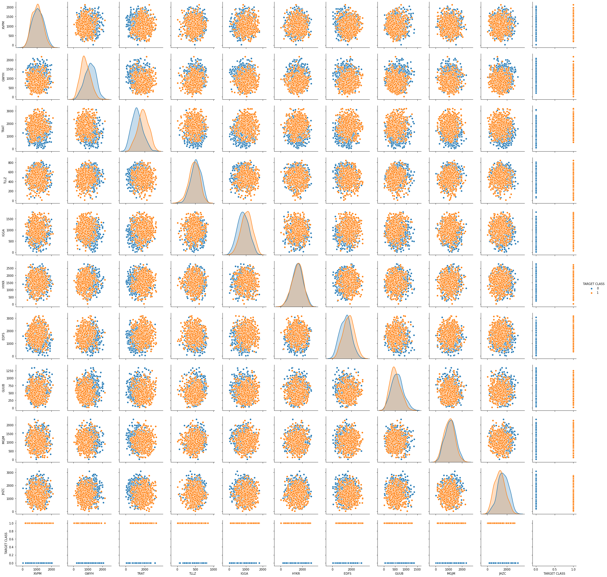
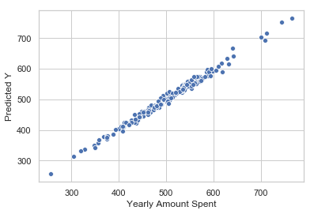
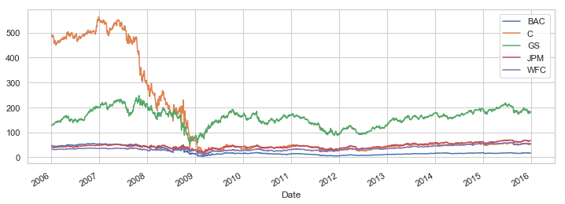

# K Nearest Neighbors Project 

Welcome to the KNN Project! This will be a simple project very similar to the lecture, except you'll be given another data set. Go ahead and just follow the directions below.
## Import Libraries
**Import pandas,seaborn, and the usual libraries.**


```python
import pandas as pd
import numpy as np
import matplotlib.pyplot as plt
import seaborn as sns
%matplotlib inline
```

## Get the Data
** Read the 'KNN_Project_Data csv file into a dataframe **


```python
df = pd.read_csv('KNN_Project_Data')
```

**Check the head of the dataframe.**


```python
df.head()
```


<div>
<style scoped>
    .dataframe tbody tr th:only-of-type {
        vertical-align: middle;
    }

    .dataframe tbody tr th {
        vertical-align: top;
    }

    .dataframe thead th {
        text-align: right;
    }
</style>
<table border="1" class="dataframe">
  <thead>
    <tr style="text-align: right;">
      <th></th>
      <th>XVPM</th>
      <th>GWYH</th>
      <th>TRAT</th>
      <th>TLLZ</th>
      <th>IGGA</th>
      <th>HYKR</th>
      <th>EDFS</th>
      <th>GUUB</th>
      <th>MGJM</th>
      <th>JHZC</th>
      <th>TARGET CLASS</th>
    </tr>
  </thead>
  <tbody>
    <tr>
      <th>0</th>
      <td>1636.670614</td>
      <td>817.988525</td>
      <td>2565.995189</td>
      <td>358.347163</td>
      <td>550.417491</td>
      <td>1618.870897</td>
      <td>2147.641254</td>
      <td>330.727893</td>
      <td>1494.878631</td>
      <td>845.136088</td>
      <td>0</td>
    </tr>
    <tr>
      <th>1</th>
      <td>1013.402760</td>
      <td>577.587332</td>
      <td>2644.141273</td>
      <td>280.428203</td>
      <td>1161.873391</td>
      <td>2084.107872</td>
      <td>853.404981</td>
      <td>447.157619</td>
      <td>1193.032521</td>
      <td>861.081809</td>
      <td>1</td>
    </tr>
    <tr>
      <th>2</th>
      <td>1300.035501</td>
      <td>820.518697</td>
      <td>2025.854469</td>
      <td>525.562292</td>
      <td>922.206261</td>
      <td>2552.355407</td>
      <td>818.676686</td>
      <td>845.491492</td>
      <td>1968.367513</td>
      <td>1647.186291</td>
      <td>1</td>
    </tr>
    <tr>
      <th>3</th>
      <td>1059.347542</td>
      <td>1066.866418</td>
      <td>612.000041</td>
      <td>480.827789</td>
      <td>419.467495</td>
      <td>685.666983</td>
      <td>852.867810</td>
      <td>341.664784</td>
      <td>1154.391368</td>
      <td>1450.935357</td>
      <td>0</td>
    </tr>
    <tr>
      <th>4</th>
      <td>1018.340526</td>
      <td>1313.679056</td>
      <td>950.622661</td>
      <td>724.742174</td>
      <td>843.065903</td>
      <td>1370.554164</td>
      <td>905.469453</td>
      <td>658.118202</td>
      <td>539.459350</td>
      <td>1899.850792</td>
      <td>0</td>
    </tr>
  </tbody>
</table>
</div>


# EDA

Since this data is artificial, we'll just do a large pairplot with seaborn.

**Use seaborn on the dataframe to create a pairplot with the hue indicated by the TARGET CLASS column.**


```python
sns.pairplot(data=df,hue='TARGET CLASS')
```

    C:\Users\User\Anaconda3\lib\site-packages\statsmodels\nonparametric\kde.py:487: RuntimeWarning: invalid value encountered in true_divide
      binned = fast_linbin(X, a, b, gridsize) / (delta * nobs)
    C:\Users\User\Anaconda3\lib\site-packages\statsmodels\nonparametric\kdetools.py:34: RuntimeWarning: invalid value encountered in double_scalars
      FAC1 = 2*(np.pi*bw/RANGE)**2
    


    <seaborn.axisgrid.PairGrid at 0x25722e8b160>





# Standardize the Variables

Time to standardize the variables.

** Import StandardScaler from Scikit learn.**


```python
from sklearn.preprocessing import StandardScaler
```

** Create a StandardScaler() object called scaler.**


```python
scaler = StandardScaler()
```

** Fit scaler to the features.**


```python
df
```


<div>
<style scoped>
    .dataframe tbody tr th:only-of-type {
        vertical-align: middle;
    }

    .dataframe tbody tr th {
        vertical-align: top;
    }

    .dataframe thead th {
        text-align: right;
    }
</style>
<table border="1" class="dataframe">
  <thead>
    <tr style="text-align: right;">
      <th></th>
      <th>XVPM</th>
      <th>GWYH</th>
      <th>TRAT</th>
      <th>TLLZ</th>
      <th>IGGA</th>
      <th>HYKR</th>
      <th>EDFS</th>
      <th>GUUB</th>
      <th>MGJM</th>
      <th>JHZC</th>
      <th>TARGET CLASS</th>
    </tr>
  </thead>
  <tbody>
    <tr>
      <th>0</th>
      <td>1636.670614</td>
      <td>817.988525</td>
      <td>2565.995189</td>
      <td>358.347163</td>
      <td>550.417491</td>
      <td>1618.870897</td>
      <td>2147.641254</td>
      <td>330.727893</td>
      <td>1494.878631</td>
      <td>845.136088</td>
      <td>0</td>
    </tr>
    <tr>
      <th>1</th>
      <td>1013.402760</td>
      <td>577.587332</td>
      <td>2644.141273</td>
      <td>280.428203</td>
      <td>1161.873391</td>
      <td>2084.107872</td>
      <td>853.404981</td>
      <td>447.157619</td>
      <td>1193.032521</td>
      <td>861.081809</td>
      <td>1</td>
    </tr>
    <tr>
      <th>2</th>
      <td>1300.035501</td>
      <td>820.518697</td>
      <td>2025.854469</td>
      <td>525.562292</td>
      <td>922.206261</td>
      <td>2552.355407</td>
      <td>818.676686</td>
      <td>845.491492</td>
      <td>1968.367513</td>
      <td>1647.186291</td>
      <td>1</td>
    </tr>
    <tr>
      <th>3</th>
      <td>1059.347542</td>
      <td>1066.866418</td>
      <td>612.000041</td>
      <td>480.827789</td>
      <td>419.467495</td>
      <td>685.666983</td>
      <td>852.867810</td>
      <td>341.664784</td>
      <td>1154.391368</td>
      <td>1450.935357</td>
      <td>0</td>
    </tr>
    <tr>
      <th>4</th>
      <td>1018.340526</td>
      <td>1313.679056</td>
      <td>950.622661</td>
      <td>724.742174</td>
      <td>843.065903</td>
      <td>1370.554164</td>
      <td>905.469453</td>
      <td>658.118202</td>
      <td>539.459350</td>
      <td>1899.850792</td>
      <td>0</td>
    </tr>
    <tr>
      <th>...</th>
      <td>...</td>
      <td>...</td>
      <td>...</td>
      <td>...</td>
      <td>...</td>
      <td>...</td>
      <td>...</td>
      <td>...</td>
      <td>...</td>
      <td>...</td>
      <td>...</td>
    </tr>
    <tr>
      <th>995</th>
      <td>1343.060600</td>
      <td>1289.142057</td>
      <td>407.307449</td>
      <td>567.564764</td>
      <td>1000.953905</td>
      <td>919.602401</td>
      <td>485.269059</td>
      <td>668.007397</td>
      <td>1124.772996</td>
      <td>2127.628290</td>
      <td>0</td>
    </tr>
    <tr>
      <th>996</th>
      <td>938.847057</td>
      <td>1142.884331</td>
      <td>2096.064295</td>
      <td>483.242220</td>
      <td>522.755771</td>
      <td>1703.169782</td>
      <td>2007.548635</td>
      <td>533.514816</td>
      <td>379.264597</td>
      <td>567.200545</td>
      <td>1</td>
    </tr>
    <tr>
      <th>997</th>
      <td>921.994822</td>
      <td>607.996901</td>
      <td>2065.482529</td>
      <td>497.107790</td>
      <td>457.430427</td>
      <td>1577.506205</td>
      <td>1659.197738</td>
      <td>186.854577</td>
      <td>978.340107</td>
      <td>1943.304912</td>
      <td>1</td>
    </tr>
    <tr>
      <th>998</th>
      <td>1157.069348</td>
      <td>602.749160</td>
      <td>1548.809995</td>
      <td>646.809528</td>
      <td>1335.737820</td>
      <td>1455.504390</td>
      <td>2788.366441</td>
      <td>552.388107</td>
      <td>1264.818079</td>
      <td>1331.879020</td>
      <td>1</td>
    </tr>
    <tr>
      <th>999</th>
      <td>1287.150025</td>
      <td>1303.600085</td>
      <td>2247.287535</td>
      <td>664.362479</td>
      <td>1132.682562</td>
      <td>991.774941</td>
      <td>2007.676371</td>
      <td>251.916948</td>
      <td>846.167511</td>
      <td>952.895751</td>
      <td>1</td>
    </tr>
  </tbody>
</table>
<p>1000 rows × 11 columns</p>
</div>


```python
scaler.fit(df.drop('TARGET CLASS',axis=1))
```


    StandardScaler(copy=True, with_mean=True, with_std=True)


**Use the .transform() method to transform the features to a scaled version.**


```python
scaled_features = scaler.transform(df.drop('TARGET CLASS',axis=1))
scaled_features
```


    array([[ 1.56852168, -0.44343461,  1.61980773, ..., -0.93279392,
             1.00831307, -1.06962723],
           [-0.11237594, -1.05657361,  1.7419175 , ..., -0.46186435,
             0.25832069, -1.04154625],
           [ 0.66064691, -0.43698145,  0.77579285, ...,  1.14929806,
             2.1847836 ,  0.34281129],
           ...,
           [-0.35889496, -0.97901454,  0.83771499, ..., -1.51472604,
            -0.27512225,  0.86428656],
           [ 0.27507999, -0.99239881,  0.0303711 , ..., -0.03623294,
             0.43668516, -0.21245586],
           [ 0.62589594,  0.79510909,  1.12180047, ..., -1.25156478,
            -0.60352946, -0.87985868]])


**Convert the scaled features to a dataframe and check the head of this dataframe to make sure the scaling worked.**


```python
df.columns[:-1]
```


    Index(['XVPM', 'GWYH', 'TRAT', 'TLLZ', 'IGGA', 'HYKR', 'EDFS', 'GUUB', 'MGJM',
           'JHZC'],
          dtype='object')


```python
df_feat = pd.DataFrame(scaled_features,columns=df.columns[:-1])
```


```python
df_feat.head()
```


<div>
<style scoped>
    .dataframe tbody tr th:only-of-type {
        vertical-align: middle;
    }

    .dataframe tbody tr th {
        vertical-align: top;
    }

    .dataframe thead th {
        text-align: right;
    }
</style>
<table border="1" class="dataframe">
  <thead>
    <tr style="text-align: right;">
      <th></th>
      <th>XVPM</th>
      <th>GWYH</th>
      <th>TRAT</th>
      <th>TLLZ</th>
      <th>IGGA</th>
      <th>HYKR</th>
      <th>EDFS</th>
      <th>GUUB</th>
      <th>MGJM</th>
      <th>JHZC</th>
    </tr>
  </thead>
  <tbody>
    <tr>
      <th>0</th>
      <td>1.568522</td>
      <td>-0.443435</td>
      <td>1.619808</td>
      <td>-0.958255</td>
      <td>-1.128481</td>
      <td>0.138336</td>
      <td>0.980493</td>
      <td>-0.932794</td>
      <td>1.008313</td>
      <td>-1.069627</td>
    </tr>
    <tr>
      <th>1</th>
      <td>-0.112376</td>
      <td>-1.056574</td>
      <td>1.741918</td>
      <td>-1.504220</td>
      <td>0.640009</td>
      <td>1.081552</td>
      <td>-1.182663</td>
      <td>-0.461864</td>
      <td>0.258321</td>
      <td>-1.041546</td>
    </tr>
    <tr>
      <th>2</th>
      <td>0.660647</td>
      <td>-0.436981</td>
      <td>0.775793</td>
      <td>0.213394</td>
      <td>-0.053171</td>
      <td>2.030872</td>
      <td>-1.240707</td>
      <td>1.149298</td>
      <td>2.184784</td>
      <td>0.342811</td>
    </tr>
    <tr>
      <th>3</th>
      <td>0.011533</td>
      <td>0.191324</td>
      <td>-1.433473</td>
      <td>-0.100053</td>
      <td>-1.507223</td>
      <td>-1.753632</td>
      <td>-1.183561</td>
      <td>-0.888557</td>
      <td>0.162310</td>
      <td>-0.002793</td>
    </tr>
    <tr>
      <th>4</th>
      <td>-0.099059</td>
      <td>0.820815</td>
      <td>-0.904346</td>
      <td>1.609015</td>
      <td>-0.282065</td>
      <td>-0.365099</td>
      <td>-1.095644</td>
      <td>0.391419</td>
      <td>-1.365603</td>
      <td>0.787762</td>
    </tr>
  </tbody>
</table>
</div>


# Train Test Split

**Use train_test_split to split your data into a training set and a testing set.**


```python
X = df_feat
y = df['TARGET CLASS']
```


```python
from sklearn.model_selection import train_test_split
X_train, X_test, y_train, y_test = train_test_split(X, y, test_size=0.3, random_state=101)
```

# Using KNN

**Import KNeighborsClassifier from scikit learn.**


```python
from sklearn import neighbors

```

**Create a KNN model instance with n_neighbors=1**


```python
knn = neighbors.KNeighborsClassifier(n_neighbors=1)
```

**Fit this KNN model to the training data.**


```python
knn.fit(X_train,y_train)
```


    KNeighborsClassifier(algorithm='auto', leaf_size=30, metric='minkowski',
                         metric_params=None, n_jobs=None, n_neighbors=1, p=2,
                         weights='uniform')


# Predictions and Evaluations
Let's evaluate our KNN model!

**Use the predict method to predict values using your KNN model and X_test.**


```python
pred = knn.predict(X_test)
```

** Create a confusion matrix and classification report.**


```python
from sklearn.metrics import classification_report as cr, confusion_matrix as cm
```


```python
print(cm(y_test,pred))
```

    [[109  43]
     [ 41 107]]
    


```python
print(cr(y_test,pred))
```

                  precision    recall  f1-score   support
    
               0       0.73      0.72      0.72       152
               1       0.71      0.72      0.72       148
    
        accuracy                           0.72       300
       macro avg       0.72      0.72      0.72       300
    weighted avg       0.72      0.72      0.72       300
    
    

# Choosing a K Value
Let's go ahead and use the elbow method to pick a good K Value!

** Create a for loop that trains various KNN models with different k values, then keep track of the error_rate for each of these models with a list. Refer to the lecture if you are confused on this step.**


```python
error_rate = []

for i in range(1,60):
    knn = neighbors.KNeighborsClassifier(n_neighbors=i)
    knn.fit(X_train,y_train)
    pred_i = knn.predict(X_test)
    error_rate.append(np.mean(pred_i != y_test))
```

**Now create the following plot using the information from your for loop.**


```python
sns.set()
plt.figure(figsize=(16,6))
sns.set_style('darkgrid')
plt.plot(range(1,60),error_rate,marker='o',markerfacecolor='red',markersize=10)
```


    [<matplotlib.lines.Line2D at 0x2572aeb09b0>]





```python
er = pd.DataFrame(error_rate)
er['error_rate'] = er
er.drop(0,axis=1,inplace=True)
er['k values'] = range(1,60)
m = er['error_rate'].min()
best=er[er['error_rate']==m]
best
```


<div>
<style scoped>
    .dataframe tbody tr th:only-of-type {
        vertical-align: middle;
    }

    .dataframe tbody tr th {
        vertical-align: top;
    }

    .dataframe thead th {
        text-align: right;
    }
</style>
<table border="1" class="dataframe">
  <thead>
    <tr style="text-align: right;">
      <th></th>
      <th>error_rate</th>
      <th>k values</th>
    </tr>
  </thead>
  <tbody>
    <tr>
      <th>30</th>
      <td>0.16</td>
      <td>31</td>
    </tr>
    <tr>
      <th>36</th>
      <td>0.16</td>
      <td>37</td>
    </tr>
    <tr>
      <th>38</th>
      <td>0.16</td>
      <td>39</td>
    </tr>
    <tr>
      <th>52</th>
      <td>0.16</td>
      <td>53</td>
    </tr>
    <tr>
      <th>53</th>
      <td>0.16</td>
      <td>54</td>
    </tr>
  </tbody>
</table>
</div>


## Retrain with new K Value

**Retrain your model with the best K value (up to you to decide what you want) and re-do the classification report and the confusion matrix.**


```python
n_neighbors=39
knn2 = neighbors.KNeighborsClassifier(n_neighbors)
knn2.fit(X_train,y_train)
pred2 = knn2.predict(X_test)


print('with k =',n_neighbors)
print('\n')
from sklearn.metrics import confusion_matrix 
def plot_cm(y_true, predictions, figsize=(5,4)):
    cm = confusion_matrix(y_test, pred2, labels=np.unique(y_true))
    cm_sum = np.sum(cm, axis=1, keepdims=True)
    cm_perc = cm / cm_sum.astype(float) * 100
    annot = np.empty_like(cm).astype(str)
    nrows, ncols = cm.shape
    for i in range(nrows):
        for j in range(ncols):
            c = cm[i, j]
            p = cm_perc[i, j]
            if i == j:
                s = cm_sum[i]
                annot[i, j] = '%.1f%%\n%d/%d' % (p, c, s)
            elif c == 0:
                annot[i, j] = ''
            else:
                annot[i, j] = '%.1f%%\n%d' % (p, c)
    cm = pd.DataFrame(cm, index=np.unique(y_test), columns=np.unique(y_test))
    cm.index.name = 'Actual'
    cm.columns.name = 'Predicted'
    fig, ax = plt.subplots(figsize=figsize)
    annot_kws = {"ha": 'left',"va": 'bottom'}
    
    ae = sns.heatmap(cm, cmap= "YlGnBu", annot=annot,fmt='', ax=ax)
    bottom, top = ae.get_ylim()
    ae.set_ylim(bottom + 0.5, top - 0.5)
#print(cm(y_test,pred2))
plot_cm(y_test, pred2)
plt.tight_layout()


#print(cr(y_test,pred2))
```

    with k = 39
    
    
    





```python
print(cr(y_test,pred2))
```

                  precision    recall  f1-score   support
    
               0       0.86      0.82      0.84       152
               1       0.82      0.86      0.84       148
    
        accuracy                           0.84       300
       macro avg       0.84      0.84      0.84       300
    weighted avg       0.84      0.84      0.84       300
    
    

# Great Job!
